# Verification Workflow

> **Relevant source files**
> * [client/lib/presentation/screens/environment/environment_overview_screen.dart](https://github.com/axchisan/GestionInventarioSENA/blob/a6b12d01/client/lib/presentation/screens/environment/environment_overview_screen.dart)
> * [client/lib/presentation/screens/environment/manage_schedules_screen.dart](https://github.com/axchisan/GestionInventarioSENA/blob/a6b12d01/client/lib/presentation/screens/environment/manage_schedules_screen.dart)
> * [client/lib/presentation/screens/inventory/edit_inventory_item_screen.dart](https://github.com/axchisan/GestionInventarioSENA/blob/a6b12d01/client/lib/presentation/screens/inventory/edit_inventory_item_screen.dart)
> * [client/lib/presentation/screens/inventory/inventory_check_screen.dart](https://github.com/axchisan/GestionInventarioSENA/blob/a6b12d01/client/lib/presentation/screens/inventory/inventory_check_screen.dart)
> * [server/app/routers/inventory_checks.py](https://github.com/axchisan/GestionInventarioSENA/blob/a6b12d01/server/app/routers/inventory_checks.py)

## Purpose and Scope

This document describes the three-stage inventory verification workflow implemented in the SENA Inventory Management System. The workflow enforces an approval chain where students initiate inventory checks, instructors review the physical condition of the environment, and supervisors provide final approval. This process ensures accountability and data accuracy across all inventory verifications.

For information about the UI used to conduct inventory checks, see [Inventory Check Screen](/axchisan/GestionInventarioSENA/5.1-inventory-check-screen). For details about the backend API endpoints, see [Inventory Check API](/axchisan/GestionInventarioSENA/5.3-inventory-check-api).

---

## Workflow Overview

The verification workflow implements a hierarchical approval process with automatic status transitions based on role actions and data validation results. Each stage in the workflow has specific responsibilities and triggers notifications to the next participant.

### Three-Stage Approval Chain

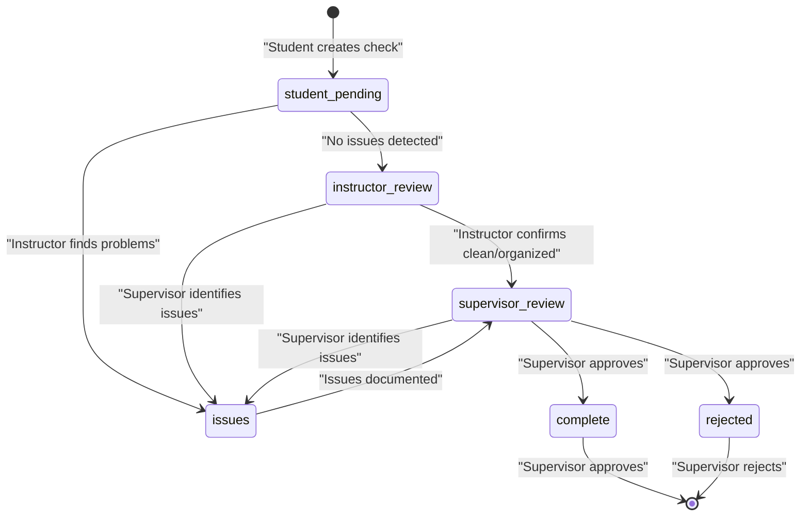

**Sources:** [server/app/routers/inventory_checks.py L153-L328](https://github.com/axchisan/GestionInventarioSENA/blob/a6b12d01/server/app/routers/inventory_checks.py#L153-L328)

 [client/lib/presentation/screens/inventory/inventory_check_screen.dart L812-L880](https://github.com/axchisan/GestionInventarioSENA/blob/a6b12d01/client/lib/presentation/screens/inventory/inventory_check_screen.dart#L812-L880)

The workflow uses the following status values defined in the `InventoryCheck` model:

* `student_pending` - Initial state after student creation
* `instructor_review` - Awaiting instructor confirmation
* `supervisor_review` - Awaiting supervisor approval
* `complete` - Verification successfully completed
* `issues` - Problems detected requiring attention
* `rejected` - Supervisor rejected the verification

---

## Role-Based Workflow Stages

### Stage 1: Student Verification

Students initiate the verification process by creating an `InventoryCheck` record associated with a schedule and environment. The system automatically calculates verification totals based on current inventory item states.

**Student Responsibilities:**

* Select schedule/shift for verification
* Document cleaning status via `cleaning_notes`
* System automatically captures item counts via `calculate_verification_totals()`

**Key Functions:**

The `calculate_verification_totals()` function aggregates inventory item states:

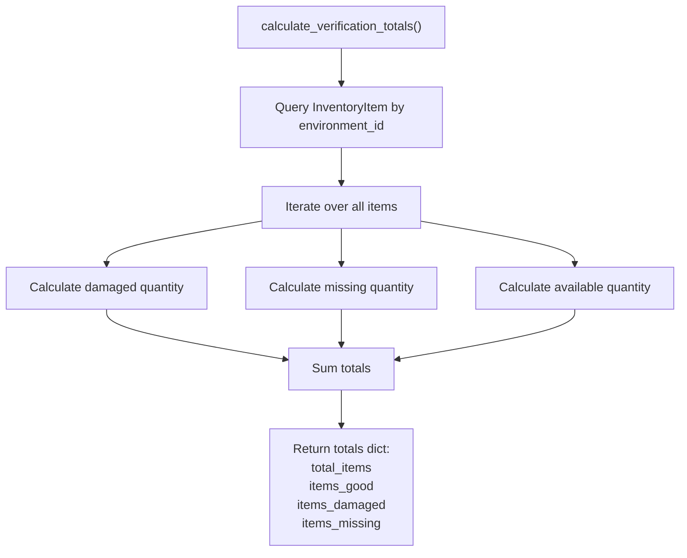

**Sources:** [server/app/routers/inventory_checks.py L49-L79](https://github.com/axchisan/GestionInventarioSENA/blob/a6b12d01/server/app/routers/inventory_checks.py#L49-L79)

**Status Transition Logic:**

After student creates verification, the system determines initial status:

* If `items_damaged > 0` OR `items_missing > 0` → status = `issues`
* Otherwise → status = `instructor_review`

**Notification:** System creates notification for the schedule's assigned instructor:

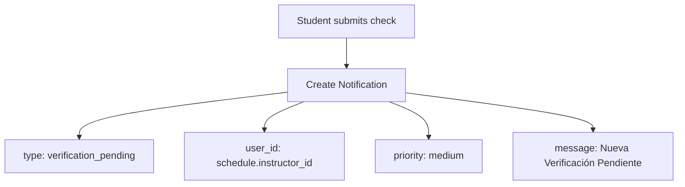

**Sources:** [server/app/routers/inventory_checks.py L134-L149](https://github.com/axchisan/GestionInventarioSENA/blob/a6b12d01/server/app/routers/inventory_checks.py#L134-L149)

 [server/app/routers/inventory_checks.py L302-L310](https://github.com/axchisan/GestionInventarioSENA/blob/a6b12d01/server/app/routers/inventory_checks.py#L302-L310)

### Stage 2: Instructor Review

Instructors review the physical environment condition and confirm or identify issues. They can only act on checks in `student_pending` or `instructor_review` status.

**Instructor Responsibilities:**

* Verify environment cleanliness via `is_clean` boolean
* Verify organization via `is_organized` boolean
* Confirm inventory completeness via `inventory_complete` boolean
* Add comments via `instructor_comments`

**Endpoint:** `PUT /api/inventory-checks/{check_id}/confirm`

The instructor confirmation endpoint updates the check:

| Field | Purpose |
| --- | --- |
| `instructor_id` | Set to `current_user.id` |
| `is_clean` | Boolean flag from request |
| `is_organized` | Boolean flag from request |
| `inventory_complete` | Boolean flag from request |
| `instructor_comments` | Text comments |
| `instructor_confirmed_at` | Timestamp in Colombian timezone |

**Status Transition Logic:**

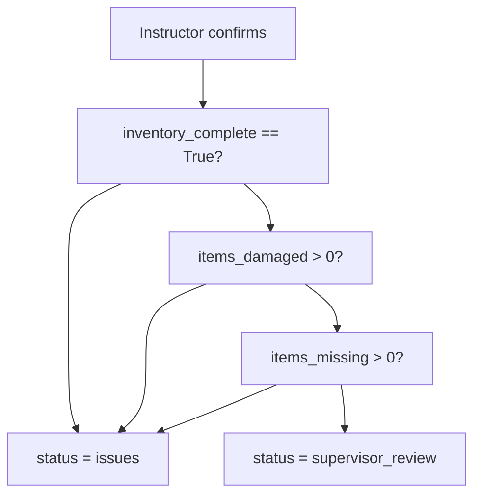

**Sources:** [server/app/routers/inventory_checks.py L329-L430](https://github.com/axchisan/GestionInventarioSENA/blob/a6b12d01/server/app/routers/inventory_checks.py#L329-L430)

 [server/app/routers/inventory_checks.py L351-L366](https://github.com/axchisan/GestionInventarioSENA/blob/a6b12d01/server/app/routers/inventory_checks.py#L351-L366)

**Notification:** System notifies all supervisors in the environment:

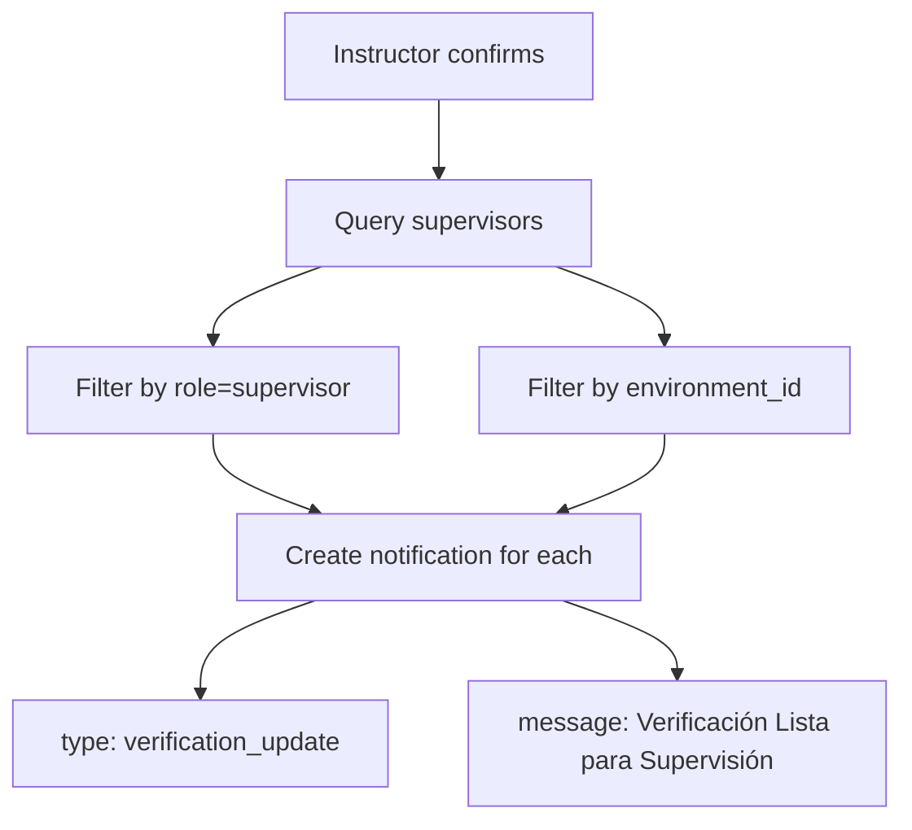

**Sources:** [server/app/routers/inventory_checks.py L391-L404](https://github.com/axchisan/GestionInventarioSENA/blob/a6b12d01/server/app/routers/inventory_checks.py#L391-L404)

### Stage 3: Supervisor Approval

Supervisors provide final approval or rejection of the verification. They have the authority to complete the instructor step if not yet done, enabling workflow recovery.

**Supervisor Responsibilities:**

* Review all previous verification data
* Can set `is_clean`, `is_organized`, `inventory_complete` if instructor skipped
* Provide `supervisor_comments`
* Make final approval decision

**Special Authority:**

Supervisors can act as instructors if the instructor step was not completed:

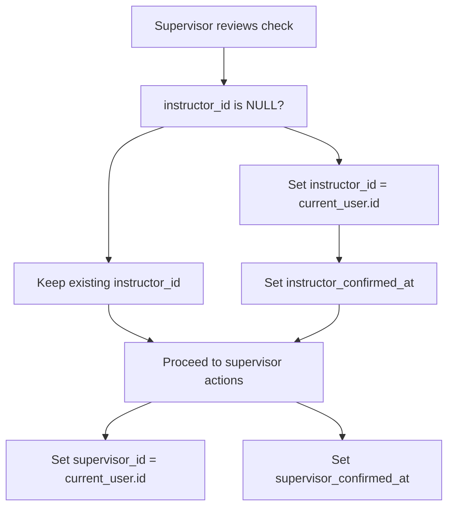

**Sources:** [server/app/routers/inventory_checks.py L368-L385](https://github.com/axchisan/GestionInventarioSENA/blob/a6b12d01/server/app/routers/inventory_checks.py#L368-L385)

**Status Transition Logic:**

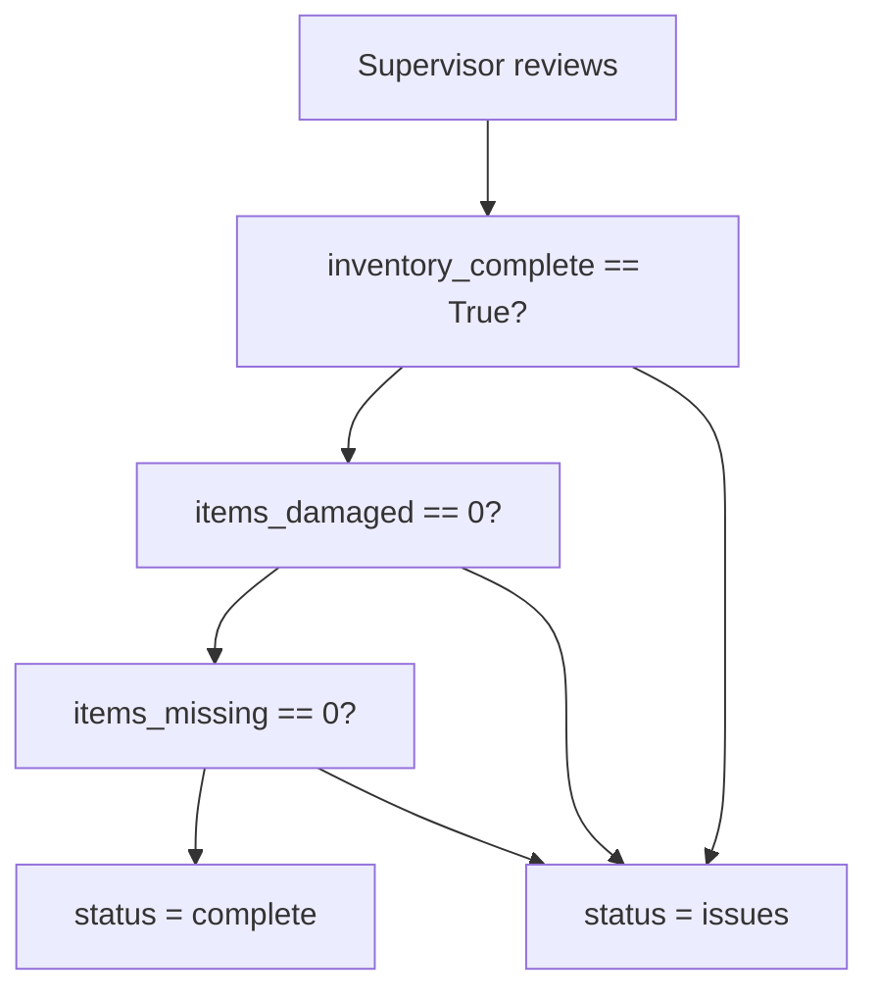

**Sources:** [server/app/routers/inventory_checks.py L381-L385](https://github.com/axchisan/GestionInventarioSENA/blob/a6b12d01/server/app/routers/inventory_checks.py#L381-L385)

**Notifications:** System notifies both student and instructor:

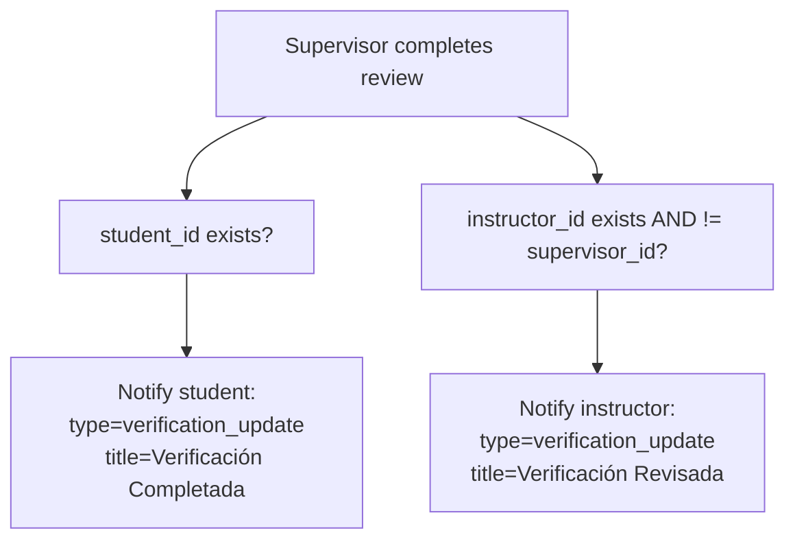

**Sources:** [server/app/routers/inventory_checks.py L406-L427](https://github.com/axchisan/GestionInventarioSENA/blob/a6b12d01/server/app/routers/inventory_checks.py#L406-L427)

---

## Schedule-Based Verification Creation

The system provides a unified endpoint `/api/inventory-checks/by-schedule` that allows any authorized role to create or update verifications for a specific schedule and date. This endpoint handles the workflow differently based on the user's role.

### Request Schema

The `VerificationByScheduleRequest` schema accepts:

| Field | Type | Required | Purpose |
| --- | --- | --- | --- |
| `environment_id` | UUID | Yes | Target environment |
| `schedule_id` | UUID | Yes | Associated schedule |
| `is_clean` | bool | No | Environment cleanliness |
| `is_organized` | bool | No | Environment organization |
| `inventory_complete` | bool | No | Inventory completeness |
| `cleaning_notes` | str | No | Cleaning observations |
| `comments` | str | No | General comments |

**Sources:** [server/app/routers/inventory_checks.py L39-L47](https://github.com/axchisan/GestionInventarioSENA/blob/a6b12d01/server/app/routers/inventory_checks.py#L39-L47)

### Role-Based Creation Logic

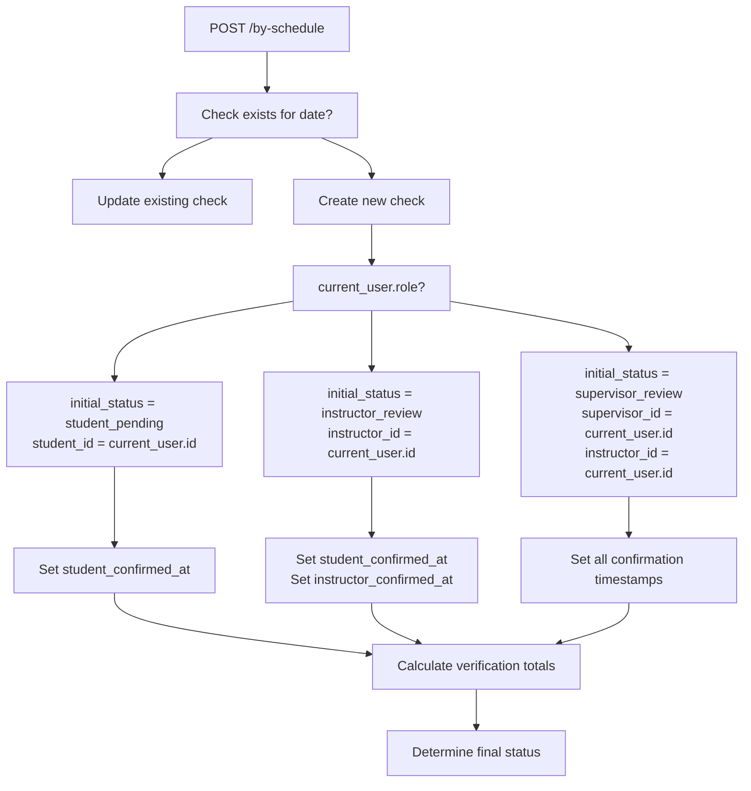

**Sources:** [server/app/routers/inventory_checks.py L153-L327](https://github.com/axchisan/GestionInventarioSENA/blob/a6b12d01/server/app/routers/inventory_checks.py#L153-L327)

### Update Logic for Existing Checks

When a check already exists for the schedule and date:

**Student Update:**

* Can only update if status is `student_pending`
* Updates `cleaning_notes`
* Updates `student_confirmed_at` timestamp

**Instructor Update:**

* Can update if status is `student_pending` or `instructor_review`
* Sets `instructor_id`, `is_clean`, `is_organized`, `inventory_complete`
* Sets `instructor_comments` and `instructor_confirmed_at`
* Transitions status based on validation results

**Supervisor Update:**

* Can complete instructor step if not done
* Sets all supervisor fields
* Makes final status determination
* Can override to `complete` or `issues`

**Sources:** [server/app/routers/inventory_checks.py L180-L228](https://github.com/axchisan/GestionInventarioSENA/blob/a6b12d01/server/app/routers/inventory_checks.py#L180-L228)

---

## Verification Totals Calculation

The `calculate_verification_totals()` function is the core data aggregation mechanism that computes inventory statistics from the current state of `InventoryItem` records.

### Calculation Algorithm

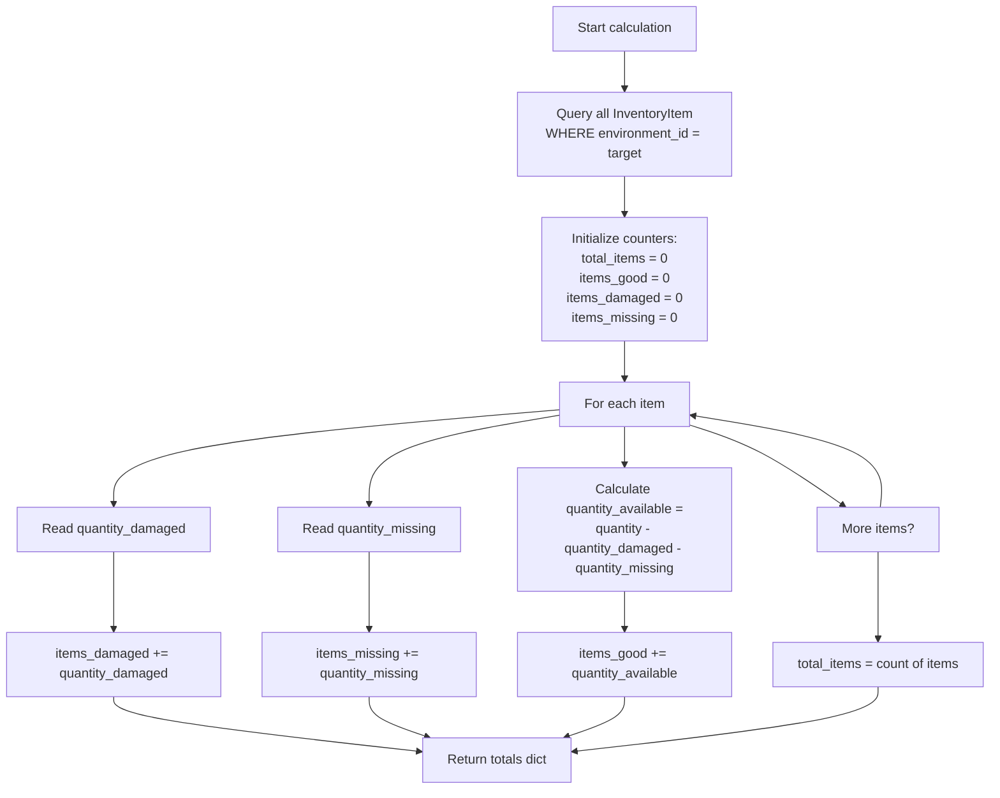

**Sources:** [server/app/routers/inventory_checks.py L49-L79](https://github.com/axchisan/GestionInventarioSENA/blob/a6b12d01/server/app/routers/inventory_checks.py#L49-L79)

### Totals Storage in InventoryCheck

The calculated totals are stored directly in the `InventoryCheck` record:

| Field | Description |
| --- | --- |
| `total_items` | Total count of distinct inventory items |
| `items_good` | Sum of available quantities across all items |
| `items_damaged` | Sum of damaged quantities across all items |
| `items_missing` | Sum of missing quantities across all items |

These totals are recalculated on every check creation and update to ensure data consistency with the current inventory state.

**Sources:** [server/app/routers/inventory_checks.py L110-L127](https://github.com/axchisan/GestionInventarioSENA/blob/a6b12d01/server/app/routers/inventory_checks.py#L110-L127)

 [server/app/routers/inventory_checks.py L180-L185](https://github.com/axchisan/GestionInventarioSENA/blob/a6b12d01/server/app/routers/inventory_checks.py#L180-L185)

---

## Timestamp Management

The system uses Colombian timezone (`America/Bogota`) for all timestamps to ensure consistency across deployments.

### Timezone Utilities

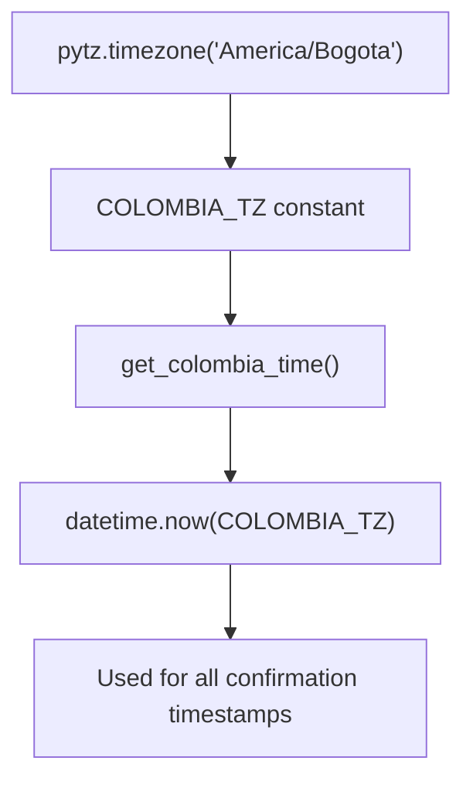

**Sources:** [server/app/routers/inventory_checks.py L23-L27](https://github.com/axchisan/GestionInventarioSENA/blob/a6b12d01/server/app/routers/inventory_checks.py#L23-L27)

### Confirmation Timestamps

Each stage records its own confirmation timestamp:

| Timestamp Field | Set By | Purpose |
| --- | --- | --- |
| `student_confirmed_at` | Student | Records when student completed initial check |
| `instructor_confirmed_at` | Instructor | Records when instructor reviewed environment |
| `supervisor_confirmed_at` | Supervisor | Records when supervisor approved/rejected |
| `created_at` | System | Record creation time |
| `updated_at` | System | Last modification time |

**Sources:** [server/app/routers/inventory_checks.py L112-L127](https://github.com/axchisan/GestionInventarioSENA/blob/a6b12d01/server/app/routers/inventory_checks.py#L112-L127)

 [server/app/routers/inventory_checks.py L268-L276](https://github.com/axchisan/GestionInventarioSENA/blob/a6b12d01/server/app/routers/inventory_checks.py#L268-L276)

---

## Permission and Access Control

The workflow enforces role-based permissions at the API level using the `get_current_user` dependency.

### Role-Based Endpoint Access

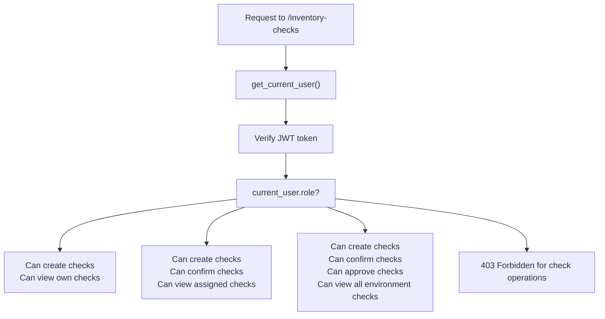

**Sources:** [server/app/routers/inventory_checks.py L81-L88](https://github.com/axchisan/GestionInventarioSENA/blob/a6b12d01/server/app/routers/inventory_checks.py#L81-L88)

 [server/app/routers/inventory_checks.py L619-L630](https://github.com/axchisan/GestionInventarioSENA/blob/a6b12d01/server/app/routers/inventory_checks.py#L619-L630)

### Environment-Based Filtering

Query operations automatically filter by user's environment unless explicitly overridden:

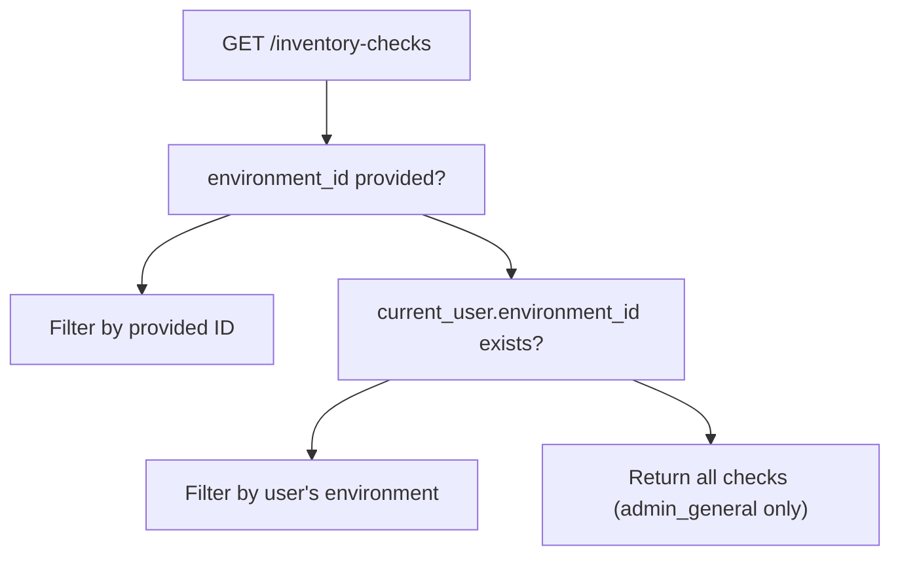

**Sources:** [server/app/routers/inventory_checks.py L589-L595](https://github.com/axchisan/GestionInventarioSENA/blob/a6b12d01/server/app/routers/inventory_checks.py#L589-L595)

---

## Client-Side Workflow Implementation

The Flutter client implements workflow UI in `InventoryCheckScreen` with role-based conditional rendering.

### Permission Checks

The client determines whether a user can verify based on role and current check status:

```
bool canVerify = false;
if (_selectedScheduleId != null) {
  if (role == 'student') {
    canVerify = _currentScheduleCheck == null;
  } else if (role == 'instructor') {
    canVerify = _currentScheduleCheck == null || 
                _currentStatus == 'instructor_review';
  } else if (role == 'supervisor') {
    canVerify = _currentScheduleCheck == null || 
                _currentStatus != 'complete';
  }
}
```

**Sources:** [client/lib/presentation/screens/inventory/inventory_check_screen.dart L887-L896](https://github.com/axchisan/GestionInventarioSENA/blob/a6b12d01/client/lib/presentation/screens/inventory/inventory_check_screen.dart#L887-L896)

### Save Check Function

The `_saveCheck()` function handles client-side submission to the by-schedule endpoint:

**Request Parameters:**

| Parameter | Source | Type |
| --- | --- | --- |
| `environment_id` | `authProvider.currentUser.environmentId` | String |
| `schedule_id` | `_selectedScheduleId` | String |
| `is_clean` | Dialog input | bool |
| `is_organized` | Dialog input | bool |
| `inventory_complete` | Dialog input | bool |
| `cleaning_notes` | `_cleaningNotesController.text` | String |
| `comments` | Dialog input | String |

**Sources:** [client/lib/presentation/screens/inventory/inventory_check_screen.dart L812-L880](https://github.com/axchisan/GestionInventarioSENA/blob/a6b12d01/client/lib/presentation/screens/inventory/inventory_check_screen.dart#L812-L880)

### Status Visualization

The client displays check status with color-coded indicators:

| Status Value | Translated Display | Color |
| --- | --- | --- |
| `pending` | Pendiente | Secondary |
| `instructor_review` | Revisión Instructor | Warning (Orange) |
| `supervisor_review` | Revisión Supervisor | Info (Blue) |
| `complete` | Completo | Success (Green) |
| `issues` | Problemas | (Context-dependent) |
| `incomplete` | Incompleto | (Context-dependent) |

**Sources:** [client/lib/presentation/screens/inventory/inventory_check_screen.dart L62-L76](https://github.com/axchisan/GestionInventarioSENA/blob/a6b12d01/client/lib/presentation/screens/inventory/inventory_check_screen.dart#L62-L76)

 [client/lib/presentation/screens/inventory/inventory_check_screen.dart L268-L293](https://github.com/axchisan/GestionInventarioSENA/blob/a6b12d01/client/lib/presentation/screens/inventory/inventory_check_screen.dart#L268-L293)

---

## Error Handling and Validation

### Backend Validations

The API enforces several validation rules:

**Duplicate Check Prevention:**

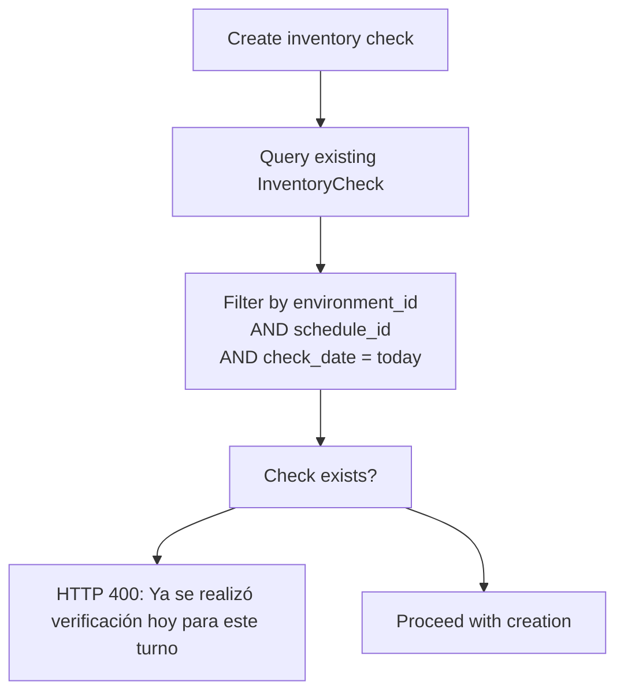

**Sources:** [server/app/routers/inventory_checks.py L102-L108](https://github.com/axchisan/GestionInventarioSENA/blob/a6b12d01/server/app/routers/inventory_checks.py#L102-L108)

 [server/app/routers/inventory_checks.py L174-L178](https://github.com/axchisan/GestionInventarioSENA/blob/a6b12d01/server/app/routers/inventory_checks.py#L174-L178)

**Entity Existence Validation:**

The system validates that referenced entities exist:

* `Environment` must exist for the provided `environment_id`
* `Schedule` must exist for the provided `schedule_id`
* `User` (student) must exist and have role=`student` for explicit student checks

**Sources:** [server/app/routers/inventory_checks.py L90-L100](https://github.com/axchisan/GestionInventarioSENA/blob/a6b12d01/server/app/routers/inventory_checks.py#L90-L100)

 [server/app/routers/inventory_checks.py L163-L169](https://github.com/axchisan/GestionInventarioSENA/blob/a6b12d01/server/app/routers/inventory_checks.py#L163-L169)

### Client-Side Validations

The client performs pre-submission validation:

* Requires schedule selection before allowing verification
* Validates environment association exists
* Provides user feedback for missing prerequisites

**Sources:** [client/lib/presentation/screens/inventory/inventory_check_screen.dart L819-L824](https://github.com/axchisan/GestionInventarioSENA/blob/a6b12d01/client/lib/presentation/screens/inventory/inventory_check_screen.dart#L819-L824)

 [client/lib/presentation/screens/inventory/inventory_check_screen.dart L86-L98](https://github.com/axchisan/GestionInventarioSENA/blob/a6b12d01/client/lib/presentation/screens/inventory/inventory_check_screen.dart#L86-L98)

---

## Workflow State Machine

The complete verification workflow can be represented as a state machine with role-based transitions:

```

```

**Sources:** [server/app/routers/inventory_checks.py L132-L150](https://github.com/axchisan/GestionInventarioSENA/blob/a6b12d01/server/app/routers/inventory_checks.py#L132-L150)

 [server/app/routers/inventory_checks.py L202-L225](https://github.com/axchisan/GestionInventarioSENA/blob/a6b12d01/server/app/routers/inventory_checks.py#L202-L225)

 [server/app/routers/inventory_checks.py L381-L385](https://github.com/axchisan/GestionInventarioSENA/blob/a6b12d01/server/app/routers/inventory_checks.py#L381-L385)

---

## Related Workflows

The verification workflow integrates with other system workflows:

**Maintenance Request Workflow:** When items are marked as damaged during verification, users can create maintenance requests directly from the inventory check screen via the build icon button.

**Sources:** [client/lib/presentation/screens/inventory/inventory_check_screen.dart L954-L959](https://github.com/axchisan/GestionInventarioSENA/blob/a6b12d01/client/lib/presentation/screens/inventory/inventory_check_screen.dart#L954-L959)

**Notification System:** Each status transition generates notifications to inform relevant users of pending actions (see [Notification System](/axchisan/GestionInventarioSENA/11-notification-system)).

**Schedule Management:** Verifications are tightly coupled to schedules, which define time slots and instructor assignments for environments (see [Environment Management](/axchisan/GestionInventarioSENA/13-environment-management)).

**Audit Logging:** All verification actions are automatically logged by the audit middleware for compliance tracking (see [Audit Middleware](/axchisan/GestionInventarioSENA/10.1-audit-middleware)).