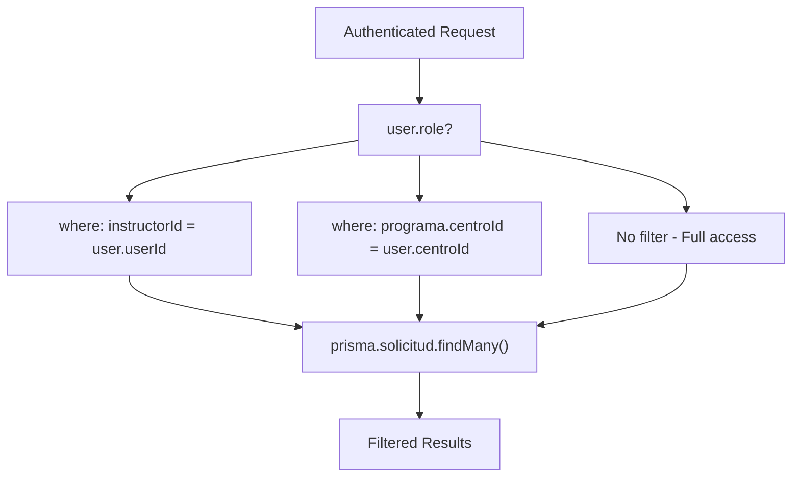

# API Architecture

> **Relevant source files**
> * [app/api/solicitudes/route.ts](https://github.com/axchisan/gestionComplementarias/blob/a3d2dcb4/app/api/solicitudes/route.ts)
> * [next.config.mjs](https://github.com/axchisan/gestionComplementarias/blob/a3d2dcb4/next.config.mjs)

This document provides a technical overview of the backend API architecture, including route organization, middleware patterns, security configuration, and error handling strategies. The API is built using Next.js API Routes with custom middleware for authentication and authorization.

For detailed documentation of specific endpoint implementations, see [Solicitudes Endpoints](/axchisan/gestionComplementarias/6.2-solicitudes-endpoints) and [Authentication Endpoints](/axchisan/gestionComplementarias/6.3-authentication-endpoints). For notification event handling, see [Notification System](/axchisan/gestionComplementarias/6.4-notification-system).

---

## Purpose and Scope

The SENA Gestión Complementarias API follows a RESTful design pattern implemented through Next.js API Routes. All API endpoints are located under the `/api/*` path structure and handle CRUD operations for solicitudes, authentication, user management, and notifications. The architecture emphasizes:

* **Stateless Authentication**: JWT-based token validation on each request
* **Role-Based Authorization**: Middleware-enforced access control with data scoping
* **Type Safety**: Prisma ORM integration for database operations
* **Security-First**: CORS configuration and security headers at the infrastructure level
* **Error Consistency**: Standardized error responses across all endpoints

---

## API Route Organization

The API follows Next.js file-based routing conventions, where each file in the `app/api/` directory defines route handlers for specific HTTP methods.

### Route Structure

```sql
app/api/
├── auth/
│   ├── login/route.ts          # POST - User authentication
│   └── register/route.ts       # POST - New user registration
├── solicitudes/
│   ├── route.ts                # GET, POST - List and create solicitudes
│   ├── [id]/route.ts          # GET, PUT, DELETE - Individual solicitud operations
│   ├── [id]/approve/route.ts  # POST - Approve solicitud
│   ├── [id]/reject/route.ts   # POST - Reject solicitud
│   └── [id]/export/route.ts   # GET - Export to PDF/Excel
├── instructores/
│   ├── route.ts                # GET, POST - Instructor management
│   └── [id]/route.ts          # PUT, DELETE - Individual instructor operations
├── notificaciones/
│   ├── route.ts                # GET - List user notifications
│   └── [id]/mark-read/route.ts # POST - Mark notification as read
├── programas/
│   └── route.ts                # GET - List available programs
└── centros/
    └── route.ts                # GET - List training centers
```

**Sources:** High-level system diagrams, file structure analysis

---

## Middleware Architecture

The API implements a custom authentication middleware that wraps protected endpoints, enforcing JWT validation and injecting user context into request handlers.

### withAuth Middleware Pattern

**Middleware Flow Diagram**

```

```

**Sources:** High-level authentication diagram, API route patterns

### Request Handler Signature

Protected API routes use a consistent handler signature where the middleware injects the authenticated user object:

```

```

The `user` parameter provides:

* `userId` (string): Unique identifier for the authenticated user
* `role` (enum): One of `INSTRUCTOR`, `COORDINADOR`, `ADMIN`
* `centroId` (string): ID of the user's training center

**Sources:** [app/api/solicitudes/route.ts L6](https://github.com/axchisan/gestionComplementarias/blob/a3d2dcb4/app/api/solicitudes/route.ts#L6-L6)

### Role-Based Filtering Pattern

The middleware enables role-based data scoping at the query level. Each endpoint applies filters based on the user's role:

**Role-Based Query Filtering Diagram**



**Implementation Example:**

[app/api/solicitudes/route.ts L15-L22](https://github.com/axchisan/gestionComplementarias/blob/a3d2dcb4/app/api/solicitudes/route.ts#L15-L22)

 demonstrates the filtering pattern:

```

```

**Sources:** [app/api/solicitudes/route.ts L13-L22](https://github.com/axchisan/gestionComplementarias/blob/a3d2dcb4/app/api/solicitudes/route.ts#L13-L22)

---

## Security Configuration

Security is enforced at multiple layers, with infrastructure-level headers configured in Next.js and application-level authentication via JWT.

### CORS Configuration

CORS headers are configured globally in [next.config.mjs L14-L46](https://github.com/axchisan/gestionComplementarias/blob/a3d2dcb4/next.config.mjs#L14-L46)

 and applied to all routes:

| Header | Value | Purpose |
| --- | --- | --- |
| `Access-Control-Allow-Origin` | `https://gestioncomplementarias.axchisan.com` | Restricts API access to production domain |
| `Access-Control-Allow-Methods` | `GET, POST, PUT, DELETE, OPTIONS` | Permitted HTTP methods |
| `Access-Control-Allow-Headers` | `Content-Type, Authorization` | Required headers for authenticated requests |

**Sources:** [next.config.mjs L32-L42](https://github.com/axchisan/gestionComplementarias/blob/a3d2dcb4/next.config.mjs#L32-L42)

### Security Headers

Additional security headers protect against common web vulnerabilities:

| Header | Value | Protection |
| --- | --- | --- |
| `X-Frame-Options` | `DENY` | Prevents clickjacking attacks |
| `X-Content-Type-Options` | `nosniff` | Prevents MIME-type sniffing |
| `Referrer-Policy` | `origin-when-cross-origin` | Controls referrer information leakage |

These headers are configured in [next.config.mjs L18-L30](https://github.com/axchisan/gestionComplementarias/blob/a3d2dcb4/next.config.mjs#L18-L30)

 and automatically applied to all responses.

**Sources:** [next.config.mjs L14-L46](https://github.com/axchisan/gestionComplementarias/blob/a3d2dcb4/next.config.mjs#L14-L46)

### Authentication Token Flow

**JWT Token Lifecycle Diagram**

```mermaid
sequenceDiagram
  participant Client
  participant /api/auth/login
  participant jsonwebtoken
  participant Client Storage
  participant /api/solicitudes
  participant withAuth

  note over Client,jsonwebtoken: Token Generation
  Client->>/api/auth/login: "POST credentials"
  /api/auth/login->>/api/auth/login: "Validate password"
  /api/auth/login->>jsonwebtoken: "sign({userId, role, centroId})"
  jsonwebtoken-->>/api/auth/login: "token string"
  /api/auth/login-->>Client: "{token, user}"
  Client->>Client Storage: "Store token"
  note over Client,withAuth: Token Usage
  Client->>/api/solicitudes: "GET + Authorization: Bearer {token}"
  /api/solicitudes->>withAuth: "Middleware intercepts"
  withAuth->>jsonwebtoken: "verify(token, JWT_SECRET)"
  jsonwebtoken-->>withAuth: "Decoded payload"
  withAuth->>/api/solicitudes: "Inject user context"
  /api/solicitudes-->>Client: "Authorized response"
```

**Token Payload Structure:**

```

```

**Sources:** Authentication flow from high-level diagrams

---

## Error Handling Patterns

All API endpoints follow a consistent error response format with appropriate HTTP status codes.

### Standard Error Response Structure

```

```

### HTTP Status Code Conventions

| Status Code | Usage | Example Scenario |
| --- | --- | --- |
| `200 OK` | Successful GET request | Fetching solicitud list |
| `201 Created` | Successful POST creating resource | Creating new solicitud |
| `400 Bad Request` | Invalid request data | Missing required field |
| `401 Unauthorized` | Authentication failure | Invalid/missing JWT token |
| `403 Forbidden` | Authorization failure | Non-coordinator accessing approval endpoint |
| `404 Not Found` | Resource doesn't exist | Solicitud ID not found |
| `500 Internal Server Error` | Unexpected server error | Database connection failure |

### Error Handling Implementation Pattern

[app/api/solicitudes/route.ts L67-L70](https://github.com/axchisan/gestionComplementarias/blob/a3d2dcb4/app/api/solicitudes/route.ts#L67-L70)

 demonstrates the standard error handling pattern:

```

```

**Best Practices:**

* Always log errors to console for debugging
* Return generic error messages to clients (avoid leaking implementation details)
* Use specific status codes for different error types
* Wrap all async operations in try-catch blocks

**Sources:** [app/api/solicitudes/route.ts L67-L70](https://github.com/axchisan/gestionComplementarias/blob/a3d2dcb4/app/api/solicitudes/route.ts#L67-L70)

 [app/api/solicitudes/route.ts L238-L241](https://github.com/axchisan/gestionComplementarias/blob/a3d2dcb4/app/api/solicitudes/route.ts#L238-L241)

---

## Request/Response Conventions

The API follows consistent patterns for request parameters, response structure, and data formatting.

### Query Parameter Patterns

**Supported Query Parameters:**

| Parameter | Type | Purpose | Example |
| --- | --- | --- | --- |
| `estado` | string | Filter by solicitud status | `?estado=PENDIENTE` |
| `estado` (multi) | string | Filter by multiple statuses | `?estado=PENDIENTE,EN_REVISION` |
| `page` | number | Pagination page number | `?page=2` |
| `limit` | number | Items per page | `?limit=20` |

**Implementation:**

[app/api/solicitudes/route.ts L8-L11](https://github.com/axchisan/gestionComplementarias/blob/a3d2dcb4/app/api/solicitudes/route.ts#L8-L11)

 shows query parameter extraction:

```

```

**Sources:** [app/api/solicitudes/route.ts L8-L11](https://github.com/axchisan/gestionComplementarias/blob/a3d2dcb4/app/api/solicitudes/route.ts#L8-L11)

### Pagination Response Structure

All list endpoints return paginated results with metadata:

```

```

**Implementation:**

[app/api/solicitudes/route.ts L58-L66](https://github.com/axchisan/gestionComplementarias/blob/a3d2dcb4/app/api/solicitudes/route.ts#L58-L66)

 demonstrates pagination response:

```

```

**Sources:** [app/api/solicitudes/route.ts L58-L66](https://github.com/axchisan/gestionComplementarias/blob/a3d2dcb4/app/api/solicitudes/route.ts#L58-L66)

### Prisma Query Patterns

API routes use consistent Prisma query patterns with relation includes and selective field projection.

**Common Include Pattern:**

[app/api/solicitudes/route.ts L36-L50](https://github.com/axchisan/gestionComplementarias/blob/a3d2dcb4/app/api/solicitudes/route.ts#L36-L50)

 shows the standard include pattern for solicitudes:

```

```

**Benefits:**

* Reduces payload size by selecting only required fields
* Includes related entities in single query (avoids N+1 problem)
* Type-safe through Prisma's generated types

**Sources:** [app/api/solicitudes/route.ts L36-L50](https://github.com/axchisan/gestionComplementarias/blob/a3d2dcb4/app/api/solicitudes/route.ts#L36-L50)

---

## Common Patterns and Best Practices

### Pattern 1: Unique Code Generation

The API generates unique sequential codes for solicitudes using year-based prefixes.

**Code Generation Algorithm:**

[app/api/solicitudes/route.ts L104-L119](https://github.com/axchisan/gestionComplementarias/blob/a3d2dcb4/app/api/solicitudes/route.ts#L104-L119)

 implements the pattern:

```

```

**Generated Format:** `SOL-YYYY-NNN` (e.g., `SOL-2024-001`)

**Sources:** [app/api/solicitudes/route.ts L104-L119](https://github.com/axchisan/gestionComplementarias/blob/a3d2dcb4/app/api/solicitudes/route.ts#L104-L119)

### Pattern 2: Multi-Status Filtering

Endpoints support filtering by comma-separated status values for flexible querying.

[app/api/solicitudes/route.ts L24-L31](https://github.com/axchisan/gestionComplementarias/blob/a3d2dcb4/app/api/solicitudes/route.ts#L24-L31)

 implements multi-value filtering:

```

```

**Usage Examples:**

* Single status: `/api/solicitudes?estado=PENDIENTE`
* Multiple statuses: `/api/solicitudes?estado=PENDIENTE,EN_REVISION`

**Sources:** [app/api/solicitudes/route.ts L24-L31](https://github.com/axchisan/gestionComplementarias/blob/a3d2dcb4/app/api/solicitudes/route.ts#L24-L31)

### Pattern 3: Service Integration

API routes integrate with service classes for cross-cutting concerns like notifications.

**NotificationService Integration:**

[app/api/solicitudes/route.ts L213-L229](https://github.com/axchisan/gestionComplementarias/blob/a3d2dcb4/app/api/solicitudes/route.ts#L213-L229)

 demonstrates service integration:

```

```

**Key Principles:**

* Services are called after primary operation succeeds
* Service failures are logged but don't fail the main operation
* Batch operations use `Promise.all()` for parallel execution

**Sources:** [app/api/solicitudes/route.ts L213-L229](https://github.com/axchisan/gestionComplementarias/blob/a3d2dcb4/app/api/solicitudes/route.ts#L213-L229)

### Pattern 4: Validation Before Creation

API routes validate related entities exist and belong to the user's scope before creating resources.

[app/api/solicitudes/route.ts L82-L102](https://github.com/axchisan/gestionComplementarias/blob/a3d2dcb4/app/api/solicitudes/route.ts#L82-L102)

 validates program access:

```

```

**Sources:** [app/api/solicitudes/route.ts L82-L102](https://github.com/axchisan/gestionComplementarias/blob/a3d2dcb4/app/api/solicitudes/route.ts#L82-L102)

---

## API Route Implementation Checklist

When implementing new API endpoints, follow this checklist:

* Wrap handler with `withAuth` middleware if protected
* Implement role-based filtering based on `user.role`
* Use Prisma `include` for related entities
* Implement pagination for list endpoints
* Return standardized error responses
* Log errors to console with descriptive messages
* Validate related entities before creating resources
* Integrate with NotificationService for state changes
* Handle both single and batch operations
* Support query parameter filtering
* Use type-safe date conversions for Prisma
* Return appropriate HTTP status codes

**Sources:** All patterns from [app/api/solicitudes/route.ts](https://github.com/axchisan/gestionComplementarias/blob/a3d2dcb4/app/api/solicitudes/route.ts)