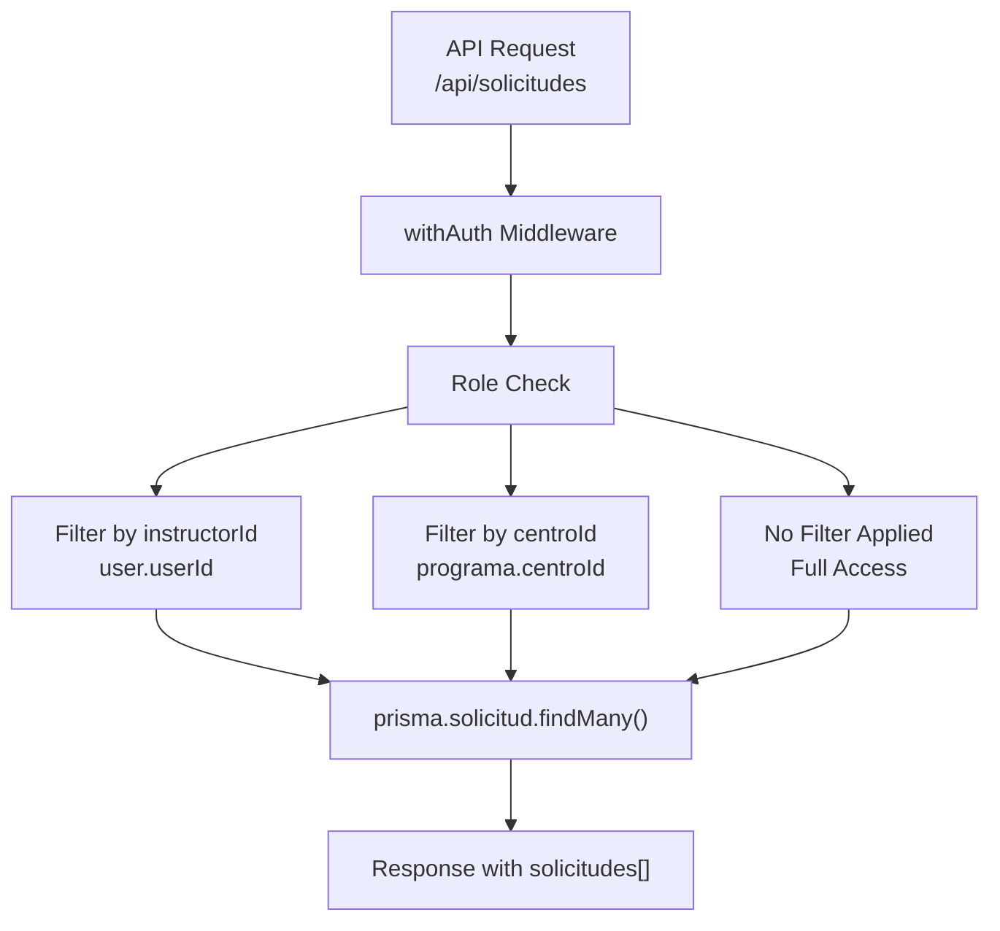
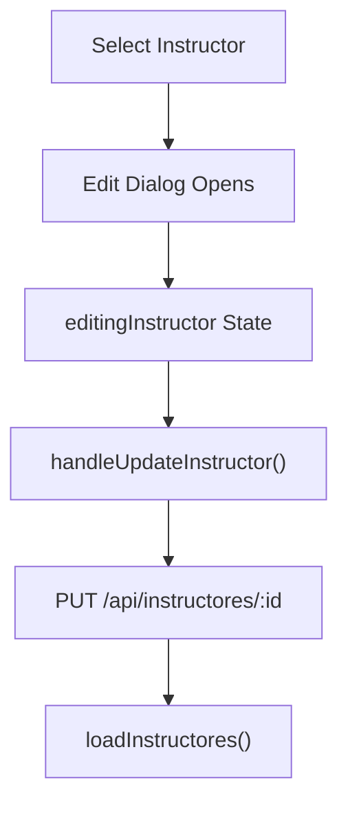
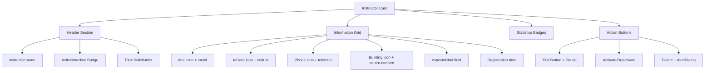
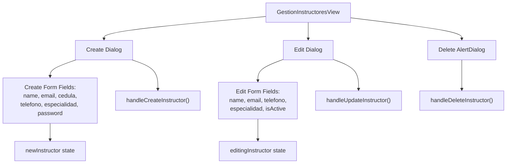
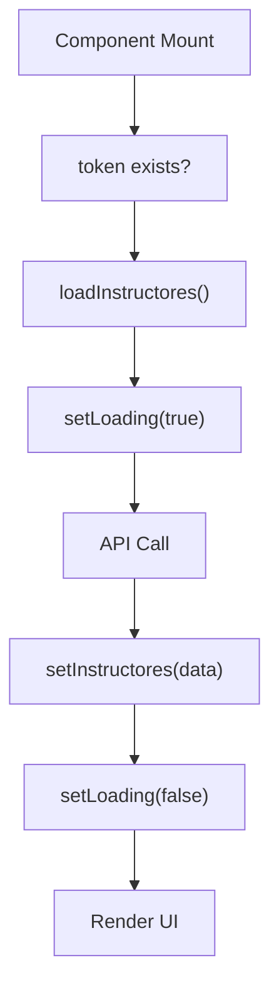

# Administrator Workflow

> **Relevant source files**
> * [app/api/solicitudes/route.ts](https://github.com/axchisan/gestionComplementarias/blob/a3d2dcb4/app/api/solicitudes/route.ts)
> * [components/gestion-instructores-view.tsx](https://github.com/axchisan/gestionComplementarias/blob/a3d2dcb4/components/gestion-instructores-view.tsx)
> * [prisma/schema.prisma](https://github.com/axchisan/gestionComplementarias/blob/a3d2dcb4/prisma/schema.prisma)

## Purpose and Scope

This document describes the administrative workflow within the SENA Gestión Complementarias system. It covers the capabilities, permissions, and operational procedures available exclusively to users with the `ADMIN` role. Administrators have system-wide access and are responsible for user management, cross-center oversight, and system configuration.

For information about the general role structure and permissions model, see [User Roles Overview](/axchisan/gestionComplementarias/4.1-user-roles-overview). For details on solicitud review processes, see [Coordinator Workflow](/axchisan/gestionComplementarias/4.4-coordinator-workflow).

**Sources:** [prisma/schema.prisma L233-L237](https://github.com/axchisan/gestionComplementarias/blob/a3d2dcb4/prisma/schema.prisma#L233-L237)

---

## Admin Role Characteristics

The `ADMIN` role is defined in the database schema with distinct characteristics that differentiate it from `INSTRUCTOR` and `COORDINADOR` roles:

| Characteristic | Description |
| --- | --- |
| **Role Enum Value** | `Role.ADMIN` |
| **Data Scope** | System-wide (no center restrictions) |
| **Solicitud Visibility** | All solicitudes across all centers |
| **User Management** | Full CRUD access to all user accounts |
| **Center Association** | Linked to a `centroId` but not restricted by it |
| **Primary Responsibility** | System administration and cross-center oversight |

Unlike coordinators who are scoped to their specific center's data, administrators can view and manage resources across the entire system. The `centroId` field on the `User` model is still required for admin users, but it does not restrict their data access patterns.

**Sources:** [prisma/schema.prisma L14-L34](https://github.com/axchisan/gestionComplementarias/blob/a3d2dcb4/prisma/schema.prisma#L14-L34)

 Diagram 2 from high-level architecture

---

## Data Access Patterns

### Role-Based Filtering Logic

The API layer implements role-based data filtering that grants administrators unrestricted access. The following code demonstrates the filtering logic:

```
GET /api/solicitudes
├─ INSTRUCTOR → where: { instructorId: user.userId }
├─ COORDINADOR → where: { programa: { centroId: user.centroId } }
└─ ADMIN → where: {} (no filtering)
```

**Sources:** [app/api/solicitudes/route.ts L15-L22](https://github.com/axchisan/gestionComplementarias/blob/a3d2dcb4/app/api/solicitudes/route.ts#L15-L22)

### Solicitud Access Pattern



**Sources:** [app/api/solicitudes/route.ts L6-L71](https://github.com/axchisan/gestionComplementarias/blob/a3d2dcb4/app/api/solicitudes/route.ts#L6-L71)

---

## Core Administrative Capabilities

### 1. User Management

Administrators can perform full lifecycle management of user accounts through the `/api/instructores` endpoints:

| Operation | HTTP Method | Endpoint | Access Control |
| --- | --- | --- | --- |
| List Users | GET | `/api/instructores` | COORDINADOR, ADMIN |
| Create User | POST | `/api/instructores` | COORDINADOR, ADMIN |
| Update User | PUT | `/api/instructores/:id` | COORDINADOR, ADMIN |
| Delete User | DELETE | `/api/instructores/:id` | COORDINADOR, ADMIN |
| Toggle Status | PUT | `/api/instructores/:id` | COORDINADOR, ADMIN |

The `GestionInstructoresView` component provides the UI for these operations, accessible to both coordinators (for their center) and administrators (system-wide).

**Sources:** [components/gestion-instructores-view.tsx L1-L592](https://github.com/axchisan/gestionComplementarias/blob/a3d2dcb4/components/gestion-instructores-view.tsx#L1-L592)

### 2. Cross-Center Oversight

Administrators can view solicitudes from all centers without restriction. The query pattern demonstrates this:

```javascript
// For ADMIN role, no where clause filtering is applied
const where: any = {}

// Role-based filtering only applies to INSTRUCTOR and COORDINADOR
if (user.role === "INSTRUCTOR") {
  where.instructorId = user.userId
} else if (user.role === "COORDINADOR") {
  where.programa = { centroId: user.centroId }
}
// ADMIN falls through with empty where clause

const solicitudes = await prisma.solicitud.findMany({ where, ... })
```

**Sources:** [app/api/solicitudes/route.ts L13-L22](https://github.com/axchisan/gestionComplementarias/blob/a3d2dcb4/app/api/solicitudes/route.ts#L13-L22)

### 3. Instructor Management Interface

The `GestionInstructoresView` component provides comprehensive instructor management capabilities:

#### Create Instructor Flow

```mermaid
sequenceDiagram
  participant Admin User
  participant GestionInstructoresView
  participant /api/instructores
  participant Prisma Client

  Admin User->>GestionInstructoresView: "Click 'Crear Instructor'"
  GestionInstructoresView->>Admin User: "Display Dialog Form"
  Admin User->>GestionInstructoresView: "Submit Form Data"
  note over GestionInstructoresView: "newInstructor state:
  GestionInstructoresView->>/api/instructores: "POST with instructor data"
  /api/instructores->>/api/instructores: "Hash password with bcrypt"
  /api/instructores->>Prisma Client: "prisma.user.create()"
  Prisma Client-->>/api/instructores: "Created user record"
  /api/instructores-->>GestionInstructoresView: "Success response"
  GestionInstructoresView->>GestionInstructoresView: "loadInstructores()"
  GestionInstructoresView->>Admin User: "Display updated list"
```

**Key State Management:**

* `newInstructor` state: [components/gestion-instructores-view.tsx L87-L94](https://github.com/axchisan/gestionComplementarias/blob/a3d2dcb4/components/gestion-instructores-view.tsx#L87-L94)
* `handleCreateInstructor` function: [components/gestion-instructores-view.tsx L122-L148](https://github.com/axchisan/gestionComplementarias/blob/a3d2dcb4/components/gestion-instructores-view.tsx#L122-L148)
* Password visibility toggle: [components/gestion-instructores-view.tsx L86](https://github.com/axchisan/gestionComplementarias/blob/a3d2dcb4/components/gestion-instructores-view.tsx#L86-L86)

#### Edit Instructor Flow

The edit workflow uses a dialog-based approach with real-time state updates:



**Sources:** [components/gestion-instructores-view.tsx L150-L176](https://github.com/axchisan/gestionComplementarias/blob/a3d2dcb4/components/gestion-instructores-view.tsx#L150-L176)

 [components/gestion-instructores-view.tsx L433-L513](https://github.com/axchisan/gestionComplementarias/blob/a3d2dcb4/components/gestion-instructores-view.tsx#L433-L513)

#### Status Toggle and Deletion

```javascript
// Toggle active/inactive status
const handleToggleStatus = async (id: string, isActive: boolean) => {
  await fetch(`/api/instructores/${id}`, {
    method: "PUT",
    body: JSON.stringify({ isActive: !isActive })
  })
}

// Permanent deletion with cascade
const handleDeleteInstructor = async (id: string) => {
  await fetch(`/api/instructores/${id}`, {
    method: "DELETE"
  })
}
```

**Sources:** [components/gestion-instructores-view.tsx L178-L212](https://github.com/axchisan/gestionComplementarias/blob/a3d2dcb4/components/gestion-instructores-view.tsx#L178-L212)

---

## User Management Dashboard

### Statistics Display

The instructor management interface displays real-time statistics across four key metrics:

| Metric | Calculation | Display Color |
| --- | --- | --- |
| Total Instructors | `instructores.length` | Blue |
| Active Instructors | `instructores.filter(i => i.isActive).length` | Green |
| Inactive Instructors | `instructores.filter(i => !i.isActive).length` | Red |
| Total Solicitudes | `instructores.reduce((sum, i) => sum + (i.estadisticas?.totalSolicitudes \|\| 0), 0)` | Purple |

**Sources:** [components/gestion-instructores-view.tsx L235-L262](https://github.com/axchisan/gestionComplementarias/blob/a3d2dcb4/components/gestion-instructores-view.tsx#L235-L262)

### Search and Filter Capabilities

The interface provides real-time search across multiple fields:

```javascript
const filteredInstructores = instructores.filter(
  (instructor) =>
    instructor.name.toLowerCase().includes(searchTerm.toLowerCase()) ||
    instructor.email.toLowerCase().includes(searchTerm.toLowerCase()) ||
    instructor.cedula.includes(searchTerm)
)
```

Search applies to:

* Instructor name (case-insensitive)
* Email address (case-insensitive)
* Cédula (exact match)

**Sources:** [components/gestion-instructores-view.tsx L214-L219](https://github.com/axchisan/gestionComplementarias/blob/a3d2dcb4/components/gestion-instructores-view.tsx#L214-L219)

### Instructor Card Display

Each instructor is displayed with comprehensive information:



**Sources:** [components/gestion-instructores-view.tsx L376-L572](https://github.com/axchisan/gestionComplementarias/blob/a3d2dcb4/components/gestion-instructores-view.tsx#L376-L572)

---

## Instructor Entity Structure

The `Instructor` interface used by the management component includes complete user information and associated statistics:

```yaml
interface Instructor {
  id: string
  name: string
  email: string
  cedula: string
  telefono?: string
  especialidad?: string
  isActive: boolean
  role: string
  createdAt: string
  centro: {
    nombre: string
  }
  estadisticas?: {
    totalSolicitudes: number
    solicitudesAprobadas: number
    tasaAprobacion: number
    totalAprendices: number
    solicitudesPendientes: number
  }
}
```

**Sources:** [components/gestion-instructores-view.tsx L48-L68](https://github.com/axchisan/gestionComplementarias/blob/a3d2dcb4/components/gestion-instructores-view.tsx#L48-L68)

---

## Database Schema Relationships

### User Model Relations

The `User` model in the database schema defines relationships that administrators interact with:

```sql
#mermaid-hxuwj0wzopn{font-family:ui-sans-serif,-apple-system,system-ui,Segoe UI,Helvetica;font-size:16px;fill:#333;}@keyframes edge-animation-frame{from{stroke-dashoffset:0;}}@keyframes dash{to{stroke-dashoffset:0;}}#mermaid-hxuwj0wzopn .edge-animation-slow{stroke-dasharray:9,5!important;stroke-dashoffset:900;animation:dash 50s linear infinite;stroke-linecap:round;}#mermaid-hxuwj0wzopn .edge-animation-fast{stroke-dasharray:9,5!important;stroke-dashoffset:900;animation:dash 20s linear infinite;stroke-linecap:round;}#mermaid-hxuwj0wzopn .error-icon{fill:#dddddd;}#mermaid-hxuwj0wzopn .error-text{fill:#222222;stroke:#222222;}#mermaid-hxuwj0wzopn .edge-thickness-normal{stroke-width:1px;}#mermaid-hxuwj0wzopn .edge-thickness-thick{stroke-width:3.5px;}#mermaid-hxuwj0wzopn .edge-pattern-solid{stroke-dasharray:0;}#mermaid-hxuwj0wzopn .edge-thickness-invisible{stroke-width:0;fill:none;}#mermaid-hxuwj0wzopn .edge-pattern-dashed{stroke-dasharray:3;}#mermaid-hxuwj0wzopn .edge-pattern-dotted{stroke-dasharray:2;}#mermaid-hxuwj0wzopn .marker{fill:#999;stroke:#999;}#mermaid-hxuwj0wzopn .marker.cross{stroke:#999;}#mermaid-hxuwj0wzopn svg{font-family:ui-sans-serif,-apple-system,system-ui,Segoe UI,Helvetica;font-size:16px;}#mermaid-hxuwj0wzopn p{margin:0;}#mermaid-hxuwj0wzopn .entityBox{fill:#ffffff;stroke:#dddddd;}#mermaid-hxuwj0wzopn .relationshipLabelBox{fill:#dddddd;opacity:0.7;background-color:#dddddd;}#mermaid-hxuwj0wzopn .relationshipLabelBox rect{opacity:0.5;}#mermaid-hxuwj0wzopn .labelBkg{background-color:rgba(221, 221, 221, 0.5);}#mermaid-hxuwj0wzopn .edgeLabel .label{fill:#dddddd;font-size:14px;}#mermaid-hxuwj0wzopn .label{font-family:ui-sans-serif,-apple-system,system-ui,Segoe UI,Helvetica;color:#333;}#mermaid-hxuwj0wzopn .edge-pattern-dashed{stroke-dasharray:8,8;}#mermaid-hxuwj0wzopn .node rect,#mermaid-hxuwj0wzopn .node circle,#mermaid-hxuwj0wzopn .node ellipse,#mermaid-hxuwj0wzopn .node polygon{fill:#ffffff;stroke:#dddddd;stroke-width:1px;}#mermaid-hxuwj0wzopn .relationshipLine{stroke:#999;stroke-width:1;fill:none;}#mermaid-hxuwj0wzopn .marker{fill:none!important;stroke:#999!important;stroke-width:1;}#mermaid-hxuwj0wzopn :root{--mermaid-font-family:"trebuchet ms",verdana,arial,sans-serif;}createsreceivesbelongs toUserstringidPKstringemailUKstringcedulaUKstringpasswordbcrypt hashedstringnameenumroleINSTRUCTOR|COORDINADOR|ADMINstringcentroIdFKstringespecialidadbooleanisActivesoft delete flagdatetimecreatedAtdatetimeupdatedAtSolicitudstringidPKstringcodigoUKstringinstructorIdFKstringprogramaIdFKenumestadoNotificacionstringidPKstringusuarioIdFKenumtipobooleanleidaCentrostringidPKstringnombrestringcodigoUKstringciudadstringregionbooleanisActive
```

**Sources:** [prisma/schema.prisma L14-L34](https://github.com/axchisan/gestionComplementarias/blob/a3d2dcb4/prisma/schema.prisma#L14-L34)

 [prisma/schema.prisma L36-L53](https://github.com/axchisan/gestionComplementarias/blob/a3d2dcb4/prisma/schema.prisma#L36-L53)

---

## API Integration Points

### Authentication Context

All administrative operations require authentication via the `useAuth` hook, which provides:

```javascript
const { token, user } = useAuth()

// token: JWT bearer token for Authorization header
// user: { userId, role, centroId, email, name }
```

**Sources:** [components/gestion-instructores-view.tsx L80](https://github.com/axchisan/gestionComplementarias/blob/a3d2dcb4/components/gestion-instructores-view.tsx#L80-L80)

### API Request Pattern

Administrative API calls follow a consistent pattern:

```javascript
const response = await fetch(endpoint, {
  method: 'GET|POST|PUT|DELETE',
  headers: {
    'Authorization': `Bearer ${token}`,
    'Content-Type': 'application/json'
  },
  body: JSON.stringify(data) // for POST/PUT
})
```

**Sources:** [components/gestion-instructores-view.tsx L105-L109](https://github.com/axchisan/gestionComplementarias/blob/a3d2dcb4/components/gestion-instructores-view.tsx#L105-L109)

 [components/gestion-instructores-view.tsx L124-L131](https://github.com/axchisan/gestionComplementarias/blob/a3d2dcb4/components/gestion-instructores-view.tsx#L124-L131)

---

## Administrative Operations Matrix

### Complete CRUD Operations Table

| Operation | Component Function | API Endpoint | HTTP Method | Request Body | Success Action |
| --- | --- | --- | --- | --- | --- |
| **Load All Instructors** | `loadInstructores()` | `/api/instructores` | GET | N/A | Update `instructores` state |
| **Create Instructor** | `handleCreateInstructor()` | `/api/instructores` | POST | `NewInstructor` object | Reload list, reset form |
| **Update Instructor** | `handleUpdateInstructor()` | `/api/instructores/:id` | PUT | Partial user fields | Reload list, close dialog |
| **Toggle Status** | `handleToggleStatus()` | `/api/instructores/:id` | PUT | `{ isActive: boolean }` | Reload list |
| **Delete Instructor** | `handleDeleteInstructor()` | `/api/instructores/:id` | DELETE | N/A | Reload list |

**Sources:** [components/gestion-instructores-view.tsx L102-L212](https://github.com/axchisan/gestionComplementarias/blob/a3d2dcb4/components/gestion-instructores-view.tsx#L102-L212)

---

## Password Management

### Password Creation and Display

Administrators can set initial passwords when creating instructor accounts. The interface includes a password visibility toggle:

```typescript
const [showPassword, setShowPassword] = useState(false)

// Input field type changes based on visibility state
<Input
  type={showPassword ? "text" : "password"}
  value={newInstructor.password}
/>

// Toggle button
<Button onClick={() => setShowPassword(!showPassword)}>
  {showPassword ? <EyeOff /> : <Eye />}
</Button>
```

**Security Note:** Passwords are sent to the API in plaintext over HTTPS and are hashed using bcrypt on the server side before storage.

**Sources:** [components/gestion-instructores-view.tsx L86](https://github.com/axchisan/gestionComplementarias/blob/a3d2dcb4/components/gestion-instructores-view.tsx#L86-L86)

 [components/gestion-instructores-view.tsx L339-L357](https://github.com/axchisan/gestionComplementarias/blob/a3d2dcb4/components/gestion-instructores-view.tsx#L339-L357)

---

## UI Component Structure

### Dialog-Based Forms

The management interface uses Radix UI dialogs for create and edit operations:



**Key Components:**

* Create Dialog: [components/gestion-instructores-view.tsx L279-L369](https://github.com/axchisan/gestionComplementarias/blob/a3d2dcb4/components/gestion-instructores-view.tsx#L279-L369)
* Edit Dialog: [components/gestion-instructores-view.tsx L433-L513](https://github.com/axchisan/gestionComplementarias/blob/a3d2dcb4/components/gestion-instructores-view.tsx#L433-L513)
* Delete AlertDialog: [components/gestion-instructores-view.tsx L538-L567](https://github.com/axchisan/gestionComplementarias/blob/a3d2dcb4/components/gestion-instructores-view.tsx#L538-L567)

**Sources:** [components/gestion-instructores-view.tsx L10-L28](https://github.com/axchisan/gestionComplementarias/blob/a3d2dcb4/components/gestion-instructores-view.tsx#L10-L28)

---

## State Management

### Component State Structure

The `GestionInstructoresView` component maintains several state variables:

```javascript
// Data state
const [instructores, setInstructores] = useState<Instructor[]>([])
const [loading, setLoading] = useState(true)

// UI state
const [searchTerm, setSearchTerm] = useState("")
const [showCreateForm, setShowCreateForm] = useState(false)
const [showPassword, setShowPassword] = useState(false)

// Form state
const [newInstructor, setNewInstructor] = useState<NewInstructor>({
  name: "", email: "", cedula: "", 
  telefono: "", especialidad: "", password: ""
})
const [editingInstructor, setEditingInstructor] = useState<Instructor | null>(null)
```

**Sources:** [components/gestion-instructores-view.tsx L81-L94](https://github.com/axchisan/gestionComplementarias/blob/a3d2dcb4/components/gestion-instructores-view.tsx#L81-L94)

---

## Loading and Error States

### Loading State Display

While data is being fetched, the interface displays a loading indicator:



**Loading UI:**

* Spinner animation with green border
* Centered text: "Cargando instructores..."

**Sources:** [components/gestion-instructores-view.tsx L96-L120](https://github.com/axchisan/gestionComplementarias/blob/a3d2dcb4/components/gestion-instructores-view.tsx#L96-L120)

 [components/gestion-instructores-view.tsx L221-L230](https://github.com/axchisan/gestionComplementarias/blob/a3d2dcb4/components/gestion-instructores-view.tsx#L221-L230)

---

## Empty States

### No Results Display

When no instructors match the search criteria or the list is empty:

```html
{filteredInstructores.length === 0 && (
  <Card>
    <CardContent className="p-12 text-center">
      <div className="w-24 h-24 bg-gray-100 rounded-full flex items-center justify-center mx-auto mb-4">
        <Users className="h-12 w-12 text-gray-400" />
      </div>
      <h3 className="text-xl font-semibold text-gray-900 mb-2">
        No se encontraron instructores
      </h3>
      <p className="text-gray-600">
        {searchTerm
          ? "No hay instructores que coincidan con tu búsqueda."
          : "No hay instructores registrados en este centro."}
      </p>
    </CardContent>
  </Card>
)}
```

**Sources:** [components/gestion-instructores-view.tsx L575-L589](https://github.com/axchisan/gestionComplementarias/blob/a3d2dcb4/components/gestion-instructores-view.tsx#L575-L589)

---

## Role Enum Definition

The system uses a strict enumeration for user roles defined in the Prisma schema:

```
enum Role {
  INSTRUCTOR
  COORDINADOR
  ADMIN
}
```

This enum is enforced at the database level and used throughout the application for access control decisions.

**Sources:** [prisma/schema.prisma L233-L237](https://github.com/axchisan/gestionComplementarias/blob/a3d2dcb4/prisma/schema.prisma#L233-L237)

---

## Access Control Summary

### Administrator Privileges

Administrators have the following system-wide privileges:

1. **Solicitud Access**: View all solicitudes regardless of center affiliation
2. **User Management**: Create, read, update, and delete user accounts
3. **Status Control**: Activate or deactivate user accounts (soft delete via `isActive` flag)
4. **Cross-Center Visibility**: Access data from all `Centro` records in the system
5. **Reporting**: Generate system-wide reports (implementation details in other sections)
6. **Notification Access**: View all system notifications

### Protected Routes

While the code files provided don't show specific admin-only routes, the role-based filtering in API endpoints ensures that:

* Administrators bypass center-based filtering
* Administrators see complete datasets in list views
* The `withAuth` middleware validates the `role` field from JWT tokens

**Sources:** [app/api/solicitudes/route.ts L15-L22](https://github.com/axchisan/gestionComplementarias/blob/a3d2dcb4/app/api/solicitudes/route.ts#L15-L22)

---

## Integration with Notification System

When administrators create or modify instructors, the system may trigger notifications. The notification system uses the `NotificationService` class to handle event-driven notifications.

For instructors created by administrators, relevant coordinators in the center receive notifications about new user accounts (though this specific notification type is not shown in the provided code, it follows the same pattern as solicitud notifications).

**Sources:** [app/api/solicitudes/route.ts L4](https://github.com/axchisan/gestionComplementarias/blob/a3d2dcb4/app/api/solicitudes/route.ts#L4-L4)

 [app/api/solicitudes/route.ts L213-L229](https://github.com/axchisan/gestionComplementarias/blob/a3d2dcb4/app/api/solicitudes/route.ts#L213-L229)