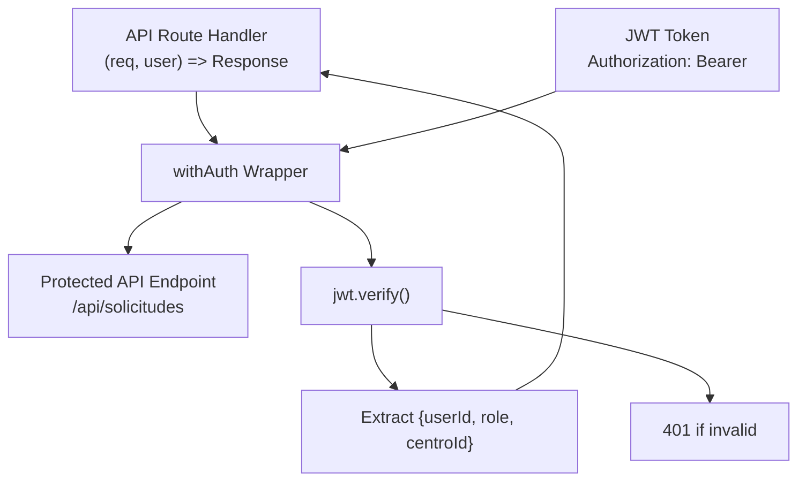
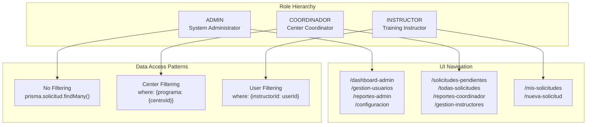
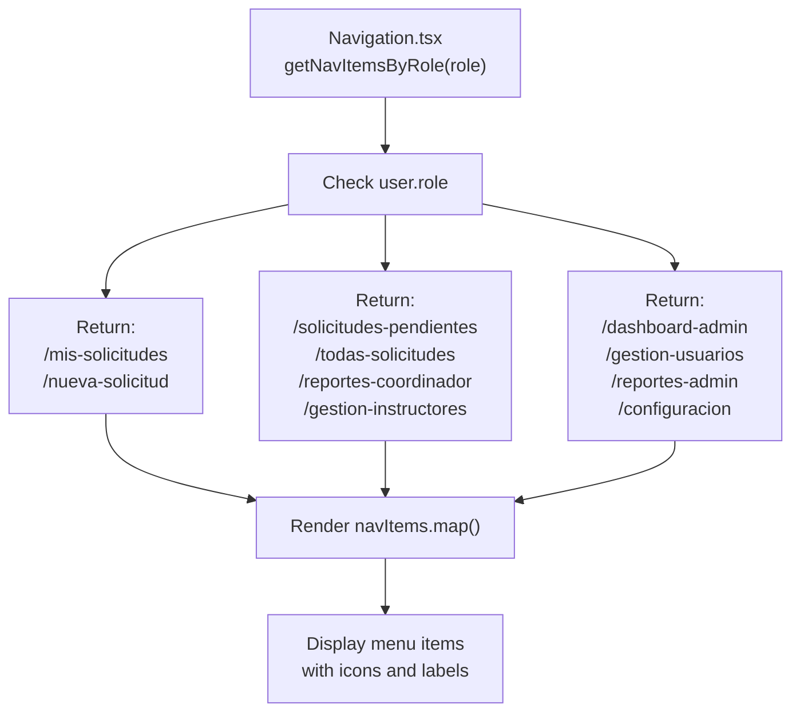
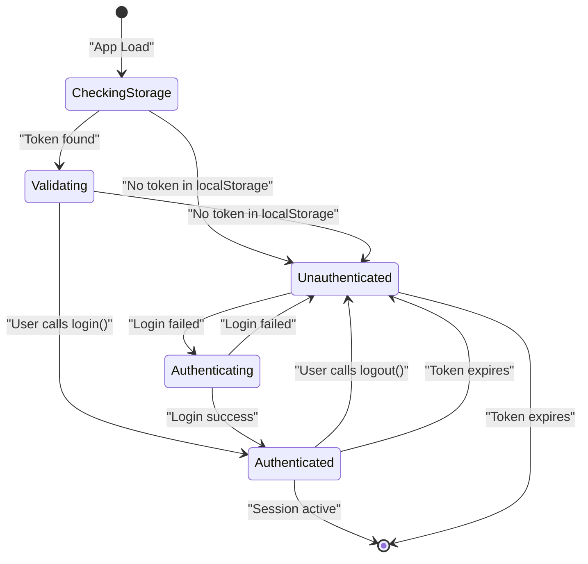

# Authentication and Authorization

> **Relevant source files**
> * [app/api/solicitudes/route.ts](https://github.com/axchisan/gestionComplementarias/blob/a3d2dcb4/app/api/solicitudes/route.ts)
> * [app/login/page.tsx](https://github.com/axchisan/gestionComplementarias/blob/a3d2dcb4/app/login/page.tsx)
> * [components/features.tsx](https://github.com/axchisan/gestionComplementarias/blob/a3d2dcb4/components/features.tsx)
> * [components/login-form.tsx](https://github.com/axchisan/gestionComplementarias/blob/a3d2dcb4/components/login-form.tsx)
> * [components/navigation.tsx](https://github.com/axchisan/gestionComplementarias/blob/a3d2dcb4/components/navigation.tsx)

## Purpose and Scope

This document explains the authentication and authorization mechanisms in the SENA Gestión Complementarias system. It covers JWT-based authentication, the client-side auth context, server-side middleware protection, and role-based access control (RBAC) patterns.

For information about the overall system architecture, see [System Architecture](/axchisan/gestionComplementarias/3-system-architecture). For details on specific API endpoint protection, see [API Architecture](/axchisan/gestionComplementarias/6.1-api-architecture) and [Authentication Endpoints](/axchisan/gestionComplementarias/6.3-authentication-endpoints).

---

## Authentication System Overview

The system implements a stateless, token-based authentication model using JSON Web Tokens (JWT). Authentication occurs through a multi-layer architecture:

| Layer | Component | Responsibility |
| --- | --- | --- |
| Client | `useAuth()` Hook | Manages auth state, token storage, login/logout |
| Server | `withAuth()` Middleware | Validates JWT tokens on API requests |
| Database | Password Hashing | bcryptjs for secure password storage |
| Transport | Authorization Header | Bearer token transmission |

The authentication flow is stateless, meaning no session data is stored on the server. All authentication state is derived from the JWT token payload, which includes `userId`, `role`, and `centroId`.

**Sources:** [app/api/solicitudes/route.ts L2](https://github.com/axchisan/gestionComplementarias/blob/a3d2dcb4/app/api/solicitudes/route.ts#L2-L2)

 [components/navigation.tsx L16](https://github.com/axchisan/gestionComplementarias/blob/a3d2dcb4/components/navigation.tsx#L16-L16)

 [components/login-form.tsx L12](https://github.com/axchisan/gestionComplementarias/blob/a3d2dcb4/components/login-form.tsx#L12-L12)

---

## Authentication Flow

The following diagram illustrates the complete authentication process from login to protected resource access, using actual code constructs:

```

```

**Sources:** [components/login-form.tsx L37-L56](https://github.com/axchisan/gestionComplementarias/blob/a3d2dcb4/components/login-form.tsx#L37-L56)

 [app/api/solicitudes/route.ts L6-L71](https://github.com/axchisan/gestionComplementarias/blob/a3d2dcb4/app/api/solicitudes/route.ts#L6-L71)

---

## Client-Side Authentication Context

### AuthContext Provider

The `useAuth()` hook provides centralized authentication state management across the React application. It exposes the following interface:

| Property | Type | Description |
| --- | --- | --- |
| `user` | `User \| null` | Current authenticated user object |
| `token` | `string \| null` | JWT token string |
| `isAuthenticated` | `boolean` | Authentication status flag |
| `isLoading` | `boolean` | Loading state during auth operations |
| `login(email, password, rememberMe)` | `Function` | Performs login and stores token |
| `logout()` | `Function` | Clears token and redirects to login |

### Token Storage Strategy

Tokens are stored in browser `localStorage` when `rememberMe` is enabled, allowing persistent sessions across browser restarts. The token is automatically included in API requests via the `Authorization: Bearer {token}` header.

**Example Usage in Components:**

```

```

**Sources:** [components/navigation.tsx L16-L47](https://github.com/axchisan/gestionComplementarias/blob/a3d2dcb4/components/navigation.tsx#L16-L47)

 [components/login-form.tsx L22-L56](https://github.com/axchisan/gestionComplementarias/blob/a3d2dcb4/components/login-form.tsx#L22-L56)

---

## Server-Side Authorization Middleware

### withAuth Middleware Wrapper

The `withAuth()` function is a higher-order function that wraps API route handlers to enforce authentication. It extracts and validates the JWT token from the `Authorization` header, then injects the decoded user context into the request handler.

**Middleware Signature:**



**Implementation Pattern:**

```

```

The middleware automatically returns `401 Unauthorized` if:

* No `Authorization` header is present
* Token signature is invalid
* Token has expired
* Token payload is malformed

**Sources:** [app/api/solicitudes/route.ts L2](https://github.com/axchisan/gestionComplementarias/blob/a3d2dcb4/app/api/solicitudes/route.ts#L2-L2)

 [app/api/solicitudes/route.ts L6-L71](https://github.com/axchisan/gestionComplementarias/blob/a3d2dcb4/app/api/solicitudes/route.ts#L6-L71)

---

## Role-Based Access Control (RBAC)

### User Roles and Permissions

The system defines three hierarchical roles with distinct permissions and data access patterns:



**Sources:** [components/navigation.tsx L49-L82](https://github.com/axchisan/gestionComplementarias/blob/a3d2dcb4/components/navigation.tsx#L49-L82)

 [app/api/solicitudes/route.ts L15-L22](https://github.com/axchisan/gestionComplementarias/blob/a3d2dcb4/app/api/solicitudes/route.ts#L15-L22)

### Role-Based Filtering Implementation

Each API endpoint applies role-specific filtering at the database query level:

| Role | Filter Logic | Code Location |
| --- | --- | --- |
| `INSTRUCTOR` | `where.instructorId = user.userId` | [app/api/solicitudes/route.ts L16-L17](https://github.com/axchisan/gestionComplementarias/blob/a3d2dcb4/app/api/solicitudes/route.ts#L16-L17) |
| `COORDINADOR` | `where.programa = { centroId: user.centroId }` | [app/api/solicitudes/route.ts L18-L21](https://github.com/axchisan/gestionComplementarias/blob/a3d2dcb4/app/api/solicitudes/route.ts#L18-L21) |
| `ADMIN` | No filtering applied | [app/api/solicitudes/route.ts L15-L22](https://github.com/axchisan/gestionComplementarias/blob/a3d2dcb4/app/api/solicitudes/route.ts#L15-L22) |

### Operation-Level Authorization

Beyond data filtering, certain operations are restricted by role:

```

```

This pattern ensures instructors can only create solicitudes, while coordinators can approve/reject them, and admins have full system access.

**Sources:** [app/api/solicitudes/route.ts L73-L77](https://github.com/axchisan/gestionComplementarias/blob/a3d2dcb4/app/api/solicitudes/route.ts#L73-L77)

---

## Navigation and UI Protection

### Dynamic Navigation Menu

The `Navigation` component renders role-specific menu items using the `getNavItemsByRole()` function:



**Implementation:**

```

```

**Sources:** [components/navigation.tsx L49-L97](https://github.com/axchisan/gestionComplementarias/blob/a3d2dcb4/components/navigation.tsx#L49-L97)

### Client-Side Route Protection

Components check authentication state before rendering or navigating:

```

```

This pattern prevents unauthorized users from accessing protected routes at the UI level, though server-side validation remains the primary security boundary.

**Sources:** [components/features.tsx L46-L52](https://github.com/axchisan/gestionComplementarias/blob/a3d2dcb4/components/features.tsx#L46-L52)

 [components/navigation.tsx L115-L128](https://github.com/axchisan/gestionComplementarias/blob/a3d2dcb4/components/navigation.tsx#L115-L128)

---

## JWT Token Structure

### Token Payload

The JWT token contains the following claims:

```

```

| Claim | Type | Purpose |
| --- | --- | --- |
| `userId` | `string` | User's database ID for queries |
| `role` | `enum` | Determines permissions and filtering |
| `centroId` | `string` | Training center association |
| `iat` | `number` | Token issued at timestamp |
| `exp` | `number` | Token expiration timestamp |

### Token Generation

Tokens are signed with the `JWT_SECRET` environment variable using the `jsonwebtoken` library. The secret must be kept secure and never exposed to client-side code.

**Sources:** Referenced in [components/navigation.tsx L29-L32](https://github.com/axchisan/gestionComplementarias/blob/a3d2dcb4/components/navigation.tsx#L29-L32)

 for Authorization header usage

---

## Password Security

### Hashing Strategy

User passwords are hashed using `bcryptjs` with a salt rounds configuration before storage. The password comparison is performed server-side during login:

```

```

This constant-time comparison prevents timing attacks and ensures passwords are never stored or transmitted in plain text.

**Sources:** Referenced in authentication flow diagram above

---

## Security Considerations

### Multi-Layer Defense

The authentication system implements defense in depth:

1. **Transport Security**: HTTPS enforced via SSL encryption (docker-compose configuration)
2. **Token Security**: JWT signed with secret, includes expiration
3. **Password Security**: bcryptjs hashing with salt rounds
4. **Client Protection**: `useAuth()` checks prevent UI exposure
5. **Server Protection**: `withAuth()` middleware validates all API requests
6. **Data Scoping**: Role-based filtering at database query level
7. **Operation Control**: Role checks for state-changing operations

### Token Storage Risks

Storing tokens in `localStorage` exposes them to XSS attacks. Consider:

* Implementing `httpOnly` cookies for token storage (requires session-based approach)
* Short-lived tokens with refresh token rotation
* Content Security Policy (CSP) headers to mitigate XSS

**Sources:** [components/login-form.tsx L163-L176](https://github.com/axchisan/gestionComplementarias/blob/a3d2dcb4/components/login-form.tsx#L163-L176)

 shows security notice to users

---

## Authentication State Management

### State Initialization and Persistence

The `AuthContext` manages authentication state across the application lifecycle:



### Logout Flow

The `logout()` function clears authentication state:

```

```

This removes the JWT token from storage and resets the auth context, triggering a redirect to the login page.

**Sources:** [components/navigation.tsx L44-L47](https://github.com/axchisan/gestionComplementarias/blob/a3d2dcb4/components/navigation.tsx#L44-L47)

---

## API Request Authentication Pattern

All authenticated API requests follow this pattern:

```

```

The `Authorization` header must be included in every request to protected endpoints. The `withAuth()` middleware extracts and validates this token server-side.

**Sources:** [components/navigation.tsx L27-L42](https://github.com/axchisan/gestionComplementarias/blob/a3d2dcb4/components/navigation.tsx#L27-L42)

---

## Environment Variables

The authentication system requires the following environment variables:

| Variable | Purpose | Example |
| --- | --- | --- |
| `JWT_SECRET` | Signs and verifies JWT tokens | `your-secret-key-here` |
| `NEXTAUTH_SECRET` | NextAuth session signing | `different-secret-key` |
| `NEXTAUTH_URL` | Application base URL | `http://localhost:3000` |

These must be configured in `.env` file and kept secure. Never commit secrets to version control.

**Sources:** Referenced in deployment configuration and authentication implementation