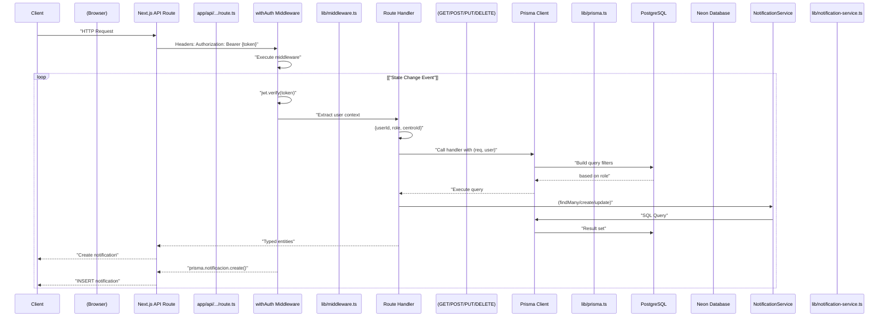
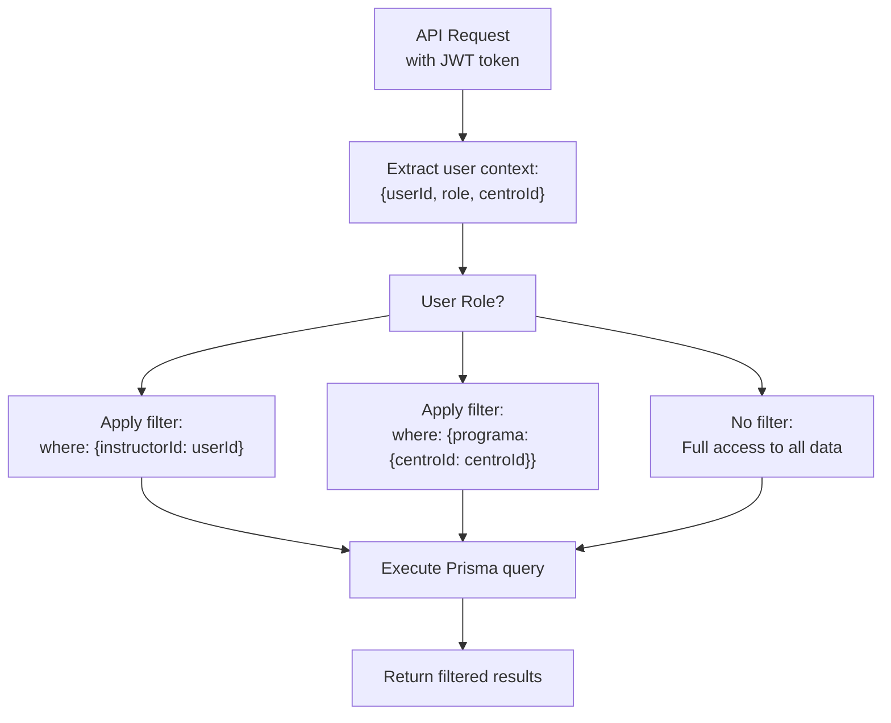
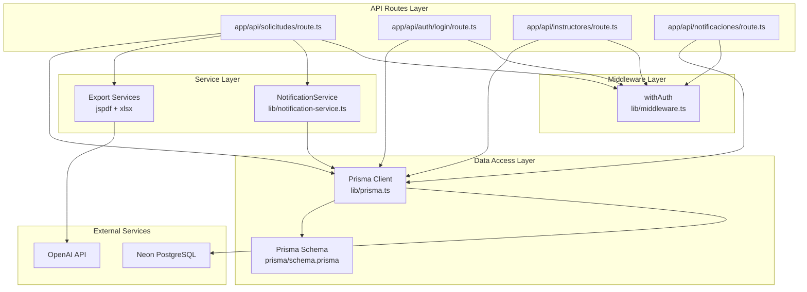

# Backend API

> **Relevant source files**
> * [app/api/solicitudes/route.ts](https://github.com/axchisan/gestionComplementarias/blob/a3d2dcb4/app/api/solicitudes/route.ts)
> * [next.config.mjs](https://github.com/axchisan/gestionComplementarias/blob/a3d2dcb4/next.config.mjs)
> * [prisma/schema.prisma](https://github.com/axchisan/gestionComplementarias/blob/a3d2dcb4/prisma/schema.prisma)

## Overview and Scope

This document provides comprehensive documentation of the backend API layer in the SENA Gestión Complementarias system. The API is implemented as Next.js API Routes that provide RESTful endpoints for all system operations.

The backend API handles:

* User authentication and authorization
* CRUD operations for solicitudes, programs, users, and centers
* Role-based data access control
* Notification generation and management
* Document export functionality (PDF/Excel)

For detailed information about specific API subsystems, see:

* API design patterns and middleware: [API Architecture](/axchisan/gestionComplementarias/6.1-api-architecture)
* Solicitud endpoint specifications: [Solicitudes Endpoints](/axchisan/gestionComplementarias/6.2-solicitudes-endpoints)
* Authentication flow and token management: [Authentication Endpoints](/axchisan/gestionComplementarias/6.3-authentication-endpoints)
* Event-driven notification system: [Notification System](/axchisan/gestionComplementarias/6.4-notification-system)

**Sources:** [app/api/solicitudes/route.ts L1-L242](https://github.com/axchisan/gestionComplementarias/blob/a3d2dcb4/app/api/solicitudes/route.ts#L1-L242)

---

## API Route Organization

The backend API follows Next.js 15 App Router conventions, where API routes are defined as `route.ts` files within the `app/api/` directory structure. Each route file exports HTTP method handlers (`GET`, `POST`, `PUT`, `DELETE`) that process requests.

### API Route File Structure

```

```

**Route Naming Conventions:**

* **Collection routes** (`/api/resource/route.ts`): Handle list operations (GET) and creation (POST)
* **Item routes** (`/api/resource/[id]/route.ts`): Handle single item operations (GET, PUT, DELETE)
* **Action routes** (`/api/resource/[id]/action/route.ts`): Handle specific actions (POST)

**Sources:** [app/api/solicitudes/route.ts L1-L6](https://github.com/axchisan/gestionComplementarias/blob/a3d2dcb4/app/api/solicitudes/route.ts#L1-L6)

---

## Request Flow Architecture

The diagram below illustrates how HTTP requests flow through the API layer, from initial receipt to database interaction and response generation.

### Request Processing Pipeline



**Key Components:**

* **withAuth Middleware**: Wraps protected routes, validates JWT tokens, injects user context
* **Route Handlers**: Implement business logic, apply role-based filtering
* **Prisma Client**: Type-safe ORM for database operations
* **NotificationService**: Event-driven service for user notifications

**Sources:** [app/api/solicitudes/route.ts L6-L71](https://github.com/axchisan/gestionComplementarias/blob/a3d2dcb4/app/api/solicitudes/route.ts#L6-L71)

 [app/api/solicitudes/route.ts L73-L242](https://github.com/axchisan/gestionComplementarias/blob/a3d2dcb4/app/api/solicitudes/route.ts#L73-L242)

---

## Role-Based Data Access

The API implements role-based access control (RBAC) at the query level, ensuring users only access data within their authorization scope. This pattern is consistently applied across all protected endpoints.

### Data Filtering by Role



### Implementation Pattern

The following pattern is used consistently across API endpoints:

| Role | Data Scope | Implementation |
| --- | --- | --- |
| **INSTRUCTOR** | Own solicitudes only | `where: { instructorId: user.userId }` |
| **COORDINADOR** | Center's solicitudes | `where: { programa: { centroId: user.centroId } }` |
| **ADMIN** | All solicitudes | No `where` clause (full access) |

**Example from solicitudes endpoint:**

```

```

**Sources:** [app/api/solicitudes/route.ts L13-L22](https://github.com/axchisan/gestionComplementarias/blob/a3d2dcb4/app/api/solicitudes/route.ts#L13-L22)

---

## Request and Response Formats

All API endpoints follow consistent patterns for request and response formatting, enabling predictable client-side integration.

### Standard Request Format

**Headers:**

```

```

**Query Parameters (for GET requests):**

* `page`: Pagination page number (default: 1)
* `limit`: Items per page (default: 10)
* `estado`: Filter by status (supports comma-separated values)
* Additional filters vary by endpoint

**Request Body (for POST/PUT):**

```

```

### Standard Response Format

**Success Response (2xx):**

```

```

**Error Response (4xx/5xx):**

```

```

### Response Status Codes

| Code | Meaning | Usage |
| --- | --- | --- |
| 200 | OK | Successful GET, PUT, DELETE |
| 201 | Created | Successful POST (resource created) |
| 400 | Bad Request | Invalid input data |
| 401 | Unauthorized | Missing or invalid authentication token |
| 403 | Forbidden | Valid token but insufficient permissions |
| 404 | Not Found | Requested resource doesn't exist |
| 500 | Internal Server Error | Unexpected server error |

**Sources:** [app/api/solicitudes/route.ts L58-L66](https://github.com/axchisan/gestionComplementarias/blob/a3d2dcb4/app/api/solicitudes/route.ts#L58-L66)

---

## Core Services and Utilities

The API layer relies on several core services and utilities that provide shared functionality across endpoints.

### Service Architecture



### Key Services

#### Prisma Client (lib/prisma.ts)

The singleton Prisma Client instance provides type-safe database access across all API routes. It automatically generates TypeScript types from the schema and provides query builders for all models.

**Key Features:**

* Type-safe queries with IntelliSense support
* Automatic relation loading with `include` clauses
* Transaction support for atomic operations
* Connection pooling for serverless environments

**Example Usage:**

```

```

#### NotificationService (lib/notification-service.ts)

Event-driven service that creates notifications for users when significant events occur (solicitud creation, approval, rejection). Called from API routes after state changes.

**Notification Types:**

* `NUEVA_SOLICITUD`: Sent to coordinators when instructor submits
* `SOLICITUD_APROBADA`: Sent to instructor when approved
* `SOLICITUD_RECHAZADA`: Sent to instructor when rejected
* `SOLICITUD_REVISION`: Sent when changes requested

**Example Usage:**

```

```

#### withAuth Middleware (lib/middleware.ts)

Higher-order function that wraps API route handlers to enforce authentication. Validates JWT tokens, extracts user context, and injects it into the handler.

**Signature:**

```

```

**UserContext Interface:**

```

```

**Sources:** [app/api/solicitudes/route.ts L2-L4](https://github.com/axchisan/gestionComplementarias/blob/a3d2dcb4/app/api/solicitudes/route.ts#L2-L4)

 [app/api/solicitudes/route.ts L6](https://github.com/axchisan/gestionComplementarias/blob/a3d2dcb4/app/api/solicitudes/route.ts#L6-L6)

 [app/api/solicitudes/route.ts L73](https://github.com/axchisan/gestionComplementarias/blob/a3d2dcb4/app/api/solicitudes/route.ts#L73-L73)

 [app/api/solicitudes/route.ts L82-L98](https://github.com/axchisan/gestionComplementarias/blob/a3d2dcb4/app/api/solicitudes/route.ts#L82-L98)

 [app/api/solicitudes/route.ts L214-L228](https://github.com/axchisan/gestionComplementarias/blob/a3d2dcb4/app/api/solicitudes/route.ts#L214-L228)

---

## Security Configuration

The API implements multiple layers of security configuration at the Next.js level, enforced globally across all routes.

### Security Headers

The following security headers are configured in `next.config.mjs` and applied to all responses:

| Header | Value | Purpose |
| --- | --- | --- |
| `X-Frame-Options` | `DENY` | Prevents clickjacking by blocking iframe embedding |
| `X-Content-Type-Options` | `nosniff` | Prevents MIME type sniffing |
| `Referrer-Policy` | `origin-when-cross-origin` | Controls referrer information leakage |

### CORS Configuration

Cross-Origin Resource Sharing (CORS) is configured to allow access from the production domain:

| Header | Value |
| --- | --- |
| `Access-Control-Allow-Origin` | `https://gestioncomplementarias.axchisan.com` |
| `Access-Control-Allow-Methods` | `GET, POST, PUT, DELETE, OPTIONS` |
| `Access-Control-Allow-Headers` | `Content-Type, Authorization` |

**Sources:** [next.config.mjs L14-L46](https://github.com/axchisan/gestionComplementarias/blob/a3d2dcb4/next.config.mjs#L14-L46)

---

## Error Handling Patterns

The API implements consistent error handling across all endpoints to provide clear feedback to clients and aid debugging.

### Error Response Structure

All error responses follow this format:

```

```

### Common Error Scenarios

**Validation Errors (400):**

```

```

**Authorization Errors (403):**

```

```

**Server Errors (500):**

```

```

### Error Logging

All errors are logged to console with descriptive prefixes for debugging:

```

```

**Sources:** [app/api/solicitudes/route.ts L67-L70](https://github.com/axchisan/gestionComplementarias/blob/a3d2dcb4/app/api/solicitudes/route.ts#L67-L70)

 [app/api/solicitudes/route.ts L75-L77](https://github.com/axchisan/gestionComplementarias/blob/a3d2dcb4/app/api/solicitudes/route.ts#L75-L77)

 [app/api/solicitudes/route.ts L100-L102](https://github.com/axchisan/gestionComplementarias/blob/a3d2dcb4/app/api/solicitudes/route.ts#L100-L102)

 [app/api/solicitudes/route.ts L238-L241](https://github.com/axchisan/gestionComplementarias/blob/a3d2dcb4/app/api/solicitudes/route.ts#L238-L241)

---

## Data Model Integration

The API layer directly interfaces with the Prisma schema to perform database operations. Understanding the data model is essential for working with the API.

### Core Models

The following table maps business entities to their Prisma model definitions:

| Business Entity | Prisma Model | Primary Operations |
| --- | --- | --- |
| Users (instructors, coordinators, admins) | `User` | Authentication, profile management |
| Training centers | `Centro` | Organization hierarchy |
| Training programs | `Programa` | Program catalog |
| Training requests | `Solicitud` | CRUD, approval workflow |
| Schedules | `HorarioDetallado` | Nested create/update with solicitudes |
| Notifications | `Notificacion` | Event-driven creation, read status |

### Prisma Query Patterns

**Nested Includes:**
The API extensively uses Prisma's `include` functionality to load related data in single queries:

```

```

**Nested Creates:**
Related entities can be created atomically with parent entities:

```

```

**Sources:** [prisma/schema.prisma L1-L282](https://github.com/axchisan/gestionComplementarias/blob/a3d2dcb4/prisma/schema.prisma#L1-L282)

 [app/api/solicitudes/route.ts L33-L56](https://github.com/axchisan/gestionComplementarias/blob/a3d2dcb4/app/api/solicitudes/route.ts#L33-L56)

 [app/api/solicitudes/route.ts L190-L200](https://github.com/axchisan/gestionComplementarias/blob/a3d2dcb4/app/api/solicitudes/route.ts#L190-L200)

---

## Unique Code Generation

The API implements automatic code generation for entities requiring unique identifiers, following specific formatting patterns.

### Solicitud Code Generation

Solicitudes receive unique codes in the format `SOL-YYYY-NNN` where:

* `YYYY`: Current year
* `NNN`: Three-digit sequential number (zero-padded)

**Implementation:**

```

```

**Example Codes:**

* `SOL-2024-001`
* `SOL-2024-002`
* `SOL-2024-143`

This ensures globally unique, human-readable identifiers that reset annually and maintain chronological order.

**Sources:** [app/api/solicitudes/route.ts L104-L119](https://github.com/axchisan/gestionComplementarias/blob/a3d2dcb4/app/api/solicitudes/route.ts#L104-L119)

---

## Pagination Implementation

List endpoints implement offset-based pagination with configurable page size, returning both data and pagination metadata.

### Pagination Parameters

| Parameter | Type | Default | Description |
| --- | --- | --- | --- |
| `page` | number | 1 | Current page number (1-indexed) |
| `limit` | number | 10 | Items per page |

### Pagination Calculation

```

```

### Pagination Response

```

```

**Calculation:**

```

```

**Sources:** [app/api/solicitudes/route.ts L10-L11](https://github.com/axchisan/gestionComplementarias/blob/a3d2dcb4/app/api/solicitudes/route.ts#L10-L11)

 [app/api/solicitudes/route.ts L52-L53](https://github.com/axchisan/gestionComplementarias/blob/a3d2dcb4/app/api/solicitudes/route.ts#L52-L53)

 [app/api/solicitudes/route.ts L58-L66](https://github.com/axchisan/gestionComplementarias/blob/a3d2dcb4/app/api/solicitudes/route.ts#L58-L66)

---

## Date Handling

The API handles date fields with careful conversion between JavaScript `Date` objects and ISO 8601 strings for client communication.

### Date Conversion Pattern

**Input (from client):**

```

```

**Storage (in database):**
Prisma stores dates as PostgreSQL `TIMESTAMP` types.

**Output (to client):**
Prisma automatically serializes `DateTime` fields to ISO 8601 strings in JSON responses.

### Nullable vs Required Dates

The schema distinguishes between required and optional date fields:

| Field | Type | Usage |
| --- | --- | --- |
| `fechaSolicitud` | `DateTime` (required) | Auto-set with `@default(now())` |
| `fechaCaracterizacion` | `DateTime?` (optional) | User-provided or defaults to now |
| `fechaRevision` | `DateTime?` (optional) | Set when coordinator reviews |
| `fechaAprobacion` | `DateTime?` (optional) | Set when solicitud approved |

**Sources:** [app/api/solicitudes/route.ts L129](https://github.com/axchisan/gestionComplementarias/blob/a3d2dcb4/app/api/solicitudes/route.ts#L129-L129)

 [app/api/solicitudes/route.ts L173-L176](https://github.com/axchisan/gestionComplementarias/blob/a3d2dcb4/app/api/solicitudes/route.ts#L173-L176)

 [prisma/schema.prisma L117-L118](https://github.com/axchisan/gestionComplementarias/blob/a3d2dcb4/prisma/schema.prisma#L117-L118)

 [prisma/schema.prisma L176-L178](https://github.com/axchisan/gestionComplementarias/blob/a3d2dcb4/prisma/schema.prisma#L176-L178)

---

## Boolean Flags and Special Programs

The Solicitud model includes numerous boolean flags for categorizing special program types, all defaulting to `false` unless explicitly set.

### Special Program Categories

The following boolean flags identify special program characteristics:

| Flag | Purpose |
| --- | --- |
| `programaEmprendimiento` | Entrepreneurship program |
| `programaBilinguismo` | Bilingualism program |
| `atencionInstituciones` | Institutional attention |
| `posconflicto` | Post-conflict program |
| `senaEmprendeRural` | Rural entrepreneurship initiative |
| `formacionEspecialMypimes` | Special SME training |
| `senaEmprendeRuralPosconflicto` | Rural + post-conflict combined |
| `tecnoacademiaSennova` | TecnoAcademia SENNOVA |
| `campesenaConvenio8842` | Camp SENA (agreement 8842) |
| `fullPopularConvenio8882` | Full Popular (agreement 8882) |
| `icbfInstituto` | ICBF Institute |
| `policiaNacional` | National Police |

### API Handling

```

```

**Additional Text Field:**

* `otroEspecificar`: Free text for programs not covered by predefined flags

**Sources:** [app/api/solicitudes/route.ts L158-L170](https://github.com/axchisan/gestionComplementarias/blob/a3d2dcb4/app/api/solicitudes/route.ts#L158-L170)

 [prisma/schema.prisma L142-L154](https://github.com/axchisan/gestionComplementarias/blob/a3d2dcb4/prisma/schema.prisma#L142-L154)

---

## Summary

The Backend API provides a comprehensive REST interface for the SENA Gestión Complementarias system, built on Next.js API Routes with the following characteristics:

**Key Features:**

* Type-safe database access via Prisma ORM
* JWT-based authentication with role-based authorization
* Consistent request/response formats with pagination
* Event-driven notification system
* Automatic unique code generation
* Comprehensive error handling and logging

**Design Patterns:**

* Middleware-based authentication (`withAuth`)
* Role-based query filtering at the database level
* Nested entity creation for complex data structures
* Service layer for cross-cutting concerns

**Security:**

* Global security headers (X-Frame-Options, CSP)
* CORS configuration for production domain
* Token-based stateless authentication
* Role-based data scoping

For detailed information about specific API subsystems, refer to the child pages [API Architecture](/axchisan/gestionComplementarias/6.1-api-architecture), [Solicitudes Endpoints](/axchisan/gestionComplementarias/6.2-solicitudes-endpoints), [Authentication Endpoints](/axchisan/gestionComplementarias/6.3-authentication-endpoints), and [Notification System](/axchisan/gestionComplementarias/6.4-notification-system).