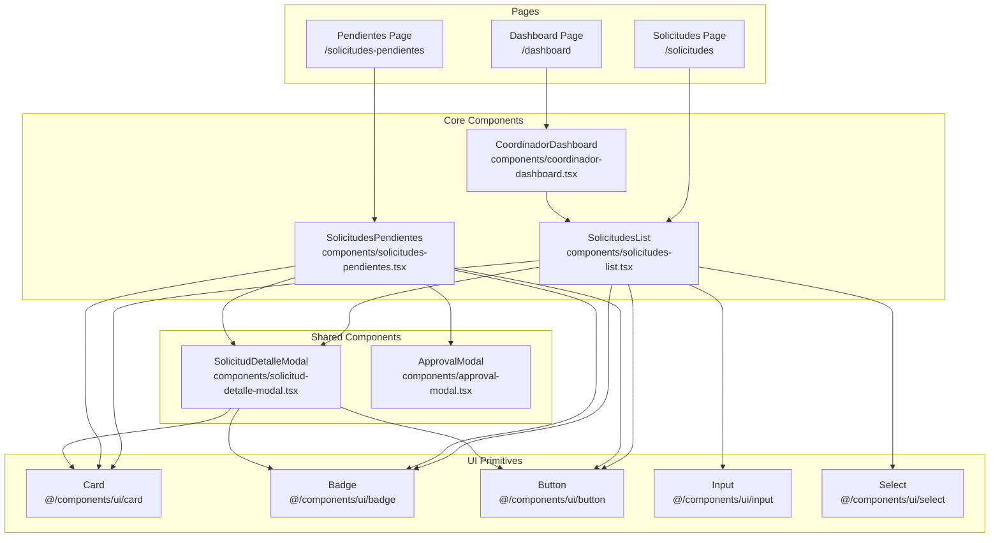
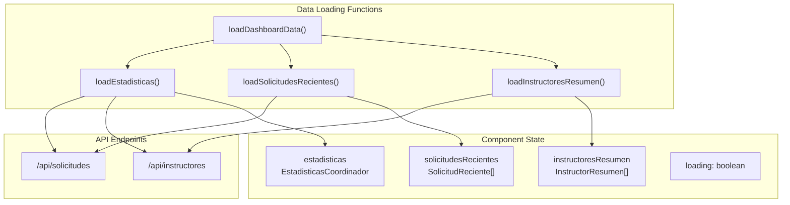
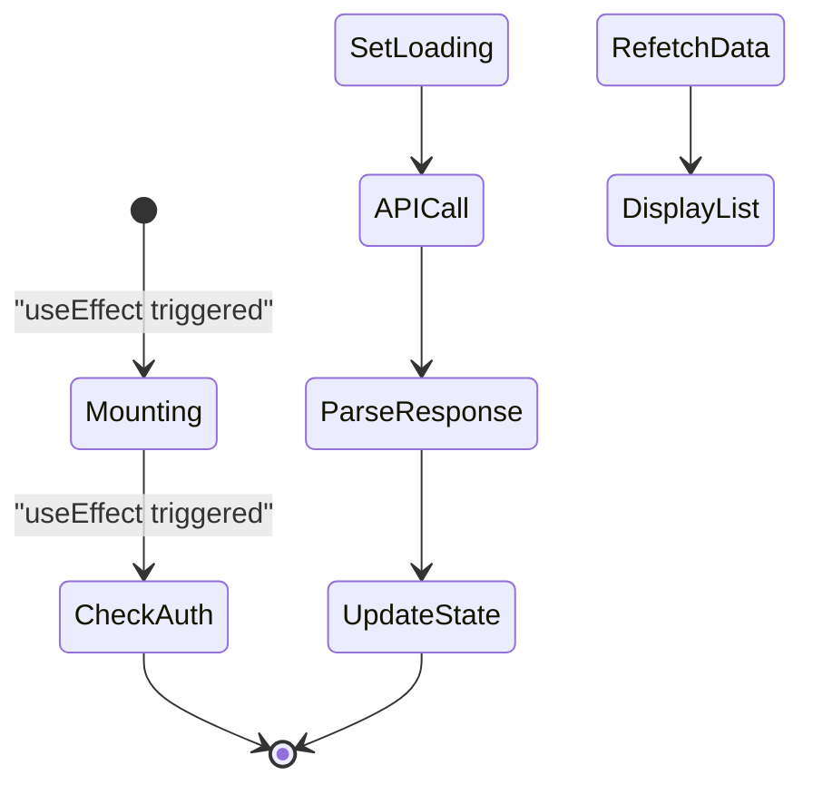

# Componentes de gestión de solicitudes

> **Archivos fuente relevantes**
> * [componentes/coordinador-dashboard.tsx](https://github.com/axchisan/gestionComplementarias/blob/a3d2dcb4/components/coordinador-dashboard.tsx)
> * [componentes/solicitud-detalle-modal.tsx](https://github.com/axchisan/gestionComplementarias/blob/a3d2dcb4/components/solicitud-detalle-modal.tsx)
> * [componentes/solicitudes-list.tsx](https://github.com/axchisan/gestionComplementarias/blob/a3d2dcb4/components/solicitudes-list.tsx)
> * [componentes/solicitudes-pendientes.tsx](https://github.com/axchisan/gestionComplementarias/blob/a3d2dcb4/components/solicitudes-pendientes.tsx)

## Propósito y alcance

Este documento detalla los componentes frontend de React responsables de gestionar las solicitudes de capacitación en el sistema SENA Gestión Complementarias. Estos componentes proporcionan interfaces para visualizar, buscar, filtrar, exportar y gestionar solicitudes en diferentes flujos de trabajo de usuario.

Los componentes que se incluyen incluyen vistas de lista, ventanas modales de detalle, interfaces de revisión de solicitudes pendientes e integraciones con el panel. Para conocer los componentes de la interfaz de usuario de autenticación, consulte [Interfaz de usuario de autenticación](/axchisan/gestionComplementarias/5.2-authentication-ui) . Para conocer los componentes específicos del panel, además de la gestión de solicitudes, consulte [Componentes del panel](/axchisan/gestionComplementarias/5.3-dashboard-components) . Para conocer los puntos finales de API que consumen estos componentes, consulte [Puntos finales de solicitudes](/axchisan/gestionComplementarias/6.2-solicitudes-endpoints) .

---

## Descripción general de la arquitectura de componentes

La interfaz de usuario de gestión de solicitudes se implementa a través de cuatro componentes React principales que manejan diferentes aspectos del ciclo de vida de la solicitud desde la perspectiva del usuario.

### Jerarquía de componentes



**Fuentes:** [solicitudes-list.tsx L1-L420](https://github.com/axchisan/gestionComplementarias/blob/a3d2dcb4/components/solicitudes-list.tsx#L1-L420)

 [solicitudes-pendientes.tsx L1-L367](https://github.com/axchisan/gestionComplementarias/blob/a3d2dcb4/components/solicitudes-pendientes.tsx#L1-L367)

 [coordinador-dashboard.tsx L1-L777](https://github.com/axchisan/gestionComplementarias/blob/a3d2dcb4/components/coordinador-dashboard.tsx#L1-L777)

 [solicitud-detalle-modal.tsx L1-L576](https://github.com/axchisan/gestionComplementarias/blob/a3d2dcb4/components/solicitud-detalle-modal.tsx#L1-L576)

---

## Componente Lista de Solicitudes

El `SolicitudesList`componente proporciona una vista completa de todas las solicitudes accesibles para el usuario actual, con capacidades de filtrado, búsqueda y exportación.

### Interfaz de componentes

| Apuntalar | Tipo | Descripción |
| --- | --- | --- |
| Ninguno | - | El componente utiliza `useAuth()`un gancho para el contexto de autenticación |

**Variables de estado:**

| Variable | Tipo | Objetivo |
| --- | --- | --- |
| `solicitudes` | `Solicitud[]` | Matriz de solicitudes cargadas desde la API |
| `loading` | `boolean` | Estado de carga durante la búsqueda de API |
| `error` | `string \| null` | Mensaje de error si falla la búsqueda |
| `searchTerm` | `string` | Valor del filtro de búsqueda |
| `selectedEstado` | `string` | Valor del filtro de estado |
| `selectedYear` | `string` | Valor del filtro de año |

**Fuentes:** [solicitudes-list.tsx L51-L59](https://github.com/axchisan/gestionComplementarias/blob/a3d2dcb4/components/solicitudes-list.tsx#L51-L59)

### Obtención y filtrado de datos

El componente obtiene las solicitudes al montarlas utilizando el `/api/solicitudes`punto final con autenticación JWT:

```javascript
const fetchSolicitudes = async () => {
  const response = await fetch("/api/solicitudes", {
    headers: {
      Authorization: `Bearer ${token}`,
      "Content-Type": "application/json",
    },
  })
}
```

**El filtrado del lado del cliente** aplica tres filtros simultáneamente:

* **Término de búsqueda** : Coincidencias con `programa.nombre`, `codigo`, o`numeroFicha`
* **Estado** : Filtros por estado de solicitud (BORRADOR, PENDIENTE, EN_REVISION, APROBADA, RECHAZADA)
* **Año** : Filtros por año extraídos de`fechaSolicitud`

**Fuentes:** [solicitudes-list.tsx L60-L102](https://github.com/axchisan/gestionComplementarias/blob/a3d2dcb4/components/solicitudes-list.tsx#L60-L102)

### Representación de la insignia del Estado

El componente utiliza un sistema de insignias de estado para representar visualmente los estados de solicitud:

| Estado | Color de la insignia | Icono | Mostrar texto |
| --- | --- | --- | --- |
| `BORRADOR` | Gris | Ninguno | "Borrador" |
| `PENDIENTE` | Amarillo | `Clock` | "Pendiente" |
| `EN_REVISION` | Azul | Ninguno | "En Revisión" |
| `APROBADA` | Green | `CheckCircle` | "Aprobada" |
| `RECHAZADA` | Red | `XCircle` | "Rechazada" |

**Sources:** [components/solicitudes-list.tsx L148-L178](https://github.com/axchisan/gestionComplementarias/blob/a3d2dcb4/components/solicitudes-list.tsx#L148-L178)

### Export Functionality

The component provides PDF and Excel export for individual solicitudes:

```javascript
const handleExportPDF = async (solicitud: Solicitud) => {
  const response = await fetch(
    `/api/solicitudes/${solicitud.id}/export?format=pdf`,
    { headers: { Authorization: `Bearer ${token}` } }
  )
  // Download blob as file
}

const handleExportExcel = async (solicitud: Solicitud) => {
  const response = await fetch(
    `/api/solicitudes/${solicitud.id}/export?format=excel`,
    { headers: { Authorization: `Bearer ${token}` } }
  )
  // Download blob as file
}
```

**Sources:** [components/solicitudes-list.tsx L104-L146](https://github.com/axchisan/gestionComplementarias/blob/a3d2dcb4/components/solicitudes-list.tsx#L104-L146)

### Statistics Display

Quick statistics are computed and displayed at the top:

```javascript
const getEstadisticas = () => {
  return {
    total: solicitudes.length,
    borradores: solicitudes.filter((s) => s.estado === "BORRADOR").length,
    pendientes: solicitudes.filter((s) => s.estado === "PENDIENTE").length,
    aprobadas: solicitudes.filter((s) => s.estado === "APROBADA").length,
    rechazadas: solicitudes.filter((s) => s.estado === "RECHAZADA").length,
  }
}
```

**Sources:** [components/solicitudes-list.tsx L180-L189](https://github.com/axchisan/gestionComplementarias/blob/a3d2dcb4/components/solicitudes-list.tsx#L180-L189)

---

## SolicitudesPendientes Component

The `SolicitudesPendientes` component is specifically designed for coordinators to review and act on pending solicitudes. It provides quick approval/rejection actions and detailed review capabilities.

### Component State

| State Variable | Type | Purpose |
| --- | --- | --- |
| `solicitudes` | `SolicitudPendiente[]` | Pending/in-review solicitudes |
| `loading` | `boolean` | Loading indicator |
| `searchTerm` | `string` | Search filter |
| `estadoFilter` | `string` | Filter by estado (all, PENDIENTE, EN_REVISION) |
| `selectedSolicitud` | `string \| null` | ID of solicitud to view in detail modal |
| `showModal` | `boolean` | Controls detail modal visibility |
| `showApprovalModal` | `boolean` | Controls approval modal visibility |
| `selectedSolicitudForApproval` | `SolicitudPendiente \| null` | Solicitud being approved/rejected |
| `actionLoading` | `boolean` | Loading state during approve/reject |

**Sources:** [components/solicitudes-pendientes.tsx L37-L48](https://github.com/axchisan/gestionComplementarias/blob/a3d2dcb4/components/solicitudes-pendientes.tsx#L37-L48)

### Priority Calculation

The component calculates priority based on how long a solicitud has been pending:

```javascript
const calcularPrioridad = (
  fechaCreacion: string, 
  estado: string
): "ALTA" | "MEDIA" | "BAJA" => {
  if (estado !== "PENDIENTE") return "BAJA"
  
  const diasDesdeCreacion = Math.floor(
    (Date.now() - new Date(fechaCreacion).getTime()) / (1000 * 60 * 60 * 24)
  )
  
  if (diasDesdeCreacion > 7) return "ALTA"
  if (diasDesdeCreacion > 3) return "MEDIA"
  return "BAJA"
}
```

**Priority Thresholds:**

* **ALTA**: More than 7 days pending
* **MEDIA**: 4-7 days pending
* **BAJA**: Less than 4 days pending or not in PENDIENTE state

**Sources:** [components/solicitudes-pendientes.tsx L255-L263](https://github.com/axchisan/gestionComplementarias/blob/a3d2dcb4/components/solicitudes-pendientes.tsx#L255-L263)

### Quick Action Handlers

The component provides two quick action methods for coordinators:

**Approve Handler:**

```javascript
const handleModalApprove = async (
  solicitudId: string, 
  numeroFicha: string, 
  comentarios?: string
) => {
  const response = await fetch(`/api/solicitudes/${solicitudId}/approve`, {
    method: "POST",
    headers: {
      Authorization: `Bearer ${token}`,
      "Content-Type": "application/json",
    },
    body: JSON.stringify({ numeroFicha, comentarios }),
  })
  await loadSolicitudesPendientes()
}
```

**Reject Handler:**

```javascript
const handleModalReject = async (
  solicitudId: string, 
  motivoRechazo: string
) => {
  const response = await fetch(`/api/solicitudes/${solicitudId}/reject`, {
    method: "POST",
    headers: {
      Authorization: `Bearer ${token}`,
      "Content-Type": "application/json",
    },
    body: JSON.stringify({ comentarios: motivoRechazo }),
  })
  await loadSolicitudesPendientes()
}
```

**Sources:** [components/solicitudes-pendientes.tsx L93-L127](https://github.com/axchisan/gestionComplementarias/blob/a3d2dcb4/components/solicitudes-pendientes.tsx#L93-L127)

### Data Flow for Approval/Rejection

```mermaid
sequenceDiagram
  participant SolicitudesPendientes
  participant ApprovalModal
  participant /api/solicitudes
  participant Database

  SolicitudesPendientes->>SolicitudesPendientes: "User clicks Aprobar button"
  SolicitudesPendientes->>ApprovalModal: "setShowApprovalModal(true)"
  ApprovalModal->>SolicitudesPendientes: "onApprove(solicitudId, numeroFicha, comentarios)"
  SolicitudesPendientes->>/api/solicitudes: "POST /api/solicitudes/{id}/approve"
  note over /api/solicitudes: "JWT authentication
  /api/solicitudes->>Database: "UPDATE solicitud SET estado=APROBADA"
  Database->>/api/solicitudes: "Success"
  /api/solicitudes->>Database: "INSERT notificacion (type=APROBADA)"
  Database->>/api/solicitudes: "Success"
  /api/solicitudes-->>SolicitudesPendientes: "200 OK"
  SolicitudesPendientes->>SolicitudesPendientes: "loadSolicitudesPendientes()"
  SolicitudesPendientes->>/api/solicitudes: "GET /api/solicitudes?estado=PENDIENTE"
  /api/solicitudes-->>SolicitudesPendientes: "Updated solicitudes[]"
  SolicitudesPendientes->>ApprovalModal: "setShowApprovalModal(false)"
```

**Sources:** [components/solicitudes-pendientes.tsx L93-L127](https://github.com/axchisan/gestionComplementarias/blob/a3d2dcb4/components/solicitudes-pendientes.tsx#L93-L127)

 [components/solicitudes-pendientes.tsx L83-L92](https://github.com/axchisan/gestionComplementarias/blob/a3d2dcb4/components/solicitudes-pendientes.tsx#L83-L92)

---

## SolicitudDetalleModal Component

The `SolicitudDetalleModal` is a reusable dialog component that displays comprehensive solicitud information and provides coordinator actions for pending solicitudes.

### Component Props

| Prop | Type | Required | Description |
| --- | --- | --- | --- |
| `solicitudId` | `string \| null` | Yes | ID of solicitud to display |
| `isOpen` | `boolean` | Yes | Controls modal visibility |
| `onClose` | `() => void` | Yes | Callback when modal closes |
| `onApprove` | `(id: string, comentarios: string) => void` | No | Approval callback |
| `onReject` | `(id: string, comentarios: string) => void` | No | Rejection callback |
| `userRole` | `string` | No | User's role for conditional rendering |

**Sources:** [components/solicitud-detalle-modal.tsx L100-L107](https://github.com/axchisan/gestionComplementarias/blob/a3d2dcb4/components/solicitud-detalle-modal.tsx#L100-L107)

### Data Structure

The modal expects a `SolicitudDetalle` object with the following nested structure:

```yaml
interface SolicitudDetalle {
  id: string
  codigo: string
  estado: string
  numeroFicha?: string
  
  // Instructor information
  instructor: {
    name: string
    email: string
    cedula: string
    especialidad?: string
  }
  
  // Program information
  programa: {
    nombre: string
    codigo: string
    duracionHoras: number
    modalidad: string
    descripcion?: string
    objetivos: Array<{ id: string; descripcion: string; orden: number }>
    competencias: Array<{ id: string; descripcion: string; codigo?: string }>
    resultados: Array<{ id: string; descripcion: string; codigo?: string }>
  }
  
  // Schedule information
  horarios: Array<{
    id: string
    diaSemana: string
    horaInicio: string
    horaFin: string
    fecha?: string
    observaciones?: string
  }>
  
  // Special programs flags
  programaEmprendimiento: boolean
  programaBilinguismo: boolean
  atencionInstituciones: boolean
  posconflicto: boolean
  // ... additional program flags
}
```

**Sources:** [components/solicitud-detalle-modal.tsx L15-L98](https://github.com/axchisan/gestionComplementarias/blob/a3d2dcb4/components/solicitud-detalle-modal.tsx#L15-L98)

### Information Sections

The modal renders information in organized card sections:

| Section | Icon | Fields Displayed |
| --- | --- | --- |
| **Basic Info** | `FileText` | codigo, estado, numeroFicha, programa.nombre |
| **Instructor** | `User` | name, cedula, email, especialidad |
| **Program** | `Award` | codigoPrograma, duracionMaxima, modalidad, cupoMaximo, descripcion |
| **Company** | `Building` | nombreEmpresa, representanteLegal, municipio, direccionEmpresa, lugarFormacion |
| **Special Programs** | `Settings` | Active program flags rendered as badges |
| **Schedule** | `Calendar` | inicioInscripcion, fechaInicioCurso, fechaFinalizacionCurso, horarios[] |
| **Objectives** | `Target` | programa.objetivos[] sorted by orden |
| **Justification** | N/A | justificacion text |
| **Review Comments** | N/A | comentariosRevision, fechaRevision |

**Sources:** [components/solicitud-detalle-modal.tsx L248-L524](https://github.com/axchisan/gestionComplementarias/blob/a3d2dcb4/components/solicitud-detalle-modal.tsx#L248-L524)

### Special Programs Display

The modal aggregates boolean flags into a readable list of special programs:

```javascript
const getProgramasEspeciales = () => {
  const programas = []
  if (solicitud.programaEmprendimiento) programas.push("Programa de Emprendimiento")
  if (solicitud.programaBilinguismo) programas.push("Programa de Bilingüismo")
  if (solicitud.atencionInstituciones) programas.push("Atención a Instituciones")
  // ... additional flags
  if (solicitud.otroEspecificar) programas.push(`Otro: ${solicitud.otroEspecificar}`)
  return programas
}
```

These are rendered as outline badges in a flex-wrap container.

**Sources:** [components/solicitud-detalle-modal.tsx L207-L226](https://github.com/axchisan/gestionComplementarias/blob/a3d2dcb4/components/solicitud-detalle-modal.tsx#L207-L226)

### Coordinator Actions Section

When `userRole === "COORDINADOR"` and `estado === "PENDIENTE"`, the modal displays an action card:

```javascript
{userRole === "COORDINADOR" && solicitud.estado === "PENDIENTE" && (
  <Card>
    <CardHeader>
      <CardTitle>Acciones de Coordinador</CardTitle>
    </CardHeader>
    <CardContent className="space-y-4">
      <Textarea
        value={comentarios}
        onChange={(e) => setComentarios(e.target.value)}
        placeholder="Agregue comentarios sobre la revisión..."
      />
      <div className="flex space-x-2">
        <Button onClick={handleApprove}>
          <CheckCircle className="h-4 w-4 mr-2" />
          Aprobar Solicitud
        </Button>
        <Button onClick={handleReject}>
          <XCircle className="h-4 w-4 mr-2" />
          Rechazar Solicitud
        </Button>
      </div>
    </CardContent>
  </Card>
)}
```

**Sources:** [components/solicitud-detalle-modal.tsx L527-L564](https://github.com/axchisan/gestionComplementarias/blob/a3d2dcb4/components/solicitud-detalle-modal.tsx#L527-L564)

---

## Coordinator Dashboard Integration

The `CoordinadorDashboard` component integrates solicitud management into a comprehensive coordinator overview with statistics, recent solicitudes, and quick actions.

### Dashboard State Management



**Sources:** [components/coordinador-dashboard.tsx L76-L116](https://github.com/axchisan/gestionComplementarias/blob/a3d2dcb4/components/coordinador-dashboard.tsx#L76-L116)

### Statistics Calculation

The dashboard computes real-time statistics from the solicitudes data:

**Basic Counts:**

```javascript
const pendientes = solicitudes.filter((s) => s.estado === "PENDIENTE").length
const aprobadas = solicitudes.filter((s) => s.estado === "APROBADA").length
const rechazadas = solicitudes.filter((s) => s.estado === "RECHAZADA").length
```

**Urgent Requests (>7 days):**

```javascript
const urgentes = solicitudes.filter((s) => {
  if (s.estado !== "PENDIENTE") return false
  const daysSince = Math.floor(
    (Date.now() - new Date(s.createdAt).getTime()) / (1000 * 60 * 60 * 24)
  )
  return daysSince > 7
}).length
```

**Average Response Time:**

```javascript
const processedRequests = solicitudes.filter(
  (s) => s.estado === "APROBADA" || s.estado === "RECHAZADA"
)
const avgResponseTime = processedRequests.length > 0
  ? processedRequests.reduce((sum, s) => {
      const responseTime = Math.floor(
        (new Date(s.updatedAt).getTime() - new Date(s.createdAt).getTime()) / 
        (1000 * 60 * 60 * 24)
      )
      return sum + responseTime
    }, 0) / processedRequests.length
  : 0
```

**Sources:** [components/coordinador-dashboard.tsx L118-L179](https://github.com/axchisan/gestionComplementarias/blob/a3d2dcb4/components/coordinador-dashboard.tsx#L118-L179)

### Recent Solicitudes Tab

The dashboard displays the 5 most recent solicitudes with priority indicators:

```javascript
const loadSolicitudesRecientes = async () => {
  const response = await fetch(
    "/api/solicitudes?limit=5&orderBy=createdAt&order=desc",
    { headers: { Authorization: `Bearer ${token}` } }
  )
  
  const recientes = solicitudes.map((s) => ({
    id: s.id,
    codigo: s.codigo,
    instructor: s.instructor?.name || "N/A",
    programa: s.programa?.nombre || "N/A",
    estado: s.estado,
    fechaSolicitud: s.createdAt,
    prioridad: calcularPrioridad(s.createdAt, s.estado),
  }))
}
```

**Sources:** [components/coordinador-dashboard.tsx L202-L227](https://github.com/axchisan/gestionComplementarias/blob/a3d2dcb4/components/coordinador-dashboard.tsx#L202-L227)

---

## State Management and Data Flow

### Component Lifecycle Data Flow



**Sources:** [components/solicitudes-list.tsx L60-L87](https://github.com/axchisan/gestionComplementarias/blob/a3d2dcb4/components/solicitudes-list.tsx#L60-L87)

 [components/solicitudes-pendientes.tsx L50-L81](https://github.com/axchisan/gestionComplementarias/blob/a3d2dcb4/components/solicitudes-pendientes.tsx#L50-L81)

### Authentication Context Integration

All solicitud management components use the `useAuth()` hook to access authentication state:

```javascript
const { user, token } = useAuth()

useEffect(() => {
  if (user && token) {
    loadData()
  }
}, [user, token])
```

The `token` is included in all API requests via the `Authorization` header:

```
fetch("/api/solicitudes", {
  headers: {
    Authorization: `Bearer ${token}`,
    "Content-Type": "application/json",
  },
})
```

**Sources:** [components/solicitudes-list.tsx L52-L53](https://github.com/axchisan/gestionComplementarias/blob/a3d2dcb4/components/solicitudes-list.tsx#L52-L53)

 [components/solicitudes-pendientes.tsx L38](https://github.com/axchisan/gestionComplementarias/blob/a3d2dcb4/components/solicitudes-pendientes.tsx#L38-L38)

 [components/coordinador-dashboard.tsx L77](https://github.com/axchisan/gestionComplementarias/blob/a3d2dcb4/components/coordinador-dashboard.tsx#L77-L77)

---

## Filtering and Search Implementation

### Multi-Criteria Filtering

The `SolicitudesList` component implements client-side filtering with three independent criteria:

```javascript
const filteredSolicitudes = solicitudes.filter((solicitud) => {
  // Search term matching
  const matchesSearch =
    (solicitud.programa?.nombre?.toLowerCase() || "").includes(searchTerm.toLowerCase()) ||
    (solicitud.codigo?.toLowerCase() || "").includes(searchTerm.toLowerCase()) ||
    (solicitud.numeroFicha?.toLowerCase() || "").includes(searchTerm.toLowerCase())
  
  // Estado filter
  const matchesEstado = selectedEstado === "todas" || solicitud.estado === selectedEstado
  
  // Year filter
  const solicitudDate = solicitud.fechaSolicitud ? new Date(solicitud.fechaSolicitud) : new Date()
  const year = solicitudDate.getFullYear().toString()
  const matchesYear = selectedYear === "todos" || year === selectedYear
  
  return matchesSearch && matchesEstado && matchesYear
})
```

**Filter UI Controls:**

| Control | Type | Values | Location |
| --- | --- | --- | --- |
| Search | `Input` | Free text | [components/solicitudes-list.tsx L254-L260](https://github.com/axchisan/gestionComplementarias/blob/a3d2dcb4/components/solicitudes-list.tsx#L254-L260) |
| Estado | `Select` | todas, BORRADOR, PENDIENTE, EN_REVISION, APROBADA, RECHAZADA | [components/solicitudes-list.tsx L262-L274](https://github.com/axchisan/gestionComplementarias/blob/a3d2dcb4/components/solicitudes-list.tsx#L262-L274) |
| Year | `Select` | todos, 2024, 2023 | [components/solicitudes-list.tsx L276-L285](https://github.com/axchisan/gestionComplementarias/blob/a3d2dcb4/components/solicitudes-list.tsx#L276-L285) |
| Clear Filters | `Button` | Resets all filters | [components/solicitudes-list.tsx L287-L298](https://github.com/axchisan/gestionComplementarias/blob/a3d2dcb4/components/solicitudes-list.tsx#L287-L298) |

**Sources:** [components/solicitudes-list.tsx L89-L102](https://github.com/axchisan/gestionComplementarias/blob/a3d2dcb4/components/solicitudes-list.tsx#L89-L102)

 [components/solicitudes-list.tsx L250-L299](https://github.com/axchisan/gestionComplementarias/blob/a3d2dcb4/components/solicitudes-list.tsx#L250-L299)

### Search in SolicitudesPendientes

The pending solicitudes component uses a simpler search implementation:

```javascript
const filteredSolicitudes = solicitudes.filter(
  (solicitud) =>
    solicitud.codigo.toLowerCase().includes(searchTerm.toLowerCase()) ||
    solicitud.programa.nombre.toLowerCase().includes(searchTerm.toLowerCase()) ||
    solicitud.instructor.name.toLowerCase().includes(searchTerm.toLowerCase()) ||
    solicitud.nombreEmpresa.toLowerCase().includes(searchTerm.toLowerCase())
)
```

This searches across:

* Solicitud codigo
* Program name
* Instructor name
* Company name

**Sources:** [components/solicitudes-pendientes.tsx L150-L156](https://github.com/axchisan/gestionComplementarias/blob/a3d2dcb4/components/solicitudes-pendientes.tsx#L150-L156)

---

## Export Functionality

### Export API Integration

Both PDF and Excel exports use the same API endpoint with a format query parameter:

**API Endpoint Pattern:**

```
GET /api/solicitudes/{solicitudId}/export?format={pdf|excel}
```

**Client-Side Handler:**

```javascript
const handleExportPDF = async (solicitud: Solicitud) => {
  try {
    const response = await fetch(
      `/api/solicitudes/${solicitud.id}/export?format=pdf`,
      { headers: { Authorization: `Bearer ${token}` } }
    )
    
    if (response.ok) {
      const blob = await response.blob()
      const url = window.URL.createObjectURL(blob)
      const a = document.createElement("a")
      a.href = url
      a.download = `solicitud-${solicitud.codigo}.pdf`
      a.click()
      window.URL.revokeObjectURL(url)
    }
  } catch (error) {
    console.error("Error al exportar PDF:", error)
  }
}
```

The handler:

1. Fetches the export endpoint with authentication
2. Receives a blob response
3. Creates a temporary object URL
4. Triggers browser download via programmatic link click
5. Cleans up the object URL

**Sources:** [components/solicitudes-list.tsx L104-L124](https://github.com/axchisan/gestionComplementarias/blob/a3d2dcb4/components/solicitudes-list.tsx#L104-L124)

 [components/solicitudes-list.tsx L126-L146](https://github.com/axchisan/gestionComplementarias/blob/a3d2dcb4/components/solicitudes-list.tsx#L126-L146)

### Export Button Placement

Export buttons are placed in the solicitud list item actions:

```javascript
<div className="flex items-center space-x-1">
  <Button
    variant="outline"
    size="sm"
    onClick={() => handleExportPDF(solicitud)}
    title="Exportar PDF"
  >
    PDF
  </Button>
  <Button
    variant="outline"
    size="sm"
    onClick={() => handleExportExcel(solicitud)}
    title="Exportar Excel"
  >
    Excel
  </Button>
</div>
```

**Sources:** [components/solicitudes-list.tsx L368-L385](https://github.com/axchisan/gestionComplementarias/blob/a3d2dcb4/components/solicitudes-list.tsx#L368-L385)

---

## Approval and Rejection Workflow

### Workflow State Transitions

```

```

**Sources:** [components/solicitudes-pendientes.tsx L83-L127](https://github.com/axchisan/gestionComplementarias/blob/a3d2dcb4/components/solicitudes-pendientes.tsx#L83-L127)

 [components/solicitud-detalle-modal.tsx L151-L177](https://github.com/axchisan/gestionComplementarias/blob/a3d2dcb4/components/solicitud-detalle-modal.tsx#L151-L177)

### ApprovalModal Component

While the `ApprovalModal` component is referenced but not fully detailed in the provided files, its integration shows:

**Props passed to ApprovalModal:**

```javascript
<ApprovalModal
  isOpen={showApprovalModal}
  onClose={() => {
    setShowApprovalModal(false)
    setSelectedSolicitudForApproval(null)
  }}
  solicitud={selectedSolicitudForApproval}
  onApprove={handleModalApprove}
  onReject={handleModalReject}
/>
```

**Event Flow:**

1. User clicks "Aprobar" or "Rechazar" on a solicitud card
2. `setSelectedSolicitudForApproval(solicitud)` stores the solicitud
3. `setShowApprovalModal(true)` opens the modal
4. User fills in required fields (numeroFicha for approval, motivoRechazo for rejection)
5. Modal calls `onApprove` or `onReject` with solicitud ID and form data
6. Component posts to API endpoint
7. On success, reloads the solicitudes list
8. Modal closes automatically

**Sources:** [components/solicitudes-pendientes.tsx L354-L363](https://github.com/axchisan/gestionComplementarias/blob/a3d2dcb4/components/solicitudes-pendientes.tsx#L354-L363)

---

## Empty State Handling

### No Results Empty State

When filters produce no results, components display informative empty states:

**In SolicitudesList:**

```javascript
{filteredSolicitudes.length === 0 && (
  <Card>
    <CardContent className="p-12 text-center">
      <div className="w-24 h-24 bg-gray-100 rounded-full flex items-center justify-center mx-auto mb-4">
        <Search className="h-12 w-12 text-gray-400" />
      </div>
      <h3 className="text-xl font-semibold text-gray-900 mb-2">
        No se encontraron solicitudes
      </h3>
      <p className="text-gray-600 mb-4">
        {solicitudes.length === 0
          ? "Aún no has creado ninguna solicitud de formación complementaria"
          : "Intenta ajustar los filtros de búsqueda"}
      </p>
      <Button onClick={() => (window.location.href = "/nueva-solicitud")}>
        Nueva Solicitud
      </Button>
    </CardContent>
  </Card>
)}
```

**In SolicitudesPendientes:**

```html
{filteredSolicitudes.length === 0 && !loading && (
  <Card>
    <CardContent className="p-12 text-center">
      <div className="w-24 h-24 bg-green-100 rounded-full flex items-center justify-center mx-auto mb-4">
        <CheckCircle className="h-12 w-12 text-green-600" />
      </div>
      <h3 className="text-xl font-semibold text-gray-900 mb-2">
        {searchTerm ? "No se encontraron solicitudes" : "¡Excelente trabajo!"}
      </h3>
      <p className="text-gray-600">
        {searchTerm
          ? "No hay solicitudes que coincidan con tu búsqueda."
          : "No hay solicitudes pendientes de revisión en este momento."}
      </p>
    </CardContent>
  </Card>
)}
```

**Sources:** [components/solicitudes-list.tsx L394-L414](https://github.com/axchisan/gestionComplementarias/blob/a3d2dcb4/components/solicitudes-list.tsx#L394-L414)

 [components/solicitudes-pendientes.tsx L322-L338](https://github.com/axchisan/gestionComplementarias/blob/a3d2dcb4/components/solicitudes-pendientes.tsx#L322-L338)

---

## Component Props Summary Table

| Component | Key Props | State Management | API Endpoints Used |
| --- | --- | --- | --- |
| `SolicitudesList` | None (uses `useAuth()`) | Internal `useState` for filters and data | `GET /api/solicitudes``GET /api/solicitudes/{id}/export` |
| `SolicitudesPendientes` | None (uses `useAuth()`) | Internal `useState` for modals and actions | `GET /api/solicitudes``POST /api/solicitudes/{id}/approve``POST /api/solicitudes/{id}/reject` |
| `SolicitudDetalleModal` | `solicitudId`, `isOpen`, `onClose`, `onApprove`, `onReject`,`userRole` | Interno `useState`para datos detallados | `GET /api/solicitudes/{id}` |
| `CoordinadorDashboard` | Ninguno (usos `useAuth()`) | Estado interno complejo para estadísticas | `GET /api/solicitudes``GET /api/instructores` |

**Fuentes:** [solicitudes-list.tsx L51](https://github.com/axchisan/gestionComplementarias/blob/a3d2dcb4/components/solicitudes-list.tsx#L51-L51)

 [solicitudes-pendientes.tsx L37](https://github.com/axchisan/gestionComplementarias/blob/a3d2dcb4/components/solicitudes-pendientes.tsx#L37-L37)

 [solicitud-detalle-modal.tsx L100-L107](https://github.com/axchisan/gestionComplementarias/blob/a3d2dcb4/components/solicitud-detalle-modal.tsx#L100-L107)

 [coordinador-dashboard.tsx L76-L96](https://github.com/axchisan/gestionComplementarias/blob/a3d2dcb4/components/coordinador-dashboard.tsx#L76-L96)