# Componentes de gestión de usuarios

> **Archivos fuente relevantes**
> * [componentes/gestion-instructores-view.tsx](https://github.com/axchisan/gestionComplementarias/blob/a3d2dcb4/components/gestion-instructores-view.tsx)

## Propósito y alcance

Este documento describe los componentes frontend responsables de la gestión de cuentas de instructores en el sistema SENA Gestión Complementarias. Estos componentes proporcionan a los coordinadores y administradores interfaces para crear, editar, desactivar y eliminar cuentas de instructores en sus centros asignados.

El componente principal analizado es `GestionInstructoresView`, que funciona como la interfaz completa de gestión de usuarios. Para obtener información sobre los puntos finales de la API de backend que consumen estos componentes, consulte [API de backend](/axchisan/gestionComplementarias/6-backend-api) . Para flujos de autenticación y autorización, consulte [Autenticación y autorización](/axchisan/gestionComplementarias/3.4-authentication-and-authorization) . Para obtener documentación sobre el flujo de trabajo específico del coordinador, consulte [Flujo de trabajo del coordinador](/axchisan/gestionComplementarias/4.4-coordinator-workflow) .

**Fuentes:** [gestion-instructores-view.tsx L1-L592](https://github.com/axchisan/gestionComplementarias/blob/a3d2dcb4/components/gestion-instructores-view.tsx#L1-L592)

---

## Descripción general de la arquitectura de componentes

La interfaz de gestión de instructores se implementa como un único componente integral de React que gestiona todas las operaciones CRUD de las cuentas de instructores. El componente se integra con el sistema de autenticación y realiza llamadas API autenticadas para gestionar los datos de los usuarios.

### Jerarquía de componentes

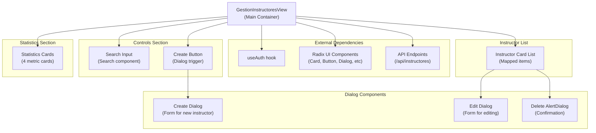

**Fuentes:** [gestion-instructores-view.tsx L79-L592](https://github.com/axchisan/gestionComplementarias/blob/a3d2dcb4/components/gestion-instructores-view.tsx#L79-L592)

---

## Modelos de datos e interfaces

El componente define dos interfaces TypeScript principales que estructuran los datos que administra.

### Interfaz del instructor

| Campo | Tipo | Descripción |
| --- | --- | --- |
| `id` | `string` | Identificador único del instructor |
| `name` | `string` | Nombre completo del instructor |
| `email` | `string` | Dirección de correo electrónico (utilizada para iniciar sesión) |
| `cedula` | `string` | Número de identificación nacional |
| `telefono` | `string`(opcional) | Número de teléfono |
| `especialidad` | `string`(opcional) | Área de especialización |
| `isActive` | `boolean` | Estado activo de la cuenta |
| `role` | `string` | Rol de usuario (normalmente "INSTRUCTOR") |
| `createdAt` | `string` | Marca de tiempo de creación de la cuenta |
| `centro.nombre` | `string` | Nombre del centro de formación asignado |
| `estadisticas` | `object`(opcional) | Objeto de estadísticas de rendimiento |

**Fuentes:** [gestion-instructores-view.tsx L48-L68](https://github.com/axchisan/gestionComplementarias/blob/a3d2dcb4/components/gestion-instructores-view.tsx#L48-L68)

### Nueva interfaz del instructor

Esta interfaz define la estructura para crear nuevas cuentas de instructor:

| Campo | Tipo | Requerido | Descripción |
| --- | --- | --- | --- |
| `name` | `string` | Sí | Nombre completo |
| `email` | `string` | Sí | Dirección de correo electrónico |
| `cedula` | `string` | Sí | Número de identificación nacional |
| `telefono` | `string` | Sí | Número de teléfono |
| `especialidad` | `string` | Sí | Área de especialización |
| `password` | `string` | Sí | Contraseña inicial (temporal) |

**Fuentes:** [gestion-instructores-view.tsx L70-L77](https://github.com/axchisan/gestionComplementarias/blob/a3d2dcb4/components/gestion-instructores-view.tsx#L70-L77)

### Estructura del objeto de estadísticas

El `estadisticas`campo interior `Instructor`contiene:

* `totalSolicitudes`: Número total de solicitudes creadas
* `solicitudesAprobadas`: Número de solicitudes aprobadas
* `tasaAprobacion`: Porcentaje de tasa de aprobación
* `totalAprendices`: Número total de alumnos atendidos
* `solicitudesPendientes`: Número de solicitudes pendientes

**Fuentes:** [gestion-instructores-view.tsx L61-L67](https://github.com/axchisan/gestionComplementarias/blob/a3d2dcb4/components/gestion-instructores-view.tsx#L61-L67)

---

## Gestión del Estado

The component uses React's `useState` hook to manage multiple pieces of local state. This diagram illustrates the state structure and how different UI actions trigger state updates.

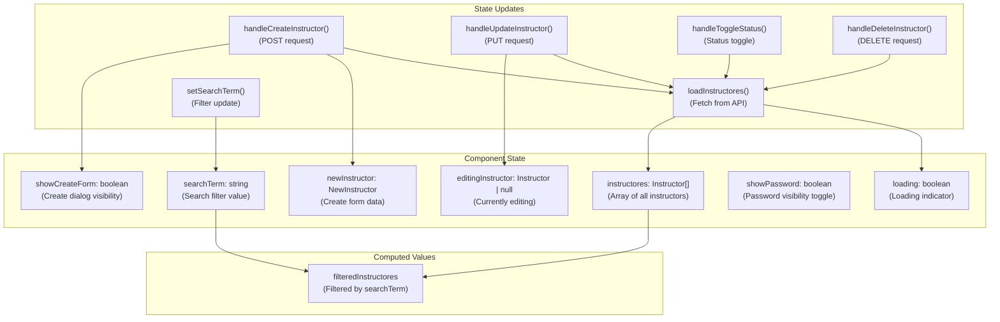

**Sources:** [components/gestion-instructores-view.tsx L80-L94](https://github.com/axchisan/gestionComplementarias/blob/a3d2dcb4/components/gestion-instructores-view.tsx#L80-L94)

 [components/gestion-instructores-view.tsx L214-L219](https://github.com/axchisan/gestionComplementarias/blob/a3d2dcb4/components/gestion-instructores-view.tsx#L214-L219)

---

## API Integration and Data Flow

The component communicates with the backend through RESTful API endpoints. All requests include JWT authentication via the `Authorization` header.

### API Endpoint Mapping

```mermaid
sequenceDiagram
  participant GestionInstructoresView
  participant useAuth
  participant /api/instructores
  participant Database

  note over GestionInstructoresView,Database: Initial Load
  GestionInstructoresView->>useAuth: Get token
  useAuth-->>GestionInstructoresView: JWT token
  GestionInstructoresView->>/api/instructores: GET /api/instructores
  /api/instructores->>Database: Authorization: Bearer {token}
  Database-->>/api/instructores: Query instructors for centro
  /api/instructores-->>GestionInstructoresView: Instructor records
  GestionInstructoresView->>GestionInstructoresView: {instructores: Instructor[]}
  note over GestionInstructoresView,Database: Create Instructor
  GestionInstructoresView->>/api/instructores: setInstructores(data)
  /api/instructores->>Database: POST /api/instructores
  Database-->>/api/instructores: Body: NewInstructor
  /api/instructores-->>GestionInstructoresView: INSERT user record
  GestionInstructoresView->>GestionInstructoresView: Created instructor
  note over GestionInstructoresView,Database: Update Instructor
  GestionInstructoresView->>/api/instructores: 200 OK
  /api/instructores->>Database: loadInstructores()
  Database-->>/api/instructores: PUT /api/instructores/{id}
  /api/instructores-->>GestionInstructoresView: Body: Partial updates
  GestionInstructoresView->>GestionInstructoresView: UPDATE user record
  note over GestionInstructoresView,Database: Delete Instructor
  GestionInstructoresView->>/api/instructores: Updated instructor
  /api/instructores->>Database: 200 OK
  Database-->>/api/instructores: loadInstructores()
  /api/instructores-->>GestionInstructoresView: DELETE /api/instructores/{id}
  GestionInstructoresView->>GestionInstructoresView: DELETE user record
```

**Sources:** [components/gestion-instructores-view.tsx L102-L120](https://github.com/axchisan/gestionComplementarias/blob/a3d2dcb4/components/gestion-instructores-view.tsx#L102-L120)

 [components/gestion-instructores-view.tsx L122-L148](https://github.com/axchisan/gestionComplementarias/blob/a3d2dcb4/components/gestion-instructores-view.tsx#L122-L148)

 [components/gestion-instructores-view.tsx L150-L176](https://github.com/axchisan/gestionComplementarias/blob/a3d2dcb4/components/gestion-instructores-view.tsx#L150-L176)

 [components/gestion-instructores-view.tsx L197-L212](https://github.com/axchisan/gestionComplementarias/blob/a3d2dcb4/components/gestion-instructores-view.tsx#L197-L212)

### HTTP Methods and Request Structure

| Operation | Method | Endpoint | Request Body | Handler Function |
| --- | --- | --- | --- | --- |
| Load all | `GET` | `/api/instructores` | None | `loadInstructores` |
| Create | `POST` | `/api/instructores` | `NewInstructor` object | `handleCreateInstructor` |
| Update | `PUT` | `/api/instructores/{id}` | Partial `Instructor` | `handleUpdateInstructor` |
| Toggle status | `PUT` | `/api/instructores/{id}` | `{ isActive: boolean }` | `handleToggleStatus` |
| Delete | `DELETE` | `/api/instructores/{id}` | None | `handleDeleteInstructor` |

**Sources:** [components/gestion-instructores-view.tsx L102-L212](https://github.com/axchisan/gestionComplementarias/blob/a3d2dcb4/components/gestion-instructores-view.tsx#L102-L212)

---

## Statistics Dashboard Section

The component displays four key metrics at the top of the interface, providing an overview of instructor activity and status.

### Statistics Card Layout

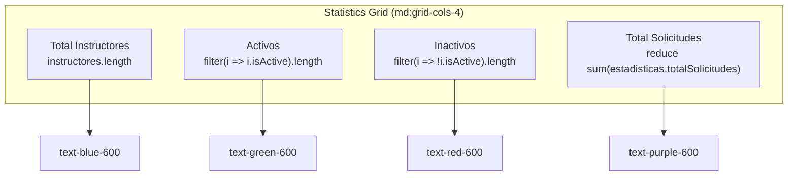

The statistics are computed dynamically from the `instructores` array:

* **Total Instructores**: `instructores.length` - counts all instructor records
* **Activos**: Filters for `isActive === true`
* **Inactivos**: Filters for `isActive === false`
* **Total Solicitudes**: Aggregates `estadisticas.totalSolicitudes` across all instructors

**Sources:** [components/gestion-instructores-view.tsx L235-L262](https://github.com/axchisan/gestionComplementarias/blob/a3d2dcb4/components/gestion-instructores-view.tsx#L235-L262)

---

## Search and Filter Functionality

The search feature enables filtering instructors by name, email, or cedula. The implementation uses a controlled input component with real-time filtering.

### Filter Logic

The `filteredInstructores` computed value applies case-insensitive matching:

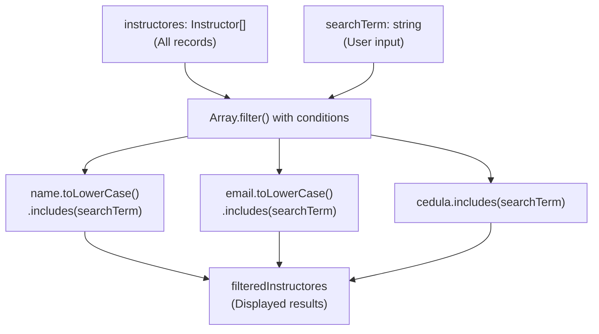

The search input component structure:

* Parent `<div>` with relative positioning
* `<Search>` icon positioned absolutely at left
* `<Input>` component with left padding for icon space
* `className="pl-10 w-80"` for styling

**Sources:** [components/gestion-instructores-view.tsx L214-L219](https://github.com/axchisan/gestionComplementarias/blob/a3d2dcb4/components/gestion-instructores-view.tsx#L214-L219)

 [components/gestion-instructores-view.tsx L269-L277](https://github.com/axchisan/gestionComplementarias/blob/a3d2dcb4/components/gestion-instructores-view.tsx#L269-L277)

---

## Create Instructor Dialog

The create dialog is implemented using Radix UI's `Dialog` component. It presents a modal form for entering new instructor information.

### Dialog Component Structure

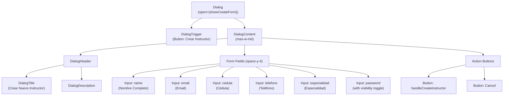

### Form State Management

Each input field is a controlled component bound to the `newInstructor` state object:

* Updates via `setNewInstructor({ ...newInstructor, fieldName: e.target.value })`
* Password field includes visibility toggle controlled by `showPassword` state
* Eye/EyeOff icon button toggles between password and text input types

**Sources:** [components/gestion-instructores-view.tsx L279-L369](https://github.com/axchisan/gestionComplementarias/blob/a3d2dcb4/components/gestion-instructores-view.tsx#L279-L369)

### Create Operation Flow

1. User clicks "Crear Instructor" button
2. Dialog opens (`showCreateForm` set to `true`)
3. User fills form fields (updates `newInstructor` state)
4. User clicks "Crear Instructor" in dialog
5. `handleCreateInstructor` executes: * Sends POST request to `/api/instructores` * On success: calls `loadInstructores()`, closes dialog, resets form
6. Dialog closes, list refreshes with new instructor

**Sources:** [components/gestion-instructores-view.tsx L122-L148](https://github.com/axchisan/gestionComplementarias/blob/a3d2dcb4/components/gestion-instructores-view.tsx#L122-L148)

---

## Edit Instructor Dialog

The edit dialog allows modification of existing instructor records. Unlike the create dialog, it excludes the password field and includes status management.

### Editable Fields

| Field | Component | Binding |
| --- | --- | --- |
| Name | `Input` | `editingInstructor.name` |
| Email | `Input` | `editingInstructor.email` |
| Teléfono | `Input` | `editingInstructor.telefono` |
| Especialidad | `Input` | `editingInstructor.especialidad` |
| Status | `Select` | `editingInstructor.isActive` |

The status field uses a `Select` component with two options:

* `"active"` → `isActive = true`
* `"inactive"` → `isActive = false`

**Sources:** [components/gestion-instructores-view.tsx L433-L513](https://github.com/axchisan/gestionComplementarias/blob/a3d2dcb4/components/gestion-instructores-view.tsx#L433-L513)

### Edit Operation Sequence

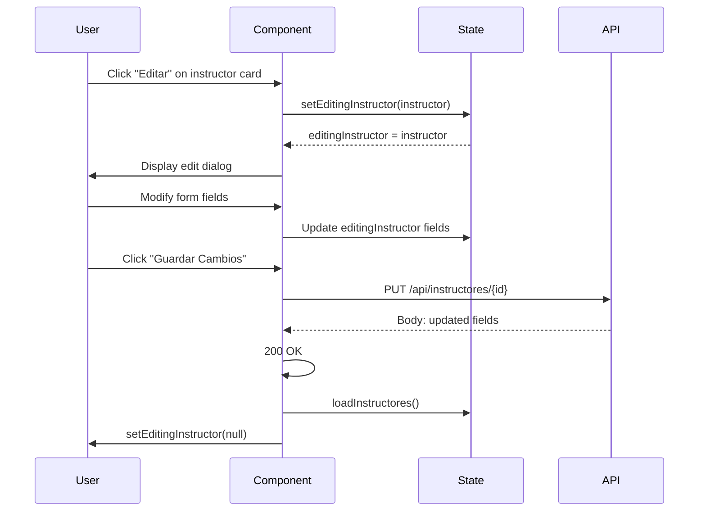

The dialog's open state is controlled by comparing `editingInstructor?.id === instructor.id`, ensuring only one instructor can be edited at a time.

**Sources:** [components/gestion-instructores-view.tsx L150-L176](https://github.com/axchisan/gestionComplementarias/blob/a3d2dcb4/components/gestion-instructores-view.tsx#L150-L176)

 [components/gestion-instructores-view.tsx L433-L513](https://github.com/axchisan/gestionComplementarias/blob/a3d2dcb4/components/gestion-instructores-view.tsx#L433-L513)

---

## Status Toggle and Delete Operations

Each instructor card displays action buttons for status management and deletion.

### Status Toggle Button

The toggle button provides quick activation/deactivation:

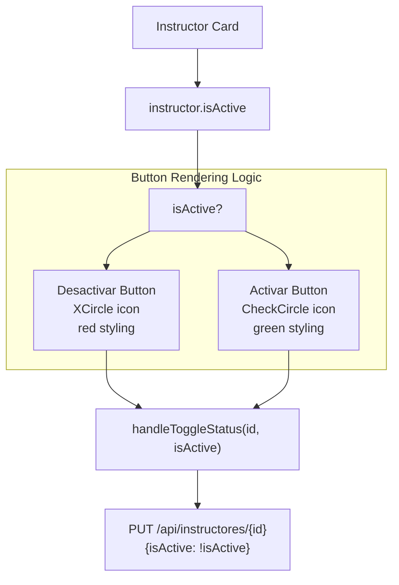

**Sources:** [components/gestion-instructores-view.tsx L178-L195](https://github.com/axchisan/gestionComplementarias/blob/a3d2dcb4/components/gestion-instructores-view.tsx#L178-L195)

 [components/gestion-instructores-view.tsx L515-L536](https://github.com/axchisan/gestionComplementarias/blob/a3d2dcb4/components/gestion-instructores-view.tsx#L515-L536)

### Delete Confirmation AlertDialog

The delete operation requires explicit confirmation using `AlertDialog`:

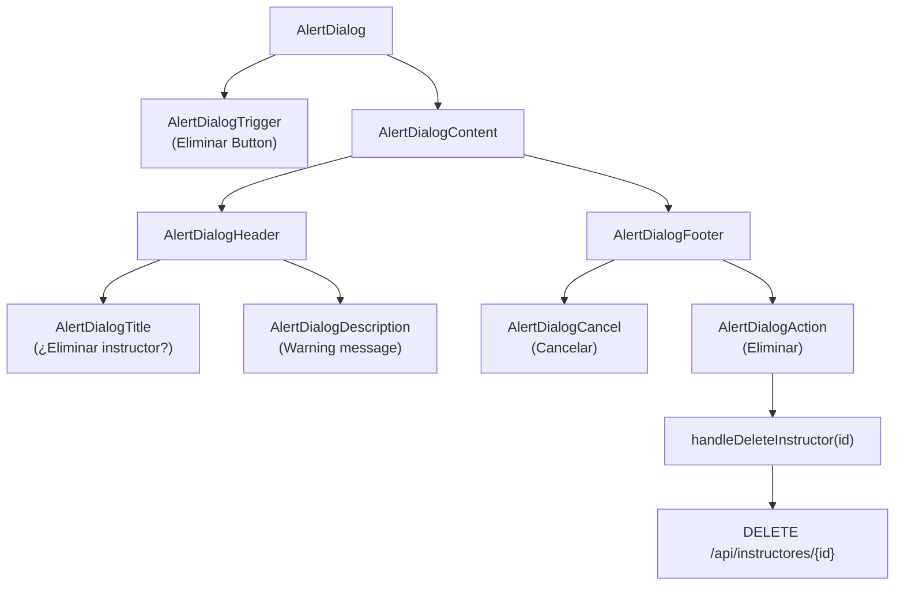

The confirmation message includes the instructor's name and warns that "se eliminará permanentemente el instructor {instructor.name} y todas sus solicitudes asociadas."

**Sources:** [components/gestion-instructores-view.tsx L197-L212](https://github.com/axchisan/gestionComplementarias/blob/a3d2dcb4/components/gestion-instructores-view.tsx#L197-L212)

 [components/gestion-instructores-view.tsx L538-L567](https://github.com/axchisan/gestionComplementarias/blob/a3d2dcb4/components/gestion-instructores-view.tsx#L538-L567)

---

## Instructor Card Display

Each instructor is rendered as a card component with comprehensive information display and action buttons.

### Card Layout Structure

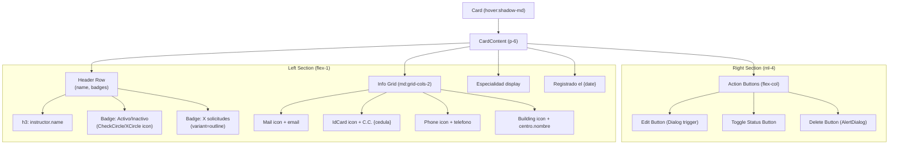

**Sources:** [components/gestion-instructores-view.tsx L376-L572](https://github.com/axchisan/gestionComplementarias/blob/a3d2dcb4/components/gestion-instructores-view.tsx#L376-L572)

### Badge Styling Logic

| Condition | Badge Class | Icon | Text |
| --- | --- | --- | --- |
| `isActive === true` | `bg-green-100 text-green-800` | `CheckCircle` | "Activo" |
| `isActive === false` | `bg-red-100 text-red-800` | `XCircle` | "Inactivo" |
| Solicitudes count | `variant="outline"` | None | "{count} solicitudes" |

**Sources:** [components/gestion-instructores-view.tsx L383-L396](https://github.com/axchisan/gestionComplementarias/blob/a3d2dcb4/components/gestion-instructores-view.tsx#L383-L396)

### Date Formatting

The `createdAt` timestamp is formatted using `date-fns`:

```
format(new Date(instructor.createdAt), "PPP", { locale: es })
```

This produces Spanish-localized dates like "15 de enero de 2024".

**Sources:** [components/gestion-instructores-view.tsx L427-L429](https://github.com/axchisan/gestionComplementarias/blob/a3d2dcb4/components/gestion-instructores-view.tsx#L427-L429)

 [components/gestion-instructores-view.tsx L45-L46](https://github.com/axchisan/gestionComplementarias/blob/a3d2dcb4/components/gestion-instructores-view.tsx#L45-L46)

---

## Empty State Handling

The component includes two empty state scenarios with user-friendly messaging.

### Empty State Display Conditions

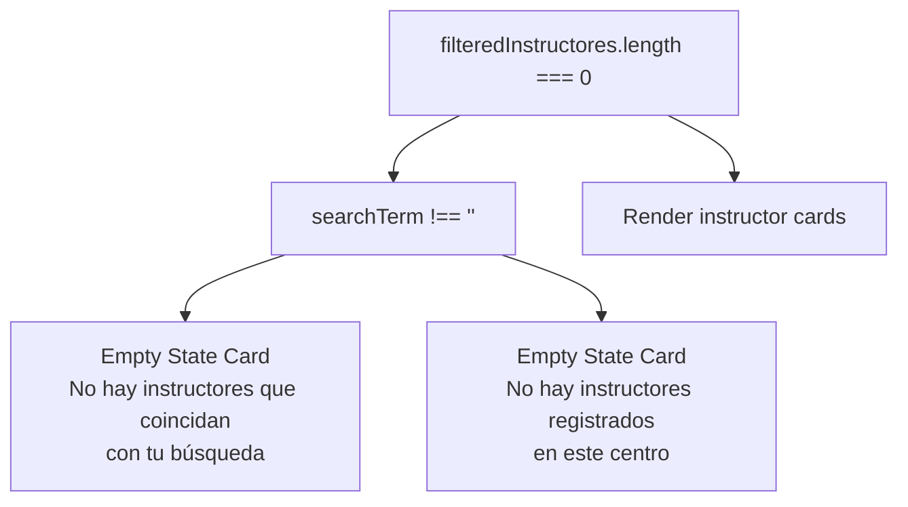

The empty state card displays:

* Gray circular background with `Users` icon (h-12 w-12)
* Heading: "No se encontraron instructores"
* Contextual message based on whether search is active

**Sources:** [components/gestion-instructores-view.tsx L575-L589](https://github.com/axchisan/gestionComplementarias/blob/a3d2dcb4/components/gestion-instructores-view.tsx#L575-L589)

---

## Loading State

The component displays a loading indicator while fetching instructor data from the API.

### Loading State Conditions

* Initial render: `useEffect` triggers `loadInstructores()` when `token` is available
* `loading` state set to `true` at start of `loadInstructores()`
* `loading` state set to `false` in `finally` block after API response

During loading, the component renders:

* Centered card with spinning animation
* Green border spinning circle (border-green-600)
* Text: "Cargando instructores..."

**Sources:** [components/gestion-instructores-view.tsx L96-L100](https://github.com/axchisan/gestionComplementarias/blob/a3d2dcb4/components/gestion-instructores-view.tsx#L96-L100)

 [components/gestion-instructores-view.tsx L102-L120](https://github.com/axchisan/gestionComplementarias/blob/a3d2dcb4/components/gestion-instructores-view.tsx#L102-L120)

 [components/gestion-instructores-view.tsx L221-L230](https://github.com/axchisan/gestionComplementarias/blob/a3d2dcb4/components/gestion-instructores-view.tsx#L221-L230)

---

## UI Component Dependencies

The `GestionInstructoresView` component relies on multiple Radix UI primitives and custom UI components.

### Component Import Mapping

| Import | Purpose | Usage |
| --- | --- | --- |
| `Card`, `CardContent` | Container layout | Wraps statistics, controls, and instructor cards |
| `Button` | Interactive actions | Create, edit, delete, toggle status operations |
| `Badge` | Status indicators | Active/inactive status, solicitudes count |
| `Input` | Form fields | Name, email, cedula, phone, specialization fields |
| `Label` | Form labels | Describes each input field |
| `Select` | Dropdown selection | Status selection in edit dialog |
| `Dialog` | Modal forms | Create and edit instructor dialogs |
| `AlertDialog` | Confirmation | Delete confirmation with warning |
| Lucide icons | Visual indicators | Users, UserPlus, Edit, Trash2, Search, Mail, Phone, etc. |

**Sources:** [components/gestion-instructores-view.tsx L3-L43](https://github.com/axchisan/gestionComplementarias/blob/a3d2dcb4/components/gestion-instructores-view.tsx#L3-L43)

### Icon Usage Reference

| Icon | Component | Purpose |
| --- | --- | --- |
| `Users` | Empty state | Visual indicator for no instructors |
| `UserPlus` | Create button | Add new instructor action |
| `Edit` | Edit button | Modify instructor action |
| `Trash2` | Delete button | Remove instructor action |
| `Search` | Search input | Filter functionality indicator |
| `Mail` | Info display | Email address indicator |
| `Phone` | Info display | Phone number indicator |
| `IdCard` (Award) | Info display | Cedula indicator |
| `Building` | Info display | Centro name indicator |
| `CheckCircle` | Status badge | Active status indicator |
| `XCircle` | Status badge | Inactive status indicator |
| `Eye` / `EyeOff` | Password field | Activar o desactivar la visibilidad de la contraseña |

**Fuentes:** [gestion-instructores-view.tsx L30-L43](https://github.com/axchisan/gestionComplementarias/blob/a3d2dcb4/components/gestion-instructores-view.tsx#L30-L43)

---

## Integración de autenticación

El componente utiliza el `useAuth`gancho personalizado para acceder al contexto de autenticación y recuperar el token JWT para solicitudes de API.

### Uso del contexto de autenticación

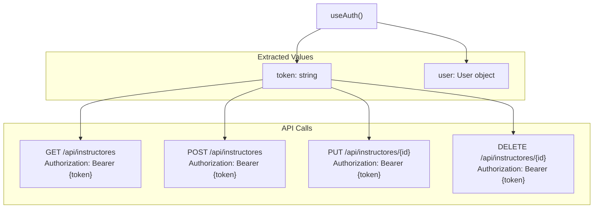

Se `token`incluye en el `Authorization`encabezado de todas las solicitudes de API:

```
headers: {
  Authorization: `Bearer ${token}`
}
```

El `useEffect`gancho activa la carga de datos inicial cuando el token está disponible, lo que garantiza que el componente solo obtenga datos después de una autenticación exitosa.

**Fuentes:** [gestion-instructores-view.tsx L44](https://github.com/axchisan/gestionComplementarias/blob/a3d2dcb4/components/gestion-instructores-view.tsx#L44-L44)

 [gestion-instructores-view.tsx L80](https://github.com/axchisan/gestionComplementarias/blob/a3d2dcb4/components/gestion-instructores-view.tsx#L80-L80)

 [gestion-instructores-view.tsx L96-L100](https://github.com/axchisan/gestionComplementarias/blob/a3d2dcb4/components/gestion-instructores-view.tsx#L96-L100)