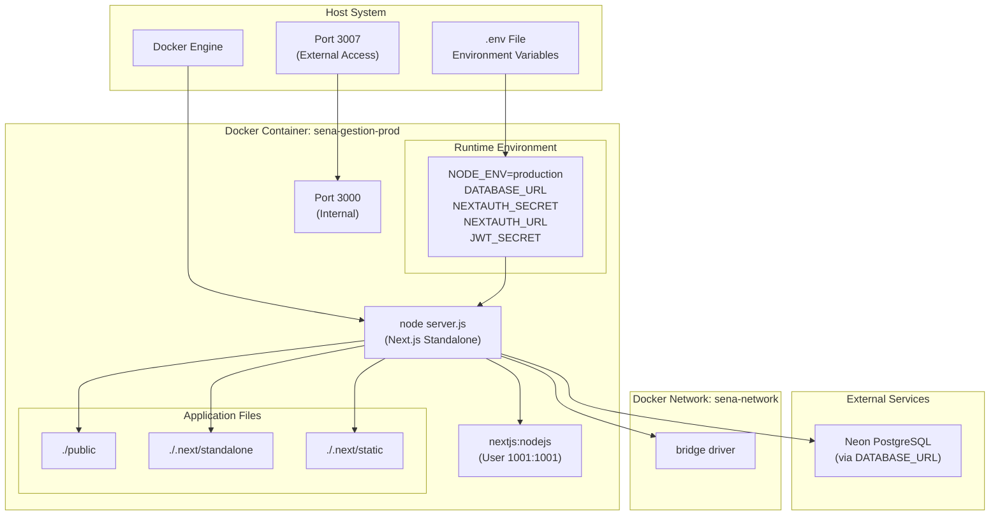
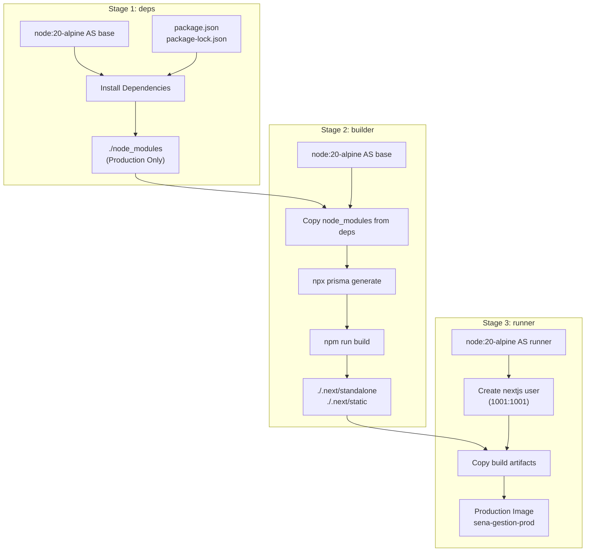
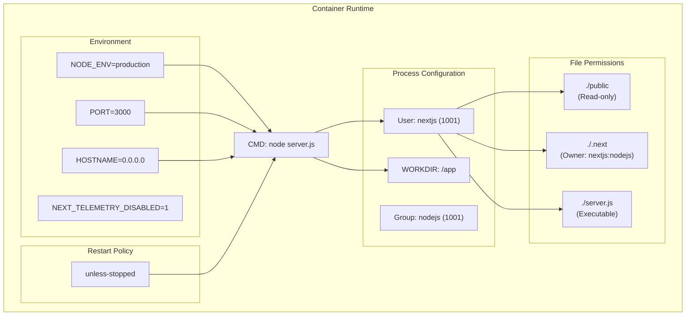
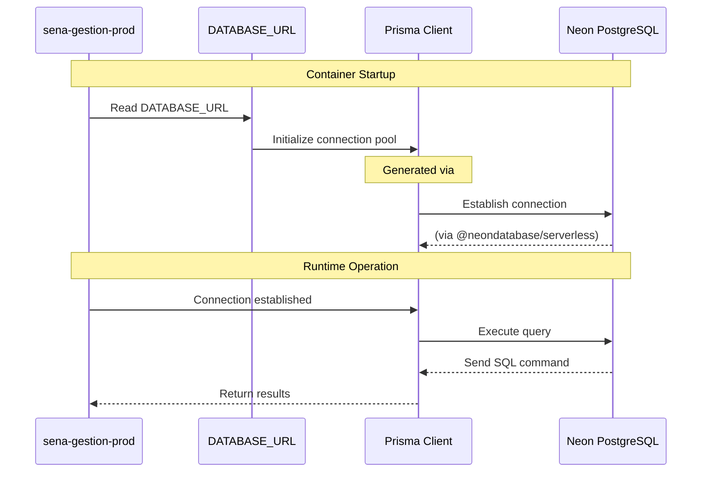

# Deployment and Operations

> **Relevant source files**
> * [Dockerfile](https://github.com/axchisan/gestionComplementarias/blob/a3d2dcb4/Dockerfile)
> * [docker-compose.yml](https://github.com/axchisan/gestionComplementarias/blob/a3d2dcb4/docker-compose.yml)
> * [next.config.mjs](https://github.com/axchisan/gestionComplementarias/blob/a3d2dcb4/next.config.mjs)

## Purpose and Scope

This document provides an overview of the deployment architecture and operational configuration for the SENA Gestión Complementarias system. It covers the Docker-based containerization strategy, environment configuration requirements, networking setup, and the production build pipeline.

For detailed Docker configuration and multi-stage build process, see [Docker Configuration](/axchisan/gestionComplementarias/7.1-docker-configuration). For step-by-step production deployment procedures and operational best practices, see [Production Deployment Guide](/axchisan/gestionComplementarias/7.2-production-deployment-guide). For general system architecture concepts, refer to [System Architecture](/axchisan/gestionComplementarias/3-system-architecture) and [Deployment Architecture](/axchisan/gestionComplementarias/3.1-deployment-architecture).

**Sources:** docker-compose.yml, Dockerfile, next.config.mjs

---

## Deployment Architecture Overview

The application is deployed as a containerized Next.js application using Docker. The deployment strategy utilizes a multi-stage build process to produce an optimized, standalone production image that runs on Node.js 20 Alpine Linux.

### Container Architecture Diagram



**Key Components:**

* **Container Name:** `sena-gestion-prod` (defined in [docker-compose.yml L10](https://github.com/axchisan/gestionComplementarias/blob/a3d2dcb4/docker-compose.yml#L10-L10) )
* **Base Image:** `node:20-alpine` (defined in [Dockerfile L2](https://github.com/axchisan/gestionComplementarias/blob/a3d2dcb4/Dockerfile#L2-L2) )
* **Runtime User:** Non-root user `nextjs` (UID 1001, GID 1001) for security (defined in [Dockerfile L35-L36](https://github.com/axchisan/gestionComplementarias/blob/a3d2dcb4/Dockerfile#L35-L36) )
* **Entry Point:** `node server.js` executes the standalone Next.js server (defined in [Dockerfile L55](https://github.com/axchisan/gestionComplementarias/blob/a3d2dcb4/Dockerfile#L55-L55) )
* **Network:** Isolated bridge network `sena-network` (defined in [docker-compose.yml L23-L24](https://github.com/axchisan/gestionComplementarias/blob/a3d2dcb4/docker-compose.yml#L23-L24) )

**Sources:** docker-compose.yml:1-24, Dockerfile:28-55

---

## Port Mapping and Network Configuration

The application exposes port 3000 internally within the container and maps it to port 3007 on the host system for external access.

### Port and Network Configuration

| Component | Value | Configuration File | Purpose |
| --- | --- | --- | --- |
| **Host Port** | 3007 | [docker-compose.yml L12](https://github.com/axchisan/gestionComplementarias/blob/a3d2dcb4/docker-compose.yml#L12-L12) | External access point for web traffic |
| **Container Port** | 3000 | [docker-compose.yml L12](https://github.com/axchisan/gestionComplementarias/blob/a3d2dcb4/docker-compose.yml#L12-L12) <br>  [Dockerfile L50-L52](https://github.com/axchisan/gestionComplementarias/blob/a3d2dcb4/Dockerfile#L50-L52) | Internal Next.js server listening port |
| **Network Driver** | bridge | [docker-compose.yml L24](https://github.com/axchisan/gestionComplementarias/blob/a3d2dcb4/docker-compose.yml#L24-L24) | Network isolation for container |
| **Network Name** | sena-network | [docker-compose.yml L21-L23](https://github.com/axchisan/gestionComplementarias/blob/a3d2dcb4/docker-compose.yml#L21-L23) | Custom bridge network for service isolation |
| **Hostname** | 0.0.0.0 | [Dockerfile L53](https://github.com/axchisan/gestionComplementarias/blob/a3d2dcb4/Dockerfile#L53-L53) | Binds to all network interfaces |
| **Restart Policy** | unless-stopped | [docker-compose.yml L19](https://github.com/axchisan/gestionComplementarias/blob/a3d2dcb4/docker-compose.yml#L19-L19) | Automatic restart on failure |

The port mapping configuration allows the application to be accessed via `http://<host-ip>:3007` while maintaining internal port 3000 for the Next.js process.

**Sources:** docker-compose.yml:12,19-24, Dockerfile:50-53

---

## Environment Configuration Requirements

The application requires four critical environment variables for operation. These are injected into the container at runtime via docker-compose.

### Environment Variables Table

| Variable | Purpose | Required | Configured In | Usage |
| --- | --- | --- | --- | --- |
| `NODE_ENV` | Runtime environment mode | Yes | [docker-compose.yml L14](https://github.com/axchisan/gestionComplementarias/blob/a3d2dcb4/docker-compose.yml#L14-L14) <br>  [Dockerfile L32](https://github.com/axchisan/gestionComplementarias/blob/a3d2dcb4/Dockerfile#L32-L32) | Set to `production` for optimized builds |
| `DATABASE_URL` | PostgreSQL connection string | Yes | [docker-compose.yml L15](https://github.com/axchisan/gestionComplementarias/blob/a3d2dcb4/docker-compose.yml#L15-L15) | Neon serverless database connection |
| `NEXTAUTH_SECRET` | NextAuth.js session encryption key | Yes | [docker-compose.yml L16](https://github.com/axchisan/gestionComplementarias/blob/a3d2dcb4/docker-compose.yml#L16-L16) | Secures authentication sessions |
| `NEXTAUTH_URL` | Application base URL | Yes | [docker-compose.yml L17](https://github.com/axchisan/gestionComplementarias/blob/a3d2dcb4/docker-compose.yml#L17-L17) | Callback URLs for authentication |
| `JWT_SECRET` | JWT token signing secret | Yes | [docker-compose.yml L18](https://github.com/axchisan/gestionComplementarias/blob/a3d2dcb4/docker-compose.yml#L18-L18) | Signs and verifies JWT tokens |
| `NEXT_TELEMETRY_DISABLED` | Disables Next.js telemetry | No | [Dockerfile L24-L33](https://github.com/axchisan/gestionComplementarias/blob/a3d2dcb4/Dockerfile#L24-L33) | Set to `1` to disable analytics |
| `PORT` | Server listening port | No | [Dockerfile L52](https://github.com/axchisan/gestionComplementarias/blob/a3d2dcb4/Dockerfile#L52-L52) | Defaults to 3000 |
| `HOSTNAME` | Server bind address | No | [Dockerfile L53](https://github.com/axchisan/gestionComplementarias/blob/a3d2dcb4/Dockerfile#L53-L53) | Defaults to 0.0.0.0 |

All required environment variables must be defined in a `.env` file in the project root and are passed through to the container via the `${VARIABLE}` syntax in [docker-compose.yml L15-L18](https://github.com/axchisan/gestionComplementarias/blob/a3d2dcb4/docker-compose.yml#L15-L18)

**Sources:** docker-compose.yml:13-18, Dockerfile:24,32-33,52-53

---

## Multi-Stage Build Pipeline

The Docker build process uses a three-stage pipeline to minimize final image size and optimize for production deployment.

### Build Pipeline Diagram



### Stage Breakdown

**Stage 1: deps** ([Dockerfile L5-L11](https://github.com/axchisan/gestionComplementarias/blob/a3d2dcb4/Dockerfile#L5-L11)

)

* Base: `node:20-alpine`
* Purpose: Install production dependencies only
* Output: `/app/node_modules` directory
* Optimization: Uses `npm ci --only=production` to exclude dev dependencies

**Stage 2: builder** ([Dockerfile L14-L25](https://github.com/axchisan/gestionComplementarias/blob/a3d2dcb4/Dockerfile#L14-L25)

)

* Base: `node:20-alpine`
* Purpose: Generate Prisma client and build Next.js application
* Key Steps: * Installs OpenSSL for Prisma ([Dockerfile L15](https://github.com/axchisan/gestionComplementarias/blob/a3d2dcb4/Dockerfile#L15-L15) ) * Copies `node_modules` from deps stage ([Dockerfile L17](https://github.com/axchisan/gestionComplementarias/blob/a3d2dcb4/Dockerfile#L17-L17) ) * Runs `npx prisma generate` ([Dockerfile L21](https://github.com/axchisan/gestionComplementarias/blob/a3d2dcb4/Dockerfile#L21-L21) ) * Executes `npm run build` ([Dockerfile L25](https://github.com/axchisan/gestionComplementarias/blob/a3d2dcb4/Dockerfile#L25-L25) )
* Output: `.next/standalone` and `.next/static` directories

**Stage 3: runner** ([Dockerfile L28-L55](https://github.com/axchisan/gestionComplementarias/blob/a3d2dcb4/Dockerfile#L28-L55)

)

* Base: `node:20-alpine`
* Purpose: Create minimal production runtime image
* Security: Creates non-root `nextjs` user with UID/GID 1001 ([Dockerfile L35-L36](https://github.com/axchisan/gestionComplementarias/blob/a3d2dcb4/Dockerfile#L35-L36) )
* Files Copied: * `./public` directory ([Dockerfile L38](https://github.com/axchisan/gestionComplementarias/blob/a3d2dcb4/Dockerfile#L38-L38) ) * `.next/standalone` with correct ownership ([Dockerfile L45](https://github.com/axchisan/gestionComplementarias/blob/a3d2dcb4/Dockerfile#L45-L45) ) * `.next/static` with correct ownership ([Dockerfile L46](https://github.com/axchisan/gestionComplementarias/blob/a3d2dcb4/Dockerfile#L46-L46) )
* Final Size: Significantly reduced due to standalone output mode

**Sources:** Dockerfile:1-55

---

## Next.js Standalone Output Mode

The application uses Next.js standalone output mode to create a self-contained deployment artifact that includes only necessary dependencies.

### Standalone Configuration

The standalone mode is configured in [next.config.mjs L3-L4](https://github.com/axchisan/gestionComplementarias/blob/a3d2dcb4/next.config.mjs#L3-L4)

:

```yaml
output: 'standalone'
outputFileTracingRoot: process.cwd()
```

This configuration instructs Next.js to:

1. Trace all required dependencies during build
2. Output a minimal `server.js` file in `.next/standalone`
3. Copy only necessary `node_modules` files
4. Exclude unnecessary development dependencies

The final image runs `node server.js` ([Dockerfile L55](https://github.com/axchisan/gestionComplementarias/blob/a3d2dcb4/Dockerfile#L55-L55)

), which serves the complete application without requiring the full `node_modules` directory from the build stage.

**Benefits:**

* Reduced image size (typically 50-70% smaller)
* Faster container startup time
* Minimized attack surface (fewer dependencies)
* Simplified deployment (single entry point)

**Sources:** next.config.mjs:3-4, Dockerfile:45,55

---

## Security Headers and CORS Configuration

The production deployment includes security headers configured at the Next.js level to protect against common web vulnerabilities.

### Security Headers Table

| Header | Value | Purpose | Configured In |
| --- | --- | --- | --- |
| `X-Frame-Options` | DENY | Prevents clickjacking attacks by disabling iframe embedding | [next.config.mjs L20-L22](https://github.com/axchisan/gestionComplementarias/blob/a3d2dcb4/next.config.mjs#L20-L22) |
| `X-Content-Type-Options` | nosniff | Prevents MIME type sniffing | [next.config.mjs L24-L26](https://github.com/axchisan/gestionComplementarias/blob/a3d2dcb4/next.config.mjs#L24-L26) |
| `Referrer-Policy` | origin-when-cross-origin | Controls referrer information sent with requests | [next.config.mjs L28-L30](https://github.com/axchisan/gestionComplementarias/blob/a3d2dcb4/next.config.mjs#L28-L30) |
| `Access-Control-Allow-Origin` | [https://gestioncomplementarias.axchisan.com](https://gestioncomplementarias.axchisan.com) | Restricts API access to specific domain | [next.config.mjs L32-L34](https://github.com/axchisan/gestionComplementarias/blob/a3d2dcb4/next.config.mjs#L32-L34) |
| `Access-Control-Allow-Methods` | GET, POST, PUT, DELETE, OPTIONS | Defines allowed HTTP methods | [next.config.mjs L36-L38](https://github.com/axchisan/gestionComplementarias/blob/a3d2dcb4/next.config.mjs#L36-L38) |
| `Access-Control-Allow-Headers` | Content-Type, Authorization | Specifies allowed request headers | [next.config.mjs L40-L42](https://github.com/axchisan/gestionComplementarias/blob/a3d2dcb4/next.config.mjs#L40-L42) |

These headers are automatically applied to all routes via the `async headers()` function in [next.config.mjs L14-L46](https://github.com/axchisan/gestionComplementarias/blob/a3d2dcb4/next.config.mjs#L14-L46)

**Sources:** next.config.mjs:14-46

---

## Build Optimizations

Several build-time optimizations are configured to improve production performance and build reliability.

### Optimization Configuration

| Setting | Value | Purpose | Location |
| --- | --- | --- | --- |
| **output** | standalone | Minimal production bundle | [next.config.mjs L3](https://github.com/axchisan/gestionComplementarias/blob/a3d2dcb4/next.config.mjs#L3-L3) |
| **outputFileTracingRoot** | process.cwd() | Traces dependencies from project root | [next.config.mjs L4](https://github.com/axchisan/gestionComplementarias/blob/a3d2dcb4/next.config.mjs#L4-L4) |
| **eslint.ignoreDuringBuilds** | true | Skips ESLint checks during production build | [next.config.mjs L6](https://github.com/axchisan/gestionComplementarias/blob/a3d2dcb4/next.config.mjs#L6-L6) |
| **typescript.ignoreBuildErrors** | true | Allows build despite TypeScript errors | [next.config.mjs L9](https://github.com/axchisan/gestionComplementarias/blob/a3d2dcb4/next.config.mjs#L9-L9) |
| **images.unoptimized** | true | Disables Next.js image optimization | [next.config.mjs L12](https://github.com/axchisan/gestionComplementarias/blob/a3d2dcb4/next.config.mjs#L12-L12) |
| **NEXT_TELEMETRY_DISABLED** | 1 | Disables Next.js telemetry | [Dockerfile L24-L33](https://github.com/axchisan/gestionComplementarias/blob/a3d2dcb4/Dockerfile#L24-L33) |

The `ignoreDuringBuilds` and `ignoreBuildErrors` settings prioritize deployment speed over strict type checking, which is handled separately in the development environment. Image optimization is disabled because the application uses external image sources or does not heavily rely on the Next.js Image component.

**Sources:** next.config.mjs:3-12, Dockerfile:24,33

---

## Container Runtime Configuration

The container runs with specific security and resource configurations to ensure stable operation.

### Runtime Configuration Diagram



### Key Runtime Settings

**User Isolation** ([Dockerfile L35-L48](https://github.com/axchisan/gestionComplementarias/blob/a3d2dcb4/Dockerfile#L35-L48)

):

* Application runs as non-root user `nextjs` (UID 1001)
* Group `nodejs` (GID 1001)
* Prevents privilege escalation vulnerabilities

**File Ownership** ([Dockerfile L40-L46](https://github.com/axchisan/gestionComplementarias/blob/a3d2dcb4/Dockerfile#L40-L46)

):

* `.next` directory owned by `nextjs:nodejs` for cache writes
* `standalone` and `static` directories have correct ownership for read access
* Prevents permission errors during runtime

**Restart Policy** ([docker-compose.yml L19](https://github.com/axchisan/gestionComplementarias/blob/a3d2dcb4/docker-compose.yml#L19-L19)

):

* `unless-stopped`: Container restarts on failure
* Does not restart if manually stopped
* Ensures high availability in production

**Sources:** docker-compose.yml:19, Dockerfile:35-36,40-46,48,50-55

---

## Dependency Management

The build process installs dependencies in multiple stages with different scopes.

### Dependency Installation Strategy

| Stage | Command | Dependencies Included | Purpose |
| --- | --- | --- | --- |
| **deps** | `npm ci --only=production` | Production only | Minimal runtime dependencies |
| **builder** | Copies from deps | Production + uses build cache | Builds application with production deps |
| **runner** | Copies from builder | Traced by standalone | Only dependencies required at runtime |

The Prisma client is generated during the builder stage with `npx prisma generate` ([Dockerfile L21](https://github.com/axchisan/gestionComplementarias/blob/a3d2dcb4/Dockerfile#L21-L21)

), which creates the type-safe database client required for the application to interact with the PostgreSQL database.

**Alpine Linux Requirements:**

* `libc6-compat` installed in deps stage ([Dockerfile L6](https://github.com/axchisan/gestionComplementarias/blob/a3d2dcb4/Dockerfile#L6-L6) ) for binary compatibility
* `openssl` installed in builder and runner stages ([Dockerfile L15-L29](https://github.com/axchisan/gestionComplementarias/blob/a3d2dcb4/Dockerfile#L15-L29) ) for Prisma and HTTPS support

**Sources:** Dockerfile:6,11,15,21,29

---

## Database Connectivity

The application connects to a Neon PostgreSQL serverless database via the `DATABASE_URL` environment variable.

### Database Connection Flow



The `DATABASE_URL` must be a valid PostgreSQL connection string in the format:

```yaml
postgresql://[user]:[password]@[host]/[database]?sslmode=require
```

The connection is managed by the Prisma client generated during the build phase, which includes the Neon serverless driver for optimal performance with serverless databases.

**Sources:** docker-compose.yml:15, Dockerfile:21

---

## Operational Considerations

### Container Management Commands

| Operation | Command | Purpose |
| --- | --- | --- |
| **Start Services** | `docker-compose up -d` | Start container in detached mode |
| **Stop Services** | `docker-compose down` | Stop and remove container |
| **View Logs** | `docker logs sena-gestion-prod` | View application logs |
| **Follow Logs** | `docker logs -f sena-gestion-prod` | Stream logs in real-time |
| **Restart** | `docker restart sena-gestion-prod` | Restart container |
| **Rebuild** | `docker-compose build --no-cache` | Rebuild image from scratch |
| **Execute Shell** | `docker exec -it sena-gestion-prod sh` | Access container shell |

### Health Monitoring

The application exposes the Next.js application on port 3000 internally. Health checks can be performed by:

* HTTP GET to `http://localhost:3007/` (external)
* HTTP GET to `http://localhost:3000/` (internal to container)

Container health can be monitored via:

* `docker ps` - Check container status
* `docker inspect sena-gestion-prod` - Detailed container information
* `docker stats sena-gestion-prod` - Real-time resource usage

### Log Management

Application logs are written to stdout/stderr and captured by Docker:

* Location: `/var/lib/docker/containers/[container-id]/[container-id]-json.log`
* Format: JSON log entries with timestamps
* Rotation: Managed by Docker logging driver (default: json-file)

**Sources:** docker-compose.yml:1-24, Dockerfile:1-55

---

## Summary

The SENA Gestión Complementarias application deploys as a Docker container using a three-stage build pipeline that produces an optimized standalone Next.js application. The deployment architecture provides:

* **Containerization**: Single `sena-gestion-prod` container with minimal Alpine Linux base
* **Port Mapping**: External port 3007 mapping to internal port 3000
* **Security**: Non-root user execution, security headers, and network isolation
* **Optimization**: Standalone output mode with automatic dependency tracing
* **Reliability**: Automatic restart policy and proper error handling
* **Database**: External Neon PostgreSQL connection via environment variable

For detailed implementation instructions, see [Docker Configuration](/axchisan/gestionComplementarias/7.1-docker-configuration) for container setup and [Production Deployment Guide](/axchisan/gestionComplementarias/7.2-production-deployment-guide) for deployment procedures.

**Sources:** docker-compose.yml:1-24, Dockerfile:1-55, next.config.mjs:1-49