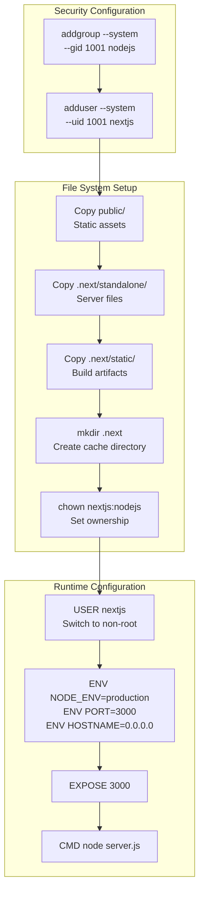
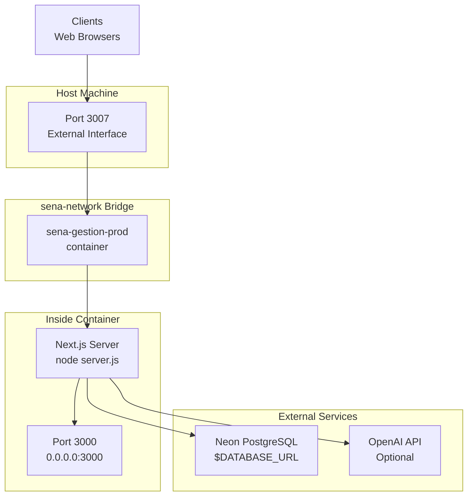

# Docker Configuration

> **Relevant source files**
> * [Dockerfile](https://github.com/axchisan/gestionComplementarias/blob/a3d2dcb4/Dockerfile)
> * [docker-compose.yml](https://github.com/axchisan/gestionComplementarias/blob/a3d2dcb4/docker-compose.yml)

## Purpose and Scope

This document provides a comprehensive explanation of the Docker containerization strategy for the SENA Gestión Complementarias application. It covers the multi-stage Dockerfile build process, docker-compose service orchestration, and container runtime configuration.

For information about production deployment procedures and operational considerations, see [Production Deployment Guide](/axchisan/gestionComplementarias/7.2-production-deployment-guide). For general system architecture and deployment patterns, see [Deployment Architecture](/axchisan/gestionComplementarias/3.1-deployment-architecture).

## Overview

The application uses a Docker-based deployment strategy with a multi-stage build process that optimizes image size and security. The containerization is defined across two key files:

* **Dockerfile**: Defines the multi-stage build process with four distinct stages
* **docker-compose.yml**: Orchestrates the container service, network, and environment configuration

The container runs a standalone Next.js application on port 3000 (internally), exposed as port 3007 on the host machine.

**Sources:** [Dockerfile L1-L55](https://github.com/axchisan/gestionComplementarias/blob/a3d2dcb4/Dockerfile#L1-L55)

 [docker-compose.yml L1-L24](https://github.com/axchisan/gestionComplementarias/blob/a3d2dcb4/docker-compose.yml#L1-L24)

## Multi-Stage Build Architecture

The Dockerfile implements a four-stage build process that separates dependency installation, application building, and production runtime. This approach minimizes the final image size and reduces the attack surface.

```

```

**Multi-Stage Build Flow**

**Sources:** [Dockerfile L1-L55](https://github.com/axchisan/gestionComplementarias/blob/a3d2dcb4/Dockerfile#L1-L55)

### Stage 1: Base Image (base)

The base stage establishes the foundation using Node.js 20 on Alpine Linux, a minimal distribution that reduces image size.

```dockerfile
FROM node:20-alpine AS base
```

Alpine Linux is chosen for its small footprint (~5MB base) while providing necessary runtime dependencies for Node.js applications.

**Sources:** [Dockerfile L2](https://github.com/axchisan/gestionComplementarias/blob/a3d2dcb4/Dockerfile#L2-L2)

### Stage 2: Dependency Installation (deps)

The `deps` stage installs production dependencies in an isolated layer that can be cached across builds.

| Step | Command | Purpose |
| --- | --- | --- |
| Install compatibility layer | `apk add --no-cache libc6-compat` | Provides GNU libc compatibility for Node.js native modules |
| Copy package manifests | `COPY package.json package-lock.json*` | Brings dependency declarations |
| Install dependencies | `npm ci --only=production` | Clean install of production dependencies only |

The `npm ci` command performs a clean install based on the lock file, ensuring reproducible builds. The `--only=production` flag excludes development dependencies, reducing the dependency footprint.

**Sources:** [Dockerfile L5-L11](https://github.com/axchisan/gestionComplementarias/blob/a3d2dcb4/Dockerfile#L5-L11)

### Stage 3: Application Build (builder)

The `builder` stage compiles the Next.js application and generates the Prisma client.

| Step | Command | Purpose |
| --- | --- | --- |
| Install OpenSSL | `apk add --no-cache openssl` | Required for Prisma client generation |
| Copy dependencies | `COPY --from=deps /app/node_modules` | Reuses installed node_modules from deps stage |
| Copy source code | `COPY . .` | Brings application source files |
| Generate Prisma | `npx prisma generate` | Generates type-safe Prisma client from schema |
| Build Next.js | `npm run build` | Compiles Next.js application with standalone output |

The `NEXT_TELEMETRY_DISABLED=1` environment variable disables Next.js telemetry during the build process.

**Sources:** [Dockerfile L14-L25](https://github.com/axchisan/gestionComplementarias/blob/a3d2dcb4/Dockerfile#L14-L25)

### Stage 4: Production Runtime (runner)

The final `runner` stage creates a minimal production image with only the compiled application and runtime dependencies.



**Production Runtime Configuration**

Key security features implemented in the runner stage:

1. **Non-root execution**: Creates a dedicated `nextjs` system user (UID 1001) to run the application, preventing privilege escalation
2. **Minimal file system**: Only copies necessary runtime files using Next.js standalone output mode
3. **Proper ownership**: Sets correct file permissions with `chown nextjs:nodejs` on all application files

The standalone output mode (enabled in `next.config.js`) creates a self-contained bundle in `.next/standalone/` that includes only the necessary dependencies, significantly reducing image size compared to including the full `node_modules` directory.

**Sources:** [Dockerfile L28-L55](https://github.com/axchisan/gestionComplementarias/blob/a3d2dcb4/Dockerfile#L28-L55)

## Docker Compose Service Orchestration

The `docker-compose.yml` file defines the service configuration, networking, and environment variable injection for the production container.

```

```

**Sources:** [docker-compose.yml L1-L24](https://github.com/axchisan/gestionComplementarias/blob/a3d2dcb4/docker-compose.yml#L1-L24)

### Service Configuration

The `app` service defines the primary application container with the following configuration:

| Configuration | Value | Purpose |
| --- | --- | --- |
| `container_name` | `sena-gestion-prod` | Assigns a fixed container name for easy reference |
| `build.context` | `.` | Sets build context to repository root |
| `build.dockerfile` | `Dockerfile` | Specifies the Dockerfile to use |
| `build.args` | `NODE_ENV=production` | Passes build-time argument to Docker build |
| `restart` | `unless-stopped` | Automatically restarts container unless explicitly stopped |

**Sources:** [docker-compose.yml L4-L19](https://github.com/axchisan/gestionComplementarias/blob/a3d2dcb4/docker-compose.yml#L4-L19)

### Port Mapping

The container exposes port 3000 internally and maps it to port 3007 on the host:

```yaml
ports:
  - "3007:3000"
```

This configuration means:

* **Internal port**: 3000 (defined in `Dockerfile` with `EXPOSE 3000` and `ENV PORT 3000`)
* **Host port**: 3007 (accessible externally as `http://hostname:3007`)

The Next.js server listens on `0.0.0.0:3000` inside the container (configured via `ENV HOSTNAME "0.0.0.0"`), making it accessible through the Docker network bridge.

**Sources:** [docker-compose.yml L11-L12](https://github.com/axchisan/gestionComplementarias/blob/a3d2dcb4/docker-compose.yml#L11-L12)

 [Dockerfile L50-L53](https://github.com/axchisan/gestionComplementarias/blob/a3d2dcb4/Dockerfile#L50-L53)

### Environment Variables

The service injects five critical environment variables from the host environment:

| Variable | Purpose | Usage |
| --- | --- | --- |
| `NODE_ENV` | Sets Node.js environment mode | Must be `production` for optimized runtime |
| `DATABASE_URL` | PostgreSQL connection string | Used by Prisma client to connect to Neon database |
| `NEXTAUTH_SECRET` | NextAuth.js secret key | Signs and encrypts session tokens |
| `NEXTAUTH_URL` | Application base URL | Used for OAuth callbacks and CSRF validation |
| `JWT_SECRET` | JWT signing secret | Used by `jsonwebtoken` library for custom JWT tokens |

These variables must be defined in a `.env` file in the repository root or exported in the shell environment before running `docker-compose up`.

**Sources:** [docker-compose.yml L13-L18](https://github.com/axchisan/gestionComplementarias/blob/a3d2dcb4/docker-compose.yml#L13-L18)

### Network Configuration

The compose file defines a custom bridge network named `sena-network`:

```

```

The bridge driver creates an isolated network segment for the container. While this example has only one service, the network architecture supports future expansion for additional services (e.g., a separate database container, Redis cache, or monitoring services).

**Sources:** [docker-compose.yml L20-L24](https://github.com/axchisan/gestionComplementarias/blob/a3d2dcb4/docker-compose.yml#L20-L24)

## Container Build and Deployment Flow

The complete build and deployment process follows this sequence:

```mermaid
sequenceDiagram
  participant Developer
  participant Docker Engine
  participant docker-compose
  participant Stage: base
  participant Stage: deps
  participant Stage: builder
  participant Stage: runner
  participant sena-gestion-prod

  Developer->>docker-compose: "docker-compose up --build"
  docker-compose->>Docker Engine: "Parse docker-compose.yml"
  Docker Engine->>Docker Engine: "Load .env variables"
  note over Docker Engine,Stage: base: Build Stage 1: base
  Docker Engine->>Stage: base: "FROM node:20-alpine"
  Stage: base-->>Docker Engine: "Base image ready"
  note over Docker Engine,Stage: deps: Build Stage 2: deps
  Docker Engine->>Stage: deps: "RUN apk add libc6-compat"
  Docker Engine->>Stage: deps: "COPY package.json"
  Docker Engine->>Stage: deps: "RUN npm ci --only=production"
  Stage: deps-->>Docker Engine: "node_modules cached"
  note over Docker Engine,Stage: builder: Build Stage 3: builder
  Docker Engine->>Stage: builder: "COPY --from=deps node_modules"
  Docker Engine->>Stage: builder: "COPY source code"
  Docker Engine->>Stage: builder: "RUN npx prisma generate"
  Docker Engine->>Stage: builder: "RUN npm run build"
  Stage: builder-->>Docker Engine: ".next/standalone ready"
  note over Docker Engine,Stage: runner: Build Stage 4: runner
  Docker Engine->>Stage: runner: "Create nextjs user"
  Docker Engine->>Stage: runner: "COPY --from=builder standalone"
  Docker Engine->>Stage: runner: "COPY --from=builder static"
  Docker Engine->>Stage: runner: "Set permissions"
  Stage: runner-->>Docker Engine: "Final image created"
  Docker Engine->>sena-gestion-prod: "Create container sena-gestion-prod"
  Docker Engine->>sena-gestion-prod: "Inject environment variables"
  Docker Engine->>sena-gestion-prod: "Attach to sena-network"
  Docker Engine->>sena-gestion-prod: "Map port 3007:3000"
  Docker Engine->>sena-gestion-prod: "Start with: node server.js"
  sena-gestion-prod->>sena-gestion-prod: "Next.js server starts on :3000"
  sena-gestion-prod-->>Developer: "Application ready at :3007"
```

**Container Build and Deployment Sequence**

**Sources:** [Dockerfile L1-L55](https://github.com/axchisan/gestionComplementarias/blob/a3d2dcb4/Dockerfile#L1-L55)

 [docker-compose.yml L1-L24](https://github.com/axchisan/gestionComplementarias/blob/a3d2dcb4/docker-compose.yml#L1-L24)

## Build Optimization Strategies

The Docker configuration implements several optimization strategies to minimize build time and image size:

### Layer Caching

Each stage creates cacheable layers. Docker reuses cached layers if the inputs haven't changed:

| Stage | Cache Key | Benefit |
| --- | --- | --- |
| `deps` | `package.json`, `package-lock.json` | Dependencies only reinstall when package files change |
| `builder` | Source code files | Application rebuilds only when code changes |
| `runner` | Build artifacts | Final image reuses previous runtime setup |

### Standalone Output Mode

The Next.js standalone output mode (configured in `next.config.js`) creates a minimal bundle:

* **Standard build**: Includes entire `node_modules/` (~300-500MB)
* **Standalone build**: Includes only required dependencies (~50-100MB)

The standalone bundle is copied to the runner stage: `COPY --from=builder /app/.next/standalone ./`

**Sources:** [Dockerfile L45](https://github.com/axchisan/gestionComplementarias/blob/a3d2dcb4/Dockerfile#L45-L45)

### Alpine Linux Base

Using `node:20-alpine` instead of the standard Node.js image reduces the base image size:

* **node:20**: ~1GB
* **node:20-alpine**: ~180MB

This choice reduces the final image size by approximately 800MB.

**Sources:** [Dockerfile L2](https://github.com/axchisan/gestionComplementarias/blob/a3d2dcb4/Dockerfile#L2-L2)

## Runtime Configuration

The container runtime is configured through environment variables and Docker settings:

### Process Configuration

```
ENV PORT 3000
ENV HOSTNAME "0.0.0.0"
CMD ["node", "server.js"]
```

* **PORT**: Tells Next.js which port to bind to
* **HOSTNAME**: Binds to all network interfaces inside the container
* **CMD**: Executes the standalone server entry point

**Sources:** [Dockerfile L52-L55](https://github.com/axchisan/gestionComplementarias/blob/a3d2dcb4/Dockerfile#L52-L55)

### User Security

The container runs as a non-root user (`nextjs`) for security:

```dockerfile
RUN addgroup --system --gid 1001 nodejs
RUN adduser --system --uid 1001 nextjs
USER nextjs
```

This prevents privilege escalation attacks and limits the damage from potential container breakouts.

**Sources:** [Dockerfile L35-L36](https://github.com/axchisan/gestionComplementarias/blob/a3d2dcb4/Dockerfile#L35-L36)

 [Dockerfile L48](https://github.com/axchisan/gestionComplementarias/blob/a3d2dcb4/Dockerfile#L48-L48)

### Restart Policy

The `restart: unless-stopped` policy ensures the container automatically restarts after:

* Container crashes
* Docker daemon restarts
* System reboots

The container will not restart if explicitly stopped with `docker-compose down` or `docker stop`.

**Sources:** [docker-compose.yml L19](https://github.com/axchisan/gestionComplementarias/blob/a3d2dcb4/docker-compose.yml#L19-L19)

## Container Commands

### Building and Starting

```

```

### Development vs Production

The same Dockerfile supports both environments through the `NODE_ENV` build argument:

```

```

However, the current configuration is optimized for production deployment.

**Sources:** [docker-compose.yml L8-L9](https://github.com/axchisan/gestionComplementarias/blob/a3d2dcb4/docker-compose.yml#L8-L9)

 [Dockerfile L14](https://github.com/axchisan/gestionComplementarias/blob/a3d2dcb4/Dockerfile#L14-L14)

 [Dockerfile L32](https://github.com/axchisan/gestionComplementarias/blob/a3d2dcb4/Dockerfile#L32-L32)

## File System Structure in Container

The final container has the following file system layout:

```markdown
/app/
├── server.js                    # Standalone server entry point
├── .next/
│   ├── static/                  # Static build assets (JS, CSS)
│   └── cache/                   # Runtime cache directory
├── public/                      # Public static files
├── package.json                 # Package metadata
└── node_modules/                # Minimal dependencies (standalone mode)
```

The `.next/standalone/` output includes a minimal `node_modules/` directory with only the dependencies required to run the server, eliminating unused packages.

**Sources:** [Dockerfile L38](https://github.com/axchisan/gestionComplementarias/blob/a3d2dcb4/Dockerfile#L38-L38)

 [Dockerfile L45-L46](https://github.com/axchisan/gestionComplementarias/blob/a3d2dcb4/Dockerfile#L45-L46)

## Network Architecture



**Network Topology**

The network topology shows:

1. **External clients** connect to the host machine on port 3007
2. **Docker port mapping** forwards traffic from host port 3007 to container port 3000
3. **Container** runs on the `sena-network` bridge with internal DNS resolution
4. **Next.js server** listens on `0.0.0.0:3000` inside the container, accepting connections from the bridge
5. **External services** (Neon PostgreSQL, OpenAI) are accessed via outbound connections from the container

**Sources:** [docker-compose.yml L11-L12](https://github.com/axchisan/gestionComplementarias/blob/a3d2dcb4/docker-compose.yml#L11-L12)

 [docker-compose.yml L20-L24](https://github.com/axchisan/gestionComplementarias/blob/a3d2dcb4/docker-compose.yml#L20-L24)

 [Dockerfile L50-L53](https://github.com/axchisan/gestionComplementarias/blob/a3d2dcb4/Dockerfile#L50-L53)

## Security Considerations

The Docker configuration implements several security best practices:

### Minimal Attack Surface

* Uses Alpine Linux base (minimal package set)
* Standalone output includes only necessary dependencies
* No development tools in production image

### Principle of Least Privilege

* Runs as non-root user `nextjs` (UID 1001)
* File permissions restrict write access
* No shell access required for runtime

### Secret Management

Environment variables are injected at runtime, not baked into the image:

```

```

This ensures sensitive credentials are not stored in Docker image layers, which are immutable and could be extracted.

**Sources:** [docker-compose.yml L13-L18](https://github.com/axchisan/gestionComplementarias/blob/a3d2dcb4/docker-compose.yml#L13-L18)

### Image Scanning

The Alpine base and minimal dependency set reduce the vulnerability surface. The image can be scanned with tools like `docker scan sena-gestion-prod` to identify known CVEs.

**Sources:** [Dockerfile L2](https://github.com/axchisan/gestionComplementarias/blob/a3d2dcb4/Dockerfile#L2-L2)

 [Dockerfile L6](https://github.com/axchisan/gestionComplementarias/blob/a3d2dcb4/Dockerfile#L6-L6)

 [Dockerfile L29](https://github.com/axchisan/gestionComplementarias/blob/a3d2dcb4/Dockerfile#L29-L29)