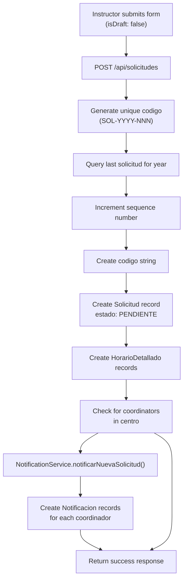
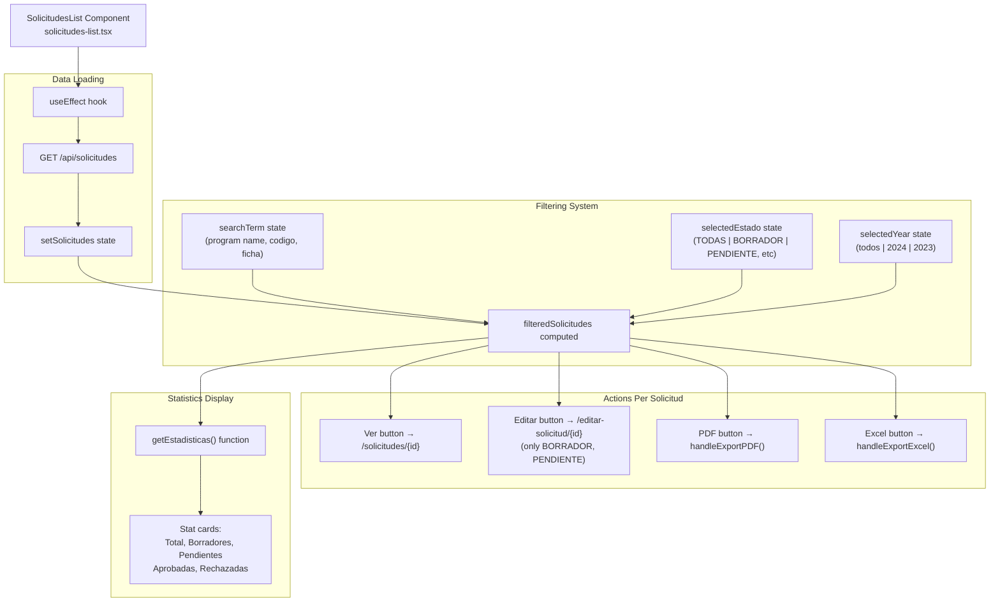
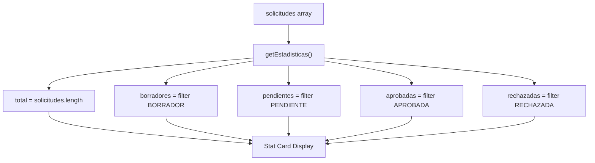
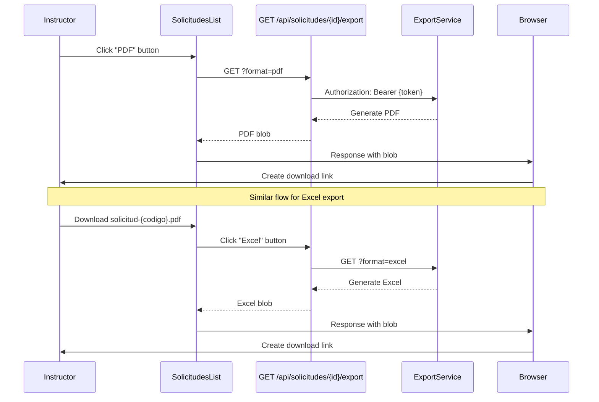
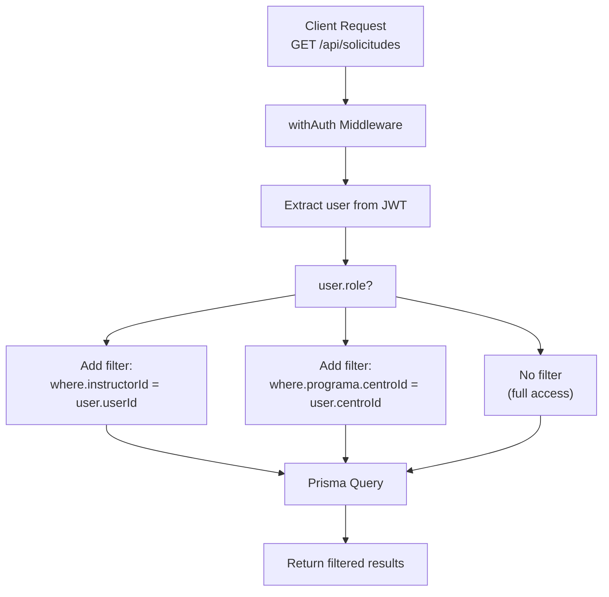

# Instructor Workflow

> **Relevant source files**
> * [app/api/solicitudes/route.ts](https://github.com/axchisan/gestionComplementarias/blob/a3d2dcb4/app/api/solicitudes/route.ts)
> * [app/page.tsx](https://github.com/axchisan/gestionComplementarias/blob/a3d2dcb4/app/page.tsx)
> * [components/solicitudes-list.tsx](https://github.com/axchisan/gestionComplementarias/blob/a3d2dcb4/components/solicitudes-list.tsx)

## Purpose and Scope

This document describes the complete workflow for users with the `INSTRUCTOR` role within the SENA Gestión Complementarias system. It covers the process of creating, submitting, managing, and tracking training solicitudes (requests) for complementary educational programs.

For information about the solicitud approval process and coordinator actions, see [Coordinator Workflow](/axchisan/gestionComplementarias/4.4-coordinator-workflow). For the complete solicitud lifecycle and state transitions, see [Solicitud Lifecycle](/axchisan/gestionComplementarias/4.2-solicitud-lifecycle). For details on the authentication process that precedes these workflows, see [Authentication and Authorization](/axchisan/gestionComplementarias/3.4-authentication-and-authorization).

**Sources**: [app/api/solicitudes/route.ts L1-L242](https://github.com/axchisan/gestionComplementarias/blob/a3d2dcb4/app/api/solicitudes/route.ts#L1-L242)

 [components/solicitudes-list.tsx L1-L420](https://github.com/axchisan/gestionComplementarias/blob/a3d2dcb4/components/solicitudes-list.tsx#L1-L420)

 [app/page.tsx L1-L75](https://github.com/axchisan/gestionComplementarias/blob/a3d2dcb4/app/page.tsx#L1-L75)

---

## Instructor Role Overview

Instructors are entry-level users who create and manage training requests. The system enforces strict data scoping: instructors can only view and manage solicitudes they have created themselves.

### Access Restrictions

| Operation | Permission | Implementation |
| --- | --- | --- |
| Create Solicitud | ✓ Allowed | Only `INSTRUCTOR` role can POST to `/api/solicitudes` |
| View Solicitudes | ✓ Own Only | API filters by `instructorId = user.userId` |
| Edit Solicitud | ✓ Limited | Only `BORRADOR` and `PENDIENTE` states |
| Approve/Reject | ✗ Denied | Requires `COORDINADOR` role |
| Delete Solicitud | ✗ Denied | Not implemented for instructors |
| Export Documents | ✓ Allowed | PDF and Excel export for all owned solicitudes |

**Sources**: [app/api/solicitudes/route.ts L16-L22](https://github.com/axchisan/gestionComplementarias/blob/a3d2dcb4/app/api/solicitudes/route.ts#L16-L22)

 [app/api/solicitudes/route.ts L75-L77](https://github.com/axchisan/gestionComplementarias/blob/a3d2dcb4/app/api/solicitudes/route.ts#L75-L77)

 [components/solicitudes-list.tsx L358-L367](https://github.com/axchisan/gestionComplementarias/blob/a3d2dcb4/components/solicitudes-list.tsx#L358-L367)

---

## Complete Instructor Workflow

### Workflow Diagram: From Login to Approval

```mermaid
sequenceDiagram
  participant Browser
  participant Navigation
  participant /api/auth/login
  participant InstructorDashboard
  participant /nueva-solicitud
  participant POST /api/solicitudes
  participant Prisma
  participant NotificationService
  participant Coordinadores
  participant SolicitudesList
  participant GET /api/solicitudes

  note over Browser,Coordinadores: Phase 1: Authentication
  Browser->>Browser: Navigate to /login
  Browser->>/api/auth/login: POST credentials
  /api/auth/login->>Prisma: Verify user
  /api/auth/login-->>Browser: JWT token + user data
  Browser->>Navigation: Store auth context
  note over Browser,Coordinadores: Phase 2: Dashboard Access
  Browser->>InstructorDashboard: Render dashboard
  InstructorDashboard->>Browser: Display quick actions
  note over Browser,Coordinadores: Phase 3: Create Solicitud
  Browser->>/nueva-solicitud: Click "Nueva Solicitud"
  /nueva-solicitud->>Browser: Render solicitud form
  Browser->>/nueva-solicitud: Fill form data
  loop [Save as Draft]
    Browser->>/nueva-solicitud: Click "Guardar Borrador"
    /nueva-solicitud->>POST /api/solicitudes: POST {isDraft: true}
    POST /api/solicitudes->>Prisma: Create solicitud with estado=BORRADOR
    POST /api/solicitudes-->>/nueva-solicitud: Success response
    /nueva-solicitud->>Browser: Show success message
    Browser->>/nueva-solicitud: Click "Enviar Solicitud"
    /nueva-solicitud->>POST /api/solicitudes: POST {isDraft: false}
    POST /api/solicitudes->>Prisma: Generate codigo (SOL-YYYY-NNN)
    POST /api/solicitudes->>Prisma: Create solicitud with estado=PENDIENTE
    POST /api/solicitudes->>NotificationService: notificarNuevaSolicitud()
    NotificationService->>Coordinadores: Send notifications
    POST /api/solicitudes-->>/nueva-solicitud: Success with solicitud.id
    /nueva-solicitud->>Browser: Redirect to solicitud detail
  end
  note over Browser,Coordinadores: Phase 4: View and Manage
  Browser->>SolicitudesList: Navigate to /solicitudes
  SolicitudesList->>GET /api/solicitudes: GET with Bearer token
  GET /api/solicitudes->>Prisma: findMany where instructorId=user.userId
  GET /api/solicitudes-->>SolicitudesList: Return filtered solicitudes
  SolicitudesList->>Browser: Display list with filters
```

**Sources**: [app/api/solicitudes/route.ts L73-L242](https://github.com/axchisan/gestionComplementarias/blob/a3d2dcb4/app/api/solicitudes/route.ts#L73-L242)

 [components/solicitudes-list.tsx L60-L87](https://github.com/axchisan/gestionComplementarias/blob/a3d2dcb4/components/solicitudes-list.tsx#L60-L87)

 [app/page.tsx L68](https://github.com/axchisan/gestionComplementarias/blob/a3d2dcb4/app/page.tsx#L68-L68)

---

## Step-by-Step Workflow

### Step 1: Access the System

After successful authentication, instructors are automatically routed to their role-specific dashboard. The `InstructorDashboard` component is rendered when `user.role === "INSTRUCTOR"`.

**Entry Point**: [app/page.tsx L68](https://github.com/axchisan/gestionComplementarias/blob/a3d2dcb4/app/page.tsx#L68-L68)

**Dashboard Route**: `/` (root page with authenticated user)

**Sources**: [app/page.tsx L38-L69](https://github.com/axchisan/gestionComplementarias/blob/a3d2dcb4/app/page.tsx#L38-L69)

### Step 2: Create a New Solicitud

#### Navigation

Instructors navigate to the solicitud creation page via:

* Dashboard quick action button
* Navigation menu "Nueva Solicitud" link
* Direct URL: `/nueva-solicitud`

#### Form Structure

The solicitud creation form collects comprehensive information organized into sections:

| Section | Fields | Purpose |
| --- | --- | --- |
| **General Information** | `fechaCaracterizacion`, `responsableNombre`, `responsableCedula`, `responsableEmail` | Identifies the responsible party |
| **Program Details** | `programaId`, `codigoPrograma`, `versionPrograma`, `duracionMaxima`, `cupoMaximo`, `numeroAprendicesInscribir`, `modalidad` | Defines the training program |
| **Company/Location** | `municipio`, `departamento`, `nombreEmpresa`, `nitEmpresa`, `direccionEmpresa` | Specifies training location and partner organization |
| **Training Environment** | `lugarFormacion`, `tipoAmbiente` | Defines physical training space |
| **Special Program Flags** | `programaEmprendimiento`, `programaBilinguismo`, `atencionInstituciones`, `posconflicto`, etc. | Boolean flags for special program types |
| **Schedule** | `inicioInscripcion`, `finalizacionInscripcion`, `fechaInicioCurso`, `fechaFinalizacionCurso` | Timeline information |
| **Academic Justification** | `justificacion`, `objetivosPersonalizados`, `resultadosEsperados`, `observaciones` | Educational rationale |
| **Schedule Details** | `horarios[]` array | Detailed weekly schedule with `diaSemana`, `horaInicio`, `horaFin` |
| **Validations** | `cumpleRequisitos`, `autorizaUsoInfo`, `confirmaVeracidad` | Legal confirmations |

**Sources**: [app/api/solicitudes/route.ts L122-L201](https://github.com/axchisan/gestionComplementarias/blob/a3d2dcb4/app/api/solicitudes/route.ts#L122-L201)

#### Validation Rules

The API validates:

1. **Program Availability**: The program must exist, be active, and belong to the instructor's center
2. **Instructor Authority**: Only users with `role === "INSTRUCTOR"` can create solicitudes
3. **Required Fields**: All mandatory fields must be provided in the request body

**Sources**: [app/api/solicitudes/route.ts L75-L102](https://github.com/axchisan/gestionComplementarias/blob/a3d2dcb4/app/api/solicitudes/route.ts#L75-L102)

### Step 3: Save as Draft or Submit

#### Draft Mode (BORRADOR)

When saving as draft, the solicitud is created with `estado: "BORRADOR"`:

* **Behavior**: No notifications are sent to coordinators
* **Editability**: Can be edited at any time
* **Visibility**: Only visible to the instructor who created it

**Implementation**: [app/api/solicitudes/route.ts L188](https://github.com/axchisan/gestionComplementarias/blob/a3d2dcb4/app/api/solicitudes/route.ts#L188-L188)

#### Submit Mode (PENDIENTE)

When submitting for review, several automated processes occur:



**Sources**: [app/api/solicitudes/route.ts L104-L229](https://github.com/axchisan/gestionComplementarias/blob/a3d2dcb4/app/api/solicitudes/route.ts#L104-L229)

#### Unique Code Generation

The system generates unique solicitud codes following the pattern `SOL-YYYY-NNN`:

1. Extract current year
2. Query most recent solicitud with prefix `SOL-{year}-`
3. Parse sequence number from last code
4. Increment and pad to 3 digits
5. Format as `SOL-{year}-{sequence}`

**Example Codes**: `SOL-2024-001`, `SOL-2024-002`, `SOL-2024-157`

**Implementation**: [app/api/solicitudes/route.ts L104-L119](https://github.com/axchisan/gestionComplementarias/blob/a3d2dcb4/app/api/solicitudes/route.ts#L104-L119)

#### Notification Flow

When a solicitud is submitted (not a draft), the system:

1. Queries all active coordinators for the instructor's center
2. Creates notification records for each coordinator
3. Uses `NotificationService.notificarNuevaSolicitud()` method
4. Handles notification failures gracefully (does not fail solicitud creation)

**Sources**: [app/api/solicitudes/route.ts L213-L229](https://github.com/axchisan/gestionComplementarias/blob/a3d2dcb4/app/api/solicitudes/route.ts#L213-L229)

### Step 4: View and Manage Solicitudes

#### Solicitudes List Component

The `SolicitudesList` component provides a comprehensive interface for managing solicitudes.

**Component Structure Diagram**



**Sources**: [components/solicitudes-list.tsx L51-L419](https://github.com/axchisan/gestionComplementarias/blob/a3d2dcb4/components/solicitudes-list.tsx#L51-L419)

#### API Request Flow

The component fetches solicitudes using the authenticated API endpoint:

**Request**:

```yaml
GET /api/solicitudes
Headers:
  Authorization: Bearer {token}
```

**Server-Side Filtering**: [app/api/solicitudes/route.ts L16-L22](https://github.com/axchisan/gestionComplementarias/blob/a3d2dcb4/app/api/solicitudes/route.ts#L16-L22)

```
if (user.role === "INSTRUCTOR") {
  where.instructorId = user.userId
}
```

**Response Structure**:

```json
{
  "solicitudes": [
    {
      "id": "string",
      "codigo": "SOL-2024-001",
      "numeroFicha": "string?",
      "estado": "PENDIENTE",
      "instructor": {
        "name": "string",
        "email": "string"
      },
      "programa": {
        "nombre": "string",
        "codigo": "string",
        "duracionHoras": 40,
        "modalidad": "PRESENCIAL"
      },
      "horarios": []
    }
  ],
  "pagination": {
    "page": 1,
    "limit": 10,
    "total": 50,
    "pages": 5
  }
}
```

**Sources**: [app/api/solicitudes/route.ts L6-L71](https://github.com/axchisan/gestionComplementarias/blob/a3d2dcb4/app/api/solicitudes/route.ts#L6-L71)

 [components/solicitudes-list.tsx L60-L87](https://github.com/axchisan/gestionComplementarias/blob/a3d2dcb4/components/solicitudes-list.tsx#L60-L87)

#### Client-Side Filtering

After loading, the component applies three filter dimensions:

1. **Search Filter**: Matches against `programa.nombre`, `codigo`, or `numeroFicha`
2. **Estado Filter**: Filters by solicitud state
3. **Year Filter**: Filters by `fechaSolicitud` year

**Implementation**: [components/solicitudes-list.tsx L89-L102](https://github.com/axchisan/gestionComplementarias/blob/a3d2dcb4/components/solicitudes-list.tsx#L89-L102)

#### Statistics Dashboard

The component calculates real-time statistics:



**Sources**: [components/solicitudes-list.tsx L180-L190](https://github.com/axchisan/gestionComplementarias/blob/a3d2dcb4/components/solicitudes-list.tsx#L180-L190)

 [components/solicitudes-list.tsx L223-L238](https://github.com/axchisan/gestionComplementarias/blob/a3d2dcb4/components/solicitudes-list.tsx#L223-L238)

### Step 5: Edit a Solicitud

Instructors can edit solicitudes that are in specific states:

**Edit Permission Logic**:

```javascript
{(solicitud.estado === "PENDIENTE" || solicitud.estado === "BORRADOR") && (
  <Button onClick={() => window.location.href = `/editar-solicitud/${solicitud.id}`}>
    Editar
  </Button>
)}
```

**Restricted States**: Solicitudes in `EN_REVISION`, `APROBADA`, or `RECHAZADA` state cannot be edited by instructors.

**Sources**: [components/solicitudes-list.tsx L358-L367](https://github.com/axchisan/gestionComplementarias/blob/a3d2dcb4/components/solicitudes-list.tsx#L358-L367)

### Step 6: Export Documents

Instructors can export solicitudes to PDF or Excel formats regardless of solicitud state.

#### Export Flow Diagram



**Sources**: [components/solicitudes-list.tsx L104-L146](https://github.com/axchisan/gestionComplementarias/blob/a3d2dcb4/components/solicitudes-list.tsx#L104-L146)

#### Export Implementation

**PDF Export**: [components/solicitudes-list.tsx L104-L124](https://github.com/axchisan/gestionComplementarias/blob/a3d2dcb4/components/solicitudes-list.tsx#L104-L124)

* Endpoint: `GET /api/solicitudes/{id}/export?format=pdf`
* Filename pattern: `solicitud-{codigo}.pdf`
* Uses `jspdf` library server-side

**Excel Export**: [components/solicitudes-list.tsx L126-L146](https://github.com/axchisan/gestionComplementarias/blob/a3d2dcb4/components/solicitudes-list.tsx#L126-L146)

* Endpoint: `GET /api/solicitudes/{id}/export?format=excel`
* Filename pattern: `solicitud-{codigo}.xlsx`
* Uses `xlsx` library server-side

### Step 7: Monitor Solicitud Status

#### Status Badge Display

The component renders color-coded badges for each solicitud state:

| Estado | Badge Color | Icon | Description |
| --- | --- | --- | --- |
| `BORRADOR` | Gray | None | Draft, not yet submitted |
| `PENDIENTE` | Yellow | Clock | Awaiting coordinator review |
| `EN_REVISION` | Blue | None | Under active review |
| `APROBADA` | Green | CheckCircle | Approved by coordinator |
| `RECHAZADA` | Red | XCircle | Rejected with comments |

**Implementation**: [components/solicitudes-list.tsx L148-L178](https://github.com/axchisan/gestionComplementarias/blob/a3d2dcb4/components/solicitudes-list.tsx#L148-L178)

#### Estado Constants

The component defines display mappings:

```javascript
const estadoColors = {
  BORRADOR: "bg-gray-100 text-gray-800",
  PENDIENTE: "bg-yellow-100 text-yellow-800",
  EN_REVISION: "bg-blue-100 text-blue-800",
  APROBADA: "bg-green-100 text-green-800",
  RECHAZADA: "bg-red-100 text-red-800",
}

const estadoLabels = {
  BORRADOR: "Borrador",
  PENDIENTE: "Pendiente",
  EN_REVISION: "En Revisión",
  APROBADA: "Aprobada",
  RECHAZADA: "Rechazada",
}
```

**Sources**: [components/solicitudes-list.tsx L35-L49](https://github.com/axchisan/gestionComplementarias/blob/a3d2dcb4/components/solicitudes-list.tsx#L35-L49)

#### Notification System

Instructors receive notifications when their solicitudes change state. While the notification display UI is not shown in the provided files, notifications are created by coordinators during approval/rejection actions.

**Notification Types Received by Instructors**:

* `APROBADA`: When solicitud is approved
* `RECHAZADA`: When solicitud is rejected
* `EN_REVISION`: When solicitud enters review

---

## Data Scoping and Security

### Instructor Data Access Pattern



**Sources**: [app/api/solicitudes/route.ts L15-L22](https://github.com/axchisan/gestionComplementarias/blob/a3d2dcb4/app/api/solicitudes/route.ts#L15-L22)

### Security Enforcement Points

1. **Authentication**: `withAuth` middleware validates JWT on all protected routes
2. **Authorization**: Role check prevents non-instructors from creating solicitudes
3. **Data Filtering**: Automatic query filtering by `instructorId`
4. **Program Validation**: Ensures instructor can only create solicitudes for programs in their center

**Key Security Check**: [app/api/solicitudes/route.ts L82-L102](https://github.com/axchisan/gestionComplementarias/blob/a3d2dcb4/app/api/solicitudes/route.ts#L82-L102)

```javascript
const programa = await prisma.programa.findFirst({
  where: {
    id: data.programaId,
    centroId: user.centroId,
    isActive: true,
  }
})

if (!programa) {
  return NextResponse.json(
    { error: "Programa no válido o no disponible" }, 
    { status: 400 }
  )
}
```

---

## UI Component Reference

### SolicitudesList Component

**File**: [components/solicitudes-list.tsx L1-L420](https://github.com/axchisan/gestionComplementarias/blob/a3d2dcb4/components/solicitudes-list.tsx#L1-L420)

**Key State Variables**:

* `solicitudes`: Array of solicitud objects
* `loading`: Boolean loading state
* `error`: Error message string
* `searchTerm`: Search filter value
* `selectedEstado`: Estado filter value
* `selectedYear`: Year filter value

**Key Functions**:

* `fetchSolicitudes()`: Loads solicitudes from API
* `filteredSolicitudes`: Computed filtered array
* `getEstadisticas()`: Calculates statistics
* `handleExportPDF()`: Exports solicitud to PDF
* `handleExportExcel()`: Exports solicitud to Excel
* `getStatusBadge()`: Renders status badge component

**Dependencies**:

* `useAuth()`: Access authentication context
* `@/components/ui/*`: Radix UI components
* `date-fns`: Date formatting

### Empty State Handling

When no solicitudes exist or filters return no results, the component displays an appropriate empty state with actionable guidance.

**Implementation**: [components/solicitudes-list.tsx L394-L414](https://github.com/axchisan/gestionComplementarias/blob/a3d2dcb4/components/solicitudes-list.tsx#L394-L414)

---

## Complete Estado Transition Matrix (Instructor Perspective)

| Current Estado | Can Edit | Can Delete | Can Export | Next Estado | Trigger |
| --- | --- | --- | --- | --- | --- |
| `BORRADOR` | ✓ Yes | ✗ No | ✓ Yes | `PENDIENTE` | Instructor submits |
| `PENDIENTE` | ✓ Yes | ✗ No | ✓ Yes | `EN_REVISION` | Coordinator starts review |
| `PENDIENTE` | ✓ Yes | ✗ No | ✓ Yes | `BORRADOR` | Coordinator requests changes |
| `EN_REVISION` | ✗ No | ✗ No | ✓ Yes | `APROBADA` | Coordinator approves |
| `EN_REVISION` | ✗ No | ✗ No | ✓ Yes | `RECHAZADA` | Coordinador rechaza |
| `APROBADA` | ✗ No | ✗ No | ✓ Sí | - | Estado terminal |
| `RECHAZADA` | ✗ No | ✗ No | ✓ Sí | `BORRADOR` | El instructor revisa (manual) |

**Fuentes** :[solicitudes-list.tsx L358-L367](https://github.com/axchisan/gestionComplementarias/blob/a3d2dcb4/components/solicitudes-list.tsx#L358-L367)

 [Diagrama 3 de Arquitectura de alto nivel](https://github.com/axchisan/gestionComplementarias/blob/a3d2dcb4/Diagram 3 from High-Level Architecture)

---

## Resumen de referencia de API

### Puntos finales accesibles para el instructor

| Método | Punto final | Objetivo | Se requiere autorización |
| --- | --- | --- | --- |
| `GET` | `/api/solicitudes` | Lista de solicitudes del instructor | ✓ Token al portador |
| `POST` | `/api/solicitudes` | Crear nueva solicitud | ✓ Token portador, rol=INSTRUCTOR |
| `GET` | `/api/solicitudes/{id}` | Ver detalles de la solicitud | ✓ Token al portador |
| `PUT` | `/api/solicitudes/{id}` | Solicitud de actualización | ✓ Token al portador, validación de estado |
| `GET` | `/api/solicitudes/{id}/export?format=pdf` | Exportar a PDF | ✓ Token al portador |
| `GET` | `/api/solicitudes/{id}/export?format=excel` | Exportar a Excel | ✓ Token al portador |

**Fuentes** :[route.ts L6-L242](https://github.com/axchisan/gestionComplementarias/blob/a3d2dcb4/app/api/solicitudes/route.ts#L6-L242)

---

## Patrones de flujo de trabajo comunes

### Patrón 1: Borrador → Enviar → Esperar aprobación

```
1. Instructor creates solicitud with isDraft=true (estado: BORRADOR)
2. Instructor completes form over multiple sessions
3. Instructor sets isDraft=false and submits
4. System generates codigo, sets estado=PENDIENTE
5. System notifies coordinators
6. Instructor monitors status via dashboard
```

### Patrón 2: Rechazado → Revisar → Volver a enviar

```
1. Coordinator rejects solicitud (estado: RECHAZADA)
2. Instructor receives notification with comentariosRevision
3. Instructor reviews rejection comments
4. Instructor creates new solicitud with corrections
5. New solicitud enters PENDIENTE state
```

Nota: El sistema no permite la edición directa de solicitudes rechazadas. Los profesores deben crear nuevas solicitudes incorporando los comentarios del coordinador.

### Patrón 3: Creación masiva con borradores

```
1. Instructor creates multiple solicitudes as drafts
2. All solicitudes saved with estado=BORRADOR
3. Instructor reviews and finalizes each draft
4. Instructor submits drafts individually
5. Each submission triggers separate notification flow
```

**Fuentes** :[route.ts L188](https://github.com/axchisan/gestionComplementarias/blob/a3d2dcb4/app/api/solicitudes/route.ts#L188-L188)

 [route.ts L213-L229](https://github.com/axchisan/gestionComplementarias/blob/a3d2dcb4/app/api/solicitudes/route.ts#L213-L229)