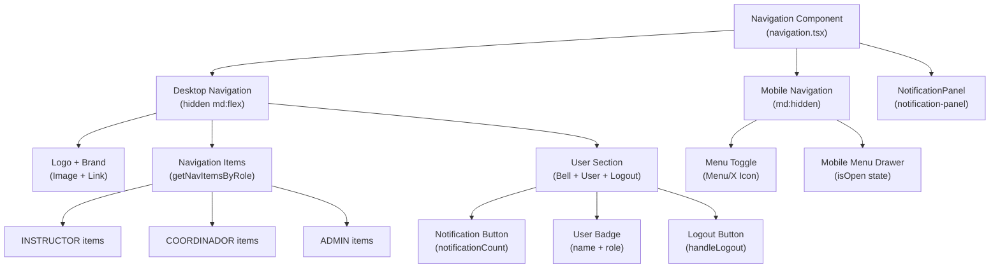
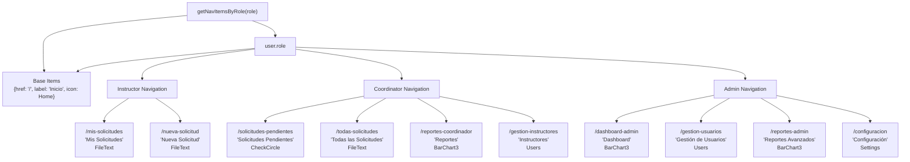
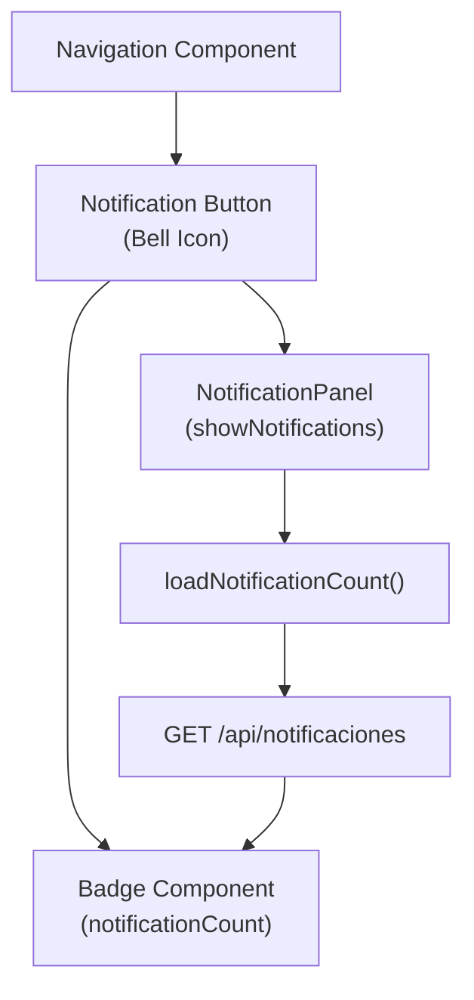
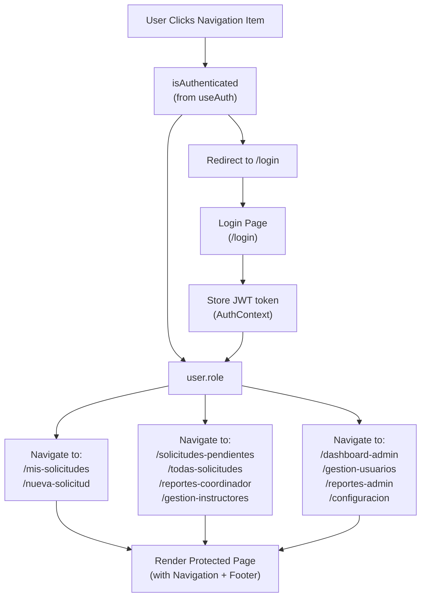

# Layout and Navigation

> **Relevant source files**
> * [components/footer.tsx](https://github.com/axchisan/gestionComplementarias/blob/a3d2dcb4/components/footer.tsx)
> * [components/hero.tsx](https://github.com/axchisan/gestionComplementarias/blob/a3d2dcb4/components/hero.tsx)
> * [components/navigation.tsx](https://github.com/axchisan/gestionComplementarias/blob/a3d2dcb4/components/navigation.tsx)

## Purpose and Scope

This document describes the layout structure and navigation system of the SENA Gestión Complementarias application. It covers the `Navigation` component, which provides role-based menu items and handles authentication state, the `Footer` component for application-wide information, and the overall page layout architecture.

For details on the authentication flow that determines what navigation items are displayed, see [Authentication and Authorization](/axchisan/gestionComplementarias/3.4-authentication-and-authorization). For information about the specific dashboard components shown after navigation, see [Dashboard Components](/axchisan/gestionComplementarias/5.3-dashboard-components).

**Sources:** [components/navigation.tsx L1-L251](https://github.com/axchisan/gestionComplementarias/blob/a3d2dcb4/components/navigation.tsx#L1-L251)

 [components/footer.tsx L1-L195](https://github.com/axchisan/gestionComplementarias/blob/a3d2dcb4/components/footer.tsx#L1-L195)

---

## Layout Architecture Overview

The application uses a consistent layout pattern across all pages, with three main structural components:

1. **Navigation Bar** (`Navigation` component) - Sticky header with role-based menu items
2. **Page Content** - Dynamic content area that changes based on the route
3. **Footer** (`Footer` component) - Static footer with links and contact information

The navigation bar remains fixed at the top of the viewport (`sticky top-0 z-50`) across all routes, providing consistent access to navigation items regardless of scroll position.

**Sources:** [components/navigation.tsx L101](https://github.com/axchisan/gestionComplementarias/blob/a3d2dcb4/components/navigation.tsx#L101-L101)

---

## Navigation Component Structure

### Component Hierarchy



**Sources:** [components/navigation.tsx L12-L250](https://github.com/axchisan/gestionComplementarias/blob/a3d2dcb4/components/navigation.tsx#L12-L250)

 [components/navigation.tsx L49-L82](https://github.com/axchisan/gestionComplementarias/blob/a3d2dcb4/components/navigation.tsx#L49-L82)

 [components/navigation.tsx L114-L168](https://github.com/axchisan/gestionComplementarias/blob/a3d2dcb4/components/navigation.tsx#L114-L168)

### State Management

The `Navigation` component manages four key state variables:

| State Variable | Type | Purpose | Default |
| --- | --- | --- | --- |
| `isOpen` | `boolean` | Controls mobile menu visibility | `false` |
| `showNotifications` | `boolean` | Controls notification panel visibility | `false` |
| `notificationCount` | `number` | Displays unread notification count | `0` |
| Authentication state | via `useAuth()` | Provides `user`, `isAuthenticated`, `logout`, `token` | N/A |

**Sources:** [components/navigation.tsx L13-L16](https://github.com/axchisan/gestionComplementarias/blob/a3d2dcb4/components/navigation.tsx#L13-L16)

### Notification Count Polling

The component implements a polling mechanism to keep notification counts updated:

```mermaid
sequenceDiagram
  participant Navigation Component
  participant useEffect Hook
  participant /api/notificaciones
  participant notificationCount State

  Navigation Component->>useEffect Hook: "Mount (isAuthenticated=true)"
  useEffect Hook->>/api/notificaciones: "GET /api/notificaciones?limit=1"
  /api/notificaciones-->>useEffect Hook: "{ noLeidas: 5 }"
  useEffect Hook->>notificationCount State: "setNotificationCount(5)"
  useEffect Hook->>useEffect Hook: "setInterval(loadNotificationCount, 30000)"
  note over useEffect Hook: "Every 30 seconds"
  useEffect Hook->>/api/notificaciones: "GET /api/notificaciones?limit=1"
  /api/notificaciones-->>useEffect Hook: "{ noLeidas: 3 }"
  useEffect Hook->>notificationCount State: "setNotificationCount(3)"
  Navigation Component->>Navigation Component: "Unmount"
  Navigation Component->>useEffect Hook: "clearInterval()"
```

The polling interval is set to 30 seconds and is established in the `useEffect` hook at [components/navigation.tsx L18-L25](https://github.com/axchisan/gestionComplementarias/blob/a3d2dcb4/components/navigation.tsx#L18-L25)

 The actual fetch operation is defined in `loadNotificationCount` at [components/navigation.tsx L27-L42](https://github.com/axchisan/gestionComplementarias/blob/a3d2dcb4/components/navigation.tsx#L27-L42)

**Sources:** [components/navigation.tsx L18-L42](https://github.com/axchisan/gestionComplementarias/blob/a3d2dcb4/components/navigation.tsx#L18-L42)

---

## Role-Based Navigation Items

### Navigation Item Resolution

The `getNavItemsByRole` function at [components/navigation.tsx L49-L82](https://github.com/axchisan/gestionComplementarias/blob/a3d2dcb4/components/navigation.tsx#L49-L82)

 determines which menu items to display based on the user's role. Each role receives a different set of navigation items:



**Role-Specific Navigation Items:**

| Role | Routes | Icons |
| --- | --- | --- |
| **INSTRUCTOR** | `/mis-solicitudes`, `/nueva-solicitud` | `FileText`, `FileText` |
| **COORDINADOR** | `/solicitudes-pendientes`, `/todas-solicitudes`, `/reportes-coordinador`, `/gestion-instructores` | `CheckCircle`, `FileText`, `BarChart3`, `Users` |
| **ADMIN** | `/dashboard-admin`, `/gestion-usuarios`, `/reportes-admin`, `/configuracion` | `BarChart3`, `Users`, `BarChart3`, `Settings` |

All roles receive the base "Inicio" (`/`) navigation item.

**Sources:** [components/navigation.tsx L49-L82](https://github.com/axchisan/gestionComplementarias/blob/a3d2dcb4/components/navigation.tsx#L49-L82)

### Navigation Item Rendering

Desktop navigation items are rendered at [components/navigation.tsx L114-L128](https://github.com/axchisan/gestionComplementarias/blob/a3d2dcb4/components/navigation.tsx#L114-L128)

 using the following pattern:

```javascript
{isAuthenticated &&
  navItems.map((item) => {
    const Icon = item.icon
    return (
      <Link
        key={item.href}
        href={item.href}
        className="flex items-center space-x-2 text-gray-700 hover:text-green-600 transition-colors duration-200 font-medium px-3 py-2 rounded-md hover:bg-green-50"
      >
        <Icon className="h-4 w-4" />
        <span>{item.label}</span>
      </Link>
    )
  })}
```

Mobile navigation items follow the same pattern at [components/navigation.tsx L197-L211](https://github.com/axchisan/gestionComplementarias/blob/a3d2dcb4/components/navigation.tsx#L197-L211)

 with additional `onClick={() => setIsOpen(false)}` to close the mobile menu after navigation.

**Sources:** [components/navigation.tsx L114-L128](https://github.com/axchisan/gestionComplementarias/blob/a3d2dcb4/components/navigation.tsx#L114-L128)

 [components/navigation.tsx L197-L211](https://github.com/axchisan/gestionComplementarias/blob/a3d2dcb4/components/navigation.tsx#L197-L211)

---

## Desktop Navigation Layout

The desktop navigation bar (visible on screens >= `md` breakpoint) consists of three sections:

### Logo Section

Located at [components/navigation.tsx L105-L111](https://github.com/axchisan/gestionComplementarias/blob/a3d2dcb4/components/navigation.tsx#L105-L111)

 the logo section includes:

* SENA logo image (`/sena-logo.png`, 60x60px)
* Text heading "SENA"
* Subheading "Centro de Gestión Agroempresarial"

### Center Navigation Items

Rendered at [components/navigation.tsx L114-L128](https://github.com/axchisan/gestionComplementarias/blob/a3d2dcb4/components/navigation.tsx#L114-L128)

 these items are dynamically generated based on the user's role using `getNavItemsByRole()`.

### User Section

The user section at [components/navigation.tsx L130-L162](https://github.com/axchisan/gestionComplementarias/blob/a3d2dcb4/components/navigation.tsx#L130-L162)

 displays different content based on authentication state:

**When Authenticated:**

1. **Notification Button** - Bell icon with badge showing `notificationCount` ([components/navigation.tsx L132-L144](https://github.com/axchisan/gestionComplementarias/blob/a3d2dcb4/components/navigation.tsx#L132-L144) )
2. **User Badge** - Displays `user.name` and role label via `getRoleLabel()` ([components/navigation.tsx L146-L152](https://github.com/axchisan/gestionComplementarias/blob/a3d2dcb4/components/navigation.tsx#L146-L152) )
3. **Logout Button** - Triggers `handleLogout()` which calls `logout()` from `useAuth()` ([components/navigation.tsx L153-L161](https://github.com/axchisan/gestionComplementarias/blob/a3d2dcb4/components/navigation.tsx#L153-L161) )

**When Not Authenticated:**

* "Iniciar Sesión" button linking to `/login` ([components/navigation.tsx L164-L166](https://github.com/axchisan/gestionComplementarias/blob/a3d2dcb4/components/navigation.tsx#L164-L166) )

**Sources:** [components/navigation.tsx L105-L168](https://github.com/axchisan/gestionComplementarias/blob/a3d2dcb4/components/navigation.tsx#L105-L168)

---

## Mobile Navigation Layout

The mobile navigation is displayed only on screens < `md` breakpoint and uses a hamburger menu pattern:

### Mobile Menu Toggle

Located at [components/navigation.tsx L171-L190](https://github.com/axchisan/gestionComplementarias/blob/a3d2dcb4/components/navigation.tsx#L171-L190)

 the toggle button displays:

* Bell icon with notification badge (when authenticated)
* Menu/X icon based on `isOpen` state

### Mobile Menu Drawer

When `isOpen === true`, a dropdown menu appears at [components/navigation.tsx L194-L237](https://github.com/axchisan/gestionComplementarias/blob/a3d2dcb4/components/navigation.tsx#L194-L237)

 with:

1. **Navigation Items** - Same role-based items as desktop, with `onClick` to close menu
2. **User Information Section** - Bordered separator with: * User name and role label (when authenticated) * Logout button (when authenticated) * Login button (when not authenticated)

The mobile menu uses a slide-down animation and is rendered as a child of the main navigation container.

**Sources:** [components/navigation.tsx L171-L237](https://github.com/axchisan/gestionComplementarias/blob/a3d2dcb4/components/navigation.tsx#L171-L237)

---

## Role Label Mapping

The `getRoleLabel` function at [components/navigation.tsx L86-L97](https://github.com/axchisan/gestionComplementarias/blob/a3d2dcb4/components/navigation.tsx#L86-L97)

 converts role enum values to display-friendly Spanish labels:

| Role Enum | Display Label |
| --- | --- |
| `INSTRUCTOR` | "Instructor" |
| `COORDINADOR` | "Coordinador" |
| `ADMIN` | "Administrador" |
| Default | "Usuario" |

This function is used in both desktop ([components/navigation.tsx L150](https://github.com/axchisan/gestionComplementarias/blob/a3d2dcb4/components/navigation.tsx#L150-L150)

) and mobile ([components/navigation.tsx L217](https://github.com/axchisan/gestionComplementarias/blob/a3d2dcb4/components/navigation.tsx#L217-L217)

) navigation to display the user's role.

**Sources:** [components/navigation.tsx L86-L97](https://github.com/axchisan/gestionComplementarias/blob/a3d2dcb4/components/navigation.tsx#L86-L97)

---

## Notification Integration

The navigation component integrates with the notification system through the `NotificationPanel` component:



The notification workflow:

1. Component polls `/api/notificaciones?limit=1` every 30 seconds ([components/navigation.tsx L22](https://github.com/axchisan/gestionComplementarias/blob/a3d2dcb4/components/navigation.tsx#L22-L22) )
2. Updates `notificationCount` state with `data.noLeidas` ([components/navigation.tsx L37](https://github.com/axchisan/gestionComplementarias/blob/a3d2dcb4/components/navigation.tsx#L37-L37) )
3. Displays badge on Bell icon when `notificationCount > 0` ([components/navigation.tsx L139-L142](https://github.com/axchisan/gestionComplementarias/blob/a3d2dcb4/components/navigation.tsx#L139-L142) )
4. Opens `NotificationPanel` when bell is clicked ([components/navigation.tsx L136](https://github.com/axchisan/gestionComplementarias/blob/a3d2dcb4/components/navigation.tsx#L136-L136) )
5. Refreshes count when panel closes ([components/navigation.tsx L245](https://github.com/axchisan/gestionComplementarias/blob/a3d2dcb4/components/navigation.tsx#L245-L245) )

**Sources:** [components/navigation.tsx L18-L42](https://github.com/axchisan/gestionComplementarias/blob/a3d2dcb4/components/navigation.tsx#L18-L42)

 [components/navigation.tsx L241-L247](https://github.com/axchisan/gestionComplementarias/blob/a3d2dcb4/components/navigation.tsx#L241-L247)

---

## Footer Component

The `Footer` component at [components/footer.tsx L5-L194](https://github.com/axchisan/gestionComplementarias/blob/a3d2dcb4/components/footer.tsx#L5-L194)

 provides a comprehensive application footer with five column layout on large screens:

### Footer Structure

```mermaid
flowchart TD

Footer["Footer Component"]
Brand["Brand Column<br>(logo + description + social)"]
Sistema["Sistema Column<br>(internal links)"]
Recursos["Recursos Column<br>(help links)"]
Contacto["Contacto Column<br>(contact info)"]
Stats["Statistics Section<br>(processing stats)"]
Bottom["Bottom Bar<br>(copyright + legal)"]
Logo["SENA Logo<br>(48x48)"]
Description["System description"]
Social["Social Icons<br>(Facebook, Twitter, Instagram, Youtube)"]
SistemaLinks["Nueva Solicitud<br>Mis Solicitudes<br>Reportes<br>Mi Perfil<br>Ayuda<br>Tutoriales"]
RecursosLinks["Manual de Usuario<br>Preguntas Frecuentes<br>Políticas del Sistema<br>Términos de Uso<br>Guías de Formación<br>Contactar Soporte"]
Location["MapPin Icon<br>Sede Principal"]
Phone["Phone Icon<br>+57 (1) 546 1500"]
Email["Mail Icon<br>Unsupported markdown: link"]
Stat1["500+ Solicitudes Procesadas"]
Stat2["150+ Instructores Activos"]
Stat3["8 Centros Conectados"]
Stat4["95% Satisfacción"]
Copyright["© 2025 SENA"]
Legal["Privacy, Terms, Accessibility, Sitemap"]
Version["v2.1.0 + Status"]

Footer --> Brand
Footer --> Sistema
Footer --> Recursos
Footer --> Contacto
Footer --> Stats
Footer --> Bottom
Brand --> Logo
Brand --> Description
Brand --> Social
Sistema --> SistemaLinks
Recursos --> RecursosLinks
Contacto --> Location
Contacto --> Phone
Contacto --> Email
Stats --> Stat1
Stats --> Stat2
Stats --> Stat3
Stats --> Stat4
Bottom --> Copyright
Bottom --> Legal
Bottom --> Version
```



### Footer Sections Detail

**Brand Section** ([components/footer.tsx L11-L55](https://github.com/axchisan/gestionComplementarias/blob/a3d2dcb4/components/footer.tsx#L11-L55)

)

* SENA logo and organization name
* System description text
* Social media links (Facebook, Twitter, Instagram, YouTube)

**Sistema Links** ([components/footer.tsx L58-L80](https://github.com/axchisan/gestionComplementarias/blob/a3d2dcb4/components/footer.tsx#L58-L80)

)

* Internal navigation links with bullet points
* Includes: Nueva Solicitud, Mis Solicitudes, Reportes, Mi Perfil, Ayuda, Tutoriales

**Recursos Links** ([components/footer.tsx L83-L105](https://github.com/axchisan/gestionComplementarias/blob/a3d2dcb4/components/footer.tsx#L83-L105)

)

* Help and documentation links
* Includes: Manual de Usuario, FAQ, Policies, Terms, Training Guides, Support Contact

**Contacto Information** ([components/footer.tsx L108-L135](https://github.com/axchisan/gestionComplementarias/blob/a3d2dcb4/components/footer.tsx#L108-L135)

)

* Physical address with `MapPin` icon
* Phone number with hours: Mon-Fri 8:00 AM - 5:00 PM
* Email with response time: 24 hours

**Statistics Section** ([components/footer.tsx L139-L158](https://github.com/axchisan/gestionComplementarias/blob/a3d2dcb4/components/footer.tsx#L139-L158)

)

* Grid layout showing system metrics
* Values: 500+ solicitudes, 150+ instructores, 8 centros, 95% satisfaction

**Bottom Bar** ([components/footer.tsx L161-L190](https://github.com/axchisan/gestionComplementarias/blob/a3d2dcb4/components/footer.tsx#L161-L190)

)

* Copyright notice
* Legal links: Privacy Policy, Terms of Use, Accessibility, Site Map
* System version: `v2.1.0` with operational status

**Sources:** [components/footer.tsx L5-L194](https://github.com/axchisan/gestionComplementarias/blob/a3d2dcb4/components/footer.tsx#L5-L194)

---

## Navigation Flow with Authentication

The following diagram shows how navigation decisions are made based on authentication state:



This flow is implemented through:

1. `useAuth()` hook provides authentication state ([components/navigation.tsx L16](https://github.com/axchisan/gestionComplementarias/blob/a3d2dcb4/components/navigation.tsx#L16-L16) )
2. `isAuthenticated` boolean controls rendering ([components/navigation.tsx L115](https://github.com/axchisan/gestionComplementarias/blob/a3d2dcb4/components/navigation.tsx#L115-L115) )
3. `handleProtectedNavigation` pattern in other components like `Hero` ([components/hero.tsx L12-L18](https://github.com/axchisan/gestionComplementarias/blob/a3d2dcb4/components/hero.tsx#L12-L18) )

**Sources:** [components/navigation.tsx L16](https://github.com/axchisan/gestionComplementarias/blob/a3d2dcb4/components/navigation.tsx#L16-L16)

 [components/hero.tsx L12-L18](https://github.com/axchisan/gestionComplementarias/blob/a3d2dcb4/components/hero.tsx#L12-L18)

---

## Styling and Responsive Design

### Color Scheme

The navigation uses SENA's brand colors:

* Primary green: `bg-green-600` (navigation accents, hover states)
* Light green: `bg-green-50` (hover backgrounds)
* White: `bg-white` (navigation background)
* Gray scale: `text-gray-700`, `text-gray-600` (text colors)

**Sources:** [components/navigation.tsx L101](https://github.com/axchisan/gestionComplementarias/blob/a3d2dcb4/components/navigation.tsx#L101-L101)

 [components/navigation.tsx L122](https://github.com/axchisan/gestionComplementarias/blob/a3d2dcb4/components/navigation.tsx#L122-L122)

### Responsive Breakpoints

| Breakpoint | Behavior |
| --- | --- |
| `< md (768px)` | Mobile layout: Hamburger menu, stacked user info |
| `>= md (768px)` | Desktop layout: Horizontal navigation, inline user section |
| `< sm` | Logo text hidden ([components/navigation.tsx L107](https://github.com/axchisan/gestionComplementarias/blob/a3d2dcb4/components/navigation.tsx#L107-L107) <br> ) |

### Sticky Positioning

The navigation bar uses `sticky top-0 z-50` ([components/navigation.tsx L101](https://github.com/axchisan/gestionComplementarias/blob/a3d2dcb4/components/navigation.tsx#L101-L101)

) to:

* Remain at the top during scroll
* Maintain z-index above page content
* Provide consistent access to navigation

**Sources:** [components/navigation.tsx L101](https://github.com/axchisan/gestionComplementarias/blob/a3d2dcb4/components/navigation.tsx#L101-L101)

 [components/navigation.tsx L107](https://github.com/axchisan/gestionComplementarias/blob/a3d2dcb4/components/navigation.tsx#L107-L107)

 [components/navigation.tsx L114](https://github.com/axchisan/gestionComplementarias/blob/a3d2dcb4/components/navigation.tsx#L114-L114)

 [components/navigation.tsx L170](https://github.com/axchisan/gestionComplementarias/blob/a3d2dcb4/components/navigation.tsx#L170-L170)

---

## Logout Handler

The `handleLogout` function at [components/navigation.tsx L44-L47](https://github.com/axchisan/gestionComplementarias/blob/a3d2dcb4/components/navigation.tsx#L44-L47)

 performs two actions:

1. Calls `logout()` from `useAuth()` context to clear authentication state
2. Sets `isOpen` to `false` to close mobile menu if open

This ensures a clean logout experience on both desktop and mobile layouts.

**Sources:** [components/navigation.tsx L44-L47](https://github.com/axchisan/gestionComplementarias/blob/a3d2dcb4/components/navigation.tsx#L44-L47)

 [components/navigation.tsx L158](https://github.com/axchisan/gestionComplementarias/blob/a3d2dcb4/components/navigation.tsx#L158-L158)

 [components/navigation.tsx L223](https://github.com/axchisan/gestionComplementarias/blob/a3d2dcb4/components/navigation.tsx#L223-L223)

---

## Navigation Component Props and Dependencies

### External Dependencies

| Import | Source | Purpose |
| --- | --- | --- |
| `useState`, `useEffect` | `react` | State management and side effects |
| `Image` | `next/image` | Optimized logo rendering |
| `Link` | `next/link` | Client-side navigation |
| Icons | `lucide-react` | Menu, X, User, FileText, BarChart3, Home, LogOut, Users, Settings, CheckCircle, Bell |
| `Button` | `@/components/ui/button` | Button component |
| `Badge` | `@/components/ui/badge` | Notification count badge |
| `useAuth` | `@/lib/auth-context` | Authentication context hook |
| `NotificationPanel` | `@/components/notification-panel` | Notification display panel |

### Context Dependencies

The component relies on `useAuth()` providing:

* `user: { name, role, ... }`
* `isAuthenticated: boolean`
* `logout: () => void`
* `token: string`

**Sources:** [components/navigation.tsx L1-L10](https://github.com/axchisan/gestionComplementarias/blob/a3d2dcb4/components/navigation.tsx#L1-L10)

 [components/navigation.tsx L16](https://github.com/axchisan/gestionComplementarias/blob/a3d2dcb4/components/navigation.tsx#L16-L16)

---

## Summary

The Layout and Navigation system provides a role-aware, authentication-gated navigation experience with the following key characteristics:

1. **Role-Based Menus** - Different navigation items for INSTRUCTOR, COORDINADOR, and ADMIN roles
2. **Responsive Design** - Desktop horizontal layout and mobile hamburger menu
3. **Real-Time Notifications** - Polling mechanism updates notification count every 30 seconds
4. **Sticky Header** - Navigation remains accessible during scroll
5. **Comprehensive Footer** - Rich footer with links, contact info, and system statistics
6. **Authentication Integration** - Seamless integration with JWT-based auth system

The architecture separates concerns between navigation logic (role resolution, authentication checks), presentation (desktop/mobile layouts), and data fetching (notification polling), making it maintainable and testable.

**Sources:** [components/navigation.tsx L1-L251](https://github.com/axchisan/gestionComplementarias/blob/a3d2dcb4/components/navigation.tsx#L1-L251)

 [components/footer.tsx L1-L195](https://github.com/axchisan/gestionComplementarias/blob/a3d2dcb4/components/footer.tsx#L1-L195)

 [components/hero.tsx L1-L120](https://github.com/axchisan/gestionComplementarias/blob/a3d2dcb4/components/hero.tsx#L1-L120)