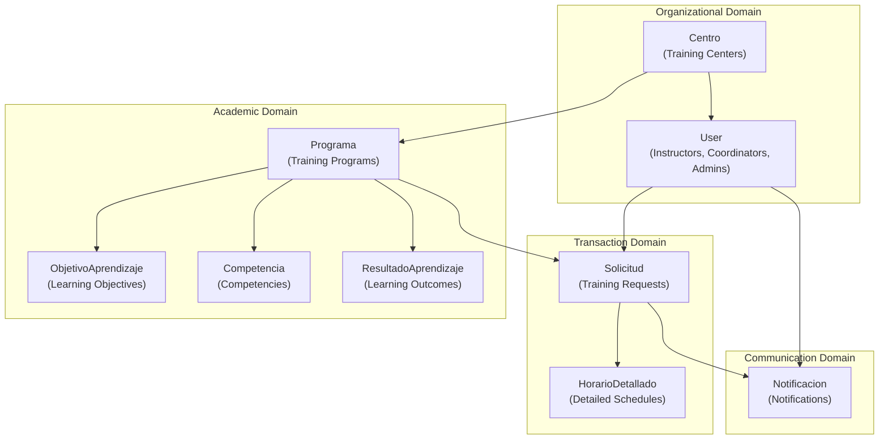
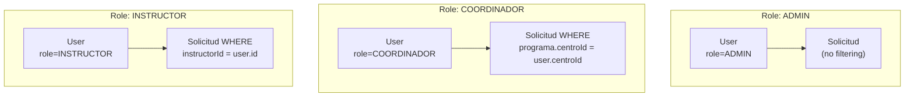
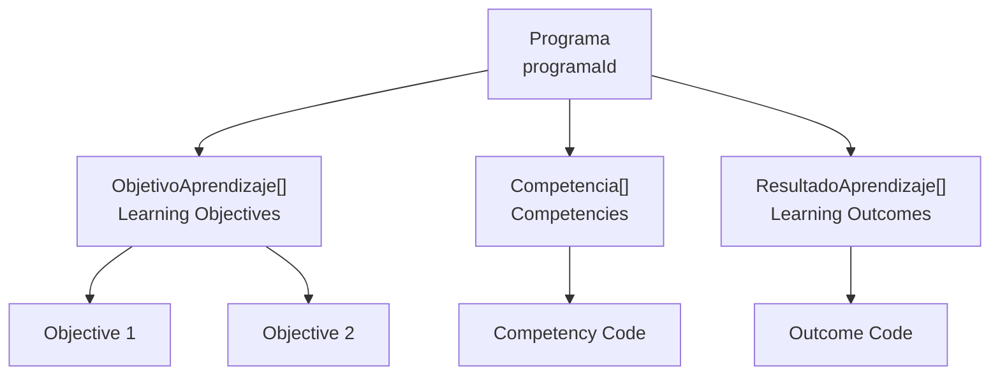
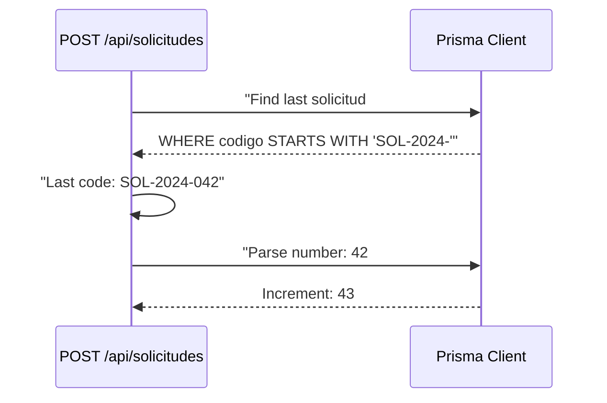
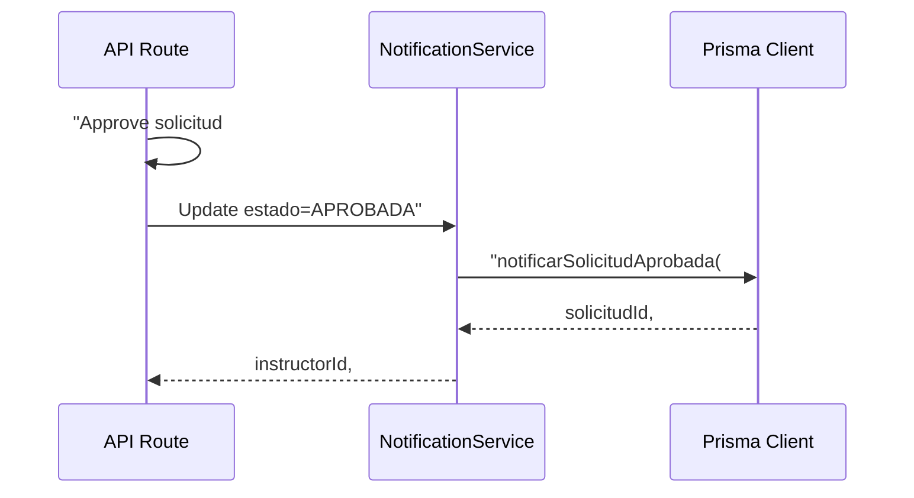
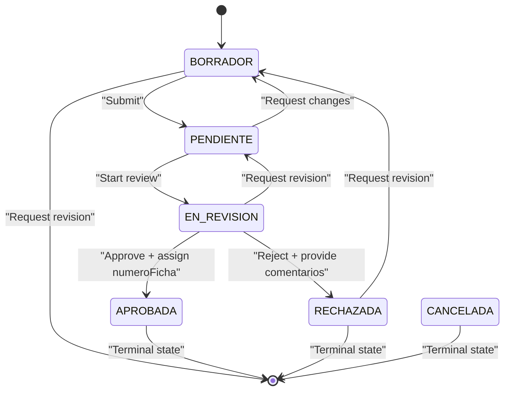
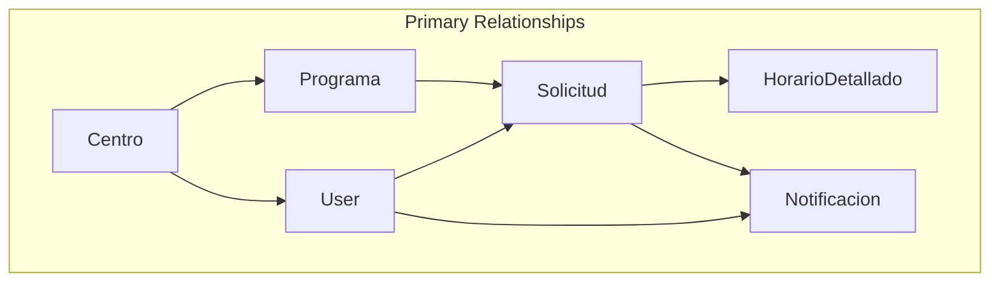
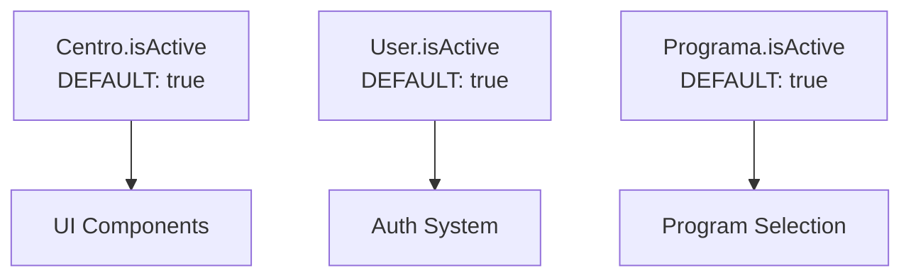
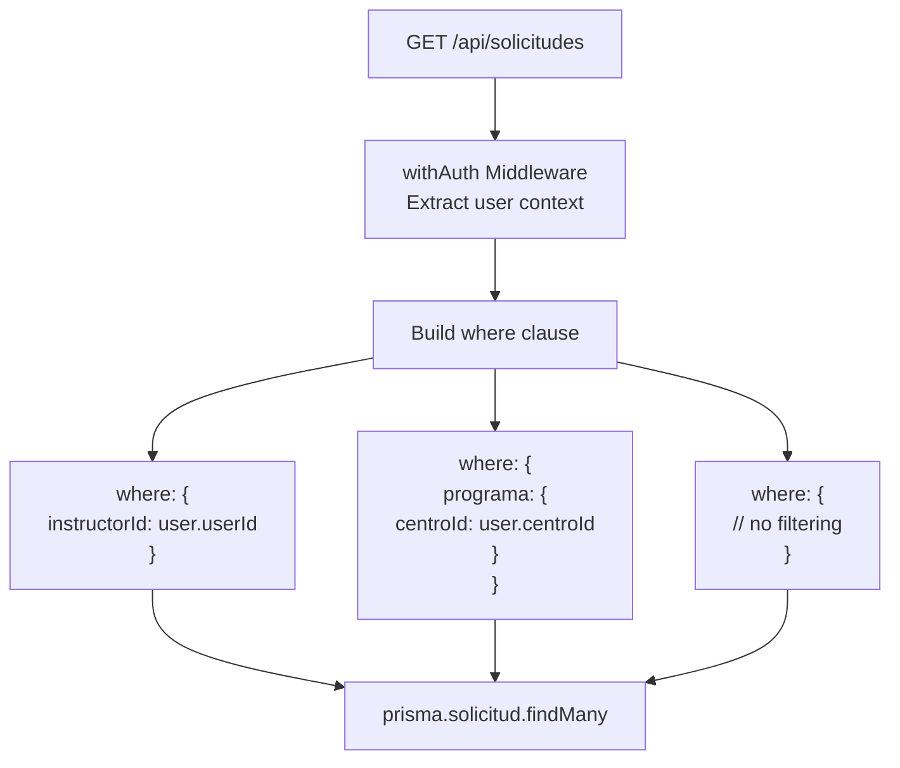

# Modelo de datos

> **Archivos fuente relevantes**
> * [aplicación/api/solicitudes/ruta.ts](https://github.com/axchisan/gestionComplementarias/blob/a3d2dcb4/app/api/solicitudes/route.ts)
> * [prisma/esquema.prisma](https://github.com/axchisan/gestionComplementarias/blob/a3d2dcb4/prisma/schema.prisma)

## Propósito y alcance

Este documento proporciona documentación técnica completa del esquema de base de datos y las estructuras de datos utilizadas en el sistema SENA Gestión Complementarias. Describe todos los modelos Prisma, sus campos, relaciones, restricciones y tipos de enumeración definidos en el esquema.

Para obtener información sobre cómo la autenticación y la autorización utilizan estos modelos, consulte [Autenticación y autorización](/axchisan/gestionComplementarias/3.4-authentication-and-authorization) . Para implementaciones de puntos finales de API que consultan estos modelos, consulte [API de backend](/axchisan/gestionComplementarias/6-backend-api) .

## Configuración del esquema

La aplicación utiliza **Prisma ORM** como capa de acceso a la base de datos, conectándose a una base de datos **PostgreSQL** alojada en Neon (sin servidor). El esquema se define en un único archivo con una configuración específica para implementaciones en contenedores.

**Detalles de configuración:**

| Configuración | Valor | Objetivo |
| --- | --- | --- |
| Proveedor | `prisma-client-js` | Cliente ORM basado en TypeScript |
| Objetivos binarios | `["native", "linux-musl-openssl-3.0.x"]` | Compatibilidad con Alpine Linux en Docker |
| Base de datos | PostgreSQL | Base de datos relacional a través de `DATABASE_URL`la variable de entorno |

La `binaryTargets`configuración garantiza que Prisma Client funcione correctamente dentro del contenedor Docker de Alpine Linux, que utiliza musl libc en lugar de glibc.

**Fuentes:** [schema.prisma L4-L12](https://github.com/axchisan/gestionComplementarias/blob/a3d2dcb4/prisma/schema.prisma#L4-L12)

---

## Descripción general de la entidad principal

El modelo de datos consta de **9 entidades principales** organizadas en cuatro dominios lógicos:



**Mapeo de dominios:**

* **Dominio organizacional** : Estructura jerárquica de los centros de formación y su personal
* **Dominio académico** : Estructura curricular con programas y elementos pedagógicos
* **Dominio de transacciones** : Flujo de trabajo empresarial principal para la gestión de solicitudes de capacitación
* **Dominio de la comunicación** : Sistema de notificación basado en eventos para actualizaciones de usuario

**Fuentes:** [schema.prisma L14-L230](https://github.com/axchisan/gestionComplementarias/blob/a3d2dcb4/prisma/schema.prisma#L14-L230)

---

## Diagrama completo de relación de entidades

```css
#mermaid-pnlyir28ry9{font-family:ui-sans-serif,-apple-system,system-ui,Segoe UI,Helvetica;font-size:16px;fill:#333;}@keyframes edge-animation-frame{from{stroke-dashoffset:0;}}@keyframes dash{to{stroke-dashoffset:0;}}#mermaid-pnlyir28ry9 .edge-animation-slow{stroke-dasharray:9,5!important;stroke-dashoffset:900;animation:dash 50s linear infinite;stroke-linecap:round;}#mermaid-pnlyir28ry9 .edge-animation-fast{stroke-dasharray:9,5!important;stroke-dashoffset:900;animation:dash 20s linear infinite;stroke-linecap:round;}#mermaid-pnlyir28ry9 .error-icon{fill:#dddddd;}#mermaid-pnlyir28ry9 .error-text{fill:#222222;stroke:#222222;}#mermaid-pnlyir28ry9 .edge-thickness-normal{stroke-width:1px;}#mermaid-pnlyir28ry9 .edge-thickness-thick{stroke-width:3.5px;}#mermaid-pnlyir28ry9 .edge-pattern-solid{stroke-dasharray:0;}#mermaid-pnlyir28ry9 .edge-thickness-invisible{stroke-width:0;fill:none;}#mermaid-pnlyir28ry9 .edge-pattern-dashed{stroke-dasharray:3;}#mermaid-pnlyir28ry9 .edge-pattern-dotted{stroke-dasharray:2;}#mermaid-pnlyir28ry9 .marker{fill:#999;stroke:#999;}#mermaid-pnlyir28ry9 .marker.cross{stroke:#999;}#mermaid-pnlyir28ry9 svg{font-family:ui-sans-serif,-apple-system,system-ui,Segoe UI,Helvetica;font-size:16px;}#mermaid-pnlyir28ry9 p{margin:0;}#mermaid-pnlyir28ry9 .entityBox{fill:#ffffff;stroke:#dddddd;}#mermaid-pnlyir28ry9 .relationshipLabelBox{fill:#dddddd;opacity:0.7;background-color:#dddddd;}#mermaid-pnlyir28ry9 .relationshipLabelBox rect{opacity:0.5;}#mermaid-pnlyir28ry9 .labelBkg{background-color:rgba(221, 221, 221, 0.5);}#mermaid-pnlyir28ry9 .edgeLabel .label{fill:#dddddd;font-size:14px;}#mermaid-pnlyir28ry9 .label{font-family:ui-sans-serif,-apple-system,system-ui,Segoe UI,Helvetica;color:#333;}#mermaid-pnlyir28ry9 .edge-pattern-dashed{stroke-dasharray:8,8;}#mermaid-pnlyir28ry9 .node rect,#mermaid-pnlyir28ry9 .node circle,#mermaid-pnlyir28ry9 .node ellipse,#mermaid-pnlyir28ry9 .node polygon{fill:#ffffff;stroke:#dddddd;stroke-width:1px;}#mermaid-pnlyir28ry9 .relationshipLine{stroke:#999;stroke-width:1;fill:none;}#mermaid-pnlyir28ry9 .marker{fill:none!important;stroke:#999!important;stroke-width:1;}#mermaid-pnlyir28ry9 :root{--mermaid-font-family:"trebuchet ms",verdana,arial,sans-serif;}centroIdcentroIdinstructorIdusuarioIdprogramaIdprogramaIdprogramaIdprogramaIdsolicitudId CASCADEsolicitudIdCentrostringidPKcuid()stringnombrestringcodigoUKstringdireccionstringtelefonostringciudadstringregionbooleanisActivedatetimecreatedAtdatetimeupdatedAtUserstringidPKcuid()stringemailUKstringpasswordstringnamestringcedulaUKstringtelefonoenumroleDEFAULT: INSTRUCTORstringcentroIdFKstringespecialidadbooleanisActiveDEFAULT: truedatetimecreatedAtdatetimeupdatedAtProgramastringidPKcuid()stringcodigoUKstringnombreenumtipoFormacionenummodalidadintduracionHorasintcupoAprendicesstringdescripcionstringcentroIdFKbooleanisActiveDEFAULT: truedatetimecreatedAtdatetimeupdatedAtSolicitudstringidPKcuid()stringcodigoUKSOL-YYYY-NNNstringinstructorIdFKstringprogramaIdFKdatetimefechaCaracterizacionstringresponsableNombrestringresponsableCedulastringresponsableEmailstringcodigoProgramastringversionProgramaDEFAULT: 1intduracionMaximaintcupoMaximointnumeroAprendicesInscribirenummodalidadstringmunicipiostringdepartamentostringnombreEmpresastringnitEmpresastringcodigoEmpresastringrepresentanteLegaldatetimefechaCreacionEmpresastringdireccionEmpresastringtelefonosEmpresastringlugarFormacionstringtipoAmbientebooleanprogramaEmprendimientoDEFAULT: falsebooleanprogramaBilinguismoDEFAULT: falsebooleanatencionInstitucionesDEFAULT: falsebooleanposconflictoDEFAULT: falsebooleansenaEmprendeRuralDEFAULT: falsebooleanformacionEspecialMypimesDEFAULT: falsebooleansenaEmprendeRuralPosconflictoDEFAULT: falsebooleantecnoacademiaSennovaDEFAULT: falsebooleancampesenaConvenio8842DEFAULT: falsebooleanfullPopularConvenio8882DEFAULT: falsebooleanicbfInstitutoDEFAULT: falsebooleanpoliciaNacionalDEFAULT: falsestringotroEspecificardatetimeinicioInscripciondatetimefinalizacionInscripciondatetimefechaInicioCursodatetimefechaFinalizacionCursostringjustificacionstring-arrayobjetivosPersonalizadosstringresultadosEsperadosstringobservacionesbooleancumpleRequisitosDEFAULT: falsebooleanautorizaUsoInfoDEFAULT: falsebooleanconfirmaVeracidadDEFAULT: falseenumestadoDEFAULT: BORRADORdatetimefechaSolicitudDEFAULT: now()datetimefechaRevisiondatetimefechaAprobacionstringcomentariosRevisionstringfirmaInstructorResponsablestringfirmaCoordinadorAcademicostringversionDocumentoDEFAULT: 1stringcodigoFormatoDEFAULT: F11-3030-003/03-06stringnumeroFichaUKdatetimecreatedAtdatetimeupdatedAtNotificacionstringidPKcuid()enumtipostringtitulostringmensajebooleanleidaDEFAULT: falsedatetimefechaCreadaDEFAULT: now()stringusuarioIdFKstringsolicitudIdFKObjetivoAprendizajestringidPKcuid()stringdescripcionstringprogramaIdFKintordenDEFAULT: 1CompetenciastringidPKcuid()stringdescripcionstringcodigostringprogramaIdFKResultadoAprendizajestringidPKcuid()stringdescripcionstringcodigostringprogramaIdFKHorarioDetalladostringidPKcuid()stringsolicitudIdFKCASCADE DELETEenumdiaSemanadatetimefechastringhoraIniciostringhoraFinbooleanesFlexibleDEFAULT: truestringobservaciones
```

**Fuentes:** [schema.prisma L14-L230](https://github.com/axchisan/gestionComplementarias/blob/a3d2dcb4/prisma/schema.prisma#L14-L230)

---

## Especificaciones del modelo

### Modelo de usuario

El `User`modelo representa a todos los usuarios del sistema con una diferenciación basada en roles. Cada usuario pertenece a un único centro de formación.

**Tabla: Campos de usuario**

| Campo | Tipo | Restricciones | Descripción |
| --- | --- | --- | --- |
| `id` | Cadena | PAQUETE,`@default(cuid())` | Identificador único |
| `email` | Cadena | Único | Credencial de inicio de sesión y contacto |
| `password` | Cadena | Requerido | contraseña con hash bcrypt |
| `name` | Cadena | Requerido | Nombre completo para mostrar |
| `cedula` | Cadena | Único | Número de identificación nacional colombiana |
| `telefono` | Cadena | Opcional | Contact phone number |
| `role` | Role enum | `@default(INSTRUCTOR)` | Access control role |
| `centroId` | String | FK to Centro | Data scoping boundary |
| `especialidad` | String | Optional | Area of expertise for instructors |
| `isActive` | Boolean | `@default(true)` | Soft delete flag |
| `createdAt` | DateTime | `@default(now())` | Record creation timestamp |
| `updatedAt` | DateTime | `@updatedAt` | Last modification timestamp |

**Relationships:**

* `centro`: Many-to-one with `Centro` (via `centroId`)
* `solicitudes`: One-to-many with `Solicitud` (inverse of `instructorId`)
* `notificaciones`: One-to-many with `Notificacion` (inverse of `usuarioId`)

**Unique Constraints:**

* `email`: Prevents duplicate accounts
* `cedula`: Enforces one account per person (Colombian ID)

**Role-Based Data Access Pattern:**



**Sources:** [prisma/schema.prisma L14-L34](https://github.com/axchisan/gestionComplementarias/blob/a3d2dcb4/prisma/schema.prisma#L14-L34)

 [app/api/solicitudes/route.ts L16-L22](https://github.com/axchisan/gestionComplementarias/blob/a3d2dcb4/app/api/solicitudes/route.ts#L16-L22)

---

### Centro Model

The `Centro` model represents SENA training centers, which serve as the top-level organizational unit. Each center offers programs and employs users.

**Table: Centro Fields**

| Field | Type | Constraints | Description |
| --- | --- | --- | --- |
| `id` | String | PK, `@default(cuid())` | Unique identifier |
| `nombre` | String | Required | Official center name |
| `codigo` | String | Unique | Center identification code |
| `direccion` | String | Optional | Physical address |
| `telefono` | String | Optional | Contact phone number |
| `ciudad` | String | Required | City location |
| `region` | String | Required | Geographic region |
| `isActive` | Boolean | `@default(true)` | Operational status |
| `createdAt` | DateTime | `@default(now())` | Record creation timestamp |
| `updatedAt` | DateTime | `@updatedAt` | Last modification timestamp |

**Relationships:**

* `usuarios`: One-to-many with `User`
* `programas`: One-to-many with `Programa`

**Data Scoping Significance:**

The `centroId` foreign key in `User` and `Programa` creates a strong data isolation boundary:

* Coordinators can only review solicitudes for programs in their center
* Instructors can only create solicitudes for programs in their center
* This is enforced at the API layer via query filtering

**Sources:** [prisma/schema.prisma L36-L53](https://github.com/axchisan/gestionComplementarias/blob/a3d2dcb4/prisma/schema.prisma#L36-L53)

 [app/api/solicitudes/route.ts L82-L98](https://github.com/axchisan/gestionComplementarias/blob/a3d2dcb4/app/api/solicitudes/route.ts#L82-L98)

---

### Programa Model

The `Programa` model defines training programs offered by centers. It serves as the catalog of available courses and contains pedagogical structure.

**Table: Programa Fields**

| Field | Type | Constraints | Description |
| --- | --- | --- | --- |
| `id` | String | PK, `@default(cuid())` | Unique identifier |
| `codigo` | String | Unique | Program identification code |
| `nombre` | String | Required | Official program name |
| `tipoFormacion` | TipoFormacion enum | Required | Training type classification |
| `modalidad` | Modalidad enum | Required | Delivery mode |
| `duracionHoras` | Int | Required | Total program hours |
| `cupoAprendices` | Int | Required | Maximum student capacity |
| `descripcion` | String | Optional | Program description |
| `centroId` | String | FK to Centro | Owning center |
| `isActive` | Boolean | `@default(true)` | Availability status |
| `createdAt` | DateTime | `@default(now())` | Record creation timestamp |
| `updatedAt` | DateTime | `@updatedAt` | Last modification timestamp |

**Relationships:**

* `centro`: Many-to-one with `Centro` (via `centroId`)
* `objetivos`: One-to-many with `ObjetivoAprendizaje`
* `competencias`: One-to-many with `Competencia`
* `resultados`: One-to-many with `ResultadoAprendizaje`
* `solicitudes`: One-to-many with `Solicitud`

**Academic Structure Diagram:**



**Sources:** [prisma/schema.prisma L55-L77](https://github.com/axchisan/gestionComplementarias/blob/a3d2dcb4/prisma/schema.prisma#L55-L77)

---

### Academic Structure Models

Three models define the pedagogical components of a program:

#### ObjetivoAprendizaje Model

**Table: ObjetivoAprendizaje Fields**

| Field | Type | Constraints | Description |
| --- | --- | --- | --- |
| `id` | String | PK, `@default(cuid())` | Unique identifier |
| `descripcion` | String | Required | Objective description |
| `programaId` | String | FK to Programa | Parent program |
| `orden` | Int | `@default(1)` | Display order |

Defines learning objectives for a program. The `orden` field enables sequenced display.

**Sources:** [prisma/schema.prisma L79-L87](https://github.com/axchisan/gestionComplementarias/blob/a3d2dcb4/prisma/schema.prisma#L79-L87)

#### Competencia Model

**Table: Competencia Fields**

| Field | Type | Constraints | Description |
| --- | --- | --- | --- |
| `id` | String | PK, `@default(cuid())` | Unique identifier |
| `descripcion` | String | Required | Competency description |
| `codigo` | String | Optional | Official competency code |
| `programaId` | String | FK to Programa | Parent program |

Represents skills or competencies taught in the program. The optional `codigo` allows linking to SENA's official competency framework.

**Sources:** [prisma/schema.prisma L89-L97](https://github.com/axchisan/gestionComplementarias/blob/a3d2dcb4/prisma/schema.prisma#L89-L97)

#### ResultadoAprendizaje Model

**Table: ResultadoAprendizaje Fields**

| Field | Type | Constraints | Description |
| --- | --- | --- | --- |
| `id` | String | PK, `@default(cuid())` | Unique identifier |
| `descripcion` | String | Required | Learning outcome description |
| `codigo` | String | Optional | Official outcome code |
| `programaId` | String | FK to Programa | Parent program |

Defines measurable learning outcomes for assessment. The optional `codigo` enables integration with SENA's curriculum standards.

**Sources:** [prisma/schema.prisma L99-L107](https://github.com/axchisan/gestionComplementarias/blob/a3d2dcb4/prisma/schema.prisma#L99-L107)

---

### Solicitud Model

The `Solicitud` model is the central transaction entity representing training requests. It contains comprehensive metadata spanning program details, scheduling, location, special program flags, and approval workflow state.

**Field Categories:**

1. **Identification & Workflow**
2. **Responsible Party Information**
3. **Program Configuration**
4. **Location & Venue**
5. **Special Program Characterization** (12 boolean flags)
6. **Scheduling**
7. **Academic Justification**
8. **Validation Flags**
9. **Approval Workflow State**
10. **Generated Documents**

**Table: Solicitud Core Fields**

| Field | Type | Constraints | Description |
| --- | --- | --- | --- |
| `id` | String | PK, `@default(cuid())` | Unique identifier |
| `codigo` | String | Unique | Format: `SOL-YYYY-NNN` |
| `instructorId` | String | FK to User | Creator/submitter |
| `programaId` | String | FK to Programa | Requested program |
| `estado` | EstadoSolicitud | `@default(BORRADOR)` | Workflow state |
| `numeroFicha` | String | Unique, optional | Generated on approval |

**Table: Responsible Party Fields**

| Field | Type | Constraints | Description |
| --- | --- | --- | --- |
| `fechaCaracterizacion` | DateTime | Optional | Characterization date |
| `responsableNombre` | String | Required | Responsible person's name |
| `responsableCedula` | String | Required | ID number |
| `responsableEmail` | String | Required | Contact email |

**Table: Program Configuration Fields**

| Field | Type | Constraints | Description |
| --- | --- | --- | --- |
| `codigoPrograma` | String | Required | Program code copy |
| `versionPrograma` | String | `@default("1")` | Program version |
| `duracionMaxima` | Int | Required | Maximum duration (hours) |
| `cupoMaximo` | Int | Required | Maximum capacity |
| `numeroAprendicesInscribir` | Int | Required | Number to enroll |
| `modalidad` | Modalidad enum | Required | Delivery mode |

**Table: Location & Venue Fields**

| Field | Type | Constraints | Description |
| --- | --- | --- | --- |
| `municipio` | String | Required | Municipality |
| `departamento` | String | Required | Department/state |
| `nombreEmpresa` | String | Required | Company/entity name |
| `nitEmpresa` | String | Optional | Tax ID number |
| `codigoEmpresa` | String | Optional | Company code |
| `representanteLegal` | String | Required | Legal representative |
| `fechaCreacionEmpresa` | DateTime | Optional | Company creation date |
| `direccionEmpresa` | String | Required | Address |
| `telefonosEmpresa` | String | Optional | Phone numbers |
| `lugarFormacion` | String | Required | Specific location |
| `tipoAmbiente` | String | Required | Environment type |

**Table: Special Program Characterization Fields**

All fields are `Boolean` with `@default(false)`:

| Field | Description |
| --- | --- |
| `programaEmprendimiento` | Entrepreneurship program |
| `programaBilinguismo` | Bilingualism program |
| `atencionInstituciones` | Institutional attention |
| `posconflicto` | Post-conflict program |
| `senaEmprendeRural` | SENA Rural Entrepreneurship |
| `formacionEspecialMypimes` | Special training for SMEs |
| `senaEmprendeRuralPosconflicto` | Rural post-conflict entrepreneurship |
| `tecnoacademiaSennova` | Technoacademy SENNOVA |
| `campesenaConvenio8842` | Campesena Agreement 8842 |
| `fullPopularConvenio8882` | Full Popular Agreement 8882 |
| `icbfInstituto` | ICBF Institute |
| `policiaNacional` | National Police |
| `otroEspecificar` | Other (specify) - String field |

**Table: Scheduling Fields**

| Field | Type | Constraints | Description |
| --- | --- | --- | --- |
| `inicioInscripcion` | DateTime | Required | Enrollment start date |
| `finalizacionInscripcion` | DateTime | Required | Enrollment end date |
| `fechaInicioCurso` | DateTime | Required | Course start date |
| `fechaFinalizacionCurso` | DateTime | Required | Course end date |

**Table: Academic Justification Fields**

| Field | Type | Constraints | Description |
| --- | --- | --- | --- |
| `justificacion` | String | Required | Academic justification text |
| `objetivosPersonalizados` | String[] | Array | Custom objectives (JSON array) |
| `resultadosEsperados` | String | Optional | Expected results |
| `observaciones` | String | Optional | Additional observations |

**Table: Validation & Approval Fields**

| Field | Type | Constraints | Description |
| --- | --- | --- | --- |
| `cumpleRequisitos` | Boolean | `@default(false)` | Meets requirements |
| `autorizaUsoInfo` | Boolean | `@default(false)` | Authorizes data usage |
| `confirmaVeracidad` | Boolean | `@default(false)` | Confirms truthfulness |
| `fechaSolicitud` | DateTime | `@default(now())` | Submission timestamp |
| `fechaRevision` | DateTime | Optional | Review start timestamp |
| `fechaAprobacion` | DateTime | Optional | Approval timestamp |
| `comentariosRevision` | String | Optional | Coordinator comments |
| `firmaInstructorResponsable` | String | Optional | Instructor signature |
| `firmaCoordinadorAcademico` | String | Optional | Coordinator signature |
| `versionDocumento` | String | `@default("1")` | Document version |
| `codigoFormato` | String | `@default("F11-3030-003/03-06")` | Format code |

**Relationships:**

* `instructor`: Many-to-one with `User` (via `instructorId`)
* `programa`: Many-to-one with `Programa` (via `programaId`)
* `horarios`: One-to-many with `HorarioDetallado` (cascade delete)
* `notificaciones`: One-to-many with `Notificacion`

**Codigo Generation Pattern:**



**Sources:** [prisma/schema.prisma L109-L195](https://github.com/axchisan/gestionComplementarias/blob/a3d2dcb4/prisma/schema.prisma#L109-L195)

 [app/api/solicitudes/route.ts L104-L119](https://github.com/axchisan/gestionComplementarias/blob/a3d2dcb4/app/api/solicitudes/route.ts#L104-L119)

---

### HorarioDetallado Model

The `HorarioDetallado` model provides granular scheduling information for a solicitud. Multiple horarios can be defined per solicitud, allowing complex weekly schedules.

**Table: HorarioDetallado Fields**

| Field | Type | Constraints | Description |
| --- | --- | --- | --- |
| `id` | String | PK, `@default(cuid())` | Unique identifier |
| `solicitudId` | String | FK to Solicitud, cascade | Parent solicitud |
| `diaSemana` | DiaSemana enum | Required | Day of week |
| `fecha` | DateTime | Optional | Specific date if applicable |
| `horaInicio` | String | Required | Start time (format: "HH:MM") |
| `horaFin` | String | Required | End time (format: "HH:MM") |
| `esFlexible` | Boolean | `@default(true)` | Allows schedule changes |
| `observaciones` | String | Optional | Schedule-specific notes |

**Cascade Delete Behavior:**

The `onDelete: Cascade` constraint ensures that when a `Solicitud` is deleted, all associated `HorarioDetallado` records are automatically removed, maintaining referential integrity.

**Time Format:**

Time values are stored as strings (e.g., "08:00", "16:00") rather than PostgreSQL TIME type, providing flexibility for client-side formatting and validation.

**Sources:** [prisma/schema.prisma L197-L211](https://github.com/axchisan/gestionComplementarias/blob/a3d2dcb4/prisma/schema.prisma#L197-L211)

---

### Notificacion Model

The `Notificacion` model implements an event-driven notification system for user communications tied to solicitud lifecycle events.

**Table: Notificacion Fields**

| Field | Type | Constraints | Description |
| --- | --- | --- | --- |
| `id` | String | PK, `@default(cuid())` | Unique identifier |
| `tipo` | TipoNotificacion enum | Required | Notification category |
| `titulo` | String | Required | Notification title |
| `mensaje` | String | Required | Notification message body |
| `leida` | Boolean | `@default(false)` | Read status |
| `fechaCreada` | DateTime | `@default(now())` | Creation timestamp |
| `usuarioId` | String | FK to User | Recipient user |
| `solicitudId` | String | FK to Solicitud, optional | Related solicitud |

**Relationships:**

* `usuario`: Many-to-one with `User` (via `usuarioId`)
* `solicitud`: Many-to-one with `Solicitud` (via `solicitudId`, optional)

**Notification Creation Pattern:**



**Sources:** [prisma/schema.prisma L213-L230](https://github.com/axchisan/gestionComplementarias/blob/a3d2dcb4/prisma/schema.prisma#L213-L230)

 [app/api/solicitudes/route.ts L214-L228](https://github.com/axchisan/gestionComplementarias/blob/a3d2dcb4/app/api/solicitudes/route.ts#L214-L228)

---

## Enumeration Types

The schema defines **6 enum types** providing type-safe categorical data:

### Role Enum

Defines user access levels for role-based access control (RBAC).

```
enum Role {
  INSTRUCTOR
  COORDINADOR
  ADMIN
}
```

**Usage:** `User.role` field with default value `INSTRUCTOR`

**Sources:** [prisma/schema.prisma L233-L237](https://github.com/axchisan/gestionComplementarias/blob/a3d2dcb4/prisma/schema.prisma#L233-L237)

---

### TipoFormacion Enum

Classifies program types according to SENA's training taxonomy.

```
enum TipoFormacion {
  COMPLEMENTARIA
  TRANSVERSAL
  ESPECIFICA
  VIRTUAL
}
```

**Usage:** `Programa.tipoFormacion` field

**Sources:** [prisma/schema.prisma L239-L244](https://github.com/axchisan/gestionComplementarias/blob/a3d2dcb4/prisma/schema.prisma#L239-L244)

---

### Modalidad Enum

Defines program delivery modes.

```
enum Modalidad {
  PRESENCIAL
  VIRTUAL
  MIXTA
  DESESCOLARIZADA
  COMBINADA
}
```

**Usage:** Both `Programa.modalidad` and `Solicitud.modalidad` fields

**Note:** `DESESCOLARIZADA` and `COMBINADA` values were added to match Excel export format requirements.

**Sources:** [prisma/schema.prisma L246-L252](https://github.com/axchisan/gestionComplementarias/blob/a3d2dcb4/prisma/schema.prisma#L246-L252)

---

### EstadoSolicitud Enum

Represents the solicitud approval workflow state machine.

```
enum EstadoSolicitud {
  BORRADOR
  PENDIENTE
  EN_REVISION
  APROBADA
  RECHAZADA
  CANCELADA
}
```

**State Transition Rules:**



**Usage:** `Solicitud.estado` field with default value `BORRADOR`

**Sources:** [prisma/schema.prisma L254-L261](https://github.com/axchisan/gestionComplementarias/blob/a3d2dcb4/prisma/schema.prisma#L254-L261)

---

### DiaSemana Enum

Spanish-language day-of-week enumeration for scheduling.

```
enum DiaSemana {
  LUNES
  MARTES
  MIERCOLES
  JUEVES
  VIERNES
  SABADO
  DOMINGO
}
```

**Usage:** `HorarioDetallado.diaSemana` field

**Sources:** [prisma/schema.prisma L263-L271](https://github.com/axchisan/gestionComplementarias/blob/a3d2dcb4/prisma/schema.prisma#L263-L271)

---

### TipoNotificacion Enum

Categorizes notification types for filtering and prioritization.

```
enum TipoNotificacion {
  NUEVA_SOLICITUD
  SOLICITUD_APROBADA
  SOLICITUD_RECHAZADA
  SOLICITUD_REVISION
  ASIGNACION_FICHA
  RECORDATORIO
  SISTEMA
}
```

**Notification Type Mapping:**

| Enum Value | Triggered By | Recipient |
| --- | --- | --- |
| `NUEVA_SOLICITUD` | Instructor submits (PENDIENTE) | All coordinators in center |
| `SOLICITUD_APROBADA` | Coordinator approves (APROBADA) | Instructor |
| `SOLICITUD_RECHAZADA` | Coordinator rejects (RECHAZADA) | Instructor |
| `SOLICITUD_REVISION` | Coordinator requests changes | Instructor |
| `ASIGNACION_FICHA` | `numeroFicha` generated | Instructor |
| `RECORDATORIO` | Scheduled task | Variable |
| `SISTEMA` | System event | Admins |

**Usage:** `Notificacion.tipo` field

**Sources:** [prisma/schema.prisma L273-L281](https://github.com/axchisan/gestionComplementarias/blob/a3d2dcb4/prisma/schema.prisma#L273-L281)

---

## Key Relationships and Constraints

### Foreign Key Relationships



**Cascade Behavior:**

Only `HorarioDetallado` uses cascade delete (`onDelete: Cascade`). When a `Solicitud` is deleted, all associated schedules are automatically removed. Other relationships do not cascade, protecting referential integrity.

**Sources:** [prisma/schema.prisma L14-L230](https://github.com/axchisan/gestionComplementarias/blob/a3d2dcb4/prisma/schema.prisma#L14-L230)

---

### Unique Constraints

**Table: Unique Constraints by Model**

| Model | Field | Purpose |
| --- | --- | --- |
| Centro | `codigo` | Prevent duplicate center codes |
| User | `email` | One account per email |
| User | `cedula` | One account per Colombian ID |
| Programa | `codigo` | Unique program identification |
| Solicitud | `codigo` | Unique solicitud tracking number |
| Solicitud | `numeroFicha` | Unique generated ficha number |

**Auto-Generated Unique Codes:**

Both `Solicitud.codigo` and `numeroFicha` are generated by the application:

* `codigo`: Format `SOL-YYYY-NNN`, generated on creation
* `numeroFicha`: Generated on approval, format determined by business logic

**Sources:** [prisma/schema.prisma L16-L187](https://github.com/axchisan/gestionComplementarias/blob/a3d2dcb4/prisma/schema.prisma#L16-L187)

 [app/api/solicitudes/route.ts L105-L119](https://github.com/axchisan/gestionComplementarias/blob/a3d2dcb4/app/api/solicitudes/route.ts#L105-L119)

---

### Soft Delete Pattern

Three models implement soft deletes via the `isActive` boolean field:



**Query Pattern:**

All queries for active entities should include `WHERE isActive = true`:

```javascript
// Example from solicitud creation
const programa = await prisma.programa.findFirst({
  where: {
    id: data.programaId,
    centroId: user.centroId,
    isActive: true  // Only active programs
  }
})
```

**Sources:** [prisma/schema.prisma L25-L66](https://github.com/axchisan/gestionComplementarias/blob/a3d2dcb4/prisma/schema.prisma#L25-L66)

 [app/api/solicitudes/route.ts L86](https://github.com/axchisan/gestionComplementarias/blob/a3d2dcb4/app/api/solicitudes/route.ts#L86-L86)

---

## Data Access Patterns

### Role-Based Query Filtering

API endpoints implement data scoping based on user roles by constructing dynamic `where` clauses:

**Pattern: Solicitud List Endpoint**



**Implementation:**

```javascript
// From GET /api/solicitudes
const where: any = {}

if (user.role === "INSTRUCTOR") {
  where.instructorId = user.userId
} else if (user.role === "COORDINADOR") {
  where.programa = {
    centroId: user.centroId
  }
}
// ADMIN gets no filtering - sees all solicitudes

const solicitudes = await prisma.solicitud.findMany({
  where,
  include: { instructor, programa, horarios }
})
```

**Sources:** [app/api/solicitudes/route.ts L13-L31](https://github.com/axchisan/gestionComplementarias/blob/a3d2dcb4/app/api/solicitudes/route.ts#L13-L31)

---

### Include Patterns for Related Data

Prisma queries frequently use `include` to fetch related entities in a single query, reducing N+1 query problems:

**Common Include Pattern:**

```sql
// Solicitud with full related data
prisma.solicitud.findMany({
  where,
  include: {
    instructor: {
      select: { name: true, email: true, especialidad: true }
    },
    programa: {
      select: {
        nombre: true,
        codigo: true,
        duracionHoras: true,
        modalidad: true,
        centro: { select: { nombre: true } }
      }
    },
    horarios: true  // All fields
  }
})
```

**Nested Includes:**

La `programa.centro`inclusión anidada obtiene el nombre del centro a través de la relación del programa, evitando una consulta separada.

**Fuentes:** [route.ts L36-L50](https://github.com/axchisan/gestionComplementarias/blob/a3d2dcb4/app/api/solicitudes/route.ts#L36-L50)

---

### Patrón de paginación

Los puntos finales de la lista implementan la paginación basada en desplazamiento:

**Parámetros de consulta:**

* `page`: Número de página (predeterminado: 1)
* `limit`: Registros por página (predeterminado: 10)

**Implementación:**

```javascript
const page = parseInt(searchParams.get('page') || '1')
const limit = parseInt(searchParams.get('limit') || '10')

const [solicitudes, total] = await Promise.all([
  prisma.solicitud.findMany({
    skip: (page - 1) * limit,
    take: limit,
    // ...other options
  }),
  prisma.solicitud.count({ where })
])

return {
  solicitudes,
  pagination: {
    page,
    limit,
    total,
    pages: Math.ceil(total / limit)
  }
}
```

**Fuentes:** [route.ts L10-L66](https://github.com/axchisan/gestionComplementarias/blob/a3d2dcb4/app/api/solicitudes/route.ts#L10-L66)

---

## Mapeo de tablas de bases de datos

Prisma usa la `@@map`directiva para personalizar los nombres de las tablas de PostgreSQL:

**Tabla: Mapeo de modelo a tabla**

| Modelo Prisma | Tabla de PostgreSQL | Directiva |
| --- | --- | --- |
| Usuario | `users` | `@@map("users")` |
| Centro | `centros` | `@@map("centros")` |
| Programa | `programas` | `@@map("programas")` |
| ObjetivoAprendizaje | `objetivos_aprendizaje` | `@@map("objetivos_aprendizaje")` |
| Competencia | `competencias` | `@@map("competencias")` |
| ResultadoAprendizaje | `resultados_aprendizaje` | `@@map("resultados_aprendizaje")` |
| Solicitud | `solicitudes` | `@@map("solicitudes")` |
| HorarioDetallado | `horarios_detallados` | `@@map("horarios_detallados")` |
| Notificación | `notificaciones` | `@@map("notificaciones")` |

Esto permite nombres de tablas en español en PostgreSQL mientras mantiene los nombres de modelos PascalCase en el código TypeScript.

**Fuentes:** [schema.prisma L33-L229](https://github.com/axchisan/gestionComplementarias/blob/a3d2dcb4/prisma/schema.prisma#L33-L229)