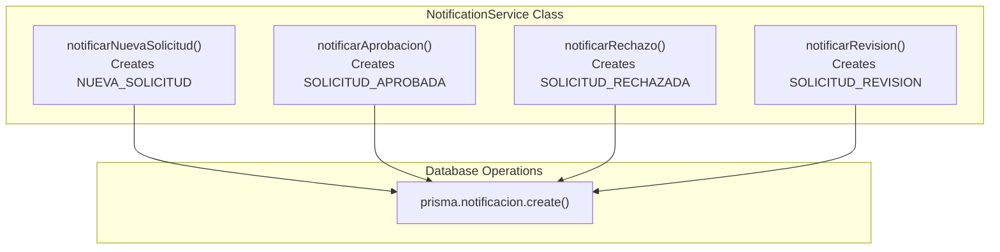
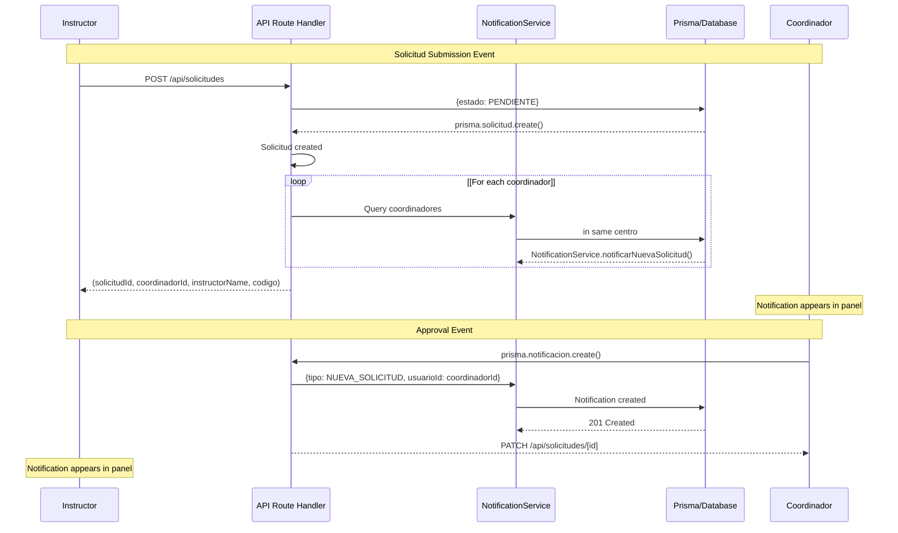
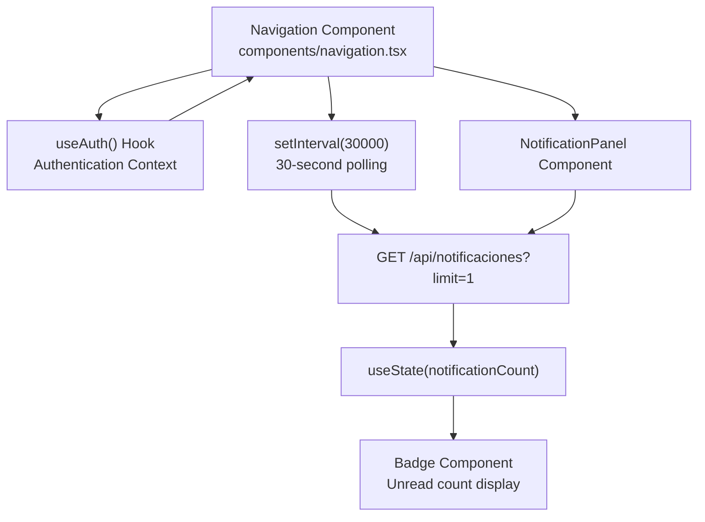
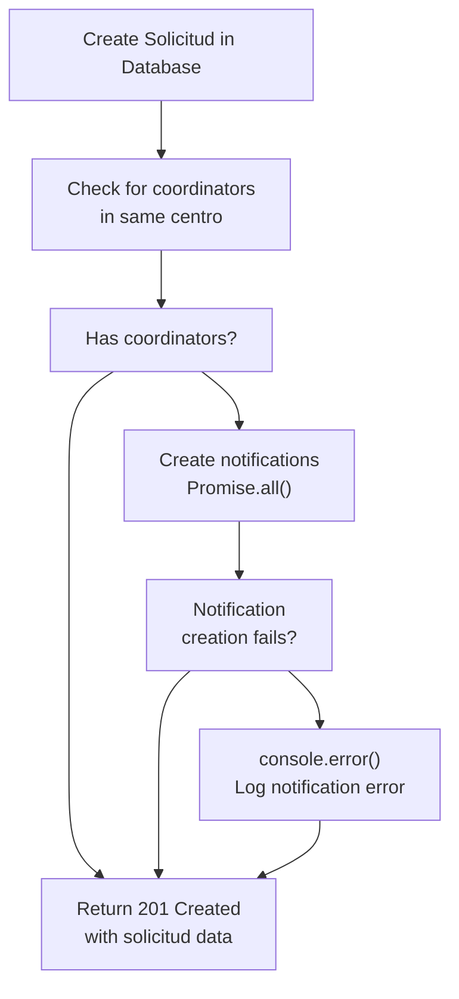
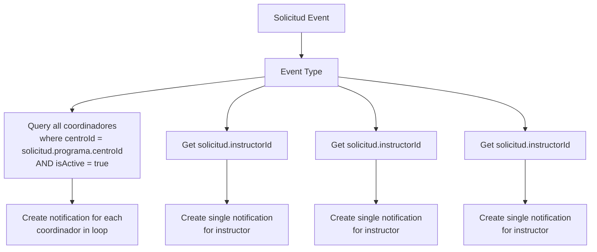

# Notification System

> **Relevant source files**
> * [app/api/solicitudes/route.ts](https://github.com/axchisan/gestionComplementarias/blob/a3d2dcb4/app/api/solicitudes/route.ts)
> * [components/navigation.tsx](https://github.com/axchisan/gestionComplementarias/blob/a3d2dcb4/components/navigation.tsx)
> * [prisma/schema.prisma](https://github.com/axchisan/gestionComplementarias/blob/a3d2dcb4/prisma/schema.prisma)

## Purpose and Scope

This document describes the notification system used to communicate solicitud lifecycle events to users. The system provides event-driven notifications that inform instructors and coordinators about status changes, approvals, rejections, and other important updates related to training solicitudes.

The notification system consists of three primary components: the database model for persisting notifications, the `NotificationService` for creating and managing notifications, and the API endpoints and UI components for delivering notifications to users. For information about the solicitud workflow that triggers these notifications, see [Solicitud Lifecycle](/axchisan/gestionComplementarias/4.2-solicitud-lifecycle). For details on the API implementation, see [API Architecture](/axchisan/gestionComplementarias/6.1-api-architecture).

---

## Notification Data Model

The notification system is built around the `Notificacion` entity in the database schema, which stores all notification records with metadata about their type, content, and read status.

### Schema Structure

| Field | Type | Description |
| --- | --- | --- |
| `id` | String (CUID) | Primary key |
| `tipo` | TipoNotificacion (enum) | Notification category |
| `titulo` | String | Notification title |
| `mensaje` | String | Notification body text |
| `leida` | Boolean | Read status (default: false) |
| `fechaCreada` | DateTime | Creation timestamp |
| `usuarioId` | String (FK) | Recipient user ID |
| `solicitudId` | String (FK, optional) | Related solicitud ID |

**Relations:**

* Each notification belongs to one `User` (recipient)
* Each notification may reference one `Solicitud` (optional, for solicitud-related notifications)

**Sources:** [prisma/schema.prisma L213-L230](https://github.com/axchisan/gestionComplementarias/blob/a3d2dcb4/prisma/schema.prisma#L213-L230)

### Notification Types Enum

The `TipoNotificacion` enum defines seven notification categories:

```

```

**Sources:** [prisma/schema.prisma L273-L281](https://github.com/axchisan/gestionComplementarias/blob/a3d2dcb4/prisma/schema.prisma#L273-L281)

---

## NotificationService Architecture

The `NotificationService` class provides a centralized service layer for creating and managing notifications. This service is invoked by API route handlers when solicitud state changes occur.

### Service Methods



Each notification method follows a consistent pattern:

1. Accepts parameters for recipient ID, solicitud ID, and relevant metadata
2. Constructs the notification title and message
3. Creates a database record via Prisma ORM
4. Returns the created notification object

**Sources:** [app/api/solicitudes/route.ts L4](https://github.com/axchisan/gestionComplementarias/blob/a3d2dcb4/app/api/solicitudes/route.ts#L4-L4)

 [app/api/solicitudes/route.ts L213-L228](https://github.com/axchisan/gestionComplementarias/blob/a3d2dcb4/app/api/solicitudes/route.ts#L213-L228)

---

## Notification Lifecycle and Events

The notification system follows an event-driven architecture where solicitud state transitions trigger notification creation. The following diagram maps solicitud events to notification types and recipients.

### Event-to-Notification Flow



**Sources:** [app/api/solicitudes/route.ts L213-L229](https://github.com/axchisan/gestionComplementarias/blob/a3d2dcb4/app/api/solicitudes/route.ts#L213-L229)

### Notification Trigger Points

| Solicitud Event | Estado Transition | Notification Type | Recipients |
| --- | --- | --- | --- |
| Submit solicitud | BORRADOR → PENDIENTE | `NUEVA_SOLICITUD` | All coordinators in same centro |
| Approve solicitud | EN_REVISION → APROBADA | `SOLICITUD_APROBADA` | Solicitud instructor |
| Reject solicitud | EN_REVISION → RECHAZADA | `SOLICITUD_RECHAZADA` | Solicitud instructor |
| Request revision | EN_REVISION → PENDIENTE | `SOLICITUD_REVISION` | Solicitud instructor |
| Assign ficha | APROBADA (add numeroFicha) | `ASIGNACION_FICHA` | Solicitud instructor |

**Sources:** [prisma/schema.prisma L254-L261](https://github.com/axchisan/gestionComplementarias/blob/a3d2dcb4/prisma/schema.prisma#L254-L261)

 [prisma/schema.prisma L273-L281](https://github.com/axchisan/gestionComplementarias/blob/a3d2dcb4/prisma/schema.prisma#L273-L281)

---

## API Endpoints for Notifications

The notification system exposes REST endpoints for retrieving and managing user notifications. The primary endpoint is `/api/notificaciones`.

### GET /api/notificaciones

Retrieves notifications for the authenticated user with pagination and filtering support.

**Request Parameters:**

* `limit` (optional, default: 50): Maximum number of notifications to return
* `skip` (optional, default: 0): Number of notifications to skip for pagination
* `leida` (optional): Filter by read status (boolean)

**Response Format:**

```

```

**Authorization:** Requires JWT authentication via `withAuth` middleware. Users can only access their own notifications (filtered by `usuarioId = user.userId`).

**Sources:** [components/navigation.tsx L27-L42](https://github.com/axchisan/gestionComplementarias/blob/a3d2dcb4/components/navigation.tsx#L27-L42)

### PATCH /api/notificaciones/[id]

Marks a specific notification as read.

**Request Body:**

```

```

**Response:** Updated notification object

**Authorization:** Requires JWT authentication. Users can only update their own notifications.

---

## Client-Side Integration

The notification system integrates with the React frontend through polling, state management, and UI components.

### Notification Polling Architecture



**Sources:** [components/navigation.tsx L18-L25](https://github.com/axchisan/gestionComplementarias/blob/a3d2dcb4/components/navigation.tsx#L18-L25)

 [components/navigation.tsx L27-L42](https://github.com/axchisan/gestionComplementarias/blob/a3d2dcb4/components/navigation.tsx#L27-L42)

### Notification Count Loading

The navigation component loads the notification count on mount and sets up periodic polling:

1. **Initial Load:** When user authenticates, `loadNotificationCount()` is called
2. **Polling:** `setInterval` executes every 30 seconds (30000ms)
3. **API Call:** Fetches `/api/notificaciones?limit=1` with JWT token in Authorization header
4. **State Update:** Updates `notificationCount` state with `data.noLeidas`
5. **Badge Display:** Shows count in red badge if count > 0

**Sources:** [components/navigation.tsx L18-L25](https://github.com/axchisan/gestionComplementarias/blob/a3d2dcb4/components/navigation.tsx#L18-L25)

 [components/navigation.tsx L27-L42](https://github.com/axchisan/gestionComplementarias/blob/a3d2dcb4/components/navigation.tsx#L27-L42)

### Notification Badge Display

The badge component displays the unread notification count with the following logic:

| Condition | Display |
| --- | --- |
| `notificationCount === 0` | Badge hidden |
| `1 <= notificationCount <= 99` | Shows exact count |
| `notificationCount > 99` | Shows "99+" |

**Desktop Navigation:**

```

```

**Sources:** [components/navigation.tsx L139-L143](https://github.com/axchisan/gestionComplementarias/blob/a3d2dcb4/components/navigation.tsx#L139-L143)

 [components/navigation.tsx L180-L184](https://github.com/axchisan/gestionComplementarias/blob/a3d2dcb4/components/navigation.tsx#L180-L184)

### NotificationPanel Component

The `NotificationPanel` component provides a slide-out panel for viewing and managing notifications:

**Component Props:**

* `isOpen`: Boolean to control panel visibility
* `onClose`: Callback function when panel closes

**Features:**

* Displays full list of notifications with titles and messages
* Shows notification type and timestamp
* Allows marking individual notifications as read
* Provides "Mark all as read" action
* Links to related solicitudes
* Auto-refreshes count when closed

**Sources:** [components/navigation.tsx L241-L247](https://github.com/axchisan/gestionComplementarias/blob/a3d2dcb4/components/navigation.tsx#L241-L247)

 [components/navigation.tsx L10](https://github.com/axchisan/gestionComplementarias/blob/a3d2dcb4/components/navigation.tsx#L10-L10)

---

## Error Handling and Resilience

The notification system implements defensive error handling to prevent notification failures from blocking critical solicitud operations.

### Error Handling Pattern



**Key Design Decisions:**

1. **Try-Catch Isolation:** Notification creation is wrapped in a separate try-catch block
2. **Non-Blocking Errors:** If notification creation fails, the solicitud creation still succeeds
3. **Error Logging:** Notification errors are logged to console but not returned to client
4. **Graceful Degradation:** Users receive their solicitud confirmation even if coordinators don't receive notifications

**Sources:** [app/api/solicitudes/route.ts L213-L228](https://github.com/axchisan/gestionComplementarias/blob/a3d2dcb4/app/api/solicitudes/route.ts#L213-L228)

---

## Notification Recipient Logic

The system applies role-based logic to determine notification recipients for each event type.

### Recipient Selection Rules



**Recipient Logic Summary:**

| Event Type | Recipients | Selection Logic |
| --- | --- | --- |
| `NUEVA_SOLICITUD` | All active coordinators in centro | `programa.centro.usuarios` where `role = COORDINADOR AND isActive = true` |
| `SOLICITUD_APROBADA` | Solicitud instructor | `solicitud.instructorId` |
| `SOLICITUD_RECHAZADA` | Solicitud instructor | `solicitud.instructorId` |
| `SOLICITUD_REVISION` | Solicitud instructor | `solicitud.instructorId` |
| `ASIGNACION_FICHA` | Solicitud instructor | `solicitud.instructorId` |

**Sources:** [app/api/solicitudes/route.ts L82-L98](https://github.com/axchisan/gestionComplementarias/blob/a3d2dcb4/app/api/solicitudes/route.ts#L82-L98)

 [app/api/solicitudes/route.ts L213-L224](https://github.com/axchisan/gestionComplementarias/blob/a3d2dcb4/app/api/solicitudes/route.ts#L213-L224)

---

## Database Queries and Performance

The notification system uses efficient database queries with proper indexing and relationship loading.

### Key Query Patterns

**Fetching User Notifications:**

```

```

**Counting Unread Notifications:**

```

```

**Sources:** [components/navigation.tsx L27-L42](https://github.com/axchisan/gestionComplementarias/blob/a3d2dcb4/components/navigation.tsx#L27-L42)

### Performance Considerations

1. **Polling Interval:** 30-second polling strikes a balance between responsiveness and server load
2. **Lightweight Counts:** The count endpoint uses `limit=1` and only returns aggregate data
3. **Indexed Queries:** Database queries filter by `usuarioId` which has a foreign key index
4. **Pagination:** Notification lists support `skip` and `take` parameters to limit result sets
5. **Selective Includes:** Only loads related `solicitud` data when needed (codigo and estado fields)

**Sources:** [components/navigation.tsx L22](https://github.com/axchisan/gestionComplementarias/blob/a3d2dcb4/components/navigation.tsx#L22-L22)

 [components/navigation.tsx L29](https://github.com/axchisan/gestionComplementarias/blob/a3d2dcb4/components/navigation.tsx#L29-L29)

 [prisma/schema.prisma L222-L228](https://github.com/axchisan/gestionComplementarias/blob/a3d2dcb4/prisma/schema.prisma#L222-L228)