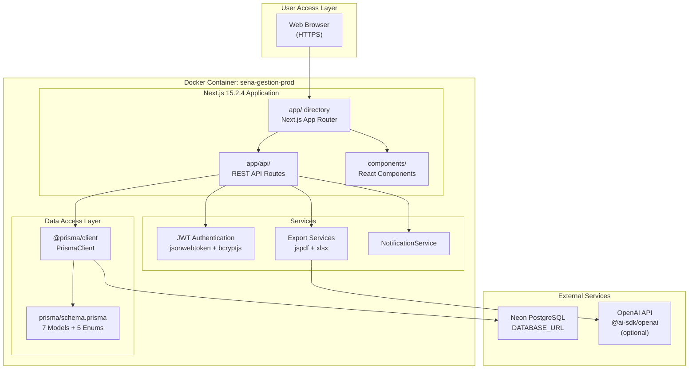
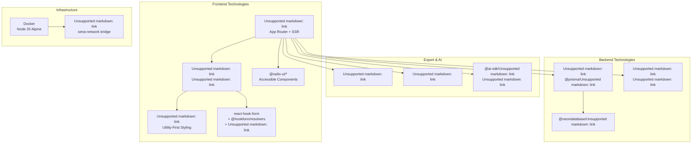
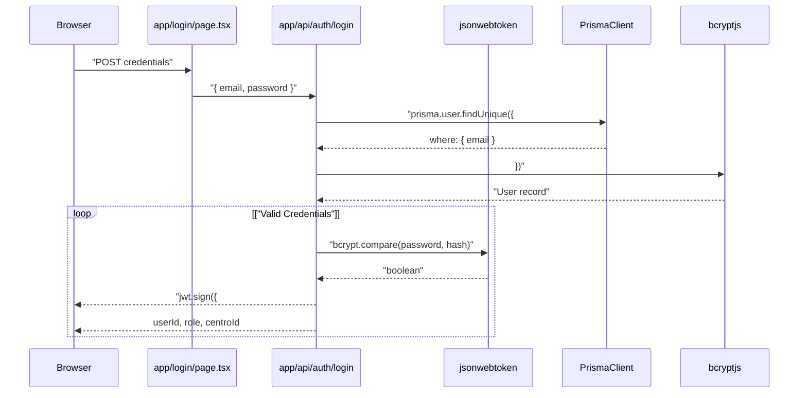
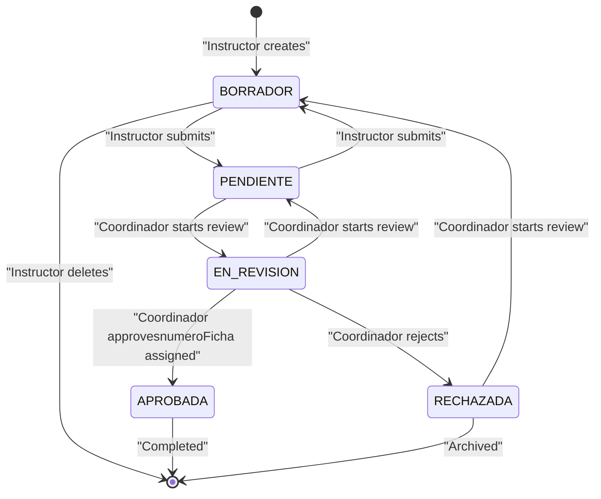
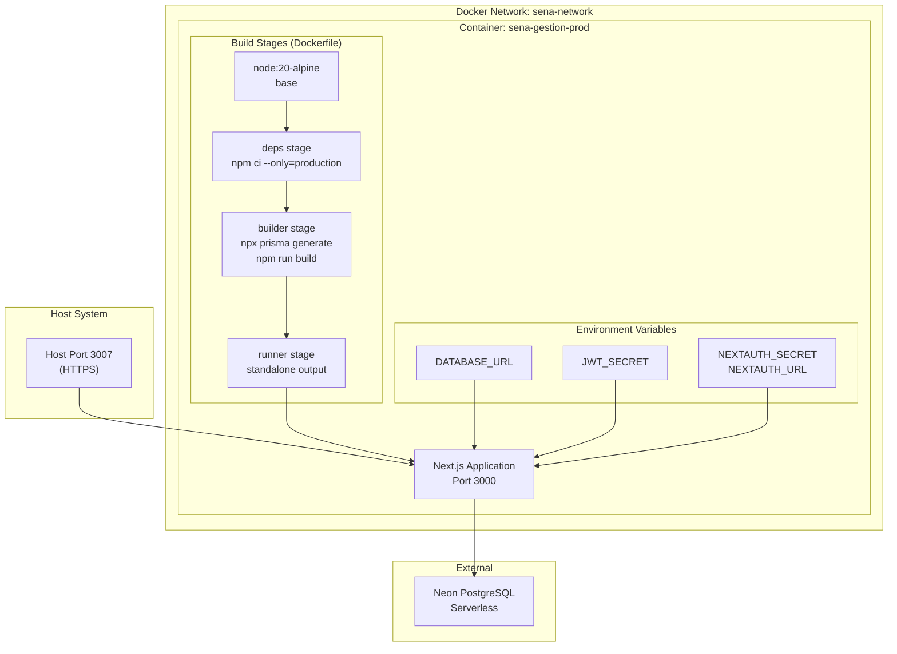

# Overview

> **Relevant source files**
> * [Dockerfile](https://github.com/axchisan/gestionComplementarias/blob/a3d2dcb4/Dockerfile)
> * [docker-compose.yml](https://github.com/axchisan/gestionComplementarias/blob/a3d2dcb4/docker-compose.yml)
> * [next.config.mjs](https://github.com/axchisan/gestionComplementarias/blob/a3d2dcb4/next.config.mjs)
> * [package-lock.json](https://github.com/axchisan/gestionComplementarias/blob/a3d2dcb4/package-lock.json)
> * [package.json](https://github.com/axchisan/gestionComplementarias/blob/a3d2dcb4/package.json)
> * [prisma/schema.prisma](https://github.com/axchisan/gestionComplementarias/blob/a3d2dcb4/prisma/schema.prisma)

## Purpose

This document provides a high-level introduction to the **SENA Gestión Complementarias** system, a web-based training request management platform designed for the Servicio Nacional de Aprendizaje (SENA) in Colombia. The system enables instructors to create and submit training program requests (solicitudes), coordinators to review and approve them, and administrators to oversee the entire process across multiple training centers.

This overview covers the system's purpose, architecture, core components, and business workflows. For detailed information about specific subsystems, see:

* For deployment and environment setup, see [Installation and Deployment](/axchisan/gestionComplementarias/2.1-installation-and-deployment)
* For database schema details, see [Data Model](/axchisan/gestionComplementarias/3.3-data-model)
* For API implementation details, see [Backend API](/axchisan/gestionComplementarias/6-backend-api)
* For UI component documentation, see [Frontend Components](/axchisan/gestionComplementarias/5-frontend-components)

**Sources:** [package.json L1-L96](https://github.com/axchisan/gestionComplementarias/blob/a3d2dcb4/package.json#L1-L96)

 [docker-compose.yml L1-L24](https://github.com/axchisan/gestionComplementarias/blob/a3d2dcb4/docker-compose.yml#L1-L24)

 [prisma/schema.prisma L1-L282](https://github.com/axchisan/gestionComplementarias/blob/a3d2dcb4/prisma/schema.prisma#L1-L282)

---

## System Purpose

SENA Gestión Complementarias manages the lifecycle of complementary training program requests within SENA's educational network. The system addresses three primary use cases:

1. **Request Creation**: Instructors create detailed training solicitudes specifying program details, schedules, locations, and academic justifications
2. **Approval Workflow**: Coordinators review pending requests, approve or reject them, and generate official program documentation (fichas)
3. **Administrative Oversight**: Administrators manage users, monitor cross-center activities, and generate system-wide reports

The platform replaces manual paper-based processes with a digital workflow that ensures traceability, standardization, and efficient communication between instructors and coordinators.

**Sources:** [prisma/schema.prisma L109-L195](https://github.com/axchisan/gestionComplementarias/blob/a3d2dcb4/prisma/schema.prisma#L109-L195)

 [prisma/schema.prisma L14-L34](https://github.com/axchisan/gestionComplementarias/blob/a3d2dcb4/prisma/schema.prisma#L14-L34)

 [prisma/schema.prisma L254-L261](https://github.com/axchisan/gestionComplementarias/blob/a3d2dcb4/prisma/schema.prisma#L254-L261)

---

## System Architecture

### Application Structure



**Diagram: High-Level System Architecture**

The system runs as a containerized Next.js monolithic application deployed via Docker. All frontend rendering, API handling, and business logic execute within a single Node.js 20 runtime environment.

**Sources:** [docker-compose.yml L4-L21](https://github.com/axchisan/gestionComplementarias/blob/a3d2dcb4/docker-compose.yml#L4-L21)

 [next.config.mjs L1-L49](https://github.com/axchisan/gestionComplementarias/blob/a3d2dcb4/next.config.mjs#L1-L49)

 [package.json L18-L79](https://github.com/axchisan/gestionComplementarias/blob/a3d2dcb4/package.json#L18-L79)

 [Dockerfile L1-L55](https://github.com/axchisan/gestionComplementarias/blob/a3d2dcb4/Dockerfile#L1-L55)

---

### Core Technology Stack



**Diagram: Technology Stack Dependencies**

**Sources:** [package.json L18-L79](https://github.com/axchisan/gestionComplementarias/blob/a3d2dcb4/package.json#L18-L79)

 [package.json L81-L95](https://github.com/axchisan/gestionComplementarias/blob/a3d2dcb4/package.json#L81-L95)

 [Dockerfile L2-L55](https://github.com/axchisan/gestionComplementarias/blob/a3d2dcb4/Dockerfile#L2-L55)

---

## Data Model Overview

### Entity Relationship Structure

```css
#mermaid-awrpf67civ{font-family:ui-sans-serif,-apple-system,system-ui,Segoe UI,Helvetica;font-size:16px;fill:#333;}@keyframes edge-animation-frame{from{stroke-dashoffset:0;}}@keyframes dash{to{stroke-dashoffset:0;}}#mermaid-awrpf67civ .edge-animation-slow{stroke-dasharray:9,5!important;stroke-dashoffset:900;animation:dash 50s linear infinite;stroke-linecap:round;}#mermaid-awrpf67civ .edge-animation-fast{stroke-dasharray:9,5!important;stroke-dashoffset:900;animation:dash 20s linear infinite;stroke-linecap:round;}#mermaid-awrpf67civ .error-icon{fill:#dddddd;}#mermaid-awrpf67civ .error-text{fill:#222222;stroke:#222222;}#mermaid-awrpf67civ .edge-thickness-normal{stroke-width:1px;}#mermaid-awrpf67civ .edge-thickness-thick{stroke-width:3.5px;}#mermaid-awrpf67civ .edge-pattern-solid{stroke-dasharray:0;}#mermaid-awrpf67civ .edge-thickness-invisible{stroke-width:0;fill:none;}#mermaid-awrpf67civ .edge-pattern-dashed{stroke-dasharray:3;}#mermaid-awrpf67civ .edge-pattern-dotted{stroke-dasharray:2;}#mermaid-awrpf67civ .marker{fill:#999;stroke:#999;}#mermaid-awrpf67civ .marker.cross{stroke:#999;}#mermaid-awrpf67civ svg{font-family:ui-sans-serif,-apple-system,system-ui,Segoe UI,Helvetica;font-size:16px;}#mermaid-awrpf67civ p{margin:0;}#mermaid-awrpf67civ .entityBox{fill:#ffffff;stroke:#dddddd;}#mermaid-awrpf67civ .relationshipLabelBox{fill:#dddddd;opacity:0.7;background-color:#dddddd;}#mermaid-awrpf67civ .relationshipLabelBox rect{opacity:0.5;}#mermaid-awrpf67civ .labelBkg{background-color:rgba(221, 221, 221, 0.5);}#mermaid-awrpf67civ .edgeLabel .label{fill:#dddddd;font-size:14px;}#mermaid-awrpf67civ .label{font-family:ui-sans-serif,-apple-system,system-ui,Segoe UI,Helvetica;color:#333;}#mermaid-awrpf67civ .edge-pattern-dashed{stroke-dasharray:8,8;}#mermaid-awrpf67civ .node rect,#mermaid-awrpf67civ .node circle,#mermaid-awrpf67civ .node ellipse,#mermaid-awrpf67civ .node polygon{fill:#ffffff;stroke:#dddddd;stroke-width:1px;}#mermaid-awrpf67civ .relationshipLine{stroke:#999;stroke-width:1;fill:none;}#mermaid-awrpf67civ .marker{fill:none!important;stroke:#999!important;stroke-width:1;}#mermaid-awrpf67civ :root{--mermaid-font-family:"trebuchet ms",verdana,arial,sans-serif;}employsofferscreatesreceivesrequested_indefinesteachesachievesscheduled_withtriggersCentrostringidPKstringnombrestringcodigoUKstringciudadstringregionbooleanisActiveUserstringidPKstringemailUKstringcedulaUKenumroleINSTRUCTOR | COORDINADOR | ADMINstringcentroIdFKbooleanisActiveProgramastringidPKstringcodigoUKstringnombreenumtipoFormacionenummodalidadintduracionHorasstringcentroIdFKSolicitudstringidPKstringcodigoUKSOL-YYYY-NNNenumestadoBORRADOR | PENDIENTE | EN_REVISION | APROBADA | RECHAZADAstringinstructorIdFKstringprogramaIdFKstringnumeroFichaUKGenerated on approvalDateTimefechaSolicitudNotificacionstringidPKenumtipostringtitulostringmensajebooleanleidastringusuarioIdFKstringsolicitudIdFKObjetivoAprendizajeCompetenciaResultadoAprendizajeHorarioDetalladostringidPKstringsolicitudIdFKenumdiaSemanastringhoraIniciostringhoraFinbooleanesFlexible
```

**Diagram: Core Database Schema (prisma/schema.prisma)**

The system models organizational hierarchy through `Centro` → `Programa` → `Solicitud` relationships. Each `User` is associated with a single `Centro` and can create multiple `Solicitud` records. The `Solicitud` entity is the central transaction object, tracking state through the `EstadoSolicitud` enum.

**Sources:** [prisma/schema.prisma L14-L282](https://github.com/axchisan/gestionComplementarias/blob/a3d2dcb4/prisma/schema.prisma#L14-L282)

---

## User Roles and Access Control

### Role-Based Access Pattern

| Role | Code Identifier | Capabilities | Data Scope |
| --- | --- | --- | --- |
| **Instructor** | `Role.INSTRUCTOR` | Create/edit solicitudes, view own requests | `solicitud.instructorId = user.id` |
| **Coordinator** | `Role.COORDINADOR` | Review/approve solicitudes, manage instructors, generate reports | `solicitud.programa.centroId = user.centroId` |
| **Administrator** | `Role.ADMIN` | Full system access, user management, cross-center oversight | No filtering (global access) |

**Sources:** [prisma/schema.prisma L233-L237](https://github.com/axchisan/gestionComplementarias/blob/a3d2dcb4/prisma/schema.prisma#L233-L237)

### Authentication Flow



**Diagram: JWT Authentication Flow**

Authentication uses JWT tokens containing `userId`, `role`, and `centroId` claims. The `withAuth` middleware extracts these claims to enforce role-based data filtering on API routes.

**Sources:** [docker-compose.yml L18](https://github.com/axchisan/gestionComplementarias/blob/a3d2dcb4/docker-compose.yml#L18-L18)

 [package.json L74](https://github.com/axchisan/gestionComplementarias/blob/a3d2dcb4/package.json#L74-L74)

---

## Solicitud Lifecycle

### State Machine



**Diagram: Solicitud State Transitions (EstadoSolicitud enum)**

The `Solicitud.estado` field tracks request status through five states defined in the `EstadoSolicitud` enum. State transitions trigger `Notificacion` records via `TipoNotificacion` enum values.

**Sources:** [prisma/schema.prisma L254-L261](https://github.com/axchisan/gestionComplementarias/blob/a3d2dcb4/prisma/schema.prisma#L254-L261)

 [prisma/schema.prisma L273-L281](https://github.com/axchisan/gestionComplementarias/blob/a3d2dcb4/prisma/schema.prisma#L273-L281)

 [prisma/schema.prisma L175](https://github.com/axchisan/gestionComplementarias/blob/a3d2dcb4/prisma/schema.prisma#L175-L175)

---

## Deployment Architecture

### Docker Container Configuration



**Diagram: Docker Deployment Configuration**

The application uses a multi-stage Dockerfile optimizing for production with Next.js standalone output mode. The `docker-compose.yml` orchestrates container lifecycle, port mapping (3007→3000), and environment variable injection.

**Sources:** [docker-compose.yml L1-L24](https://github.com/axchisan/gestionComplementarias/blob/a3d2dcb4/docker-compose.yml#L1-L24)

 [Dockerfile L1-L55](https://github.com/axchisan/gestionComplementarias/blob/a3d2dcb4/Dockerfile#L1-L55)

 [next.config.mjs L3](https://github.com/axchisan/gestionComplementarias/blob/a3d2dcb4/next.config.mjs#L3-L3)

---

## Key Application Routes

### API Endpoints Mapping

| HTTP Method | Route Pattern | Handler Location | Purpose |
| --- | --- | --- | --- |
| `POST` | `/api/auth/login` | `app/api/auth/login/route.ts` | User authentication, JWT generation |
| `POST` | `/api/auth/register` | `app/api/auth/register/route.ts` | User registration |
| `GET` | `/api/solicitudes` | `app/api/solicitudes/route.ts` | List solicitudes (role-filtered) |
| `POST` | `/api/solicitudes` | `app/api/solicitudes/route.ts` | Create new solicitud |
| `GET` | `/api/solicitudes/[id]` | `app/api/solicitudes/[id]/route.ts` | Get solicitud details |
| `PUT` | `/api/solicitudes/[id]` | `app/api/solicitudes/[id]/route.ts` | Update solicitud |
| `GET` | `/api/solicitudes/[id]/export` | `app/api/solicitudes/[id]/export/route.ts` | Generate PDF/Excel |
| `GET` | `/api/notificaciones` | `app/api/notificaciones/route.ts` | Fetch user notifications |
| `POST` | `/api/instructores` | `app/api/instructores/route.ts` | Create instructor (coordinador only) |

**Sources:** [package.json L58](https://github.com/axchisan/gestionComplementarias/blob/a3d2dcb4/package.json#L58-L58)

 (Next.js version implies App Router structure)

### Page Routes

| Route Path | Component Location | Access Level | Description |
| --- | --- | --- | --- |
| `/` | `app/page.tsx` | Public | Landing page |
| `/login` | `app/login/page.tsx` | Public | Authentication |
| `/dashboard` | `app/dashboard/page.tsx` | Authenticated | Role-specific dashboard |
| `/solicitudes` | `app/solicitudes/page.tsx` | Authenticated | List view |
| `/solicitudes/[id]` | `app/solicitudes/[id]/page.tsx` | Authenticated | Detail view |
| `/nueva-solicitud` | `app/nueva-solicitud/page.tsx` | Instructor | Creation form |
| `/crear-usuario` | `app/crear-usuario/page.tsx` | Coordinador/Admin | User management |

---

## Configuration Files

### Critical Configuration

The system relies on several configuration files that control build behavior, database schema, and runtime settings:

**Docker Configuration**

* [docker-compose.yml L1-L24](https://github.com/axchisan/gestionComplementarias/blob/a3d2dcb4/docker-compose.yml#L1-L24)  - Service orchestration, port mapping (3007:3000), environment variable mapping
* [Dockerfile L1-L55](https://github.com/axchisan/gestionComplementarias/blob/a3d2dcb4/Dockerfile#L1-L55)  - Multi-stage build: deps → builder → runner stages

**Next.js Configuration**

* [next.config.mjs L1-L49](https://github.com/axchisan/gestionComplementarias/blob/a3d2dcb4/next.config.mjs#L1-L49)  - Standalone output mode, security headers (X-Frame-Options, CORS), image optimization disabled

**Database Configuration**

* [prisma/schema.prisma L1-L12](https://github.com/axchisan/gestionComplementarias/blob/a3d2dcb4/prisma/schema.prisma#L1-L12)  - Generator settings with `binaryTargets = ["native", "linux-musl-openssl-3.0.x"]` for Alpine Linux compatibility
* [prisma/schema.prisma L9-L12](https://github.com/axchisan/gestionComplementarias/blob/a3d2dcb4/prisma/schema.prisma#L9-L12)  - PostgreSQL datasource configuration via `DATABASE_URL` environment variable

**Package Management**

* [package.json L1-L96](https://github.com/axchisan/gestionComplementarias/blob/a3d2dcb4/package.json#L1-L96)  - Dependency declarations, build scripts, Prisma seed configuration

**Sources:** [docker-compose.yml L1-L24](https://github.com/axchisan/gestionComplementarias/blob/a3d2dcb4/docker-compose.yml#L1-L24)

 [Dockerfile L1-L55](https://github.com/axchisan/gestionComplementarias/blob/a3d2dcb4/Dockerfile#L1-L55)

 [next.config.mjs L1-L49](https://github.com/axchisan/gestionComplementarias/blob/a3d2dcb4/next.config.mjs#L1-L49)

 [prisma/schema.prisma L1-L12](https://github.com/axchisan/gestionComplementarias/blob/a3d2dcb4/prisma/schema.prisma#L1-L12)

---

## System Dependencies

### Production Dependencies

The system uses the following key dependencies for runtime operation:

**Core Framework**

* `next@15.2.4` - Full-stack React framework with App Router
* `react@18.3.1` + `react-dom@18.3.1` - UI library

**Database & ORM**

* `@prisma/client@5.22.0` - Type-safe database client
* `@neondatabase/serverless@0.10.4` - Neon PostgreSQL driver

**Authentication & Security**

* `bcryptjs@2.4.3` - Password hashing (10 rounds)
* `jsonwebtoken@9.0.2` - JWT token generation/verification

**UI Components**

* `@radix-ui/react-*` - Accessible component primitives (30+ packages)
* `tailwindcss@3.4.17` - Utility-first CSS framework
* `lucide-react@0.451.0` - Icon library

**Forms & Validation**

* `react-hook-form@latest` - Form state management
* `@hookform/resolvers@3.9.0` - Validation resolver integration
* `zod@3.23.8` - Runtime type validation

**Document Generation**

* `jspdf@2.5.2` - PDF export
* `xlsx@0.18.5` - Excel export

**AI Integration (Optional)**

* `@ai-sdk/openai@0.0.66` - OpenAI API integration
* `ai@3.4.32` - AI SDK core

**Sources:** [package.json L18-L79](https://github.com/axchisan/gestionComplementarias/blob/a3d2dcb4/package.json#L18-L79)

---

## Environment Variables

The application requires the following environment variables for operation:

| Variable | Source | Purpose | Required |
| --- | --- | --- | --- |
| `DATABASE_URL` | docker-compose.yml | PostgreSQL connection string | Yes |
| `JWT_SECRET` | docker-compose.yml | JWT signing key | Yes |
| `NEXTAUTH_SECRET` | docker-compose.yml | NextAuth session encryption | Yes |
| `NEXTAUTH_URL` | docker-compose.yml | Application base URL | Yes |
| `NODE_ENV` | docker-compose.yml | Runtime environment (production) | Yes |
| `PORT` | Dockerfile | Internal port (3000) | No (default: 3000) |
| `HOSTNAME` | Dockerfile | Bind address (0.0.0.0) | No (default: 0.0.0.0) |

**Sources:** [docker-compose.yml L13-L18](https://github.com/axchisan/gestionComplementarias/blob/a3d2dcb4/docker-compose.yml#L13-L18)

 [Dockerfile L52-L53](https://github.com/axchisan/gestionComplementarias/blob/a3d2dcb4/Dockerfile#L52-L53)

---

## Next Steps

This overview provides the foundation for understanding SENA Gestión Complementarias. For detailed information about specific aspects of the system:

* **Setup & Deployment**: See [Installation and Deployment](/axchisan/gestionComplementarias/2.1-installation-and-deployment) for step-by-step deployment instructions
* **Architecture Deep Dive**: See [System Architecture](/axchisan/gestionComplementarias/3-system-architecture) for detailed technical architecture
* **Database Schema**: See [Data Model](/axchisan/gestionComplementarias/3.3-data-model) for complete entity documentation
* **User Workflows**: See [User Roles and Workflows](/axchisan/gestionComplementarias/4-user-roles-and-workflows) for role-specific processes
* **Frontend Implementation**: See [Frontend Components](/axchisan/gestionComplementarias/5-frontend-components) for UI component details
* **Backend APIs**: See [Backend API](/axchisan/gestionComplementarias/6-backend-api) for endpoint documentation