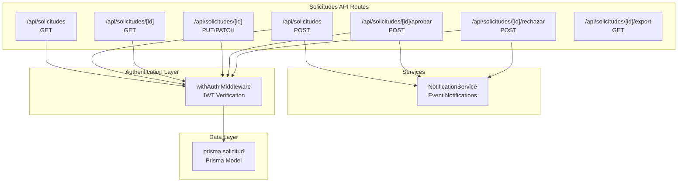
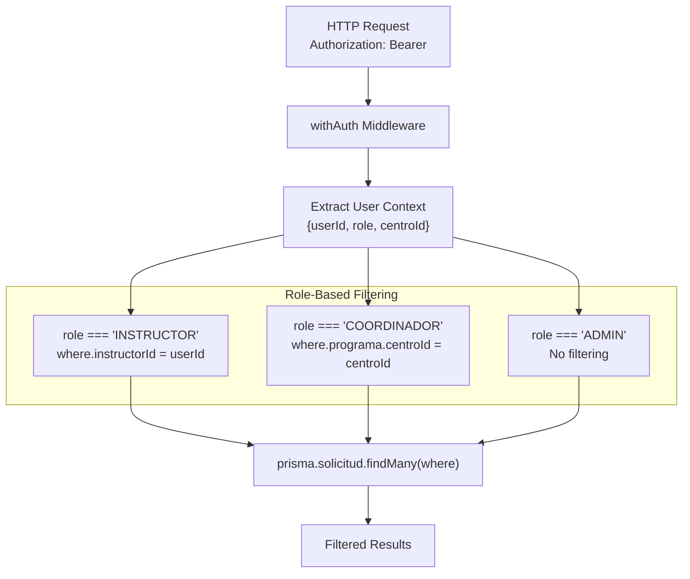
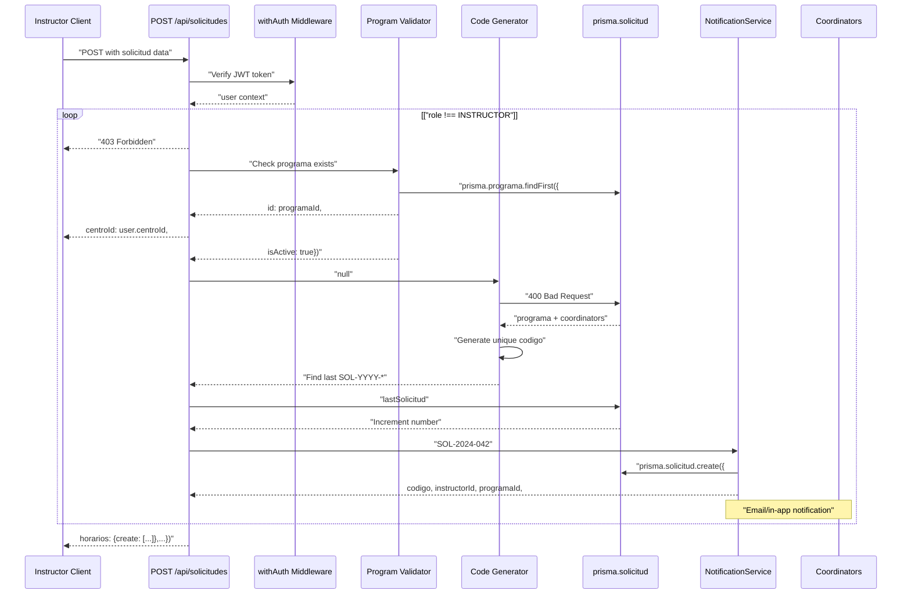

# Puntos finales de las solicitudes

> **Archivos fuente relevantes**
> * [aplicación/api/solicitudes/ruta.ts](https://github.com/axchisan/gestionComplementarias/blob/a3d2dcb4/app/api/solicitudes/route.ts)
> * [prisma/esquema.prisma](https://github.com/axchisan/gestionComplementarias/blob/a3d2dcb4/prisma/schema.prisma)

## Propósito y alcance

Este documento proporciona documentación técnica para los puntos finales de la API REST de Solicitudes, que gestionan las operaciones CRUD para `Solicitud`los recursos de solicitud de capacitación ( ). Estos puntos finales respaldan el flujo de trabajo principal de la empresa: crear, revisar y gestionar solicitudes de capacitación en el sistema SENA Gestión Complementarias.

Esta página abarca los esquemas de solicitud/respuesta, el filtrado basado en roles, la paginación y la validación de datos para los principales puntos de acceso de la recopilación de solicitudes. Para obtener documentación sobre los mecanismos de autenticación, consulte [Puntos de acceso de autenticación](/axchisan/gestionComplementarias/6.3-authentication-endpoints) . Para conocer el sistema de notificaciones activado por los cambios de estado de la solicitud, consulte [Sistema de notificaciones](/axchisan/gestionComplementarias/6.4-notification-system) . Para conocer el ciclo de vida completo de la solicitud y las transiciones de estado, consulte [Ciclo de vida de la solicitud](/axchisan/gestionComplementarias/4.2-solicitud-lifecycle) .

---

## Descripción general del punto final de la API

La API de Solicitudes se implementa mediante las rutas de la API de Next.js en la `/api/solicitudes`ruta. Todos los puntos finales requieren autenticación mediante tokens JWT y aplican control de acceso basado en roles.

### Puntos finales disponibles



**Fuentes:** [route.ts L1-L242](https://github.com/axchisan/gestionComplementarias/blob/a3d2dcb4/app/api/solicitudes/route.ts#L1-L242)

---

## Modelo de autenticación y autorización

Todos los puntos finales de las solicitudes están protegidos por el `withAuth`middleware, que extrae el contexto del usuario de los tokens JWT y aplica el control de acceso basado en roles.

### Alcance de datos basado en roles



**Fuentes:** [route.ts L6-L22](https://github.com/axchisan/gestionComplementarias/blob/a3d2dcb4/app/api/solicitudes/route.ts#L6-L22)

 [route.ts L73-L77](https://github.com/axchisan/gestionComplementarias/blob/a3d2dcb4/app/api/solicitudes/route.ts#L73-L77)

| Role | Alcance de acceso | Lógica de filtro |
| --- | --- | --- |
| `INSTRUCTOR` | Solo solicitudes propias | `where: { instructorId: user.userId }` |
| `COORDINADOR` | Solicitudes del centro | `where: { programa: { centroId: user.centroId } }` |
| `ADMIN` | Todas las solicitudes | No se aplicó ningún filtro |

---

## GET /api/solicitudes - Listar solicitudes

Recupera una lista paginada de solicitudes con filtrado automático basado en roles y filtrado de estado opcional.

### Parámetros de la solicitud

| Parámetro | Tipo | Requerido | Descripción | Ejemplo |
| --- | --- | --- | --- | --- |
| `estado` | cadena | No | Filtrar por estado(s). Admite valores separados por comas. | `PENDIENTE`o`PENDIENTE,EN_REVISION` |
| `page` | número | No | Número de página para paginación (predeterminado: 1) | `2` |
| `limit` | número | No | Elementos por página (predeterminado: 10) | `20` |

### Procesamiento de parámetros de consulta

El punto final admite un filtrado de estado flexible con valores únicos o listas separadas por comas:

```
GET /api/solicitudes?estado=PENDIENTE
GET /api/solicitudes?estado=PENDIENTE,EN_REVISION,APROBADA
GET /api/solicitudes?page=2&limit=20
```

**Implementación:**

[route.ts L8-L31](https://github.com/axchisan/gestionComplementarias/blob/a3d2dcb4/app/api/solicitudes/route.ts#L8-L31)

El parámetro estado se procesa para manejar múltiples valores:

* Valor único:`where.estado = "PENDIENTE"`
* Valores múltiples:`where.estado = { in: ["PENDIENTE", "EN_REVISION"] }`

### Esquema de respuesta

```json
{
  "solicitudes": [
    {
      "id": "clx123abc",
      "codigo": "SOL-2024-001",
      "estado": "PENDIENTE",
      "instructorId": "user123",
      "programaId": "prog456",
      "fechaSolicitud": "2024-01-15T10:00:00Z",
      "fechaCaracterizacion": "2024-01-20T09:00:00Z",
      "responsableNombre": "Juan Pérez",
      "responsableCedula": "123456789",
      "responsableEmail": "juan@example.com",
      "codigoPrograma": "PROG-2024-001",
      "duracionMaxima": 40,
      "cupoMaximo": 30,
      "numeroAprendicesInscribir": 25,
      "modalidad": "PRESENCIAL",
      "municipio": "Medellín",
      "departamento": "Antioquia",
      "nombreEmpresa": "Empresa XYZ",
      "lugarFormacion": "SENA Centro",
      "tipoAmbiente": "AULA MOVIL",
      "programaEmprendimiento": false,
      "inicioInscripcion": "2024-02-01T00:00:00Z",
      "fechaInicioCurso": "2024-02-15T00:00:00Z",
      "justificacion": "Necesidad de formación...",
      "objetivosPersonalizados": ["Objetivo 1", "Objetivo 2"],
      "instructor": {
        "name": "María González",
        "email": "maria@sena.edu.co",
        "especialidad": "Tecnología"
      },
      "programa": {
        "nombre": "Desarrollo Web",
        "codigo": "DW-001",
        "duracionHoras": 40,
        "modalidad": "PRESENCIAL",
        "centro": {
          "nombre": "Centro de Tecnología"
        }
      },
      "horarios": [
        {
          "id": "hor123",
          "diaSemana": "LUNES",
          "fecha": "2024-02-15T00:00:00Z",
          "horaInicio": "08:00",
          "horaFin": "12:00",
          "esFlexible": true
        }
      ]
    }
  ],
  "pagination": {
    "page": 1,
    "limit": 10,
    "total": 45,
    "pages": 5
  }
}
```

### Relaciones incluidas

El punto final GET incluye datos relacionados utilizando `include`la sintaxis de Prisma:

| Relación | Campos incluidos | Objetivo |
| --- | --- | --- |
| `instructor` | `name`, `email`,`especialidad` | Mostrar información del instructor sin datos confidenciales |
| `programa` | `nombre`, `codigo`, `duracionHoras`, `modalidad`, `centro.nombre` | Show program details and parent center |
| `horarios` | All fields | Complete schedule information |

**Sources:** [app/api/solicitudes/route.ts L33-L66](https://github.com/axchisan/gestionComplementarias/blob/a3d2dcb4/app/api/solicitudes/route.ts#L33-L66)

---

## POST /api/solicitudes - Create Solicitud

Creates a new solicitud with automatic code generation, program validation, and optional notification to coordinators.

### Authorization

**Only users with role `INSTRUCTOR` can create solicitudes.** Attempting to create a solicitud with any other role returns:

```json
{
  "error": "Solo los instructores pueden crear solicitudes"
}
```

**Status Code:** 403 Forbidden

**Sources:** [app/api/solicitudes/route.ts L75-L77](https://github.com/axchisan/gestionComplementarias/blob/a3d2dcb4/app/api/solicitudes/route.ts#L75-L77)

### Request Body Schema

The request body must contain all required fields from the Solicitud model. Below is the complete schema:

#### General Information

| Field | Type | Required | Description |
| --- | --- | --- | --- |
| `programaId` | string | Yes | ID of the programa (must belong to instructor's centro) |
| `fechaCaracterizacion` | ISO 8601 | No | Date of characterization (defaults to current date) |
| `responsableNombre` | string | Yes | Name of person responsible for characterization |
| `responsableCedula` | string | Yes | National ID of responsible person |
| `responsableEmail` | string | Yes | Email of responsible person |

#### Program Details

| Field | Type | Required | Description |
| --- | --- | --- | --- |
| `codigoPrograma` | string | Yes | Program code |
| `versionPrograma` | string | No | Program version (defaults to "1") |
| `duracionMaxima` | number | Yes | Maximum duration in hours |
| `cupoMaximo` | number | Yes | Maximum quota for the ficha |
| `numeroAprendicesInscribir` | number | Yes | Number of learners to enroll |
| `modalidad` | enum | Yes | One of: `PRESENCIAL`, `VIRTUAL`, `MIXTA`, `DESESCOLARIZADA`, `COMBINADA` |

#### Location and Company Information

| Field | Type | Required | Description |
| --- | --- | --- | --- |
| `municipio` | string | Yes | Municipality where training takes place |
| `departamento` | string | Yes | Department (state) |
| `nombreEmpresa` | string | Yes | Company/entity name |
| `nitEmpresa` | string | No | Company tax ID |
| `codigoEmpresa` | string | No | Company code |
| `representanteLegal` | string | Yes | Legal representative |
| `fechaCreacionEmpresa` | ISO 8601 | No | Company creation date |
| `direccionEmpresa` | string | Yes | Company address |
| `telefonosEmpresa` | string | No | Company phone numbers |
| `lugarFormacion` | string | Yes | Specific training location |
| `tipoAmbiente` | string | Yes | Environment type (e.g., "AULA MOVIL") |

#### Special Programs (Boolean Flags)

| Field | Type | Default | Description |
| --- | --- | --- | --- |
| `programaEmprendimiento` | boolean | false | Entrepreneurship program |
| `programaBilinguismo` | boolean | false | Bilingualism program |
| `atencionInstituciones` | boolean | false | Institutional attention |
| `posconflicto` | boolean | false | Post-conflict program |
| `senaEmprendeRural` | boolean | false | SENA Rural Entrepreneurship |
| `formacionEspecialMypimes` | boolean | false | Special training for SMEs |
| `senaEmprendeRuralPosconflicto` | boolean | false | Rural entrepreneurship post-conflict |
| `tecnoacademiaSennova` | boolean | false | Technoacademy SENNOVA |
| `campesenaConvenio8842` | boolean | false | CAMPESENA agreement 8842 |
| `fullPopularConvenio8882` | boolean | false | Full Popular agreement 8882 |
| `icbfInstituto` | boolean | false | ICBF Institute |
| `policiaNacional` | boolean | false | National Police |
| `otroEspecificar` | string | null | Other (specify) |

#### Schedule Dates

| Field | Type | Required | Description |
| --- | --- | --- | --- |
| `inicioInscripcion` | ISO 8601 | Yes | Registration start date |
| `finalizacionInscripcion` | ISO 8601 | Yes | Registration end date |
| `fechaInicioCurso` | ISO 8601 | Yes | Course start date |
| `fechaFinalizacionCurso` | ISO 8601 | Yes | Course end date |

#### Horarios Array

| Field | Type | Required | Description |
| --- | --- | --- | --- |
| `horarios` | array | No | Array of `HorarioDetallado` objects |
| `horarios[].diaSemana` | enum | Yes | One of: `LUNES`, `MARTES`, `MIERCOLES`, `JUEVES`, `VIERNES`, `SABADO`, `DOMINGO` |
| `horarios[].fecha` | ISO 8601 | No | Specific date (optional if flexible) |
| `horarios[].horaInicio` | string | Yes | Start time in "HH:MM" format |
| `horarios[].horaFin` | string | Yes | End time in "HH:MM" format |
| `horarios[].esFlexible` | boolean | No | Whether schedule is flexible (defaults to true) |
| `horarios[].observaciones` | string | No | Schedule-specific observations |

#### Academic Justification

| Field | Type | Required | Description |
| --- | --- | --- | --- |
| `justificacion` | string | Yes | Academic justification for the program |
| `objetivosPersonalizados` | string[] | No | Custom objectives defined by instructor |
| `resultadosEsperados` | string | No | Expected results |
| `observaciones` | string | No | Additional observations |

#### Validations

| Field | Type | Required | Description |
| --- | --- | --- | --- |
| `cumpleRequisitos` | boolean | No | Confirms requirements are met (defaults to false) |
| `autorizaUsoInfo` | boolean | No | Authorizes information usage (defaults to false) |
| `confirmaVeracidad` | boolean | No | Confirms veracity (defaults to false) |

#### State Control

| Field | Type | Required | Description |
| --- | --- | --- | --- |
| `isDraft` | boolean | No | If true, creates as `BORRADOR`; if false, creates as `PENDIENTE` |

**Sources:** [app/api/solicitudes/route.ts L79-L201](https://github.com/axchisan/gestionComplementarias/blob/a3d2dcb4/app/api/solicitudes/route.ts#L79-L201)

 [prisma/schema.prisma L109-L195](https://github.com/axchisan/gestionComplementarias/blob/a3d2dcb4/prisma/schema.prisma#L109-L195)

### Solicitud Creation Flow



**Sources:** [app/api/solicitudes/route.ts L73-L242](https://github.com/axchisan/gestionComplementarias/blob/a3d2dcb4/app/api/solicitudes/route.ts#L73-L242)

### Automatic Code Generation

Each solicitud receives a unique code following the pattern `SOL-YYYY-NNN`:

1. Extract current year (YYYY)
2. Query last solicitud with prefix `SOL-{year}-`
3. Extract sequence number and increment
4. Format with zero-padding to 3 digits

**Example codes:** `SOL-2024-001`, `SOL-2024-042`, `SOL-2024-153`

**Sources:** [app/api/solicitudes/route.ts L104-L119](https://github.com/axchisan/gestionComplementarias/blob/a3d2dcb4/app/api/solicitudes/route.ts#L104-L119)

### Program Validation

Antes de crear una solicitud, el punto final valida:

1. **El programa existe:** `programaId` debe hacer referencia a un programa existente
2. **Mismo centro:** `programa.centroId` debe ser igual`user.centroId`
3. **Estado activo:** `programa.isActive` debe ser`true`

Esta validación también carga a los coordinadores del centro para efectos de notificación.

**Fuentes:** [route.ts L82-L102](https://github.com/axchisan/gestionComplementarias/blob/a3d2dcb4/app/api/solicitudes/route.ts#L82-L102)

### Creación de horarios anidados

La `horarios`matriz se crea como registros anidados utilizando la sintaxis de escritura anidada de Prisma:

```javascript
horarios: {
  create: data.horarios?.map((horario: any) => ({
    diaSemana: horario.diaSemana,
    fecha: horario.fecha ? new Date(horario.fecha) : null,
    horaInicio: horario.horaInicio,
    horaFin: horario.horaFin,
    esFlexible: horario.esFlexible !== undefined ? horario.esFlexible : true,
    observaciones: horario.observaciones,
  })) || []
}
```

**Fuentes:** [route.ts L190-L200](https://github.com/axchisan/gestionComplementarias/blob/a3d2dcb4/app/api/solicitudes/route.ts#L190-L200)

### Activador de notificación

Cuando se envía una solicitud (no se guarda como borrador), el punto final activa notificaciones a todos los coordinadores activos en el centro del programa:

**Condiciones:**

* `data.isDraft === false`(estado es `PENDIENTE`)
* Centro cuenta con al menos un coordinador activo

**Acción:** 
Convoca `NotificationService.notificarNuevaSolicitud()`a cada coordinador con:

* `solicitudId`
* `coordinadorId`
* `instructorName`
* `solicitudCodigo`

**Manejo de errores:** Los errores de notificación no impiden la creación de la solicitud. Los errores se registran, pero la respuesta sigue devolviendo 201 Creado.

**Fuentes:** [route.ts L213-L229](https://github.com/axchisan/gestionComplementarias/blob/a3d2dcb4/app/api/solicitudes/route.ts#L213-L229)

### Respuesta de éxito

```
{
  "message": "Solicitud creada exitosamente",
  "solicitud": {
    "id": "clx123abc",
    "codigo": "SOL-2024-042",
    "estado": "PENDIENTE",
    "instructorId": "user123",
    "programaId": "prog456",
    "programa": {
      "nombre": "Desarrollo Web",
      "codigo": "DW-001"
    },
    "horarios": [
      {
        "id": "hor123",
        "solicitudId": "clx123abc",
        "diaSemana": "LUNES",
        "horaInicio": "08:00",
        "horaFin": "12:00",
        "esFlexible": true
      }
    ],
    "instructor": {
      "name": "María González"
    },
    "fechaSolicitud": "2024-01-15T10:00:00Z",
    ...
  }
}
```

**Código de estado:** 201 Creado

**Fuentes:** [route.ts L231-L237](https://github.com/axchisan/gestionComplementarias/blob/a3d2dcb4/app/api/solicitudes/route.ts#L231-L237)

---

## Respuestas de error

Todos los puntos finales siguen patrones de respuesta de error consistentes:

| Código de estado | Tipo de error | Cuerpo de respuesta |
| --- | --- | --- |
| 400 | Solicitud incorrecta | `{ "error": "Programa no válido o no disponible" }` |
| 401 | No autorizado | `{ "error": "No autorizado" }`(de withAuth) |
| 403 | Prohibido | `{ "error": "Solo los instructores pueden crear solicitudes" }` |
| 500 | Error Interno del Servidor | `{ "error": "Error interno del servidor" }` |

**Fuentes:** [route.ts L68-L70](https://github.com/axchisan/gestionComplementarias/blob/a3d2dcb4/app/api/solicitudes/route.ts#L68-L70)

 [route.ts L76](https://github.com/axchisan/gestionComplementarias/blob/a3d2dcb4/app/api/solicitudes/route.ts#L76-L76)

 [route.ts L101](https://github.com/axchisan/gestionComplementarias/blob/a3d2dcb4/app/api/solicitudes/route.ts#L101-L101)

 [route.ts L238-L241](https://github.com/axchisan/gestionComplementarias/blob/a3d2dcb4/app/api/solicitudes/route.ts#L238-L241)

---

## Referencia del modelo de datos

### Estructura de la entidad de solicitud

El modelo completo de Solicitud contiene más de 50 campos organizados en grupos lógicos:

```css
#mermaid-xu6t3cjrtlj{font-family:ui-sans-serif,-apple-system,system-ui,Segoe UI,Helvetica;font-size:16px;fill:#333;}@keyframes edge-animation-frame{from{stroke-dashoffset:0;}}@keyframes dash{to{stroke-dashoffset:0;}}#mermaid-xu6t3cjrtlj .edge-animation-slow{stroke-dasharray:9,5!important;stroke-dashoffset:900;animation:dash 50s linear infinite;stroke-linecap:round;}#mermaid-xu6t3cjrtlj .edge-animation-fast{stroke-dasharray:9,5!important;stroke-dashoffset:900;animation:dash 20s linear infinite;stroke-linecap:round;}#mermaid-xu6t3cjrtlj .error-icon{fill:#dddddd;}#mermaid-xu6t3cjrtlj .error-text{fill:#222222;stroke:#222222;}#mermaid-xu6t3cjrtlj .edge-thickness-normal{stroke-width:1px;}#mermaid-xu6t3cjrtlj .edge-thickness-thick{stroke-width:3.5px;}#mermaid-xu6t3cjrtlj .edge-pattern-solid{stroke-dasharray:0;}#mermaid-xu6t3cjrtlj .edge-thickness-invisible{stroke-width:0;fill:none;}#mermaid-xu6t3cjrtlj .edge-pattern-dashed{stroke-dasharray:3;}#mermaid-xu6t3cjrtlj .edge-pattern-dotted{stroke-dasharray:2;}#mermaid-xu6t3cjrtlj .marker{fill:#999;stroke:#999;}#mermaid-xu6t3cjrtlj .marker.cross{stroke:#999;}#mermaid-xu6t3cjrtlj svg{font-family:ui-sans-serif,-apple-system,system-ui,Segoe UI,Helvetica;font-size:16px;}#mermaid-xu6t3cjrtlj p{margin:0;}#mermaid-xu6t3cjrtlj .entityBox{fill:#ffffff;stroke:#dddddd;}#mermaid-xu6t3cjrtlj .relationshipLabelBox{fill:#dddddd;opacity:0.7;background-color:#dddddd;}#mermaid-xu6t3cjrtlj .relationshipLabelBox rect{opacity:0.5;}#mermaid-xu6t3cjrtlj .labelBkg{background-color:rgba(221, 221, 221, 0.5);}#mermaid-xu6t3cjrtlj .edgeLabel .label{fill:#dddddd;font-size:14px;}#mermaid-xu6t3cjrtlj .label{font-family:ui-sans-serif,-apple-system,system-ui,Segoe UI,Helvetica;color:#333;}#mermaid-xu6t3cjrtlj .edge-pattern-dashed{stroke-dasharray:8,8;}#mermaid-xu6t3cjrtlj .node rect,#mermaid-xu6t3cjrtlj .node circle,#mermaid-xu6t3cjrtlj .node ellipse,#mermaid-xu6t3cjrtlj .node polygon{fill:#ffffff;stroke:#dddddd;stroke-width:1px;}#mermaid-xu6t3cjrtlj .relationshipLine{stroke:#999;stroke-width:1;fill:none;}#mermaid-xu6t3cjrtlj .marker{fill:none!important;stroke:#999!important;stroke-width:1;}#mermaid-xu6t3cjrtlj :root{--mermaid-font-family:"trebuchet ms",verdana,arial,sans-serif;}instructorprogramahorariosnotificacionesSolicitudstringidPKstringcodigoUKEstadoSolicitudestadostringinstructorIdFKstringprogramaIdFKstringnumeroFichaUKdatetimefechaSolicituddatetimefechaRevisiondatetimefechaAprobacionUserProgramaHorarioDetalladostringidPKstringsolicitudIdFKDiaSemanadiaSemanadatetimefechastringhoraIniciostringhoraFinbooleanesFlexibleNotificacionstringidPKTipoNotificaciontipostringtitulostringmensajebooleanleidastringusuarioIdFKstringsolicitudIdFK
```

**Fuentes:** [schema.prisma L109-L195](https://github.com/axchisan/gestionComplementarias/blob/a3d2dcb4/prisma/schema.prisma#L109-L195)

 [schema.prisma L197-L211](https://github.com/axchisan/gestionComplementarias/blob/a3d2dcb4/prisma/schema.prisma#L197-L211)

 [schema.prisma L213-L230](https://github.com/axchisan/gestionComplementarias/blob/a3d2dcb4/prisma/schema.prisma#L213-L230)

### Valores de enumeración de Estado

| Estado | Descripción | Estado terminal |
| --- | --- | --- |
| `BORRADOR` | Borrador, editable por el instructor | No |
| `PENDIENTE` | Enviado, en espera de revisión del coordinador. | No |
| `EN_REVISION` | Bajo revisión activa por el coordinador | No |
| `APROBADA` | Aprobado, genera`numeroFicha` | Sí |
| `RECHAZADA` | Rechazado con`comentariosRevision` | Sí |
| `CANCELADA` | Cancelado por el sistema o el administrador | Sí |

**Fuentes:** [schema.prisma L254-L261](https://github.com/axchisan/gestionComplementarias/blob/a3d2dcb4/prisma/schema.prisma#L254-L261)

---

## Consideraciones sobre el rendimiento de las consultas

### Índices

El modelo Solicitud define restricciones únicas en:

* `codigo`- Asegura códigos de solicitud únicos.
* `numeroFicha`- Garantiza números de ficha únicos después de la aprobación

**Recomendación:** para implementaciones de producción con un alto volumen de solicitudes, considere agregar índices compuestos en campos consultados con frecuencia:

* `(instructorId, estado)`para consultas del panel del instructor
* `(programaId, estado)`para el filtrado de coordinadores
* `(fechaSolicitud DESC)`para la clasificación cronológica

### Estrategia de paginación

El punto final GET implementa la paginación basada en desplazamiento:

```yaml
skip: (page - 1) * limit,
take: limit
```

**Compensaciones:**

* Fácil de implementar y entender.
* El rendimiento se degrada con valores de compensación altos
* Alternativa: paginación basada en cursor para conjuntos de datos grandes

**Fuentes:** [route.ts L52-L53](https://github.com/axchisan/gestionComplementarias/blob/a3d2dcb4/app/api/solicitudes/route.ts#L52-L53)

---

## Ejemplos de flujos de solicitud/respuesta

### Ejemplo 1: Listado de Solicitudes Pendientes (Coordinador)

**Pedido:**

```yaml
GET /api/solicitudes?estado=PENDIENTE&page=1&limit=20
Authorization: Bearer eyJhbGc...
```

**Tratamiento:**

1. Extraer JWT:`{ userId: "coord123", role: "COORDINADOR", centroId: "centro456" }`
2. Aplicar filtro:`where: { estado: "PENDIENTE", programa: { centroId: "centro456" } }`
3. Consulta con paginación:`skip: 0, take: 20`
4. Incluir relaciones: `instructor`, `programa`,`horarios`

**Respuesta:**

```
{
  "solicitudes": [...],
  "pagination": {
    "page": 1,
    "limit": 20,
    "total": 7,
    "pages": 1
  }
}
```

### Ejemplo 2: Crear borrador de solicitud

**Pedido:**

```yaml
POST /api/solicitudes
Authorization: Bearer eyJhbGc...
Content-Type: application/json

{
  "programaId": "prog456",
  "responsableNombre": "Juan Pérez",
  "responsableCedula": "123456789",
  "responsableEmail": "juan@example.com",
  "codigoPrograma": "PROG-2024-001",
  "duracionMaxima": 40,
  "cupoMaximo": 30,
  "numeroAprendicesInscribir": 25,
  "modalidad": "PRESENCIAL",
  "municipio": "Medellín",
  "departamento": "Antioquia",
  "nombreEmpresa": "Empresa XYZ",
  "representanteLegal": "María López",
  "direccionEmpresa": "Calle 123",
  "lugarFormacion": "SENA Centro",
  "tipoAmbiente": "AULA",
  "inicioInscripcion": "2024-02-01",
  "finalizacionInscripcion": "2024-02-10",
  "fechaInicioCurso": "2024-02-15",
  "fechaFinalizacionCurso": "2024-05-15",
  "justificacion": "Necesidad de formación en la región",
  "horarios": [
    {
      "diaSemana": "LUNES",
      "horaInicio": "08:00",
      "horaFin": "12:00",
      "esFlexible": true
    }
  ],
  "isDraft": true
}
```

**Tratamiento:**

1. Validar rol: `INSTRUCTOR`✓
2. Validar programa en centro: ✓
3. Generar código:`SOL-2024-043`
4. Crear con estado:`BORRADOR`
5. Omitir notificaciones (isDraft = true)

**Respuesta:**

```
{
  "message": "Solicitud creada exitosamente",
  "solicitud": {
    "id": "clx123abc",
    "codigo": "SOL-2024-043",
    "estado": "BORRADOR",
    ...
  }
}
```

**Fuentes:** [route.ts L73-L242](https://github.com/axchisan/gestionComplementarias/blob/a3d2dcb4/app/api/solicitudes/route.ts#L73-L242)