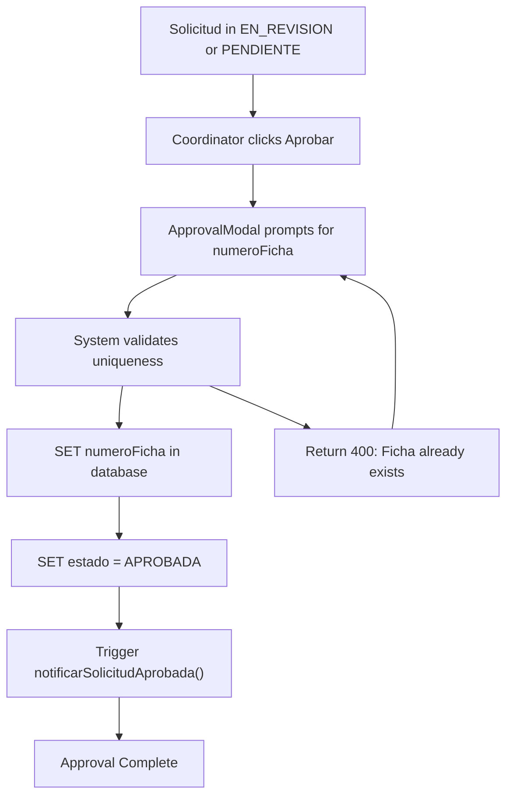
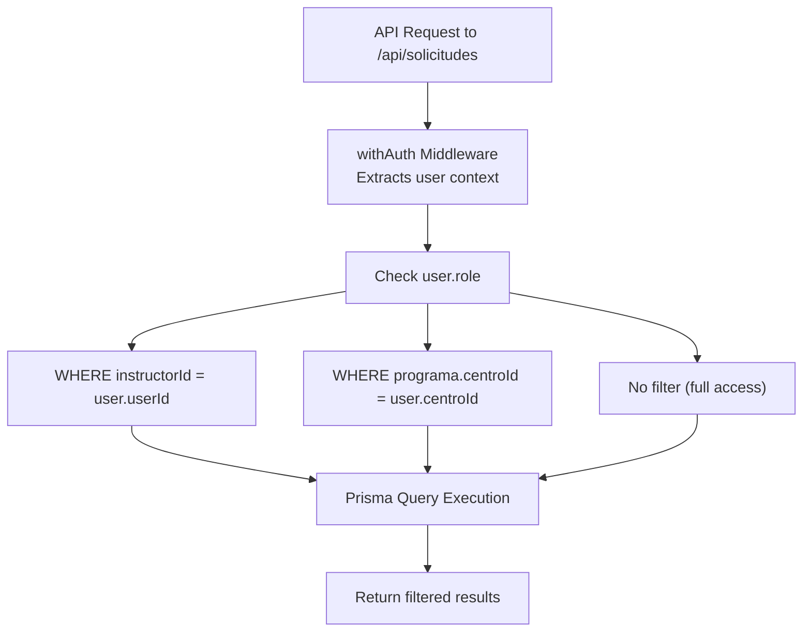

# Solicitud Lifecycle

> **Relevant source files**
> * [app/api/solicitudes/route.ts](https://github.com/axchisan/gestionComplementarias/blob/a3d2dcb4/app/api/solicitudes/route.ts)
> * [components/solicitudes-pendientes.tsx](https://github.com/axchisan/gestionComplementarias/blob/a3d2dcb4/components/solicitudes-pendientes.tsx)
> * [prisma/schema.prisma](https://github.com/axchisan/gestionComplementarias/blob/a3d2dcb4/prisma/schema.prisma)

## Purpose and Scope

This document provides comprehensive technical documentation of the solicitud lifecycle state machine, covering all states from draft creation to final approval or rejection. The lifecycle governs the core business workflow of the SENA Gestión Complementarias system, defining state transitions, validation rules, notification triggers, and database tracking mechanisms.

For information about user-specific workflows within this lifecycle, see [Instructor Workflow](/axchisan/gestionComplementarias/4.3-instructor-workflow) and [Coordinator Workflow](/axchisan/gestionComplementarias/4.4-coordinator-workflow). For details about the notification system that supports state transitions, see [Notification System](/axchisan/gestionComplementarias/6.4-notification-system).

---

## State Definitions

The solicitud lifecycle is defined by the `EstadoSolicitud` enum in the database schema. Each state represents a distinct phase in the approval workflow with specific business rules and permissions.

### State Enumeration

| State | Description | User Badge Color | Editable | Visible To |
| --- | --- | --- | --- | --- |
| `BORRADOR` | Draft state, solicitud is being prepared | Gray | Yes (Instructor) | Instructor only |
| `PENDIENTE` | Submitted and awaiting coordinator review | Yellow | Limited | Instructor, Coordinators, Admins |
| `EN_REVISION` | Under active review by coordinator | Blue | No | Instructor, Coordinators, Admins |
| `APROBADA` | Approved and ficha number assigned | Green | No | All authenticated users |
| `RECHAZADA` | Rejected with comments | Red | No | Instructor, Coordinators, Admins |
| `CANCELADA` | Cancelled by instructor or system | Gray | No | All authenticated users |

**Sources:** [prisma/schema.prisma L254-L261](https://github.com/axchisan/gestionComplementarias/blob/a3d2dcb4/prisma/schema.prisma#L254-L261)

### State-Specific Data Fields

The `Solicitud` model tracks lifecycle metadata through dedicated timestamp and comment fields:

* **`fechaSolicitud`**: Timestamp when solicitud was created (set at creation)
* **`fechaRevision`**: Timestamp when coordinator starts review (set on EN_REVISION transition)
* **`fechaAprobacion`**: Timestamp when solicitud was approved (set on APROBADA transition)
* **`comentariosRevision`**: Coordinator feedback (populated on RECHAZADA or revision request)
* **`numeroFicha`**: Unique ficha identifier (generated only on APROBADA)

**Sources:** [prisma/schema.prisma L174-L188](https://github.com/axchisan/gestionComplementarias/blob/a3d2dcb4/prisma/schema.prisma#L174-L188)

---

## State Machine Diagram

```

```

**Diagram: Complete Solicitud State Machine**

This state machine shows all valid transitions between solicitud states, including the API endpoints responsible for each transition and the notification service methods triggered.

**Sources:** [prisma/schema.prisma L254-L261](https://github.com/axchisan/gestionComplementarias/blob/a3d2dcb4/prisma/schema.prisma#L254-L261)

 [app/api/solicitudes/route.ts L188](https://github.com/axchisan/gestionComplementarias/blob/a3d2dcb4/app/api/solicitudes/route.ts#L188-L188)

---

## State Transition Rules

### Draft to Pending (BORRADOR → PENDIENTE)

**Trigger**: Instructor submits completed solicitud

**API Endpoint**: `POST /api/solicitudes`

**Conditions**:

* `isDraft` field set to `false` in request body
* All required validation fields must be populated: * `cumpleRequisitos: true` * `autorizaUsoInfo: true` * `confirmaVeracidad: true`
* Program must exist and belong to instructor's center
* At least one `HorarioDetallado` entry must be provided

**Side Effects**:

1. Sets `estado = 'PENDIENTE'` in database
2. Sets `fechaSolicitud = now()`
3. Generates unique `codigo` format: `SOL-YYYY-NNN`
4. Notifies all coordinators in the program's center via `NotificationService.notificarNuevaSolicitud()`

**Code Implementation**:

```

```

**Sources:** [app/api/solicitudes/route.ts L73-L242](https://github.com/axchisan/gestionComplementarias/blob/a3d2dcb4/app/api/solicitudes/route.ts#L73-L242)

---

### Pending to Under Review (PENDIENTE → EN_REVISION)

**Trigger**: Coordinator explicitly marks solicitud as under review

**API Endpoint**: `PUT /api/solicitudes/[id]/status`

**Conditions**:

* User must have `COORDINADOR` or `ADMIN` role
* Program must belong to coordinator's center (data scoping)
* Current state must be `PENDIENTE`

**Side Effects**:

1. Sets `estado = 'EN_REVISION'`
2. Sets `fechaRevision = now()`
3. Notifies instructor of review start via `TipoNotificacion.SOLICITUD_REVISION`

**Business Rules**:

* If solicitud remains in `PENDIENTE` state for >7 days, UI flags as "urgent"
* Coordinators can review multiple solicitudes simultaneously

**Sources:** [components/solicitudes-pendientes.tsx L1-L366](https://github.com/axchisan/gestionComplementarias/blob/a3d2dcb4/components/solicitudes-pendientes.tsx#L1-L366)

---

### Under Review to Approved (EN_REVISION → APROBADA)

**Trigger**: Coordinator approves solicitud

**API Endpoint**: `POST /api/solicitudes/[id]/approve`

**Conditions**:

* User must have `COORDINADOR` or `ADMIN` role
* Current state must be `EN_REVISION` or `PENDIENTE`
* Coordinator must provide `numeroFicha` parameter (unique ficha identifier)

**Side Effects**:

1. Sets `estado = 'APROBADA'`
2. Sets `fechaAprobacion = now()`
3. Assigns unique `numeroFicha` (provided by coordinator)
4. Optionally records approval comments in `comentariosRevision`
5. Notifies instructor via `NotificationService.notificarSolicitudAprobada()`
6. Enables PDF and Excel export functionality

**Approval Flow**:

```mermaid
sequenceDiagram
  participant Coordinator (UI)
  participant ApprovalModal Component
  participant /api/solicitudes/[id]/approve
  participant Prisma (Solicitud)
  participant NotificationService
  participant Instructor (Notified)

  Coordinator (UI)->>ApprovalModal Component: "Click Aprobar button"
  ApprovalModal Component->>ApprovalModal Component: "Prompt for numeroFicha"
  Coordinator (UI)->>ApprovalModal Component: "Enter numeroFicha + optional comments"
  ApprovalModal Component->>/api/solicitudes/[id]/approve: "POST {numeroFicha, comentarios}"
  /api/solicitudes/[id]/approve->>/api/solicitudes/[id]/approve: "Verify COORDINADOR role"
  /api/solicitudes/[id]/approve->>/api/solicitudes/[id]/approve: "Verify centro ownership"
  /api/solicitudes/[id]/approve->>Prisma (Solicitud): "UPDATE solicitud SET
  /api/solicitudes/[id]/approve->>NotificationService: estado='APROBADA',
  NotificationService->>Prisma (Solicitud): numeroFicha=input,
  NotificationService-->>Instructor (Notified): fechaAprobacion=now()"
  /api/solicitudes/[id]/approve-->>ApprovalModal Component: "notificarSolicitudAprobada(solicitudId, instructorId)"
  ApprovalModal Component->>Coordinator (UI): "INSERT INTO notificaciones
```

**Diagram: Approval Workflow Sequence**

**Sources:** [components/solicitudes-pendientes.tsx L93-L109](https://github.com/axchisan/gestionComplementarias/blob/a3d2dcb4/components/solicitudes-pendientes.tsx#L93-L109)

---

### Under Review to Rejected (EN_REVISION → RECHAZADA)

**Trigger**: Coordinator rejects solicitud

**API Endpoint**: `POST /api/solicitudes/[id]/reject`

**Conditions**:

* User must have `COORDINADOR` or `ADMIN` role
* Current state must be `EN_REVISION` or `PENDIENTE`
* `comentarios` field (rejection reason) is **required**

**Side Effects**:

1. Sets `estado = 'RECHAZADA'`
2. Populates `comentariosRevision` with rejection reason
3. Sets `fechaRevision = now()`
4. Notifies instructor via `NotificationService.notificarSolicitudRechazada()`

**Business Rules**:

* Rejected solicitudes can be revised by instructor and resubmitted
* Previous `comentariosRevision` should be preserved in revision history
* Instructor must address rejection comments before resubmission

**Sources:** [components/solicitudes-pendientes.tsx L111-L127](https://github.com/axchisan/gestionComplementarias/blob/a3d2dcb4/components/solicitudes-pendientes.tsx#L111-L127)

---

### Rejected to Draft (RECHAZADA → BORRADOR)

**Trigger**: Instructor revises and prepares to resubmit

**API Endpoint**: `PUT /api/solicitudes/[id]`

**Conditions**:

* User must be the original instructor (`instructorId === user.userId`)
* Current state must be `RECHAZADA`
* Instructor must update at least one field

**Side Effects**:

1. Sets `estado = 'BORRADOR'`
2. Clears `fechaAprobacion` and `fechaRevision`
3. Preserves original `comentariosRevision` for reference
4. Allows editing of all solicitud fields

**Workflow Note**: After revision, instructor must resubmit (BORRADOR → PENDIENTE) to re-enter the approval queue.

---

## Codigo Generation Strategy

Each solicitud receives a unique, human-readable identifier in the format `SOL-YYYY-NNN` where:

* `SOL` = Fixed prefix for "Solicitud"
* `YYYY` = Current year
* `NNN` = Sequential number padded to 3 digits (001, 002, etc.)

### Generation Algorithm

```

```

**Generation Timing**: The `codigo` is assigned at creation time regardless of state (BORRADOR or PENDIENTE), ensuring every solicitud has a unique tracking identifier.

**Sources:** [app/api/solicitudes/route.ts L104-L119](https://github.com/axchisan/gestionComplementarias/blob/a3d2dcb4/app/api/solicitudes/route.ts#L104-L119)

---

## Numero Ficha Generation

The `numeroFicha` field represents the official training program identifier assigned upon approval. Unlike `codigo`, this field is:

* **Optional** until approval
* **Unique** across the entire system
* **Manually provided** by the coordinator during approval
* **Immutable** after assignment

### Assignment Rules



**Diagram: Numero Ficha Assignment Flow**

**Database Constraint**: The `numeroFicha` field has a unique constraint in the schema, preventing duplicate assignments.

**Sources:** [prisma/schema.prisma L187](https://github.com/axchisan/gestionComplementarias/blob/a3d2dcb4/prisma/schema.prisma#L187-L187)

---

## Notification Integration

State transitions automatically trigger notifications to relevant users through the `NotificationService`. Each transition has specific notification types defined in the `TipoNotificacion` enum.

### Notification Type Mapping

| State Transition | Notification Type | Recipients | Trigger Method |
| --- | --- | --- | --- |
| BORRADOR → PENDIENTE | `NUEVA_SOLICITUD` | All coordinators in program's center | `notificarNuevaSolicitud()` |
| PENDIENTE → EN_REVISION | `SOLICITUD_REVISION` | Original instructor | `notificarRevisionIniciada()` |
| EN_REVISION → APROBADA | `SOLICITUD_APROBADA` | Original instructor | `notificarSolicitudAprobada()` |
| EN_REVISION → RECHAZADA | `SOLICITUD_RECHAZADA` | Original instructor | `notificarSolicitudRechazada()` |
| APROBADA → (ficha assigned) | `ASIGNACION_FICHA` | Original instructor | Triggered with approval |

### Notification Service Integration

```

```

**Error Handling**: Notification failures do **not** rollback the state transition. The system logs errors but allows the solicitud to proceed to maintain data consistency.

**Sources:** [app/api/solicitudes/route.ts L213-L229](https://github.com/axchisan/gestionComplementarias/blob/a3d2dcb4/app/api/solicitudes/route.ts#L213-L229)

 [prisma/schema.prisma L273-L281](https://github.com/axchisan/gestionComplementarias/blob/a3d2dcb4/prisma/schema.prisma#L273-L281)

---

## Data Scoping and Authorization

Access to solicitudes at each lifecycle stage is governed by role-based filtering enforced at the API layer.

### Role-Based Query Filters



**Diagram: Role-Based Data Filtering Flow**

### Implementation

```

```

**Authorization for State Changes**:

* Only `INSTRUCTOR` role can create solicitudes (BORRADOR)
* Only `COORDINADOR` and `ADMIN` can approve/reject (EN_REVISION → APROBADA/RECHAZADA)
* State change endpoints verify ownership through the same scoping rules

**Sources:** [app/api/solicitudes/route.ts L6-L71](https://github.com/axchisan/gestionComplementarias/blob/a3d2dcb4/app/api/solicitudes/route.ts#L6-L71)

---

## Validation Requirements by State

Different fields are validated based on the target state during creation or update.

### Draft (BORRADOR) Validation

**Minimum Required Fields**:

* `programaId` (must exist and belong to instructor's center)
* `responsableNombre`, `responsableCedula`, `responsableEmail`
* `codigoPrograma`, `duracionMaxima`, `cupoMaximo`

**Optional Fields**: All other fields can be saved incrementally

**Business Logic**: Drafts do **not** trigger notifications or validation checks for completeness

---

### Pending (PENDIENTE) Validation

**All BORRADOR fields plus**:

* `fechaInicioCurso`, `fechaFinalizacionCurso`
* `inicioInscripcion`, `finalizacionInscripcion`
* `justificacion` (required, min 50 characters)
* At least one `HorarioDetallado` entry
* `cumpleRequisitos = true`
* `autorizaUsoInfo = true`
* `confirmaVeracidad = true`

**Validation Enforcement**: These checks are performed client-side before submission and should be enforced server-side in the API

**Sources:** [prisma/schema.prisma L170-L173](https://github.com/axchisan/gestionComplementarias/blob/a3d2dcb4/prisma/schema.prisma#L170-L173)

---

### Approval (APROBADA) Requirements

**Coordinator must provide**:

* `numeroFicha` (unique, manually entered)
* Optional `comentariosRevision` for approval notes

**System automatically sets**:

* `fechaAprobacion`
* `estado = 'APROBADA'`

---

## UI State Indicators

The user interface provides visual feedback for each lifecycle state through the `Badge` component.

### Badge Component Mapping

| Estado | CSS Classes | Icon | Text |
| --- | --- | --- | --- |
| `BORRADOR` | `bg-gray-100 text-gray-800` | None | "Borrador" |
| `PENDIENTE` | `bg-yellow-100 text-yellow-800` | `Clock` | "Pendiente" |
| `EN_REVISION` | `bg-blue-100 text-blue-800` | `Clock` | "En Revisión" |
| `APROBADA` | `bg-green-100 text-green-800` | `CheckCircle` | "Aprobada" |
| `RECHAZADA` | `bg-red-100 text-red-800` | `XCircle` | "Rechazada" |

### Implementation Example

```

```

**Sources:** [components/solicitudes-pendientes.tsx L129-L148](https://github.com/axchisan/gestionComplementarias/blob/a3d2dcb4/components/solicitudes-pendientes.tsx#L129-L148)

---

## Business Rules and Edge Cases

### 7-Day Urgency Rule

**Rule**: Solicitudes in `PENDIENTE` state for more than 7 days are flagged as urgent in the coordinator dashboard.

**Implementation**: Client-side calculation comparing `fechaSolicitud` with current date

**UI Effect**: Urgent solicitudes display a red indicator or are sorted to the top of the pending list

---

### Concurrent Approval Prevention

**Rule**: Multiple coordinators can view the same solicitud simultaneously, but only one can approve it.

**Implementation**: The first successful `POST /api/solicitudes/[id]/approve` sets `numeroFicha`, subsequent attempts receive a 400 error if the ficha number is already assigned or state has changed.

**Database Constraint**: Unique constraint on `numeroFicha` prevents duplicates

---

### Deleted Program Handling

**Rule**: If a program is soft-deleted (`isActive = false`), existing solicitudes remain accessible but new solicitudes cannot reference it.

**Implementation**:

* Query in route.ts filters by `programa.isActive = true`
* Existing solicitudes maintain their relationship through foreign key

---

### State Rollback Restrictions

**Rule**: Once a solicitud reaches `APROBADA` state, it cannot be rolled back to any previous state (immutable approval).

**Rationale**: The generated `numeroFicha` represents a contractual commitment and should not be revoked programmatically.

**Exception**: Admins may manually update the database in extraordinary circumstances

---

## Export Capabilities by State

Solicitudes can be exported to PDF and Excel formats, with availability depending on lifecycle state.

### Export Availability Matrix

| Estado | PDF Export | Excel Export | Notes |
| --- | --- | --- | --- |
| `BORRADOR` | ❌ | ❌ | Not yet submitted |
| `PENDIENTE` | ✅ (limited) | ❌ | Preview only |
| `EN_REVISION` | ✅ (limited) | ❌ | Preview only |
| `APROBADA` | ✅ (full) | ✅ (full) | Complete with numeroFicha |
| `RECHAZADA` | ✅ (read-only) | ❌ | Historical record |

**Full Export Features** (APROBADA only):

* Includes `numeroFicha` on all documents
* Includes approval signatures and dates
* Meets official SENA format requirements
* Can be used for official record-keeping

**API Endpoint**: `GET /api/solicitudes/[id]/export` (format specified in query param)

**Sources:** [High-level Diagram 3](https://github.com/axchisan/gestionComplementarias/blob/a3d2dcb4/High-level Diagram 3)

 (state machine notes on export)

---

## Database Transaction Guarantees

All state transitions are performed within database transactions to ensure data consistency.

### Prisma Transaction Usage

State changes that involve multiple operations (e.g., updating solicitud + creating notification) use Prisma's implicit transaction behavior:

```

```

**Rollback Behavior**: If any operation in the transaction fails, all changes are rolled back, maintaining system consistency.

**Sources:** [prisma/schema.prisma L1-L282](https://github.com/axchisan/gestionComplementarias/blob/a3d2dcb4/prisma/schema.prisma#L1-L282)