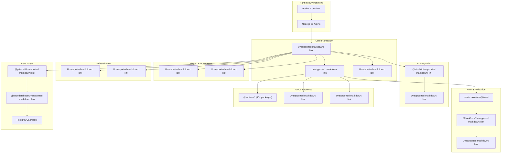
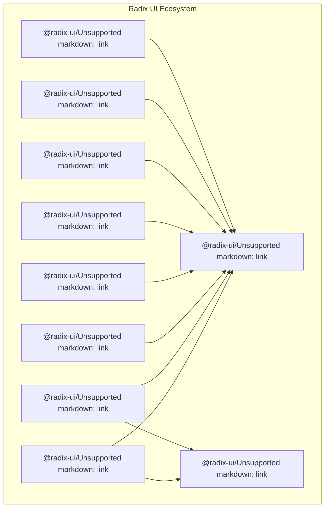
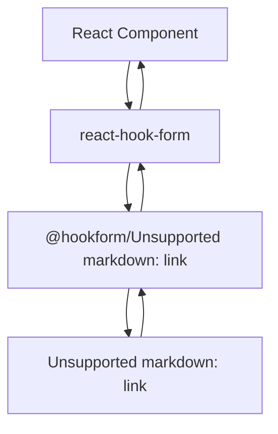
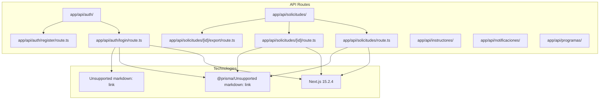
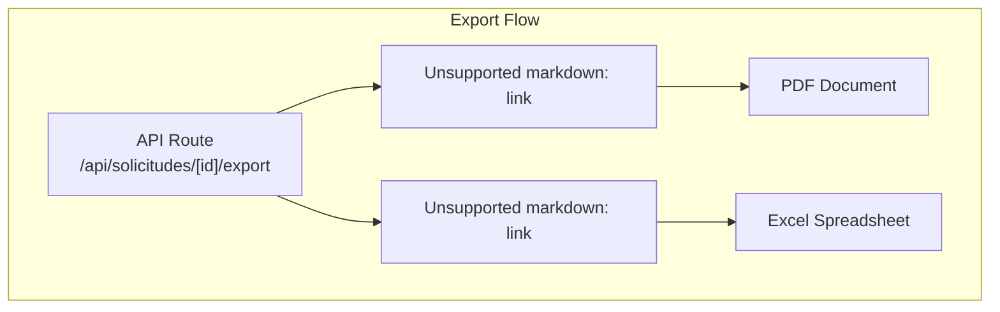
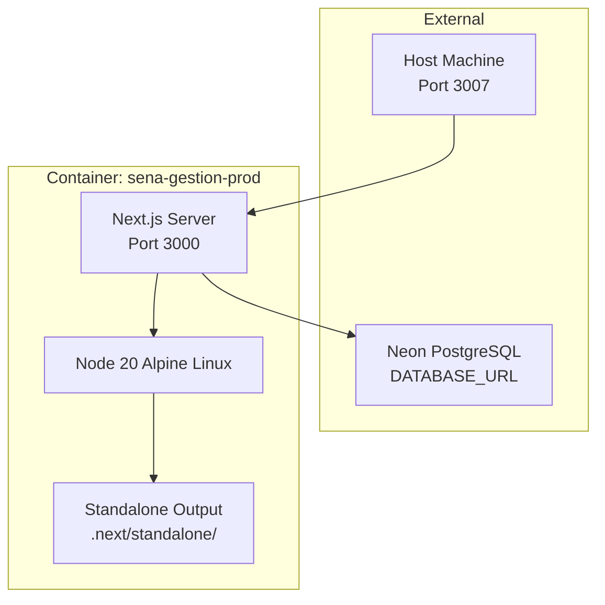

# Technology Stack

> **Relevant source files**
> * [next.config.mjs](https://github.com/axchisan/gestionComplementarias/blob/a3d2dcb4/next.config.mjs)
> * [package-lock.json](https://github.com/axchisan/gestionComplementarias/blob/a3d2dcb4/package-lock.json)
> * [package.json](https://github.com/axchisan/gestionComplementarias/blob/a3d2dcb4/package.json)

This document provides a comprehensive inventory of the technologies, frameworks, libraries, and tools used in the SENA Gestión Complementarias system. It covers all layers from the frontend UI components to the database driver, including build tools, authentication libraries, and deployment infrastructure. For information about how these technologies are configured for deployment, see [Deployment Architecture](/axchisan/gestionComplementarias/3.1-deployment-architecture). For database-specific technical details including schema and ORM usage, see [Data Model](/axchisan/gestionComplementarias/3.3-data-model).

## Technology Overview

The application is built as a full-stack TypeScript monolith using Next.js 15.2.4, which handles both server-side rendering and API endpoints. The technology stack is organized into distinct layers with clear separation of concerns:



**Sources:** [package.json L1-L96](https://github.com/axchisan/gestionComplementarias/blob/a3d2dcb4/package.json#L1-L96)

## Core Framework Layer

### Next.js 15.2.4

The application uses Next.js 15.2.4 as its primary framework, configured with the following settings:

| Configuration | Value | Purpose |
| --- | --- | --- |
| `output` | `'standalone'` | Self-contained deployment bundle |
| `outputFileTracingRoot` | `process.cwd()` | Trace all dependencies for Docker |
| `eslint.ignoreDuringBuilds` | `true` | Skip linting in production builds |
| `typescript.ignoreBuildErrors` | `true` | Skip type checking in builds |
| `images.unoptimized` | `true` | Disable image optimization |

The framework provides:

* **App Router**: File-system based routing under `app/` directory
* **Server Components**: Default server-side rendering for React components
* **API Routes**: RESTful endpoints under `app/api/`
* **Middleware**: Request interceptors via `middleware.ts`
* **Static Site Generation**: Pre-rendered pages for public routes

**Sources:** [next.config.mjs L1-L49](https://github.com/axchisan/gestionComplementarias/blob/a3d2dcb4/next.config.mjs#L1-L49)

 [package.json L58](https://github.com/axchisan/gestionComplementarias/blob/a3d2dcb4/package.json#L58-L58)

### React 18.3.1

React serves as the UI library with the following ecosystem packages:

* `react@18.3.1`: Core library with hooks, context, and component lifecycle
* `react-dom@18.3.1`: DOM rendering and hydration
* Server Components support enabled by Next.js integration

**Sources:** [package.json L60-L62](https://github.com/axchisan/gestionComplementarias/blob/a3d2dcb4/package.json#L60-L62)

## Frontend Stack

### UI Component Library: Radix UI

The application uses Radix UI primitives for accessible, unstyled components. All 40+ packages are pinned to specific versions:



Key component packages:

| Package | Version | Usage |
| --- | --- | --- |
| `@radix-ui/react-dialog` | 1.1.1 | Modal dialogs for forms |
| `@radix-ui/react-dropdown-menu` | 2.1.1 | User navigation menus |
| `@radix-ui/react-select` | 2.1.1 | Form select inputs |
| `@radix-ui/react-toast` | 1.2.1 | Notification system |
| `@radix-ui/react-tabs` | 1.1.0 | Dashboard tab navigation |
| `@radix-ui/react-checkbox` | 1.1.1 | Form checkboxes |
| `@radix-ui/react-label` | 2.1.0 | Accessible form labels |
| `@radix-ui/react-accordion` | 1.2.0 | Collapsible sections |

**Sources:** [package.json L20-L46](https://github.com/axchisan/gestionComplementarias/blob/a3d2dcb4/package.json#L20-L46)

### Styling System

The styling stack combines Tailwind CSS with utility libraries:

| Package | Version | Purpose |
| --- | --- | --- |
| `tailwindcss` | 3.4.17 | Utility-first CSS framework |
| `autoprefixer` | 10.4.20 | CSS vendor prefix automation |
| `postcss` | ^8 | CSS transformation pipeline |
| `tailwind-merge` | 2.5.2 | Conditional class merging (`cn()` utility) |
| `tailwindcss-animate` | 1.0.7 | Animation utilities |
| `class-variance-authority` | 0.7.0 | Component variant management |

Tailwind configuration includes custom theming variables defined in `app/globals.css` and processed through PostCSS.

**Sources:** [package.json L47-L91](https://github.com/axchisan/gestionComplementarias/blob/a3d2dcb4/package.json#L47-L91)

### Icon System

Icons are provided by Lucide React:

* `lucide-react@0.451.0`: SVG icon components with tree-shaking support
* Icons used extensively in navigation (e.g., `FileText`, `Users`, `Bell`, `Settings`)
* All icons are React components with consistent sizing and styling props

**Sources:** [package.json L57](https://github.com/axchisan/gestionComplementarias/blob/a3d2dcb4/package.json#L57-L57)

### Form Management

Form handling uses a three-layer validation architecture:



| Package | Version | Responsibility |
| --- | --- | --- |
| `react-hook-form` | latest | Form state management, field registration, submission handling |
| `@hookform/resolvers` | 3.10.0 | Bridge between react-hook-form and validation libraries |
| `zod` | 3.23.8 | Type-safe schema validation, runtime type checking |

Validation schemas are typically defined in the same file as the form component using `z.object()` and integrated via `zodResolver()`.

**Sources:** [package.json L19-L71](https://github.com/axchisan/gestionComplementarias/blob/a3d2dcb4/package.json#L19-L71)

### State Management

The application uses React's built-in state management:

* **useState**: Local component state
* **useContext**: Global auth state via `AuthContext`
* **Server State**: Fetched from API routes without client-side caching

No external state management library (Redux, Zustand, etc.) is used.

### Additional UI Libraries

| Package | Version | Purpose |
| --- | --- | --- |
| `next-themes` | 0.3.0 | Dark/light mode theming |
| `sonner` | 1.5.0 | Toast notifications |
| `react-hot-toast` | latest | Alternative toast system |
| `cmdk` | 1.0.0 | Command palette/search |
| `embla-carousel-react` | 8.3.0 | Carousel components |
| `react-day-picker` | 9.0.8 | Date picker for forms |
| `recharts` | 2.12.7 | Dashboard charts |
| `geist` | 1.3.1 | Vercel's font family |
| `date-fns` | latest | Date manipulation utilities |

**Sources:** [package.json L52-L67](https://github.com/axchisan/gestionComplementarias/blob/a3d2dcb4/package.json#L52-L67)

## Backend Stack

### API Route Architecture

Next.js API routes are defined under `app/api/` with the following structure:



Each route file exports HTTP method handlers (`GET`, `POST`, `PUT`, `DELETE`) as named functions.

**Sources:** Based on typical Next.js 15 App Router structure

### Authentication Libraries

| Package | Version | Purpose |
| --- | --- | --- |
| `jsonwebtoken` | 9.0.2 | JWT token generation and verification |
| `bcryptjs` | 2.4.3 | Password hashing with salt rounds |
| `@types/jsonwebtoken` | 9.0.5 | TypeScript definitions for JWT |
| `@types/bcryptjs` | 2.4.6 | TypeScript definitions for bcrypt |

Authentication workflow:

1. Password hashing: `bcrypt.hash(password, 10)` during registration
2. Password verification: `bcrypt.compare(password, hashedPassword)` during login
3. Token generation: `jwt.sign({ userId, role, centroId }, JWT_SECRET)`
4. Token verification: `jwt.verify(token, JWT_SECRET)` in middleware

**Sources:** [package.json L73-L83](https://github.com/axchisan/gestionComplementarias/blob/a3d2dcb4/package.json#L73-L83)

### HTTP Client

* `axios@latest`: Used for making HTTP requests from client components to API routes
* Configured with base URL and interceptors for authorization headers

**Sources:** [package.json L49](https://github.com/axchisan/gestionComplementarias/blob/a3d2dcb4/package.json#L49-L49)

## Data Access Layer

### Prisma ORM

The data layer uses Prisma with the following configuration:

| Package | Version | Environment |
| --- | --- | --- |
| `@prisma/client` | 5.22.0 | Runtime (production) |
| `prisma` | 5.7.1 | Dev tools (CLI) |

Prisma provides:

* **Type-safe client**: Generated from `prisma/schema.prisma`
* **Query builder**: Fluent API for database operations
* **Migration system**: Version-controlled schema changes
* **Seeding**: Initial data population via `scripts/seed.ts`

**Schema location**: `prisma/schema.prisma` defines 7 models and 5 enums.

**Client generation**: Run via `npm run db:generate` which executes `prisma generate`

**Database operations**: All queries use the generated `PrismaClient` instance:

```javascript
import { PrismaClient } from '@prisma/client'
const prisma = new PrismaClient()
```

**Sources:** [package.json L10-L90](https://github.com/axchisan/gestionComplementarias/blob/a3d2dcb4/package.json#L10-L90)

### Database Driver

| Package | Version | Purpose |
| --- | --- | --- |
| `@neondatabase/serverless` | 0.10.4 | Serverless PostgreSQL driver for Neon |

This driver enables:

* Connection pooling for serverless environments
* Edge runtime compatibility
* WebSocket-based connections to Neon database
* Automatic connection management

The driver is used by Prisma via the `DATABASE_URL` environment variable configured with `postgresql://` protocol.

**Sources:** [package.json L76](https://github.com/axchisan/gestionComplementarias/blob/a3d2dcb4/package.json#L76-L76)

## Document Generation

The application generates PDF and Excel documents using the following libraries:



| Package | Version | Use Case |
| --- | --- | --- |
| `jspdf` | 2.5.2 | Generate PDF reports for approved solicitudes with formatting |
| `xlsx` | 0.18.5 | Generate Excel exports for data analysis and record-keeping |

Both libraries operate on the server-side within API routes, processing solicitud data fetched via Prisma and returning binary file streams to the client.

**Sources:** [package.json L78-L79](https://github.com/axchisan/gestionComplementarias/blob/a3d2dcb4/package.json#L78-L79)

## AI Integration (Optional)

Optional AI capabilities are provided by:

| Package | Version | Purpose |
| --- | --- | --- |
| `@ai-sdk/openai` | 0.0.66 | OpenAI provider for Vercel AI SDK |
| `ai` | 3.4.32 | Vercel AI SDK core library |

These packages enable:

* AI-assisted form completion
* Content generation for justification fields
* Optional enhancement features without blocking core functionality

The integration is conditional based on environment variable configuration.

**Sources:** [package.json L75-L77](https://github.com/axchisan/gestionComplementarias/blob/a3d2dcb4/package.json#L75-L77)

## Development Tools

### TypeScript Configuration

| Package | Version | Purpose |
| --- | --- | --- |
| `typescript` | ^5 | TypeScript compiler and language server |
| `@types/node` | ^22 | Node.js type definitions |
| `@types/react` | 18.0.12 | React type definitions |
| `@types/react-dom` | ^18 | React DOM type definitions |

TypeScript is configured via `tsconfig.json` with strict mode enabled.

**Sources:** [package.json L84-L93](https://github.com/axchisan/gestionComplementarias/blob/a3d2dcb4/package.json#L84-L93)

### Build Tools

| Tool | Version | Purpose |
| --- | --- | --- |
| `tsx` | 4.6.2 | TypeScript execution for scripts (e.g., seeding) |
| `eslint` | ^8 | Code linting |
| `eslint-config-next` | 14.0.4 | Next.js ESLint configuration |

**Sources:** [package.json L87-L92](https://github.com/axchisan/gestionComplementarias/blob/a3d2dcb4/package.json#L87-L92)

### Additional Development Dependencies

* `vaul@1.0.2`: Drawer component library (dev dependency)
* `postcss@^8`: Required by Tailwind CSS

**Sources:** [package.json L89-L94](https://github.com/axchisan/gestionComplementarias/blob/a3d2dcb4/package.json#L89-L94)

## Runtime Environment

The application runs in a Docker container with the following stack:



**Runtime specifications:**

* **Base Image**: `node:20-alpine`
* **Node Version**: 20.x LTS
* **Build Mode**: Multi-stage Docker build
* **Output Mode**: Next.js standalone mode
* **Port Mapping**: Host 3007 → Container 3000

**Environment Variables Required:**

* `DATABASE_URL`: PostgreSQL connection string
* `JWT_SECRET`: Token signing secret
* `NEXTAUTH_SECRET`: NextAuth session secret
* `NEXTAUTH_URL`: Application base URL
* `OPENAI_API_KEY` (optional): AI integration

**Sources:** [next.config.mjs L3](https://github.com/axchisan/gestionComplementarias/blob/a3d2dcb4/next.config.mjs#L3-L3)

 High-level architecture diagrams

## Analytics

* `@vercel/analytics@1.3.1`: Vercel Analytics integration for usage tracking

**Sources:** [package.json L47](https://github.com/axchisan/gestionComplementarias/blob/a3d2dcb4/package.json#L47-L47)

## Version Matrix

The following table summarizes all production dependencies with their exact versions:

| Category | Package | Version |
| --- | --- | --- |
| **Framework** | next | 15.2.4 |
|  | react | 18.3.1 |
|  | react-dom | 18.3.1 |
| **Data** | @prisma/client | 5.22.0 |
|  | @neondatabase/serverless | 0.10.4 |
| **Auth** | jsonwebtoken | 9.0.2 |
|  | bcryptjs | 2.4.3 |
| **UI Core** | tailwindcss | 3.4.17 |
|  | lucide-react | 0.451.0 |
|  | @radix-ui/* | 1.0.0 - 2.2.1 |
| **Forms** | react-hook-form | latest |
|  | zod | 3.23.8 |
|  | @hookform/resolvers | 3.10.0 |
| **Export** | jspdf | 2.5.2 |
|  | xlsx | 0.18.5 |
| **AI** | @ai-sdk/openai | 0.0.66 |
|  | ai | 3.4.32 |

All packages marked "latest" are resolved to their latest stable version at installation time via `npm install`.

**Sources:** [package.json L18-L79](https://github.com/axchisan/gestionComplementarias/blob/a3d2dcb4/package.json#L18-L79)