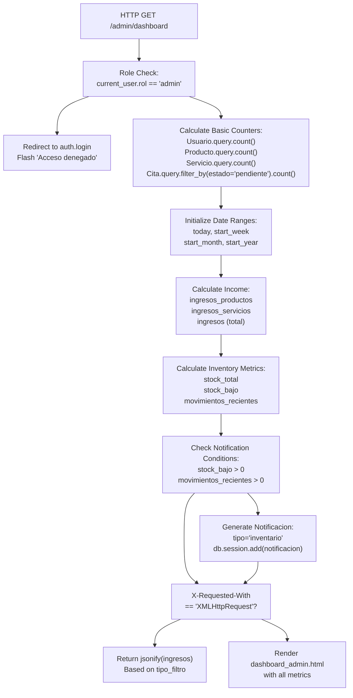
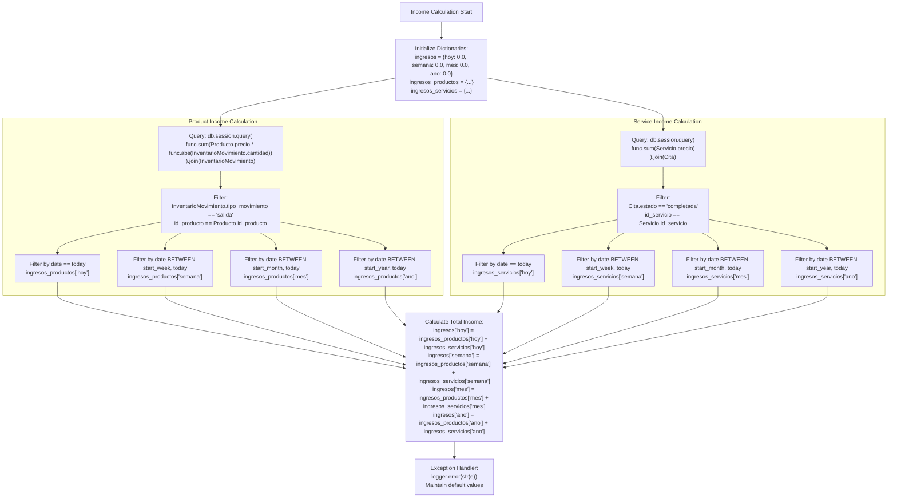
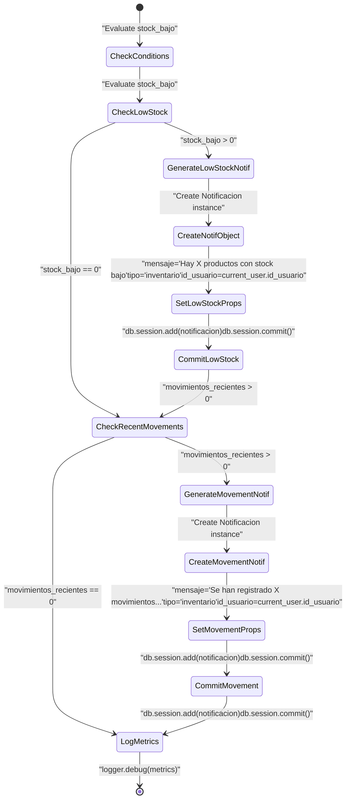
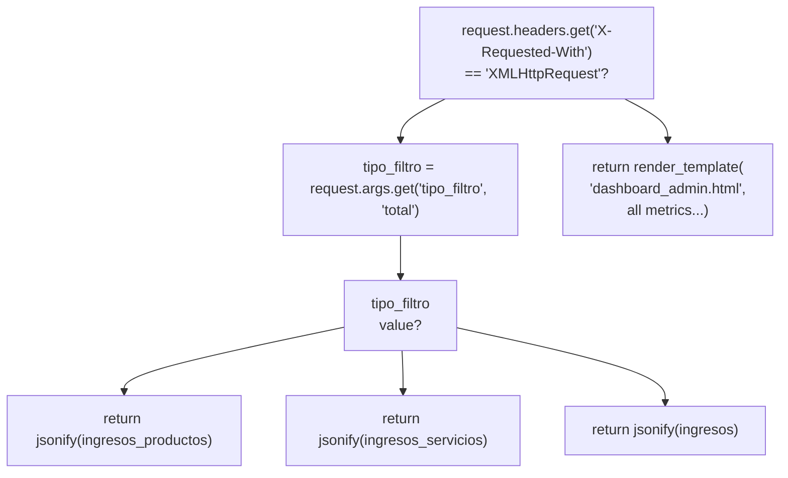

# Admin Dashboard & Analytics

> **Relevant source files**
> * [app/routes/admin.py](https://github.com/GroveLive/CasaBella/blob/5f618972/app/routes/admin.py)
> * [app/templates/dashboard_admin.html](https://github.com/GroveLive/CasaBella/blob/5f618972/app/templates/dashboard_admin.html)

## Purpose & Scope

This page documents the administrative dashboard and analytics system in Casa Bella. The dashboard provides real-time business metrics, income tracking, inventory monitoring, and automated notifications for administrators. It serves as the central control panel for business intelligence and operational oversight.

For user management functionality, see [User Management](/GroveLive/CasaBella/6.2-user-management). For detailed inventory management, see [Product & Service Management](/GroveLive/CasaBella/6.3-product-and-service-management). For appointment coordination, see [Appointment Management](/GroveLive/CasaBella/6.4-appointment-management).

---

## Overview

The admin dashboard is implemented through the `/admin/dashboard` route in the `admin` blueprint. It aggregates data from multiple database models to provide:

* **Basic Counters**: Total users, products, services, and pending appointments
* **Income Analytics**: Revenue calculations segmented by time periods (today, week, month, year) and type (products, services, total)
* **Inventory Metrics**: Total stock, low stock alerts, recent inventory movements
* **Automated Notifications**: System-generated alerts for low stock and high activity
* **Visual Analytics**: Chart.js-based income visualization with AJAX refresh

**Sources**: [app/routes/admin.py L28-L154](https://github.com/GroveLive/CasaBella/blob/5f618972/app/routes/admin.py#L28-L154)

---

## Dashboard Route Structure

The main dashboard route handler performs role validation, calculates multiple metric categories, generates notifications, and supports both full-page rendering and AJAX responses for dynamic chart updates.

### Route Handler Architecture



**Sources**: [app/routes/admin.py L28-L154](https://github.com/GroveLive/CasaBella/blob/5f618972/app/routes/admin.py#L28-L154)

---

## Metric Calculation System

### Basic Counters

The dashboard calculates four primary counters using simple SQLAlchemy queries:

| Metric | Query | Variable |
| --- | --- | --- |
| Total Users | `Usuario.query.count()` | `usuarios_count` |
| Total Products | `Producto.query.count()` | `productos_count` |
| Total Services | `Servicio.query.count()` | `servicios_count` |
| Pending Appointments | `Cita.query.filter_by(estado='pendiente').count()` | `citas_pendientes_count` |

**Sources**: [app/routes/admin.py L35-L39](https://github.com/GroveLive/CasaBella/blob/5f618972/app/routes/admin.py#L35-L39)

### Date Range Initialization

Time-based analytics use consistent date range calculations:

```markdown
today = datetime.now().date()
start_week = today - timedelta(days=today.weekday())  # Monday
start_month = today.replace(day=1)
start_year = today.replace(month=1, day=1)
```

**Sources**: [app/routes/admin.py L41-L45](https://github.com/GroveLive/CasaBella/blob/5f618972/app/routes/admin.py#L41-L45)

---

## Income Analytics

Income calculations aggregate data from two sources: product sales (tracked via `InventarioMovimiento`) and completed service appointments (tracked via `Cita`).

### Income Calculation Flow



**Sources**: [app/routes/admin.py L47-L104](https://github.com/GroveLive/CasaBella/blob/5f618972/app/routes/admin.py#L47-L104)

 [app/routes/admin.py L129-L131](https://github.com/GroveLive/CasaBella/blob/5f618972/app/routes/admin.py#L129-L131)

### Product Income Query Structure

Product income is calculated by joining `Producto` and `InventarioMovimiento`, filtering for 'salida' (outbound) movements:

```sql
SELECT SUM(Producto.precio * ABS(InventarioMovimiento.cantidad))
FROM Producto
JOIN InventarioMovimiento ON InventarioMovimiento.id_producto = Producto.id_producto
WHERE InventarioMovimiento.tipo_movimiento = 'salida'
  AND DATE(InventarioMovimiento.fecha_movimiento) BETWEEN ? AND ?
```

**Sources**: [app/routes/admin.py L61-L77](https://github.com/GroveLive/CasaBella/blob/5f618972/app/routes/admin.py#L61-L77)

### Service Income Query Structure

Service income is calculated by joining `Servicio` and `Cita`, filtering for 'completada' (completed) appointments:

```sql
SELECT SUM(Servicio.precio)
FROM Servicio
JOIN Cita ON Cita.id_servicio = Servicio.id_servicio
WHERE Cita.estado = 'completada'
  AND DATE(Cita.fecha_hora) BETWEEN ? AND ?
```

**Sources**: [app/routes/admin.py L80-L96](https://github.com/GroveLive/CasaBella/blob/5f618972/app/routes/admin.py#L80-L96)

---

## Inventory Monitoring

The dashboard tracks three inventory-related metrics to enable proactive stock management.

### Inventory Metrics Calculation

| Metric | Calculation | Purpose |
| --- | --- | --- |
| `stock_total` | `Producto.query.with_entities(func.sum(Producto.stock)).scalar() or 0` | Total inventory units across all products |
| `stock_bajo` | `Producto.query.filter(Producto.stock <= Producto.stock_minimo).count()` | Count of products at or below minimum stock threshold |
| `movimientos_recientes` | `InventarioMovimiento.query.filter(fecha_movimiento >= datetime.now() - timedelta(days=7)).count()` | Inventory transactions in last 7 days |

**Sources**: [app/routes/admin.py L53-L57](https://github.com/GroveLive/CasaBella/blob/5f618972/app/routes/admin.py#L53-L57)

### Low Stock Detection Logic

Products trigger low stock alerts when `stock <= stock_minimo`. The system compares current stock levels against the `stock_minimo` field defined in the `Producto` model:

```sql
SELECT COUNT(*) FROM Producto WHERE stock <= stock_minimo
```

**Sources**: [app/routes/admin.py L54](https://github.com/GroveLive/CasaBella/blob/5f618972/app/routes/admin.py#L54-L54)

---

## Automated Notification System

The dashboard generates system notifications based on inventory conditions. Notifications are persisted in the `Notificacion` model and displayed to the admin user.

### Notification Trigger Flow



**Sources**: [app/routes/admin.py L106-L127](https://github.com/GroveLive/CasaBella/blob/5f618972/app/routes/admin.py#L106-L127)

### Notification Creation Logic

Low stock notification generation:

```
if stock_bajo > 0:
    notificacion = Notificacion(
        id_usuario=current_user.id_usuario,
        mensaje=f"Hay {stock_bajo} productos con stock bajo (menor o igual a stock mínimo).",
        tipo='inventario'
    )
    db.session.add(notificacion)
    db.session.commit()
```

Recent movement notification generation:

```
if movimientos_recientes > 0:
    notificacion = Notificacion(
        id_usuario=current_user.id_usuario,
        mensaje=f"Se han registrado {movimientos_recientes} movimientos de inventario en los últimos 7 días.",
        tipo='inventario'
    )
    db.session.add(notificacion)
    db.session.commit()
```

**Sources**: [app/routes/admin.py L107-L124](https://github.com/GroveLive/CasaBella/blob/5f618972/app/routes/admin.py#L107-L124)

---

## AJAX Response Handling

The dashboard route supports AJAX requests for dynamic chart updates without full page reload. The `tipo_filtro` query parameter determines which income dataset to return.

### AJAX Request Detection and Response



**Sources**: [app/routes/admin.py L133-L154](https://github.com/GroveLive/CasaBella/blob/5f618972/app/routes/admin.py#L133-L154)

### JSON Response Format

AJAX responses return income dictionaries in JSON format:

```json
{
    "hoy": 1234.56,
    "semana": 5678.90,
    "mes": 12345.67,
    "ano": 45678.90
}
```

**Sources**: [app/routes/admin.py L136-L140](https://github.com/GroveLive/CasaBella/blob/5f618972/app/routes/admin.py#L136-L140)

---

## Frontend Dashboard Template

The dashboard template renders metrics as cards and integrates Chart.js for income visualization.

### Dashboard Card Layout

The template organizes metrics into a responsive grid of cards:

| Card | Icon | Metric Variable | Color Class |
| --- | --- | --- | --- |
| Usuarios | `fa-users` | `usuarios_count` | `bg-gradient-primary` |
| Productos | `fa-box-open` | `productos_count` | `bg-gradient-success` |
| Servicios | `fa-concierge-bell` | `servicios_count` | `bg-gradient-info` |
| Citas Pendientes | `fa-calendar-check` | `citas_pendientes_count` | `bg-gradient-warning` |
| Stock Total | `fa-warehouse` | `stock_total` | `bg-gradient-secondary` |
| Stock Bajo | `fa-exclamation-triangle` | `stock_bajo` | `bg-gradient-danger` |
| Movimientos Recientes | `fa-truck-moving` | `movimientos_recientes` | `bg-gradient-dark` |

**Sources**: [app/templates/dashboard_admin.html L24-L88](https://github.com/GroveLive/CasaBella/blob/5f618972/app/templates/dashboard_admin.html#L24-L88)

### Chart.js Integration

The dashboard includes a Chart.js bar chart for income visualization. The chart is rendered in a canvas element with id `chartIngresos`.

```mermaid
sequenceDiagram
  participant dashboard_admin.html
  participant Chart Initialization Script
  participant fetch() API
  participant /admin/dashboard (AJAX)
  participant Chart.js Library

  dashboard_admin.html->>Chart Initialization Script: "Document loads"
  Chart Initialization Script->>Chart Initialization Script: "Call updateChart()"
  Chart Initialization Script->>fetch() API: "fetch('/admin/dashboard?tipo_filtro=productos')"
  fetch() API->>fetch() API: "Set header: X-Requested-With: XMLHttpRequest"
  fetch() API->>/admin/dashboard (AJAX): "GET request"
  /admin/dashboard (AJAX)->>/admin/dashboard (AJAX): "Detect AJAX request"
  /admin/dashboard (AJAX)->>/admin/dashboard (AJAX): "Calculate ingresos_productos"
  /admin/dashboard (AJAX)->>fetch() API: "JSON response: {hoy, semana, mes, ano}"
  fetch() API->>Chart Initialization Script: "response.json()"
  Chart Initialization Script->>Chart Initialization Script: "Build labels array: ['Hoy', 'Semana', 'Mes', 'Año']"
  Chart Initialization Script->>Chart Initialization Script: "Build datasets with data values"
  Chart Initialization Script->>Chart Initialization Script: "Destroy existing chartIngresos (if exists)"
  Chart Initialization Script->>Chart.js Library: "new Chart(ctx, config)"
  Chart.js Library->>dashboard_admin.html: "Render bar chart in canvas
```

**Sources**: [app/templates/dashboard_admin.html L122-L191](https://github.com/GroveLive/CasaBella/blob/5f618972/app/templates/dashboard_admin.html#L122-L191)

### Chart Configuration

The chart script implements:

* **Data Labels**: `['Hoy', 'Semana', 'Mes', 'Año']`
* **Dataset**: Single dataset with 4 data points from `ingresos_productos`
* **Colors**: RGBA color arrays for bars (blue, teal, yellow, purple)
* **Scales**: Y-axis begins at zero with title "Ingresos ($)"
* **Tooltips**: Currency formatting using `Intl.NumberFormat('es-MX', {currency: 'MXN'})`
* **Chart Destruction**: Existing chart instance destroyed before re-rendering to prevent memory leaks

**Sources**: [app/templates/dashboard_admin.html L136-L181](https://github.com/GroveLive/CasaBella/blob/5f618972/app/templates/dashboard_admin.html#L136-L181)

### Chart Update Function

```javascript
function updateChart() {
    const url = "{{ url_for('admin.admin_dashboard') }}?tipo_filtro=productos";
    fetch(url, { headers: { 'X-Requested-With': 'XMLHttpRequest' } })
        .then(response => response.json())
        .then(data => {
            const labels = ['Hoy', 'Semana', 'Mes', 'Año'];
            const datasets = [{
                label: 'Ingresos por Productos ($)',
                data: [data.hoy, data.semana, data.mes, data.ano],
                // ... colors and styling
            }];
            
            if (chartIngresos) {
                chartIngresos.destroy();
            }
            
            chartIngresos = new Chart(/* ... */);
        })
        .catch(error => {
            console.error('Error fetching chart data:', error);
        });
}
```

**Sources**: [app/templates/dashboard_admin.html L126-L187](https://github.com/GroveLive/CasaBella/blob/5f618972/app/templates/dashboard_admin.html#L126-L187)

---

## Error Handling

The dashboard implements multi-layer error handling to ensure graceful degradation:

### Income Calculation Error Handling

Income calculations are wrapped in try-except blocks that log errors and maintain default zero values:

```css
try:
    # Calculate ingresos_productos and ingresos_servicios
    # ...
except Exception as e:
    logger.error(f"Error al calcular ingresos o inventario: {str(e)}")
    # Maintain default values (all zeros)
```

**Sources**: [app/routes/admin.py L59-L131](https://github.com/GroveLive/CasaBella/blob/5f618972/app/routes/admin.py#L59-L131)

### Frontend Error Handling

The Chart.js fetch operation includes error handling that logs to console and displays user alerts:

```javascript
.catch(error => {
    console.error('Error fetching chart data:', error);
    alert('Error al cargar los datos de la gráfica. Consulta la consola para más detalles.');
});
```

**Sources**: [app/templates/dashboard_admin.html L183-L186](https://github.com/GroveLive/CasaBella/blob/5f618972/app/templates/dashboard_admin.html#L183-L186)

---

## Access Control

The dashboard enforces strict role-based access control. All dashboard routes verify that `current_user.rol == 'admin'`:

```python
@bp.route('/dashboard')
@login_required
def admin_dashboard():
    if current_user.rol != 'admin':
        flash("Acceso denegado. Solo para administradores.", "danger")
        return redirect(url_for('auth.login'))
```

This pattern is consistent across all admin routes, ensuring only authenticated admin users can access sensitive business metrics.

**Sources**: [app/routes/admin.py L28-L33](https://github.com/GroveLive/CasaBella/blob/5f618972/app/routes/admin.py#L28-L33)

---

## Database Models Referenced

The dashboard integrates data from multiple SQLAlchemy models:

| Model | Import | Usage |
| --- | --- | --- |
| `Usuario` | [app/routes/admin.py L3](https://github.com/GroveLive/CasaBella/blob/5f618972/app/routes/admin.py#L3-L3) | Count total users, get current_user info |
| `Producto` | [app/routes/admin.py L4](https://github.com/GroveLive/CasaBella/blob/5f618972/app/routes/admin.py#L4-L4) | Count products, calculate stock metrics, join for income |
| `Servicio` | [app/routes/admin.py L6](https://github.com/GroveLive/CasaBella/blob/5f618972/app/routes/admin.py#L6-L6) | Count services, join for service income |
| `Cita` | [app/routes/admin.py L7](https://github.com/GroveLive/CasaBella/blob/5f618972/app/routes/admin.py#L7-L7) | Count pending appointments, join for service income |
| `InventarioMovimiento` | [app/routes/admin.py L9](https://github.com/GroveLive/CasaBella/blob/5f618972/app/routes/admin.py#L9-L9) | Calculate product income, count recent movements |
| `Notificacion` | [app/routes/admin.py L11](https://github.com/GroveLive/CasaBella/blob/5f618972/app/routes/admin.py#L11-L11) | Create automated notifications |

**Sources**: [app/routes/admin.py L1-L11](https://github.com/GroveLive/CasaBella/blob/5f618972/app/routes/admin.py#L1-L11)

---

## Performance Considerations

### Query Optimization

The dashboard performs multiple database queries. Key optimization strategies:

1. **Aggregation at Database Level**: Uses `func.sum()` and `func.count()` for server-side aggregation
2. **Single Query per Metric**: Each income calculation uses one parameterized query with date filters
3. **No N+1 Queries**: All calculations use joins or aggregations without iterating over result sets
4. **Default Values**: Initializes dictionaries with zeros to handle NULL results from empty aggregations

**Sources**: [app/routes/admin.py L48-L104](https://github.com/GroveLive/CasaBella/blob/5f618972/app/routes/admin.py#L48-L104)

### Caching Opportunities

The current implementation recalculates all metrics on each request. Potential optimizations:

* Cache basic counters (users, products, services) for 5-10 minutes
* Cache income calculations for current day with shorter TTL
* Invalidate caches on relevant data modifications

---

## Logging

The dashboard implements structured logging for debugging and monitoring:

```css
logging.basicConfig(level=logging.DEBUG)
logger = logging.getLogger(__name__)

# Usage examples:
logger.debug(f"Ingresos calculados: {ingresos}")
logger.debug(f"Inventario - Stock total: {stock_total}, Stock bajo: {stock_bajo}, Movimientos recientes: {movimientos_recientes}")
logger.error(f"Error al calcular ingresos o inventario: {str(e)}")
```

**Sources**: [app/routes/admin.py L24-L26](https://github.com/GroveLive/CasaBella/blob/5f618972/app/routes/admin.py#L24-L26)

 [app/routes/admin.py L126-L130](https://github.com/GroveLive/CasaBella/blob/5f618972/app/routes/admin.py#L126-L130)

---

## Related Functionality

The dashboard provides navigation links to other admin management pages:

* **User Management**: Link to `url_for('admin.gestion_usuarios')` - see [User Management](/GroveLive/CasaBella/6.2-user-management)
* **Product Management**: Link to `url_for('admin.gestion_productos')` - see [Product & Service Management](/GroveLive/CasaBella/6.3-product-and-service-management)

**Sources**: [app/templates/dashboard_admin.html L89-L106](https://github.com/GroveLive/CasaBella/blob/5f618972/app/templates/dashboard_admin.html#L89-L106)