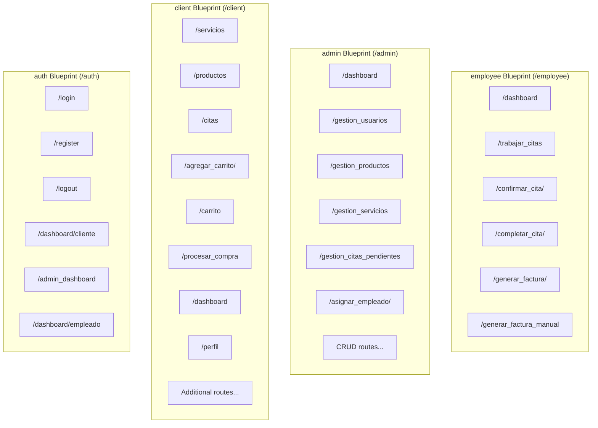
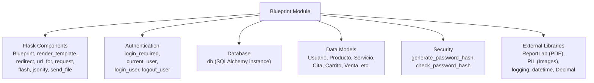
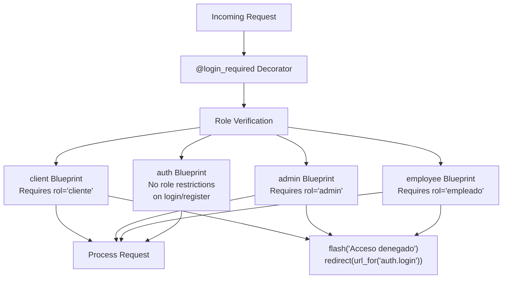
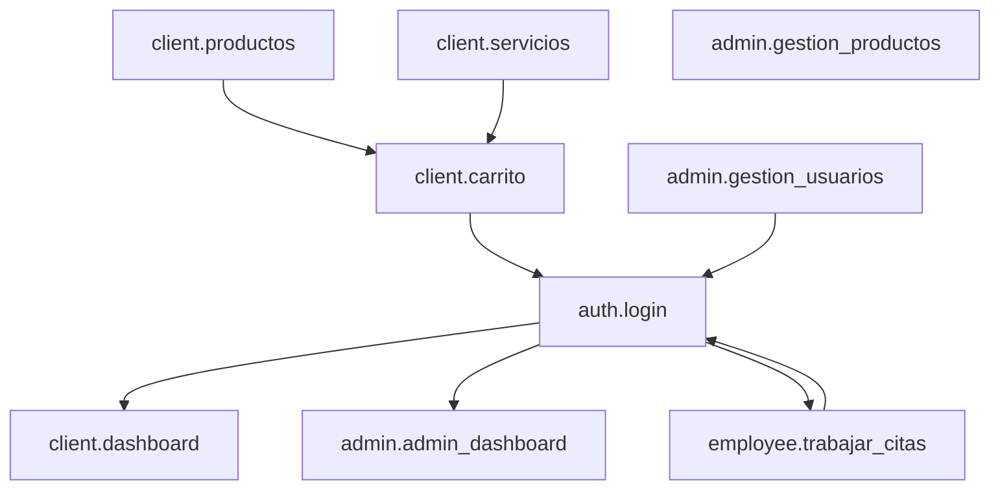

# Blueprint Organization

> **Relevant source files**
> * [app/routes/__pycache__/auth.cpython-313.pyc](https://github.com/GroveLive/CasaBella/blob/5f618972/app/routes/__pycache__/auth.cpython-313.pyc)
> * [app/routes/admin.py](https://github.com/GroveLive/CasaBella/blob/5f618972/app/routes/admin.py)
> * [app/routes/auth.py](https://github.com/GroveLive/CasaBella/blob/5f618972/app/routes/auth.py)
> * [app/routes/client.py](https://github.com/GroveLive/CasaBella/blob/5f618972/app/routes/client.py)
> * [app/routes/employee.py](https://github.com/GroveLive/CasaBella/blob/5f618972/app/routes/employee.py)
> * [app/templates/dashboard_admin.html](https://github.com/GroveLive/CasaBella/blob/5f618972/app/templates/dashboard_admin.html)
> * [app/templates/gestion_servicios.html](https://github.com/GroveLive/CasaBella/blob/5f618972/app/templates/gestion_servicios.html)
> * [app/templates/trabajar_citas.html](https://github.com/GroveLive/CasaBella/blob/5f618972/app/templates/trabajar_citas.html)

## Purpose and Scope

This document details the Flask blueprint architecture used in Casa Bella to modularize the application by user role and functionality. It covers blueprint definitions, URL routing patterns, registration mechanisms, and role-based access control implementation. For information about the data models these blueprints interact with, see [Data Models](/GroveLive/CasaBella/3.2-data-models). For frontend template integration, see [Frontend Architecture](/GroveLive/CasaBella/3.3-frontend-architecture).

## Blueprint Structure Overview

Casa Bella implements four primary blueprints that segment the application by user role and authentication state:

| Blueprint | File Path | URL Prefix | Primary Role | Route Count |
| --- | --- | --- | --- | --- |
| `auth` | `app/routes/auth.py` | `/auth` | Authentication | 6 routes |
| `client` | `app/routes/client.py` | `/client` | Cliente operations | 20+ routes |
| `admin` | `app/routes/admin.py` | `/admin` | Administrator management | 18+ routes |
| `employee` | `app/routes/employee.py` | `/employee` | Employee workflows | 5 routes |

**Blueprint Hierarchy and Organization**

```mermaid
flowchart TD

Flask["Flask Application<br>app/init.py"]
Auth["auth Blueprint<br>app/routes/auth.py<br>URL: /auth"]
Client["client Blueprint<br>app/routes/client.py<br>URL: /client"]
Admin["admin Blueprint<br>app/routes/admin.py<br>URL: /admin"]
Employee["employee Blueprint<br>app/routes/employee.py<br>URL: /employee"]
Login["/login<br>GET, POST"]
Register["/register<br>GET, POST"]
Logout["/logout<br>GET"]
ClientDash["/dashboard/cliente<br>GET"]
AdminDash["/admin_dashboard<br>GET"]
EmpDash["/dashboard/empleado<br>GET"]
Productos["/productos<br>GET"]
Servicios["/servicios<br>GET"]
Carrito["/carrito<br>GET"]
Compra["/procesar_compra<br>GET, POST"]
Dashboard["/dashboard<br>GET"]
AdminDashMain["/dashboard<br>GET"]
GestionUsr["/gestion_usuarios<br>GET"]
GestionProd["/gestion_productos<br>GET"]
GestionServ["/gestion_servicios<br>GET"]
GestionCitas["/gestion_citas_pendientes<br>GET"]
EmpDashMain["/dashboard<br>GET"]
TrabajarCitas["/trabajar_citas<br>GET"]
ConfirmarCita["/confirmar_cita/<br>POST"]
CompletarCita["/completar_cita/<br>POST"]
GenerarFactura["/generar_factura/<br>GET"]

Flask --> Auth
Flask --> Client
Flask --> Admin
Flask --> Employee
Auth --> Login
Auth --> Register
Auth --> Logout
Auth --> ClientDash
Auth --> AdminDash
Auth --> EmpDash
Client --> Productos
Client --> Servicios
Client --> Carrito
Client --> Compra
Client --> Dashboard
Admin --> AdminDashMain
Admin --> GestionUsr
Admin --> GestionProd
Admin --> GestionServ
Admin --> GestionCitas
Employee --> EmpDashMain
Employee --> TrabajarCitas
Employee --> ConfirmarCita
Employee --> CompletarCita
Employee --> GenerarFactura
```



Sources: [app/routes/auth.py L7-L87](https://github.com/GroveLive/CasaBella/blob/5f618972/app/routes/auth.py#L7-L87)

 [app/routes/client.py L35-L36](https://github.com/GroveLive/CasaBella/blob/5f618972/app/routes/client.py#L35-L36)

 [app/routes/admin.py L22-L23](https://github.com/GroveLive/CasaBella/blob/5f618972/app/routes/admin.py#L22-L23)

 [app/routes/employee.py L27-L28](https://github.com/GroveLive/CasaBella/blob/5f618972/app/routes/employee.py#L27-L28)

## Blueprint Definitions and URL Prefixes

### Auth Blueprint

The authentication blueprint handles user login, registration, logout, and initial dashboard routing. It has no role restrictions for login/register routes but enforces authentication on dashboard routes.

**Blueprint Declaration:**

```python
bp = Blueprint('auth', __name__, url_prefix='/auth')
```

**Key Routes:**

* `/auth/login` - User authentication [app/routes/auth.py L9-L30](https://github.com/GroveLive/CasaBella/blob/5f618972/app/routes/auth.py#L9-L30)
* `/auth/register` - New user registration [app/routes/auth.py L32-L60](https://github.com/GroveLive/CasaBella/blob/5f618972/app/routes/auth.py#L32-L60)
* `/auth/logout` - Session termination [app/routes/auth.py L82-L87](https://github.com/GroveLive/CasaBella/blob/5f618972/app/routes/auth.py#L82-L87)
* `/auth/dashboard/cliente` - Cliente dashboard redirect [app/routes/auth.py L62-L68](https://github.com/GroveLive/CasaBella/blob/5f618972/app/routes/auth.py#L62-L68)
* `/auth/admin_dashboard` - Admin dashboard redirect [app/routes/auth.py L69-L72](https://github.com/GroveLive/CasaBella/blob/5f618972/app/routes/auth.py#L69-L72)
* `/auth/dashboard/empleado` - Employee dashboard redirect [app/routes/auth.py L74-L80](https://github.com/GroveLive/CasaBella/blob/5f618972/app/routes/auth.py#L74-L80)

Sources: [app/routes/auth.py L7](https://github.com/GroveLive/CasaBella/blob/5f618972/app/routes/auth.py#L7-L7)

### Client Blueprint

The client blueprint provides all customer-facing functionality including e-commerce, appointment booking, favorites, and reviews. All routes require `@login_required` and role validation.

**Blueprint Declaration:**

```python
bp = Blueprint('client', __name__, url_prefix='/client')
```

**Context Processor:**
The client blueprint includes a context processor to inject the active shopping cart into all templates:

```python
@bp.context_processor
def inject_carrito():
    if current_user.is_authenticated:
        carrito = Carrito.query.filter_by(id_usuario=current_user.id_usuario, estado='activo').first()
        return dict(carrito=carrito)
    return dict(carrito=None)
```

**Key Route Categories:**

* **Catalog Browsing:** `/servicios`, `/productos` [app/routes/client.py L52-L94](https://github.com/GroveLive/CasaBella/blob/5f618972/app/routes/client.py#L52-L94)
* **Shopping Cart:** `/carrito`, `/agregar_carrito/<id>`, `/eliminar_del_carrito/<id>`, `/actualizar_cantidad/<id>` [app/routes/client.py L106-L269](https://github.com/GroveLive/CasaBella/blob/5f618972/app/routes/client.py#L106-L269)
* **Checkout:** `/procesar_compra` [app/routes/client.py L271-L455](https://github.com/GroveLive/CasaBella/blob/5f618972/app/routes/client.py#L271-L455)
* **Appointments:** `/citas`, `/editar_cita/<id>`, `/borrar_cita/<id>` [app/routes/client.py L96-L104](https://github.com/GroveLive/CasaBella/blob/5f618972/app/routes/client.py#L96-L104)  [app/routes/client.py L724-L822](https://github.com/GroveLive/CasaBella/blob/5f618972/app/routes/client.py#L724-L822)
* **User Profile:** `/dashboard`, `/perfil`, `/borrar_perfil` [app/routes/client.py L457-L539](https://github.com/GroveLive/CasaBella/blob/5f618972/app/routes/client.py#L457-L539)
* **Favorites & Reviews:** Managed through dedicated model interactions

Sources: [app/routes/client.py L35-L36](https://github.com/GroveLive/CasaBella/blob/5f618972/app/routes/client.py#L35-L36)

 [app/routes/client.py L44-L50](https://github.com/GroveLive/CasaBella/blob/5f618972/app/routes/client.py#L44-L50)

### Admin Blueprint

The admin blueprint provides comprehensive management capabilities for users, products, services, appointments, and promotions. All routes require admin role verification.

**Blueprint Declaration:**

```python
bp = Blueprint('admin', __name__, url_prefix='/admin')
```

**Key Route Categories:**

* **Dashboard & Analytics:** `/dashboard`, `/gestion_ingresos` [app/routes/admin.py L28-L154](https://github.com/GroveLive/CasaBella/blob/5f618972/app/routes/admin.py#L28-L154)  [app/routes/admin.py L575-L729](https://github.com/GroveLive/CasaBella/blob/5f618972/app/routes/admin.py#L575-L729)
* **User Management:** `/gestion_usuarios`, `/agregar_usuario`, `/editar_usuario/<id>`, `/eliminar_usuario/<id>` [app/routes/admin.py L156-L256](https://github.com/GroveLive/CasaBella/blob/5f618972/app/routes/admin.py#L156-L256)
* **Product Management:** `/gestion_productos`, `/agregar_producto`, `/editar_producto/<id>`, `/eliminar_producto/<id>` [app/routes/admin.py L258-L382](https://github.com/GroveLive/CasaBella/blob/5f618972/app/routes/admin.py#L258-L382)
* **Service Management:** `/gestion_servicios`, `/agregar_servicio`, `/editar_servicio/<id>`, `/eliminar_servicio/<id>` [app/routes/admin.py L384-L493](https://github.com/GroveLive/CasaBella/blob/5f618972/app/routes/admin.py#L384-L493)
* **Appointment Coordination:** `/gestion_citas_pendientes`, `/asignar_empleado/<id>` [app/routes/admin.py L495-L573](https://github.com/GroveLive/CasaBella/blob/5f618972/app/routes/admin.py#L495-L573)
* **Promotion Management:** Managed through dedicated routes

Sources: [app/routes/admin.py L22-L23](https://github.com/GroveLive/CasaBella/blob/5f618972/app/routes/admin.py#L22-L23)

### Employee Blueprint

The employee blueprint handles appointment fulfillment workflows and invoice generation. All routes require employee role verification.

**Blueprint Declaration:**

```python
bp = Blueprint('employee', __name__, url_prefix='/employee')
```

**Key Routes:**

* `/dashboard` - Employee dashboard with assigned appointment count [app/routes/employee.py L36-L44](https://github.com/GroveLive/CasaBella/blob/5f618972/app/routes/employee.py#L36-L44)
* `/trabajar_citas` - FullCalendar view of assigned appointments [app/routes/employee.py L46-L96](https://github.com/GroveLive/CasaBella/blob/5f618972/app/routes/employee.py#L46-L96)
* `/confirmar_cita/<id_cita>` - Confirm pending appointment [app/routes/employee.py L98-L114](https://github.com/GroveLive/CasaBella/blob/5f618972/app/routes/employee.py#L98-L114)
* `/completar_cita/<id_cita>` - Complete confirmed appointment [app/routes/employee.py L116-L144](https://github.com/GroveLive/CasaBella/blob/5f618972/app/routes/employee.py#L116-L144)
* `/generar_factura/<id_cita>` - Auto-generate PDF invoice for completed appointment [app/routes/employee.py L146-L278](https://github.com/GroveLive/CasaBella/blob/5f618972/app/routes/employee.py#L146-L278)
* `/generar_factura_manual` - Manual invoice for walk-in customers [app/routes/employee.py L280-L451](https://github.com/GroveLive/CasaBella/blob/5f618972/app/routes/employee.py#L280-L451)

Sources: [app/routes/employee.py L27-L28](https://github.com/GroveLive/CasaBella/blob/5f618972/app/routes/employee.py#L27-L28)

## URL Routing Patterns

**Complete Route Mapping by Blueprint**



**Route Parameter Patterns**

| Pattern | Example | Blueprint | Purpose |
| --- | --- | --- | --- |
| `/<int:item_id>` | `/agregar_carrito/5` | client | Product/service operations |
| `/<int:id_usuario>` | `/editar_usuario/3` | admin | User management |
| `/<int:id_producto>` | `/editar_producto/10` | admin | Product management |
| `/<int:id_servicio>` | `/editar_servicio/2` | admin | Service management |
| `/<int:id_cita>` | `/confirmar_cita/7` | employee | Appointment operations |
| `/<int:venta_id>` | `/descargar_factura/15` | client | Invoice download |
| `/<int:detalle_id>` | `/actualizar_cantidad/8` | client | Cart item operations |

Sources: [app/routes/client.py L106](https://github.com/GroveLive/CasaBella/blob/5f618972/app/routes/client.py#L106-L106)

 [app/routes/admin.py L203](https://github.com/GroveLive/CasaBella/blob/5f618972/app/routes/admin.py#L203-L203)

 [app/routes/employee.py L98](https://github.com/GroveLive/CasaBella/blob/5f618972/app/routes/employee.py#L98-L98)

## Blueprint Registration

Blueprints are registered in the Flask application factory pattern. While the application factory file is not provided in the sources, the blueprint structure follows standard Flask conventions.

**Expected Registration Pattern:**

```javascript
# In app/__init__.py
def create_app():
    app = Flask(__name__)
    
    from app.routes import auth, client, admin, employee
    app.register_blueprint(auth.bp)
    app.register_blueprint(client.bp)
    app.register_blueprint(admin.bp)
    app.register_blueprint(employee.bp)
    
    return app
```

**Blueprint Import Statements**

Each blueprint imports required dependencies at the module level:



Sources: [app/routes/client.py L1-L39](https://github.com/GroveLive/CasaBella/blob/5f618972/app/routes/client.py#L1-L39)

 [app/routes/admin.py L1-L26](https://github.com/GroveLive/CasaBella/blob/5f618972/app/routes/admin.py#L1-L26)

 [app/routes/employee.py L1-L34](https://github.com/GroveLive/CasaBella/blob/5f618972/app/routes/employee.py#L1-L34)

 [app/routes/auth.py L1-L7](https://github.com/GroveLive/CasaBella/blob/5f618972/app/routes/auth.py#L1-L7)

## Role-Based Access Control Patterns

Each blueprint implements consistent role-based access control using decorator and conditional patterns.

**Access Control Implementation by Blueprint**



**Standard Access Control Code Pattern:**

The following pattern appears in virtually every route across client, admin, and employee blueprints:

```python
@bp.route('/route_name')
@login_required
def route_function():
    if current_user.rol != 'expected_role':
        flash("Acceso denegado. Solo para [role].", "danger")
        return redirect(url_for('auth.login'))
    # Route logic continues...
```

**Examples by Blueprint:**

| Blueprint | Route | Access Check Location | Pattern |
| --- | --- | --- | --- |
| client | `/servicios` | [app/routes/client.py L54-L57](https://github.com/GroveLive/CasaBella/blob/5f618972/app/routes/client.py#L54-L57) | `current_user.rol != 'cliente'` |
| client | `/productos` | [app/routes/client.py L77-L79](https://github.com/GroveLive/CasaBella/blob/5f618972/app/routes/client.py#L77-L79) | `current_user.rol != 'cliente'` |
| client | `/carrito` | [app/routes/client.py L183-L185](https://github.com/GroveLive/CasaBella/blob/5f618972/app/routes/client.py#L183-L185) | `current_user.rol != 'cliente'` |
| admin | `/dashboard` | [app/routes/admin.py L31-L33](https://github.com/GroveLive/CasaBella/blob/5f618972/app/routes/admin.py#L31-L33) | `current_user.rol != 'admin'` |
| admin | `/gestion_usuarios` | [app/routes/admin.py L159-L161](https://github.com/GroveLive/CasaBella/blob/5f618972/app/routes/admin.py#L159-L161) | `current_user.rol != 'admin'` |
| admin | `/agregar_producto` | [app/routes/admin.py L271-L273](https://github.com/GroveLive/CasaBella/blob/5f618972/app/routes/admin.py#L271-L273) | `current_user.rol != 'admin'` |
| employee | `/dashboard` | [app/routes/employee.py L39-L41](https://github.com/GroveLive/CasaBella/blob/5f618972/app/routes/employee.py#L39-L41) | `current_user.rol != 'empleado'` |
| employee | `/trabajar_citas` | [app/routes/employee.py L49-L51](https://github.com/GroveLive/CasaBella/blob/5f618972/app/routes/employee.py#L49-L51) | `current_user.rol != 'empleado'` |
| employee | `/confirmar_cita` | [app/routes/employee.py L101-L103](https://github.com/GroveLive/CasaBella/blob/5f618972/app/routes/employee.py#L101-L103) | `current_user.rol != 'empleado'` |

**Additional Authorization Checks:**

Beyond role verification, blueprints implement ownership validation:

* **Client Blueprint:** Validates `current_user.id_usuario` matches cart owner [app/routes/client.py L216-L218](https://github.com/GroveLive/CasaBella/blob/5f618972/app/routes/client.py#L216-L218)  purchase owner [app/routes/client.py L678-L680](https://github.com/GroveLive/CasaBella/blob/5f618972/app/routes/client.py#L678-L680)  appointment owner [app/routes/client.py L707-L709](https://github.com/GroveLive/CasaBella/blob/5f618972/app/routes/client.py#L707-L709)
* **Employee Blueprint:** Validates `cita.id_empleado == current_user.id_usuario` [app/routes/employee.py L105-L107](https://github.com/GroveLive/CasaBella/blob/5f618972/app/routes/employee.py#L105-L107)  [app/routes/employee.py L123-L125](https://github.com/GroveLive/CasaBella/blob/5f618972/app/routes/employee.py#L123-L125)

Sources: [app/routes/client.py L54-L57](https://github.com/GroveLive/CasaBella/blob/5f618972/app/routes/client.py#L54-L57)

 [app/routes/admin.py L31-L33](https://github.com/GroveLive/CasaBella/blob/5f618972/app/routes/admin.py#L31-L33)

 [app/routes/employee.py L39-L41](https://github.com/GroveLive/CasaBella/blob/5f618972/app/routes/employee.py#L39-L41)

## Inter-Blueprint Communication

Blueprints reference each other through Flask's `url_for()` function using the blueprint name prefix.

**Cross-Blueprint URL Generation Pattern**



**Common Redirect Patterns:**

| From Blueprint | To Blueprint | Use Case | Code Reference |
| --- | --- | --- | --- |
| auth | client | After login (cliente) | [app/routes/auth.py L26](https://github.com/GroveLive/CasaBella/blob/5f618972/app/routes/auth.py#L26-L26) |
| auth | admin | After login (admin) | [app/routes/auth.py L22](https://github.com/GroveLive/CasaBella/blob/5f618972/app/routes/auth.py#L22-L22) |
| auth | employee | After login (empleado) | [app/routes/auth.py L24](https://github.com/GroveLive/CasaBella/blob/5f618972/app/routes/auth.py#L24-L24) |
| client | auth | Access denied | [app/routes/client.py L57](https://github.com/GroveLive/CasaBella/blob/5f618972/app/routes/client.py#L57-L57) |
| client | client | After operations | [app/routes/client.py L169](https://github.com/GroveLive/CasaBella/blob/5f618972/app/routes/client.py#L169-L169) |
| admin | auth | Access denied | [app/routes/admin.py L33](https://github.com/GroveLive/CasaBella/blob/5f618972/app/routes/admin.py#L33-L33) |
| admin | admin | After CRUD | [app/routes/admin.py L196](https://github.com/GroveLive/CasaBella/blob/5f618972/app/routes/admin.py#L196-L196) |
| employee | auth | Access denied | [app/routes/employee.py L41](https://github.com/GroveLive/CasaBella/blob/5f618972/app/routes/employee.py#L41-L41) |
| employee | employee | After operations | [app/routes/employee.py L114](https://github.com/GroveLive/CasaBella/blob/5f618972/app/routes/employee.py#L114-L114) |

**URL Generation Examples:**

```python
# Redirect to login from any blueprint
return redirect(url_for('auth.login'))

# Redirect to client dashboard
return redirect(url_for('client.dashboard'))

# Redirect to admin user management
return redirect(url_for('admin.gestion_usuarios'))

# Redirect to employee appointments
return redirect(url_for('employee.trabajar_citas'))
```

Sources: [app/routes/auth.py L22-L26](https://github.com/GroveLive/CasaBella/blob/5f618972/app/routes/auth.py#L22-L26)

 [app/routes/client.py L57](https://github.com/GroveLive/CasaBella/blob/5f618972/app/routes/client.py#L57-L57)

 [app/routes/admin.py L196](https://github.com/GroveLive/CasaBella/blob/5f618972/app/routes/admin.py#L196-L196)

 [app/routes/employee.py L144](https://github.com/GroveLive/CasaBella/blob/5f618972/app/routes/employee.py#L144-L144)

## Blueprint-Specific Utilities

### Client Blueprint Context Processor

The client blueprint includes a context processor that automatically injects the active shopping cart into all client templates:

[app/routes/client.py L44-L50](https://github.com/GroveLive/CasaBella/blob/5f618972/app/routes/client.py#L44-L50)

This allows templates to access `{{ carrito }}` without explicit passing in route handlers.

### Client Blueprint Constants

The client and employee blueprints define shared constants:

* `IVA_RATE = Decimal("0.16")` - 16% tax rate used in invoice calculations [app/routes/client.py L42](https://github.com/GroveLive/CasaBella/blob/5f618972/app/routes/client.py#L42-L42)  [app/routes/employee.py L34](https://github.com/GroveLive/CasaBella/blob/5f618972/app/routes/employee.py#L34-L34)

### Logging Configuration

All blueprints configure logging at the module level:

```
logging.basicConfig(level=logging.DEBUG)
logger = logging.getLogger(__name__)
```

This pattern appears in [app/routes/client.py L37-L39](https://github.com/GroveLive/CasaBella/blob/5f618972/app/routes/client.py#L37-L39)

 [app/routes/admin.py L24-L26](https://github.com/GroveLive/CasaBella/blob/5f618972/app/routes/admin.py#L24-L26)

 [app/routes/employee.py L29-L31](https://github.com/GroveLive/CasaBella/blob/5f618972/app/routes/employee.py#L29-L31)

Sources: [app/routes/client.py L42-L50](https://github.com/GroveLive/CasaBella/blob/5f618972/app/routes/client.py#L42-L50)

 [app/routes/employee.py L34](https://github.com/GroveLive/CasaBella/blob/5f618972/app/routes/employee.py#L34-L34)

 [app/routes/client.py L37-L39](https://github.com/GroveLive/CasaBella/blob/5f618972/app/routes/client.py#L37-L39)

## Summary

The Casa Bella blueprint architecture provides clean separation of concerns across four role-based modules:

1. **auth** - Authentication and initial routing (6 routes)
2. **client** - Customer operations and e-commerce (20+ routes)
3. **admin** - Administrative management (18+ routes)
4. **employee** - Appointment fulfillment (5 routes)

Each blueprint enforces role-based access control through consistent `@login_required` decoration and `current_user.rol` verification. Blueprints communicate through `url_for()` references and share common patterns for database operations, error handling, and user feedback via Flask's `flash()` system.