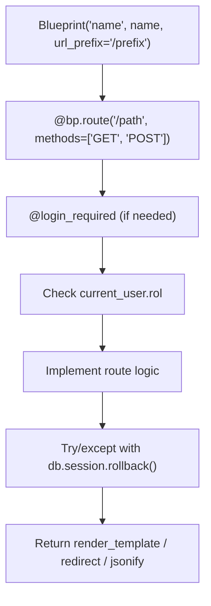
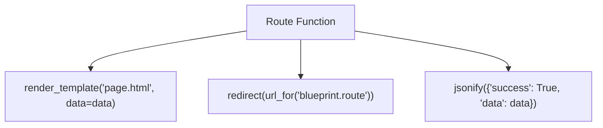
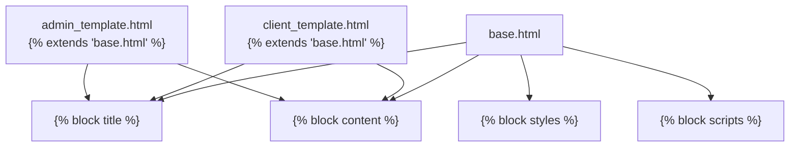
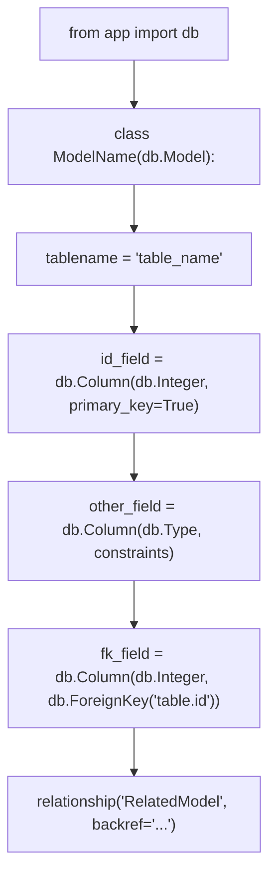
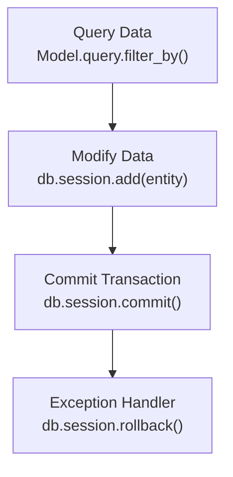
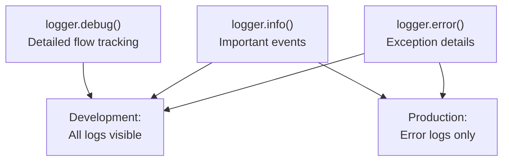
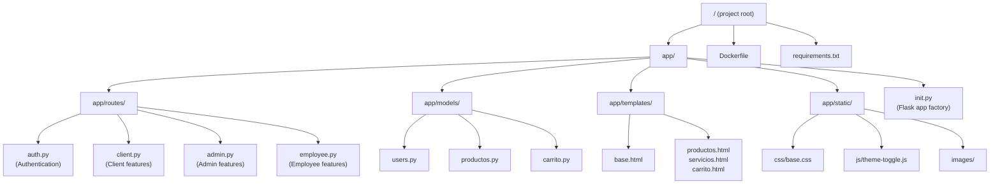
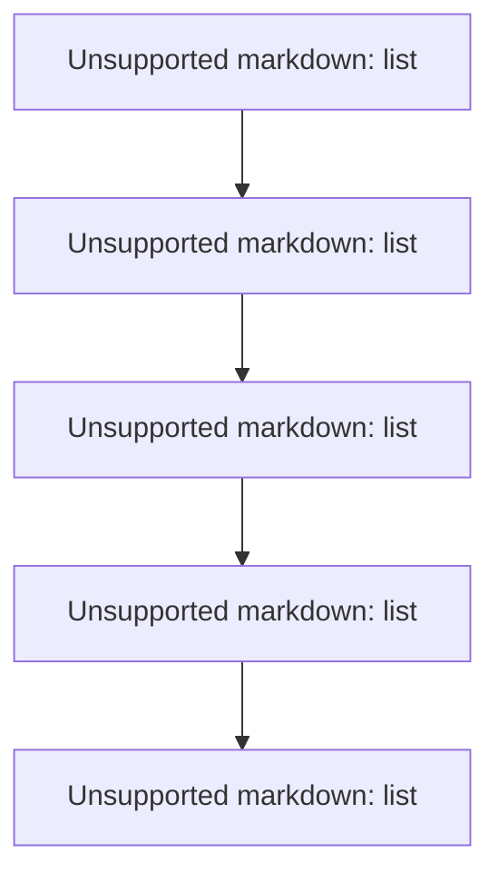
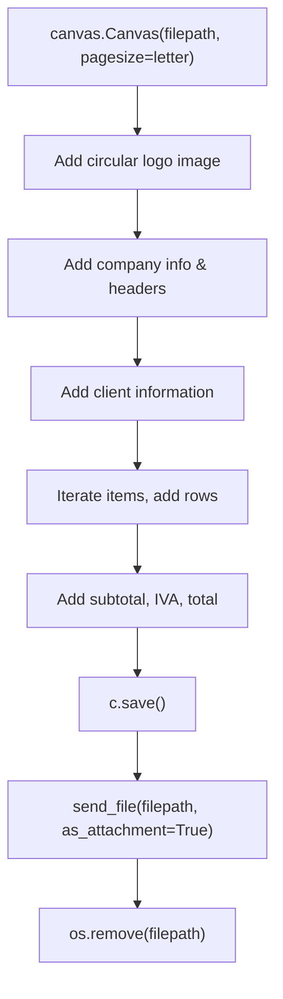

# Development Guide

> **Relevant source files**
> * [Dockerfile](https://github.com/GroveLive/CasaBella/blob/5f618972/Dockerfile)
> * [app/models/carrito.py](https://github.com/GroveLive/CasaBella/blob/5f618972/app/models/carrito.py)
> * [app/routes/client.py](https://github.com/GroveLive/CasaBella/blob/5f618972/app/routes/client.py)
> * [app/templates/base.html](https://github.com/GroveLive/CasaBella/blob/5f618972/app/templates/base.html)

## Purpose and Scope

This guide provides practical resources for developers contributing to the Casa Bella codebase. It covers adding new routes, creating templates, extending data models, debugging techniques, and code organization patterns. For initial project setup and Docker deployment, see [Getting Started](/GroveLive/CasaBella/2-getting-started). For architectural concepts and blueprint structure, see [Architecture Overview](/GroveLive/CasaBella/3-architecture-overview).

---

## Development Environment Setup

### Prerequisites

Before beginning development, ensure you have completed the setup in [Getting Started](/GroveLive/CasaBella/2-getting-started). Additional development tools recommended:

| Tool | Purpose | Configuration |
| --- | --- | --- |
| Python 3.13+ | Runtime environment | Matches [Dockerfile L2](https://github.com/GroveLive/CasaBella/blob/5f618972/Dockerfile#L2-L2) |
| PostgreSQL | Database server | Connection via `DATABASE_URL` environment variable |
| Flask CLI | Development server | Runs on port 8085 per [Dockerfile L21](https://github.com/GroveLive/CasaBella/blob/5f618972/Dockerfile#L21-L21) |
| Git | Version control | Standard branching workflow |

### Local Development Server

The application uses Flask's built-in development server with automatic reloading:

```
flask run --host=0.0.0.0 --port=8085
```

This configuration matches [Dockerfile L21](https://github.com/GroveLive/CasaBella/blob/5f618972/Dockerfile#L21-L21)

 and enables debugging features including detailed error pages and automatic template reloading.

**Sources:** [Dockerfile L1-L21](https://github.com/GroveLive/CasaBella/blob/5f618972/Dockerfile#L1-L21)

---

## Adding New Routes

### Blueprint-Based Route Registration

Casa Bella uses Flask blueprints for modular route organization. All routes are registered through blueprints in `app/routes/`.



### Example: Adding a Client Route

Following the pattern in [app/routes/client.py L35-L455](https://github.com/GroveLive/CasaBella/blob/5f618972/app/routes/client.py#L35-L455)

:

```python
bp = Blueprint('client', __name__, url_prefix='/client')

@bp.route('/new_feature')
@login_required
def new_feature():
    if current_user.rol != 'cliente':
        flash("Acceso denegado. Solo para clientes.", "danger")
        return redirect(url_for('auth.login'))
    
    try:
        # Business logic
        data = SomeModel.query.all()
        return render_template('new_feature.html', data=data)
    except Exception as e:
        logger.error(f"Error en new_feature: {str(e)}")
        flash(f"Ocurrió un error: {str(e)}", "danger")
        return redirect(url_for('client.dashboard'))
```

### Route Decorator Patterns

| Decorator | Purpose | Example Location |
| --- | --- | --- |
| `@bp.route('/path')` | Define URL endpoint | [app/routes/client.py L52](https://github.com/GroveLive/CasaBella/blob/5f618972/app/routes/client.py#L52-L52) |
| `@login_required` | Require authentication | [app/routes/client.py L53](https://github.com/GroveLive/CasaBella/blob/5f618972/app/routes/client.py#L53-L53) |
| `methods=['GET', 'POST']` | Specify HTTP methods | [app/routes/client.py L271](https://github.com/GroveLive/CasaBella/blob/5f618972/app/routes/client.py#L271-L271) |

### Response Type Patterns

The codebase uses three primary response patterns:



**HTML Page Response:** [app/routes/client.py L68](https://github.com/GroveLive/CasaBella/blob/5f618972/app/routes/client.py#L68-L68)

```
return render_template('servicios.html', servicios=servicios, promociones=promociones)
```

**Navigation Redirect:** [app/routes/client.py L169](https://github.com/GroveLive/CasaBella/blob/5f618972/app/routes/client.py#L169-L169)

```
return redirect(url_for('client.productos'))
```

**AJAX JSON Response:** [app/routes/client.py L222](https://github.com/GroveLive/CasaBella/blob/5f618972/app/routes/client.py#L222-L222)

```
return jsonify({'success': True, 'message': 'Item eliminado del carrito.'})
```

### Error Handling Pattern

Every database-modifying route follows this error handling pattern from [app/routes/client.py L284-L454](https://github.com/GroveLive/CasaBella/blob/5f618972/app/routes/client.py#L284-L454)

:

```css
try:
    # Business logic with db operations
    db.session.add(entity)
    db.session.commit()
    flash("Operación exitosa.", "success")
    return redirect(url_for('success_page'))
except IntegrityError as e:
    db.session.rollback()
    logger.error(f"Error de integridad: {str(e)}")
    flash("Error de integridad.", "danger")
except Exception as e:
    db.session.rollback()
    logger.error(f"Error: {str(e)}")
    flash(f"Ocurrió un error: {str(e)}", "danger")
    return redirect(url_for('error_page'))
```

### Logging Configuration

The logging setup in [app/routes/client.py L37-L39](https://github.com/GroveLive/CasaBella/blob/5f618972/app/routes/client.py#L37-L39)

 should be replicated in new blueprints:

```javascript
import logging
logging.basicConfig(level=logging.DEBUG)
logger = logging.getLogger(__name__)
```

Use `logger.debug()`, `logger.error()`, and `logger.info()` throughout route implementations as seen in [app/routes/client.py L113-L167](https://github.com/GroveLive/CasaBella/blob/5f618972/app/routes/client.py#L113-L167)

**Sources:** [app/routes/client.py L35-L455](https://github.com/GroveLive/CasaBella/blob/5f618972/app/routes/client.py#L35-L455)

 [Dockerfile L21](https://github.com/GroveLive/CasaBella/blob/5f618972/Dockerfile#L21-L21)

---

## Creating Templates

### Template Inheritance Structure

All templates extend `base.html` which provides the navigation, footer, and theme system.



### Required Template Blocks

From [app/templates/base.html L1-L270](https://github.com/GroveLive/CasaBella/blob/5f618972/app/templates/base.html#L1-L270)

 templates must override these blocks:

| Block | Purpose | Example |
| --- | --- | --- |
| `` | Page title | [app/templates/base.html L6](https://github.com/GroveLive/CasaBella/blob/5f618972/app/templates/base.html#L6-L6) |
| `` | Page-specific CSS | [app/templates/base.html L22](https://github.com/GroveLive/CasaBella/blob/5f618972/app/templates/base.html#L22-L22) |
| `` | Main content area | [app/templates/base.html L184](https://github.com/GroveLive/CasaBella/blob/5f618972/app/templates/base.html#L184-L184) |
| `` | Page-specific JavaScript | [app/templates/base.html L268](https://github.com/GroveLive/CasaBella/blob/5f618972/app/templates/base.html#L268-L268) |

### Template Creation Pattern

```html


Nueva Página - Casa Bella


<link rel="stylesheet" href="{{ url_for('static', filename='css/custom.css') }}">



<div class="container mt-4">
    <h1>Título de la Página</h1>
    <!-- Contenido aquí -->
</div>



<script src="{{ url_for('static', filename='js/custom.js') }}"></script>

```

### Role-Based Content Rendering

Following the pattern in [app/templates/base.html L39-L102](https://github.com/GroveLive/CasaBella/blob/5f618972/app/templates/base.html#L39-L102)

:

```

    
        <!-- Cliente-specific content -->
    
        <!-- Admin-specific content -->
    
        <!-- Empleado-specific content -->
    

    <!-- Guest content -->

```

### AJAX Integration Pattern

For dynamic features, templates include Bootstrap and jQuery from CDN [app/templates/base.html L14-L16](https://github.com/GroveLive/CasaBella/blob/5f618972/app/templates/base.html#L14-L16)

:

```xml
<script src="https://cdn.jsdelivr.net/npm/bootstrap@5.3.0/dist/js/bootstrap.bundle.min.js"></script>
```

AJAX requests should follow the pattern in client-side JavaScript that interacts with JSON endpoints like [app/routes/client.py L222](https://github.com/GroveLive/CasaBella/blob/5f618972/app/routes/client.py#L222-L222)

**Sources:** [app/templates/base.html L1-L270](https://github.com/GroveLive/CasaBella/blob/5f618972/app/templates/base.html#L1-L270)

 [app/routes/client.py L222-L226](https://github.com/GroveLive/CasaBella/blob/5f618972/app/routes/client.py#L222-L226)

---

## Extending Data Models

### SQLAlchemy Model Pattern

All models follow the pattern established in [app/models/carrito.py L1-L13](https://github.com/GroveLive/CasaBella/blob/5f618972/app/models/carrito.py#L1-L13)

:



### Model Definition Template

```javascript
from app import db
from sqlalchemy import Enum

class NewModel(db.Model):
    __tablename__ = 'new_model'
    
    # Primary Key
    id_new_model = db.Column(db.Integer, primary_key=True)
    
    # Foreign Keys
    id_usuario = db.Column(db.Integer, db.ForeignKey('usuarios.id_usuario'))
    
    # Data Columns
    nombre = db.Column(db.String(100), nullable=False)
    fecha_creacion = db.Column(db.DateTime, default=db.func.current_timestamp())
    estado = db.Column(Enum('activo', 'inactivo', name='estado_enum'), default='activo')
    
    # Relationships
    usuario = db.relationship('Usuario', backref='new_models', lazy=True)
```

### Relationship Patterns

From [app/models/carrito.py L12](https://github.com/GroveLive/CasaBella/blob/5f618972/app/models/carrito.py#L12-L12)

:

| Pattern | Syntax | Use Case |
| --- | --- | --- |
| One-to-Many | `db.relationship('Child', backref='parent')` | Parent has many children |
| Many-to-One | `db.ForeignKey('parent.id')` with relationship | Child belongs to parent |
| Polymorphic | Multiple nullable FKs | Items can reference Product OR Service |

### Enum Column Pattern

Following [app/models/carrito.py L9](https://github.com/GroveLive/CasaBella/blob/5f618972/app/models/carrito.py#L9-L9)

:

```
estado = db.Column(
    Enum('activo', 'completado', 'abandonado', name='estado_carrito_enum'),
    default='activo'
)
```

### Database Migrations

After creating or modifying models, generate and apply migrations:

```
flask db migrate -m "Add new_model table"
flask db upgrade
```

The migrations are stored in the `/migrations` directory created in [Dockerfile L18](https://github.com/GroveLive/CasaBella/blob/5f618972/Dockerfile#L18-L18)

**Sources:** [app/models/carrito.py L1-L13](https://github.com/GroveLive/CasaBella/blob/5f618972/app/models/carrito.py#L1-L13)

 [Dockerfile L18](https://github.com/GroveLive/CasaBella/blob/5f618972/Dockerfile#L18-L18)

---

## Database Operations

### Session Management Pattern

All database operations in Casa Bella use SQLAlchemy's session management with explicit transaction control.



### Query Patterns

**Basic Query:** [app/routes/client.py L66](https://github.com/GroveLive/CasaBella/blob/5f618972/app/routes/client.py#L66-L66)

```
servicios = Servicio.query.all()
```

**Filtered Query:** [app/routes/client.py L114](https://github.com/GroveLive/CasaBella/blob/5f618972/app/routes/client.py#L114-L114)

```
carrito = Carrito.query.filter_by(
    id_usuario=current_user.id_usuario,
    estado='activo'
).first()
```

**Query with Joins (Eager Loading):** [app/routes/client.py L189-L192](https://github.com/GroveLive/CasaBella/blob/5f618972/app/routes/client.py#L189-L192)

```
carrito = Carrito.query.options(
    joinedload(Carrito.detalles).joinedload(DetalleCarrito.producto),
    joinedload(Carrito.detalles).joinedload(DetalleCarrito.servicio)
).filter_by(id_usuario=current_user.id_usuario, estado='activo').first()
```

### Transaction Pattern

From [app/routes/client.py L284-L341](https://github.com/GroveLive/CasaBella/blob/5f618972/app/routes/client.py#L284-L341)

:

```yaml
try:
    # Step 1: Modify entities
    producto.stock -= cantidad
    
    # Step 2: Add new entities
    venta = Venta(id_usuario=current_user.id_usuario, total=total)
    db.session.add(venta)
    db.session.commit()  # Commit to get venta.id_venta
    
    # Step 3: Add dependent entities
    detalle = DetalleVenta(id_venta=venta.id_venta, ...)
    db.session.add(detalle)
    
    # Step 4: Commit all changes
    db.session.commit()
    
except IntegrityError as e:
    db.session.rollback()
    # Handle constraint violations
except Exception as e:
    db.session.rollback()
    # Handle general errors
```

### Critical Pattern: Flush vs Commit

When you need an auto-generated ID before committing, use `db.session.flush()` [app/routes/client.py L119](https://github.com/GroveLive/CasaBella/blob/5f618972/app/routes/client.py#L119-L119)

:

```markdown
carrito = Carrito(id_usuario=current_user.id_usuario, estado='activo')
db.session.add(carrito)
db.session.flush()  # Generates carrito.id_carrito without committing
logger.debug(f"Carrito creado con id_carrito={carrito.id_carrito}")
```

### Common Pitfalls

| Pitfall | Problem | Solution |
| --- | --- | --- |
| Missing rollback | Database left in inconsistent state | Always rollback in exception handler |
| Accessing ID before flush | `None` value for auto-increment ID | Use `db.session.flush()` before accessing |
| Circular imports | Models can't import each other | Use string references in relationships |
| Forgot nullable constraints | Insert fails unexpectedly | Check model definitions for `nullable=False` |

**Sources:** [app/routes/client.py L112-L341](https://github.com/GroveLive/CasaBella/blob/5f618972/app/routes/client.py#L112-L341)

---

## Debugging Techniques

### Logging Strategy

The codebase uses Python's `logging` module configured in [app/routes/client.py L37-L39](https://github.com/GroveLive/CasaBella/blob/5f618972/app/routes/client.py#L37-L39)

:



### Logging Examples

**Track data flow:** [app/routes/client.py L113-L167](https://github.com/GroveLive/CasaBella/blob/5f618972/app/routes/client.py#L113-L167)

```
logger.debug(f"Intentando agregar item {item_id} para usuario {current_user.id_usuario}")
logger.debug(f"Carrito creado con id_carrito={carrito.id_carrito}")
```

**Log errors with context:** [app/routes/client.py L172-L177](https://github.com/GroveLive/CasaBella/blob/5f618972/app/routes/client.py#L172-L177)

```
except IntegrityError as e:
    db.session.rollback()
    logger.error(f"Error de integridad al agregar al carrito: {str(e)}")
```

### Common Errors and Solutions

| Error Type | Symptoms | Location | Solution |
| --- | --- | --- | --- |
| `AttributeError: 'NoneType'` | Object is None when expected | Query returns None | Check `.first()` returns value before accessing attributes |
| `IntegrityError: FOREIGN KEY constraint` | Cannot delete/update due to references | Delete operations | Delete dependent records first or use `ondelete='CASCADE'` |
| `ValueError: no such table` | Database not initialized | Flask startup | Run `flask db upgrade` to apply migrations |
| `TypeError: Object of type Decimal is not JSON serializable` | JSON serialization fails | AJAX responses | Convert `Decimal` to `float` before jsonify [app/routes/client.py L264](https://github.com/GroveLive/CasaBella/blob/5f618972/app/routes/client.py#L264-L264) |

### Database Query Debugging

Add query logging to see generated SQL:

```javascript
# In development, add to app/__init__.py
import logging
logging.getLogger('sqlalchemy.engine').setLevel(logging.INFO)
```

### Template Debugging

Jinja2 provides debugging information when errors occur. Common issues:

```
<!-- Wrong: Will cause NameError if variable doesn't exist -->
{{ undefined_variable }}

<!-- Correct: Safe access with default -->
{{ variable|default('N/A') }}

<!-- Wrong: Accessing method without () -->
{{ user.get_name }}

<!-- Correct: Call the method -->
{{ user.get_name() }}
```

**Sources:** [app/routes/client.py L37-L264](https://github.com/GroveLive/CasaBella/blob/5f618972/app/routes/client.py#L37-L264)

 [app/templates/base.html L39-L102](https://github.com/GroveLive/CasaBella/blob/5f618972/app/templates/base.html#L39-L102)

---

## Code Organization Standards

### Project Structure



### Blueprint Organization Convention

Each blueprint in `app/routes/` follows this structure:

```javascript
# Import dependencies
from flask import Blueprint, render_template, redirect, url_for, request, flash, jsonify
from app import db
from app.models.* import *
from flask_login import login_required, current_user

# Create blueprint
bp = Blueprint('blueprint_name', __name__, url_prefix='/prefix')

# Configure logging
import logging
logger = logging.getLogger(__name__)

# Context processors (if needed)
@bp.context_processor
def inject_context():
    return dict(variable=value)

# Routes grouped by functionality
@bp.route('/feature1')
@login_required
def feature1():
    pass

@bp.route('/feature2', methods=['GET', 'POST'])
@login_required
def feature2():
    pass
```

### Naming Conventions

| Element | Convention | Example |
| --- | --- | --- |
| Blueprint names | Lowercase, singular | `Blueprint('client', ...)` |
| Route functions | Lowercase, underscore-separated | `def agregar_carrito():` |
| URL paths | Lowercase, underscore-separated | `@bp.route('/agregar_carrito')` |
| Template files | Lowercase, underscore-separated | `productos.html` |
| Model classes | PascalCase, Spanish names | `class Carrito(db.Model):` |
| Database tables | Lowercase, no underscores | `__tablename__ = 'carrito'` |
| Model primary keys | `id_<table_name>` | `id_carrito` |
| Foreign keys | `id_<referenced_table>` | `id_usuario` |

### File Organization by Feature

Following the pattern established across blueprints:

**Client Features:** [app/routes/client.py L1-L1068](https://github.com/GroveLive/CasaBella/blob/5f618972/app/routes/client.py#L1-L1068)

* Product/service browsing
* Shopping cart
* Appointments
* Profile management

**Admin Features:** Separate file `app/routes/admin.py`

* User management
* Inventory management
* Promotion management

**Employee Features:** Separate file `app/routes/employee.py`

* Appointment management
* Invoice generation

**Sources:** [app/routes/client.py L1-L1068](https://github.com/GroveLive/CasaBella/blob/5f618972/app/routes/client.py#L1-L1068)

 [app/models/carrito.py L1-L13](https://github.com/GroveLive/CasaBella/blob/5f618972/app/models/carrito.py#L1-L13)

 [app/templates/base.html L1-L270](https://github.com/GroveLive/CasaBella/blob/5f618972/app/templates/base.html#L1-L270)

 [Dockerfile L1-L21](https://github.com/GroveLive/CasaBella/blob/5f618972/Dockerfile#L1-L21)

---

## Testing Strategies

### Manual Testing Checklist

For each new feature, test:

1. **Authentication & Authorization** * Unauthenticated user access (should redirect to login) * Wrong role access (should show access denied) * Correct role access (should work)
2. **Database Operations** * Create operation with valid data * Create operation with invalid/missing data * Update existing record * Delete record with/without dependencies
3. **Error Handling** * Network errors (database down) * Invalid input (form validation) * Constraint violations (duplicate keys)
4. **Edge Cases** * Empty query results * Null values in optional fields * Maximum length strings * Decimal precision in prices

### Testing Workflow



### Database Testing Queries

Connect to PostgreSQL and verify data:

```sql
-- Check if record was created
SELECT * FROM table_name WHERE id = value;

-- Check relationships
SELECT * FROM child_table WHERE parent_id = value;

-- Check constraints
SELECT * FROM information_schema.table_constraints 
WHERE table_name = 'your_table';
```

**Sources:** [app/routes/client.py L37-L177](https://github.com/GroveLive/CasaBella/blob/5f618972/app/routes/client.py#L37-L177)

---

## Contributing Guidelines

### Code Quality Standards

1. **Error Handling Required** * All database operations must have try/except blocks * Always rollback on exception [app/routes/client.py L224-L452](https://github.com/GroveLive/CasaBella/blob/5f618972/app/routes/client.py#L224-L452) * Log errors with context [app/routes/client.py L172-L268](https://github.com/GroveLive/CasaBella/blob/5f618972/app/routes/client.py#L172-L268)
2. **Logging Required** * Use `logger.debug()` for data flow [app/routes/client.py L113-L114](https://github.com/GroveLive/CasaBella/blob/5f618972/app/routes/client.py#L113-L114) * Use `logger.error()` for exceptions [app/routes/client.py L172-L225](https://github.com/GroveLive/CasaBella/blob/5f618972/app/routes/client.py#L172-L225) * Use `logger.info()` for important events [app/routes/client.py L516-L526](https://github.com/GroveLive/CasaBella/blob/5f618972/app/routes/client.py#L516-L526)
3. **Authorization Required** * All routes must have `@login_required` decorator * Check `current_user.rol` for role-specific access [app/routes/client.py L55-L99](https://github.com/GroveLive/CasaBella/blob/5f618972/app/routes/client.py#L55-L99) * Flash error message and redirect on unauthorized access [app/routes/client.py L56-L57](https://github.com/GroveLive/CasaBella/blob/5f618972/app/routes/client.py#L56-L57)
4. **User Feedback Required** * Flash success messages on operations [app/routes/client.py L168-L503](https://github.com/GroveLive/CasaBella/blob/5f618972/app/routes/client.py#L168-L503) * Flash error messages with helpful context [app/routes/client.py L173-L226](https://github.com/GroveLive/CasaBella/blob/5f618972/app/routes/client.py#L173-L226)

### Commit Message Format

Use descriptive commit messages following this pattern:

```
[Blueprint] Brief description

Detailed description of changes:
- Added route for X
- Modified model Y to include Z
- Fixed bug in template rendering

Closes #issue_number
```

### Pull Request Checklist

Before submitting a pull request:

* Code follows naming conventions
* All routes have role-based access control
* Database operations have error handling and rollback
* Logging added for debugging
* Templates extend base.html properly
* Flash messages provide user feedback
* Tested with all relevant user roles
* Database migrations generated if models changed
* No hardcoded values (use configuration)

### Code Review Focus Areas

Reviewers should check:

1. **Security**: SQL injection prevention (use SQLAlchemy ORM), XSS prevention (Jinja2 auto-escaping)
2. **Performance**: N+1 queries (use `joinedload`), missing indexes on foreign keys
3. **Error Handling**: Missing try/except blocks, incomplete rollback logic
4. **User Experience**: Missing flash messages, unclear error messages
5. **Code Duplication**: Repeated logic that should be extracted to helper functions

**Sources:** [app/routes/client.py L35-L855](https://github.com/GroveLive/CasaBella/blob/5f618972/app/routes/client.py#L35-L855)

 [app/templates/base.html L1-L270](https://github.com/GroveLive/CasaBella/blob/5f618972/app/templates/base.html#L1-L270)

---

## Common Development Patterns

### Invoice Generation with ReportLab

Casa Bella generates PDF invoices using ReportLab. The pattern from [app/routes/client.py L344-L449](https://github.com/GroveLive/CasaBella/blob/5f618972/app/routes/client.py#L344-L449)

:



Key steps:

1. Create temporary file path [app/routes/client.py L344-L345](https://github.com/GroveLive/CasaBella/blob/5f618972/app/routes/client.py#L344-L345)
2. Generate PDF with ReportLab Canvas [app/routes/client.py L346](https://github.com/GroveLive/CasaBella/blob/5f618972/app/routes/client.py#L346-L346)
3. Add content (logo, text, tables) [app/routes/client.py L350-L439](https://github.com/GroveLive/CasaBella/blob/5f618972/app/routes/client.py#L350-L439)
4. Serve file to user [app/routes/client.py L446](https://github.com/GroveLive/CasaBella/blob/5f618972/app/routes/client.py#L446-L446)
5. Delete temporary file [app/routes/client.py L447-L448](https://github.com/GroveLive/CasaBella/blob/5f618972/app/routes/client.py#L447-L448)

### Promotion Application Pattern

Active promotions are applied at cart level [app/routes/client.py L128-L152](https://github.com/GroveLive/CasaBella/blob/5f618972/app/routes/client.py#L128-L152)

:

```
now = datetime.utcnow()
promocion = Promocion.query.filter_by(id_producto=item_id).filter(
    Promocion.fecha_inicio <= now,
    Promocion.fecha_fin >= now
).first()

if promocion:
    precio_unitario = Decimal(str(producto.precio)) * (1 - Decimal(str(promocion.descuento)) / 100)
```

This ensures pricing is locked when items are added to cart, preserving historical accuracy.

### Context Processor Pattern

Share data across all templates in a blueprint using context processors [app/routes/client.py L45-L50](https://github.com/GroveLive/CasaBella/blob/5f618972/app/routes/client.py#L45-L50)

:

```python
@bp.context_processor
def inject_carrito():
    if current_user.is_authenticated:
        carrito = Carrito.query.filter_by(
            id_usuario=current_user.id_usuario,
            estado='activo'
        ).first()
        return dict(carrito=carrito)
    return dict(carrito=None)
```

This makes `carrito` available in all templates rendered by the client blueprint, enabling the cart badge in navigation [app/templates/base.html L121-L129](https://github.com/GroveLive/CasaBella/blob/5f618972/app/templates/base.html#L121-L129)

**Sources:** [app/routes/client.py L45-L449](https://github.com/GroveLive/CasaBella/blob/5f618972/app/routes/client.py#L45-L449)

 [app/templates/base.html L121-L129](https://github.com/GroveLive/CasaBella/blob/5f618972/app/templates/base.html#L121-L129)