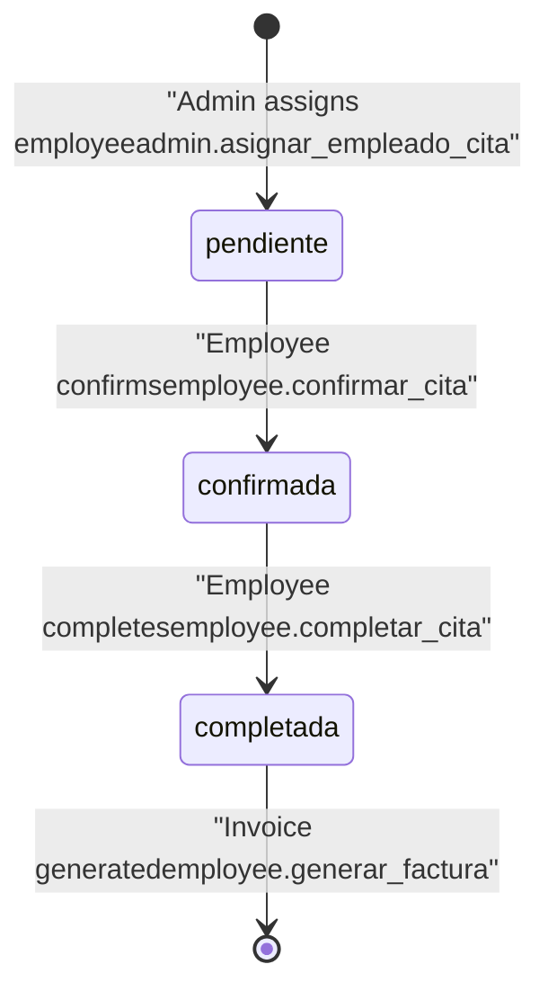
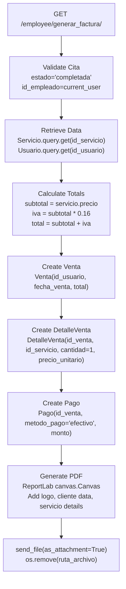
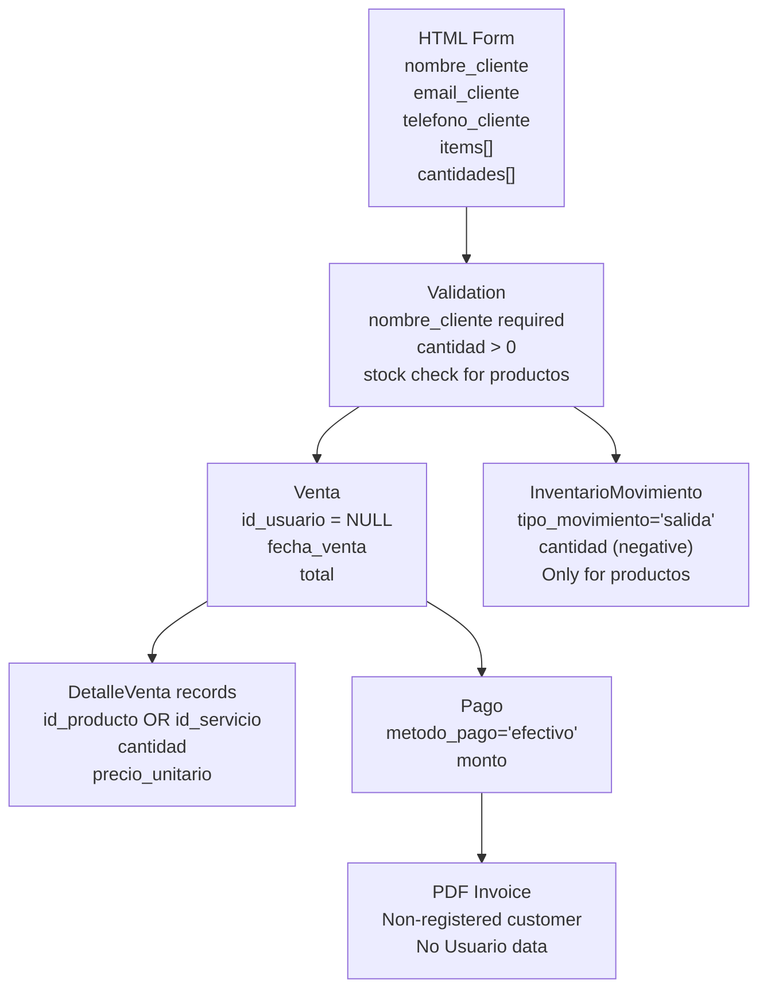
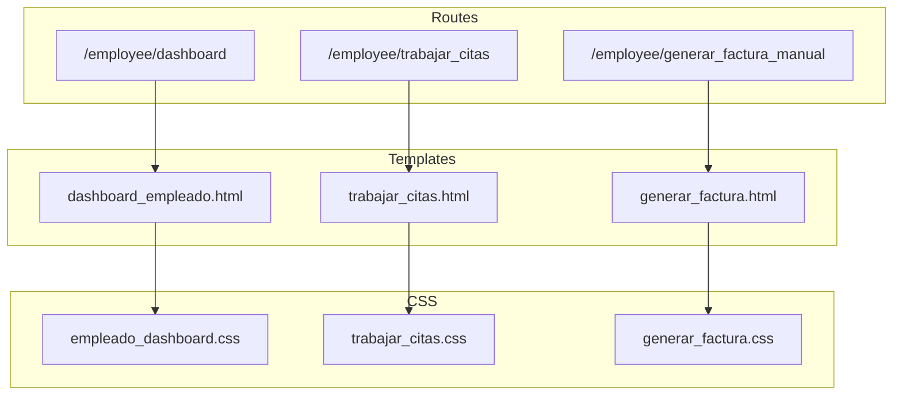

# Employee Features

> **Relevant source files**
> * [app/models/__pycache__/ventas.cpython-313.pyc](https://github.com/GroveLive/CasaBella/blob/5f618972/app/models/__pycache__/ventas.cpython-313.pyc)
> * [app/models/ventas.py](https://github.com/GroveLive/CasaBella/blob/5f618972/app/models/ventas.py)
> * [app/routes/employee.py](https://github.com/GroveLive/CasaBella/blob/5f618972/app/routes/employee.py)
> * [app/static/css/generar_factura.css](https://github.com/GroveLive/CasaBella/blob/5f618972/app/static/css/generar_factura.css)
> * [app/templates/dashboard_empleado.html](https://github.com/GroveLive/CasaBella/blob/5f618972/app/templates/dashboard_empleado.html)
> * [app/templates/generar_factura.html](https://github.com/GroveLive/CasaBella/blob/5f618972/app/templates/generar_factura.html)
> * [app/templates/trabajar_citas.html](https://github.com/GroveLive/CasaBella/blob/5f618972/app/templates/trabajar_citas.html)

## Purpose and Scope

This document covers all functionality available to users with `rol = 'empleado'` in the Casa Bella system. Employees are responsible for fulfilling service appointments and generating invoices for both scheduled appointments and walk-in customers. This includes viewing assigned appointments, managing appointment state transitions, and creating invoices with automatic PDF generation.

For information about how appointments are initially booked by clients, see [Appointment Booking](/GroveLive/CasaBella/5.3-appointment-booking). For details on how administrators assign employees to appointments, see [Appointment Management](/GroveLive/CasaBella/6.4-appointment-management).

**Sources:** [app/routes/employee.py L1-L451](https://github.com/GroveLive/CasaBella/blob/5f618972/app/routes/employee.py#L1-L451)

---

## Employee Role Overview

The employee blueprint provides a self-contained workflow for service fulfillment and invoicing operations. Access to all employee routes is restricted by the `@login_required` decorator and explicit role checking that requires `current_user.rol == 'empleado'`.

### Employee Feature Map

```mermaid
flowchart TD

Dashboard["employee.empleado_dashboard<br>/employee/dashboard"]
TrabajarCitas["employee.trabajar_citas<br>/employee/trabajar_citas"]
ConfirmarCita["employee.confirmar_cita<br>/employee/confirmar_cita/"]
CompletarCita["employee.completar_cita<br>/employee/completar_cita/"]
GenerarFactura["employee.generar_factura<br>/employee/generar_factura/"]
FacturaManual["employee.generar_factura_manual<br>/employee/generar_factura_manual"]
DashboardHTML["dashboard_empleado.html"]
TrabajarHTML["trabajar_citas.html"]
FacturaHTML["generar_factura.html"]
Cita["Cita"]
Venta["Venta"]
DetalleVenta["DetalleVenta"]
Pago["Pago"]
Servicio["Servicio"]
Producto["Producto"]
Notificacion["Notificacion"]
InventarioMovimiento["InventarioMovimiento"]

Dashboard --> DashboardHTML
TrabajarCitas --> TrabajarHTML
FacturaManual --> FacturaHTML
Dashboard --> Cita
TrabajarCitas --> Cita
ConfirmarCita --> Cita
CompletarCita --> Cita
CompletarCita --> Notificacion
GenerarFactura --> Cita
GenerarFactura --> Venta
GenerarFactura --> DetalleVenta
GenerarFactura --> Pago
GenerarFactura --> Servicio
FacturaManual --> Venta
FacturaManual --> DetalleVenta
FacturaManual --> Pago
FacturaManual --> Producto
FacturaManual --> Servicio
FacturaManual --> InventarioMovimiento

subgraph Models ["Models"]
    Cita
    Venta
    DetalleVenta
    Pago
    Servicio
    Producto
    Notificacion
    InventarioMovimiento
end

subgraph Templates ["Templates"]
    DashboardHTML
    TrabajarHTML
    FacturaHTML
end

subgraph subGraph0 ["Employee Blueprint"]
    Dashboard
    TrabajarCitas
    ConfirmarCita
    CompletarCita
    GenerarFactura
    FacturaManual
    CompletarCita --> GenerarFactura
end
```



**Sources:** [app/routes/employee.py L27-L451](https://github.com/GroveLive/CasaBella/blob/5f618972/app/routes/employee.py#L27-L451)

 [app/templates/dashboard_empleado.html L1-L55](https://github.com/GroveLive/CasaBella/blob/5f618972/app/templates/dashboard_empleado.html#L1-L55)

 [app/templates/trabajar_citas.html L1-L117](https://github.com/GroveLive/CasaBella/blob/5f618972/app/templates/trabajar_citas.html#L1-L117)

 [app/templates/generar_factura.html L1-L71](https://github.com/GroveLive/CasaBella/blob/5f618972/app/templates/generar_factura.html#L1-L71)

---

## Employee Dashboard

The employee dashboard provides a summary view of appointment workload and quick access to core employee functions. It displays two key metrics and navigation links to primary workflows.

### Dashboard Route

The `empleado_dashboard` route at `/employee/dashboard` performs role verification and queries appointment counts.

| Metric | Query | Purpose |
| --- | --- | --- |
| Citas Asignadas | `Cita.query.filter_by(id_empleado=current_user.id_usuario, estado='pendiente').count()` | Shows pending appointments assigned to current employee |
| Citas Pendientes | `Cita.query.filter_by(estado='pendiente').count()` | Shows all pending appointments in system |

**Sources:** [app/routes/employee.py L36-L44](https://github.com/GroveLive/CasaBella/blob/5f618972/app/routes/employee.py#L36-L44)

### Dashboard Links

The dashboard template provides navigation to two primary employee workflows:

* **Ver Citas** → `employee.trabajar_citas` - Opens the appointment calendar
* **Generar Factura Manual** → `employee.generar_factura_manual` - Opens manual invoicing form

**Sources:** [app/templates/dashboard_empleado.html L34-L53](https://github.com/GroveLive/CasaBella/blob/5f618972/app/templates/dashboard_empleado.html#L34-L53)

---

## Appointment Management Workflow

Employees manage appointments through a state-based workflow visualized in a FullCalendar interface. The appointment lifecycle progresses through three states: `pendiente` → `confirmada` → `completada`.

### Appointment State Machine



**Sources:** [app/routes/employee.py L98-L144](https://github.com/GroveLive/CasaBella/blob/5f618972/app/routes/employee.py#L98-L144)

### Viewing Assigned Appointments

The `trabajar_citas` route at `/employee/trabajar_citas` retrieves all appointments assigned to the current employee and prepares them for FullCalendar display.

**Query Strategy:**

```
citas = Cita.query.filter_by(id_empleado=current_user.id_usuario)\
    .order_by(Cita.fecha_hora)\
    .options(joinedload(Cita.cliente), joinedload(Cita.empleado))\
    .all()
```

The route generates two JSON structures:

1. **citas_json** - Detailed appointment data for modal display
2. **citas_json_calendar** - Day-level aggregations for calendar grid

**Sources:** [app/routes/employee.py L46-L96](https://github.com/GroveLive/CasaBella/blob/5f618972/app/routes/employee.py#L46-L96)

 [app/templates/trabajar_citas.html L42-L114](https://github.com/GroveLive/CasaBella/blob/5f618972/app/templates/trabajar_citas.html#L42-L114)

### Appointment JSON Structure

Each appointment in `citas_json` contains:

| Field | Source | Description |
| --- | --- | --- |
| `id` | `cita.id_cita` | Appointment identifier |
| `title` | `f'Cita #{cita.id_cita}'` | Calendar event title |
| `start` | `cita.fecha_hora.isoformat()` | ISO 8601 datetime |
| `extendedProps.usuario` | `cita.cliente.nombre` | Client name |
| `extendedProps.servicio` | `servicio.nombre` | Service name via `Servicio.query.get(cita.id_servicio)` |
| `extendedProps.estado` | `cita.estado` | Current state |
| `extendedProps.notas` | `cita.notas` | Appointment notes |

**Sources:** [app/routes/employee.py L59-L75](https://github.com/GroveLive/CasaBella/blob/5f618972/app/routes/employee.py#L59-L75)

### Confirming Appointments

The `confirmar_cita` POST route transitions appointments from `pendiente` to `confirmada` state.

**Validation Rules:**

1. Current user must be the assigned employee (`cita.id_empleado == current_user.id_usuario`)
2. Appointment must be in `pendiente` state
3. Role must be `empleado`

**State Transition:**

```
cita.estado = 'confirmada'
db.session.commit()
```

**Sources:** [app/routes/employee.py L98-L114](https://github.com/GroveLive/CasaBella/blob/5f618972/app/routes/employee.py#L98-L114)

### Completing Appointments

The `completar_cita` POST route finalizes service delivery and triggers the invoicing workflow.

**Validation Rules:**

1. Current user must be the assigned employee
2. Appointment must be in `confirmada` state (must be confirmed before completion)
3. Role must be `empleado`

**State Transition and Notification:**

```sql
cita.estado = 'completada'
db.session.commit()

# Create notification for client
notificacion = Notificacion(
    id_usuario=cita.id_usuario,
    mensaje=f"Tu cita para el {cita.fecha_hora.strftime('%Y-%m-%d %H:%M')} "
            f"con el servicio '{servicio.nombre}' ha sido completada por {current_user.nombre}.",
    tipo='cita'
)
db.session.add(notificacion)
db.session.commit()

# Redirect to invoice generation
return redirect(url_for('employee.generar_factura', id_cita=id_cita))
```

**Sources:** [app/routes/employee.py L116-L144](https://github.com/GroveLive/CasaBella/blob/5f618972/app/routes/employee.py#L116-L144)

---

## Invoice Generation

The employee blueprint supports two invoice generation workflows: automatic generation after completing appointments, and manual generation for walk-in customers.

### Automatic Invoice Generation

The `generar_factura` route at `/employee/generar_factura/<int:id_cita>` automatically creates a sale record and PDF invoice for a completed appointment.

#### Invoice Generation Flow



**Sources:** [app/routes/employee.py L146-L278](https://github.com/GroveLive/CasaBella/blob/5f618972/app/routes/employee.py#L146-L278)

#### IVA Calculation

All invoices apply a 16% IVA (Value Added Tax) rate defined as a module constant:

```
IVA_RATE = Decimal("0.16")
```

**Sources:** [app/routes/employee.py L34](https://github.com/GroveLive/CasaBella/blob/5f618972/app/routes/employee.py#L34-L34)

#### Database Transaction for Appointment Invoice

The invoice generation creates three related records atomically:

| Model | Fields | Purpose |
| --- | --- | --- |
| `Venta` | `id_usuario`, `fecha_venta`, `total` | Main sale record |
| `DetalleVenta` | `id_venta`, `id_servicio`, `cantidad=1`, `precio_unitario` | Line item for service |
| `Pago` | `id_venta`, `metodo_pago='efectivo'`, `monto` | Payment record |

**Sources:** [app/routes/employee.py L181-L196](https://github.com/GroveLive/CasaBella/blob/5f618972/app/routes/employee.py#L181-L196)

#### PDF Generation with ReportLab

Invoice PDFs are generated using ReportLab and include:

1. **Circular Logo** - Casa Bella logo from `app/static/images/casa-bella-logo.jpeg` converted to circular mask using PIL
2. **Header** - Company name "Casa Bella" and subtitle "Salón de Belleza y Distribuidora"
3. **Client Data** - Name, email, phone from `Usuario` model
4. **Service Details** - Service name, quantity (always 1), price
5. **Financial Summary** - Subtotal, IVA (16%), Total

**PDF File Lifecycle:**

```sql
nombre_archivo = f'factura_{cita.id_usuario}_{venta.id_venta}_{datetime.now().strftime("%Y%m%d_%H%M%S")}.pdf'
ruta_archivo = os.path.join(os.path.dirname(__file__), '..', 'static', nombre_archivo)

# Generate PDF
c = canvas.Canvas(ruta_archivo, pagesize=letter)
# ... PDF content generation ...
c.save()

# Send and immediately delete
response = send_file(ruta_archivo, as_attachment=True, download_name=nombre_archivo)
if os.path.exists(ruta_archivo):
    os.remove(ruta_archivo)
return response
```

**Sources:** [app/routes/employee.py L198-L278](https://github.com/GroveLive/CasaBella/blob/5f618972/app/routes/employee.py#L198-L278)

### Manual Invoice Generation

The `generar_factura_manual` route at `/employee/generar_factura_manual` enables employees to create invoices for walk-in customers who are not registered in the system.

#### Manual Invoice Form

The form accepts:

* **Customer Information:** Name (required), email (optional), phone (optional)
* **Line Items:** Dynamic list of products/services with quantities

**Dynamic Item Addition:**
The template includes JavaScript to clone item rows, allowing multiple products/services per invoice.

**Sources:** [app/templates/generar_factura.html L19-L71](https://github.com/GroveLive/CasaBella/blob/5f618972/app/templates/generar_factura.html#L19-L71)

#### Manual Invoice Processing

The POST handler processes multiple items and creates sale records without a `id_usuario` association:

```
venta = Venta(id_usuario=None, fecha_venta=datetime.utcnow(), total=total)
```

**Sources:** [app/routes/employee.py L341-L343](https://github.com/GroveLive/CasaBella/blob/5f618972/app/routes/employee.py#L341-L343)

#### Inventory Deduction for Products

When manual invoices include products (not services), inventory is automatically decremented:

```css
if producto:
    if producto.stock < cantidad:
        flash(f"Stock insuficiente para el producto {producto.nombre}.", "danger")
        return redirect(url_for('employee.generar_factura_manual'))
    
    producto.stock -= cantidad
    
    # Track inventory movement
    movimiento = InventarioMovimiento(
        id_producto=item_id,
        tipo_movimiento='salida',
        cantidad=-cantidad,
        motivo=f'Venta manual ID: {datetime.utcnow().strftime("%Y%m%d_%H%M%S")}'
    )
    db.session.add(movimiento)
```

**Sources:** [app/routes/employee.py L310-L321](https://github.com/GroveLive/CasaBella/blob/5f618972/app/routes/employee.py#L310-L321)

#### Manual Invoice Data Structure



**Sources:** [app/routes/employee.py L280-L447](https://github.com/GroveLive/CasaBella/blob/5f618972/app/routes/employee.py#L280-L447)

### PDF Invoice Differences

| Feature | Automatic Invoice | Manual Invoice |
| --- | --- | --- |
| Header | "FACTURA" | "FACTURA (Cliente No Registrado)" |
| Customer Data | From `Usuario` model | From form inputs |
| `Venta.id_usuario` | `cita.id_usuario` | `NULL` |
| Line Items | Single service | Multiple products/services |
| Inventory Tracking | Not applicable (services) | `InventarioMovimiento` for products |
| Filename | `factura_{id_usuario}_{id_venta}_{timestamp}.pdf` | `factura_manual_{id_venta}_{timestamp}.pdf` |

**Sources:** [app/routes/employee.py L198-L278](https://github.com/GroveLive/CasaBella/blob/5f618972/app/routes/employee.py#L198-L278)

 [app/routes/employee.py L365-L447](https://github.com/GroveLive/CasaBella/blob/5f618972/app/routes/employee.py#L365-L447)

---

## Access Control and Authorization

All employee routes implement multi-layer authorization:

### Route Protection Pattern

```python
@bp.route('/trabajar_citas')
@login_required
def trabajar_citas():
    if current_user.rol != 'empleado':
        flash("Acceso denegado. Solo para empleados.", "danger")
        return redirect(url_for('auth.login'))
    # ... route logic ...
```

**Sources:** [app/routes/employee.py L46-L51](https://github.com/GroveLive/CasaBella/blob/5f618972/app/routes/employee.py#L46-L51)

### Appointment-Specific Authorization

For appointment modification routes, additional checks ensure employees can only act on their assigned appointments:

```
cita = Cita.query.get_or_404(id_cita)
if cita.id_empleado != current_user.id_usuario:
    flash("No tienes permiso para confirmar esta cita.", "danger")
    return redirect(url_for('employee.trabajar_citas'))
```

**Sources:** [app/routes/employee.py L104-L107](https://github.com/GroveLive/CasaBella/blob/5f618972/app/routes/employee.py#L104-L107)

### Authorization Check Summary

| Route | Flask-Login | Role Check | Appointment Ownership |
| --- | --- | --- | --- |
| `empleado_dashboard` | ✓ | `rol == 'empleado'` | N/A |
| `trabajar_citas` | ✓ | `rol == 'empleado'` | N/A (view only own) |
| `confirmar_cita` | ✓ | `rol == 'empleado'` | `id_empleado == current_user.id_usuario` |
| `completar_cita` | ✓ | `rol == 'empleado'` | `id_empleado == current_user.id_usuario` |
| `generar_factura` | ✓ | `rol == 'empleado'` | `id_empleado == current_user.id_usuario` |
| `generar_factura_manual` | ✓ | `rol == 'empleado'` | N/A |

**Sources:** [app/routes/employee.py L36-L451](https://github.com/GroveLive/CasaBella/blob/5f618972/app/routes/employee.py#L36-L451)

---

## FullCalendar Integration

The appointment management interface uses FullCalendar 5.11.0 to provide a visual calendar view with interactive date selection.

### Calendar Configuration

```javascript
var calendar = new FullCalendar.Calendar(calendarEl, {
    initialView: 'dayGridMonth',
    events: {{ citas_json_calendar|safe }},
    dateClick: function(info) {
        // Show modal with appointments for selected date
    }
});
```

**Sources:** [app/templates/trabajar_citas.html L45-L112](https://github.com/GroveLive/CasaBella/blob/5f618972/app/templates/trabajar_citas.html#L45-L112)

### Modal-Based Appointment Actions

When an employee clicks a date, a Bootstrap modal displays all appointments for that date with context-sensitive action buttons:

| Appointment State | Available Actions |
| --- | --- |
| `pendiente` | **Confirmar** button → POST to `/employee/confirmar_cita/<id>` |
| `confirmada` | **Completar y Facturar** button → POST to `/employee/completar_cita/<id>` |
| `completada` | **Descargar Factura** link → GET to `/employee/generar_factura/<id>` |

**Sources:** [app/templates/trabajar_citas.html L76-L101](https://github.com/GroveLive/CasaBella/blob/5f618972/app/templates/trabajar_citas.html#L76-L101)

### Calendar Event Filtering

The modal filters appointments by date using client-side JavaScript:

```javascript
var citasDelDia = {{ citas_json|safe }}.filter(cita => {
    return new Date(cita.start).toISOString().split('T')[0] === fecha;
});
```

**Sources:** [app/templates/trabajar_citas.html L57-L59](https://github.com/GroveLive/CasaBella/blob/5f618972/app/templates/trabajar_citas.html#L57-L59)

---

## Technical Architecture

### Blueprint Registration

The employee blueprint is registered with URL prefix `/employee`:

```python
bp = Blueprint('employee', __name__, url_prefix='/employee')
```

**Sources:** [app/routes/employee.py L27](https://github.com/GroveLive/CasaBella/blob/5f618972/app/routes/employee.py#L27-L27)

### Route-to-Template Mapping



**Sources:** [app/routes/employee.py L36-L451](https://github.com/GroveLive/CasaBella/blob/5f618972/app/routes/employee.py#L36-L451)

 [app/templates/dashboard_empleado.html L4](https://github.com/GroveLive/CasaBella/blob/5f618972/app/templates/dashboard_empleado.html#L4-L4)

 [app/templates/trabajar_citas.html L4](https://github.com/GroveLive/CasaBella/blob/5f618972/app/templates/trabajar_citas.html#L4-L4)

 [app/templates/generar_factura.html L4](https://github.com/GroveLive/CasaBella/blob/5f618972/app/templates/generar_factura.html#L4-L4)

### External Dependencies

| Library | Version | Usage |
| --- | --- | --- |
| ReportLab | Latest | PDF invoice generation via `canvas.Canvas` |
| PIL (Pillow) | Latest | Logo image processing for circular mask |
| FullCalendar | 5.11.0 | Interactive appointment calendar |
| Bootstrap | 5.3.0 | Modal dialogs and form styling |

**Sources:** [app/routes/employee.py L18-L25](https://github.com/GroveLive/CasaBella/blob/5f618972/app/routes/employee.py#L18-L25)

 [app/templates/trabajar_citas.html L5](https://github.com/GroveLive/CasaBella/blob/5f618972/app/templates/trabajar_citas.html#L5-L5)

 [app/templates/trabajar_citas.html L116](https://github.com/GroveLive/CasaBella/blob/5f618972/app/templates/trabajar_citas.html#L116-L116)

### Database Models Used

The employee blueprint interacts with eight database models:

| Model | Primary Use | Foreign Keys |
| --- | --- | --- |
| `Cita` | Appointment tracking | `id_usuario`, `id_empleado`, `id_servicio` |
| `Servicio` | Service details and pricing | None |
| `Usuario` | Client and employee information | None |
| `Venta` | Sale transaction records | `id_usuario` (nullable) |
| `DetalleVenta` | Line items for sales | `id_venta`, `id_producto`, `id_servicio` |
| `Pago` | Payment information | `id_venta` |
| `Producto` | Product inventory and pricing | None |
| `InventarioMovimiento` | Inventory change tracking | `id_producto` |
| `Notificacion` | Client notifications | `id_usuario` |

**Sources:** [app/routes/employee.py L3-L12](https://github.com/GroveLive/CasaBella/blob/5f618972/app/routes/employee.py#L3-L12)

### Error Handling Pattern

All routes follow a consistent error handling pattern with flash messages and redirects:

```
if not_valid_condition:
    flash("Error message", "danger")
    return redirect(url_for('employee.trabajar_citas'))
```

**Sources:** [app/routes/employee.py L102-L114](https://github.com/GroveLive/CasaBella/blob/5f618972/app/routes/employee.py#L102-L114)

 [app/routes/employee.py L119-L128](https://github.com/GroveLive/CasaBella/blob/5f618972/app/routes/employee.py#L119-L128)