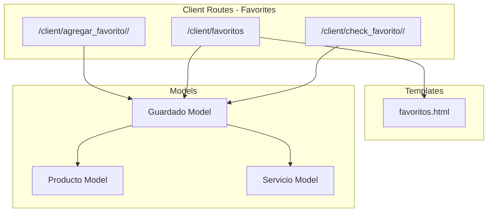
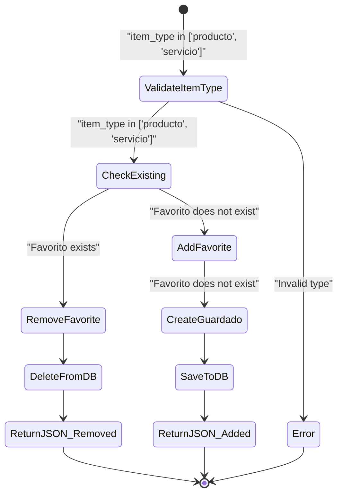
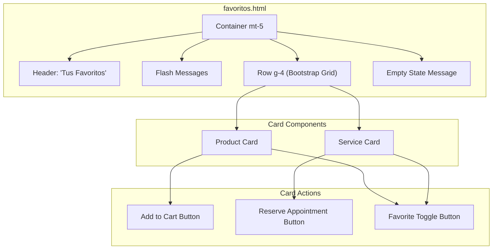
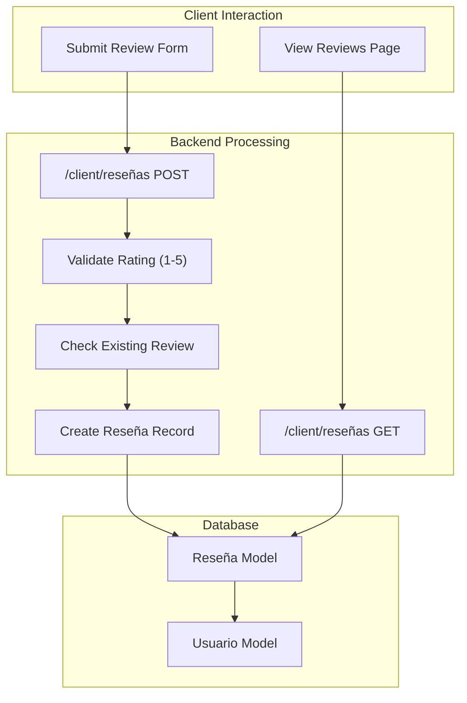
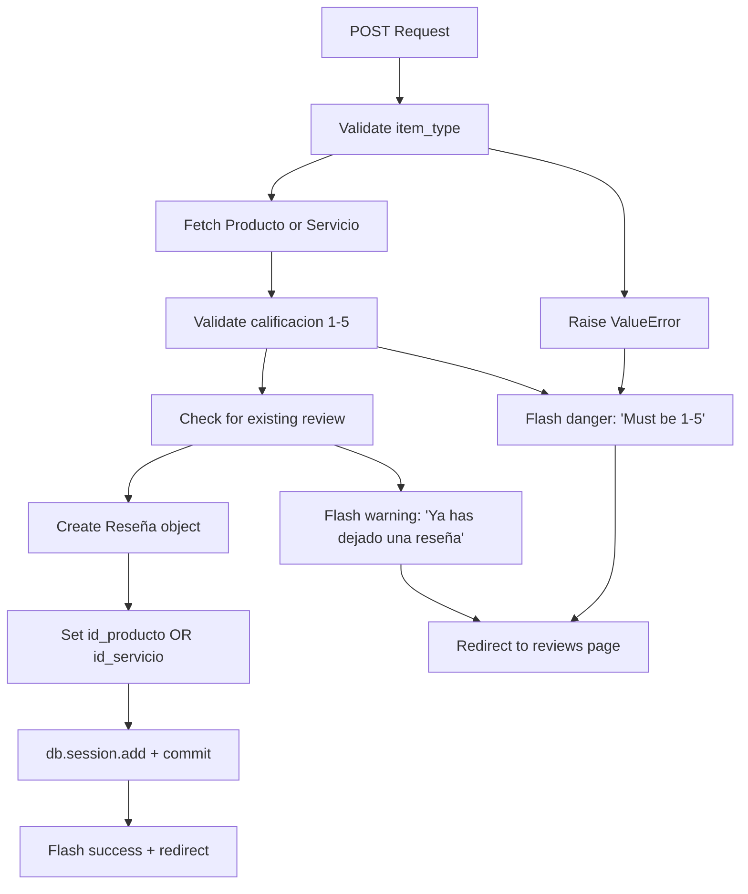
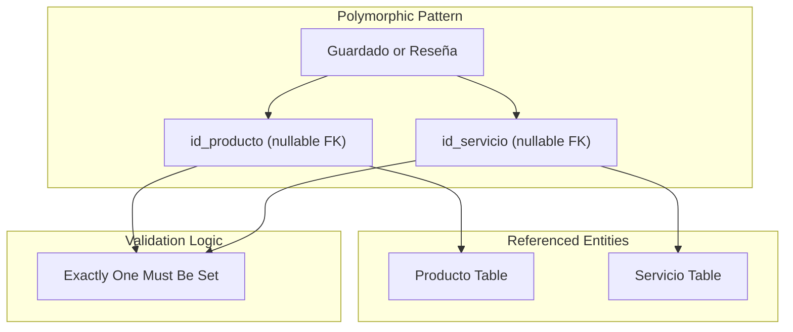

# Favorites & Reviews

> **Relevant source files**
> * [app/routes/client.py](https://github.com/GroveLive/CasaBella/blob/5f618972/app/routes/client.py)
> * [app/templates/favoritos.html](https://github.com/GroveLive/CasaBella/blob/5f618972/app/templates/favoritos.html)

This document describes the client-facing favorites and reviews systems that enable users to save products/services for later and provide ratings and feedback. These features enhance user engagement by allowing clients to curate personal collections and share experiences.

For information about the product and service catalog browsing, see [Product & Service Catalog](/GroveLive/CasaBella/5.1-product-and-service-catalog). For shopping cart functionality, see [Shopping Cart & Checkout](/GroveLive/CasaBella/5.2-shopping-cart-and-checkout). For the client dashboard where favorites and reviews are accessed, see [Client Dashboard & Profile](/GroveLive/CasaBella/5.4-client-dashboard-and-profile).

---

## Purpose and Scope

The Favorites & Reviews system provides two distinct but related features:

1. **Favorites (Guardados)**: Allows clients to bookmark products and services for future reference, creating a personalized collection accessible from a dedicated page
2. **Reviews (Reseñas)**: Enables clients to rate and comment on products/services they have purchased or used, providing feedback visible to other users

Both systems use polymorphic references to support both `Producto` and `Servicio` entities, implementing nullable foreign keys `id_producto` and `id_servicio` in their respective models.

---

## Data Model Overview

The system uses two primary models that reference both products and services through a polymorphic pattern:

```css
#mermaid-bkksj2ext9c{font-family:ui-sans-serif,-apple-system,system-ui,Segoe UI,Helvetica;font-size:16px;fill:#333;}@keyframes edge-animation-frame{from{stroke-dashoffset:0;}}@keyframes dash{to{stroke-dashoffset:0;}}#mermaid-bkksj2ext9c .edge-animation-slow{stroke-dasharray:9,5!important;stroke-dashoffset:900;animation:dash 50s linear infinite;stroke-linecap:round;}#mermaid-bkksj2ext9c .edge-animation-fast{stroke-dasharray:9,5!important;stroke-dashoffset:900;animation:dash 20s linear infinite;stroke-linecap:round;}#mermaid-bkksj2ext9c .error-icon{fill:#dddddd;}#mermaid-bkksj2ext9c .error-text{fill:#222222;stroke:#222222;}#mermaid-bkksj2ext9c .edge-thickness-normal{stroke-width:1px;}#mermaid-bkksj2ext9c .edge-thickness-thick{stroke-width:3.5px;}#mermaid-bkksj2ext9c .edge-pattern-solid{stroke-dasharray:0;}#mermaid-bkksj2ext9c .edge-thickness-invisible{stroke-width:0;fill:none;}#mermaid-bkksj2ext9c .edge-pattern-dashed{stroke-dasharray:3;}#mermaid-bkksj2ext9c .edge-pattern-dotted{stroke-dasharray:2;}#mermaid-bkksj2ext9c .marker{fill:#999;stroke:#999;}#mermaid-bkksj2ext9c .marker.cross{stroke:#999;}#mermaid-bkksj2ext9c svg{font-family:ui-sans-serif,-apple-system,system-ui,Segoe UI,Helvetica;font-size:16px;}#mermaid-bkksj2ext9c p{margin:0;}#mermaid-bkksj2ext9c .entityBox{fill:#ffffff;stroke:#dddddd;}#mermaid-bkksj2ext9c .relationshipLabelBox{fill:#dddddd;opacity:0.7;background-color:#dddddd;}#mermaid-bkksj2ext9c .relationshipLabelBox rect{opacity:0.5;}#mermaid-bkksj2ext9c .labelBkg{background-color:rgba(221, 221, 221, 0.5);}#mermaid-bkksj2ext9c .edgeLabel .label{fill:#dddddd;font-size:14px;}#mermaid-bkksj2ext9c .label{font-family:ui-sans-serif,-apple-system,system-ui,Segoe UI,Helvetica;color:#333;}#mermaid-bkksj2ext9c .edge-pattern-dashed{stroke-dasharray:8,8;}#mermaid-bkksj2ext9c .node rect,#mermaid-bkksj2ext9c .node circle,#mermaid-bkksj2ext9c .node ellipse,#mermaid-bkksj2ext9c .node polygon{fill:#ffffff;stroke:#dddddd;stroke-width:1px;}#mermaid-bkksj2ext9c .relationshipLine{stroke:#999;stroke-width:1;fill:none;}#mermaid-bkksj2ext9c .marker{fill:none!important;stroke:#999!important;stroke-width:1;}#mermaid-bkksj2ext9c :root{--mermaid-font-family:"trebuchet ms",verdana,arial,sans-serif;}saveswritesreferences (nullable)references (nullable)reviews (nullable)reviews (nullable)Usuariointid_usuarioPKstringnombrestringemailenumrolGuardadointid_guardadoPKintid_usuarioFKintid_productoFKnullableintid_servicioFKnullabledatetimefecha_guardadoResenaintid_resenaPKintid_usuarioFKintid_productoFKnullableintid_servicioFKnullableintcalificacion1-5textcomentariodatetimefecha_resenaProductointid_productoPKstringnombredecimalpreciointstockServiciointid_servicioPKstringnombredecimalpreciointduracion
```

**Sources:** [app/routes/client.py L13-L14](https://github.com/GroveLive/CasaBella/blob/5f618972/app/routes/client.py#L13-L14)

---

## Favorites System

The favorites system allows clients to save products and services to a personal collection. The system implements toggle functionality where clicking the favorite button adds or removes items.

### Routes and Endpoints



**Sources:** [app/routes/client.py L857-L931](https://github.com/GroveLive/CasaBella/blob/5f618972/app/routes/client.py#L857-L931)

### Adding and Removing Favorites

The `agregar_favorito` route implements a toggle mechanism that adds or removes favorites based on current state.

**Route:** `/client/agregar_favorito/<string:item_type>/<int:item_id>`
**Method:** `POST`
**Authentication:** Required (`@login_required`)
**Role:** `cliente` only

**Process Flow:**



**Implementation Details:**

| Step | Code Location | Description |
| --- | --- | --- |
| Validate role | [app/routes/client.py L860-L862](https://github.com/GroveLive/CasaBella/blob/5f618972/app/routes/client.py#L860-L862) | Ensures `current_user.rol == 'cliente'` |
| Validate item type | [app/routes/client.py L864-L865](https://github.com/GroveLive/CasaBella/blob/5f618972/app/routes/client.py#L864-L865) | Only accepts `'producto'` or `'servicio'` |
| Query existing | [app/routes/client.py L866-L870](https://github.com/GroveLive/CasaBella/blob/5f618972/app/routes/client.py#L866-L870) | Checks for existing `Guardado` with matching user and item |
| Toggle logic | [app/routes/client.py L877-L891](https://github.com/GroveLive/CasaBella/blob/5f618972/app/routes/client.py#L877-L891) | Deletes if exists, creates if not |
| JSON response | [app/routes/client.py L881-L891](https://github.com/GroveLive/CasaBella/blob/5f618972/app/routes/client.py#L881-L891) | Returns `{success, added, message}` |

**Sources:** [app/routes/client.py L857-L896](https://github.com/GroveLive/CasaBella/blob/5f618972/app/routes/client.py#L857-L896)

### Viewing Favorites

The `favoritos` route displays all saved items in a card-based layout.

**Route:** `/client/favoritos`
**Method:** `GET`
**Authentication:** Required (`@login_required`)
**Role:** `cliente` only

**Query Strategy:**

```
favoritos = Guardado.query.options(
    joinedload(Guardado.producto),
    joinedload(Guardado.servicio)
).filter_by(id_usuario=current_user.id_usuario).all()
```

The query uses `joinedload` to eager-load both product and service relationships, preventing N+1 query problems when rendering the template.

**Sources:** [app/routes/client.py L898-L913](https://github.com/GroveLive/CasaBella/blob/5f618972/app/routes/client.py#L898-L913)

### Checking Favorite Status

The `check_favorito` route provides a lightweight endpoint to check if an item is currently favorited.

**Route:** `/client/check_favorito/<string:item_type>/<int:item_id>`
**Method:** `GET`
**Authentication:** Required (`@login_required`)
**Role:** `cliente` only

**Response Format:**

```
{
    "success": true,
    "is_favorite": true|false
}
```

This endpoint is used by frontend JavaScript to initialize favorite button states when pages load.

**Sources:** [app/routes/client.py L915-L931](https://github.com/GroveLive/CasaBella/blob/5f618972/app/routes/client.py#L915-L931)

---

## Frontend Integration

The favorites system uses AJAX to provide seamless add/remove functionality without page reloads.

### Favorites Page Template Structure



**Sources:** [app/templates/favoritos.html L15-L85](https://github.com/GroveLive/CasaBella/blob/5f618972/app/templates/favoritos.html#L15-L85)

### AJAX Favorite Toggle

The frontend implements jQuery AJAX to toggle favorites:

| Element | Implementation |
| --- | --- |
| Button selector | `.favorite-btn` class on buttons |
| Data attributes | `data-item-type="producto |
| Click handler | [app/templates/favoritos.html L94-L122](https://github.com/GroveLive/CasaBella/blob/5f618972/app/templates/favoritos.html#L94-L122) |
| Success action | Updates button state or removes card from DOM |
| Visual feedback | Toggles `.active` class and icon between `bi-heart`/`bi-heart-fill` |

**Card Removal Logic:**

When a favorite is removed from the favorites page, the entire card is removed from the DOM:

```html
button.closest('.col-md-6').remove();
if ($('.col-md-6').length === 0) {
    $('.row.g-4').after('<p class="text-center">No tienes productos ni servicios en favoritos.</p>');
}
```

**Sources:** [app/templates/favoritos.html L88-L124](https://github.com/GroveLive/CasaBella/blob/5f618972/app/templates/favoritos.html#L88-L124)

---

## Reviews System

The reviews system enables clients to rate products and services on a 1-5 scale with optional text comments.

### Review Routes and Flow



**Sources:** [app/routes/client.py L933-L983](https://github.com/GroveLive/CasaBella/blob/5f618972/app/routes/client.py#L933-L983)

### Creating Reviews

**Route:** `/client/reseñas/<string:item_type>/<int:item_id>`
**Method:** `POST`
**Authentication:** Required (`@login_required`)
**Role:** `cliente` only

**Request Parameters:**

| Parameter | Type | Required | Validation |
| --- | --- | --- | --- |
| `calificacion` | `int` | Yes | Must be between 1 and 5 |
| `comentario` | `string` | No | Trimmed whitespace |
| `item_type` | URL param | Yes | Must be `'producto'` or `'servicio'` |
| `item_id` | URL param | Yes | Valid product or service ID |

**Validation Rules:**



**Duplicate Prevention:**

The system prevents users from submitting multiple reviews for the same item:

```
existing_review = Reseña.query.filter_by(
    id_usuario=current_user.id_usuario,
    id_producto=item_id if item_type == 'producto' else None,
    id_servicio=item_id if item_type == 'servicio' else None
).first()
```

**Sources:** [app/routes/client.py L948-L972](https://github.com/GroveLive/CasaBella/blob/5f618972/app/routes/client.py#L948-L972)

### Viewing Reviews

**Route:** `/client/reseñas/<string:item_type>/<int:item_id>`
**Method:** `GET`
**Authentication:** Required (`@login_required`)
**Role:** `cliente` only

**Query Implementation:**

The route fetches all reviews for a specific item with eager-loaded user data:

```
reviews = Reseña.query.options(
    joinedload(Reseña.usuario)
).filter(
    (Reseña.id_producto == item_id) if item_type == 'producto' else (Reseña.id_servicio == item_id)
).all()
```

The `joinedload(Reseña.usuario)` ensures that user names are available when rendering reviews without additional queries.

**Template Context:**

| Variable | Description |
| --- | --- |
| `item_type` | `'producto'` or `'servicio'` |
| `item_id` | The ID of the product or service |
| `item_name` | The name of the item being reviewed |
| `reviews` | List of `Reseña` objects with loaded `usuario` relationship |

**Sources:** [app/routes/client.py L973-L978](https://github.com/GroveLive/CasaBella/blob/5f618972/app/routes/client.py#L973-L978)

---

## Polymorphic Reference Pattern

Both `Guardado` and `Reseña` models use the same polymorphic pattern to reference either products or services:



**Implementation Rules:**

1. **Exactly One FK Must Be Set:** Either `id_producto` or `id_servicio` must be non-null, but never both
2. **Filter by Type:** When querying, use conditional logic to filter by the appropriate FK
3. **Type Discrimination:** The `item_type` parameter (`'producto'` or `'servicio'`) determines which FK to populate

**Route Type Handling:**

| Operation | Type Parameter | Producto FK | Servicio FK |
| --- | --- | --- | --- |
| Save Product | `item_type='producto'` | `id_producto=item_id` | `id_servicio=None` |
| Save Service | `item_type='servicio'` | `id_producto=None` | `id_servicio=item_id` |

**Sources:** [app/routes/client.py L864-L870](https://github.com/GroveLive/CasaBella/blob/5f618972/app/routes/client.py#L864-L870)

 [app/routes/client.py L883-L887](https://github.com/GroveLive/CasaBella/blob/5f618972/app/routes/client.py#L883-L887)

 [app/routes/client.py L954-L967](https://github.com/GroveLive/CasaBella/blob/5f618972/app/routes/client.py#L954-L967)

---

## Error Handling

Both systems implement comprehensive error handling:

### Favorites Error Handling

| Error Type | HTTP Status | Response |
| --- | --- | --- |
| Invalid item type | 500 | `{'success': False, 'message': 'Tipo de item inválido.'}` |
| Database error | 500 | `{'success': False, 'message': 'Ocurrió un error: {error}'}` |
| Unauthorized access | 403 (implied by redirect) | Flash message + redirect to login |

**Sources:** [app/routes/client.py L860-L862](https://github.com/GroveLive/CasaBella/blob/5f618972/app/routes/client.py#L860-L862)

 [app/routes/client.py L892-L896](https://github.com/GroveLive/CasaBella/blob/5f618972/app/routes/client.py#L892-L896)

### Reviews Error Handling

| Error Type | Action | Message |
| --- | --- | --- |
| Invalid item type | Flash danger + redirect | "Tipo de item inválido." |
| Invalid rating | Flash danger + redirect | "La calificación debe estar entre 1 y 5." |
| Duplicate review | Flash warning + redirect | "Ya has dejado una reseña para este item." |
| Database error | Flash danger + redirect | "Ocurrió un error: {error}." |

**Rollback Strategy:**

Both systems use transaction rollback on exceptions:

```
except Exception as e:
    db.session.rollback()
    logger.error(f"Error al gestionar favorito: {str(e)}")
    flash(f"Ocurrió un error: {str(e)}.", "danger")
    return jsonify({'success': False, 'message': f"Ocurrió un error: {str(e)}"}), 500
```

**Sources:** [app/routes/client.py L892-L896](https://github.com/GroveLive/CasaBella/blob/5f618972/app/routes/client.py#L892-L896)

 [app/routes/client.py L979-L983](https://github.com/GroveLive/CasaBella/blob/5f618972/app/routes/client.py#L979-L983)

---

## Integration with Other Systems

### Product and Service Catalogs

Favorites are typically added from the product/service catalog pages where favorite buttons are integrated into card layouts. The AJAX favorite toggle maintains the user's position on the page without disruption.

**Related Routes:**

* `/client/productos` - Product catalog with favorite buttons
* `/client/servicios` - Service catalog with favorite buttons

### Client Dashboard

Both favorites and reviews are accessible from the client dashboard navigation, providing quick access to saved items and review history.

**Related Routes:**

* `/client/dashboard` - Main client dashboard
* `/client/perfil` - Client profile page

**Sources:** [app/routes/client.py L457-L478](https://github.com/GroveLive/CasaBella/blob/5f618972/app/routes/client.py#L457-L478)

---

## Database Schema Summary

### Guardado Table

| Column | Type | Constraints | Description |
| --- | --- | --- | --- |
| `id_guardado` | `INTEGER` | PRIMARY KEY | Unique identifier |
| `id_usuario` | `INTEGER` | FOREIGN KEY | Reference to Usuario |
| `id_producto` | `INTEGER` | FOREIGN KEY, NULLABLE | Reference to Producto (XOR with id_servicio) |
| `id_servicio` | `INTEGER` | FOREIGN KEY, NULLABLE | Reference to Servicio (XOR with id_producto) |
| `fecha_guardado` | `DATETIME` | DEFAULT CURRENT_TIMESTAMP | When item was saved |

### Reseña Table

| Column | Type | Constraints | Description |
| --- | --- | --- | --- |
| `id_resena` | `INTEGER` | PRIMARY KEY | Unique identifier |
| `id_usuario` | `INTEGER` | FOREIGN KEY | Reference to Usuario |
| `id_producto` | `INTEGER` | FOREIGN KEY, NULLABLE | Reference to Producto (XOR with id_servicio) |
| `id_servicio` | `INTEGER` | FOREIGN KEY, NULLABLE | Reference to Servicio (XOR with id_servicio) |
| `calificacion` | `INTEGER` | CHECK (1-5) | Rating score |
| `comentario` | `TEXT` | NULLABLE | Optional review text |
| `fecha_resena` | `DATETIME` | DEFAULT CURRENT_TIMESTAMP | When review was created |

**Sources:** [app/routes/client.py L13-L14](https://github.com/GroveLive/CasaBella/blob/5f618972/app/routes/client.py#L13-L14)