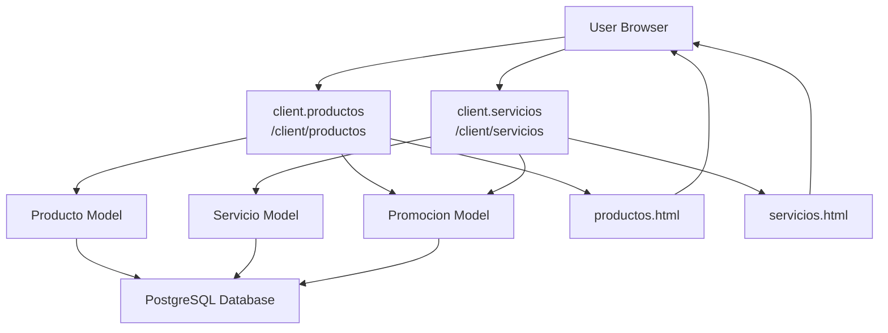
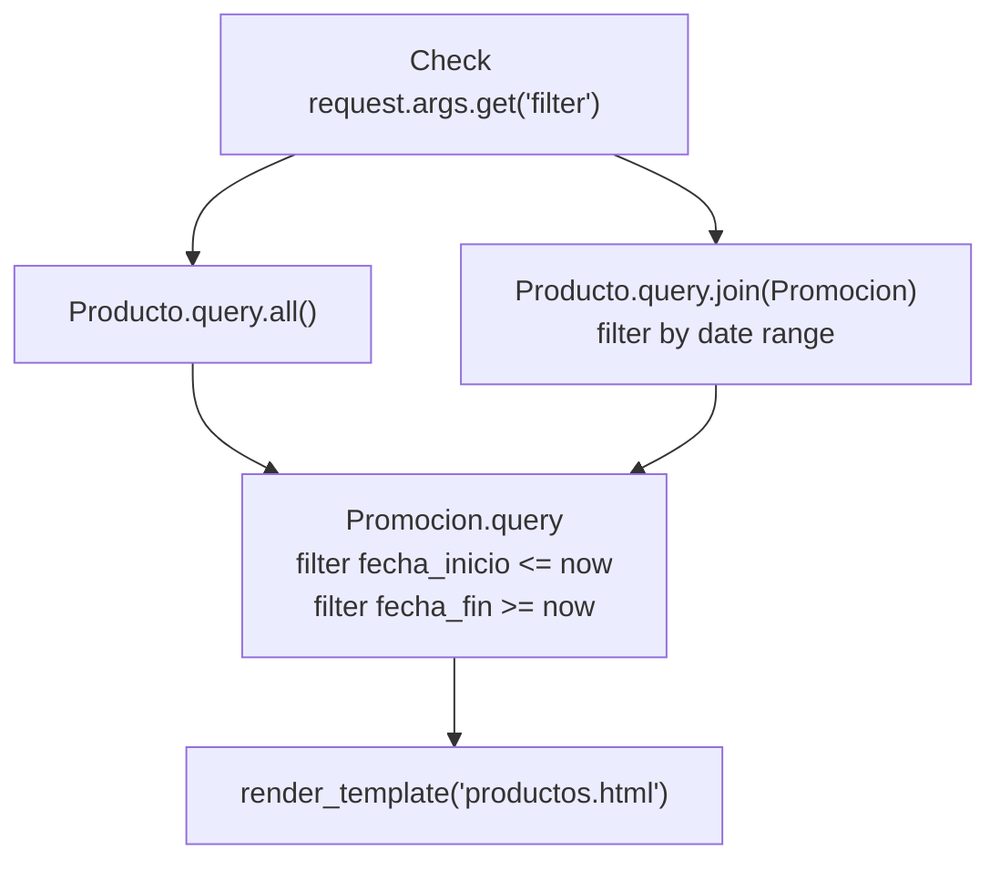
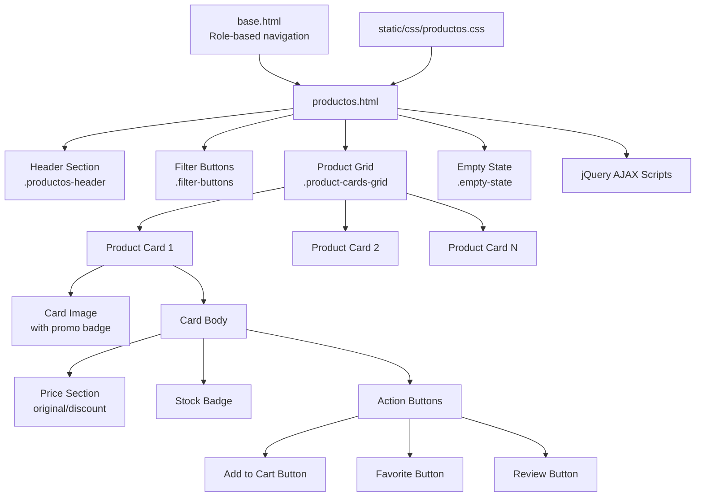
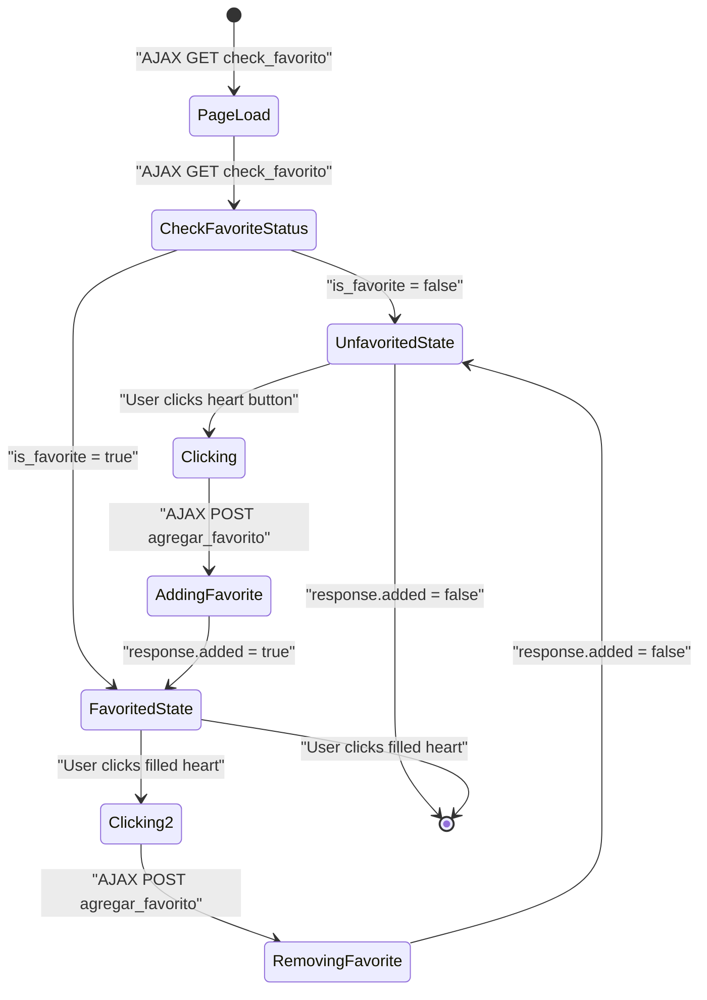
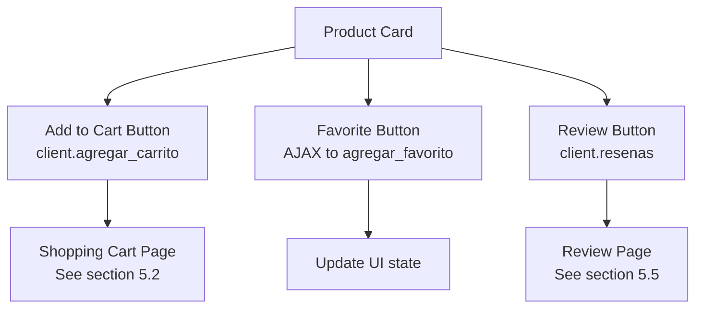

# Product & Service Catalog

> **Relevant source files**
> * [app/routes/client.py](https://github.com/GroveLive/CasaBella/blob/5f618972/app/routes/client.py)
> * [app/templates/productos.html](https://github.com/GroveLive/CasaBella/blob/5f618972/app/templates/productos.html)
> * [app/templates/servicios.html](https://github.com/GroveLive/CasaBella/blob/5f618972/app/templates/servicios.html)

## Purpose and Scope

This page documents the client-facing product and service catalog system, which allows customers to browse available inventory items and bookable services. It covers the backend route handlers, database queries, promotion application logic, frontend templates, and AJAX interactions that enable catalog browsing with dynamic filtering and favoriting capabilities.

For information about adding items to the shopping cart, see [Shopping Cart & Checkout](/GroveLive/CasaBella/5.2-shopping-cart-and-checkout). For appointment booking details, see [Appointment Booking](/GroveLive/CasaBella/5.3-appointment-booking). For managing favorites and reviews, see [Favorites & Reviews](/GroveLive/CasaBella/5.5-favorites-and-reviews).

---

## System Overview

The catalog system provides two parallel browsing interfaces: one for physical products (inventory items) and one for bookable services. Both interfaces share similar architectural patterns but differ in the metadata displayed (products show stock levels, services show duration) and the actions available (products can be added to cart, services lead to appointment booking).

### Catalog Request Flow



**Sources:** [app/routes/client.py L52-L94](https://github.com/GroveLive/CasaBella/blob/5f618972/app/routes/client.py#L52-L94)

---

## Product Catalog

### Route Handler: /client/productos

The `client.productos` route handles product catalog display with optional promotion filtering. Access is restricted to users with `rol='cliente'`.

| Aspect | Implementation |
| --- | --- |
| Route | `/client/productos` |
| Method | `GET` |
| Authorization | `@login_required`, role check for `'cliente'` |
| Filter Parameter | `?filter=promotions` for promotion-only view |
| Template | `productos.html` |

The route handler implements the following logic:

**Sources:** [app/routes/client.py L74-L94](https://github.com/GroveLive/CasaBella/blob/5f618972/app/routes/client.py#L74-L94)

### Query Logic



**Sources:** [app/routes/client.py L80-L90](https://github.com/GroveLive/CasaBella/blob/5f618972/app/routes/client.py#L80-L90)

### Promotion Filtering

When `filter='promotions'` is present in query parameters, the system performs a SQL join between `Producto` and `Promocion` tables, filtering for promotions where:

* `Promocion.fecha_inicio <= datetime.utcnow()`
* `Promocion.fecha_fin >= datetime.utcnow()`

This ensures only products with currently active promotions are displayed.

**Sources:** [app/routes/client.py L81-L86](https://github.com/GroveLive/CasaBella/blob/5f618972/app/routes/client.py#L81-L86)

### Data Context Passed to Template

| Variable | Type | Description |
| --- | --- | --- |
| `productos` | `List[Producto]` | All products or filtered by active promotion |
| `promociones` | `List[Promocion]` | All currently active promotions |
| `filter_promotions` | `bool` | Whether promotion filter is active |

**Sources:** [app/routes/client.py L89-L90](https://github.com/GroveLive/CasaBella/blob/5f618972/app/routes/client.py#L89-L90)

---

## Service Catalog

### Route Handler: /client/servicios

The service catalog follows an identical pattern to the product catalog but operates on `Servicio` entities.

| Aspect | Implementation |
| --- | --- |
| Route | `/client/servicios` |
| Method | `GET` |
| Authorization | `@login_required`, role check for `'cliente'` |
| Filter Parameter | `?filter=promotions` for promotion-only view |
| Template | `servicios.html` |

**Sources:** [app/routes/client.py L52-L72](https://github.com/GroveLive/CasaBella/blob/5f618972/app/routes/client.py#L52-L72)

### Query Logic

The service query logic mirrors the product catalog:

```yaml
if filter_promotions:
    servicios = Servicio.query.join(
        Promocion, 
        Servicio.id_servicio == Promocion.id_servicio
    ).filter(
        Promocion.fecha_inicio <= now, 
        Promocion.fecha_fin >= now
    ).all()
else:
    servicios = Servicio.query.all()
```

**Sources:** [app/routes/client.py L61-L66](https://github.com/GroveLive/CasaBella/blob/5f618972/app/routes/client.py#L61-L66)

---

## Frontend Template Structure

### Product Display Template

The `productos.html` template extends `base.html` and implements a card-based grid layout for product display.

#### Template Organization



**Sources:** [app/templates/productos.html L1-L128](https://github.com/GroveLive/CasaBella/blob/5f618972/app/templates/productos.html#L1-L128)

### Key Template Components

#### Filter Buttons

The template provides two filter buttons that toggle between all products and promotion-only views:

```xml
<a href="{{ url_for('client.productos') }}" 
   class="filter-btn {{ 'active' if not filter_promotions else '' }}">
   Todos los Productos
</a>
<a href="{{ url_for('client.productos', filter='promotions') }}" 
   class="filter-btn {{ '' if not filter_promotions else 'active' }}">
   Solo en Promoción
</a>
```

**Sources:** [app/templates/productos.html L12-L15](https://github.com/GroveLive/CasaBella/blob/5f618972/app/templates/productos.html#L12-L15)

#### Promotion Badge Display

Products with active promotions display a discount badge overlaying the product image:

```xml


    <span class="promotion-badge">{{ promocion.descuento }}% OFF</span>

```

This uses Jinja2's `selectattr` filter to find the matching promotion from the `promociones` context variable.

**Sources:** [app/templates/productos.html L28-L31](https://github.com/GroveLive/CasaBella/blob/5f618972/app/templates/productos.html#L28-L31)

#### Price Display Logic

The template implements conditional price rendering based on promotion status:

| Scenario | Display |
| --- | --- |
| No active promotion | Single current price: `$XX.XX` |
| Active promotion | Original price (strikethrough) + Discounted price |

```xml

    <span class="original-price">${{ '%0.2f'|format(producto.precio) }}</span>
    <span class="price-discount">
        ${{ '%0.2f'|format((producto.precio * (1 - (promocion.descuento / 100)))|round(2)) }}
    </span>

    <span class="current-price">${{ '%0.2f'|format(producto.precio) }}</span>

```

**Sources:** [app/templates/productos.html L36-L44](https://github.com/GroveLive/CasaBella/blob/5f618972/app/templates/productos.html#L36-L44)

#### Stock Indicator

Products display real-time stock levels with an icon:

```xml
<span class="stock-badge">
    <i class="bi bi-box-seam me-1"></i>{{ producto.stock }} en stock
</span>
```

**Sources:** [app/templates/productos.html L45-L47](https://github.com/GroveLive/CasaBella/blob/5f618972/app/templates/productos.html#L45-L47)

### Service Display Template

The `servicios.html` template follows an identical structure to `productos.html` with the following key differences:

| Aspect | Products | Services |
| --- | --- | --- |
| Primary action button | "Agregar al Carrito" (Add to Cart) | "Reservar Ahora" (Book Now) |
| Metadata badge | Stock level | Duration in minutes |
| Primary action destination | `client.agregar_carrito` | `client.citas` |

#### Service Duration Display

Services show duration instead of stock:

```xml
<span class="duration-badge">
    <i class="bi bi-clock me-1"></i>{{ servicio.duracion }} min
</span>
```

**Sources:** [app/templates/servicios.html L45-L47](https://github.com/GroveLive/CasaBella/blob/5f618972/app/templates/servicios.html#L45-L47)

#### Service Booking Button

The service card's primary action button navigates to the appointment booking page with the service ID pre-selected:

```javascript
<a href="{{ url_for('client.citas') }}?servicio_id={{ servicio.id_servicio }}" 
   class="btn-reservar">
    <i class="bi bi-calendar-plus me-2"></i>Reservar Ahora
</a>
```

**Sources:** [app/templates/servicios.html L50-L52](https://github.com/GroveLive/CasaBella/blob/5f618972/app/templates/servicios.html#L50-L52)

---

## AJAX Favorite Integration

Both product and service templates implement client-side AJAX interactions for the favorites system without requiring full page reloads.

### Favorite Button Lifecycle



**Sources:** [app/templates/productos.html L76-L119](https://github.com/GroveLive/CasaBella/blob/5f618972/app/templates/productos.html#L76-L119)

### Favorite Status Check on Page Load

When the page loads, each favorite button queries its current state:

```javascript
$('.favorite-btn').each(function() {
    var itemId = $(this).data('item-id');
    $.get('/client/check_favorito/producto/' + itemId, function(data) {
        if (data.success && data.is_favorite) {
            $('#favorite-btn-' + itemId).addClass('active');
            $('#favorite-btn-' + itemId).find('i')
                .removeClass('bi-heart').addClass('bi-heart-fill');
        }
    });
});
```

This calls the `client.check_favorito` endpoint which queries the `Guardado` table.

**Sources:** [app/templates/productos.html L82-L91](https://github.com/GroveLive/CasaBella/blob/5f618972/app/templates/productos.html#L82-L91)

 [app/routes/client.py L915-L931](https://github.com/GroveLive/CasaBella/blob/5f618972/app/routes/client.py#L915-L931)

### Favorite Toggle Handler

Clicking the favorite button sends a POST request to toggle favorite status:

```javascript
$('.favorite-btn').click(function() {
    var itemId = $(this).data('item-id');
    $.ajax({
        url: '/client/agregar_favorito/producto/' + itemId,
        type: 'POST',
        dataType: 'json',
        success: function(response) {
            if (response.added) {
                button.addClass('active');
                button.find('i').removeClass('bi-heart').addClass('bi-heart-fill');
            } else {
                button.removeClass('active');
                button.find('i').removeClass('bi-heart-fill').addClass('bi-heart');
            }
        }
    });
});
```

**Sources:** [app/templates/productos.html L94-L119](https://github.com/GroveLive/CasaBella/blob/5f618972/app/templates/productos.html#L94-L119)

The backend `client.agregar_favorito` route toggles the `Guardado` entry and returns JSON indicating whether the item was added or removed.

**Sources:** [app/routes/client.py L857-L896](https://github.com/GroveLive/CasaBella/blob/5f618972/app/routes/client.py#L857-L896)

---

## Action Buttons and Navigation

Each product/service card provides three action buttons connecting to other system features:

### Product Card Actions



**Sources:** [app/templates/productos.html L49-L59](https://github.com/GroveLive/CasaBella/blob/5f618972/app/templates/productos.html#L49-L59)

### Service Card Actions

| Button | Route | Action | Section Reference |
| --- | --- | --- | --- |
| **Reservar Ahora** | `client.citas?servicio_id=X` | Navigate to appointment booking with pre-selected service | [5.3](/GroveLive/CasaBella/5.3-appointment-booking) |
| **Heart Icon** | `client.agregar_favorito` (AJAX) | Toggle favorite status | [5.5](/GroveLive/CasaBella/5.5-favorites-and-reviews) |
| **Star Icon** | `client.resenas` | View/write reviews | [5.5](/GroveLive/CasaBella/5.5-favorites-and-reviews) |

**Sources:** [app/templates/servicios.html L49-L59](https://github.com/GroveLive/CasaBella/blob/5f618972/app/templates/servicios.html#L49-L59)

---

## Promotion Application Logic

### Backend Promotion Calculation

When items are added to the cart, the system checks for active promotions and applies discounts at the `DetalleCarrito` level:

```
now = datetime.utcnow()
promocion = Promocion.query.filter_by(id_producto=item_id).filter(
    Promocion.fecha_inicio <= now, 
    Promocion.fecha_fin >= now
).first()

precio_unitario = producto.precio
if promocion:
    precio_unitario = Decimal(str(producto.precio)) * (
        1 - Decimal(str(promocion.descuento)) / 100
    )
```

This ensures the discounted price is locked in at the moment of adding to cart, even if the promotion expires before checkout.

**Sources:** [app/routes/client.py L129-L143](https://github.com/GroveLive/CasaBella/blob/5f618972/app/routes/client.py#L129-L143)

### Promotion Data Model

The promotion system uses nullable foreign keys to allow a single `Promocion` entity to reference either a product or service:

| Field | Type | Description |
| --- | --- | --- |
| `id_promocion` | `Integer` (PK) | Unique promotion identifier |
| `id_producto` | `Integer` (FK, nullable) | References `Producto.id_producto` if product promotion |
| `id_servicio` | `Integer` (FK, nullable) | References `Servicio.id_servicio` if service promotion |
| `descuento` | `Decimal` | Discount percentage (e.g., 15.00 for 15%) |
| `fecha_inicio` | `DateTime` | Promotion start timestamp |
| `fecha_fin` | `DateTime` | Promotion end timestamp |
| `nombre` | `String` | Promotion display name |

**Sources:** [app/models/promociones.py](https://github.com/GroveLive/CasaBella/blob/5f618972/app/models/promociones.py)

 (implied from usage in client.py)

---

## Error Handling

The catalog routes implement comprehensive error handling with user-friendly flash messages:

```css
try:
    # Query and render logic
except Exception as e:
    logger.error(f"Error al cargar productos: {str(e)}")
    flash(f"Ocurrió un error al cargar los productos: {str(e)}. "
          "Por favor, intenta de nuevo.", "danger")
    return redirect(url_for('auth.login'))
```

All exceptions are logged and users are redirected to login with an error message. This prevents sensitive stack traces from being exposed to clients.

**Sources:** [app/routes/client.py L91-L94](https://github.com/GroveLive/CasaBella/blob/5f618972/app/routes/client.py#L91-L94)

 [app/routes/client.py L69-L72](https://github.com/GroveLive/CasaBella/blob/5f618972/app/routes/client.py#L69-L72)

---

## Access Control

Both catalog routes enforce client-only access:

```python
@bp.route('/productos')
@login_required
def productos():
    if current_user.rol != 'cliente':
        flash("Acceso denegado. Solo para clientes.", "danger")
        return redirect(url_for('auth.login'))
```

The `@login_required` decorator ensures authentication, and the role check ensures only users with `rol='cliente'` can browse the catalog. Admin and employee users are denied access with a flash message.

**Sources:** [app/routes/client.py L74-L79](https://github.com/GroveLive/CasaBella/blob/5f618972/app/routes/client.py#L74-L79)

 [app/routes/client.py L52-L57](https://github.com/GroveLive/CasaBella/blob/5f618972/app/routes/client.py#L52-L57)

---

## Summary

The Product & Service Catalog system provides a unified browsing experience for both inventory items and bookable services. Key architectural features include:

* **Parallel route handlers** for products (`/client/productos`) and services (`/client/servicios`) with identical filtering logic
* **Dynamic promotion filtering** using SQL joins with datetime range validation
* **Template-level price calculation** for displaying original vs. discounted prices
* **AJAX-based favorites** system for non-blocking UI interactions
* **Context-aware action buttons** connecting to cart, appointments, and reviews
* **Real-time metadata display** (stock for products, duration for services)
* **Role-based access control** restricting catalog to authenticated clients

The system serves as the entry point for the e-commerce flow (products → cart → checkout) and service booking flow (services → appointments), documented in sections [5.2](/GroveLive/CasaBella/5.2-shopping-cart-and-checkout) and [5.3](/GroveLive/CasaBella/5.3-appointment-booking) respectively.