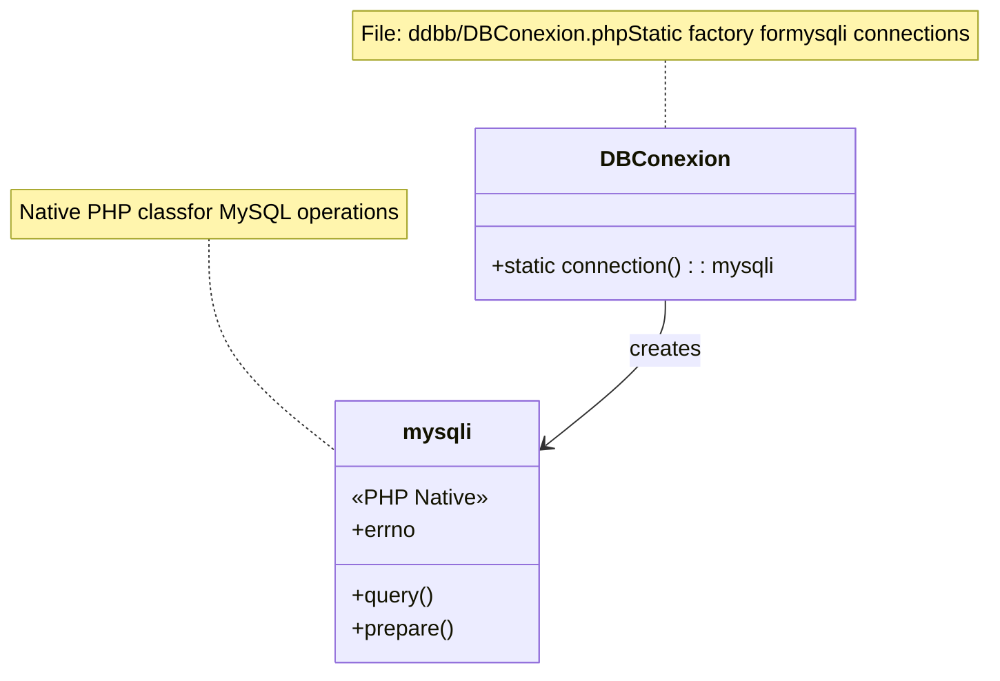
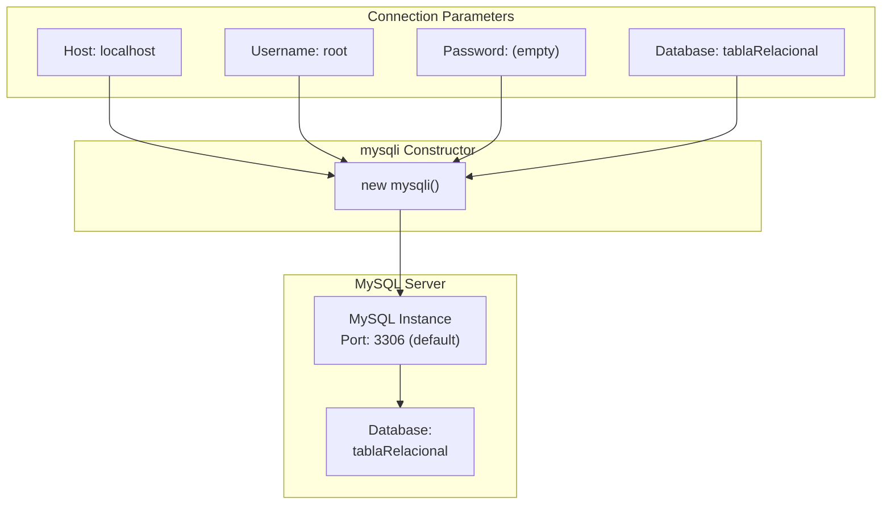
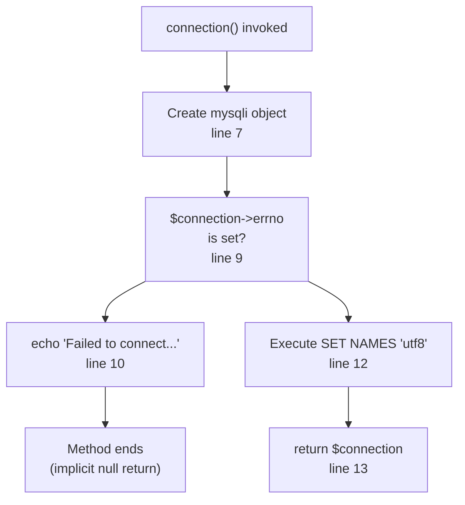
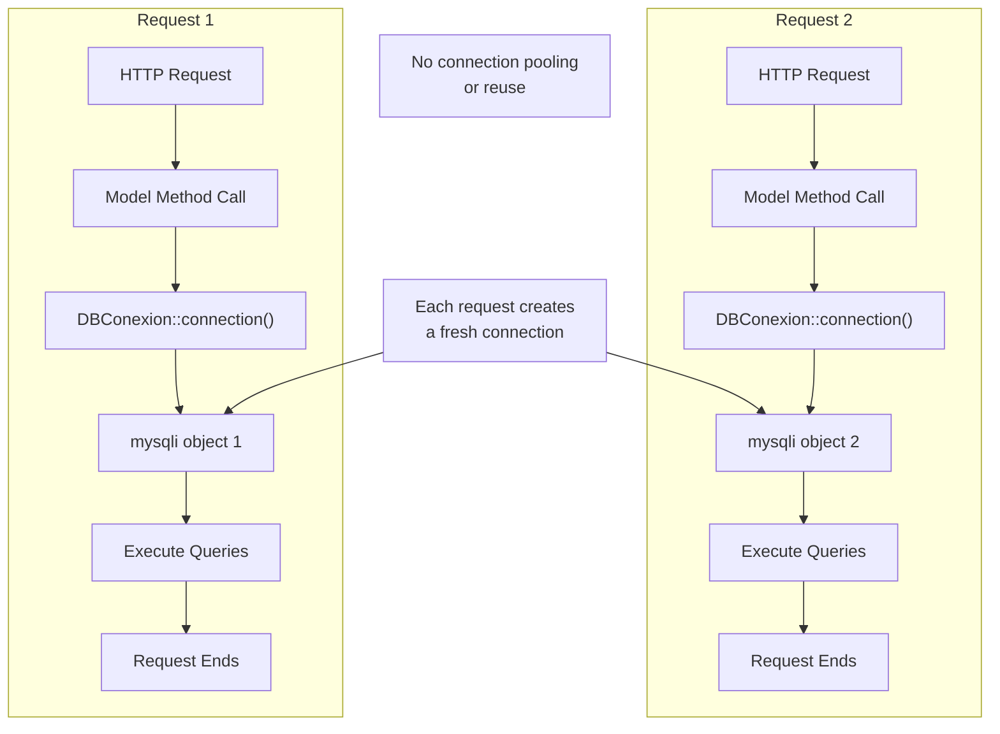
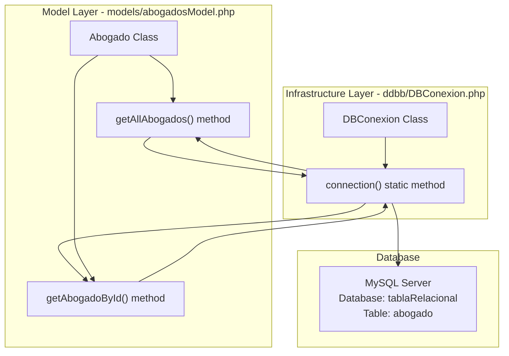

# Database Connection Management

> **Relevant source files**
> * [ddbb/DBConexion.php](https://github.com/GroveLive/abogado/blob/8bfc71d0/ddbb/DBConexion.php)

## Purpose and Scope

This document explains the `DBConexion` class and its role in establishing and managing MySQL database connections for the Abogado application. The `DBConexion` class serves as the sole database connection factory, providing mysqli connection objects to the data access layer.

This document covers:

* The `DBConexion` class structure and static connection method
* Hardcoded connection parameters and credentials
* Character encoding configuration for UTF-8 support
* Error handling approach for connection failures
* Connection lifecycle and instantiation pattern

For information about how the model layer uses these connections to execute queries, see [Models Layer](/GroveLive/abogado/4.3-models-layer). For security implications of hardcoded credentials, see [Security Considerations](/GroveLive/abogado/7-security-considerations). For production deployment configuration requirements, see [Configuration and Deployment](/GroveLive/abogado/8-configuration-and-deployment).

---

## DBConexion Class Overview

The `DBConexion` class is defined in [ddbb/DBConexion.php](https://github.com/GroveLive/abogado/blob/8bfc71d0/ddbb/DBConexion.php)

 and implements a static factory pattern for creating MySQL database connections. The class contains a single public static method `connection()` that instantiates and returns a mysqli connection object.

### Class Structure



The `DBConexion` class does not maintain any instance state or instance methods. All functionality is exposed through the static `connection()` method, which can be invoked without instantiating the class.

**Sources:** [ddbb/DBConexion.php L3-L17](https://github.com/GroveLive/abogado/blob/8bfc71d0/ddbb/DBConexion.php#L3-L17)

---

## Connection Method Implementation

The `connection()` method at [ddbb/DBConexion.php L5-L16](https://github.com/GroveLive/abogado/blob/8bfc71d0/ddbb/DBConexion.php#L5-L16)

 implements the core database connection logic. The method follows a simple creation-check-configure-return pattern.

### Connection Creation Sequence

```mermaid
sequenceDiagram
  participant Model Layer
  participant DBConexion::connection()
  participant mysqli Constructor
  participant MySQL Server

  Model Layer->>DBConexion::connection(): connection()
  DBConexion::connection()->>mysqli Constructor: new mysqli("localhost", "root", "", "tablaRelacional")
  mysqli Constructor->>MySQL Server: TCP connection to localhost:3306
  MySQL Server-->>mysqli Constructor: connection established / error
  mysqli Constructor-->>DBConexion::connection(): $connection object
  DBConexion::connection()->>DBConexion::connection(): check $connection->errno
  loop [Connection Failed]
    DBConexion::connection()->>DBConexion::connection(): echo error message
    note over DBConexion::connection(): No return value
    DBConexion::connection()->>MySQL Server: SET NAMES 'utf8'
    MySQL Server-->>DBConexion::connection(): charset configured
    DBConexion::connection()-->>Model Layer: return $connection
  end
```

The method creates a new `mysqli` object with connection parameters on line 7, checks for connection errors using the `errno` property on line 9, and either outputs an error message on line 10 or configures character encoding on line 12 before returning the connection object on line 13.

**Sources:** [ddbb/DBConexion.php L5-L16](https://github.com/GroveLive/abogado/blob/8bfc71d0/ddbb/DBConexion.php#L5-L16)

---

## Connection Parameters

The `connection()` method uses hardcoded connection parameters passed to the `mysqli` constructor at [ddbb/DBConexion.php L7](https://github.com/GroveLive/abogado/blob/8bfc71d0/ddbb/DBConexion.php#L7-L7)

### Connection Parameter Table

| Parameter | Value | Location in Code | Description |
| --- | --- | --- | --- |
| Host | `"localhost"` | 1st argument | Database server hostname |
| Username | `"root"` | 2nd argument | MySQL user account |
| Password | `""` (empty string) | 3rd argument | User password (blank) |
| Database | `"tablaRelacional"` | 4th argument | Target database schema |

### Parameter Configuration Diagram



These hardcoded values at [ddbb/DBConexion.php L7](https://github.com/GroveLive/abogado/blob/8bfc71d0/ddbb/DBConexion.php#L7-L7)

 indicate a development environment configuration. The empty password for the root user and localhost host are not suitable for production deployment.

**Sources:** [ddbb/DBConexion.php L7](https://github.com/GroveLive/abogado/blob/8bfc71d0/ddbb/DBConexion.php#L7-L7)

---

## Character Encoding Configuration

After successful connection establishment, the method configures the connection character encoding to UTF-8 using a `SET NAMES` SQL command at [ddbb/DBConexion.php L12](https://github.com/GroveLive/abogado/blob/8bfc71d0/ddbb/DBConexion.php#L12-L12)

### Encoding Setup Details

The statement `$connection->query("SET NAMES 'utf8'")` executes an SQL command that sets three MySQL system variables:

| Variable | Effect |
| --- | --- |
| `character_set_client` | Character set for statements sent from client |
| `character_set_results` | Character set for results sent to client |
| `character_set_connection` | Character set for literals without character set introducer |

This ensures that text data containing special characters (Spanish language characters like á, é, í, ó, ú, ñ) is properly handled throughout the data transmission pipeline between the PHP application and MySQL database.

The encoding configuration occurs before the connection is returned, ensuring all subsequent queries on this connection use UTF-8 encoding by default.

**Sources:** [ddbb/DBConexion.php L12](https://github.com/GroveLive/abogado/blob/8bfc71d0/ddbb/DBConexion.php#L12-L12)

---

## Error Handling Strategy

The `DBConexion` class implements basic error detection and reporting for connection failures at [ddbb/DBConexion.php L9-L11](https://github.com/GroveLive/abogado/blob/8bfc71d0/ddbb/DBConexion.php#L9-L11)

### Error Handling Flow



### Error Handling Characteristics

The error handling implementation exhibits the following behaviors:

**Error Detection:** The method checks the `errno` property of the mysqli object [ddbb/DBConexion.php L9](https://github.com/GroveLive/abogado/blob/8bfc71d0/ddbb/DBConexion.php#L9-L9)

 A non-zero value indicates a connection error.

**Error Output:** When an error is detected, the method uses `echo` to output the error message to the response stream [ddbb/DBConexion.php L10](https://github.com/GroveLive/abogado/blob/8bfc71d0/ddbb/DBConexion.php#L10-L10)

 The message combines a static string with the actual error from `mysqli_connect_error()`.

**No Explicit Return:** The error path at [ddbb/DBConexion.php L10](https://github.com/GroveLive/abogado/blob/8bfc71d0/ddbb/DBConexion.php#L10-L10)

 does not include a return statement, resulting in an implicit `null` return value when the method exits.

**No Exception Handling:** The method does not throw exceptions or use try-catch blocks. Error communication relies on return value checking by the calling code.

**Sources:** [ddbb/DBConexion.php L9-L11](https://github.com/GroveLive/abogado/blob/8bfc71d0/ddbb/DBConexion.php#L9-L11)

---

## Connection Lifecycle and Usage Pattern

The `DBConexion` class implements a per-request connection pattern with no connection pooling or reuse mechanisms.

### Connection Instantiation Pattern



### Usage by Model Layer

The `Abogado` model class uses `DBConexion::connection()` to obtain database connections for executing queries. Each model method that needs database access calls `DBConexion::connection()` to get a fresh connection.

**Typical Usage Pattern in Models:**

```
// From models/abogadosModel.php (conceptual example)
$connection = DBConexion::connection();
// Execute query using $connection
// Connection implicitly closed when variable goes out of scope
```

### Connection Lifecycle Characteristics

| Aspect | Behavior |
| --- | --- |
| Creation | On-demand when model methods invoke `connection()` |
| Scope | Local to the request that created it |
| Closure | Implicit when connection object is destroyed at request end |
| Reuse | None - fresh connection per invocation |
| Pooling | Not implemented |
| Persistent | No persistent connection flag used |

The connection object is not explicitly closed using `mysqli::close()`. PHP's garbage collector automatically closes the connection when the mysqli object is destroyed at the end of the request or when the variable goes out of scope.

**Sources:** [ddbb/DBConexion.php L5-L16](https://github.com/GroveLive/abogado/blob/8bfc71d0/ddbb/DBConexion.php#L5-L16)

---

## Integration with Model Layer

The `DBConexion` class serves as the database connection provider for all model classes in the application. Models obtain connections by calling the static method.

### Model-to-Connection Integration



### Dependency Chain

The database access dependency chain flows as follows:

1. **View Layer** instantiates controller (e.g., `AbogadosController`)
2. **Controller Layer** calls model methods (e.g., `Abogado::getAllAbogados()`)
3. **Model Layer** calls `DBConexion::connection()` to obtain mysqli object
4. **Infrastructure Layer** creates and returns configured connection
5. **Model Layer** executes queries using the returned connection

The `DBConexion` class is imported by model classes using `require_once` statements, establishing a compile-time dependency from the model layer to the infrastructure layer.

**Sources:** [ddbb/DBConexion.php L1-L17](https://github.com/GroveLive/abogado/blob/8bfc71d0/ddbb/DBConexion.php#L1-L17)

---

## Configuration Considerations

The current implementation of `DBConexion` contains several configuration aspects that require modification for production deployment:

### Hardcoded Configuration Issues

| Configuration Item | Current Value | Issue |
| --- | --- | --- |
| Host | `"localhost"` | Assumes database is on same server |
| Username | `"root"` | Uses administrative account |
| Password | `""` | Empty password is insecure |
| Database Name | `"tablaRelacional"` | Hardcoded in class |

All connection parameters are embedded as string literals in the `mysqli` constructor call at [ddbb/DBConexion.php L7](https://github.com/GroveLive/abogado/blob/8bfc71d0/ddbb/DBConexion.php#L7-L7)

 To deploy to different environments (staging, production), the source code must be modified directly.

### Recommended Improvements

For production deployment, consider:

1. **Externalize Configuration:** Move connection parameters to configuration files or environment variables
2. **Use Least Privilege:** Create a dedicated database user with minimal required permissions instead of `root`
3. **Secure Credentials:** Implement password protection for database accounts
4. **Environment-Specific Configuration:** Support different connection parameters per environment (development, staging, production)

For detailed security implications, see [Security Considerations](/GroveLive/abogado/7-security-considerations). For deployment configuration guidance, see [Configuration and Deployment](/GroveLive/abogado/8-configuration-and-deployment).

**Sources:** [ddbb/DBConexion.php L7](https://github.com/GroveLive/abogado/blob/8bfc71d0/ddbb/DBConexion.php#L7-L7)