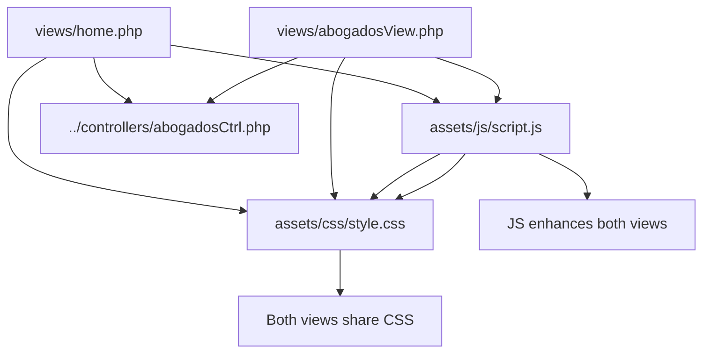

# Frontend Components

> **Relevant source files**
> * [assets/css/style.css](https://github.com/GroveLive/abogado/blob/8bfc71d0/assets/css/style.css)
> * [assets/js/script.js](https://github.com/GroveLive/abogado/blob/8bfc71d0/assets/js/script.js)
> * [views/abogadosView.php](https://github.com/GroveLive/abogado/blob/8bfc71d0/views/abogadosView.php)
> * [views/home.php](https://github.com/GroveLive/abogado/blob/8bfc71d0/views/home.php)

## Purpose and Scope

This document provides an overview of the presentation layer components that generate and enhance the user interface. The frontend layer consists of three distinct component types: server-side PHP views that generate HTML, a CSS styling system that defines visual appearance, and JavaScript code that provides client-side enhancements.

For detailed documentation of specific components, see:

* [Views Overview](/GroveLive/abogado/5.1-views-overview) for information about `home.php` and `abogadosView.php`
* [Styling System (CSS)](/GroveLive/abogado/5.2-styling-system-(css)) for the `style.css` theme architecture
* [JavaScript Enhancements](/GroveLive/abogado/5.3-javascript-enhancements-(script.js)) for the `script.js` navigation enhancement logic

This page focuses on the architectural relationships between these components and how they collectively implement the presentation layer.

**Sources:** System architecture diagrams, [views/home.php L1-L28](https://github.com/GroveLive/abogado/blob/8bfc71d0/views/home.php#L1-L28)

 [views/abogadosView.php L1-L40](https://github.com/GroveLive/abogado/blob/8bfc71d0/views/abogadosView.php#L1-L40)

 [assets/css/style.css L1-L175](https://github.com/GroveLive/abogado/blob/8bfc71d0/assets/css/style.css#L1-L175)

 [assets/js/script.js L1-L24](https://github.com/GroveLive/abogado/blob/8bfc71d0/assets/js/script.js#L1-L24)

---

## Component Architecture

The frontend layer implements a three-tier presentation architecture with clear separation of concerns:

### Frontend Component Structure

```

```

**Sources:** [views/home.php L13-L14](https://github.com/GroveLive/abogado/blob/8bfc71d0/views/home.php#L13-L14)

 [views/abogadosView.php L24](https://github.com/GroveLive/abogado/blob/8bfc71d0/views/abogadosView.php#L24-L24)

 [assets/js/script.js L1-L23](https://github.com/GroveLive/abogado/blob/8bfc71d0/assets/js/script.js#L1-L23)

---

## Component Types

### Views Layer (PHP)

The views layer consists of two PHP files that implement server-side rendering:

| View File | Purpose | Controller Method | Output |
| --- | --- | --- | --- |
| `views/home.php` | Lawyer listing grid | `obtenerAbogados()` | HTML with all lawyer cards |
| `views/abogadosView.php` | Individual lawyer profile | `obtenerAbogadoPorId($id)` | HTML with single lawyer details |

Both views follow the same architectural pattern:

1. Instantiate `AbogadosController` via `require_once`
2. Fetch data by calling controller methods
3. Generate HTML using embedded PHP syntax
4. Apply XSS protection with `htmlspecialchars()`
5. Link to shared CSS stylesheet

The views implement a master-detail navigation pattern where `home.php` displays a list of lawyers and each lawyer card links to `abogadosView.php` with an ID parameter.

**Sources:** [views/home.php L1-L28](https://github.com/GroveLive/abogado/blob/8bfc71d0/views/home.php#L1-L28)

 [views/abogadosView.php L1-L40](https://github.com/GroveLive/abogado/blob/8bfc71d0/views/abogadosView.php#L1-L40)

### Styling System (CSS)

The `assets/css/style.css` file implements a component-based styling system with the following architecture:

| Component | Purpose | Key Classes |
| --- | --- | --- |
| Theme variables | Global color and timing values | CSS custom properties in `:root` |
| Layout system | Responsive grid for lawyer cards | `.menu-grid` |
| Component styles | Reusable UI elements | `.menu-item`, `.btn`, `.abogado-container` |
| Loading UI | Animated overlay during navigation | `#loader`, `.spinner` |
| Responsive design | Mobile-friendly breakpoints | `@media` queries |

The system uses CSS custom properties (CSS variables) defined at [assets/css/style.css L1-L10](https://github.com/GroveLive/abogado/blob/8bfc71d0/assets/css/style.css#L1-L10)

 to maintain consistent theming across all components. Both views reference the same stylesheet, ensuring visual consistency.

**Sources:** [assets/css/style.css L1-L175](https://github.com/GroveLive/abogado/blob/8bfc71d0/assets/css/style.css#L1-L175)

### JavaScript Enhancement Layer

The `assets/js/script.js` file provides progressive enhancement for navigation interactions. The script operates through the following mechanism:

1. Creates a loading overlay (`#loader`) element on DOM ready
2. Attaches click event handlers to all elements with class `.abogado-link`
3. Prevents default navigation behavior
4. Displays animated loading spinner
5. Delays navigation by 800ms for visual feedback
6. Performs programmatic navigation via `window.location.href`

The JavaScript layer is optional—the application functions without it, but provides a smoother user experience when available. The script targets links generated by `home.php` that navigate to `abogadosView.php`.

**Sources:** [assets/js/script.js L1-L24](https://github.com/GroveLive/abogado/blob/8bfc71d0/assets/js/script.js#L1-L24)

---

## Component Integration Patterns

### HTML Generation and Asset Loading

```

```

**Sources:** [views/home.php L8-L27](https://github.com/GroveLive/abogado/blob/8bfc71d0/views/home.php#L8-L27)

 [views/abogadosView.php L18-L38](https://github.com/GroveLive/abogado/blob/8bfc71d0/views/abogadosView.php#L18-L38)

 [assets/js/script.js L1-L7](https://github.com/GroveLive/abogado/blob/8bfc71d0/assets/js/script.js#L1-L7)

### CSS Class and JavaScript Selector Coordination

The views generate HTML elements with specific CSS classes that serve dual purposes:

| CSS Class/ID | Used By | Purpose |
| --- | --- | --- |
| `.menu-grid` | CSS | Grid layout container for lawyer cards |
| `.menu-item` | CSS | Individual lawyer card styling with hover effects |
| `.btn` | CSS | Button styling for "Ver Perfil" links |
| `.abogado-link` | CSS, JavaScript | Styling and event handler targeting |
| `.abogado-container` | CSS | Profile detail container styling |
| `.volver` | CSS | Back button styling |
| `#loader` | CSS, JavaScript | Loading overlay positioning and animation |
| `.spinner` | CSS, JavaScript | Animated loading indicator |

This naming convention establishes a contract between the PHP views (which generate the classes), the CSS (which styles them), and the JavaScript (which targets them for behavior).

**Sources:** [views/home.php L17-L25](https://github.com/GroveLive/abogado/blob/8bfc71d0/views/home.php#L17-L25)

 [views/abogadosView.php L28-L36](https://github.com/GroveLive/abogado/blob/8bfc71d0/views/abogadosView.php#L28-L36)

 [assets/css/style.css L59-L145](https://github.com/GroveLive/abogado/blob/8bfc71d0/assets/css/style.css#L59-L145)

 [assets/js/script.js L9-L22](https://github.com/GroveLive/abogado/blob/8bfc71d0/assets/js/script.js#L9-L22)

---

## File Organization and Dependencies

### Directory Structure

```markdown
assets/
├── css/
│   └── style.css          # Shared stylesheet for all views
└── js/
    └── script.js          # Navigation enhancement script

views/
├── home.php               # Lawyer listing view
└── abogadosView.php       # Individual profile view
```

### Dependency Graph



**Sources:** [views/home.php L2-L13](https://github.com/GroveLive/abogado/blob/8bfc71d0/views/home.php#L2-L13)

 [views/abogadosView.php L2-L24](https://github.com/GroveLive/abogado/blob/8bfc71d0/views/abogadosView.php#L2-L24)

 [assets/js/script.js L3-L9](https://github.com/GroveLive/abogado/blob/8bfc71d0/assets/js/script.js#L3-L9)

---

## Shared Component Reuse

The frontend architecture maximizes code reuse through shared dependencies:

**Shared Stylesheet:** Both views link to the same `style.css` file, ensuring consistent visual presentation. The stylesheet defines reusable component classes (`.btn`, `.menu-item`, etc.) that both views leverage.

**Shared JavaScript Enhancement:** The `script.js` file uses class-based selectors (`.abogado-link`) to apply behavior to any matching element, regardless of which view generates it. This allows the same enhancement logic to work across multiple views.

**Common HTML Patterns:** Both views follow identical patterns:

* UTF-8 character encoding via `<meta charset="UTF-8">`
* Viewport configuration for responsive design
* External stylesheet linking with relative paths
* Semantic HTML5 structure
* XSS protection through `htmlspecialchars()`

This shared infrastructure reduces duplication and maintains consistency across the application's user interface.

**Sources:** [views/home.php L8-L14](https://github.com/GroveLive/abogado/blob/8bfc71d0/views/home.php#L8-L14)

 [views/abogadosView.php L18-L25](https://github.com/GroveLive/abogado/blob/8bfc71d0/views/abogadosView.php#L18-L25)

---

## Server-Side vs. Client-Side Rendering

The application implements a **server-side rendering** model:

| Aspect | Implementation |
| --- | --- |
| **HTML Generation** | Server-side PHP views generate complete HTML documents |
| **Data Fetching** | Server-side controller calls before page render |
| **Initial Page Load** | Full HTML document returned in single HTTP response |
| **Navigation** | Full page reloads (with JavaScript enhancement) |
| **State Management** | Stateless—each request is independent |

This contrasts with single-page application (SPA) architectures. There is no client-side routing, no AJAX data fetching, and no client-side templating. JavaScript serves only as progressive enhancement for navigation animations, not as a core rendering mechanism.

The views execute PHP logic, fetch data from the controller layer, and output complete HTML documents that are immediately displayable without JavaScript execution.

**Sources:** [views/home.php L1-L28](https://github.com/GroveLive/abogado/blob/8bfc71d0/views/home.php#L1-L28)

 [views/abogadosView.php L1-L40](https://github.com/GroveLive/abogado/blob/8bfc71d0/views/abogadosView.php#L1-L40)

---

## Styling Architecture Overview

The CSS system implements a **theme-based architecture** using modern CSS features:

### Theme Variables

Global design tokens are defined as CSS custom properties in the `:root` selector [assets/css/style.css L1-L10](https://github.com/GroveLive/abogado/blob/8bfc71d0/assets/css/style.css#L1-L10)

:

```
--primary-color: #1e1f26 (dark background)
--secondary-color: #6f42c1 (purple accent)
--accent-color: #e74c3c (red for hover states)
--text-color: #ffffff (white text)
--light-bg: #292b36 (lighter background for cards)
--transition: all 0.3s ease (animation timing)
```

These variables are referenced throughout the stylesheet using `var(--variable-name)` syntax, enabling centralized theme management.

### Responsive Design Strategy

The stylesheet implements mobile-first responsive design with two breakpoints:

* **Tablet breakpoint** (`@media (max-width: 768px)`): Single-column grid layout
* **Mobile breakpoint** (`@media (max-width: 480px)`): Reduced font sizes and padding

The grid system uses `grid-template-columns: repeat(auto-fill, minmax(300px, 1fr))` for automatic responsive columns without explicit breakpoints.

**Sources:** [assets/css/style.css L1-L145](https://github.com/GroveLive/abogado/blob/8bfc71d0/assets/css/style.css#L1-L145)

---

## JavaScript Enhancement Overview

The `script.js` file implements a single feature: **navigation animation**. The implementation follows this pattern:

1. **Initialization:** Wait for `DOMContentLoaded` event [assets/js/script.js L1](https://github.com/GroveLive/abogado/blob/8bfc71d0/assets/js/script.js#L1-L1)
2. **DOM Creation:** Dynamically create `#loader` overlay element [assets/js/script.js L3-L6](https://github.com/GroveLive/abogado/blob/8bfc71d0/assets/js/script.js#L3-L6)
3. **Event Delegation:** Attach click handlers to all `.abogado-link` elements [assets/js/script.js L9-L10](https://github.com/GroveLive/abogado/blob/8bfc71d0/assets/js/script.js#L9-L10)
4. **Navigation Interception:** Prevent default link behavior with `e.preventDefault()` [assets/js/script.js L11](https://github.com/GroveLive/abogado/blob/8bfc71d0/assets/js/script.js#L11-L11)
5. **Visual Feedback:** Display loading overlay with spinner [assets/js/script.js L15](https://github.com/GroveLive/abogado/blob/8bfc71d0/assets/js/script.js#L15-L15)
6. **Delayed Navigation:** Wait 800ms before programmatic navigation [assets/js/script.js L18-L20](https://github.com/GroveLive/abogado/blob/8bfc71d0/assets/js/script.js#L18-L20)

This creates a smooth transition effect when users navigate from the lawyer listing to individual profiles. The delay is artificial—it's not waiting for data loading, but rather providing visual feedback.

**Sources:** [assets/js/script.js L1-L24](https://github.com/GroveLive/abogado/blob/8bfc71d0/assets/js/script.js#L1-L24)

---

## Component Communication

### View-to-CSS Communication

Views communicate styling requirements to CSS through class attribute assignments in generated HTML:

```

```

The CSS defines rules for these classes, establishing a unidirectional communication pattern from views to CSS.

**Sources:** [views/home.php L17-L23](https://github.com/GroveLive/abogado/blob/8bfc71d0/views/home.php#L17-L23)

 [assets/css/style.css L59-L95](https://github.com/GroveLive/abogado/blob/8bfc71d0/assets/css/style.css#L59-L95)

### View-to-JavaScript Communication

Views communicate interaction targets to JavaScript through class attributes:

```

```

**Note:** There is a mismatch in the current implementation. The view generates elements with class `btn`, but JavaScript targets `.abogado-link`. For the JavaScript enhancement to function, the view would need to add the `abogado-link` class to the anchor elements.

**Sources:** [views/home.php L22](https://github.com/GroveLive/abogado/blob/8bfc71d0/views/home.php#L22-L22)

 [assets/js/script.js L9](https://github.com/GroveLive/abogado/blob/8bfc71d0/assets/js/script.js#L9-L9)

### CSS-to-JavaScript Communication

CSS and JavaScript share common identifiers for coordinated styling and behavior:

```

```

```

```

This establishes bidirectional coordination where CSS defines the visual presentation and JavaScript controls the visibility.

**Sources:** [assets/css/style.css L147-L158](https://github.com/GroveLive/abogado/blob/8bfc71d0/assets/css/style.css#L147-L158)

 [assets/js/script.js L3-L15](https://github.com/GroveLive/abogado/blob/8bfc71d0/assets/js/script.js#L3-L15)

---

## Summary

The frontend components implement a traditional server-side rendering architecture with progressive enhancement:

* **Views Layer:** Two PHP files (`home.php`, `abogadosView.php`) generate complete HTML documents
* **Styling Layer:** A single CSS file (`style.css`) provides consistent theming via custom properties
* **Enhancement Layer:** A single JavaScript file (`script.js`) adds navigation animation

All components are designed for reuse—both views share the same stylesheet and JavaScript, establishing a DRY architecture. The system functions without JavaScript (graceful degradation) but provides enhanced user experience when available (progressive enhancement).

For detailed documentation of each component type, refer to the child pages [5.1](/GroveLive/abogado/5.1-views-overview), [5.2](/GroveLive/abogado/5.2-styling-system-(css)), and [5.3](/GroveLive/abogado/5.3-javascript-enhancements-(script.js)).