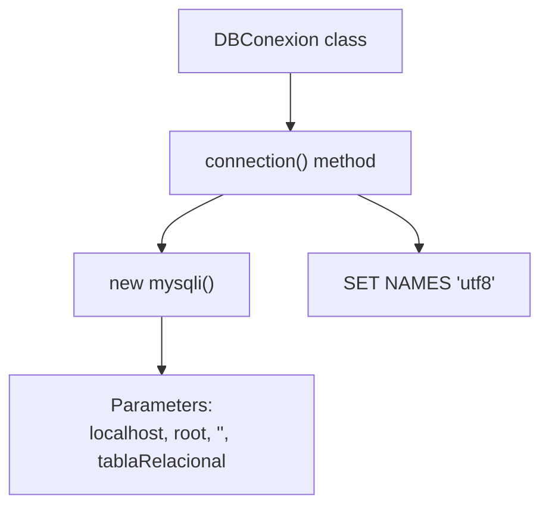
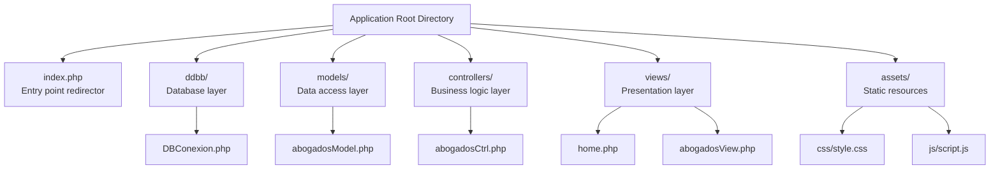
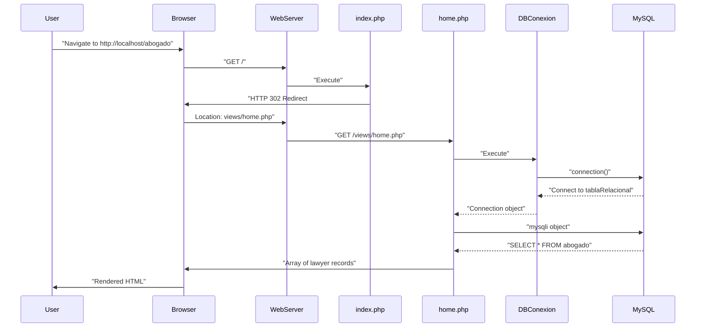
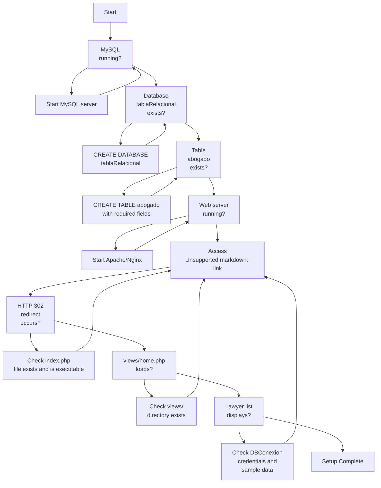

# Getting Started

> **Relevant source files**
> * [ddbb/DBConexion.php](https://github.com/GroveLive/abogado/blob/8bfc71d0/ddbb/DBConexion.php)
> * [index.php](https://github.com/GroveLive/abogado/blob/8bfc71d0/index.php)
> * [models/abogadosModel.php](https://github.com/GroveLive/abogado/blob/8bfc71d0/models/abogadosModel.php)

This page provides step-by-step instructions for setting up and running the Abogado lawyer management application. It covers prerequisites, database configuration, application setup, and initial access procedures.

For information about the system's architecture and component interactions, see [System Architecture](/GroveLive/abogado/3-system-architecture). For deployment and production configuration, see [Configuration and Deployment](/GroveLive/abogado/8-configuration-and-deployment).

---

## Prerequisites

The Abogado application requires the following software stack:

| Component | Requirement | Notes |
| --- | --- | --- |
| **PHP** | Version 5.6+ recommended | Must include `mysqli` extension |
| **MySQL** | Version 5.5+ | MariaDB also compatible |
| **Web Server** | Apache or Nginx | Must support PHP execution |
| **Operating System** | Any PHP-compatible OS | Windows, Linux, or macOS |

Verify that the `mysqli` PHP extension is enabled, as the `DBConexion` class depends on it for database connectivity.

**Sources:** [ddbb/DBConexion.php L3-L16](https://github.com/GroveLive/abogado/blob/8bfc71d0/ddbb/DBConexion.php#L3-L16)

---

## Database Setup

### Creating the Database

The application requires a MySQL database named `tablaRelacional`. Create this database using your preferred MySQL client:

```sql
CREATE DATABASE tablaRelacional CHARACTER SET utf8 COLLATE utf8_general_ci;
```

The `DBConexion::connection()` method expects this exact database name and will fail if it does not exist.

**Sources:** [ddbb/DBConexion.php L7](https://github.com/GroveLive/abogado/blob/8bfc71d0/ddbb/DBConexion.php#L7-L7)

### Creating the Abogado Table

Create the `abogado` table within the `tablaRelacional` database with the following structure:

```css
#mermaid-w41f08aekhb{font-family:ui-sans-serif,-apple-system,system-ui,Segoe UI,Helvetica;font-size:16px;fill:#333;}@keyframes edge-animation-frame{from{stroke-dashoffset:0;}}@keyframes dash{to{stroke-dashoffset:0;}}#mermaid-w41f08aekhb .edge-animation-slow{stroke-dasharray:9,5!important;stroke-dashoffset:900;animation:dash 50s linear infinite;stroke-linecap:round;}#mermaid-w41f08aekhb .edge-animation-fast{stroke-dasharray:9,5!important;stroke-dashoffset:900;animation:dash 20s linear infinite;stroke-linecap:round;}#mermaid-w41f08aekhb .error-icon{fill:#dddddd;}#mermaid-w41f08aekhb .error-text{fill:#222222;stroke:#222222;}#mermaid-w41f08aekhb .edge-thickness-normal{stroke-width:1px;}#mermaid-w41f08aekhb .edge-thickness-thick{stroke-width:3.5px;}#mermaid-w41f08aekhb .edge-pattern-solid{stroke-dasharray:0;}#mermaid-w41f08aekhb .edge-thickness-invisible{stroke-width:0;fill:none;}#mermaid-w41f08aekhb .edge-pattern-dashed{stroke-dasharray:3;}#mermaid-w41f08aekhb .edge-pattern-dotted{stroke-dasharray:2;}#mermaid-w41f08aekhb .marker{fill:#999;stroke:#999;}#mermaid-w41f08aekhb .marker.cross{stroke:#999;}#mermaid-w41f08aekhb svg{font-family:ui-sans-serif,-apple-system,system-ui,Segoe UI,Helvetica;font-size:16px;}#mermaid-w41f08aekhb p{margin:0;}#mermaid-w41f08aekhb .entityBox{fill:#ffffff;stroke:#dddddd;}#mermaid-w41f08aekhb .relationshipLabelBox{fill:#dddddd;opacity:0.7;background-color:#dddddd;}#mermaid-w41f08aekhb .relationshipLabelBox rect{opacity:0.5;}#mermaid-w41f08aekhb .labelBkg{background-color:rgba(221, 221, 221, 0.5);}#mermaid-w41f08aekhb .edgeLabel .label{fill:#dddddd;font-size:14px;}#mermaid-w41f08aekhb .label{font-family:ui-sans-serif,-apple-system,system-ui,Segoe UI,Helvetica;color:#333;}#mermaid-w41f08aekhb .edge-pattern-dashed{stroke-dasharray:8,8;}#mermaid-w41f08aekhb .node rect,#mermaid-w41f08aekhb .node circle,#mermaid-w41f08aekhb .node ellipse,#mermaid-w41f08aekhb .node polygon{fill:#ffffff;stroke:#dddddd;stroke-width:1px;}#mermaid-w41f08aekhb .relationshipLine{stroke:#999;stroke-width:1;fill:none;}#mermaid-w41f08aekhb .marker{fill:none!important;stroke:#999!important;stroke-width:1;}#mermaid-w41f08aekhb :root{--mermaid-font-family:"trebuchet ms",verdana,arial,sans-serif;}abogadoINTid_abogadoPKPrimary key, auto-incrementVARCHARnombreLawyer nameVARCHARespecialidadLegal specializationVARCHARtelefonoContact phone numberVARCHARnacionalidadNationalityVARCHARestudiosEducational backgroundVARCHARcorreoEmail address
```

**Minimal Table Creation SQL:**

```sql
CREATE TABLE abogado (
    id_abogado INT PRIMARY KEY AUTO_INCREMENT,
    nombre VARCHAR(255) NOT NULL,
    especialidad VARCHAR(255),
    telefono VARCHAR(20),
    nacionalidad VARCHAR(100),
    estudios TEXT,
    correo VARCHAR(255)
);
```

The `Abogado` model class queries this table using both `SELECT *` queries and prepared statements with `id_abogado` as the lookup key.

**Sources:** [models/abogadosModel.php L7](https://github.com/GroveLive/abogado/blob/8bfc71d0/models/abogadosModel.php#L7-L7)

 [models/abogadosModel.php L19](https://github.com/GroveLive/abogado/blob/8bfc71d0/models/abogadosModel.php#L19-L19)

### Sample Data

Insert sample lawyer records to test the application:

```sql
INSERT INTO abogado (nombre, especialidad, telefono, nacionalidad, estudios, correo) VALUES
('Maria García', 'Derecho Civil', '+34 600123456', 'Española', 'Universidad Complutense', 'maria.garcia@example.com'),
('Juan Pérez', 'Derecho Penal', '+34 600654321', 'Español', 'Universidad de Barcelona', 'juan.perez@example.com');
```

**Sources:** [models/abogadosModel.php L5-L15](https://github.com/GroveLive/abogado/blob/8bfc71d0/models/abogadosModel.php#L5-L15)

 [models/abogadosModel.php L17-L25](https://github.com/GroveLive/abogado/blob/8bfc71d0/models/abogadosModel.php#L17-L25)

---

## Application Configuration

### Database Connection Parameters

The application uses hardcoded database credentials in the `DBConexion` class. Locate and verify these settings:

| Parameter | Default Value | Location |
| --- | --- | --- |
| **Host** | `localhost` | [ddbb/DBConexion.php L7](https://github.com/GroveLive/abogado/blob/8bfc71d0/ddbb/DBConexion.php#L7-L7) |
| **Username** | `root` | [ddbb/DBConexion.php L7](https://github.com/GroveLive/abogado/blob/8bfc71d0/ddbb/DBConexion.php#L7-L7) |
| **Password** | *(empty string)* | [ddbb/DBConexion.php L7](https://github.com/GroveLive/abogado/blob/8bfc71d0/ddbb/DBConexion.php#L7-L7) |
| **Database** | `tablaRelacional` | [ddbb/DBConexion.php L7](https://github.com/GroveLive/abogado/blob/8bfc71d0/ddbb/DBConexion.php#L7-L7) |

**Configuration Flow:**



If your MySQL server uses different credentials, you must modify line 7 of `DBConexion.php`:

```
$connection = new mysqli("localhost", "root", "", "tablaRelacional");
```

**Character Encoding:** The connection automatically sets UTF-8 encoding via `SET NAMES 'utf8'` on line 12 to ensure proper handling of Spanish characters and special symbols.

**Sources:** [ddbb/DBConexion.php L7](https://github.com/GroveLive/abogado/blob/8bfc71d0/ddbb/DBConexion.php#L7-L7)

 [ddbb/DBConexion.php L12](https://github.com/GroveLive/abogado/blob/8bfc71d0/ddbb/DBConexion.php#L12-L12)

---

## Directory Structure

Deploy the application files with the following structure:



**Critical Path Requirements:**

1. The `index.php` file must be at the web server document root
2. All subdirectories (`ddbb/`, `models/`, `controllers/`, `views/`, `assets/`) must exist
3. Relative path references between files depend on this exact structure

The application uses relative paths with `../` notation for file inclusion. For example, `abogadosModel.php` includes `DBConexion.php` using:

```
require_once "../ddbb/DBConexion.php";
```

**Sources:** [index.php L1-L4](https://github.com/GroveLive/abogado/blob/8bfc71d0/index.php#L1-L4)

 [models/abogadosModel.php L2](https://github.com/GroveLive/abogado/blob/8bfc71d0/models/abogadosModel.php#L2-L2)

---

## Web Server Configuration

### Apache Setup

Configure Apache to serve the application root directory. Add this virtual host configuration:

```xml
<VirtualHost *:80>
    DocumentRoot "/path/to/abogado"
    ServerName abogado.local
    
    <Directory "/path/to/abogado">
        Options Indexes FollowSymLinks
        AllowOverride All
        Require all granted
    </Directory>
</VirtualHost>
```

### Nginx Setup

For Nginx, use this server block configuration:

```
server {
    listen 80;
    server_name abogado.local;
    root /path/to/abogado;
    index index.php;

    location / {
        try_files $uri $uri/ /index.php?$args;
    }

    location ~ \.php$ {
        fastcgi_pass unix:/var/run/php/php-fpm.sock;
        fastcgi_index index.php;
        include fastcgi_params;
    }
}
```

**Sources:** [index.php L1-L4](https://github.com/GroveLive/abogado/blob/8bfc71d0/index.php#L1-L4)

---

## Running the Application

### Initial Access Flow



### Access Steps

**Step 1: Start Web Server and MySQL**

Ensure both your web server (Apache/Nginx) and MySQL server are running.

**Step 2: Access Application Root**

Navigate to the application URL in your browser:

* Local development: `http://localhost/abogado/`
* Named virtual host: `http://abogado.local/`

**Step 3: Automatic Redirect**

The `index.php` entry point automatically redirects to `views/home.php`:

```
header("Location: views/home.php");
exit;
```

**Step 4: Verify Home Page Load**

You should see a grid of lawyer profiles. If you see this page, the following components are working correctly:

| Component | Verification |
| --- | --- |
| PHP Execution | `index.php` redirect succeeded |
| File Inclusion | `require_once` paths resolved |
| Database Connection | `DBConexion::connection()` succeeded |
| Table Access | `SELECT * FROM abogado` succeeded |
| View Rendering | `home.php` generated HTML |

**Sources:** [index.php L2-L3](https://github.com/GroveLive/abogado/blob/8bfc71d0/index.php#L2-L3)

 [models/abogadosModel.php L5-L14](https://github.com/GroveLive/abogado/blob/8bfc71d0/models/abogadosModel.php#L5-L14)

---

## Troubleshooting Common Issues

### Issue: "Failed to connect to MySQL"

**Symptom:** Error message displayed on page load

**Cause:** `DBConexion::connection()` failed to establish connection

**Solutions:**

1. Verify MySQL server is running
2. Check credentials in [ddbb/DBConexion.php L7](https://github.com/GroveLive/abogado/blob/8bfc71d0/ddbb/DBConexion.php#L7-L7)
3. Ensure database `tablaRelacional` exists
4. Verify user `root` has access permissions

**Sources:** [ddbb/DBConexion.php L9-L10](https://github.com/GroveLive/abogado/blob/8bfc71d0/ddbb/DBConexion.php#L9-L10)

### Issue: Blank Page on Access

**Symptom:** Empty white page with no content

**Causes and Solutions:**

| Cause | Diagnostic | Solution |
| --- | --- | --- |
| PHP errors suppressed | Check web server error log | Enable `display_errors` in php.ini |
| File path incorrect | Check 404 in network tab | Verify directory structure |
| File permissions | Check web server user permissions | Set appropriate read permissions |

### Issue: "Table 'tablaRelacional.abogado' doesn't exist"

**Symptom:** MySQL error about missing table

**Solution:** Execute the `CREATE TABLE` statement from the [Database Setup](https://github.com/GroveLive/abogado/blob/8bfc71d0/Database Setup)

 section above.

**Sources:** [models/abogadosModel.php L7](https://github.com/GroveLive/abogado/blob/8bfc71d0/models/abogadosModel.php#L7-L7)

 [models/abogadosModel.php L19](https://github.com/GroveLive/abogado/blob/8bfc71d0/models/abogadosModel.php#L19-L19)

### Issue: Redirect Loop

**Symptom:** Browser reports too many redirects

**Cause:** Web server configuration conflicts with `index.php` redirect

**Solution:** Ensure `.htaccess` or nginx configuration does not create additional redirect rules that conflict with `header("Location: views/home.php")`.

**Sources:** [index.php L2](https://github.com/GroveLive/abogado/blob/8bfc71d0/index.php#L2-L2)

---

## Verification Checklist

Use this checklist to confirm proper installation:



**Final Verification:**

* Navigate to application root URL
* Redirect to `views/home.php` occurs automatically
* Home page displays lawyer cards in grid layout
* Clicking "Ver Perfil" navigates to `abogadosView.php?id=X`
* Profile page displays individual lawyer details
* No PHP or MySQL error messages appear

**Sources:** [index.php L2](https://github.com/GroveLive/abogado/blob/8bfc71d0/index.php#L2-L2)

 [ddbb/DBConexion.php L7](https://github.com/GroveLive/abogado/blob/8bfc71d0/ddbb/DBConexion.php#L7-L7)

 [models/abogadosModel.php L7](https://github.com/GroveLive/abogado/blob/8bfc71d0/models/abogadosModel.php#L7-L7)

 [models/abogadosModel.php L19](https://github.com/GroveLive/abogado/blob/8bfc71d0/models/abogadosModel.php#L19-L19)

---

## Next Steps

After successful setup:

1. **Add Lawyer Data:** Insert additional records into the `abogado` table using SQL
2. **Explore Architecture:** Review [System Architecture](/GroveLive/abogado/3-system-architecture) to understand component interactions
3. **Customize Styling:** Modify `assets/css/style.css` for visual customization
4. **Review Security:** See [Security Considerations](/GroveLive/abogado/7-security-considerations) for production hardening requirements
5. **Production Deployment:** Consult [Configuration and Deployment](/GroveLive/abogado/8-configuration-and-deployment) for production-ready setup

**Sources:** [ddbb/DBConexion.php L7](https://github.com/GroveLive/abogado/blob/8bfc71d0/ddbb/DBConexion.php#L7-L7)

 [models/abogadosModel.php L2](https://github.com/GroveLive/abogado/blob/8bfc71d0/models/abogadosModel.php#L2-L2)

 [index.php L2](https://github.com/GroveLive/abogado/blob/8bfc71d0/index.php#L2-L2)