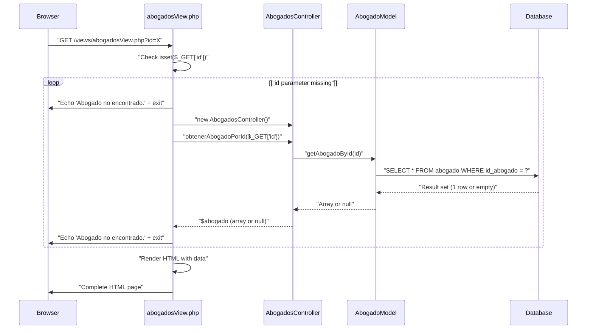
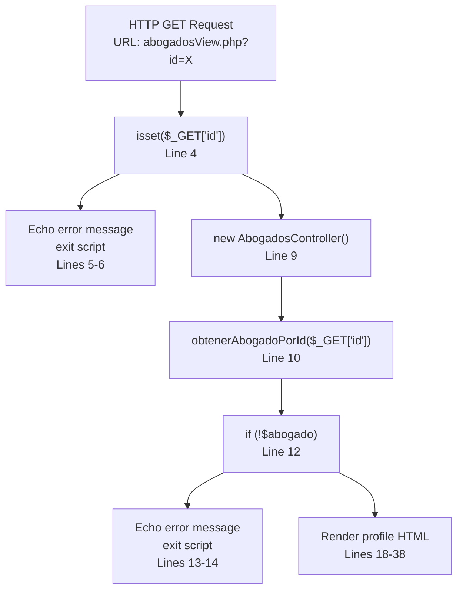
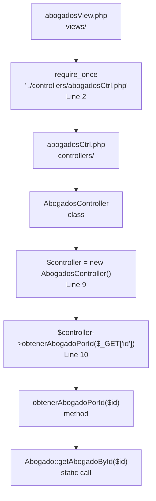
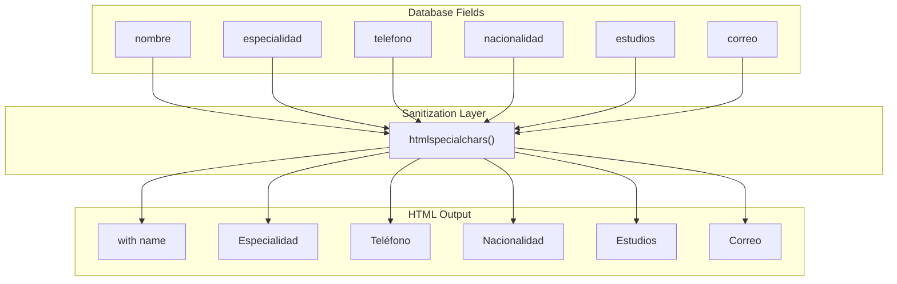
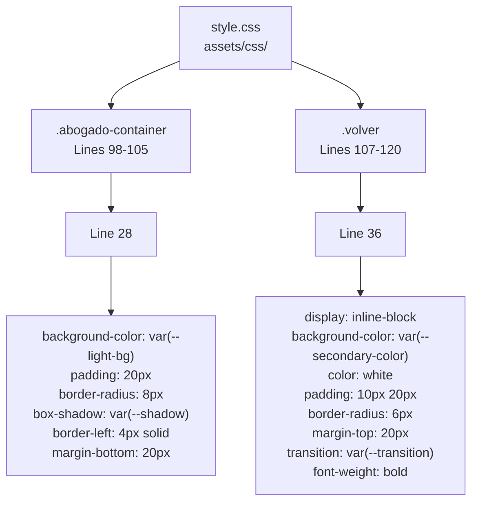
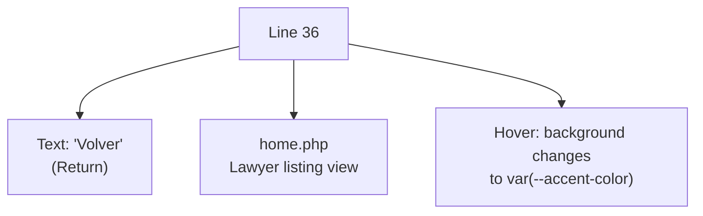
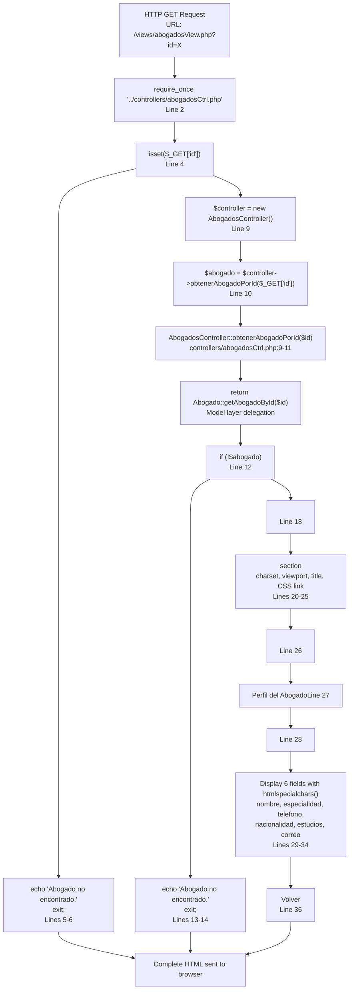

# Lawyer Profile View (abogadosView.php)

> **Relevant source files**
> * [assets/css/style.css](https://github.com/GroveLive/abogado/blob/8bfc71d0/assets/css/style.css)
> * [assets/js/script.js](https://github.com/GroveLive/abogado/blob/8bfc71d0/assets/js/script.js)
> * [controllers/abogadosCtrl.php](https://github.com/GroveLive/abogado/blob/8bfc71d0/controllers/abogadosCtrl.php)
> * [views/abogadosView.php](https://github.com/GroveLive/abogado/blob/8bfc71d0/views/abogadosView.php)

## Purpose and Scope

This document details the `abogadosView.php` view, which displays the complete profile information for an individual lawyer. This view renders a detail page showing all available fields from the database for a single lawyer record, including name, specialty, phone number, nationality, education, and email address.

The profile view receives a lawyer identifier via GET parameter, retrieves the corresponding record through the `AbogadosController`, and displays the data with XSS protection. For information about the lawyer listing page that links to this view, see [Lawyer Listing View (home.php)](/GroveLive/abogado/5.1.1-lawyer-listing-view-(home.php)). For details about the controller methods used, see [Controllers Layer](/GroveLive/abogado/4.2-controllers-layer).

**Sources:** [views/abogadosView.php L1-L40](https://github.com/GroveLive/abogado/blob/8bfc71d0/views/abogadosView.php#L1-L40)

---

## File Location and Execution Context

The profile view is located at `views/abogadosView.php` and is accessed via direct URL navigation with a query string parameter. The file is typically reached through JavaScript-enhanced navigation from the home page or via direct URL entry.

| Property | Value |
| --- | --- |
| File Path | `views/abogadosView.php` |
| Access Method | Direct GET request with `id` parameter |
| Parent Directory | `views/` |
| Required Parameter | `id` (lawyer identifier) |
| Dependent Controller | `AbogadosController` |
| Styling Dependency | `assets/css/style.css` |

**Sources:** [views/abogadosView.php L1-L40](https://github.com/GroveLive/abogado/blob/8bfc71d0/views/abogadosView.php#L1-L40)

---

## Request Flow and Parameter Handling

The view follows a strict request processing flow that validates input, retrieves data, and renders output. The process begins with GET parameter validation and proceeds through controller invocation to HTML generation.

### Request Processing Sequence



**Sources:** [views/abogadosView.php L1-L16](https://github.com/GroveLive/abogado/blob/8bfc71d0/views/abogadosView.php#L1-L16)

 [controllers/abogadosCtrl.php L9-L11](https://github.com/GroveLive/abogado/blob/8bfc71d0/controllers/abogadosCtrl.php#L9-L11)

### GET Parameter Processing

The view expects a single GET parameter named `id` containing the lawyer's unique identifier. The parameter is accessed directly from the `$_GET` superglobal without sanitization, as it is immediately passed to a prepared statement in the model layer.



**Sources:** [views/abogadosView.php L4-L15](https://github.com/GroveLive/abogado/blob/8bfc71d0/views/abogadosView.php#L4-L15)

---

## Error Handling

The view implements two error conditions that result in script termination with user-facing messages. Both error paths output plain text directly to the browser without HTML structure.

### Error Conditions Table

| Error Type | Trigger Condition | Location | Output | HTTP Status |
| --- | --- | --- | --- | --- |
| Missing ID Parameter | `!isset($_GET['id'])` | Lines 4-6 | `"Abogado no encontrado."` | 200 (default) |
| Lawyer Not Found | `!$abogado` (null return) | Lines 12-14 | `"Abogado no encontrado."` | 200 (default) |

### Error Handling Flow

Both error conditions use the same error message text and exit strategy, providing a consistent user experience regardless of whether the error is a missing parameter or a non-existent record.

**Sources:** [views/abogadosView.php L4-L6](https://github.com/GroveLive/abogado/blob/8bfc71d0/views/abogadosView.php#L4-L6)

 [views/abogadosView.php L12-L14](https://github.com/GroveLive/abogado/blob/8bfc71d0/views/abogadosView.php#L12-L14)

---

## Controller Integration

The view depends on the `AbogadosController` class to retrieve lawyer data from the model layer. The controller is loaded via `require_once` and instantiated within the view's execution context.

### Controller Dependency Structure



**Sources:** [views/abogadosView.php L2](https://github.com/GroveLive/abogado/blob/8bfc71d0/views/abogadosView.php#L2-L2)

 [views/abogadosView.php L9-L10](https://github.com/GroveLive/abogado/blob/8bfc71d0/views/abogadosView.php#L9-L10)

 [controllers/abogadosCtrl.php L9-L11](https://github.com/GroveLive/abogado/blob/8bfc71d0/controllers/abogadosCtrl.php#L9-L11)

### Data Retrieval Pattern

The view follows a simple delegation pattern where controller instantiation and method invocation occur inline within the view's PHP execution block. The returned data is stored in the `$abogado` variable for use in the HTML template section.

| Step | Code Location | Operation | Result |
| --- | --- | --- | --- |
| 1. Include Controller | Line 2 | `require_once "../controllers/abogadosCtrl.php"` | Class available |
| 2. Instantiate | Line 9 | `$controller = new AbogadosController()` | Controller object |
| 3. Invoke Method | Line 10 | `$controller->obtenerAbogadoPorId($_GET['id'])` | Array or null |
| 4. Store Result | Line 10 | Assignment to `$abogado` | Data available for view |

**Sources:** [views/abogadosView.php L2](https://github.com/GroveLive/abogado/blob/8bfc71d0/views/abogadosView.php#L2-L2)

 [views/abogadosView.php L9-L10](https://github.com/GroveLive/abogado/blob/8bfc71d0/views/abogadosView.php#L9-L10)

---

## HTML Structure and Document Template

After successful data retrieval, the view generates a complete HTML5 document structure with metadata, styling, and content sections.

### Document Structure

```mermaid
flowchart TD

DOCTYPE["<br>Line 18"]
HTMLTag["<br>Line 19"]
HeadSection["<br>Lines 20-25"]
MetaCharset["<br>Line 21"]
MetaViewport["<br>Line 22"]
TitleTag[""]
LinkCSS["href='../assets/css/style.css'><br>Line 24"]
BodySection["<br>Lines 26-37"]
H1Header["Perfil del AbogadoLine 27"]
AbogadoContainer["Lines 28-35"]
FieldsDisplay["Lawyer fields with htmlspecialchars<br>Lines 29-34"]
BackLink["Line 36"]

DOCTYPE --> HTMLTag
HTMLTag --> HeadSection
HTMLTag --> BodySection
HeadSection --> MetaCharset
HeadSection --> MetaViewport
HeadSection --> TitleTag
HeadSection --> LinkCSS
BodySection --> H1Header
BodySection --> AbogadoContainer
BodySection --> BackLink
AbogadoContainer --> FieldsDisplay
```

**Sources:** [views/abogadosView.php L18-L38](https://github.com/GroveLive/abogado/blob/8bfc71d0/views/abogadosView.php#L18-L38)

### Head Section Elements

| Element | Purpose | Content |
| --- | --- | --- |
| `charset` | Character encoding | UTF-8 |
| `viewport` | Responsive design | `width=device-width, initial-scale=1.0` |
| `title` | Browser tab title | Lawyer's name (sanitized) |
| `link` | Stylesheet | Relative path to `style.css` |

**Sources:** [views/abogadosView.php L20-L25](https://github.com/GroveLive/abogado/blob/8bfc71d0/views/abogadosView.php#L20-L25)

---

## Data Display and XSS Protection

The view displays six database fields for each lawyer, applying `htmlspecialchars()` sanitization to all output values to prevent cross-site scripting attacks.

### Displayed Fields



**Sources:** [views/abogadosView.php L29-L34](https://github.com/GroveLive/abogado/blob/8bfc71d0/views/abogadosView.php#L29-L34)

### Field Display Table

| Field Name | Database Column | Display Label | HTML Element | Line Number |
| --- | --- | --- | --- | --- |
| Name | `nombre` | (none - used as heading) | `<h4>` | 29 |
| Specialty | `especialidad` | "Especialidad:" | `<p><strong>` | 30 |
| Phone | `telefono` | "Teléfono:" | `<p><strong>` | 31 |
| Nationality | `nacionalidad` | "Nacionalidad:" | `<p><strong>` | 32 |
| Education | `estudios` | "Estudios:" | `<p><strong>` | 33 |
| Email | `correo` | "Correo:" | `<p><strong>` | 34 |

### XSS Protection Implementation

Every field output uses the short echo tag syntax (`<?= ?>`) with `htmlspecialchars()` function, which converts special HTML characters to their entity equivalents. This prevents malicious script injection through database values.

**Example Pattern:**

```
<?= htmlspecialchars($abogado['campo']); ?>
```

This pattern is applied consistently across all field outputs at lines 23, 29, 30, 31, 32, 33, and 34.

**Sources:** [views/abogadosView.php L23](https://github.com/GroveLive/abogado/blob/8bfc71d0/views/abogadosView.php#L23-L23)

 [views/abogadosView.php L29-L34](https://github.com/GroveLive/abogado/blob/8bfc71d0/views/abogadosView.php#L29-L34)

---

## CSS Styling Integration

The view applies specific CSS classes that define the visual presentation of the profile container and navigation elements.

### CSS Class Mapping



**Sources:** [views/abogadosView.php L24](https://github.com/GroveLive/abogado/blob/8bfc71d0/views/abogadosView.php#L24-L24)

 [views/abogadosView.php L28](https://github.com/GroveLive/abogado/blob/8bfc71d0/views/abogadosView.php#L28-L28)

 [views/abogadosView.php L36](https://github.com/GroveLive/abogado/blob/8bfc71d0/views/abogadosView.php#L36-L36)

 [assets/css/style.css L98-L120](https://github.com/GroveLive/abogado/blob/8bfc71d0/assets/css/style.css#L98-L120)

### Styling Classes Used

| Class Name | Applied To | Purpose | CSS Lines |
| --- | --- | --- | --- |
| `.abogado-container` | `<div>` wrapper | Profile card styling with shadow and border | 98-105 |
| `.volver` | Back link `<a>` | Button-style navigation link | 107-120 |

### Visual Design Properties

The `.abogado-container` class provides:

* Dark background matching the theme (`var(--light-bg)`)
* Rounded corners (8px border-radius)
* Drop shadow for depth
* Left accent border (4px purple)
* 20px internal padding

The `.volver` class styles the back link as:

* Purple button with white text
* 10px vertical, 20px horizontal padding
* Hover state changing to red accent color
* Smooth transition animation

**Sources:** [assets/css/style.css L98-L105](https://github.com/GroveLive/abogado/blob/8bfc71d0/assets/css/style.css#L98-L105)

 [assets/css/style.css L107-L120](https://github.com/GroveLive/abogado/blob/8bfc71d0/assets/css/style.css#L107-L120)

---

## Navigation Elements

The view provides a single navigation element allowing users to return to the lawyer listing page.

### Back Navigation Structure



**Sources:** [views/abogadosView.php L36](https://github.com/GroveLive/abogado/blob/8bfc71d0/views/abogadosView.php#L36-L36)

### Navigation Properties

| Property | Value |
| --- | --- |
| Link Text | "Volver" (Spanish for "Return") |
| Target URL | `home.php` (relative path) |
| CSS Class | `volver` |
| Position | Below profile container |
| Styling | Button appearance with purple background |

The link uses a relative path (`home.php`) which resolves to `views/home.php` since both files are in the same `views/` directory. This navigation completes the master-detail browsing pattern, allowing users to return from detail view to list view.

**Sources:** [views/abogadosView.php L36](https://github.com/GroveLive/abogado/blob/8bfc71d0/views/abogadosView.php#L36-L36)

---

## Complete View Execution Flow

The following diagram maps the complete execution flow from request to response, showing all code entities involved in the process.



**Sources:** [views/abogadosView.php L1-L40](https://github.com/GroveLive/abogado/blob/8bfc71d0/views/abogadosView.php#L1-L40)

 [controllers/abogadosCtrl.php L9-L11](https://github.com/GroveLive/abogado/blob/8bfc71d0/controllers/abogadosCtrl.php#L9-L11)

---

## Key Implementation Characteristics

### Architectural Pattern

The view implements a **detail view pattern** in the master-detail relationship, where the master is the lawyer listing (`home.php`) and this file serves as the detail view. The view is responsible for:

* Parameter validation
* Controller instantiation and invocation
* Error handling
* HTML generation with data sanitization

### Security Measures

* **XSS Protection:** All output uses `htmlspecialchars()` function
* **SQL Injection Prevention:** Indirect protection through controller/model prepared statements
* **Input Validation:** Checks for parameter existence before processing

### Limitations

* **No HTTP Status Codes:** Errors return 200 OK instead of 404 Not Found
* **Plain Text Errors:** Error messages lack HTML structure
* **No Input Sanitization:** GET parameter passed directly to controller (relies on model layer security)
* **Single Parameter:** Only supports retrieval by ID, no alternative lookup methods

**Sources:** [views/abogadosView.php L1-L40](https://github.com/GroveLive/abogado/blob/8bfc71d0/views/abogadosView.php#L1-L40)