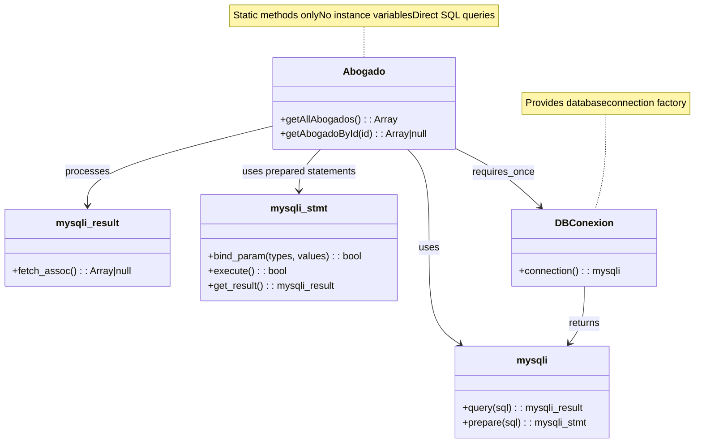
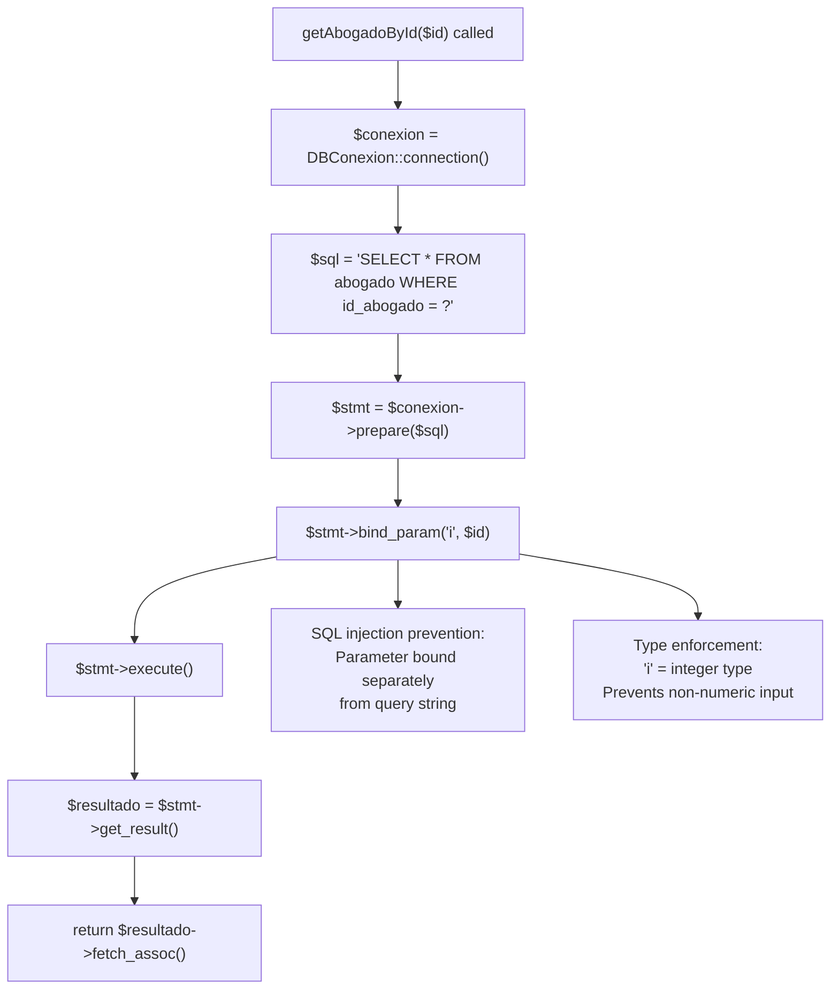
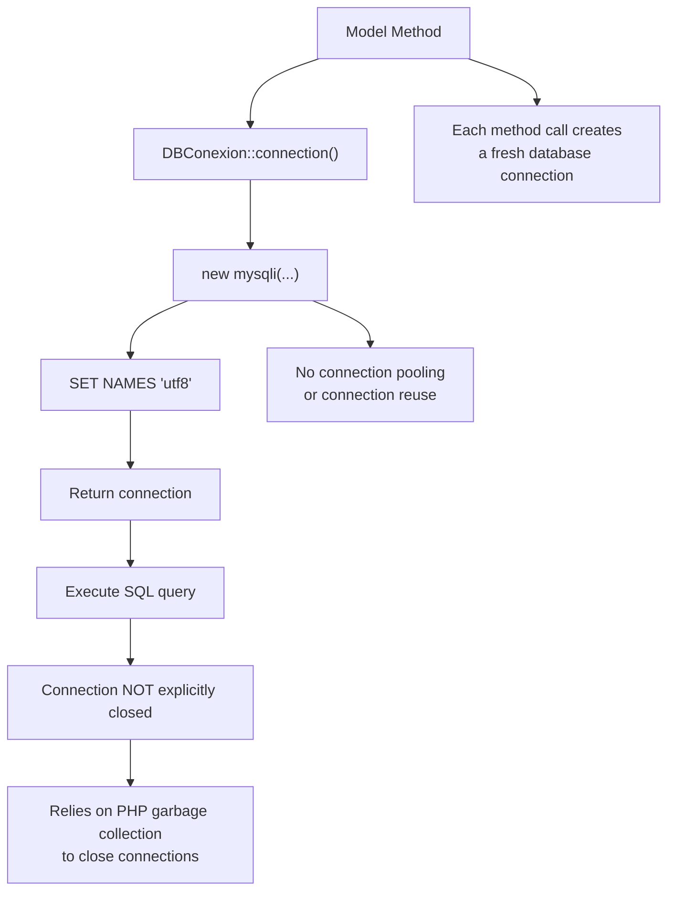
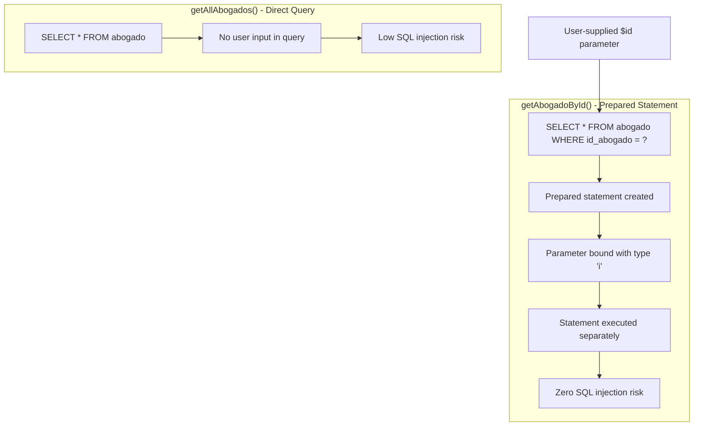
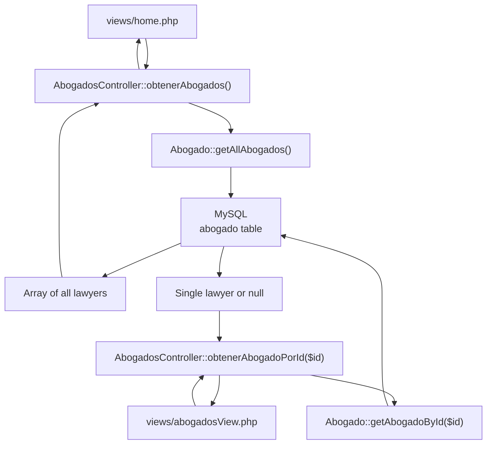
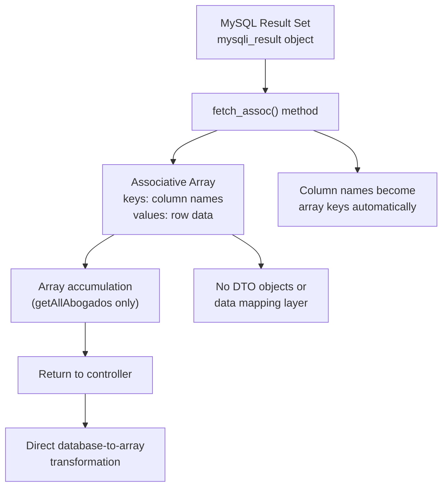
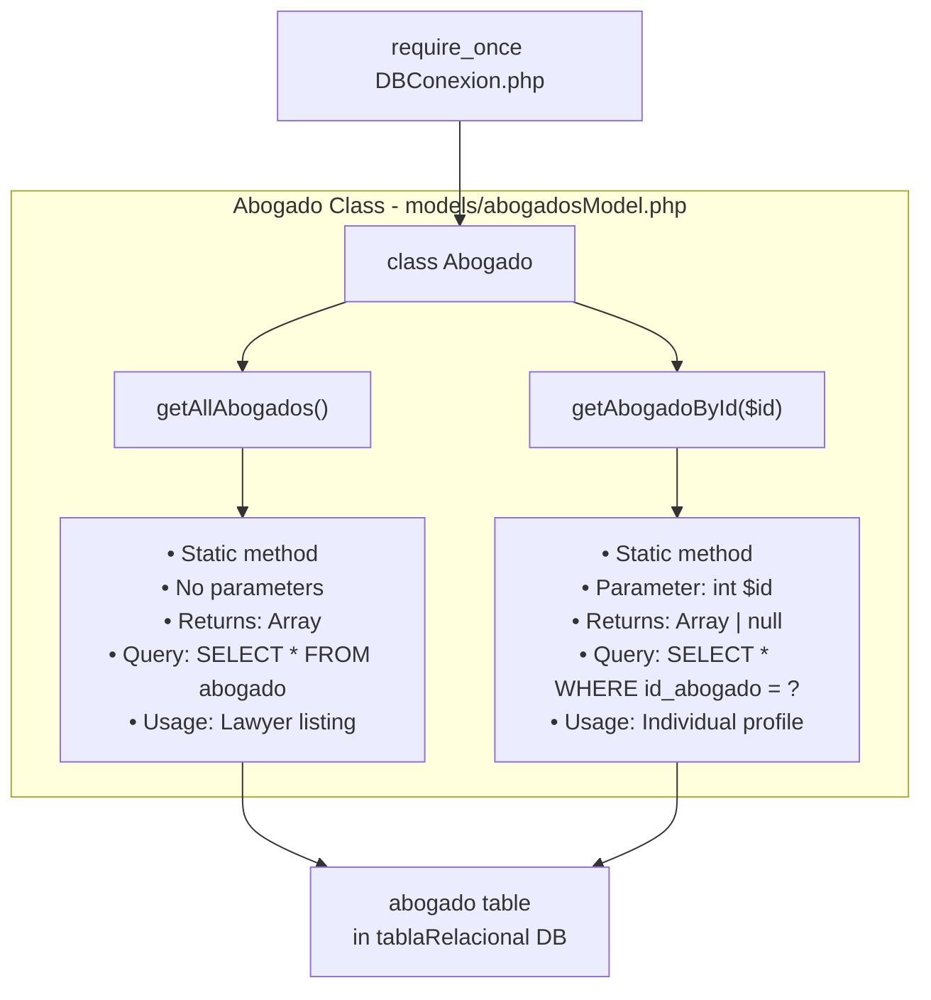

# Models Layer

> **Relevant source files**
> * [ddbb/DBConexion.php](https://github.com/GroveLive/abogado/blob/8bfc71d0/ddbb/DBConexion.php)
> * [models/abogadosModel.php](https://github.com/GroveLive/abogado/blob/8bfc71d0/models/abogadosModel.php)

## Purpose and Scope

The Models Layer is the data access component of the Abogado application, responsible for retrieving lawyer information from the MySQL database. This layer contains the `Abogado` class, which provides static methods for querying the `abogado` table and transforming database result sets into PHP associative arrays.

This document covers the `Abogado` model class and its data retrieval methods. For information about how the controller layer invokes these methods, see [Controllers Layer](/GroveLive/abogado/4.2-controllers-layer). For database connection establishment, see [Database Connection Management](/GroveLive/abogado/4.4-database-connection-management).

**Sources:** [models/abogadosModel.php L1-L28](https://github.com/GroveLive/abogado/blob/8bfc71d0/models/abogadosModel.php#L1-L28)

---

## Class Overview

The Models Layer consists of a single class, `Abogado`, defined in [models/abogadosModel.php L4-L26](https://github.com/GroveLive/abogado/blob/8bfc71d0/models/abogadosModel.php#L4-L26)

 This class follows a static method pattern where all data access methods are declared as `public static`, eliminating the need for object instantiation.

| Aspect | Implementation |
| --- | --- |
| **Class Name** | `Abogado` |
| **File Location** | `models/abogadosModel.php` |
| **Pattern** | Static method pattern (no instance required) |
| **Dependencies** | `DBConexion` class |
| **Public Methods** | `getAllAbogados()`, `getAbogadoById($id)` |
| **Database Table** | `abogado` (in `tablaRelacional` database) |

**Sources:** [models/abogadosModel.php L4-L26](https://github.com/GroveLive/abogado/blob/8bfc71d0/models/abogadosModel.php#L4-L26)

---

## Class Structure and Dependencies

The following diagram illustrates the `Abogado` class structure and its relationship with the database infrastructure:



**Sources:** [models/abogadosModel.php L2](https://github.com/GroveLive/abogado/blob/8bfc71d0/models/abogadosModel.php#L2-L2)

 [models/abogadosModel.php L4-L26](https://github.com/GroveLive/abogado/blob/8bfc71d0/models/abogadosModel.php#L4-L26)

 [ddbb/DBConexion.php L5-L16](https://github.com/GroveLive/abogado/blob/8bfc71d0/ddbb/DBConexion.php#L5-L16)

---

## Method: getAllAbogados()

### Signature and Purpose

```javascript
public static function getAllAbogados()
```

The `getAllAbogados()` method retrieves all lawyer records from the `abogado` table without filtering or pagination. This method is called by the controller to populate the lawyer listing view.

**Sources:** [models/abogadosModel.php L5-L15](https://github.com/GroveLive/abogado/blob/8bfc71d0/models/abogadosModel.php#L5-L15)

### Implementation Details

| Aspect | Implementation |
| --- | --- |
| **Return Type** | Array of associative arrays |
| **SQL Query** | `SELECT * FROM abogado` (unfiltered) |
| **Execution Method** | Direct query via `mysqli::query()` |
| **SQL Injection Risk** | None (no user input in query) |
| **Connection Management** | Creates new connection per call |
| **Result Processing** | Iterative `fetch_assoc()` loop |

The method follows this execution pattern:

1. Obtains database connection via `DBConexion::connection()` [models/abogadosModel.php L6](https://github.com/GroveLive/abogado/blob/8bfc71d0/models/abogadosModel.php#L6-L6)
2. Executes raw SQL query: `SELECT * FROM abogado` [models/abogadosModel.php L7-L8](https://github.com/GroveLive/abogado/blob/8bfc71d0/models/abogadosModel.php#L7-L8)
3. Initializes empty array for results [models/abogadosModel.php L10](https://github.com/GroveLive/abogado/blob/8bfc71d0/models/abogadosModel.php#L10-L10)
4. Iterates through result set with `while` loop [models/abogadosModel.php L11-L13](https://github.com/GroveLive/abogado/blob/8bfc71d0/models/abogadosModel.php#L11-L13)
5. Appends each row as associative array to results [models/abogadosModel.php L12](https://github.com/GroveLive/abogado/blob/8bfc71d0/models/abogadosModel.php#L12-L12)
6. Returns complete array of lawyer records [models/abogadosModel.php L14](https://github.com/GroveLive/abogado/blob/8bfc71d0/models/abogadosModel.php#L14-L14)

### Data Flow Diagram

```mermaid
sequenceDiagram
  participant AbogadosController
  participant Abogado::getAllAbogados()
  participant DBConexion::connection()
  participant MySQL Database

  AbogadosController->>Abogado::getAllAbogados(): getAllAbogados()
  Abogado::getAllAbogados()->>DBConexion::connection(): connection()
  DBConexion::connection()->>MySQL Database: new mysqli("localhost", "root", "", "tablaRelacional")
  MySQL Database-->>DBConexion::connection(): mysqli connection object
  DBConexion::connection()-->>Abogado::getAllAbogados(): $conexion
  Abogado::getAllAbogados()->>MySQL Database: $conexion->query("SELECT * FROM abogado")
  MySQL Database-->>Abogado::getAllAbogados(): mysqli_result object
  Abogado::getAllAbogados()->>Abogado::getAllAbogados(): Initialize $abogados = []
  loop [For each row in result]
    Abogado::getAllAbogados()->>Abogado::getAllAbogados(): $fila = $resultado->fetch_assoc()
    Abogado::getAllAbogados()->>Abogado::getAllAbogados(): $abogados[] = $fila
  end
  Abogado::getAllAbogados()-->>AbogadosController: Array of associative arrays
```

**Sources:** [models/abogadosModel.php L5-L15](https://github.com/GroveLive/abogado/blob/8bfc71d0/models/abogadosModel.php#L5-L15)

 [ddbb/DBConexion.php L5-L16](https://github.com/GroveLive/abogado/blob/8bfc71d0/ddbb/DBConexion.php#L5-L16)

### Return Value Structure

The method returns an array where each element is an associative array representing a lawyer record with these keys (based on the `abogado` table schema):

* `id_abogado` - Primary key identifier
* `nombre` - Lawyer's full name
* `especialidad` - Legal specialization
* `telefono` - Contact phone number
* `nacionalidad` - Nationality
* `estudios` - Educational background
* `correo` - Email address

**Sources:** [models/abogadosModel.php L11-L13](https://github.com/GroveLive/abogado/blob/8bfc71d0/models/abogadosModel.php#L11-L13)

---

## Method: getAbogadoById($id)

### Signature and Purpose

```javascript
public static function getAbogadoById($id)
```

The `getAbogadoById()` method retrieves a single lawyer record by its primary key identifier. This method is called by the controller to populate the individual profile view when a specific lawyer is requested.

**Sources:** [models/abogadosModel.php L17-L25](https://github.com/GroveLive/abogado/blob/8bfc71d0/models/abogadosModel.php#L17-L25)

### Implementation Details

| Aspect | Implementation |
| --- | --- |
| **Parameter** | `$id` - Integer lawyer identifier |
| **Return Type** | Associative array or `null` |
| **SQL Query** | `SELECT * FROM abogado WHERE id_abogado = ?` |
| **Execution Method** | Prepared statement via `mysqli_stmt` |
| **SQL Injection Prevention** | Parameter binding with type `"i"` (integer) |
| **Connection Management** | Creates new connection per call |
| **Null Handling** | Returns `null` if no matching record |

### Prepared Statement Flow

The method implements prepared statements for secure parameterized queries:

1. Obtains database connection [models/abogadosModel.php L18](https://github.com/GroveLive/abogado/blob/8bfc71d0/models/abogadosModel.php#L18-L18)
2. Prepares SQL with placeholder: `WHERE id_abogado = ?` [models/abogadosModel.php L19-L20](https://github.com/GroveLive/abogado/blob/8bfc71d0/models/abogadosModel.php#L19-L20)
3. Binds `$id` parameter as integer type `"i"` [models/abogadosModel.php L21](https://github.com/GroveLive/abogado/blob/8bfc71d0/models/abogadosModel.php#L21-L21)
4. Executes prepared statement [models/abogadosModel.php L22](https://github.com/GroveLive/abogado/blob/8bfc71d0/models/abogadosModel.php#L22-L22)
5. Retrieves result set [models/abogadosModel.php L23](https://github.com/GroveLive/abogado/blob/8bfc71d0/models/abogadosModel.php#L23-L23)
6. Returns first row as associative array or `null` [models/abogadosModel.php L24](https://github.com/GroveLive/abogado/blob/8bfc71d0/models/abogadosModel.php#L24-L24)

### Security Implementation Diagram



**Sources:** [models/abogadosModel.php L17-L25](https://github.com/GroveLive/abogado/blob/8bfc71d0/models/abogadosModel.php#L17-L25)

### Parameter Binding Details

The `bind_param()` call at [models/abogadosModel.php L21](https://github.com/GroveLive/abogado/blob/8bfc71d0/models/abogadosModel.php#L21-L21)

 uses the following syntax:

```
$stmt->bind_param("i", $id)
```

| Component | Value | Purpose |
| --- | --- | --- |
| **Type Specifier** | `"i"` | Declares parameter as integer |
| **Variable** | `$id` | The method parameter to bind |
| **Position** | First `?` placeholder | Corresponds to `WHERE id_abogado = ?` |

This binding ensures that `$id` is treated as an integer by MySQL, preventing SQL injection attacks where malicious input attempts to modify the query structure.

**Sources:** [models/abogadosModel.php L19-L21](https://github.com/GroveLive/abogado/blob/8bfc71d0/models/abogadosModel.php#L19-L21)

---

## Data Retrieval Patterns

### Connection Per Request Pattern

Both model methods follow an identical connection pattern:



**Characteristics:**

* **No Connection Pooling**: Each method invocation creates a new connection via `DBConexion::connection()` [models/abogadosModel.php L6](https://github.com/GroveLive/abogado/blob/8bfc71d0/models/abogadosModel.php#L6-L6)  [models/abogadosModel.php L18](https://github.com/GroveLive/abogado/blob/8bfc71d0/models/abogadosModel.php#L18-L18)
* **No Explicit Closure**: Neither method calls `$conexion->close()`, relying on PHP's automatic resource cleanup
* **UTF-8 Configuration**: Every connection executes `SET NAMES 'utf8'` via `DBConexion` [ddbb/DBConexion.php L12](https://github.com/GroveLive/abogado/blob/8bfc71d0/ddbb/DBConexion.php#L12-L12)
* **Stateless Design**: No connection state is preserved between method calls

**Sources:** [models/abogadosModel.php L6](https://github.com/GroveLive/abogado/blob/8bfc71d0/models/abogadosModel.php#L6-L6)

 [models/abogadosModel.php L18](https://github.com/GroveLive/abogado/blob/8bfc71d0/models/abogadosModel.php#L18-L18)

 [ddbb/DBConexion.php L5-L16](https://github.com/GroveLive/abogado/blob/8bfc71d0/ddbb/DBConexion.php#L5-L16)

### Result Processing Patterns

The two methods employ different result processing strategies:

| Method | Processing Strategy | Result Type |
| --- | --- | --- |
| `getAllAbogados()` | Iterative accumulation with `while` loop | Array of arrays |
| `getAbogadoById()` | Single `fetch_assoc()` call | Single array or `null` |

**getAllAbogados() Pattern:**

```
$abogados = [];
while ($fila = $resultado->fetch_assoc()) {
    $abogados[] = $fila;
}
return $abogados;
```

[models/abogadosModel.php L10-L14](https://github.com/GroveLive/abogado/blob/8bfc71d0/models/abogadosModel.php#L10-L14)

**getAbogadoById() Pattern:**

```
return $resultado->fetch_assoc();
```

[models/abogadosModel.php L24](https://github.com/GroveLive/abogado/blob/8bfc71d0/models/abogadosModel.php#L24-L24)

**Sources:** [models/abogadosModel.php L10-L14](https://github.com/GroveLive/abogado/blob/8bfc71d0/models/abogadosModel.php#L10-L14)

 [models/abogadosModel.php L24](https://github.com/GroveLive/abogado/blob/8bfc71d0/models/abogadosModel.php#L24-L24)

---

## SQL Query Security Analysis

### Query Comparison



### Security Measures

| Method | User Input | Security Mechanism | Vulnerability Level |
| --- | --- | --- | --- |
| `getAllAbogados()` | None | N/A (no parameters) | No risk |
| `getAbogadoById()` | `$id` parameter | Prepared statement with integer type binding | Protected |

The `getAbogadoById()` method implements prepared statements correctly:

1. **Query Separation**: SQL structure defined separately from data [models/abogadosModel.php L19](https://github.com/GroveLive/abogado/blob/8bfc71d0/models/abogadosModel.php#L19-L19)
2. **Type Enforcement**: Parameter bound as integer `"i"` [models/abogadosModel.php L21](https://github.com/GroveLive/abogado/blob/8bfc71d0/models/abogadosModel.php#L21-L21)
3. **Safe Execution**: Data transmitted separately from query [models/abogadosModel.php L22](https://github.com/GroveLive/abogado/blob/8bfc71d0/models/abogadosModel.php#L22-L22)

This prevents injection attacks such as:

* `$id = "1 OR 1=1"` - Rejected as non-integer
* `$id = "1; DROP TABLE abogado"` - Cannot alter query structure

**Sources:** [models/abogadosModel.php L7](https://github.com/GroveLive/abogado/blob/8bfc71d0/models/abogadosModel.php#L7-L7)

 [models/abogadosModel.php L19-L22](https://github.com/GroveLive/abogado/blob/8bfc71d0/models/abogadosModel.php#L19-L22)

---

## Integration with Other Layers

### Controller Integration

The `Abogado` model is instantiated and called by `AbogadosController` as documented in [Controllers Layer](/GroveLive/abogado/4.2-controllers-layer). The controller acts as a thin delegation layer:



**Sources:** [models/abogadosModel.php L5-L25](https://github.com/GroveLive/abogado/blob/8bfc71d0/models/abogadosModel.php#L5-L25)

### Database Layer Integration

The model depends on `DBConexion` for connection establishment, as documented in [Database Connection Management](/GroveLive/abogado/4.4-database-connection-management):

* **Dependency Declaration**: `require_once "../ddbb/DBConexion.php"` [models/abogadosModel.php L2](https://github.com/GroveLive/abogado/blob/8bfc71d0/models/abogadosModel.php#L2-L2)
* **Connection Acquisition**: `DBConexion::connection()` [models/abogadosModel.php L6](https://github.com/GroveLive/abogado/blob/8bfc71d0/models/abogadosModel.php#L6-L6)  [models/abogadosModel.php L18](https://github.com/GroveLive/abogado/blob/8bfc71d0/models/abogadosModel.php#L18-L18)
* **Returned Object**: `mysqli` connection with UTF-8 encoding configured

**Sources:** [models/abogadosModel.php L2](https://github.com/GroveLive/abogado/blob/8bfc71d0/models/abogadosModel.php#L2-L2)

 [models/abogadosModel.php L6](https://github.com/GroveLive/abogado/blob/8bfc71d0/models/abogadosModel.php#L6-L6)

 [models/abogadosModel.php L18](https://github.com/GroveLive/abogado/blob/8bfc71d0/models/abogadosModel.php#L18-L18)

---

## Data Transformation Pipeline

The model transforms raw database result sets into PHP data structures:



**Transformation Characteristics:**

* **No ORM**: Direct mysqli result set processing without object-relational mapping
* **Associative Arrays**: `fetch_assoc()` returns arrays with column names as keys [models/abogadosModel.php L11](https://github.com/GroveLive/abogado/blob/8bfc71d0/models/abogadosModel.php#L11-L11)  [models/abogadosModel.php L24](https://github.com/GroveLive/abogado/blob/8bfc71d0/models/abogadosModel.php#L24-L24)
* **No DTOs**: No data transfer objects or domain models - raw arrays passed to controllers
* **Column Preservation**: All columns from `SELECT *` are included in returned arrays

**Sources:** [models/abogadosModel.php L11-L13](https://github.com/GroveLive/abogado/blob/8bfc71d0/models/abogadosModel.php#L11-L13)

 [models/abogadosModel.php L24](https://github.com/GroveLive/abogado/blob/8bfc71d0/models/abogadosModel.php#L24-L24)

---

## Model Class Method Summary



**Sources:** [models/abogadosModel.php L1-L28](https://github.com/GroveLive/abogado/blob/8bfc71d0/models/abogadosModel.php#L1-L28)