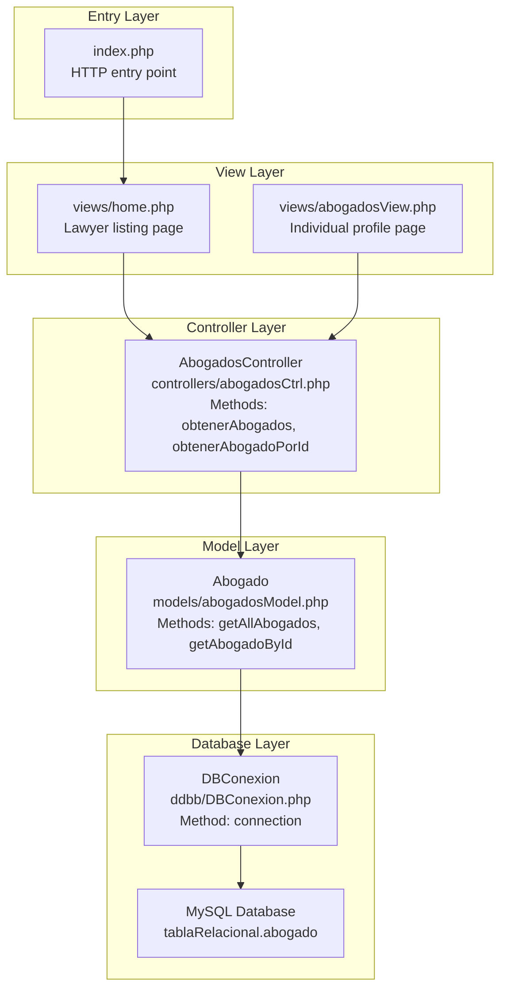
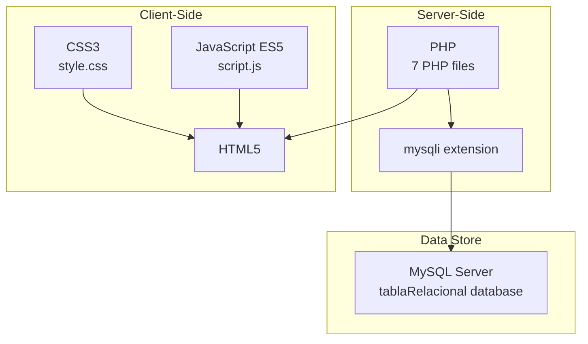
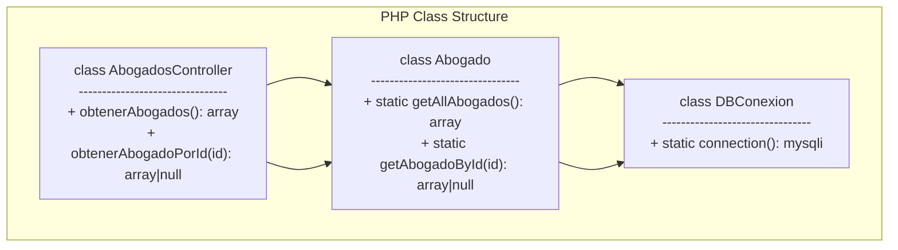
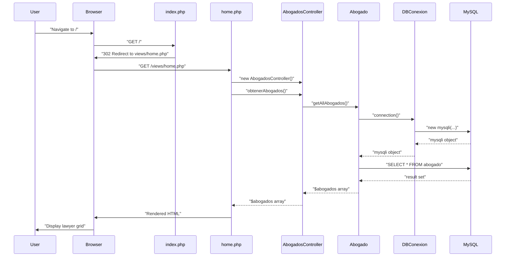

# Overview

> **Relevant source files**
> * [assets/css/style.css](https://github.com/GroveLive/abogado/blob/8bfc71d0/assets/css/style.css)
> * [assets/js/script.js](https://github.com/GroveLive/abogado/blob/8bfc71d0/assets/js/script.js)
> * [controllers/abogadosCtrl.php](https://github.com/GroveLive/abogado/blob/8bfc71d0/controllers/abogadosCtrl.php)
> * [ddbb/DBConexion.php](https://github.com/GroveLive/abogado/blob/8bfc71d0/ddbb/DBConexion.php)
> * [index.php](https://github.com/GroveLive/abogado/blob/8bfc71d0/index.php)
> * [models/abogadosModel.php](https://github.com/GroveLive/abogado/blob/8bfc71d0/models/abogadosModel.php)
> * [views/abogadosView.php](https://github.com/GroveLive/abogado/blob/8bfc71d0/views/abogadosView.php)
> * [views/home.php](https://github.com/GroveLive/abogado/blob/8bfc71d0/views/home.php)

## Purpose and Scope

This document provides a high-level introduction to the **Abogado** system, a PHP-based web application designed for browsing and viewing lawyer profiles. The system allows users to view a listing of lawyers and access detailed profile information for individual lawyers.

This page covers the system's purpose, architectural approach, technology stack, and core components. For detailed information about specific subsystems:

* Database setup and configuration: see [Getting Started](/GroveLive/abogado/2-getting-started)
* Detailed architectural patterns and layer interactions: see [System Architecture](/GroveLive/abogado/3-system-architecture)
* Individual backend components: see [Backend Components](/GroveLive/abogado/4-backend-components)
* Frontend views and styling: see [Frontend Components](/GroveLive/abogado/5-frontend-components)
* Database schema: see [Data Model and Schema](/GroveLive/abogado/6-data-model-and-schema)

**Sources:** All files provided context for this overview.

---

## System Purpose

The Abogado system serves as a **read-only lawyer directory** that enables visitors to:

1. Browse a grid-based listing of all available lawyers
2. View detailed profiles for individual lawyers including contact information, specialization, education, and nationality
3. Navigate between listing and profile views with visual feedback

The system does not implement authentication, user management, or data modification capabilities. It is designed as an information display system with a focus on clean presentation and ease of navigation.

**Sources:** [views/home.php](https://github.com/GroveLive/abogado/blob/8bfc71d0/views/home.php)

 [views/abogadosView.php](https://github.com/GroveLive/abogado/blob/8bfc71d0/views/abogadosView.php)

---

## High-Level Architecture

The system implements a **classic Model-View-Controller (MVC)** architectural pattern with clear separation of concerns across seven primary PHP files and two asset files.

### MVC Architecture Diagram



**Sources:** [index.php](https://github.com/GroveLive/abogado/blob/8bfc71d0/index.php)

 [views/home.php L1-L4](https://github.com/GroveLive/abogado/blob/8bfc71d0/views/home.php#L1-L4)

 [views/abogadosView.php L1-L10](https://github.com/GroveLive/abogado/blob/8bfc71d0/views/abogadosView.php#L1-L10)

 [controllers/abogadosCtrl.php](https://github.com/GroveLive/abogado/blob/8bfc71d0/controllers/abogadosCtrl.php)

 [models/abogadosModel.php](https://github.com/GroveLive/abogado/blob/8bfc71d0/models/abogadosModel.php)

 [ddbb/DBConexion.php](https://github.com/GroveLive/abogado/blob/8bfc71d0/ddbb/DBConexion.php)

### Layer Responsibilities

| Layer | Component | File | Responsibility |
| --- | --- | --- | --- |
| **Entry** | Entry Point | `index.php` | Redirects root URL to home view |
| **View** | Listing View | `views/home.php` | Displays grid of all lawyers |
| **View** | Profile View | `views/abogadosView.php` | Displays individual lawyer details |
| **Controller** | AbogadosController | `controllers/abogadosCtrl.php` | Delegates data requests to model |
| **Model** | Abogado | `models/abogadosModel.php` | Executes database queries |
| **Database** | DBConexion | `ddbb/DBConexion.php` | Provides mysqli connections |

**Sources:** All PHP files in the system

---

## Technology Stack

### Component Technology Map



**Sources:** [assets/css/style.css](https://github.com/GroveLive/abogado/blob/8bfc71d0/assets/css/style.css)

 [assets/js/script.js](https://github.com/GroveLive/abogado/blob/8bfc71d0/assets/js/script.js)

 all PHP files

### Technology Details

**Backend:**

* **Language:** PHP (version unspecified)
* **Database Driver:** `mysqli` extension for MySQL connectivity
* **Architecture:** Custom MVC implementation (no framework)
* **Database:** MySQL server with `tablaRelacional` database

**Frontend:**

* **Markup:** HTML5 with server-side rendering
* **Styling:** CSS3 with CSS custom properties (variables), grid layout, flexbox
* **Scripting:** Vanilla JavaScript (ES5) for progressive enhancement
* **No build tools or package managers**

**Deployment:**

* Configured for local development (`localhost`)
* Requires web server with PHP support (Apache/Nginx)

**Sources:** [ddbb/DBConexion.php L7](https://github.com/GroveLive/abogado/blob/8bfc71d0/ddbb/DBConexion.php#L7-L7)

 [assets/css/style.css L1-L10](https://github.com/GroveLive/abogado/blob/8bfc71d0/assets/css/style.css#L1-L10)

 [assets/js/script.js L1-L23](https://github.com/GroveLive/abogado/blob/8bfc71d0/assets/js/script.js#L1-L23)

---

## Core Components

### Backend Component Structure



**Sources:** [controllers/abogadosCtrl.php L4-L12](https://github.com/GroveLive/abogado/blob/8bfc71d0/controllers/abogadosCtrl.php#L4-L12)

 [models/abogadosModel.php L4-L26](https://github.com/GroveLive/abogado/blob/8bfc71d0/models/abogadosModel.php#L4-L26)

 [ddbb/DBConexion.php L3-L16](https://github.com/GroveLive/abogado/blob/8bfc71d0/ddbb/DBConexion.php#L3-L16)

### Component Descriptions

**1. AbogadosController** ([controllers/abogadosCtrl.php L4-L12](https://github.com/GroveLive/abogado/blob/8bfc71d0/controllers/abogadosCtrl.php#L4-L12)

)

* Thin delegation layer between views and model
* Method `obtenerAbogados()`: Returns all lawyers from database
* Method `obtenerAbogadoPorId($id)`: Returns specific lawyer by ID
* No business logic or data transformation

**2. Abogado Model** ([models/abogadosModel.php L4-L26](https://github.com/GroveLive/abogado/blob/8bfc71d0/models/abogadosModel.php#L4-L26)

)

* Static class containing data access methods
* Method `getAllAbogados()`: Executes `SELECT * FROM abogado` query
* Method `getAbogadoById($id)`: Uses prepared statement for parameterized query
* Returns associative arrays using `fetch_assoc()`

**3. DBConexion** ([ddbb/DBConexion.php L3-L16](https://github.com/GroveLive/abogado/blob/8bfc71d0/ddbb/DBConexion.php#L3-L16)

)

* Static factory for mysqli connection objects
* Method `connection()`: Creates new database connection
* Hardcoded credentials: `localhost`, `root`, empty password, `tablaRelacional` database
* Sets UTF-8 character encoding via `SET NAMES 'utf8'`

**4. Home View** ([views/home.php](https://github.com/GroveLive/abogado/blob/8bfc71d0/views/home.php)

)

* Displays all lawyers in a responsive grid layout
* Uses `foreach` loop to iterate over `$abogados` array
* Each lawyer card shows `nombre` (name) and `especialidad` (specialty)
* Links to profile view via `abogadosView.php?id={id_abogado}` with `.abogado-link` class

**5. Profile View** ([views/abogadosView.php](https://github.com/GroveLive/abogado/blob/8bfc71d0/views/abogadosView.php)

)

* Displays detailed information for a single lawyer
* Retrieves lawyer ID from `$_GET['id']` parameter
* Shows all fields: nombre, especialidad, telefono, nacionalidad, estudios, correo
* Applies `htmlspecialchars()` for XSS protection on all output
* Provides back link to listing page

**6. Style System** ([assets/css/style.css](https://github.com/GroveLive/abogado/blob/8bfc71d0/assets/css/style.css)

)

* CSS custom properties for theming (lines 1-10)
* Responsive grid layout using CSS Grid (lines 59-64)
* Component styles: `.menu-grid`, `.menu-item`, `.btn`, `.abogado-container`
* Media queries for mobile responsiveness (lines 123-145)
* Loading spinner animation (lines 147-174)

**7. JavaScript Enhancement** ([assets/js/script.js](https://github.com/GroveLive/abogado/blob/8bfc71d0/assets/js/script.js)

)

* Intercepts clicks on `.abogado-link` elements
* Displays loading overlay with animated spinner
* Implements 800ms delay before navigation
* Progressive enhancement: system works without JavaScript

**Sources:** All files listed above

---

## Directory Structure

```markdown
abogado/
├── index.php                    # Entry point (redirects to home.php)
├── assets/
│   ├── css/
│   │   └── style.css           # Theme system and component styles
│   └── js/
│       └── script.js           # Navigation enhancement
├── controllers/
│   └── abogadosCtrl.php        # AbogadosController class
├── models/
│   └── abogadosModel.php       # Abogado model class
├── ddbb/
│   └── DBConexion.php          # Database connection factory
└── views/
    ├── home.php                # Lawyer listing view
    └── abogadosView.php        # Lawyer profile view
```

**Sources:** All files in the codebase

---

## Request Flow Overview

### Typical User Journey



**Sources:** [index.php L2](https://github.com/GroveLive/abogado/blob/8bfc71d0/index.php#L2-L2)

 [views/home.php L1-L4](https://github.com/GroveLive/abogado/blob/8bfc71d0/views/home.php#L1-L4)

 [controllers/abogadosCtrl.php L5-L6](https://github.com/GroveLive/abogado/blob/8bfc71d0/controllers/abogadosCtrl.php#L5-L6)

 [models/abogadosModel.php L5-L14](https://github.com/GroveLive/abogado/blob/8bfc71d0/models/abogadosModel.php#L5-L14)

 [ddbb/DBConexion.php L5-L14](https://github.com/GroveLive/abogado/blob/8bfc71d0/ddbb/DBConexion.php#L5-L14)

### Flow Characteristics

1. **Initial Request**: Root URL (`/`) triggers redirect to `views/home.php` via [index.php L2](https://github.com/GroveLive/abogado/blob/8bfc71d0/index.php#L2-L2)
2. **View Initialization**: View instantiates `AbogadosController` and calls `obtenerAbogados()` ([views/home.php L3-L4](https://github.com/GroveLive/abogado/blob/8bfc71d0/views/home.php#L3-L4) )
3. **Data Retrieval**: Controller delegates to `Abogado::getAllAbogados()` which queries database ([controllers/abogadosCtrl.php L5-L6](https://github.com/GroveLive/abogado/blob/8bfc71d0/controllers/abogadosCtrl.php#L5-L6)  [models/abogadosModel.php L5-L14](https://github.com/GroveLive/abogado/blob/8bfc71d0/models/abogadosModel.php#L5-L14) )
4. **Database Connection**: Each request creates new mysqli connection via `DBConexion::connection()` ([ddbb/DBConexion.php L5-L14](https://github.com/GroveLive/abogado/blob/8bfc71d0/ddbb/DBConexion.php#L5-L14) )
5. **Rendering**: View iterates over returned array and generates HTML ([views/home.php L18-L24](https://github.com/GroveLive/abogado/blob/8bfc71d0/views/home.php#L18-L24) )
6. **Client Enhancement**: JavaScript intercepts profile links and adds loading animation ([assets/js/script.js L9-L22](https://github.com/GroveLive/abogado/blob/8bfc71d0/assets/js/script.js#L9-L22) )

For detailed request lifecycle analysis, see [Request Lifecycle](/GroveLive/abogado/3.1-request-lifecycle).

**Sources:** [index.php](https://github.com/GroveLive/abogado/blob/8bfc71d0/index.php)

 [views/home.php](https://github.com/GroveLive/abogado/blob/8bfc71d0/views/home.php)

 [controllers/abogadosCtrl.php](https://github.com/GroveLive/abogado/blob/8bfc71d0/controllers/abogadosCtrl.php)

 [models/abogadosModel.php](https://github.com/GroveLive/abogado/blob/8bfc71d0/models/abogadosModel.php)

 [ddbb/DBConexion.php](https://github.com/GroveLive/abogado/blob/8bfc71d0/ddbb/DBConexion.php)

 [assets/js/script.js](https://github.com/GroveLive/abogado/blob/8bfc71d0/assets/js/script.js)

---

## Key Features

### 1. Master-Detail Navigation Pattern

* **Listing Page**: Grid display of all lawyers with name and specialty
* **Detail Page**: Complete profile with all fields (phone, nationality, education, email)
* **Navigation**: Links use query parameter `?id={id_abogado}` for profile access

### 2. Responsive Design

* Mobile-first CSS Grid layout ([assets/css/style.css L59-L64](https://github.com/GroveLive/abogado/blob/8bfc71d0/assets/css/style.css#L59-L64) )
* Breakpoints at 768px and 480px ([assets/css/style.css L123-L145](https://github.com/GroveLive/abogado/blob/8bfc71d0/assets/css/style.css#L123-L145) )
* Adaptive grid columns using `auto-fill` and `minmax()`

### 3. Progressive Enhancement

* Base functionality works without JavaScript
* JavaScript adds loading animations and visual feedback
* 800ms artificial delay for perceived performance ([assets/js/script.js L18-L20](https://github.com/GroveLive/abogado/blob/8bfc71d0/assets/js/script.js#L18-L20) )

### 4. Security Measures

* Prepared statements prevent SQL injection ([models/abogadosModel.php L20-L21](https://github.com/GroveLive/abogado/blob/8bfc71d0/models/abogadosModel.php#L20-L21) )
* `htmlspecialchars()` prevents XSS attacks on output ([views/abogadosView.php L23-L34](https://github.com/GroveLive/abogado/blob/8bfc71d0/views/abogadosView.php#L23-L34) )
* UTF-8 encoding set at connection level ([ddbb/DBConexion.php L12](https://github.com/GroveLive/abogado/blob/8bfc71d0/ddbb/DBConexion.php#L12-L12) )

### 5. Theme System

* CSS custom properties for consistent theming ([assets/css/style.css L1-L10](https://github.com/GroveLive/abogado/blob/8bfc71d0/assets/css/style.css#L1-L10) )
* Dark color scheme with purple accents
* Hover effects and smooth transitions throughout

**Sources:** [views/home.php](https://github.com/GroveLive/abogado/blob/8bfc71d0/views/home.php)

 [views/abogadosView.php](https://github.com/GroveLive/abogado/blob/8bfc71d0/views/abogadosView.php)

 [assets/css/style.css](https://github.com/GroveLive/abogado/blob/8bfc71d0/assets/css/style.css)

 [assets/js/script.js](https://github.com/GroveLive/abogado/blob/8bfc71d0/assets/js/script.js)

 [models/abogadosModel.php](https://github.com/GroveLive/abogado/blob/8bfc71d0/models/abogadosModel.php)

 [ddbb/DBConexion.php](https://github.com/GroveLive/abogado/blob/8bfc71d0/ddbb/DBConexion.php)

---

## Limitations and Design Considerations

**Current Limitations:**

* Hardcoded database credentials not suitable for production ([ddbb/DBConexion.php L7](https://github.com/GroveLive/abogado/blob/8bfc71d0/ddbb/DBConexion.php#L7-L7) )
* No authentication or authorization system
* No data modification capabilities (read-only)
* New database connection per request (no connection pooling)
* Error messages may expose system details ([views/abogadosView.php L5-L14](https://github.com/GroveLive/abogado/blob/8bfc71d0/views/abogadosView.php#L5-L14) )

**Design Approach:**

* Server-side rendering (no client-side framework)
* Stateless request handling (no session management)
* Views directly instantiate controllers (tight coupling)
* Controllers act as thin pass-through layers

For security considerations and production deployment requirements, see [Security Considerations](/GroveLive/abogado/7-security-considerations) and [Configuration and Deployment](/GroveLive/abogado/8-configuration-and-deployment).

**Sources:** [ddbb/DBConexion.php L7](https://github.com/GroveLive/abogado/blob/8bfc71d0/ddbb/DBConexion.php#L7-L7)

 [views/abogadosView.php L5-L14](https://github.com/GroveLive/abogado/blob/8bfc71d0/views/abogadosView.php#L5-L14)

 all controller and view files