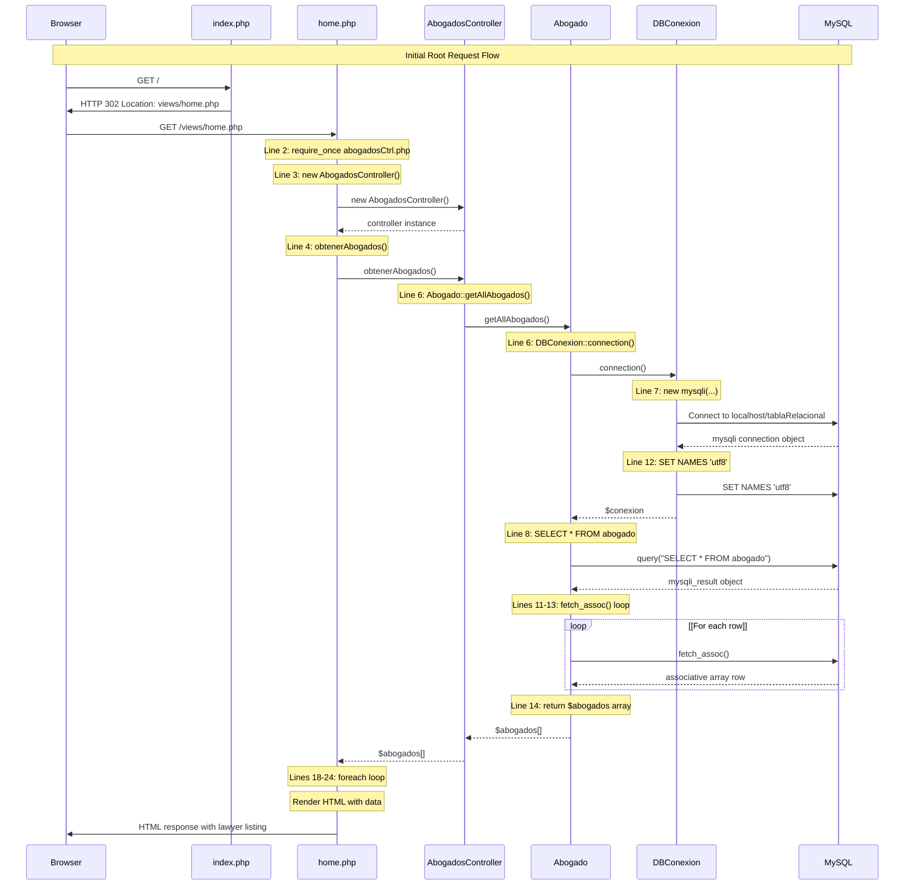
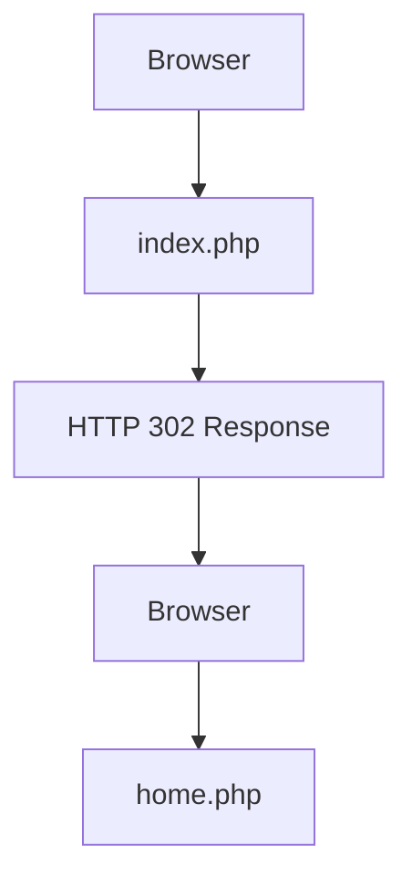
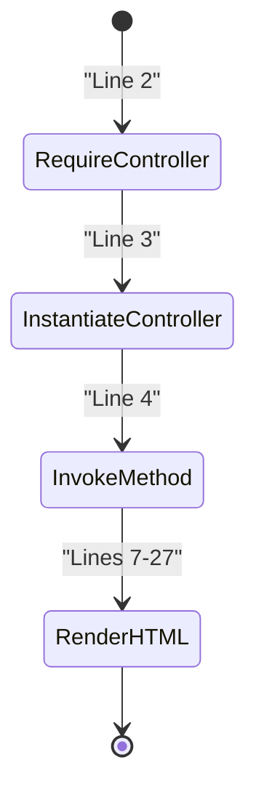
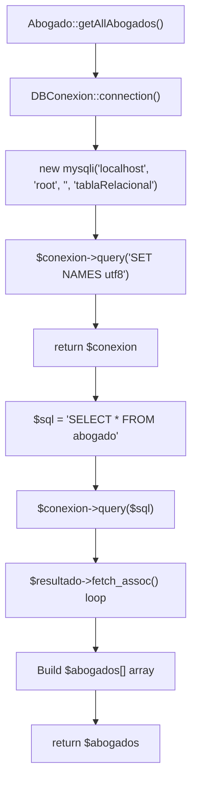
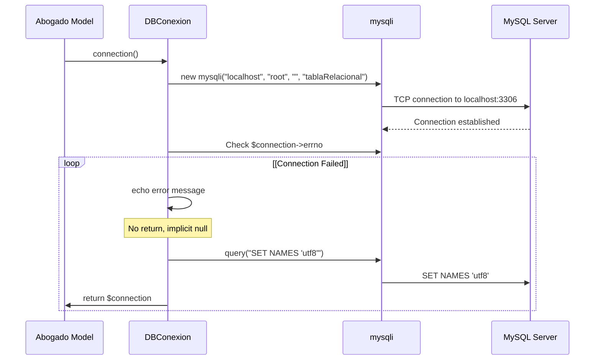
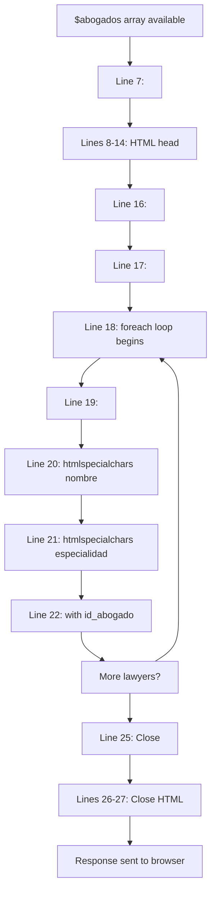
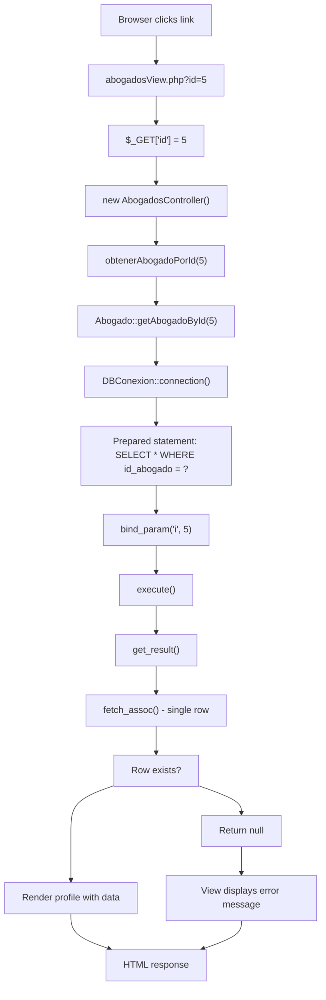
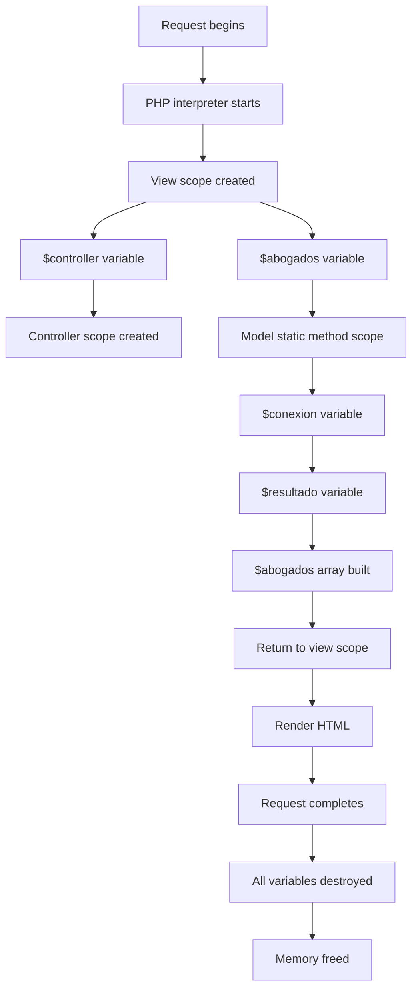

# Request Lifecycle

> **Relevant source files**
> * [controllers/abogadosCtrl.php](https://github.com/GroveLive/abogado/blob/8bfc71d0/controllers/abogadosCtrl.php)
> * [ddbb/DBConexion.php](https://github.com/GroveLive/abogado/blob/8bfc71d0/ddbb/DBConexion.php)
> * [index.php](https://github.com/GroveLive/abogado/blob/8bfc71d0/index.php)
> * [models/abogadosModel.php](https://github.com/GroveLive/abogado/blob/8bfc71d0/models/abogadosModel.php)
> * [views/home.php](https://github.com/GroveLive/abogado/blob/8bfc71d0/views/home.php)

## Purpose and Scope

This document traces the complete lifecycle of HTTP requests through the Abogado application, from the initial browser request to the final HTML response. It covers the redirect mechanism at the entry point, view initialization, controller instantiation, model data retrieval, database access, and response generation.

For information about how data transforms through layers, see [Data Flow](/GroveLive/abogado/3.2-data-flow). For details on individual components, see [Backend Components](/GroveLive/abogado/4-backend-components) and [Frontend Components](/GroveLive/abogado/5-frontend-components).

**Sources:** All diagrams in "High-Level System Architecture", particularly "Request Flow - User Journey Through the System"

---

## Request Flow Overview

The application handles two primary request patterns, both following a similar architecture but with different endpoints and data requirements.

| Request Type | Entry URL | Target View | Controller Method | Model Method | Response |
| --- | --- | --- | --- | --- | --- |
| **Root Access** | `/` or `/index.php` | `views/home.php` | `obtenerAbogados()` | `getAllAbogados()` | HTML listing of all lawyers |
| **Lawyer Listing** | `/views/home.php` | `views/home.php` | `obtenerAbogados()` | `getAllAbogados()` | HTML listing of all lawyers |
| **Lawyer Profile** | `/views/abogadosView.php?id=X` | `views/abogadosView.php` | `obtenerAbogadoPorId($id)` | `getAbogadoById($id)` | HTML profile of single lawyer |

**Sources:** [index.php L1-L4](https://github.com/GroveLive/abogado/blob/8bfc71d0/index.php#L1-L4)

 [views/home.php L1-L27](https://github.com/GroveLive/abogado/blob/8bfc71d0/views/home.php#L1-L27)

 [controllers/abogadosCtrl.php L1-L14](https://github.com/GroveLive/abogado/blob/8bfc71d0/controllers/abogadosCtrl.php#L1-L14)

 [models/abogadosModel.php L1-L27](https://github.com/GroveLive/abogado/blob/8bfc71d0/models/abogadosModel.php#L1-L27)

---

## Complete Request Lifecycle Diagram

The following diagram illustrates the complete request lifecycle from initial HTTP request through database access and response generation.

**Sources:** [index.php L1-L4](https://github.com/GroveLive/abogado/blob/8bfc71d0/index.php#L1-L4)

 [views/home.php L1-L27](https://github.com/GroveLive/abogado/blob/8bfc71d0/views/home.php#L1-L27)

 [controllers/abogadosCtrl.php L4-L7](https://github.com/GroveLive/abogado/blob/8bfc71d0/controllers/abogadosCtrl.php#L4-L7)

 [models/abogadosModel.php L5-L15](https://github.com/GroveLive/abogado/blob/8bfc71d0/models/abogadosModel.php#L5-L15)

 [ddbb/DBConexion.php L5-L16](https://github.com/GroveLive/abogado/blob/8bfc71d0/ddbb/DBConexion.php#L5-L16)

---

## Phase 1: Entry Point and Redirect

### Initial Request Handling

When a user navigates to the application root URL (`/` or `/index.php`), the web server executes the entry point script.

**Entry Point Flow:**

The `index.php` script executes three statements:

1. **Line 2**: `header("Location: views/home.php")` - Sets the HTTP Location header for redirection
2. **Line 3**: `exit` - Terminates script execution immediately
3. No HTML output is generated

This creates a **302 Found** redirect response that instructs the browser to issue a second request to `views/home.php`.

**Characteristics:**

* **Synchronous**: The redirect happens before any HTML is generated
* **Stateless**: No session data or cookies are set
* **Deterministic**: Always redirects to the same location
* **Immediate**: The `exit` statement prevents any further PHP execution

**Sources:** [index.php L1-L4](https://github.com/GroveLive/abogado/blob/8bfc71d0/index.php#L1-L4)

---

## Phase 2: View Initialization

### Home View Request Processing

After the redirect, the browser requests `views/home.php`. This view file executes PHP code before any HTML is output.

**Initialization Sequence:**

1. **Line 2**: `require_once "../controllers/abogadosCtrl.php"` - Loads the controller class definition
2. **Line 3**: `$controller = new AbogadosController()` - Instantiates a new controller instance
3. **Line 4**: `$abogados = $controller->obtenerAbogados()` - Invokes the data retrieval method
4. **Lines 7-27**: HTML document structure begins after PHP block closes

The view stores the complete lawyer dataset in the `$abogados` variable before rendering begins. This data becomes available to the PHP template code in the HTML section.

**Sources:** [views/home.php L1-L5](https://github.com/GroveLive/abogado/blob/8bfc71d0/views/home.php#L1-L5)

---

## Phase 3: Controller Delegation

### AbogadosController Method Invocation

The controller acts as a thin delegation layer between the view and model. No business logic or data transformation occurs at this layer.

**Controller Method Structure:**

| Method | Parameters | Return Type | Delegates To |
| --- | --- | --- | --- |
| `obtenerAbogados()` | None | `array` | `Abogado::getAllAbogados()` |
| `obtenerAbogadoPorId($id)` | `int $id` | `array\|null` | `Abogado::getAbogadoById($id)` |

**Method Execution:**

The `obtenerAbogados()` method at [controllers/abogadosCtrl.php L5-L7](https://github.com/GroveLive/abogado/blob/8bfc71d0/controllers/abogadosCtrl.php#L5-L7)

 consists of a single statement:

* **Line 6**: `return Abogado::getAllAbogados();`

This direct return statement means:

* No data caching
* No error handling
* No data transformation
* No logging or auditing
* Direct pass-through of model return values

**Sources:** [controllers/abogadosCtrl.php L4-L12](https://github.com/GroveLive/abogado/blob/8bfc71d0/controllers/abogadosCtrl.php#L4-L12)

---

## Phase 4: Model Data Retrieval

### Database Query Execution

The `Abogado` model class contains static methods that execute SQL queries and transform result sets into PHP arrays.

**getAllAbogados() Execution Flow:**

**Line-by-Line Execution:**

1. **Line 6**: `$conexion = DBConexion::connection()` - Obtains a fresh database connection
2. **Line 7**: `$sql = "SELECT * FROM abogado"` - Defines the query string
3. **Line 8**: `$resultado = $conexion->query($sql)` - Executes the query, returns `mysqli_result`
4. **Line 10**: `$abogados = []` - Initializes an empty accumulator array
5. **Lines 11-13**: `while` loop iterates through all result rows * `$fila = $resultado->fetch_assoc()` - Fetches one row as associative array * `$abogados[] = $fila` - Appends row to accumulator
6. **Line 14**: `return $abogados` - Returns the complete array

**Data Type Transformations:**

* `mysqli_result` object → Array of associative arrays
* Database column types → PHP string types (default mysqli behavior)
* Each row becomes: `['id_abogado' => '1', 'nombre' => 'Juan', ...]`

**Sources:** [models/abogadosModel.php L5-L15](https://github.com/GroveLive/abogado/blob/8bfc71d0/models/abogadosModel.php#L5-L15)

---

## Phase 5: Database Connection Establishment

### DBConexion::connection() Method

The database connection is created fresh for each request with no connection pooling or persistence.

**Connection Process:**

**Connection Parameters:**

| Parameter | Value | Source |
| --- | --- | --- |
| Host | `"localhost"` | Hardcoded in line 7 |
| Username | `"root"` | Hardcoded in line 7 |
| Password | `""` (empty) | Hardcoded in line 7 |
| Database | `"tablaRelacional"` | Hardcoded in line 7 |

**Post-Connection Setup:**

After successful connection, line 12 executes `$connection->query("SET NAMES 'utf8'")`. This sets the client character set to UTF-8, ensuring proper encoding of text data containing special characters or non-ASCII characters.

**Error Handling:**

If `$connection->errno` is truthy (line 9), the method echoes an error message via `mysqli_connect_error()` but does not explicitly return. This creates an implicit `null` return value, which will cause fatal errors in calling code when attempting to invoke methods on null.

**Sources:** [ddbb/DBConexion.php L5-L16](https://github.com/GroveLive/abogado/blob/8bfc71d0/ddbb/DBConexion.php#L5-L16)

---

## Phase 6: Response Generation

### HTML Rendering with Data Iteration

After the controller method returns, execution returns to the view file where the HTML template begins rendering.

**Template Rendering Flow:**

**Data Output with XSS Protection:**

Each lawyer in the `$abogados` array is rendered using:

* **Line 20**: `<?= htmlspecialchars($abogado['nombre']); ?>` - Escapes the lawyer name
* **Line 21**: `<?= htmlspecialchars($abogado['especialidad']); ?>` - Escapes the specialty
* **Line 22**: `<?= $abogado['id_abogado']; ?>` - Outputs ID without escaping (safe for integer context)

The `htmlspecialchars()` function converts special characters (`<`, `>`, `&`, `"`, `'`) to HTML entities, preventing XSS attacks if database data contains malicious scripts.

**Link Generation:**

Line 22 creates a link to the profile view: `<a href="abogadosView.php?id=<?= $abogado['id_abogado']; ?>">`

This link initiates a new request lifecycle for the profile detail view when clicked.

**Sources:** [views/home.php L7-L27](https://github.com/GroveLive/abogado/blob/8bfc71d0/views/home.php#L7-L27)

---

## Profile Detail Request Lifecycle

When a user clicks a "Ver Perfil" link, a second request lifecycle begins with different characteristics.

**Profile Request Differences:**

**Key Differences from Listing Flow:**

| Aspect | Listing Flow | Profile Flow |
| --- | --- | --- |
| **Query Type** | `query()` - unprepared | `prepare()` - prepared statement |
| **Parameters** | None | `$id` from `$_GET['id']` |
| **SQL** | `SELECT * FROM abogado` | `SELECT * WHERE id_abogado = ?` |
| **Return Type** | Array of arrays | Single array or `null` |
| **Result Processing** | `while` loop with `fetch_assoc()` | Single `fetch_assoc()` call |
| **Error Handling** | None (empty array if no results) | `null` check required in view |

**Prepared Statement Execution:**

Lines 19-24 in [models/abogadosModel.php L17-L25](https://github.com/GroveLive/abogado/blob/8bfc71d0/models/abogadosModel.php#L17-L25)

:

1. **Line 20**: `$stmt = $conexion->prepare($sql)` - Creates prepared statement
2. **Line 21**: `$stmt->bind_param("i", $id)` - Binds integer parameter (prevents SQL injection)
3. **Line 22**: `$stmt->execute()` - Executes query with bound parameter
4. **Line 23**: `$resultado = $stmt->get_result()` - Retrieves result set
5. **Line 24**: `return $resultado->fetch_assoc()` - Returns single row or `null`

**Sources:** [models/abogadosModel.php L17-L26](https://github.com/GroveLive/abogado/blob/8bfc71d0/models/abogadosModel.php#L17-L26)

 [controllers/abogadosCtrl.php L9-L11](https://github.com/GroveLive/abogado/blob/8bfc71d0/controllers/abogadosCtrl.php#L9-L11)

---

## Request Lifecycle Timing Characteristics

### Synchronous Execution Model

The entire request lifecycle executes synchronously on the server before any response is sent. No streaming or progressive rendering occurs.

**Execution Order Guarantees:**

1. **Sequential Dependency Loading**: Each `require_once` statement blocks until the file is loaded and parsed
2. **Blocking Database Operations**: All database queries execute synchronously; the PHP script waits for MySQL to return results
3. **Atomic Response**: The complete HTML document is generated in memory before transmission begins
4. **No Concurrency**: Each request is handled independently with no shared state or connection pooling

**Performance Implications:**

| Phase | Blocking Operations | Typical Duration |
| --- | --- | --- |
| Redirect | File I/O for index.php | < 1ms |
| View initialization | 3× `require_once` statements | < 10ms |
| Controller instantiation | Class instantiation overhead | < 1ms |
| Database connection | TCP connection + authentication | 1-10ms |
| Query execution | Full table scan on `abogado` | 1-100ms (depends on row count) |
| Result fetching | Row-by-row network transfer | 1-10ms |
| HTML rendering | Template iteration | 1-10ms |

**Total typical response time**: 5-150ms for complete request lifecycle (excluding network transmission time).

**Sources:** All source files referenced above

---

## Request State and Memory Management

### Variable Scope and Lifetime

Each request creates isolated variable scopes with no persistence between requests.

**Variable Lifecycle:**

**Scope Boundaries:**

* **View Scope** ([views/home.php L1-L27](https://github.com/GroveLive/abogado/blob/8bfc71d0/views/home.php#L1-L27) ): Contains `$controller` and `$abogados` variables
* **Controller Instance Scope**: Contains no instance variables (stateless)
* **Model Static Method Scope** ([models/abogadosModel.php L5-L15](https://github.com/GroveLive/abogado/blob/8bfc71d0/models/abogadosModel.php#L5-L15) ): Contains `$conexion`, `$resultado`, `$abogados` variables
* **Database Connection Scope**: `$conexion` exists only within model method; no connection persistence

**Memory Deallocation:**

When the request completes:

1. All local variables in all scopes are destroyed
2. The database connection object is garbage collected, closing the TCP connection
3. No state persists for the next request
4. Each new request starts with a clean memory state

**Sources:** [views/home.php L1-L27](https://github.com/GroveLive/abogado/blob/8bfc71d0/views/home.php#L1-L27)

 [models/abogadosModel.php L5-L15](https://github.com/GroveLive/abogado/blob/8bfc71d0/models/abogadosModel.php#L5-L15)