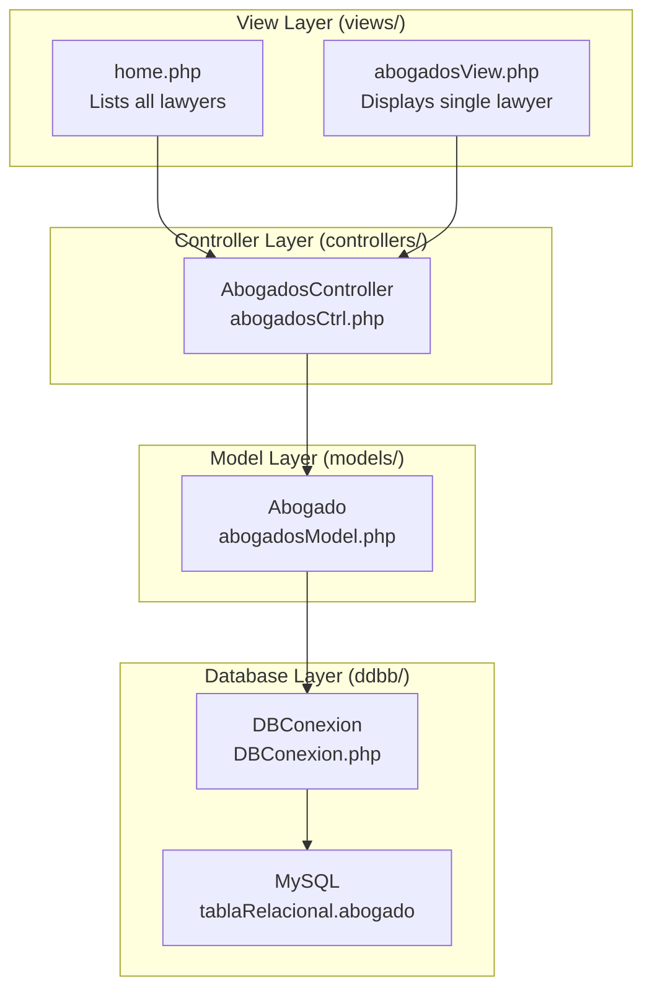
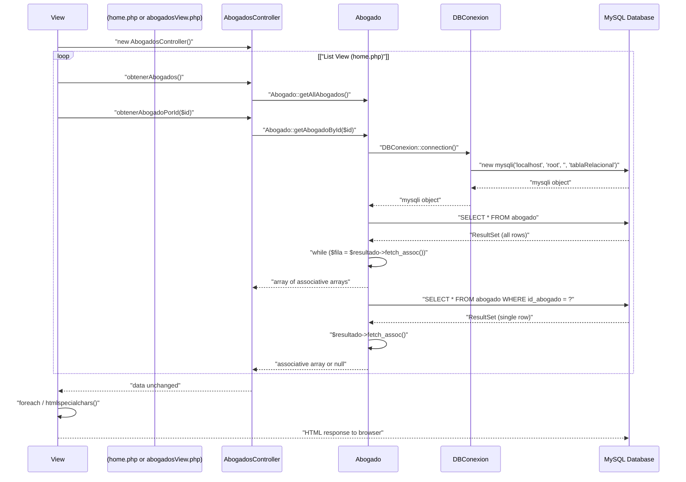
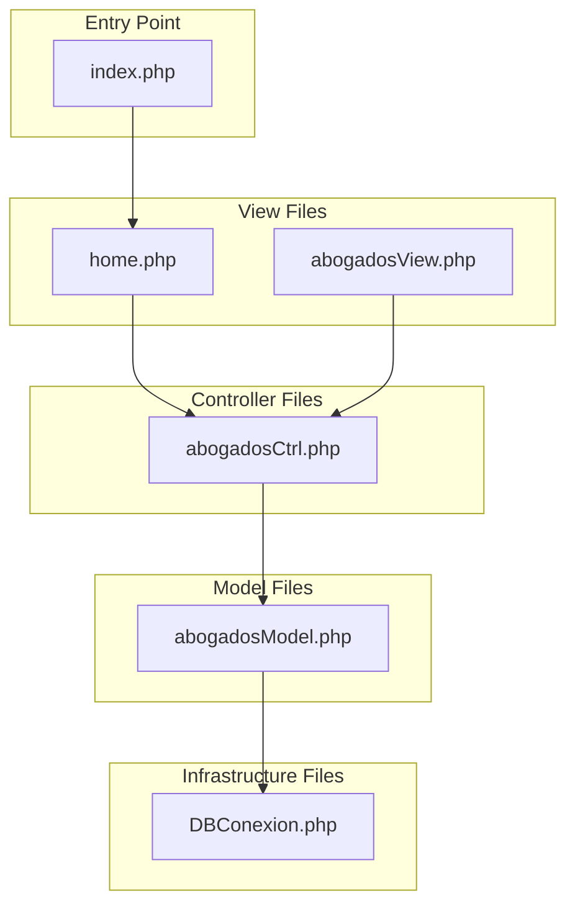

# System Architecture

> **Relevant source files**
> * [controllers/abogadosCtrl.php](https://github.com/GroveLive/abogado/blob/8bfc71d0/controllers/abogadosCtrl.php)
> * [ddbb/DBConexion.php](https://github.com/GroveLive/abogado/blob/8bfc71d0/ddbb/DBConexion.php)
> * [index.php](https://github.com/GroveLive/abogado/blob/8bfc71d0/index.php)
> * [models/abogadosModel.php](https://github.com/GroveLive/abogado/blob/8bfc71d0/models/abogadosModel.php)
> * [views/abogadosView.php](https://github.com/GroveLive/abogado/blob/8bfc71d0/views/abogadosView.php)
> * [views/home.php](https://github.com/GroveLive/abogado/blob/8bfc71d0/views/home.php)

## Purpose and Scope

This document describes the architectural design of the Abogado system, detailing its MVC pattern implementation, layer separation, and component interactions. The system implements a classic three-tier MVC architecture where views directly instantiate controllers, controllers delegate to models, and models interact with the database layer.

For detailed information about specific request flows, see [Request Lifecycle](/GroveLive/abogado/3.1-request-lifecycle). For data transformation patterns, see [Data Flow](/GroveLive/abogado/3.2-data-flow). For individual component details, see [Backend Components](/GroveLive/abogado/4-backend-components) and [Frontend Components](/GroveLive/abogado/5-frontend-components).

---

## MVC Pattern Implementation

The system implements a traditional Model-View-Controller (MVC) architectural pattern with strict layer separation. Each layer has a single, well-defined responsibility with unidirectional dependencies flowing from views down to the database.

### Layer Structure

| Layer | Location | Responsibilities | Key Components |
| --- | --- | --- | --- |
| **View Layer** | `views/` | HTML rendering, user input handling, output sanitization | `home.php`, `abogadosView.php` |
| **Controller Layer** | `controllers/` | Request routing, method delegation | `AbogadosController` |
| **Model Layer** | `models/` | Data access, SQL execution, result transformation | `Abogado` |
| **Database Layer** | `ddbb/` | Connection management, character encoding | `DBConexion` |

**Diagram: MVC Layer Architecture with File Paths**



**Sources:** [views/home.php L1-L27](https://github.com/GroveLive/abogado/blob/8bfc71d0/views/home.php#L1-L27)

 [views/abogadosView.php L1-L40](https://github.com/GroveLive/abogado/blob/8bfc71d0/views/abogadosView.php#L1-L40)

 [controllers/abogadosCtrl.php L1-L15](https://github.com/GroveLive/abogado/blob/8bfc71d0/controllers/abogadosCtrl.php#L1-L15)

 [models/abogadosModel.php L1-L28](https://github.com/GroveLive/abogado/blob/8bfc71d0/models/abogadosModel.php#L1-L28)

 [ddbb/DBConexion.php L1-L17](https://github.com/GroveLive/abogado/blob/8bfc71d0/ddbb/DBConexion.php#L1-L17)

---

## Component Organization

### View Layer Components

The view layer consists of two PHP files that handle HTML rendering and user interaction:

* **`views/home.php`** - Instantiates `AbogadosController` at [views/home.php L3](https://github.com/GroveLive/abogado/blob/8bfc71d0/views/home.php#L3-L3)  calls `obtenerAbogados()` at [views/home.php L4](https://github.com/GroveLive/abogado/blob/8bfc71d0/views/home.php#L4-L4)  and renders a grid of lawyer cards
* **`views/abogadosView.php`** - Instantiates `AbogadosController` at [views/abogadosView.php L9](https://github.com/GroveLive/abogado/blob/8bfc71d0/views/abogadosView.php#L9-L9)  calls `obtenerAbogadoPorId($_GET['id'])` at [views/abogadosView.php L10](https://github.com/GroveLive/abogado/blob/8bfc71d0/views/abogadosView.php#L10-L10)  and renders detailed profile information

Both views use the same controller instance but invoke different methods to retrieve different datasets.

### Controller Layer Components

The controller layer consists of a single class with two delegation methods:

**`AbogadosController`** [controllers/abogadosCtrl.php L4-L12](https://github.com/GroveLive/abogado/blob/8bfc71d0/controllers/abogadosCtrl.php#L4-L12)

* `obtenerAbogados()` - Delegates to `Abogado::getAllAbogados()` at [controllers/abogadosCtrl.php L6](https://github.com/GroveLive/abogado/blob/8bfc71d0/controllers/abogadosCtrl.php#L6-L6)
* `obtenerAbogadoPorId($id)` - Delegates to `Abogado::getAbogadoById($id)` at [controllers/abogadosCtrl.php L10](https://github.com/GroveLive/abogado/blob/8bfc71d0/controllers/abogadosCtrl.php#L10-L10)

The controller performs no data transformation or business logic, serving purely as a facade between views and models.

### Model Layer Components

The model layer consists of a single class with static data access methods:

**`Abogado`** [models/abogadosModel.php L4-L26](https://github.com/GroveLive/abogado/blob/8bfc71d0/models/abogadosModel.php#L4-L26)

* `getAllAbogados()` - Executes `SELECT * FROM abogado` at [models/abogadosModel.php L7](https://github.com/GroveLive/abogado/blob/8bfc71d0/models/abogadosModel.php#L7-L7)  returns array of all lawyer records
* `getAbogadoById($id)` - Executes prepared statement `SELECT * FROM abogado WHERE id_abogado = ?` at [models/abogadosModel.php L19-L21](https://github.com/GroveLive/abogado/blob/8bfc71d0/models/abogadosModel.php#L19-L21)  returns single lawyer record or null

Both methods obtain database connections via `DBConexion::connection()` at [models/abogadosModel.php L6](https://github.com/GroveLive/abogado/blob/8bfc71d0/models/abogadosModel.php#L6-L6)

 and [models/abogadosModel.php L18](https://github.com/GroveLive/abogado/blob/8bfc71d0/models/abogadosModel.php#L18-L18)

### Database Layer Components

The database layer consists of a single static connection factory:

**`DBConexion`** [ddbb/DBConexion.php L3-L16](https://github.com/GroveLive/abogado/blob/8bfc71d0/ddbb/DBConexion.php#L3-L16)

* `connection()` - Creates new `mysqli` connection to `localhost` with hardcoded credentials at [ddbb/DBConexion.php L7](https://github.com/GroveLive/abogado/blob/8bfc71d0/ddbb/DBConexion.php#L7-L7)  sets UTF-8 encoding at [ddbb/DBConexion.php L12](https://github.com/GroveLive/abogado/blob/8bfc71d0/ddbb/DBConexion.php#L12-L12)  returns connection object

**Sources:** [controllers/abogadosCtrl.php L1-L15](https://github.com/GroveLive/abogado/blob/8bfc71d0/controllers/abogadosCtrl.php#L1-L15)

 [models/abogadosModel.php L1-L28](https://github.com/GroveLive/abogado/blob/8bfc71d0/models/abogadosModel.php#L1-L28)

 [ddbb/DBConexion.php L1-L17](https://github.com/GroveLive/abogado/blob/8bfc71d0/ddbb/DBConexion.php#L1-L17)

---

## Component Interaction Patterns

### Method Call Chain

The system follows a consistent method invocation pattern for both list and detail views:

**Diagram: Method Call Chain with Actual Method Names**



**Sources:** [views/home.php L2-L4](https://github.com/GroveLive/abogado/blob/8bfc71d0/views/home.php#L2-L4)

 [views/abogadosView.php L2-L10](https://github.com/GroveLive/abogado/blob/8bfc71d0/views/abogadosView.php#L2-L10)

 [controllers/abogadosCtrl.php L5-L11](https://github.com/GroveLive/abogado/blob/8bfc71d0/controllers/abogadosCtrl.php#L5-L11)

 [models/abogadosModel.php L5-L25](https://github.com/GroveLive/abogado/blob/8bfc71d0/models/abogadosModel.php#L5-L25)

---

## Dependency Management

### File Inclusion Pattern

The system uses `require_once` for all dependencies, creating a chain of file inclusions:

**Diagram: Dependency Chain**



**Inclusion Order:**

1. Browser requests `index.php`
2. `index.php` redirects to `views/home.php` at [index.php L2](https://github.com/GroveLive/abogado/blob/8bfc71d0/index.php#L2-L2)
3. View includes controller: `require_once "../controllers/abogadosCtrl.php"` at [views/home.php L2](https://github.com/GroveLive/abogado/blob/8bfc71d0/views/home.php#L2-L2)
4. Controller includes model: `require_once "../models/abogadosModel.php"` at [controllers/abogadosCtrl.php L2](https://github.com/GroveLive/abogado/blob/8bfc71d0/controllers/abogadosCtrl.php#L2-L2)
5. Model includes database: `require_once "../ddbb/DBConexion.php"` at [models/abogadosModel.php L2](https://github.com/GroveLive/abogado/blob/8bfc71d0/models/abogadosModel.php#L2-L2)

This creates a dependency cascade where each layer automatically includes its dependencies when loaded.

**Sources:** [index.php L1-L5](https://github.com/GroveLive/abogado/blob/8bfc71d0/index.php#L1-L5)

 [views/home.php L2](https://github.com/GroveLive/abogado/blob/8bfc71d0/views/home.php#L2-L2)

 [views/abogadosView.php L2](https://github.com/GroveLive/abogado/blob/8bfc71d0/views/abogadosView.php#L2-L2)

 [controllers/abogadosCtrl.php L2](https://github.com/GroveLive/abogado/blob/8bfc71d0/controllers/abogadosCtrl.php#L2-L2)

 [models/abogadosModel.php L2](https://github.com/GroveLive/abogado/blob/8bfc71d0/models/abogadosModel.php#L2-L2)

---

## Architectural Characteristics

### Stateless Request Handling

Each HTTP request is handled independently with no session state or request context object. Views directly instantiate new controller instances for every request:

* [views/home.php L3](https://github.com/GroveLive/abogado/blob/8bfc71d0/views/home.php#L3-L3)  - `$controller = new AbogadosController();`
* [views/abogadosView.php L9](https://github.com/GroveLive/abogado/blob/8bfc71d0/views/abogadosView.php#L9-L9)  - `$controller = new AbogadosController();`

No shared state exists between requests. Each request follows the complete instantiation chain from controller to database connection.

### Static Method Pattern

The model and database layers use static methods exclusively:

| Class | Static Methods | Purpose |
| --- | --- | --- |
| `Abogado` | `getAllAbogados()`, `getAbogadoById($id)` | Data retrieval without instance state |
| `DBConexion` | `connection()` | Connection factory without configuration object |

This pattern eliminates the need for object lifecycle management but prevents dependency injection and makes testing more difficult.

### Synchronous Blocking Flow

All operations execute synchronously in a single thread:

1. View instantiation blocks until controller file is loaded
2. Controller method call blocks until model returns data
3. Model query blocks until database responds
4. View rendering blocks until all data is retrieved

No asynchronous operations, promises, or background processing exist in the architecture.

**Sources:** [controllers/abogadosCtrl.php L5-L11](https://github.com/GroveLive/abogado/blob/8bfc71d0/controllers/abogadosCtrl.php#L5-L11)

 [models/abogadosModel.php L5-L25](https://github.com/GroveLive/abogado/blob/8bfc71d0/models/abogadosModel.php#L5-L25)

 [ddbb/DBConexion.php L5-L16](https://github.com/GroveLive/abogado/blob/8bfc71d0/ddbb/DBConexion.php#L5-L16)

---

## Architectural Constraints

### Unidirectional Dependencies

Dependencies flow strictly downward through the layer hierarchy:

```
Views → Controllers → Models → Database → MySQL
```

No reverse dependencies exist. Models cannot call controllers, and controllers cannot call views. This creates a clean separation but requires views to handle all response formatting logic.

### No Abstraction Layers

The system contains no abstraction interfaces:

* No repository interfaces for data access
* No service layer between controllers and models
* No data transfer objects (DTOs) for type safety
* No dependency injection container

Classes are directly instantiated and methods are directly invoked, creating tight coupling between layers.

### Single Responsibility Per File

Each file contains exactly one class or serves one specific purpose:

* `abogadosCtrl.php` - Single `AbogadosController` class
* `abogadosModel.php` - Single `Abogado` class
* `DBConexion.php` - Single `DBConexion` class
* `home.php` - Single view rendering home page
* `abogadosView.php` - Single view rendering profile page

No file contains multiple classes or mixed concerns.

**Sources:** [controllers/abogadosCtrl.php L4](https://github.com/GroveLive/abogado/blob/8bfc71d0/controllers/abogadosCtrl.php#L4-L4)

 [models/abogadosModel.php L4](https://github.com/GroveLive/abogado/blob/8bfc71d0/models/abogadosModel.php#L4-L4)

 [ddbb/DBConexion.php L3](https://github.com/GroveLive/abogado/blob/8bfc71d0/ddbb/DBConexion.php#L3-L3)

---

## File System Structure

The codebase is organized into functional directories that mirror the MVC layer structure:

```markdown
/
├── index.php                    # Entry point redirector
├── assets/
│   ├── css/style.css           # Styling system
│   └── js/script.js            # Client enhancements
├── controllers/
│   └── abogadosCtrl.php        # AbogadosController class
├── ddbb/
│   └── DBConexion.php          # Database connection factory
├── models/
│   └── abogadosModel.php       # Abogado model class
└── views/
    ├── home.php                # Lawyer listing view
    └── abogadosView.php        # Lawyer profile view
```

All PHP files use relative paths (`../`) for cross-directory includes. Views reference assets using relative paths (`../assets/`).

**Sources:** [index.php L1-L5](https://github.com/GroveLive/abogado/blob/8bfc71d0/index.php#L1-L5)

 [views/home.php L2-L13](https://github.com/GroveLive/abogado/blob/8bfc71d0/views/home.php#L2-L13)

 [views/abogadosView.php L2-L24](https://github.com/GroveLive/abogado/blob/8bfc71d0/views/abogadosView.php#L2-L24)

 [controllers/abogadosCtrl.php L2](https://github.com/GroveLive/abogado/blob/8bfc71d0/controllers/abogadosCtrl.php#L2-L2)

 [models/abogadosModel.php L2](https://github.com/GroveLive/abogado/blob/8bfc71d0/models/abogadosModel.php#L2-L2)

---

## Summary

The Abogado system implements a traditional MVC architecture with the following characteristics:

* **Three-layer separation**: Views, Controllers, Models with Database infrastructure
* **Thin controller layer**: Controllers perform pure delegation with no business logic
* **Static model methods**: Data access through class methods rather than instance methods
* **View-driven initialization**: Views instantiate controllers and trigger data retrieval
* **Synchronous execution**: All operations block until completion
* **Unidirectional dependencies**: Clean downward dependency flow from views to database
* **No framework dependencies**: Pure PHP implementation with no external frameworks

The architecture prioritizes simplicity and clarity over flexibility and testability, making it suitable for small-scale applications with straightforward data access patterns.