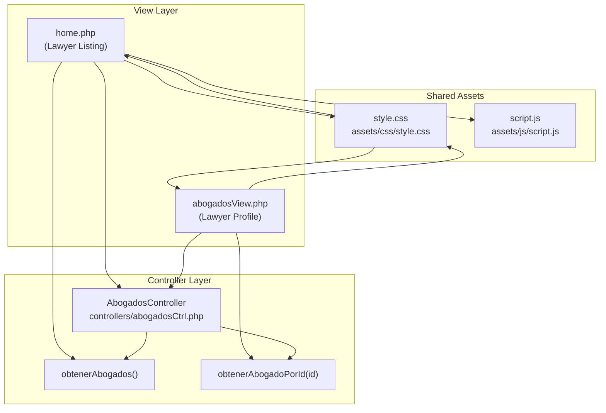
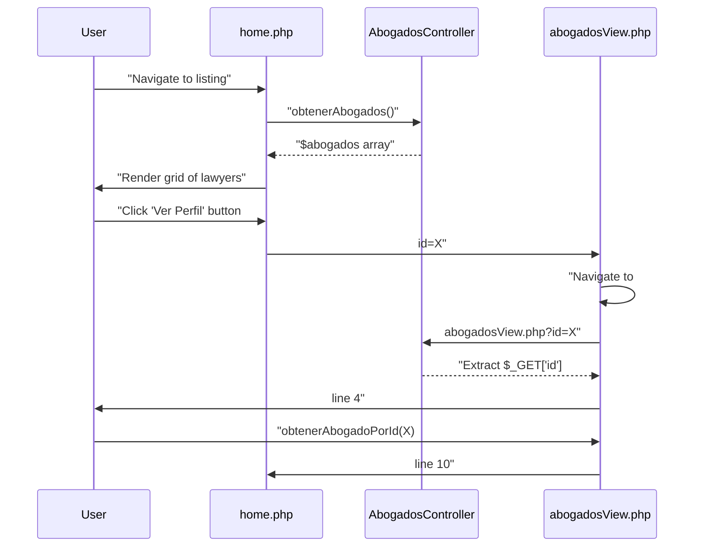
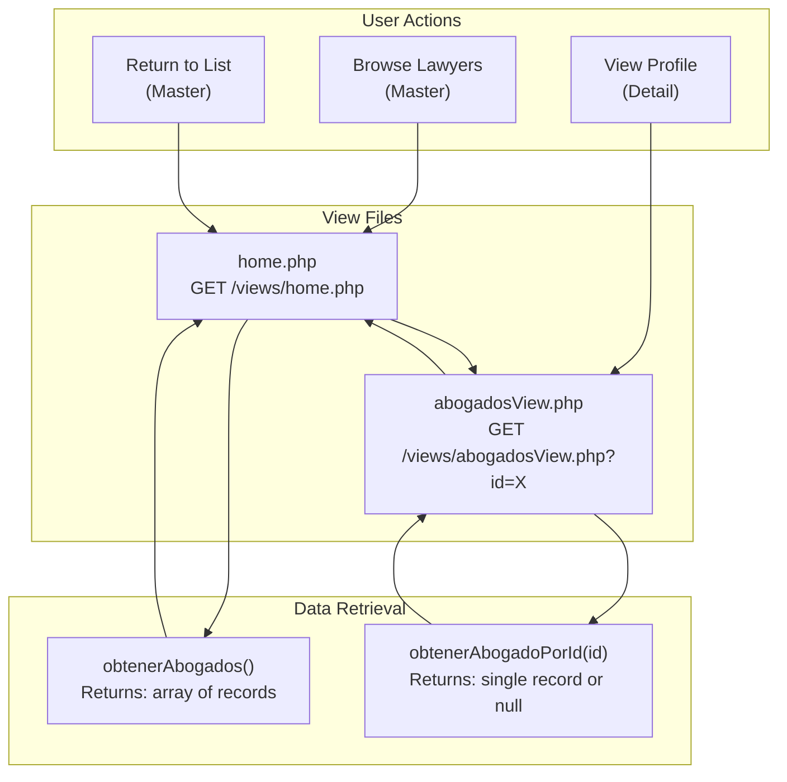

# Views Overview

> **Relevant source files**
> * [controllers/abogadosCtrl.php](https://github.com/GroveLive/abogado/blob/8bfc71d0/controllers/abogadosCtrl.php)
> * [views/abogadosView.php](https://github.com/GroveLive/abogado/blob/8bfc71d0/views/abogadosView.php)
> * [views/home.php](https://github.com/GroveLive/abogado/blob/8bfc71d0/views/home.php)

## Purpose and Scope

This document explains the presentation layer architecture of the Abogado system, focusing on the two primary view files that render HTML content to end users. It covers the shared dependencies between views, their distinct responsibilities, and how they implement a master-detail navigation pattern.

For detailed implementation of each view, see [Lawyer Listing View](/GroveLive/abogado/5.1.1-lawyer-listing-view-(home.php)) and [Lawyer Profile View](/GroveLive/abogado/5.1.2-lawyer-profile-view-(abogadosview.php)). For information about the styling applied to these views, see [Styling System](/GroveLive/abogado/5.2-styling-system-(css)). For details on the controller that both views utilize, see [Controllers Layer](/GroveLive/abogado/4.2-controllers-layer).

## View Architecture

The presentation layer consists of two PHP view files located in the `views/` directory:

| View File | Purpose | Controller Method | Primary Data Structure |
| --- | --- | --- | --- |
| `home.php` | Display grid of all lawyers | `obtenerAbogados()` | Array of lawyer records |
| `abogadosView.php` | Display individual lawyer profile | `obtenerAbogadoPorId($id)` | Single lawyer record or null |

Both views follow an identical architectural pattern: instantiate the controller, invoke a data retrieval method, and render HTML with the returned data.

### View Component Relationships



**Sources:** [views/home.php L1-L27](https://github.com/GroveLive/abogado/blob/8bfc71d0/views/home.php#L1-L27)

 [views/abogadosView.php L1-L40](https://github.com/GroveLive/abogado/blob/8bfc71d0/views/abogadosView.php#L1-L40)

 [controllers/abogadosCtrl.php L1-L14](https://github.com/GroveLive/abogado/blob/8bfc71d0/controllers/abogadosCtrl.php#L1-L14)

## Shared Dependencies

Both views share three critical dependencies, creating a consistent user experience across the application:

### Controller Dependency

Both views include the same controller file using `require_once`:

* [views/home.php L2](https://github.com/GroveLive/abogado/blob/8bfc71d0/views/home.php#L2-L2)  - `require_once "../controllers/abogadosCtrl.php";`
* [views/abogadosView.php L2](https://github.com/GroveLive/abogado/blob/8bfc71d0/views/abogadosView.php#L2-L2)  - `require_once "../controllers/abogadosCtrl.php";`

Both instantiate `AbogadosController` identically:

* [views/home.php L3](https://github.com/GroveLive/abogado/blob/8bfc71d0/views/home.php#L3-L3)  - `$controller = new AbogadosController();`
* [views/abogadosView.php L9](https://github.com/GroveLive/abogado/blob/8bfc71d0/views/abogadosView.php#L9-L9)  - `$controller = new AbogadosController();`

### Stylesheet Dependency

Both views reference the same CSS file with identical `<link>` tags:

* [views/home.php L13](https://github.com/GroveLive/abogado/blob/8bfc71d0/views/home.php#L13-L13)  - `<link rel="stylesheet" href="../assets/css/style.css">`
* [views/abogadosView.php L24](https://github.com/GroveLive/abogado/blob/8bfc71d0/views/abogadosView.php#L24-L24)  - `<link rel="stylesheet" href="../assets/css/style.css">`

The shared stylesheet provides consistent visual styling including the theme system, component styles (`menu-grid`, `menu-item`, `btn`, `abogado-container`, `volver`), and responsive layout rules.

### JavaScript Enhancement

While not explicitly included in the view files, both views utilize JavaScript through CSS class hooks:

* [views/home.php L22](https://github.com/GroveLive/abogado/blob/8bfc71d0/views/home.php#L22-L22)  - `<a>` tags with `class="btn"` that get enhanced by `script.js` via the `.abogado-link` selector
* The JavaScript provides loading animations and navigation enhancement (see [JavaScript Enhancements](/GroveLive/abogado/5.3-javascript-enhancements-(script.js)))

**Sources:** [views/home.php L2-L13](https://github.com/GroveLive/abogado/blob/8bfc71d0/views/home.php#L2-L13)

 [views/abogadosView.php L2-L24](https://github.com/GroveLive/abogado/blob/8bfc71d0/views/abogadosView.php#L2-L24)

## Master-Detail Pattern Implementation

The views implement a classic master-detail navigation pattern where users browse a master list and drill down into detail views.

### Navigation Flow



**Sources:** [views/home.php L18-L24](https://github.com/GroveLive/abogado/blob/8bfc71d0/views/home.php#L18-L24)

 [views/abogadosView.php L4-L14](https://github.com/GroveLive/abogado/blob/8bfc71d0/views/abogadosView.php#L4-L14)

### Master View (home.php)

The master view displays all lawyers in a grid layout:

* **Data Retrieval**: [views/home.php L4](https://github.com/GroveLive/abogado/blob/8bfc71d0/views/home.php#L4-L4)  - Invokes `obtenerAbogados()` to fetch all records
* **Iteration**: [views/home.php L18-L24](https://github.com/GroveLive/abogado/blob/8bfc71d0/views/home.php#L18-L24)  - Uses `foreach` to iterate over `$abogados` array
* **Selective Display**: Displays only `nombre` and `especialidad` fields from each record
* **Navigation Links**: [views/home.php L22](https://github.com/GroveLive/abogado/blob/8bfc71d0/views/home.php#L22-L22)  - Generates links to detail view: `abogadosView.php?id=<?= $abogado['id_abogado']; ?>`

### Detail View (abogadosView.php)

The detail view displays comprehensive information about a single lawyer:

* **Parameter Extraction**: [views/abogadosView.php L4-L7](https://github.com/GroveLive/abogado/blob/8bfc71d0/views/abogadosView.php#L4-L7)  - Validates `$_GET['id']` presence
* **Data Retrieval**: [views/abogadosView.php L10](https://github.com/GroveLive/abogado/blob/8bfc71d0/views/abogadosView.php#L10-L10)  - Invokes `obtenerAbogadoPorId($_GET['id'])`
* **Null Handling**: [views/abogadosView.php L12-L15](https://github.com/GroveLive/abogado/blob/8bfc71d0/views/abogadosView.php#L12-L15)  - Validates record exists
* **Complete Display**: [views/abogadosView.php L29-L34](https://github.com/GroveLive/abogado/blob/8bfc71d0/views/abogadosView.php#L29-L34)  - Displays all six fields: `nombre`, `especialidad`, `telefono`, `nacionalidad`, `estudios`, `correo`
* **Back Navigation**: [views/abogadosView.php L36](https://github.com/GroveLive/abogado/blob/8bfc71d0/views/abogadosView.php#L36-L36)  - Provides link back to master view: `<a href="home.php" class="volver">Volver</a>`

**Sources:** [views/home.php L1-L27](https://github.com/GroveLive/abogado/blob/8bfc71d0/views/home.php#L1-L27)

 [views/abogadosView.php L1-L40](https://github.com/GroveLive/abogado/blob/8bfc71d0/views/abogadosView.php#L1-L40)

## View Responsibilities

Each view has distinct responsibilities within the presentation layer:

| Responsibility | home.php | abogadosView.php |
| --- | --- | --- |
| **Controller Instantiation** | Line 3 | Line 9 |
| **Data Method Invocation** | `obtenerAbogados()` (line 4) | `obtenerAbogadoPorId($id)` (line 10) |
| **Input Validation** | Not required | `$_GET['id']` validation (lines 4-7) |
| **Error Handling** | None (assumes data exists) | Null check (lines 12-15) |
| **XSS Protection** | `htmlspecialchars()` on 2 fields | `htmlspecialchars()` on 6 fields |
| **Layout Pattern** | Grid of cards (`.menu-grid`) | Single container (`.abogado-container`) |
| **Navigation Provided** | Links to detail view | Link back to master view |
| **Field Display** | Partial (2 of 6 fields) | Complete (6 of 6 fields) |

**Sources:** [views/home.php L1-L27](https://github.com/GroveLive/abogado/blob/8bfc71d0/views/home.php#L1-L27)

 [views/abogadosView.php L1-L40](https://github.com/GroveLive/abogado/blob/8bfc71d0/views/abogadosView.php#L1-L40)

## View Execution Pattern

Both views follow an identical execution pattern consisting of three phases:

### Phase 1: PHP Logic Block

Located at the top of each file before the `<!DOCTYPE>` declaration:

**home.php Pattern:**

```
[Line 1-5]
- require_once controller
- Instantiate AbogadosController
- Invoke obtenerAbogados()
- Store result in $abogados
```

**abogadosView.php Pattern:**

```
[Line 1-16]
- require_once controller
- Validate $_GET['id'] exists
- Instantiate AbogadosController
- Invoke obtenerAbogadoPorId()
- Validate result is not null
- Store result in $abogado
```

### Phase 2: HTML Structure

Standard HTML5 document structure with metadata and asset references:

* [views/home.php L7-L14](https://github.com/GroveLive/abogado/blob/8bfc71d0/views/home.php#L7-L14)  - Document head with title and CSS link
* [views/abogadosView.php L18-L25](https://github.com/GroveLive/abogado/blob/8bfc71d0/views/abogadosView.php#L18-L25)  - Document head with dynamic title using lawyer name

### Phase 3: Data Rendering

Dynamic content generation using PHP short echo syntax (`<?= ?>`):

* [views/home.php L18-L24](https://github.com/GroveLive/abogado/blob/8bfc71d0/views/home.php#L18-L24)  - Loop iteration with `foreach` and two-field display
* [views/abogadosView.php L28-L35](https://github.com/GroveLive/abogado/blob/8bfc71d0/views/abogadosView.php#L28-L35)  - Direct field access with six-field display

All data output is wrapped in `htmlspecialchars()` to prevent XSS attacks.

**Sources:** [views/home.php L1-L27](https://github.com/GroveLive/abogado/blob/8bfc71d0/views/home.php#L1-L27)

 [views/abogadosView.php L1-L40](https://github.com/GroveLive/abogado/blob/8bfc71d0/views/abogadosView.php#L1-L40)

## View Communication Pattern



**Sources:** [views/home.php L4-L22](https://github.com/GroveLive/abogado/blob/8bfc71d0/views/home.php#L4-L22)

 [views/abogadosView.php L10-L36](https://github.com/GroveLive/abogado/blob/8bfc71d0/views/abogadosView.php#L10-L36)

 [controllers/abogadosCtrl.php L5-L11](https://github.com/GroveLive/abogado/blob/8bfc71d0/controllers/abogadosCtrl.php#L5-L11)

## Error Handling Strategy

The two views implement different error handling approaches based on their context:

### home.php Error Handling

**Strategy**: No explicit error handling
**Rationale**: The listing view assumes the database query will succeed and return an array (even if empty)
**Behavior**: An empty array results in an empty grid with no error message

[views/home.php L18-L24](https://github.com/GroveLive/abogado/blob/8bfc71d0/views/home.php#L18-L24)

 - The `foreach` loop gracefully handles empty arrays by rendering no iterations

### abogadosView.php Error Handling

**Strategy**: Explicit validation with early termination
**Rationale**: The detail view must validate user input and data existence

**Two validation points:**

1. [views/abogadosView.php L4-L7](https://github.com/GroveLive/abogado/blob/8bfc71d0/views/abogadosView.php#L4-L7)  - Validates `$_GET['id']` parameter exists
2. [views/abogadosView.php L12-L15](https://github.com/GroveLive/abogado/blob/8bfc71d0/views/abogadosView.php#L12-L15)  - Validates `$abogado` is not null

Both validation failures produce the same message: "Abogado no encontrado." and call `exit` to halt execution.

**Sources:** [views/home.php L18-L24](https://github.com/GroveLive/abogado/blob/8bfc71d0/views/home.php#L18-L24)

 [views/abogadosView.php L4-L15](https://github.com/GroveLive/abogado/blob/8bfc71d0/views/abogadosView.php#L4-L15)

## View File Organization

Both view files are located in the `views/` directory at the project root:

```markdown
views/
├── home.php              # Master view (27 lines)
└── abogadosView.php      # Detail view (40 lines)
```

**Relative Path References:**

* Both views use `../controllers/` to reference the controller (up one directory level)
* Both views use `../assets/css/` to reference the stylesheet (up one directory level)
* The detail view references master view using `home.php` (same directory, no path prefix)

**Sources:** [views/home.php L2-L13](https://github.com/GroveLive/abogado/blob/8bfc71d0/views/home.php#L2-L13)

 [views/abogadosView.php L2-L24](https://github.com/GroveLive/abogado/blob/8bfc71d0/views/abogadosView.php#L2-L24)