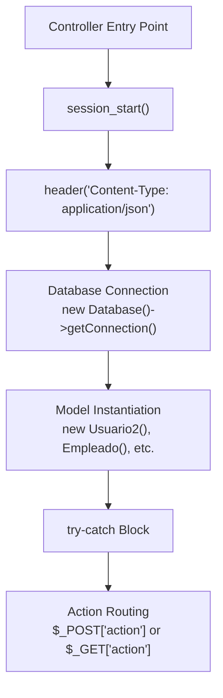
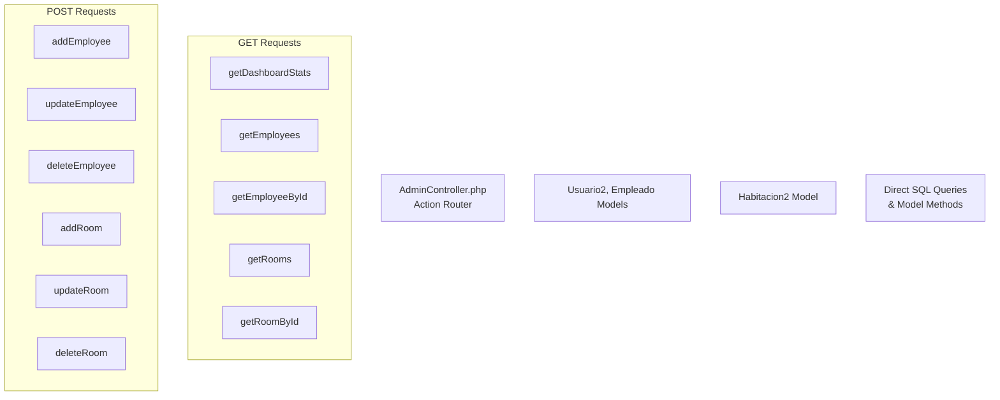
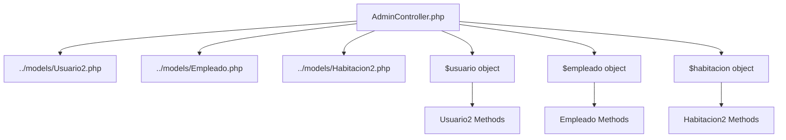
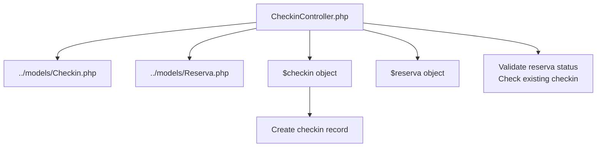
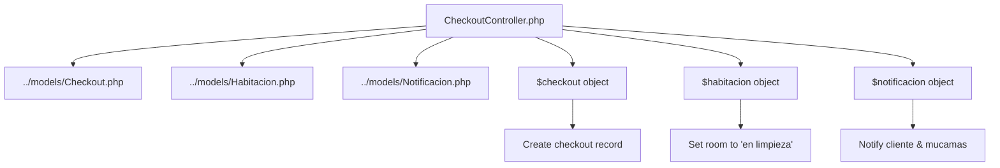
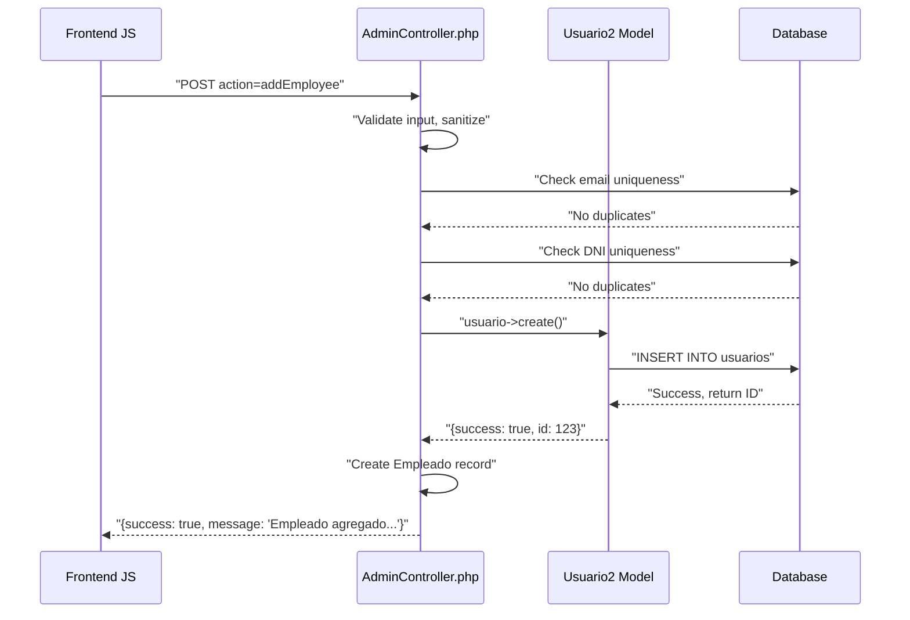
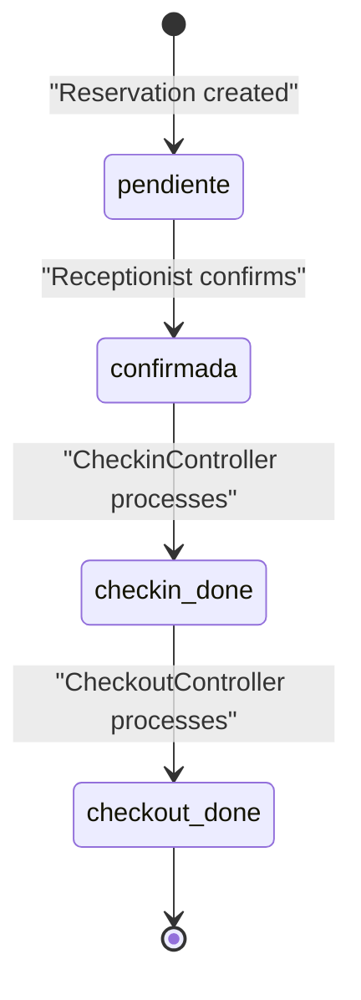
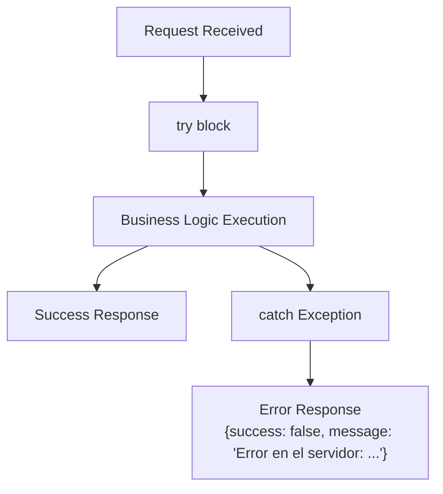
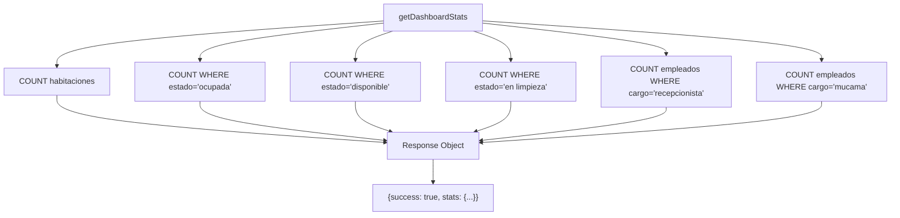
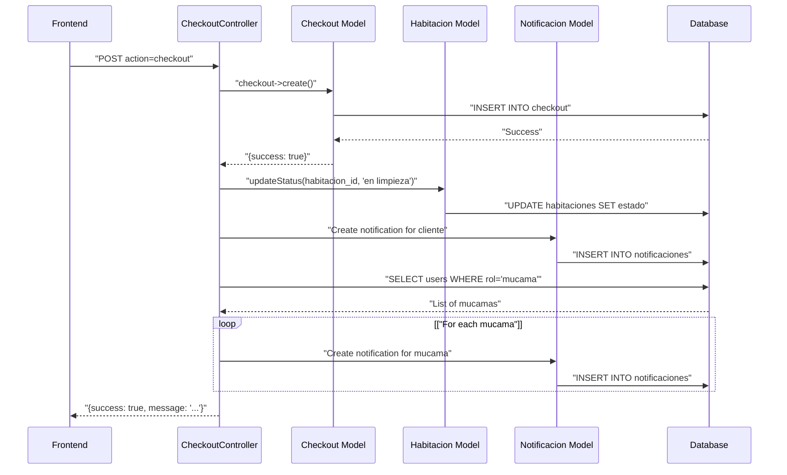

# Backend Controllers

> **Relevant source files**
> * [controllers/AdminController.php](https://github.com/GroveLive/hotelBenedetti/blob/ebdd0186/controllers/AdminController.php)
> * [controllers/AuthController.php](https://github.com/GroveLive/hotelBenedetti/blob/ebdd0186/controllers/AuthController.php)
> * [controllers/CheckinController.php](https://github.com/GroveLive/hotelBenedetti/blob/ebdd0186/controllers/CheckinController.php)
> * [controllers/CheckoutController.php](https://github.com/GroveLive/hotelBenedetti/blob/ebdd0186/controllers/CheckoutController.php)
> * [controllers/ClienteController.php](https://github.com/GroveLive/hotelBenedetti/blob/ebdd0186/controllers/ClienteController.php)

## Purpose and Scope

The Backend Controllers constitute the Application Layer in Hotel Benedetti's three-tier architecture. These PHP controllers process HTTP requests from frontend interfaces, enforce business logic, validate data, coordinate model operations, and return structured JSON responses. This document covers the five primary controllers (`AdminController.php`, `AuthController.php`, `CheckinController.php`, `CheckoutController.php`, `ClienteController.php`), their action-based routing mechanisms, request processing patterns, and interaction with Data Models.

For information about the Model classes used by these controllers, see [Data Models and Database Schema](/GroveLive/hotelBenedetti/2.3-data-models-and-database-schema). For details on how frontend JavaScript communicates with these controllers, see [Client-Server Communication](/GroveLive/hotelBenedetti/7-client-server-communication).

---

## Controller Architecture Overview

All controllers follow a consistent architectural pattern: they establish database connections, instantiate required Model classes, route requests based on action parameters, execute business logic, and return JSON responses.

### Controller Initialization Pattern



**Sources:** [controllers/AdminController.php L2-L15](https://github.com/GroveLive/hotelBenedetti/blob/ebdd0186/controllers/AdminController.php#L2-L15)

 [controllers/AuthController.php L2-L28](https://github.com/GroveLive/hotelBenedetti/blob/ebdd0186/controllers/AuthController.php#L2-L28)

 [controllers/CheckinController.php L2-L13](https://github.com/GroveLive/hotelBenedetti/blob/ebdd0186/controllers/CheckinController.php#L2-L13)

 [controllers/CheckoutController.php L2-L15](https://github.com/GroveLive/hotelBenedetti/blob/ebdd0186/controllers/CheckoutController.php#L2-L15)

### Three-Phase Request Processing

Each controller follows a three-phase request lifecycle:

| Phase | Description | Key Activities |
| --- | --- | --- |
| **Initialization** | Establish session and database connections | `session_start()`, Database instantiation, Model instantiation |
| **Action Routing** | Determine which operation to execute | Check `$_REQUEST_METHOD`, extract `action` parameter, validate request type |
| **Execution & Response** | Process request and return JSON | Execute business logic, interact with models, format JSON response |

**Sources:** [controllers/AdminController.php L10-L328](https://github.com/GroveLive/hotelBenedetti/blob/ebdd0186/controllers/AdminController.php#L10-L328)

 [controllers/CheckinController.php L9-L72](https://github.com/GroveLive/hotelBenedetti/blob/ebdd0186/controllers/CheckinController.php#L9-L72)

---

## Action-Based Routing System

All controllers except `ClienteController.php` use an action-based routing system where the `action` parameter determines which operation to execute.

### AdminController Action Routing



**Sources:** [controllers/AdminController.php L17-L328](https://github.com/GroveLive/hotelBenedetti/blob/ebdd0186/controllers/AdminController.php#L17-L328)

### Complete Action Map

| Controller | HTTP Method | Action | Purpose | Lines |
| --- | --- | --- | --- | --- |
| `AdminController` | POST | `addEmployee` | Create new employee (recepcionista/mucama) | [20-103](https://github.com/GroveLive/hotelBenedetti/blob/ebdd0186/20-103) |
| `AdminController` | POST | `updateEmployee` | Update employee data and role | [104-186](https://github.com/GroveLive/hotelBenedetti/blob/ebdd0186/104-186) |
| `AdminController` | POST | `deleteEmployee` | Remove employee from system | [187-190](https://github.com/GroveLive/hotelBenedetti/blob/ebdd0186/187-190) |
| `AdminController` | POST | `addRoom` | Create new room | [191-216](https://github.com/GroveLive/hotelBenedetti/blob/ebdd0186/191-216) |
| `AdminController` | POST | `updateRoom` | Update room details | [217-245](https://github.com/GroveLive/hotelBenedetti/blob/ebdd0186/217-245) |
| `AdminController` | POST | `deleteRoom` | Remove room | [246-249](https://github.com/GroveLive/hotelBenedetti/blob/ebdd0186/246-249) |
| `AdminController` | GET | `getDashboardStats` | Retrieve statistics for dashboard | [259-302](https://github.com/GroveLive/hotelBenedetti/blob/ebdd0186/259-302) |
| `AdminController` | GET | `getEmployees` | Retrieve all employees | [303-305](https://github.com/GroveLive/hotelBenedetti/blob/ebdd0186/303-305) |
| `AdminController` | GET | `getEmployeeById` | Retrieve single employee | [306-309](https://github.com/GroveLive/hotelBenedetti/blob/ebdd0186/306-309) |
| `AdminController` | GET | `getRooms` | Retrieve all rooms | [310-312](https://github.com/GroveLive/hotelBenedetti/blob/ebdd0186/310-312) |
| `AdminController` | GET | `getRoomById` | Retrieve single room | [313-316](https://github.com/GroveLive/hotelBenedetti/blob/ebdd0186/313-316) |
| `AuthController` | POST | `login` | Authenticate user | [41-42](https://github.com/GroveLive/hotelBenedetti/blob/ebdd0186/41-42) |
| `AuthController` | POST | `register` | Register new cliente | [43-45](https://github.com/GroveLive/hotelBenedetti/blob/ebdd0186/43-45) |
| `CheckinController` | POST | `checkin` | Process guest check-in | [18-54](https://github.com/GroveLive/hotelBenedetti/blob/ebdd0186/18-54) |
| `CheckoutController` | POST | `checkout` | Process guest check-out | [20-93](https://github.com/GroveLive/hotelBenedetti/blob/ebdd0186/20-93) |

**Sources:** [controllers/AdminController.php L17-L328](https://github.com/GroveLive/hotelBenedetti/blob/ebdd0186/controllers/AdminController.php#L17-L328)

 [controllers/AuthController.php L30-L57](https://github.com/GroveLive/hotelBenedetti/blob/ebdd0186/controllers/AuthController.php#L30-L57)

 [controllers/CheckinController.php L15-L66](https://github.com/GroveLive/hotelBenedetti/blob/ebdd0186/controllers/CheckinController.php#L15-L66)

 [controllers/CheckoutController.php L17-L105](https://github.com/GroveLive/hotelBenedetti/blob/ebdd0186/controllers/CheckoutController.php#L17-L105)

---

## Controller-Model Interaction Patterns

Controllers interact with Model classes to perform database operations. Each controller instantiates the models it requires and delegates data persistence to them.

### AdminController Model Dependencies



**Sources:** [controllers/AdminController.php L4-L15](https://github.com/GroveLive/hotelBenedetti/blob/ebdd0186/controllers/AdminController.php#L4-L15)

### CheckinController Model Dependencies



**Sources:** [controllers/CheckinController.php L4-L13](https://github.com/GroveLive/hotelBenedetti/blob/ebdd0186/controllers/CheckinController.php#L4-L13)

### CheckoutController Model Dependencies



**Sources:** [controllers/CheckoutController.php L4-L15](https://github.com/GroveLive/hotelBenedetti/blob/ebdd0186/controllers/CheckoutController.php#L4-L15)

---

## Individual Controller Responsibilities

### AdminController.php

**Primary Responsibilities:** Employee management (CRUD), room management (CRUD), dashboard statistics

**Key Operations:**

* **Employee Management:** Creates/updates/deletes employees with roles `recepcionista` or `mucama`. Each employee creation involves two steps: creating a `Usuario2` record and an `Empleado` record. If the `Empleado` creation fails, the `Usuario2` record is rolled back.
* **Room Management:** Full CRUD operations on `habitaciones` table. New rooms default to `estado = 'disponible'`.
* **Dashboard Statistics:** Aggregates counts for rooms by status (`disponible`, `ocupada`, `en limpieza`) and employees by role (`recepcionista`, `mucama`).

**Data Validation:**

* Email uniqueness checks [controllers/AdminController.php L38-L48](https://github.com/GroveLive/hotelBenedetti/blob/ebdd0186/controllers/AdminController.php#L38-L48)  [124-135](https://github.com/GroveLive/hotelBenedetti/blob/ebdd0186/124-135)
* DNI uniqueness checks [controllers/AdminController.php L51-L61](https://github.com/GroveLive/hotelBenedetti/blob/ebdd0186/controllers/AdminController.php#L51-L61)  [138-149](https://github.com/GroveLive/hotelBenedetti/blob/ebdd0186/138-149)
* Room number uniqueness checks [controllers/AdminController.php L197-L207](https://github.com/GroveLive/hotelBenedetti/blob/ebdd0186/controllers/AdminController.php#L197-L207)  [224-235](https://github.com/GroveLive/hotelBenedetti/blob/ebdd0186/224-235)
* Role restriction to `recepcionista` and `mucama` [controllers/AdminController.php L29-L35](https://github.com/GroveLive/hotelBenedetti/blob/ebdd0186/controllers/AdminController.php#L29-L35)  [115-121](https://github.com/GroveLive/hotelBenedetti/blob/ebdd0186/115-121)

**Sources:** [controllers/AdminController.php L1-L334](https://github.com/GroveLive/hotelBenedetti/blob/ebdd0186/controllers/AdminController.php#L1-L334)

### AuthController.php

**Primary Responsibilities:** User authentication, client registration

**Key Operations:**

* **Login:** Delegates to `UsuarioController->login($email, $password, $rol)` which validates credentials and establishes session.
* **Register:** Creates new `cliente` users by delegating to `UsuarioController->registrar()`. Hardcodes `rol = "cliente"` [controllers/AuthController.php L44](https://github.com/GroveLive/hotelBenedetti/blob/ebdd0186/controllers/AuthController.php#L44-L44)

**Special Features:**

* Output buffering control to prevent premature output [controllers/AuthController.php L7-L21](https://github.com/GroveLive/hotelBenedetti/blob/ebdd0186/controllers/AuthController.php#L7-L21)
* Error logging to file [controllers/AuthController.php L11-L14](https://github.com/GroveLive/hotelBenedetti/blob/ebdd0186/controllers/AuthController.php#L11-L14)
* Suppresses display errors in production [controllers/AuthController.php L11-L12](https://github.com/GroveLive/hotelBenedetti/blob/ebdd0186/controllers/AuthController.php#L11-L12)

**Sources:** [controllers/AuthController.php L1-L80](https://github.com/GroveLive/hotelBenedetti/blob/ebdd0186/controllers/AuthController.php#L1-L80)

### CheckinController.php

**Primary Responsibilities:** Process guest check-ins

**Validation Logic:**

1. Verify reservation exists with `estado = 'confirmada'` [controllers/CheckinController.php L22-L34](https://github.com/GroveLive/hotelBenedetti/blob/ebdd0186/controllers/CheckinController.php#L22-L34)
2. Verify no prior check-in exists for the reservation [controllers/CheckinController.php L37-L47](https://github.com/GroveLive/hotelBenedetti/blob/ebdd0186/controllers/CheckinController.php#L37-L47)

**Check-in Process:**

* Creates `Checkin` record with `fecha_checkin = current timestamp`
* Sets `observaciones = null` by default [controllers/CheckinController.php L51](https://github.com/GroveLive/hotelBenedetti/blob/ebdd0186/controllers/CheckinController.php#L51-L51)

**Sources:** [controllers/CheckinController.php L1-L72](https://github.com/GroveLive/hotelBenedetti/blob/ebdd0186/controllers/CheckinController.php#L1-L72)

### CheckoutController.php

**Primary Responsibilities:** Process guest check-outs, update room status, create notifications

**Validation Logic:**

1. Verify reservation exists with `estado = 'confirmada'` [controllers/CheckoutController.php L25-L37](https://github.com/GroveLive/hotelBenedetti/blob/ebdd0186/controllers/CheckoutController.php#L25-L37)
2. Verify check-in was completed [controllers/CheckoutController.php L40-L50](https://github.com/GroveLive/hotelBenedetti/blob/ebdd0186/controllers/CheckoutController.php#L40-L50)
3. Verify no prior check-out exists [controllers/CheckoutController.php L53-L63](https://github.com/GroveLive/hotelBenedetti/blob/ebdd0186/controllers/CheckoutController.php#L53-L63)

**Check-out Process:**

1. Create `Checkout` record with `total_pagado` and `fecha_checkout = current timestamp`
2. Update room status to `"en limpieza"` using `Habitacion->updateStatus()` [controllers/CheckoutController.php L72](https://github.com/GroveLive/hotelBenedetti/blob/ebdd0186/controllers/CheckoutController.php#L72-L72)
3. Create notification for cliente about completed check-out [controllers/CheckoutController.php L75-L78](https://github.com/GroveLive/hotelBenedetti/blob/ebdd0186/controllers/CheckoutController.php#L75-L78)
4. Query all users with `rol = 'mucama'` [controllers/CheckoutController.php L81-L84](https://github.com/GroveLive/hotelBenedetti/blob/ebdd0186/controllers/CheckoutController.php#L81-L84)
5. Create notification for each mucama about room needing cleaning [controllers/CheckoutController.php L86-L91](https://github.com/GroveLive/hotelBenedetti/blob/ebdd0186/controllers/CheckoutController.php#L86-L91)

**Sources:** [controllers/CheckoutController.php L1-L111](https://github.com/GroveLive/hotelBenedetti/blob/ebdd0186/controllers/CheckoutController.php#L1-L111)

### ClienteController.php

**Primary Responsibilities:** Legacy client management interface

**Note:** This controller uses a different architectural pattern (traditional MVC with view rendering) compared to other controllers which return JSON. It appears to be an earlier implementation not fully integrated with the current AJAX-driven frontend architecture.

**Sources:** [controllers/ClienteController.php L1-L44](https://github.com/GroveLive/hotelBenedetti/blob/ebdd0186/controllers/ClienteController.php#L1-L44)

---

## Standard JSON Response Format

All controllers return responses following a consistent JSON structure with `success` boolean and `message` string fields. Successful operations may include additional data fields.

### Response Structure Table

| Response Type | Structure | Example Usage |
| --- | --- | --- |
| **Success (no data)** | `{"success": true, "message": "..."}` | Employee created, room deleted |
| **Success (with data)** | `{"success": true, "data": {...}}` | Get rooms, get employees |
| **Success (with stats)** | `{"success": true, "stats": {...}}` | Dashboard statistics |
| **Error** | `{"success": false, "message": "..."}` | Validation failure, duplicate entries |
| **Server Error** | `{"success": false, "message": "Error en el servidor: ..."}` | Exception caught |

### Example Response Flows



**Sources:** [controllers/AdminController.php L30-L103](https://github.com/GroveLive/hotelBenedetti/blob/ebdd0186/controllers/AdminController.php#L30-L103)

---

## Data Validation and Security Patterns

### Input Sanitization

All controllers sanitize user input using two functions:

* `htmlspecialchars()` - Converts special characters to HTML entities
* `strip_tags()` - Removes HTML/PHP tags

**Pattern:**

```
$variable = isset($_POST['field']) ? htmlspecialchars(strip_tags($_POST['field'])) : '';
```

**Examples:** [controllers/AdminController.php L21-L27](https://github.com/GroveLive/hotelBenedetti/blob/ebdd0186/controllers/AdminController.php#L21-L27)

 [106-112](https://github.com/GroveLive/hotelBenedetti/blob/ebdd0186/106-112)

### Uniqueness Validation

Before creating or updating records, controllers verify uniqueness constraints:

**Email Uniqueness Check Pattern:**

```sql
$query = "SELECT id FROM usuarios WHERE email = :email";
// For updates: WHERE email = :email AND id != :id
```

**Implemented In:**

* Employee creation: [controllers/AdminController.php L38-L48](https://github.com/GroveLive/hotelBenedetti/blob/ebdd0186/controllers/AdminController.php#L38-L48)
* Employee update: [controllers/AdminController.php L124-L135](https://github.com/GroveLive/hotelBenedetti/blob/ebdd0186/controllers/AdminController.php#L124-L135)

**DNI Uniqueness Check Pattern:**

```sql
$query = "SELECT id FROM usuarios WHERE dni = :dni";
// For updates: WHERE dni = :dni AND id != :id
```

**Implemented In:**

* Employee creation: [controllers/AdminController.php L51-L61](https://github.com/GroveLive/hotelBenedetti/blob/ebdd0186/controllers/AdminController.php#L51-L61)
* Employee update: [controllers/AdminController.php L138-L149](https://github.com/GroveLive/hotelBenedetti/blob/ebdd0186/controllers/AdminController.php#L138-L149)

**Room Number Uniqueness Check Pattern:**

```sql
$query = "SELECT id FROM habitaciones WHERE numero_habitacion = :roomNumber";
// For updates: WHERE numero_habitacion = :roomNumber AND id != :id
```

**Implemented In:**

* Room creation: [controllers/AdminController.php L197-L207](https://github.com/GroveLive/hotelBenedetti/blob/ebdd0186/controllers/AdminController.php#L197-L207)
* Room update: [controllers/AdminController.php L224-L235](https://github.com/GroveLive/hotelBenedetti/blob/ebdd0186/controllers/AdminController.php#L224-L235)

### Role Validation

`AdminController` restricts employee roles to `recepcionista` or `mucama` only:

```javascript
if (!in_array($role, ['recepcionista', 'mucama'])) {
    echo json_encode(["success" => false, "message" => "Rol no válido..."]);
    exit();
}
```

**Implemented In:** [controllers/AdminController.php L29-L35](https://github.com/GroveLive/hotelBenedetti/blob/ebdd0186/controllers/AdminController.php#L29-L35)

 [115-121](https://github.com/GroveLive/hotelBenedetti/blob/ebdd0186/115-121)

### Password Hashing

Passwords are hashed using `password_hash()` with `PASSWORD_BCRYPT`:

```
$password = password_hash($_POST['password'], PASSWORD_BCRYPT);
```

**Implemented In:** [controllers/AdminController.php L26](https://github.com/GroveLive/hotelBenedetti/blob/ebdd0186/controllers/AdminController.php#L26-L26)

 [111](https://github.com/GroveLive/hotelBenedetti/blob/ebdd0186/111)

**Sources:** [controllers/AdminController.php L21-L27](https://github.com/GroveLive/hotelBenedetti/blob/ebdd0186/controllers/AdminController.php#L21-L27)

 [29-35](https://github.com/GroveLive/hotelBenedetti/blob/ebdd0186/29-35)

 [38-61](https://github.com/GroveLive/hotelBenedetti/blob/ebdd0186/38-61)

 [106-149](https://github.com/GroveLive/hotelBenedetti/blob/ebdd0186/106-149)

 [197-235](https://github.com/GroveLive/hotelBenedetti/blob/ebdd0186/197-235)

---

## Business Logic Enforcement

### Check-in/Check-out State Machine

Controllers enforce a strict state machine for reservation lifecycle:



**Validation Sources:**

* Check-in validations: [controllers/CheckinController.php L22-L47](https://github.com/GroveLive/hotelBenedetti/blob/ebdd0186/controllers/CheckinController.php#L22-L47)
* Check-out validations: [controllers/CheckoutController.php L25-L63](https://github.com/GroveLive/hotelBenedetti/blob/ebdd0186/controllers/CheckoutController.php#L25-L63)

### Transactional Employee Creation

Employee creation requires two successful database operations:

1. Create `Usuario2` record
2. Create `Empleado` record

If step 2 fails, step 1 is rolled back by deleting the created user:

```sql
if ($empleado_result['success']) {
    // Success response
} else {
    // Rollback: DELETE FROM usuarios WHERE id = :id
    $query = "DELETE FROM usuarios WHERE id = :id";
    $stmt = $conn->prepare($query);
    $stmt->bindParam(":id", $usuario_id);
    $stmt->execute();
    // Error response
}
```

**Source:** [controllers/AdminController.php L81-L97](https://github.com/GroveLive/hotelBenedetti/blob/ebdd0186/controllers/AdminController.php#L81-L97)

---

## Error Handling Strategy

All controllers wrap their main logic in try-catch blocks and return standardized error responses:



**Error Response Format:**

```json
{
    "success": false,
    "message": "Error en el servidor: [exception message]"
}
```

**Implemented In:**

* [controllers/AdminController.php L329-L334](https://github.com/GroveLive/hotelBenedetti/blob/ebdd0186/controllers/AdminController.php#L329-L334)
* [controllers/AuthController.php L67-L78](https://github.com/GroveLive/hotelBenedetti/blob/ebdd0186/controllers/AuthController.php#L67-L78)
* [controllers/CheckinController.php L67-L72](https://github.com/GroveLive/hotelBenedetti/blob/ebdd0186/controllers/CheckinController.php#L67-L72)
* [controllers/CheckoutController.php L106-L111](https://github.com/GroveLive/hotelBenedetti/blob/ebdd0186/controllers/CheckoutController.php#L106-L111)

**Sources:** All controller files

---

## Dashboard Statistics Aggregation

`AdminController` provides the `getDashboardStats` action which aggregates multiple database counts for the admin dashboard:

### Statistics Query Pattern



### Statistics Response Structure

```json
{
    "success": true,
    "stats": {
        "total_habitaciones": 50,
        "habitaciones_ocupadas": 30,
        "habitaciones_disponibles": 15,
        "habitaciones_en_limpieza": 5,
        "total_recepcionistas": 3,
        "total_mucamas": 5
    }
}
```

**Implementation:** [controllers/AdminController.php L259-L302](https://github.com/GroveLive/hotelBenedetti/blob/ebdd0186/controllers/AdminController.php#L259-L302)

**Sources:** [controllers/AdminController.php L259-L302](https://github.com/GroveLive/hotelBenedetti/blob/ebdd0186/controllers/AdminController.php#L259-L302)

---

## Notification Generation

`CheckoutController` is responsible for creating notifications for multiple user roles after successful check-out.

### Notification Flow



**Notification Messages:**

* **To cliente:** `"Se ha realizado el check-out de su reserva (ID: {id}). Total pagado: ${amount}."`
* **To mucamas:** `"La habitación {id} necesita limpieza después del check-out de la reserva (ID: {id})."`

**Implementation:** [controllers/CheckoutController.php L70-L93](https://github.com/GroveLive/hotelBenedetti/blob/ebdd0186/controllers/CheckoutController.php#L70-L93)

**Sources:** [controllers/CheckoutController.php L70-L93](https://github.com/GroveLive/hotelBenedetti/blob/ebdd0186/controllers/CheckoutController.php#L70-L93)

---

## Request Method Handling

Controllers distinguish between HTTP methods and respond differently:

| Method | Purpose | Example Actions |
| --- | --- | --- |
| `POST` | Mutating operations (create, update, delete) | `addEmployee`, `updateRoom`, `checkin`, `checkout` |
| `GET` | Read-only operations | `getDashboardStats`, `getEmployees`, `getRooms` |

**Method Validation Pattern:**

```javascript
if ($_SERVER["REQUEST_METHOD"] === "POST") {
    // Handle POST actions
} elseif ($_SERVER["REQUEST_METHOD"] === "GET") {
    // Handle GET actions
} else {
    echo json_encode(["success" => false, "message" => "Método no permitido."]);
}
```

**Implemented In:**

* [controllers/AdminController.php L17-L328](https://github.com/GroveLive/hotelBenedetti/blob/ebdd0186/controllers/AdminController.php#L17-L328)
* [controllers/CheckinController.php L15-L66](https://github.com/GroveLive/hotelBenedetti/blob/ebdd0186/controllers/CheckinController.php#L15-L66)
* [controllers/CheckoutController.php L17-L105](https://github.com/GroveLive/hotelBenedetti/blob/ebdd0186/controllers/CheckoutController.php#L17-L105)

**Sources:** [controllers/AdminController.php L17-L328](https://github.com/GroveLive/hotelBenedetti/blob/ebdd0186/controllers/AdminController.php#L17-L328)

 [controllers/CheckinController.php L15-L66](https://github.com/GroveLive/hotelBenedetti/blob/ebdd0186/controllers/CheckinController.php#L15-L66)

 [controllers/CheckoutController.php L17-L105](https://github.com/GroveLive/hotelBenedetti/blob/ebdd0186/controllers/CheckoutController.php#L17-L105)