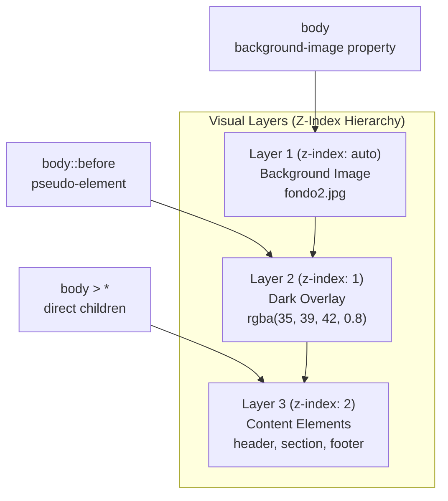
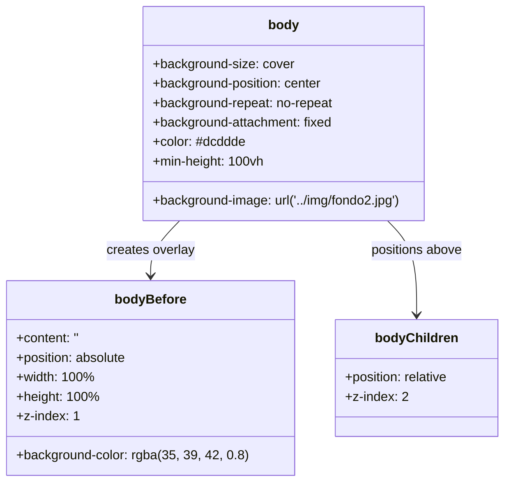
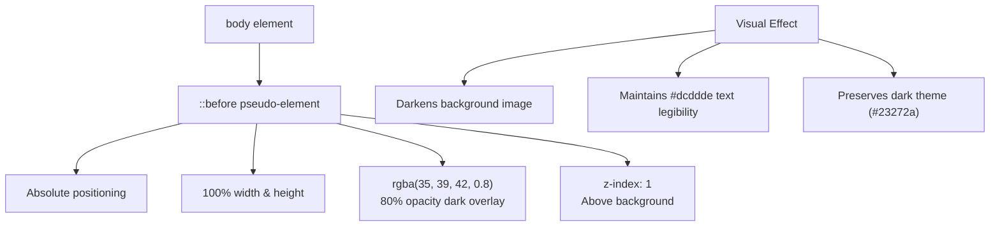
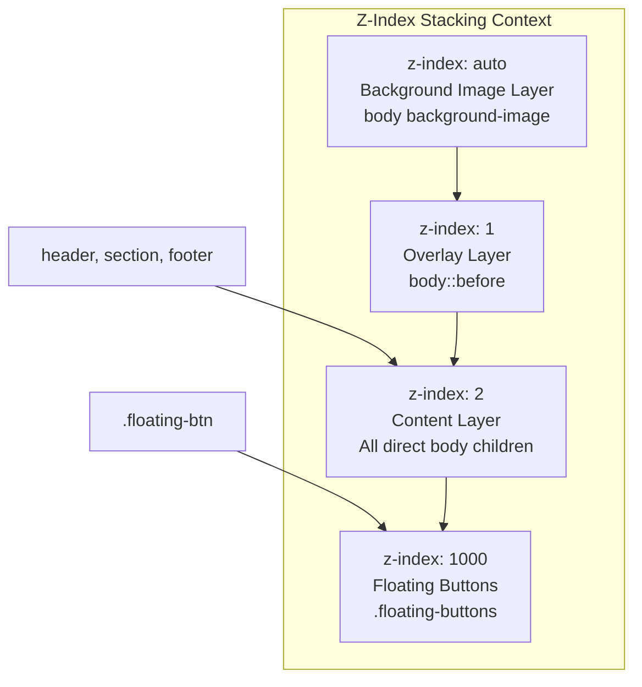
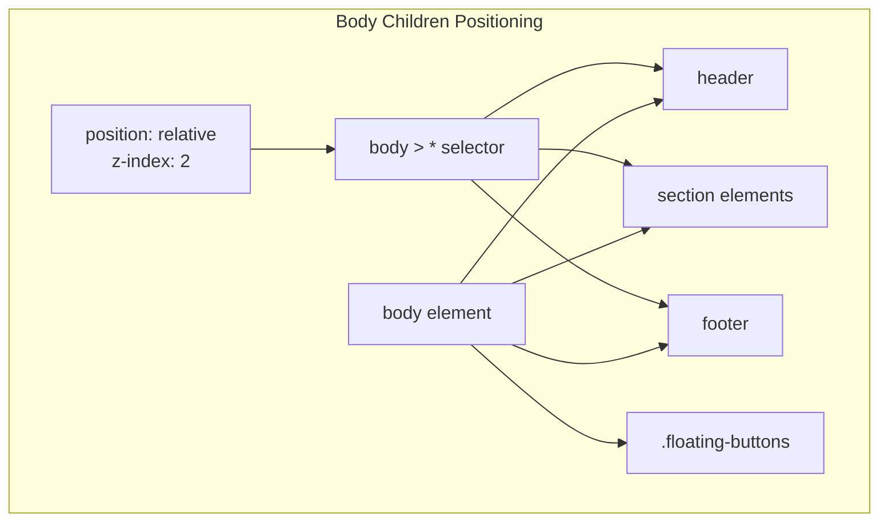

# Background Images

> **Relevant source files**
> * [assets/css/StyleCliente.css](https://github.com/GroveLive/hotelBenedetti/blob/ebdd0186/assets/css/StyleCliente.css)
> * [assets/img/fondo.jpg](https://github.com/GroveLive/hotelBenedetti/blob/ebdd0186/assets/img/fondo.jpg)
> * [assets/img/fondo2.jpg](https://github.com/GroveLive/hotelBenedetti/blob/ebdd0186/assets/img/fondo2.jpg)
> * [assets/img/fondohotelcliente2.webp](https://github.com/GroveLive/hotelBenedetti/blob/ebdd0186/assets/img/fondohotelcliente2.webp)
> * [assets/img/hotelfondocliente.jpg](https://github.com/GroveLive/hotelBenedetti/blob/ebdd0186/assets/img/hotelfondocliente.jpg)
> * [assets/img/loginfondo.jpg](https://github.com/GroveLive/hotelBenedetti/blob/ebdd0186/assets/img/loginfondo.jpg)

## Purpose and Scope

This page documents the background image assets used throughout the Hotel Benedetti system to create visual depth and atmosphere in the user interfaces. It covers the image files themselves, the CSS layering technique used to ensure content readability, and the z-index hierarchy that manages visual stacking.

For information about other image assets like room type images and branding, see [Room Type Images](/GroveLive/hotelBenedetti/9.2-room-type-images) and [Branding and Icons](/GroveLive/hotelBenedetti/9.3-branding-and-icons). For CSS styling patterns in general, see [CSS Styling System](/GroveLive/hotelBenedetti/5.1-css-styling-system).

---

## Background Image Assets

The system uses three primary background image files stored in the `assets/img/` directory:

| File Name | Format | Primary Usage |
| --- | --- | --- |
| `fondo.jpg` | JPEG | Alternative background option |
| `fondo2.jpg` | JPEG | Active background for client interface |
| `fondohotelcliente2.webp` | WebP | Modern format alternative |

The currently active background image is `fondo2.jpg`, which is referenced in the client interface stylesheet. These images typically depict hotel-related scenes or atmospheric photography that reinforces the hospitality brand identity.

**Sources:** [assets/img/fondo.jpg](https://github.com/GroveLive/hotelBenedetti/blob/ebdd0186/assets/img/fondo.jpg)

 [assets/img/fondo2.jpg](https://github.com/GroveLive/hotelBenedetti/blob/ebdd0186/assets/img/fondo2.jpg)

 [assets/img/fondohotelcliente2.webp](https://github.com/GroveLive/hotelBenedetti/blob/ebdd0186/assets/img/fondohotelcliente2.webp)

---

## Layered Background Implementation

The system employs a sophisticated three-layer approach to background image display that ensures content remains readable while maintaining visual appeal:

**Diagram: Background Layering Architecture**

This three-tier structure creates visual depth while preventing the background image from interfering with text legibility. The overlay opacity (0.8) darkens the image by 80%, allowing subtle texture to show through while maintaining the dark theme aesthetic.

**Sources:** [assets/css/StyleCliente.css L8-L37](https://github.com/GroveLive/hotelBenedetti/blob/ebdd0186/assets/css/StyleCliente.css#L8-L37)

---

## CSS Implementation Details

### Base Background Configuration

The background image is applied to the `body` element with properties that ensure full coverage and fixed positioning:

**Diagram: CSS Entity Relationships for Background System**

Key properties explained:

* **`background-size: cover`** - Scales the image to cover the entire viewport while maintaining aspect ratio
* **`background-position: center`** - Centers the focal point of the image
* **`background-attachment: fixed`** - Creates a parallax effect as content scrolls over the fixed background
* **`min-height: 100vh`** - Ensures the body spans at least the full viewport height

**Sources:** [assets/css/StyleCliente.css L8-L19](https://github.com/GroveLive/hotelBenedetti/blob/ebdd0186/assets/css/StyleCliente.css#L8-L19)

---

## Overlay Technique

The semi-transparent overlay is implemented using the `::before` pseudo-element:

**Diagram: Overlay Implementation Flow**

The overlay uses `rgba(35, 39, 42, 0.8)`, where:

* **RGB values (35, 39, 42)** match the primary dark background color `#23272a` from the color palette
* **Alpha value (0.8)** provides 80% opacity, creating subtle texture visibility
* **Absolute positioning** allows it to cover the entire viewport without affecting layout

**Sources:** [assets/css/StyleCliente.css L21-L31](https://github.com/GroveLive/hotelBenedetti/blob/ebdd0186/assets/css/StyleCliente.css#L21-L31)

---

## Z-Index Hierarchy Management

The system uses explicit z-index values to manage the visual stacking order:

**Diagram: Complete Z-Index Hierarchy**

The z-index hierarchy ensures:

1. Background image appears at the bottom (implicit z-index: auto)
2. Dark overlay sits above background (z-index: 1)
3. All page content (header, sections, footer) renders above overlay (z-index: 2)
4. Floating social media buttons appear above all content (z-index: 1000)

This explicit positioning is required because the overlay uses `position: absolute`, which would otherwise cover content elements.

**Sources:** [assets/css/StyleCliente.css L22-L348](https://github.com/GroveLive/hotelBenedetti/blob/ebdd0186/assets/css/StyleCliente.css#L22-L348)

---

## Content Positioning Strategy

All direct children of the `body` element receive explicit positioning to ensure they appear above the overlay:

**Diagram: Content Element Positioning**

The universal child selector `body > *` applies `position: relative` and `z-index: 2` to all direct children, ensuring they participate in the stacking context and render above the overlay without requiring individual positioning declarations.

**Sources:** [assets/css/StyleCliente.css L33-L37](https://github.com/GroveLive/hotelBenedetti/blob/ebdd0186/assets/css/StyleCliente.css#L33-L37)

---

## Background Properties Reference

The following table summarizes all background-related CSS properties applied to the client interface:

| Property | Value | Purpose |
| --- | --- | --- |
| `background-image` | `url('../img/fondo2.jpg')` | References the background image file |
| `background-size` | `cover` | Scales image to cover viewport |
| `background-position` | `center` | Centers the image focal point |
| `background-repeat` | `no-repeat` | Prevents tiling of the image |
| `background-attachment` | `fixed` | Creates parallax scrolling effect |
| `color` | `#dcddde` | Sets default text color for readability |
| `min-height` | `100vh` | Ensures full viewport coverage |

**Sources:** [assets/css/StyleCliente.css L8-L19](https://github.com/GroveLive/hotelBenedetti/blob/ebdd0186/assets/css/StyleCliente.css#L8-L19)

---

## Responsive Behavior

The background image system maintains its visual effect across all device sizes. Unlike many responsive elements in the system, the background configuration does not change at different breakpoints (768px and 480px). The `background-size: cover` and `background-position: center` properties ensure the image adapts naturally to different viewport dimensions without requiring media query overrides.

The fixed attachment (`background-attachment: fixed`) may behave differently on mobile devices due to browser limitations, but the core layering and overlay approach remains consistent across all screen sizes.

**Sources:** [assets/css/StyleCliente.css L8-L486](https://github.com/GroveLive/hotelBenedetti/blob/ebdd0186/assets/css/StyleCliente.css#L8-L486)

---

## Usage Across Interfaces

While this documentation focuses on the client interface implementation in `StyleCliente.css`, the background image technique can be applied to other user interfaces. Currently, the background system is primarily active in:

* **Client Interface** (`cliente.php`) - Uses `fondo2.jpg` with the full layering system
* Other interfaces (Admin, Receptionist, Maid) use solid color backgrounds without images

The pattern established here can serve as a template for adding atmospheric backgrounds to other interfaces while maintaining content readability through the overlay technique.

**Sources:** [assets/css/StyleCliente.css L8-L37](https://github.com/GroveLive/hotelBenedetti/blob/ebdd0186/assets/css/StyleCliente.css#L8-L37)