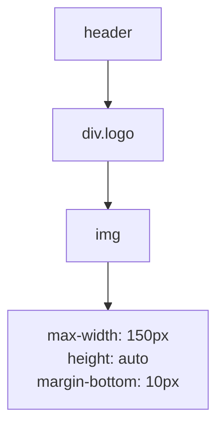
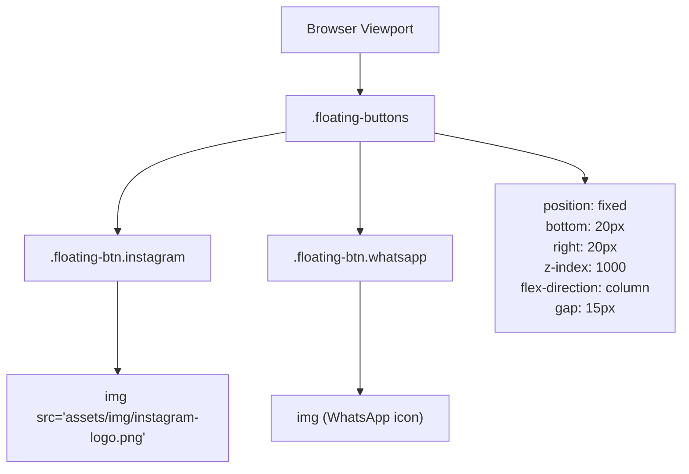
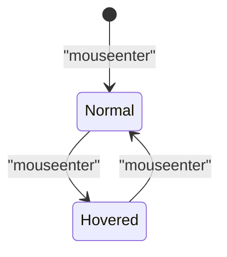
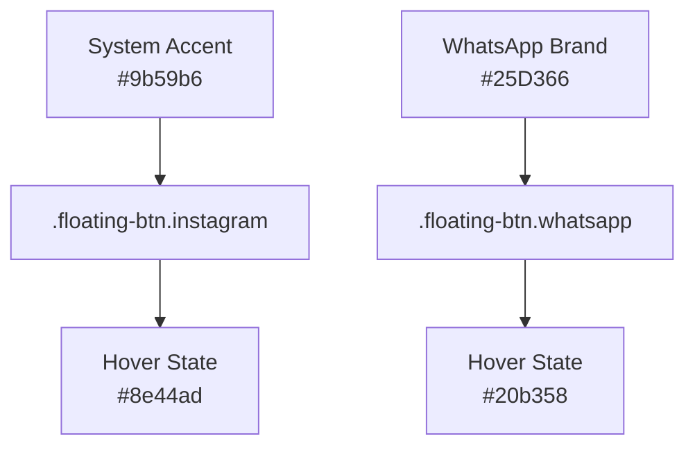
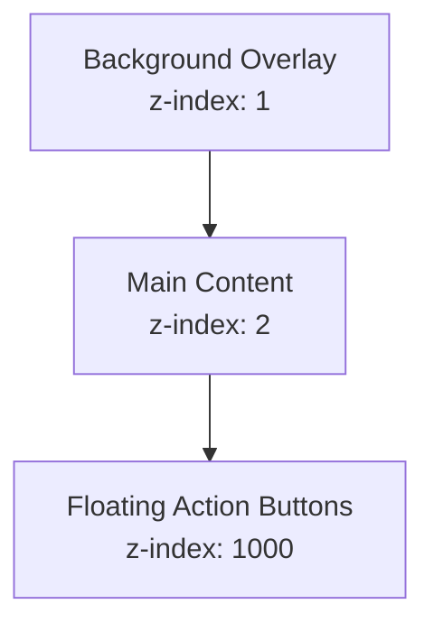

# Branding and Icons

> **Relevant source files**
> * [assets/css/StyleCliente.css](https://github.com/GroveLive/hotelBenedetti/blob/ebdd0186/assets/css/StyleCliente.css)
> * [assets/img/instagram-logo.png](https://github.com/GroveLive/hotelBenedetti/blob/ebdd0186/assets/img/instagram-logo.png)
> * [assets/img/kira.jpg](https://github.com/GroveLive/hotelBenedetti/blob/ebdd0186/assets/img/kira.jpg)
> * [assets/img/logohotel.png](https://github.com/GroveLive/hotelBenedetti/blob/ebdd0186/assets/img/logohotel.png)
> * [assets/img/whatsapp-logo.png](https://github.com/GroveLive/hotelBenedetti/blob/ebdd0186/assets/img/whatsapp-logo.png)

**Purpose and Scope**: This document catalogs the branding assets and social media icons used in the Hotel Benedetti system, specifically focusing on the hotel logo displayed in page headers and the floating social media buttons that provide external communication channels. For information about decorative background imagery, see [Background Images](/GroveLive/hotelBenedetti/9.1-background-images). For room showcase photography, see [Room Type Images](/GroveLive/hotelBenedetti/9.2-room-type-images).

---

## Hotel Logo

### Logo Display Configuration

The hotel logo serves as the primary branding element in the client-facing interface, appearing in the header section of pages. The logo implementation uses responsive sizing to maintain visual hierarchy across devices.

**Base Logo Styling**:

* Maximum width: 150px
* Height: auto-scaled (maintains aspect ratio)
* Bottom margin: 10px
* Implemented via `.logo` container and `.logo img` element styles

**Responsive Breakpoints**:

| Viewport | Max Width | Notes |
| --- | --- | --- |
| Desktop (>768px) | 150px | Default size |
| Tablet (≤768px) | 150px | Unchanged from desktop |
| Mobile (≤480px) | 120px | Reduced for smaller screens |

Sources: [assets/css/StyleCliente.css L47-L55](https://github.com/GroveLive/hotelBenedetti/blob/ebdd0186/assets/css/StyleCliente.css#L47-L55)

 [assets/css/StyleCliente.css L436-L438](https://github.com/GroveLive/hotelBenedetti/blob/ebdd0186/assets/css/StyleCliente.css#L436-L438)

### Logo Structure and Layout

The logo appears above the navigation menu in the header, providing immediate brand recognition when users access the client interface.

Sources: [assets/css/StyleCliente.css L47-L62](https://github.com/GroveLive/hotelBenedetti/blob/ebdd0186/assets/css/StyleCliente.css#L47-L62)

---

## Social Media Icons

### Floating Action Buttons (FABs)

The system implements fixed-position floating action buttons for Instagram and WhatsApp, enabling quick access to the hotel's social media presence and direct messaging.

**Platform Configuration**:

| Platform | Background Color | Hover Color | Purpose |
| --- | --- | --- | --- |
| Instagram | `#9b59b6` (purple) | `#8e44ad` | Link to Instagram profile |
| WhatsApp | `#25D366` (green) | `#20b358` | Direct messaging contact |

Sources: [assets/css/StyleCliente.css L373-L387](https://github.com/GroveLive/hotelBenedetti/blob/ebdd0186/assets/css/StyleCliente.css#L373-L387)

### FAB Container Positioning

The `.floating-buttons` container uses fixed positioning to remain visible during page scrolling, anchored to the bottom-right corner of the viewport.

Sources: [assets/css/StyleCliente.css L339-L348](https://github.com/GroveLive/hotelBenedetti/blob/ebdd0186/assets/css/StyleCliente.css#L339-L348)

### FAB Button Specifications

**Base Button Styles** (`.floating-btn`):

* Dimensions: 50px × 50px (circular)
* Border radius: 50%
* Display: flex (centered content)
* Box shadow: `0 2px 5px rgba(0, 0, 0, 0.3)`
* Transition: 0.3s ease on transform and box-shadow

**Icon Image Styles** (`.floating-btn img`):

* Dimensions: 30px × 30px
* Object fit: `contain` (prevents distortion)
* Ensures crisp rendering at small scale

Sources: [assets/css/StyleCliente.css L350-L371](https://github.com/GroveLive/hotelBenedetti/blob/ebdd0186/assets/css/StyleCliente.css#L350-L371)

### Hover Interactions

Hover effects provide visual feedback:

* **Scale**: Increases to 1.1× (10% enlargement)
* **Shadow**: Deepens to `0 4px 8px rgba(0, 0, 0, 0.4)`
* **Background**: Darkens to platform-specific hover color
* **Duration**: 0.3s ease transition

Sources: [assets/css/StyleCliente.css L362-L387](https://github.com/GroveLive/hotelBenedetti/blob/ebdd0186/assets/css/StyleCliente.css#L362-L387)

---

## Color Integration

### Brand Alignment

The Instagram FAB uses the system's signature purple accent (`#9b59b6`), maintaining consistency with the dark theme documented in [Color Palette and Theming](/GroveLive/hotelBenedetti/8.1-color-palette-and-theming). This creates visual cohesion between interactive elements across the interface.

**Color Mapping**:

The WhatsApp button uses the platform's standard brand color to maintain recognizability for users.

Sources: [assets/css/StyleCliente.css L373-L387](https://github.com/GroveLive/hotelBenedetti/blob/ebdd0186/assets/css/StyleCliente.css#L373-L387)

---

## Responsive Behavior

### Breakpoint Adaptations

Both logo and FAB elements scale down at smaller viewports to preserve screen real estate and ensure adequate touch targets on mobile devices.

**Tablet Breakpoint (≤768px)**:

* Logo: 150px max-width (unchanged)
* FAB position: 15px from edges (reduced from 20px)
* FAB size: 45px × 45px (reduced from 50px)
* Icon size: 25px × 25px (reduced from 30px)
* Gap between buttons: 10px (reduced from 15px)

**Mobile Breakpoint (≤480px)**:

* Logo: 120px max-width (20% reduction)
* FAB position: 10px from edges
* FAB size: 40px × 40px
* Icon size: 20px × 20px

Sources: [assets/css/StyleCliente.css L398-L433](https://github.com/GroveLive/hotelBenedetti/blob/ebdd0186/assets/css/StyleCliente.css#L398-L433)

 [assets/css/StyleCliente.css L435-L473](https://github.com/GroveLive/hotelBenedetti/blob/ebdd0186/assets/css/StyleCliente.css#L435-L473)

### Responsive Scaling Comparison

| Element | Desktop | Tablet (≤768px) | Mobile (≤480px) |
| --- | --- | --- | --- |
| Logo max-width | 150px | 150px | 120px |
| FAB button size | 50px circle | 45px circle | 40px circle |
| FAB icon size | 30px | 25px | 20px |
| FAB position offset | 20px | 15px | 10px |
| FAB gap | 15px | 10px | (same) |

Sources: [assets/css/StyleCliente.css L398-L473](https://github.com/GroveLive/hotelBenedetti/blob/ebdd0186/assets/css/StyleCliente.css#L398-L473)

---

## Asset File References

### Image Asset Locations

All branding and icon assets reside in the `assets/img/` directory:

| Asset | File Path | Usage |
| --- | --- | --- |
| Instagram Icon | `assets/img/instagram-logo.png` | `.floating-btn.instagram` button |
| WhatsApp Icon | `assets/img/whatsapp-logo.png` (inferred) | `.floating-btn.whatsapp` button |
| Hotel Logo | Referenced in HTML (specific file not shown in CSS) | `header .logo img` element |

The Instagram logo file is a PNG format image with transparency support, optimized for display at 20-30px dimensions.

Sources: [assets/css/StyleCliente.css L47-L55](https://github.com/GroveLive/hotelBenedetti/blob/ebdd0186/assets/css/StyleCliente.css#L47-L55)

 [assets/css/StyleCliente.css L367-L371](https://github.com/GroveLive/hotelBenedetti/blob/ebdd0186/assets/css/StyleCliente.css#L367-L371)

 [assets/img/instagram-logo.png L1](https://github.com/GroveLive/hotelBenedetti/blob/ebdd0186/assets/img/instagram-logo.png#L1-L1)

---

## CSS Class Reference

### Logo Classes

| Selector | Properties | Purpose |
| --- | --- | --- |
| `header .logo` | `margin-bottom: 10px` | Container spacing |
| `header .logo img` | `max-width: 150px``height: auto` | Logo sizing and aspect ratio |

Sources: [assets/css/StyleCliente.css L47-L55](https://github.com/GroveLive/hotelBenedetti/blob/ebdd0186/assets/css/StyleCliente.css#L47-L55)

### Floating Button Classes

| Class | Key Properties | Purpose |
| --- | --- | --- |
| `.floating-buttons` | `position: fixed``bottom: 20px``right: 20px``display: flex``flex-direction: column``z-index: 1000` | FAB container positioning and layout |
| `.floating-btn` | `width: 50px``height: 50px``border-radius: 50%``display: flex``justify-content: center``align-items: center` | Base button styling (circular shape) |
| `.floating-btn.instagram` | `background-color: #9b59b6` | Instagram-specific background |
| `.floating-btn.whatsapp` | `background-color: #25D366` | WhatsApp-specific background |
| `.floating-btn img` | `width: 30px``height: 30px``object-fit: contain` | Icon image sizing and fit |

Sources: [assets/css/StyleCliente.css L339-L387](https://github.com/GroveLive/hotelBenedetti/blob/ebdd0186/assets/css/StyleCliente.css#L339-L387)

---

## Z-Index Layering Strategy

The floating action buttons use a high z-index value to ensure persistent visibility:

**Layering Hierarchy**:

* Background overlay: z-index 1
* Page content: z-index 2
* FAB container: z-index 1000

This ensures the social media buttons remain accessible above dynamically loaded content, modals, and scrolled sections.

Sources: [assets/css/StyleCliente.css L22-L37](https://github.com/GroveLive/hotelBenedetti/blob/ebdd0186/assets/css/StyleCliente.css#L22-L37)

 [assets/css/StyleCliente.css L347](https://github.com/GroveLive/hotelBenedetti/blob/ebdd0186/assets/css/StyleCliente.css#L347-L347)

---

## Implementation Context

The branding and icon styles are implemented exclusively in `StyleCliente.css`, indicating these elements appear only in the client-facing interface (`cliente.html`). The administrative panels, receptionist interface, and maid interface do not include these social media integration elements.

**Usage Pattern**:

1. Logo appears in `<header>` section at page top
2. FABs are direct children of `<body>` or main container
3. External links connect to hotel's social media profiles
4. Fixed positioning keeps FABs visible during scroll

Sources: [assets/css/StyleCliente.css L1-L486](https://github.com/GroveLive/hotelBenedetti/blob/ebdd0186/assets/css/StyleCliente.css#L1-L486)