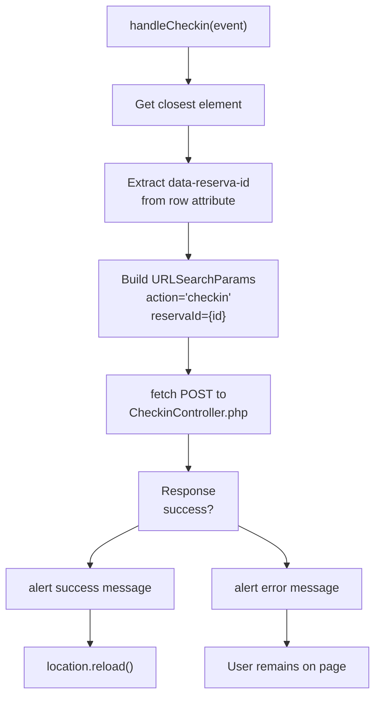
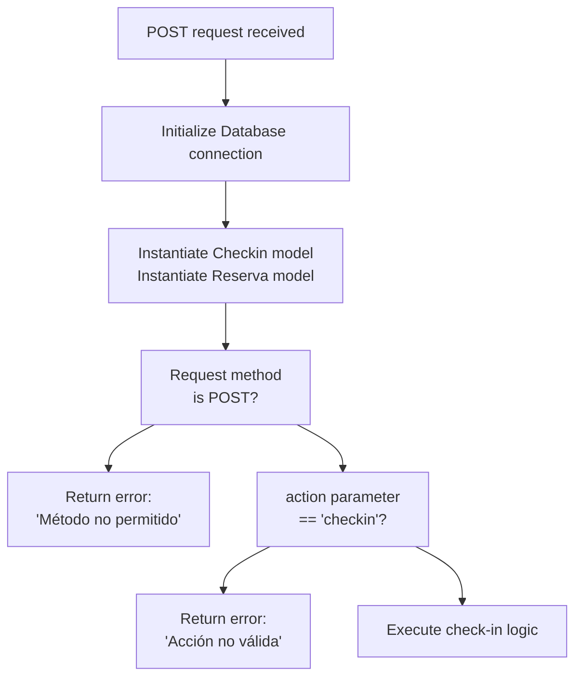
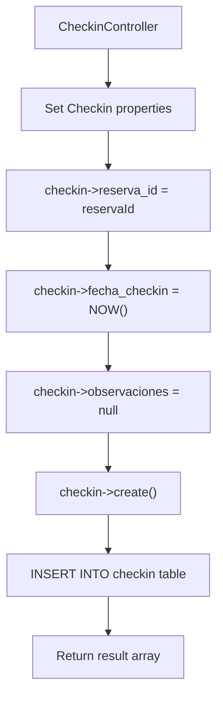
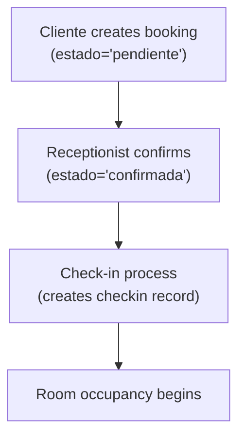

# Check-in Process

> **Relevant source files**
> * [assets/css/StyleRecepcionista.css](https://github.com/GroveLive/hotelBenedetti/blob/ebdd0186/assets/css/StyleRecepcionista.css)
> * [assets/js/script_recepcionista.js](https://github.com/GroveLive/hotelBenedetti/blob/ebdd0186/assets/js/script_recepcionista.js)
> * [controllers/CheckinController.php](https://github.com/GroveLive/hotelBenedetti/blob/ebdd0186/controllers/CheckinController.php)

## Purpose and Scope

This document describes the guest check-in workflow, which occurs when a guest with a confirmed reservation arrives at the hotel and the receptionist records their arrival in the system. This process validates the reservation status, creates a check-in record, and enables the guest to access their room.

For information about the reservation confirmation that precedes check-in, see [Reservation and Booking Flow](/GroveLive/hotelBenedetti/4.1-reservation-and-booking-flow). For information about the departure process, see [Check-out and Payment Process](/GroveLive/hotelBenedetti/4.3-check-out-and-payment-process). For the complete receptionist interface documentation, see [Receptionist Interface](/GroveLive/hotelBenedetti/3.3-receptionist-interface).

**Sources:** [controllers/CheckinController.php L1-L72](https://github.com/GroveLive/hotelBenedetti/blob/ebdd0186/controllers/CheckinController.php#L1-L72)

 [assets/js/script_recepcionista.js L110-L135](https://github.com/GroveLive/hotelBenedetti/blob/ebdd0186/assets/js/script_recepcionista.js#L110-L135)

---

## Process Overview

The check-in process is exclusively performed by receptionists through their dedicated interface. It marks the transition of a confirmed reservation to an active occupancy state by creating a timestamped check-in record. The system enforces strict validation to ensure only valid, confirmed reservations can be checked in, and prevents duplicate check-ins for the same reservation.

**Sources:** [controllers/CheckinController.php L18-L54](https://github.com/GroveLive/hotelBenedetti/blob/ebdd0186/controllers/CheckinController.php#L18-L54)

---

## Prerequisites for Check-in

Before a check-in can be successfully processed, the following conditions must be met:

| Condition | Validation Location | Error Message |
| --- | --- | --- |
| Reservation exists in database | [controllers/CheckinController.php L22-L34](https://github.com/GroveLive/hotelBenedetti/blob/ebdd0186/controllers/CheckinController.php#L22-L34) | "La reserva no existe o no está confirmada." |
| Reservation status is `'confirmada'` | [controllers/CheckinController.php L22-L34](https://github.com/GroveLive/hotelBenedetti/blob/ebdd0186/controllers/CheckinController.php#L22-L34) | "La reserva no existe o no está confirmada." |
| No existing check-in record for this reservation | [controllers/CheckinController.php L37-L47](https://github.com/GroveLive/hotelBenedetti/blob/ebdd0186/controllers/CheckinController.php#L37-L47) | "El check-in ya fue realizado para esta reserva." |

A reservation reaches `'confirmada'` status through the receptionist's confirmation action in the booking workflow (see [Reservation and Booking Flow](/GroveLive/hotelBenedetti/4.1-reservation-and-booking-flow)).

**Sources:** [controllers/CheckinController.php L22-L47](https://github.com/GroveLive/hotelBenedetti/blob/ebdd0186/controllers/CheckinController.php#L22-L47)

---

## User Interface Components

### Receptionist Interface Elements

The check-in functionality is accessed from the receptionist's guest list section, which displays confirmed reservations eligible for check-in.

#### Guest List Table Structure

The table displays guests with confirmed reservations and includes a check-in action button:

```python
| Column         | Description                              |
|----------------|------------------------------------------|
| Guest Name     | Usuario's nombre + apellido              |
| Room Number    | Habitacion numero_habitacion             |
| Check-in Date  | Reserva fecha_entrada                    |
| Check-out Date | Reserva fecha_salida                     |
| Action         | Button with class .checkin-button        |
```

The check-in button is styled with the system's purple accent color (`#9b59b6`) and appears for each row where the reservation status is `'confirmada'` and no check-in record exists.

**Sources:** [assets/css/StyleRecepcionista.css L159-L202](https://github.com/GroveLive/hotelBenedetti/blob/ebdd0186/assets/css/StyleRecepcionista.css#L159-L202)

 [assets/js/script_recepcionista.js L17-L19](https://github.com/GroveLive/hotelBenedetti/blob/ebdd0186/assets/js/script_recepcionista.js#L17-L19)

---

## Check-in Workflow Sequence

### Complete Check-in Flow

```mermaid
sequenceDiagram
  participant Receptionist
  participant (Browser)
  participant script_recepcionista.js
  participant handleCheckin()
  participant CheckinController.php
  participant Database
  participant (reservas, checkin)
  participant Checkin Model

  Receptionist->>script_recepcionista.js: "Click .checkin-button"
  script_recepcionista.js->>script_recepcionista.js: "Extract reservaId from
  script_recepcionista.js->>CheckinController.php: data-reserva-id attribute"
  CheckinController.php->>Database: "POST with action='checkin'
  loop ["Check-in already exists"]
    Database-->>CheckinController.php: reservaId={id}"
    CheckinController.php-->>script_recepcionista.js: "SELECT * FROM reservas
    script_recepcionista.js-->>Receptionist: WHERE id=? AND estado='confirmada'"
    Database-->>CheckinController.php: "Empty result"
    CheckinController.php->>Database: "JSON: success=false
    Database-->>CheckinController.php: message='La reserva no existe...'"
    CheckinController.php-->>script_recepcionista.js: "alert(error message)"
    script_recepcionista.js-->>Receptionist: "Reserva data"
    Database-->>CheckinController.php: "SELECT * FROM checkin
    CheckinController.php->>Checkin Model: WHERE reserva_id=?"
    Checkin Model->>Database: "Existing checkin record"
    Database-->>Checkin Model: "JSON: success=false
    Checkin Model-->>CheckinController.php: message='El check-in ya fue realizado...'"
    CheckinController.php-->>script_recepcionista.js: "alert(error message)"
    script_recepcionista.js-->>Receptionist: "Empty result"
    script_recepcionista.js->>Receptionist: "Set reserva_id, fecha_checkin
  end
```

**Sources:** [assets/js/script_recepcionista.js L110-L135](https://github.com/GroveLive/hotelBenedetti/blob/ebdd0186/assets/js/script_recepcionista.js#L110-L135)

 [controllers/CheckinController.php L18-L54](https://github.com/GroveLive/hotelBenedetti/blob/ebdd0186/controllers/CheckinController.php#L18-L54)

---

## Frontend Implementation

### Event Handler Registration

The check-in button click handlers are registered when the DOM loads:

```javascript
// Line 17-19 in script_recepcionista.js
document.querySelectorAll(".checkin-button").forEach(button => {
    button.addEventListener("click", handleCheckin);
});
```

**Sources:** [assets/js/script_recepcionista.js L17-L19](https://github.com/GroveLive/hotelBenedetti/blob/ebdd0186/assets/js/script_recepcionista.js#L17-L19)

### Check-in Request Handler

The `handleCheckin()` function processes the button click:



The function implementation:

1. Locates the table row containing the clicked button
2. Extracts the `data-reserva-id` attribute from the row
3. Constructs a POST request with `action` and `reservaId` parameters
4. Sends the request to `CheckinController.php` using `fetch()`
5. Processes the JSON response
6. Displays success/error alerts
7. Reloads the page on success to refresh the guest list

**Sources:** [assets/js/script_recepcionista.js L110-L135](https://github.com/GroveLive/hotelBenedetti/blob/ebdd0186/assets/js/script_recepcionista.js#L110-L135)

---

## Backend Processing

### Controller Entry Point

The `CheckinController.php` serves as the API endpoint for check-in operations:



**Sources:** [controllers/CheckinController.php L9-L66](https://github.com/GroveLive/hotelBenedetti/blob/ebdd0186/controllers/CheckinController.php#L9-L66)

### Validation Logic

The controller performs two critical validations:

#### 1. Reservation Status Validation

```javascript
// Lines 22-34 in CheckinController.php
$query = "SELECT * FROM reservas WHERE id = :reservaId AND estado = 'confirmada'";
$stmt = $conn->prepare($query);
$stmt->bindParam(":reservaId", $reservaId);
$stmt->execute();
$reserva_data = $stmt->fetch(PDO::FETCH_ASSOC);

if (!$reserva_data) {
    echo json_encode([
        "success" => false,
        "message" => "La reserva no existe o no está confirmada."
    ]);
    exit();
}
```

This query ensures the reservation:

* Exists in the `reservas` table
* Has `estado = 'confirmada'` (not `'pendiente'`, `'cancelada'`, etc.)

#### 2. Duplicate Check-in Prevention

```javascript
// Lines 37-47 in CheckinController.php
$query = "SELECT * FROM checkin WHERE reserva_id = :reservaId";
$stmt = $conn->prepare($query);
$stmt->bindParam(":reservaId", $reservaId);
$stmt->execute();
if ($stmt->rowCount() > 0) {
    echo json_encode([
        "success" => false,
        "message" => "El check-in ya fue realizado para esta reserva."
    ]);
    exit();
}
```

This prevents creating multiple check-in records for the same reservation, which would violate the one-to-one relationship between `reserva` and `checkin` entities.

**Sources:** [controllers/CheckinController.php L22-L47](https://github.com/GroveLive/hotelBenedetti/blob/ebdd0186/controllers/CheckinController.php#L22-L47)

---

## Database Operations

### Checkin Model Integration

After validation passes, the controller uses the `Checkin` model to persist the check-in record:



Code implementation:

```php
// Lines 49-54 in CheckinController.php
$checkin->reserva_id = $reservaId;
$checkin->fecha_checkin = date('Y-m-d H:i:s');
$checkin->observaciones = null; 

$result = $checkin->create();
echo json_encode($result);
```

The `create()` method (defined in the `Checkin` model class) executes an INSERT statement into the `checkin` table.

**Sources:** [controllers/CheckinController.php L49-L54](https://github.com/GroveLive/hotelBenedetti/blob/ebdd0186/controllers/CheckinController.php#L49-L54)

### Database Schema Relationships

```css
#mermaid-wlbze13zhfa{font-family:ui-sans-serif,-apple-system,system-ui,Segoe UI,Helvetica;font-size:16px;fill:#333;}@keyframes edge-animation-frame{from{stroke-dashoffset:0;}}@keyframes dash{to{stroke-dashoffset:0;}}#mermaid-wlbze13zhfa .edge-animation-slow{stroke-dasharray:9,5!important;stroke-dashoffset:900;animation:dash 50s linear infinite;stroke-linecap:round;}#mermaid-wlbze13zhfa .edge-animation-fast{stroke-dasharray:9,5!important;stroke-dashoffset:900;animation:dash 20s linear infinite;stroke-linecap:round;}#mermaid-wlbze13zhfa .error-icon{fill:#dddddd;}#mermaid-wlbze13zhfa .error-text{fill:#222222;stroke:#222222;}#mermaid-wlbze13zhfa .edge-thickness-normal{stroke-width:1px;}#mermaid-wlbze13zhfa .edge-thickness-thick{stroke-width:3.5px;}#mermaid-wlbze13zhfa .edge-pattern-solid{stroke-dasharray:0;}#mermaid-wlbze13zhfa .edge-thickness-invisible{stroke-width:0;fill:none;}#mermaid-wlbze13zhfa .edge-pattern-dashed{stroke-dasharray:3;}#mermaid-wlbze13zhfa .edge-pattern-dotted{stroke-dasharray:2;}#mermaid-wlbze13zhfa .marker{fill:#999;stroke:#999;}#mermaid-wlbze13zhfa .marker.cross{stroke:#999;}#mermaid-wlbze13zhfa svg{font-family:ui-sans-serif,-apple-system,system-ui,Segoe UI,Helvetica;font-size:16px;}#mermaid-wlbze13zhfa p{margin:0;}#mermaid-wlbze13zhfa .entityBox{fill:#ffffff;stroke:#dddddd;}#mermaid-wlbze13zhfa .relationshipLabelBox{fill:#dddddd;opacity:0.7;background-color:#dddddd;}#mermaid-wlbze13zhfa .relationshipLabelBox rect{opacity:0.5;}#mermaid-wlbze13zhfa .labelBkg{background-color:rgba(221, 221, 221, 0.5);}#mermaid-wlbze13zhfa .edgeLabel .label{fill:#dddddd;font-size:14px;}#mermaid-wlbze13zhfa .label{font-family:ui-sans-serif,-apple-system,system-ui,Segoe UI,Helvetica;color:#333;}#mermaid-wlbze13zhfa .edge-pattern-dashed{stroke-dasharray:8,8;}#mermaid-wlbze13zhfa .node rect,#mermaid-wlbze13zhfa .node circle,#mermaid-wlbze13zhfa .node ellipse,#mermaid-wlbze13zhfa .node polygon{fill:#ffffff;stroke:#dddddd;stroke-width:1px;}#mermaid-wlbze13zhfa .relationshipLine{stroke:#999;stroke-width:1;fill:none;}#mermaid-wlbze13zhfa .marker{fill:none!important;stroke:#999!important;stroke-width:1;}#mermaid-wlbze13zhfa :root{--mermaid-font-family:"trebuchet ms",verdana,arial,sans-serif;}has onereservasintidPKintusuario_idFKinthabitacion_idFKdatefecha_entradadatefecha_salidastringestadocheckinintidPKintreserva_idFKdatetimefecha_checkintextobservaciones
```

The `checkin` table maintains a one-to-one relationship with `reservas` through the `reserva_id` foreign key. This relationship is enforced programmatically by the duplicate check-in validation rather than by database constraints.

**Sources:** [controllers/CheckinController.php L22-L47](https://github.com/GroveLive/hotelBenedetti/blob/ebdd0186/controllers/CheckinController.php#L22-L47)

---

## Response Format

### Success Response

When check-in is successful, the controller returns:

```json
{
  "success": true,
  "message": "Check-in registrado exitosamente"
}
```

The frontend then displays "Check-in realizado con éxito." and reloads the page.

### Error Responses

The controller returns error responses in three scenarios:

| Error Condition | Response |
| --- | --- |
| Invalid reservation | `{"success": false, "message": "La reserva no existe o no está confirmada."}` |
| Duplicate check-in | `{"success": false, "message": "El check-in ya fue realizado para esta reserva."}` |
| Invalid action | `{"success": false, "message": "Acción no válida."}` |
| Wrong HTTP method | `{"success": false, "message": "Método no permitido."}` |
| Exception thrown | `{"success": false, "message": "Error en el servidor: {exception message}"}` |

All responses use the `application/json` content type as set by the header on line 7.

**Sources:** [controllers/CheckinController.php L7-L71](https://github.com/GroveLive/hotelBenedetti/blob/ebdd0186/controllers/CheckinController.php#L7-L71)

---

## Visual Design

### Button Styling

The check-in button follows the system's purple accent theme:

```css
/* Base styling - StyleRecepcionista.css:189-202 */
#guest-list .checkout-button {
    background-color: #9b59b6;
    color: white;
    padding: 8px 12px;
    border: none;
    border-radius: 20px;
    cursor: pointer;
    font-weight: 500;
    transition: background-color 0.3s ease;
}

#guest-list .checkout-button:hover {
    background-color: #8e44ad;
}
```

Note: While the CSS class name is `checkout-button`, this styling applies to both check-in and check-out action buttons in the guest list table. The purple color (`#9b59b6`) is consistent with the system-wide accent color for primary actions.

**Sources:** [assets/css/StyleRecepcionista.css L189-L202](https://github.com/GroveLive/hotelBenedetti/blob/ebdd0186/assets/css/StyleRecepcionista.css#L189-L202)

### Responsive Adaptations

The interface adjusts for smaller screens:

```javascript
/* Tablet breakpoint - StyleRecepcionista.css:327-360 */
@media (max-width: 768px) {
    #guest-list .checkout-button {
        padding: 8px 10px;
        font-size: 14px;
    }
}
```

This ensures touch targets remain accessible on mobile devices.

**Sources:** [assets/css/StyleRecepcionista.css L327-L360](https://github.com/GroveLive/hotelBenedetti/blob/ebdd0186/assets/css/StyleRecepcionista.css#L327-L360)

---

## Error Handling

### Client-Side Error Display

The frontend uses native `alert()` dialogs to display error messages:

```
// Lines 128-130 in script_recepcionista.js
} else {
    alert("Error al realizar el check-in: " + data.message);
}
```

The error message from the server response is concatenated with a Spanish-language prefix.

### Server-Side Exception Handling

The controller wraps all operations in a try-catch block:

```javascript
// Lines 67-72 in CheckinController.php
} catch (Exception $e) {
    echo json_encode([
        "success" => false,
        "message" => "Error en el servidor: " . $e->getMessage()
    ]);
}
```

This prevents unhandled exceptions from breaking the JSON response format.

**Sources:** [assets/js/script_recepcionista.js L128-L130](https://github.com/GroveLive/hotelBenedetti/blob/ebdd0186/assets/js/script_recepcionista.js#L128-L130)

 [controllers/CheckinController.php L67-L72](https://github.com/GroveLive/hotelBenedetti/blob/ebdd0186/controllers/CheckinController.php#L67-L72)

---

## Integration with Other System Components

### Relationship to Reservation Workflow



The check-in process depends on the reservation being in `'confirmada'` status, which is set by the receptionist's confirmation action (see [Reservation and Booking Flow](/GroveLive/hotelBenedetti/4.1-reservation-and-booking-flow)).

### Impact on Room Status

While the check-in process itself does not modify the `habitacion2.estado` field, it marks the beginning of the guest's stay. The room status is managed separately through the administrative interface (see [Administrator Interface](/GroveLive/hotelBenedetti/3.2-administrator-interface)).

**Sources:** [controllers/CheckinController.php L22-L34](https://github.com/GroveLive/hotelBenedetti/blob/ebdd0186/controllers/CheckinController.php#L22-L34)

---

## Dependencies and Required Models

The `CheckinController.php` requires the following components:

| Component | Purpose |
| --- | --- |
| `Database` class | Establishes PDO connection via `getConnection()` |
| `Checkin` model | Provides `create()` method for INSERT operations |
| `Reserva` model | Loaded but not directly used (validation uses raw queries) |
| PHP Session | Started via `session_start()` for authentication context |

**Sources:** [controllers/CheckinController.php L2-L5](https://github.com/GroveLive/hotelBenedetti/blob/ebdd0186/controllers/CheckinController.php#L2-L5)

---

## Session Requirements

The controller starts a PHP session on line 2:

```
session_start();
```

While the current implementation doesn't explicitly check session variables, this maintains consistency with other controllers that verify the user's `rol` attribute. The receptionist interface itself is protected by role-based access control (see [User Roles and Access Control](/GroveLive/hotelBenedetti/3-user-roles-and-access-control)).

**Sources:** [controllers/CheckinController.php L2](https://github.com/GroveLive/hotelBenedetti/blob/ebdd0186/controllers/CheckinController.php#L2-L2)

---

## Testing Considerations

To test the check-in process, verify the following scenarios:

1. **Valid check-in**: Reservation exists with `estado='confirmada'`, no existing check-in
2. **Missing reservation**: Non-existent `reservaId` parameter
3. **Invalid reservation status**: Reservation has `estado='pendiente'` or `'cancelada'`
4. **Duplicate check-in**: Check-in record already exists for the reservation
5. **Invalid action**: POST request with `action` parameter != `'checkin'`
6. **Wrong HTTP method**: GET request instead of POST
7. **Database connection failure**: Simulated database unavailability

**Sources:** [controllers/CheckinController.php L22-L66](https://github.com/GroveLive/hotelBenedetti/blob/ebdd0186/controllers/CheckinController.php#L22-L66)