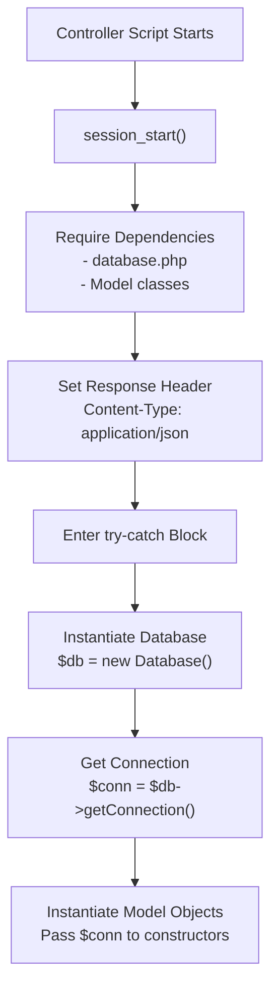
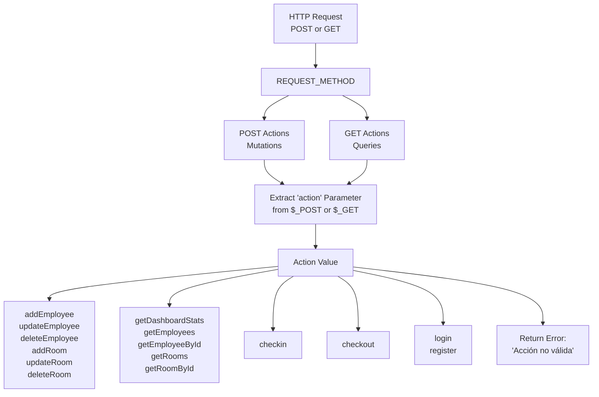
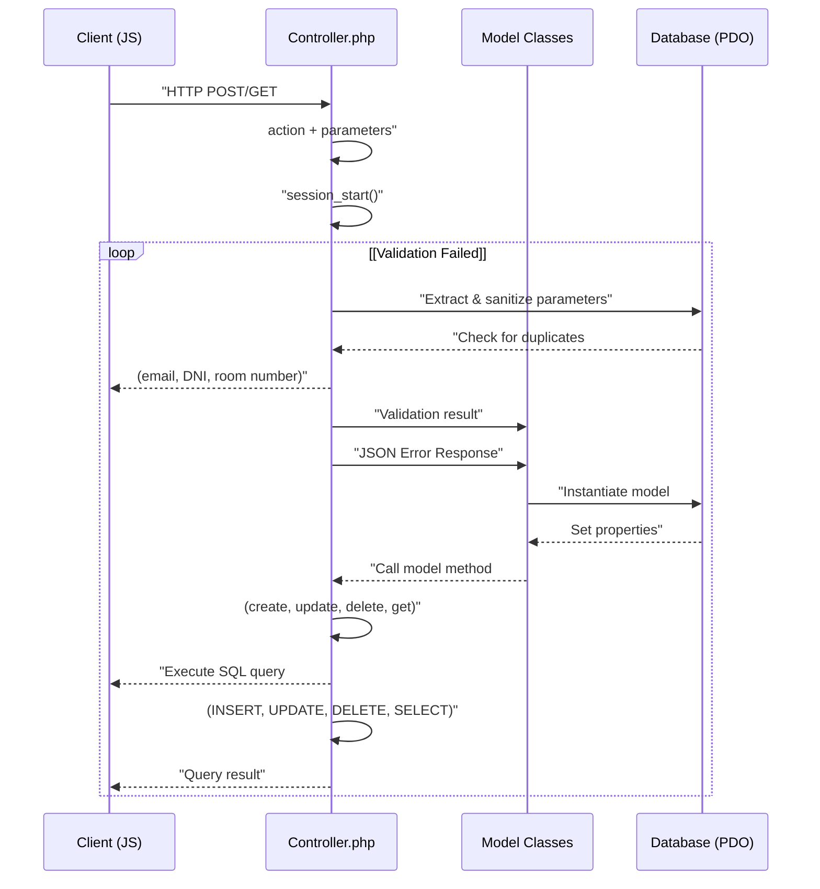
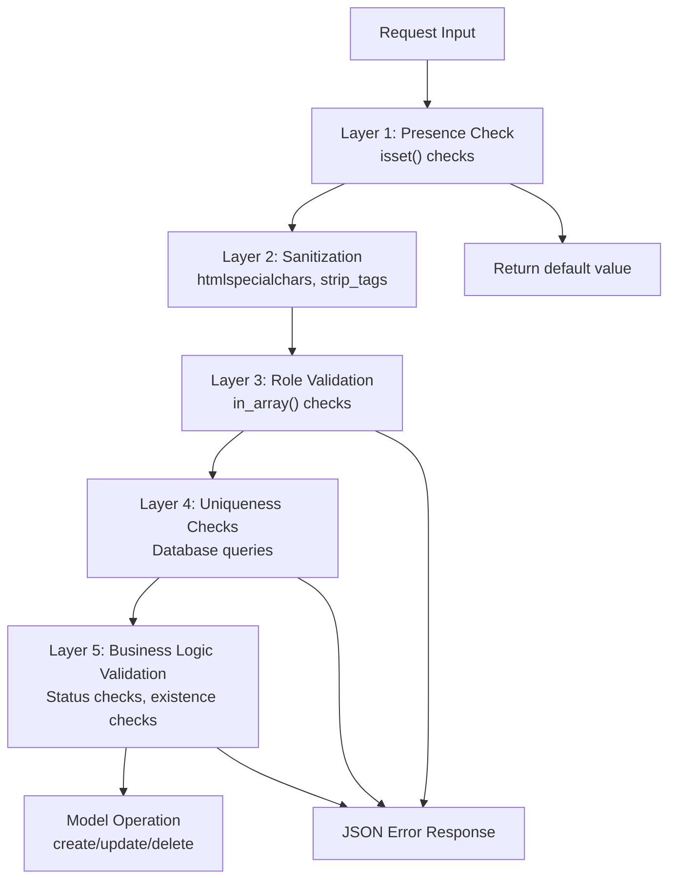

# Controller Architecture

> **Relevant source files**
> * [controllers/AdminController.php](https://github.com/GroveLive/hotelBenedetti/blob/ebdd0186/controllers/AdminController.php)
> * [controllers/AuthController.php](https://github.com/GroveLive/hotelBenedetti/blob/ebdd0186/controllers/AuthController.php)
> * [controllers/CheckinController.php](https://github.com/GroveLive/hotelBenedetti/blob/ebdd0186/controllers/CheckinController.php)
> * [controllers/CheckoutController.php](https://github.com/GroveLive/hotelBenedetti/blob/ebdd0186/controllers/CheckoutController.php)

## Purpose and Scope

This document explains the controller design patterns used throughout the Hotel Benedetti system. It covers the standardized initialization sequence, action-based routing mechanism, model interaction patterns, validation strategies, database connection management, and JSON response formatting. For information about the specific business logic implemented in each controller, see [Backend Controllers](/GroveLive/hotelBenedetti/2.2-backend-controllers). For details on data validation rules and business constraints, see [Data Validation and Business Rules](/GroveLive/hotelBenedetti/6.2-data-validation-and-business-rules).

---

## Controller Structure Overview

All PHP controllers in the system follow a consistent architectural pattern that separates concerns and ensures predictable behavior across different functional areas.

### Core Controller Files

The system contains four primary controllers, each responsible for a specific domain:

| Controller | File Path | Primary Responsibilities |
| --- | --- | --- |
| **AdminController** | `controllers/AdminController.php` | Employee CRUD, Room CRUD, Dashboard statistics |
| **AuthController** | `controllers/AuthController.php` | Login, Registration, Session management |
| **CheckinController** | `controllers/CheckinController.php` | Guest check-in processing |
| **CheckoutController** | `controllers/CheckoutController.php` | Guest check-out, Payment processing, Room status transitions |

Each controller operates independently but shares common architectural patterns for initialization, routing, and response handling.

**Sources:** [controllers/AdminController.php L1-L334](https://github.com/GroveLive/hotelBenedetti/blob/ebdd0186/controllers/AdminController.php#L1-L334)

 [controllers/AuthController.php L1-L80](https://github.com/GroveLive/hotelBenedetti/blob/ebdd0186/controllers/AuthController.php#L1-L80)

 [controllers/CheckinController.php L1-L72](https://github.com/GroveLive/hotelBenedetti/blob/ebdd0186/controllers/CheckinController.php#L1-L72)

 [controllers/CheckoutController.php L1-L111](https://github.com/GroveLive/hotelBenedetti/blob/ebdd0186/controllers/CheckoutController.php#L1-L111)

---

## Initialization Pattern

Every controller follows a standardized initialization sequence that establishes the execution context and prepares required resources.

### Initialization Sequence Diagram



### Session Management

All controllers begin with `session_start()` to access or create the PHP session. This enables:

* Storage of authenticated user data
* Role-based access control validation
* Persistence of user context across requests

**Sources:** [controllers/AdminController.php L2](https://github.com/GroveLive/hotelBenedetti/blob/ebdd0186/controllers/AdminController.php#L2-L2)

 [controllers/AuthController.php L2](https://github.com/GroveLive/hotelBenedetti/blob/ebdd0186/controllers/AuthController.php#L2-L2)

 [controllers/CheckinController.php L2](https://github.com/GroveLive/hotelBenedetti/blob/ebdd0186/controllers/CheckinController.php#L2-L2)

 [controllers/CheckoutController.php L2](https://github.com/GroveLive/hotelBenedetti/blob/ebdd0186/controllers/CheckoutController.php#L2-L2)

### Dependency Loading

Controllers use `require_once` to load necessary dependencies:

```python
// Example from AdminController
require_once '../ddbb/database.php';
require_once '../models/Usuario2.php';
require_once '../models/Empleado.php';
require_once '../models/Habitacion2.php';
```

The pattern ensures each controller only loads the models it requires, maintaining separation of concerns.

**Sources:** [controllers/AdminController.php L3-L6](https://github.com/GroveLive/hotelBenedetti/blob/ebdd0186/controllers/AdminController.php#L3-L6)

 [controllers/CheckinController.php L3-L5](https://github.com/GroveLive/hotelBenedetti/blob/ebdd0186/controllers/CheckinController.php#L3-L5)

 [controllers/CheckoutController.php L3-L6](https://github.com/GroveLive/hotelBenedetti/blob/ebdd0186/controllers/CheckoutController.php#L3-L6)

### Database Connection Initialization

Every controller follows this pattern for database connectivity:

1. Instantiate the `Database` class
2. Call `getConnection()` to obtain a PDO connection object
3. Pass the connection to model constructors

```
$db = new Database();
$conn = $db->getConnection();
$usuario = new Usuario2($conn);
$empleado = new Empleado($conn);
```

This centralizes connection management and allows models to execute queries using the shared connection object.

**Sources:** [controllers/AdminController.php L11-L15](https://github.com/GroveLive/hotelBenedetti/blob/ebdd0186/controllers/AdminController.php#L11-L15)

 [controllers/CheckinController.php L10-L13](https://github.com/GroveLive/hotelBenedetti/blob/ebdd0186/controllers/CheckinController.php#L10-L13)

 [controllers/CheckoutController.php L11-L15](https://github.com/GroveLive/hotelBenedetti/blob/ebdd0186/controllers/CheckoutController.php#L11-L15)

### Response Header Configuration

All controllers set the JSON response header immediately after loading dependencies:

```
header('Content-Type: application/json');
```

This ensures all responses are interpreted as JSON by the client, regardless of whether the request succeeds or fails.

**Sources:** [controllers/AdminController.php L8](https://github.com/GroveLive/hotelBenedetti/blob/ebdd0186/controllers/AdminController.php#L8-L8)

 [controllers/AuthController.php L8](https://github.com/GroveLive/hotelBenedetti/blob/ebdd0186/controllers/AuthController.php#L8-L8)

 [controllers/CheckinController.php L7](https://github.com/GroveLive/hotelBenedetti/blob/ebdd0186/controllers/CheckinController.php#L7-L7)

 [controllers/CheckoutController.php L8](https://github.com/GroveLive/hotelBenedetti/blob/ebdd0186/controllers/CheckoutController.php#L8-L8)

---

## Action-Based Routing System

Controllers implement an action dispatching pattern where a single endpoint handles multiple operations based on an `action` parameter.

### Action Routing Architecture



### HTTP Method Routing

Controllers first check the request method:

```
if ($_SERVER["REQUEST_METHOD"] === "POST") {
    $action = isset($_POST['action']) ? $_POST['action'] : '';
    // Handle mutation actions
} elseif ($_SERVER["REQUEST_METHOD"] === "GET") {
    $action = isset($_GET['action']) ? $_GET['action'] : '';
    // Handle query actions
}
```

**Convention:** POST requests perform mutations (create, update, delete), while GET requests retrieve data.

**Sources:** [controllers/AdminController.php L17-L18](https://github.com/GroveLive/hotelBenedetti/blob/ebdd0186/controllers/AdminController.php#L17-L18)

 [controllers/AdminController.php L256-L257](https://github.com/GroveLive/hotelBenedetti/blob/ebdd0186/controllers/AdminController.php#L256-L257)

 [controllers/CheckinController.php L15-L16](https://github.com/GroveLive/hotelBenedetti/blob/ebdd0186/controllers/CheckinController.php#L15-L16)

### Action Parameter Extraction

The action parameter determines which operation to execute:

```
$action = isset($_POST['action']) ? $_POST['action'] : '';
```

Default to an empty string if the parameter is missing, ensuring consistent error handling downstream.

**Sources:** [controllers/AdminController.php L18](https://github.com/GroveLive/hotelBenedetti/blob/ebdd0186/controllers/AdminController.php#L18-L18)

 [controllers/CheckinController.php L16](https://github.com/GroveLive/hotelBenedetti/blob/ebdd0186/controllers/CheckinController.php#L16-L16)

 [controllers/CheckoutController.php L18](https://github.com/GroveLive/hotelBenedetti/blob/ebdd0186/controllers/CheckoutController.php#L18-L18)

### Action Dispatch Logic

Controllers use `if-elseif-else` chains to route actions:

```javascript
if ($action === "addEmployee") {
    // Handle employee creation
} elseif ($action === "updateEmployee") {
    // Handle employee update
} elseif ($action === "deleteEmployee") {
    // Handle employee deletion
} else {
    echo json_encode([
        "success" => false,
        "message" => "Acción no válida."
    ]);
}
```

**Sources:** [controllers/AdminController.php L20-L255](https://github.com/GroveLive/hotelBenedetti/blob/ebdd0186/controllers/AdminController.php#L20-L255)

 [controllers/CheckinController.php L18-L59](https://github.com/GroveLive/hotelBenedetti/blob/ebdd0186/controllers/CheckinController.php#L18-L59)

### AdminController Action Map

| Action | HTTP Method | Purpose |
| --- | --- | --- |
| `addEmployee` | POST | Create new employee record |
| `updateEmployee` | POST | Modify existing employee |
| `deleteEmployee` | POST | Remove employee |
| `addRoom` | POST | Create new room |
| `updateRoom` | POST | Modify existing room |
| `deleteRoom` | POST | Remove room |
| `getDashboardStats` | GET | Retrieve statistics for dashboard |
| `getEmployees` | GET | Fetch all employee records |
| `getEmployeeById` | GET | Fetch single employee |
| `getRooms` | GET | Fetch all rooms |
| `getRoomById` | GET | Fetch single room |

**Sources:** [controllers/AdminController.php L20-L322](https://github.com/GroveLive/hotelBenedetti/blob/ebdd0186/controllers/AdminController.php#L20-L322)

---

## Request Processing Flow

This section details the complete request-response lifecycle within a controller.

### End-to-End Request Flow



### Parameter Extraction and Sanitization

Controllers extract parameters using the null coalescing pattern and apply sanitization:

```
$name = isset($_POST['name']) ? htmlspecialchars(strip_tags($_POST['name'])) : '';
$email = isset($_POST['email']) ? htmlspecialchars(strip_tags($_POST['email'])) : '';
$dni = isset($_POST['dni']) ? htmlspecialchars(strip_tags($_POST['dni'])) : '';
```

**Sanitization functions:**

* `htmlspecialchars()`: Converts special characters to HTML entities
* `strip_tags()`: Removes HTML/PHP tags

**Sources:** [controllers/AdminController.php L21-L27](https://github.com/GroveLive/hotelBenedetti/blob/ebdd0186/controllers/AdminController.php#L21-L27)

 [controllers/AdminController.php L106-L112](https://github.com/GroveLive/hotelBenedetti/blob/ebdd0186/controllers/AdminController.php#L106-L112)

### Type Casting for Numeric Values

Numeric parameters are explicitly cast to ensure type safety:

```
$reservaId = isset($_POST['reservaId']) ? (int)$_POST['reservaId'] : 0;
$totalPagado = isset($_POST['totalPagado']) ? (float)$_POST['totalPagado'] : 0.0;
$roomPrice = isset($_POST['roomPrice']) ? (float)$_POST['roomPrice'] : 0.0;
```

**Sources:** [controllers/CheckinController.php L19](https://github.com/GroveLive/hotelBenedetti/blob/ebdd0186/controllers/CheckinController.php#L19-L19)

 [controllers/CheckoutController.php L22](https://github.com/GroveLive/hotelBenedetti/blob/ebdd0186/controllers/CheckoutController.php#L22-L22)

 [controllers/AdminController.php L194](https://github.com/GroveLive/hotelBenedetti/blob/ebdd0186/controllers/AdminController.php#L194-L194)

### Password Hashing

Passwords are hashed using `PASSWORD_BCRYPT` before storage:

```
$password = isset($_POST['password']) ? password_hash($_POST['password'], PASSWORD_BCRYPT) : '';
```

For updates, passwords are conditionally hashed only if provided:

```
$password = isset($_POST['password']) && !empty($_POST['password']) 
    ? password_hash($_POST['password'], PASSWORD_BCRYPT) 
    : null;
```

**Sources:** [controllers/AdminController.php L26](https://github.com/GroveLive/hotelBenedetti/blob/ebdd0186/controllers/AdminController.php#L26-L26)

 [controllers/AdminController.php L111](https://github.com/GroveLive/hotelBenedetti/blob/ebdd0186/controllers/AdminController.php#L111-L111)

---

## Model Interaction Patterns

Controllers orchestrate business logic by coordinating multiple model operations.

### Single Model Operations

Simple operations involve a single model:

```php
// Get all rooms
$result = $habitacion->getAll();
echo json_encode($result);
```

**Sources:** [controllers/AdminController.php L311-L312](https://github.com/GroveLive/hotelBenedetti/blob/ebdd0186/controllers/AdminController.php#L311-L312)

### Multi-Model Coordination

Complex operations require coordinating multiple models. Example from employee creation:

```go
// Step 1: Create user record
$usuario->nombre = $name;
$usuario->apellido = $lastname;
$usuario->email = $email;
// ... set other properties
$usuario_result = $usuario->create();

if ($usuario_result['success']) {
    $usuario_id = $usuario_result['id'];
    
    // Step 2: Create employee record linked to user
    $empleado->usuario_id = $usuario_id;
    $empleado->cargo = $role;
    $empleado_result = $empleado->create();
    
    if ($empleado_result['success']) {
        // Success response
    } else {
        // Rollback: Delete user record
        $query = "DELETE FROM usuarios WHERE id = :id";
        $stmt = $conn->prepare($query);
        $stmt->bindParam(":id", $usuario_id);
        $stmt->execute();
    }
}
```

**Pattern:** When a multi-step operation fails partway through, the controller performs manual rollback by deleting created records.

**Sources:** [controllers/AdminController.php L64-L103](https://github.com/GroveLive/hotelBenedetti/blob/ebdd0186/controllers/AdminController.php#L64-L103)

### Direct Database Queries for Validation

Controllers execute direct SQL queries for validation before delegating to models:

```javascript
// Check for duplicate email
$query = "SELECT id FROM usuarios WHERE email = :email";
$stmt = $conn->prepare($query);
$stmt->bindParam(":email", $email);
$stmt->execute();
if ($stmt->rowCount() > 0) {
    echo json_encode([
        "success" => false,
        "message" => "El email ya está registrado."
    ]);
    exit();
}
```

**Rationale:** Validation logic often requires specific queries that don't fit into model methods designed for CRUD operations.

**Sources:** [controllers/AdminController.php L38-L48](https://github.com/GroveLive/hotelBenedetti/blob/ebdd0186/controllers/AdminController.php#L38-L48)

 [controllers/AdminController.php L51-L61](https://github.com/GroveLive/hotelBenedetti/blob/ebdd0186/controllers/AdminController.php#L51-L61)

 [controllers/AdminController.php L197-L207](https://github.com/GroveLive/hotelBenedetti/blob/ebdd0186/controllers/AdminController.php#L197-L207)

### Model Property Assignment Pattern

Controllers set model properties before calling methods:

```sql
$habitacion->numero_habitacion = $roomNumber;
$habitacion->tipo = $roomType;
$habitacion->precio = $roomPrice;
$habitacion->estado = 'disponible';

$result = $habitacion->create();
```

**Convention:** Model classes expose public properties that controllers populate before invoking CRUD methods.

**Sources:** [controllers/AdminController.php L210-L215](https://github.com/GroveLive/hotelBenedetti/blob/ebdd0186/controllers/AdminController.php#L210-L215)

 [controllers/CheckinController.php L49-L51](https://github.com/GroveLive/hotelBenedetti/blob/ebdd0186/controllers/CheckinController.php#L49-L51)

---

## Validation Strategies

Controllers implement multiple validation layers to ensure data integrity.

### Validation Hierarchy



### Role Validation

Controllers validate role parameters against allowed values:

```javascript
if (!in_array($role, ['recepcionista', 'mucama'])) {
    echo json_encode([
        "success" => false,
        "message" => "Rol no válido. Solo se permiten recepcionistas y mucamas."
    ]);
    exit();
}
```

**Sources:** [controllers/AdminController.php L29-L35](https://github.com/GroveLive/hotelBenedetti/blob/ebdd0186/controllers/AdminController.php#L29-L35)

 [controllers/AdminController.php L115-L121](https://github.com/GroveLive/hotelBenedetti/blob/ebdd0186/controllers/AdminController.php#L115-L121)

### Uniqueness Validation

Before creating or updating records, controllers check for duplicate values:

**Email Uniqueness:**

```javascript
$query = "SELECT id FROM usuarios WHERE email = :email";
$stmt = $conn->prepare($query);
$stmt->bindParam(":email", $email);
$stmt->execute();
if ($stmt->rowCount() > 0) {
    echo json_encode([
        "success" => false,
        "message" => "El email ya está registrado."
    ]);
    exit();
}
```

**Room Number Uniqueness:**

```javascript
$query = "SELECT id FROM habitaciones WHERE numero_habitacion = :roomNumber";
$stmt = $conn->prepare($query);
$stmt->bindParam(":roomNumber", $roomNumber);
$stmt->execute();
if ($stmt->rowCount() > 0) {
    echo json_encode([
        "success" => false,
        "message" => "El número de habitación ya existe."
    ]);
    exit();
}
```

**Sources:** [controllers/AdminController.php L38-L48](https://github.com/GroveLive/hotelBenedetti/blob/ebdd0186/controllers/AdminController.php#L38-L48)

 [controllers/AdminController.php L197-L207](https://github.com/GroveLive/hotelBenedetti/blob/ebdd0186/controllers/AdminController.php#L197-L207)

### Update Context Validation

When updating records, controllers exclude the current record from uniqueness checks:

```sql
$query = "SELECT id FROM usuarios WHERE email = :email AND id != :id";
$stmt = $conn->prepare($query);
$stmt->bindParam(":email", $email);
$stmt->bindParam(":id", $employeeId);
$stmt->execute();
```

**Pattern:** Use `AND id != :id` to prevent false positives when a record's unique field hasn't changed.

**Sources:** [controllers/AdminController.php L124-L135](https://github.com/GroveLive/hotelBenedetti/blob/ebdd0186/controllers/AdminController.php#L124-L135)

 [controllers/AdminController.php L224-L235](https://github.com/GroveLive/hotelBenedetti/blob/ebdd0186/controllers/AdminController.php#L224-L235)

### Business State Validation

Controllers verify that records are in valid states before processing:

**Check-in Validation:**

```javascript
// Verify reservation exists and is confirmed
$query = "SELECT * FROM reservas WHERE id = :reservaId AND estado = 'confirmada'";
$stmt = $conn->prepare($query);
$stmt->bindParam(":reservaId", $reservaId);
$stmt->execute();
$reserva_data = $stmt->fetch(PDO::FETCH_ASSOC);

if (!$reserva_data) {
    echo json_encode([
        "success" => false,
        "message" => "La reserva no existe o no está confirmada."
    ]);
    exit();
}

// Verify check-in hasn't already been performed
$query = "SELECT * FROM checkin WHERE reserva_id = :reservaId";
$stmt = $conn->prepare($query);
$stmt->bindParam(":reservaId", $reservaId);
$stmt->execute();
if ($stmt->rowCount() > 0) {
    echo json_encode([
        "success" => false,
        "message" => "El check-in ya fue realizado para esta reserva."
    ]);
    exit();
}
```

**Sources:** [controllers/CheckinController.php L22-L47](https://github.com/GroveLive/hotelBenedetti/blob/ebdd0186/controllers/CheckinController.php#L22-L47)

 [controllers/CheckoutController.php L25-L63](https://github.com/GroveLive/hotelBenedetti/blob/ebdd0186/controllers/CheckoutController.php#L25-L63)

---

## Response Format Standards

All controllers return consistent JSON response structures.

### Standard Response Schema

#### Success Response

```
{
  "success": true,
  "message": "Operation completed successfully",
  "data": { /* optional data payload */ }
}
```

#### Error Response

```json
{
  "success": false,
  "message": "Error description in Spanish"
}
```

**Sources:** [controllers/AdminController.php L30-L34](https://github.com/GroveLive/hotelBenedetti/blob/ebdd0186/controllers/AdminController.php#L30-L34)

 [controllers/AdminController.php L82-L85](https://github.com/GroveLive/hotelBenedetti/blob/ebdd0186/controllers/AdminController.php#L82-L85)

### Response Patterns by Operation Type

| Operation Type | Success Response | Error Response |
| --- | --- | --- |
| **Create** | `{"success": true, "message": "Empleado agregado con éxito."}` | `{"success": false, "message": "El email ya está registrado."}` |
| **Update** | `{"success": true, "message": "Empleado actualizado con éxito."}` | `{"success": false, "message": "Error al actualizar el usuario: ..."}` |
| **Delete** | `{"success": true, "message": "..."}` (from model) | `{"success": false, "message": "..."}` (from model) |
| **Query** | `{"success": true, "data": [...]}` | `{"success": false, "message": "..."}` |

### Dashboard Statistics Response

The `getDashboardStats` action returns a complex data structure:

```json
{
  "success": true,
  "stats": {
    "total_habitaciones": 50,
    "habitaciones_ocupadas": 30,
    "habitaciones_disponibles": 15,
    "habitaciones_en_limpieza": 5,
    "total_recepcionistas": 3,
    "total_mucamas": 5
  }
}
```

**Implementation:**

```javascript
echo json_encode([
    "success" => true,
    "stats" => [
        "total_habitaciones" => $total_habitaciones,
        "habitaciones_ocupadas" => $habitaciones_ocupadas,
        "habitaciones_disponibles" => $habitaciones_disponibles,
        "habitaciones_en_limpieza" => $habitaciones_en_limpieza,
        "total_recepcionistas" => $total_recepcionistas,
        "total_mucamas" => $total_mucamas
    ]
]);
```

**Sources:** [controllers/AdminController.php L292-L302](https://github.com/GroveLive/hotelBenedetti/blob/ebdd0186/controllers/AdminController.php#L292-L302)

### Model Result Passthrough

For simple operations, controllers pass model results directly to the client:

```php
$result = $habitacion->getAll();
echo json_encode($result);
```

**Assumption:** Model methods return arrays with `success` and `message`/`data` keys matching the standard schema.

**Sources:** [controllers/AdminController.php L311-L312](https://github.com/GroveLive/hotelBenedetti/blob/ebdd0186/controllers/AdminController.php#L311-L312)

 [controllers/AdminController.php L189-L190](https://github.com/GroveLive/hotelBenedetti/blob/ebdd0186/controllers/AdminController.php#L189-L190)

---

## Error Handling Architecture

Controllers implement comprehensive error handling to prevent information leakage and provide meaningful feedback.

### Try-Catch Block Structure

All controller logic executes within a try-catch block:

```javascript
try {
    // Database connection
    // Model instantiation
    // Request processing
} catch (Exception $e) {
    echo json_encode([
        "success" => false,
        "message" => "Error en el servidor: " . $e->getMessage()
    ]);
}
```

**Sources:** [controllers/AdminController.php L10-L334](https://github.com/GroveLive/hotelBenedetti/blob/ebdd0186/controllers/AdminController.php#L10-L334)

 [controllers/CheckinController.php L9-L72](https://github.com/GroveLive/hotelBenedetti/blob/ebdd0186/controllers/CheckinController.php#L9-L72)

 [controllers/CheckoutController.php L9-L111](https://github.com/GroveLive/hotelBenedetti/blob/ebdd0186/controllers/CheckoutController.php#L9-L111)

### Error Types and Handling

| Error Type | Detection | Response |
| --- | --- | --- |
| **Invalid Action** | Action parameter doesn't match any case | `"Acción no válida."` |
| **Invalid Method** | REQUEST_METHOD not POST/GET | `"Método no permitido."` |
| **Validation Error** | Business logic checks fail | Specific validation message (Spanish) |
| **Model Error** | Model operation returns `success: false` | Model's error message propagated |
| **Exception** | Uncaught PHP exception | `"Error en el servidor: " + exception message` |

**Sources:** [controllers/AdminController.php L251-L254](https://github.com/GroveLive/hotelBenedetti/blob/ebdd0186/controllers/AdminController.php#L251-L254)

 [controllers/AdminController.php L324-L327](https://github.com/GroveLive/hotelBenedetti/blob/ebdd0186/controllers/AdminController.php#L324-L327)

### Output Buffer Management in AuthController

`AuthController` implements special output buffer handling to prevent premature output:

```php
ob_start(); 
header('Content-Type: application/json');

// ... processing ...

$output = ob_get_contents();
if (!empty($output)) {
    error_log("Salida inesperada detectada antes de enviar la respuesta: " . $output);
    ob_clean(); 
}

echo $response;
```

**Purpose:** Captures and logs any unexpected output (warnings, notices) that would corrupt the JSON response.

**Sources:** [controllers/AuthController.php L7-L20](https://github.com/GroveLive/hotelBenedetti/blob/ebdd0186/controllers/AuthController.php#L7-L20)

 [controllers/AuthController.php L60-L66](https://github.com/GroveLive/hotelBenedetti/blob/ebdd0186/controllers/AuthController.php#L60-L66)

### Error Logging Configuration

`AuthController` configures PHP error logging:

```
ini_set('display_errors', 0);
ini_set('display_startup_errors', 0);
ini_set('log_errors', 1);
ini_set('error_log', __DIR__ . '/../../logs/error.log');
```

**Effect:** Errors are logged to file instead of displayed, preventing JSON corruption.

**Sources:** [controllers/AuthController.php L11-L14](https://github.com/GroveLive/hotelBenedetti/blob/ebdd0186/controllers/AuthController.php#L11-L14)

---

## Database Connection Management

### Centralized Connection Pattern

All controllers use the `Database` class to obtain connections:

```
$db = new Database();
$conn = $db->getConnection();
```

**Benefits:**

* Single point of configuration (connection string, credentials)
* Consistent error handling for connection failures
* PDO instance reused across multiple model operations

**Sources:** [controllers/AdminController.php L11-L12](https://github.com/GroveLive/hotelBenedetti/blob/ebdd0186/controllers/AdminController.php#L11-L12)

 [controllers/CheckinController.php L10-L11](https://github.com/GroveLive/hotelBenedetti/blob/ebdd0186/controllers/CheckinController.php#L10-L11)

 [controllers/CheckoutController.php L11-L12](https://github.com/GroveLive/hotelBenedetti/blob/ebdd0186/controllers/CheckoutController.php#L11-L12)

### Connection Passing to Models

Controllers pass the connection object to model constructors:

```
$usuario = new Usuario2($conn);
$empleado = new Empleado($conn);
$habitacion = new Habitacion2($conn);
```

**Convention:** Model constructors accept a PDO connection as their first parameter, storing it as an instance variable for use in CRUD methods.

**Sources:** [controllers/AdminController.php L13-L15](https://github.com/GroveLive/hotelBenedetti/blob/ebdd0186/controllers/AdminController.php#L13-L15)

 [controllers/CheckinController.php L12-L13](https://github.com/GroveLive/hotelBenedetti/blob/ebdd0186/controllers/CheckinController.php#L12-L13)

### Direct Query Execution

For validation and statistics, controllers execute queries directly using the connection:

```sql
$query = "SELECT COUNT(*) as total FROM habitaciones";
$stmt = $conn->prepare($query);
$stmt->execute();
$total_habitaciones = $stmt->fetch(PDO::FETCH_ASSOC)['total'] ?? 0;
```

**Rationale:** Avoids creating specialized model methods for one-off queries.

**Sources:** [controllers/AdminController.php L261-L264](https://github.com/GroveLive/hotelBenedetti/blob/ebdd0186/controllers/AdminController.php#L261-L264)

 [controllers/AdminController.php L282-L285](https://github.com/GroveLive/hotelBenedetti/blob/ebdd0186/controllers/AdminController.php#L282-L285)

---

## Controller-Specific Patterns

### AdminController: Multi-Model Transaction Pattern

When creating employees, `AdminController` performs a manual two-phase commit with rollback:

1. Create `Usuario2` record
2. On success, create `Empleado` record
3. On failure of step 2, delete the `Usuario2` record

```sql
$usuario_result = $usuario->create();
if ($usuario_result['success']) {
    $usuario_id = $usuario_result['id'];
    
    $empleado_result = $empleado->create();
    
    if ($empleado_result['success']) {
        // Success
    } else {
        // Rollback
        $query = "DELETE FROM usuarios WHERE id = :id";
        $stmt = $conn->prepare($query);
        $stmt->bindParam(":id", $usuario_id);
        $stmt->execute();
    }
}
```

**Note:** This is a manual implementation; the system does not use database transactions (BEGIN/COMMIT/ROLLBACK).

**Sources:** [controllers/AdminController.php L72-L103](https://github.com/GroveLive/hotelBenedetti/blob/ebdd0186/controllers/AdminController.php#L72-L103)

### CheckoutController: Cascade Operations

After successful checkout, the controller performs three additional operations:

1. Update room status to "en limpieza"
2. Create notification for the guest
3. Create notifications for all maids

```sql
$result = $checkout->create();
if ($result['success']) {
    // Update room status
    $habitacion->updateStatus($reserva_data['habitacion_id'], "en limpieza");
    
    // Notify guest
    $notificacion->usuario_id = $reserva_data['cliente_id'];
    $notificacion->mensaje = "Se ha realizado el check-out...";
    $notificacion->create();
    
    // Notify all maids
    $mucamas_query = "SELECT id FROM usuarios WHERE rol = 'mucama'";
    $stmt = $conn->prepare($mucamas_query);
    $stmt->execute();
    $mucamas = $stmt->fetchAll(PDO::FETCH_ASSOC);
    
    foreach ($mucamas as $mucama) {
        $notificacion->usuario_id = $mucama['id'];
        $notificacion->mensaje = "La habitación ... necesita limpieza...";
        $notificacion->create();
    }
}
```

**Sources:** [controllers/CheckoutController.php L69-L92](https://github.com/GroveLive/hotelBenedetti/blob/ebdd0186/controllers/CheckoutController.php#L69-L92)

### AuthController: Delegation to UsuarioController

`AuthController` acts as a thin wrapper that delegates to `UsuarioController`:

```php
require_once '../controllers/UsuarioController.php';

$usuarioController = new UsuarioController($conn);

if ($action === "login") {
    $response = $usuarioController->login($email, $password, $rol);
} elseif ($action === "register") {
    $rol = "cliente";
    $response = $usuarioController->registrar($nombre, $apellido, $email, $telefono, $dni, $password, $rol);
}

echo $response;
```

**Pattern:** `AuthController` handles HTTP concerns (headers, request parsing), while `UsuarioController` contains authentication logic.

**Sources:** [controllers/AuthController.php L4](https://github.com/GroveLive/hotelBenedetti/blob/ebdd0186/controllers/AuthController.php#L4-L4)

 [controllers/AuthController.php L28](https://github.com/GroveLive/hotelBenedetti/blob/ebdd0186/controllers/AuthController.php#L28-L28)

 [controllers/AuthController.php L41-L45](https://github.com/GroveLive/hotelBenedetti/blob/ebdd0186/controllers/AuthController.php#L41-L45)

---

## Summary

The controller architecture in Hotel Benedetti follows these key principles:

1. **Standardized Initialization**: Session start → Dependency loading → Database connection → Model instantiation
2. **Action-Based Routing**: Single endpoint per controller handles multiple operations via `action` parameter
3. **Validation Layering**: Presence checks → Sanitization → Role validation → Uniqueness checks → Business logic validation
4. **Consistent Response Format**: All responses use `{success, message, data}` JSON structure
5. **Direct Model Interaction**: Controllers set model properties and invoke CRUD methods
6. **Comprehensive Error Handling**: Try-catch blocks capture exceptions, specialized validation returns early
7. **Mixed Query Strategy**: Use models for CRUD, direct SQL for validation and statistics

This architecture enables maintainability through consistency while providing flexibility for domain-specific requirements in each controller.