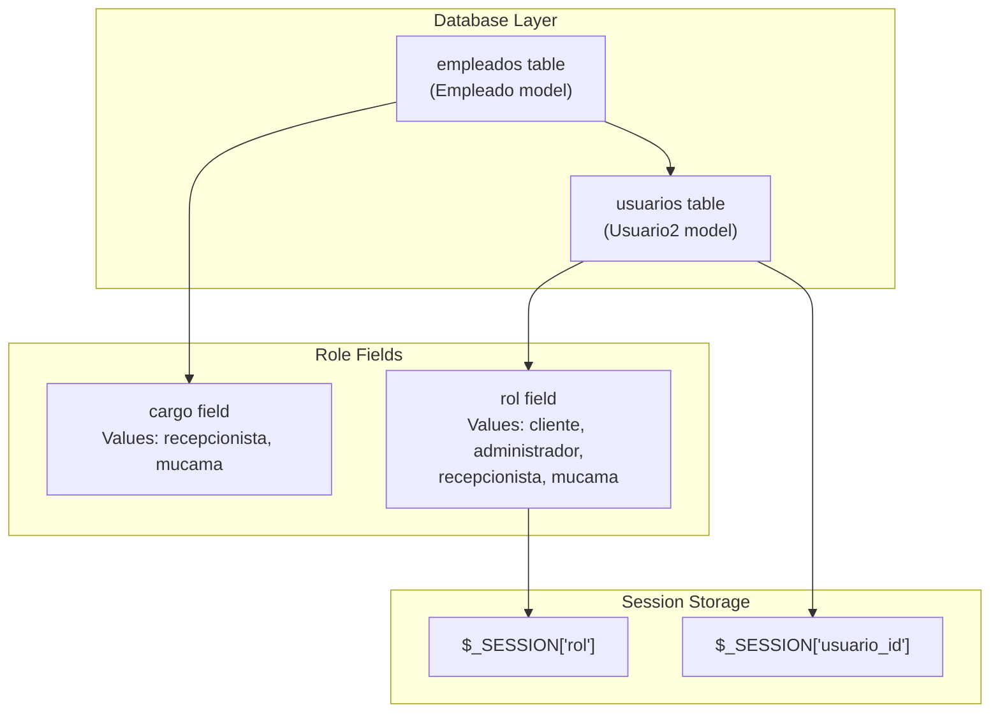
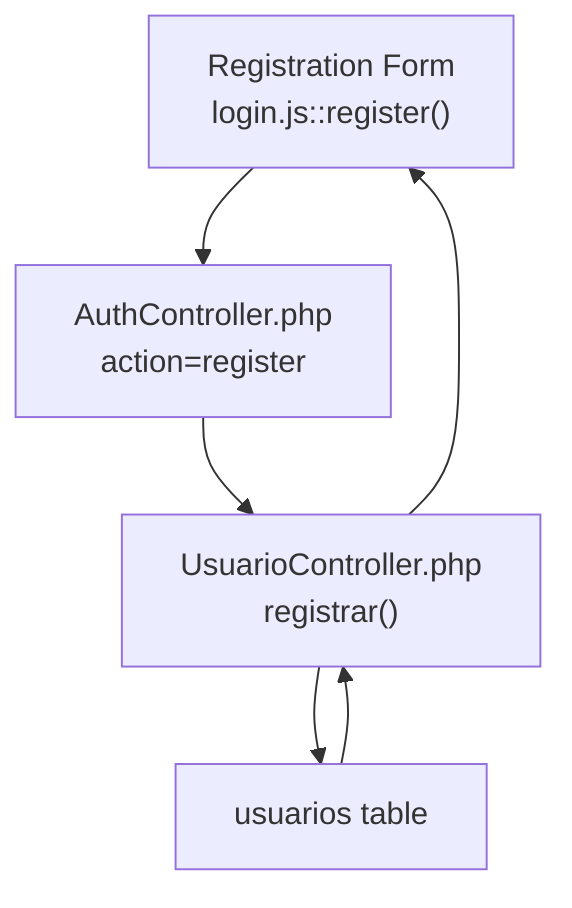
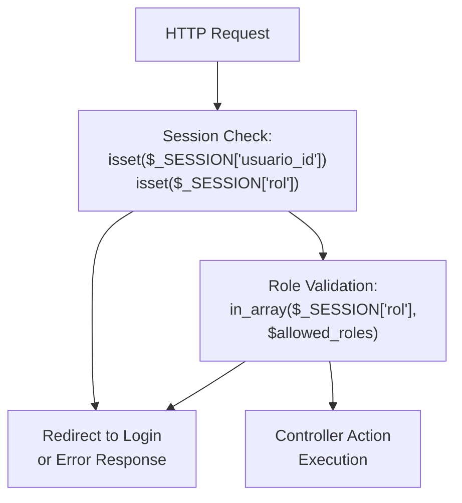
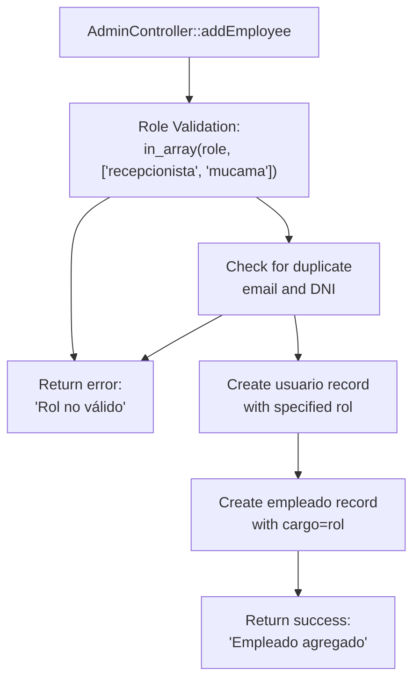
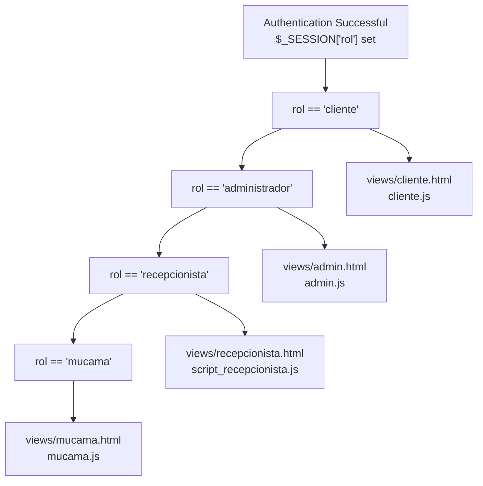

# User Roles and Access Control

> **Relevant source files**
> * [assets/js/login.js](https://github.com/GroveLive/hotelBenedetti/blob/ebdd0186/assets/js/login.js)
> * [controllers/AdminController.php](https://github.com/GroveLive/hotelBenedetti/blob/ebdd0186/controllers/AdminController.php)
> * [controllers/AuthController.php](https://github.com/GroveLive/hotelBenedetti/blob/ebdd0186/controllers/AuthController.php)
> * [controllers/ClienteController.php](https://github.com/GroveLive/hotelBenedetti/blob/ebdd0186/controllers/ClienteController.php)

## Purpose and Scope

This document describes the role-based access control (RBAC) system implemented in the Hotel Benedetti management platform. It explains how four distinct user roles (Cliente, Administrador, Recepcionista, Mucama) are defined, authenticated, and enforced throughout the application. This page covers the high-level role architecture, session-based authentication mechanism, and controller-level authorization patterns.

For detailed information about the authentication process including login/registration flows, see [Authentication System](/GroveLive/hotelBenedetti/3.1-authentication-system). For role-specific interface documentation, see [Administrator Interface](/GroveLive/hotelBenedetti/3.2-administrator-interface), [Receptionist Interface](/GroveLive/hotelBenedetti/3.3-receptionist-interface), [Maid Interface](/GroveLive/hotelBenedetti/3.4-maid-interface), and [Client Interface](/GroveLive/hotelBenedetti/3.5-client-interface).

---

## Role Definitions

The system implements four user roles, each with distinct responsibilities and access privileges:

| Role | Spanish Name | Primary Responsibilities | Database Value |
| --- | --- | --- | --- |
| Client | Cliente | Browse rooms, make bookings, view notifications | `cliente` |
| Administrator | Administrador | Manage employees, manage rooms, view dashboard | `administrador` |
| Receptionist | Recepcionista | Confirm reservations, check-in/check-out guests | `recepcionista` |
| Maid | Mucama | View cleaning notifications, mark rooms as cleaned | `mucama` |

The `rol` field in the `usuarios` table determines each user's access level. This field is set during user creation and stored in `$_SESSION['rol']` upon successful authentication.

**Sources:** [controllers/AuthController.php L32-L45](https://github.com/GroveLive/hotelBenedetti/blob/ebdd0186/controllers/AuthController.php#L32-L45)

 [controllers/AdminController.php L20-L35](https://github.com/GroveLive/hotelBenedetti/blob/ebdd0186/controllers/AdminController.php#L20-L35)

 [assets/js/login.js L8-L48](https://github.com/GroveLive/hotelBenedetti/blob/ebdd0186/assets/js/login.js#L8-L48)

---

## Role Storage and Data Model

**Role Storage Architecture**



The role architecture uses two database tables:

1. **`usuarios` table**: Contains the primary `rol` field for all users. During authentication, this value is retrieved and stored in `$_SESSION['rol']`.
2. **`empleados` table**: Contains a `cargo` field that duplicates the role information for employees (recepcionista, mucama). This table is linked to `usuarios` via `usuario_id` foreign key.

**Sources:** [controllers/AdminController.php L63-L79](https://github.com/GroveLive/hotelBenedetti/blob/ebdd0186/controllers/AdminController.php#L63-L79)

 [controllers/AuthController.php L41-L45](https://github.com/GroveLive/hotelBenedetti/blob/ebdd0186/controllers/AuthController.php#L41-L45)

---

## Authentication Flow with Role Determination

**Login Process with Role Selection**

```mermaid
sequenceDiagram
  participant User Browser
  participant login.js::login()
  participant AuthController.php
  participant UsuarioController.php::login()
  participant usuarios table
  participant $_SESSION

  User Browser->>login.js::login(): "Enter email, password, rol"
  login.js::login()->>login.js::login(): "Client-side validation
  login.js::login()->>AuthController.php: (email format, required fields)"
  AuthController.php->>UsuarioController.php::login(): "POST action=login
  UsuarioController.php::login()->>usuarios table: email, password, rol"
  usuarios table-->>UsuarioController.php::login(): "login(email, password, rol)"
  UsuarioController.php::login()->>UsuarioController.php::login(): "SELECT * FROM usuarios
  UsuarioController.php::login()->>$_SESSION: WHERE email=? AND rol=?"
  UsuarioController.php::login()-->>AuthController.php: "User record"
  AuthController.php-->>login.js::login(): "password_verify()"
  login.js::login()->>User Browser: "Store usuario_id, rol, nombre"
```

The login process enforces role-based routing:

1. **Client-side role selection**: The login form includes a `<select>` element for role selection at [assets/js/login.js L11](https://github.com/GroveLive/hotelBenedetti/blob/ebdd0186/assets/js/login.js#L11-L11)
2. **Server-side role validation**: `UsuarioController::login()` queries the database with both email and role: `WHERE email = :email AND rol = :rol`. This ensures users can only authenticate as their assigned role.
3. **Session initialization**: Upon successful authentication, `$_SESSION['rol']` is populated at [controllers/AuthController.php L42](https://github.com/GroveLive/hotelBenedetti/blob/ebdd0186/controllers/AuthController.php#L42-L42)
4. **Redirect determination**: The authentication response includes a role-specific redirect URL, routing users to their designated interface.

**Sources:** [assets/js/login.js L8-L48](https://github.com/GroveLive/hotelBenedetti/blob/ebdd0186/assets/js/login.js#L8-L48)

 [controllers/AuthController.php L30-L51](https://github.com/GroveLive/hotelBenedetti/blob/ebdd0186/controllers/AuthController.php#L30-L51)

---

## Registration and Role Assignment

**Registration Process for Clients**



The registration system automatically assigns the `cliente` role:

* At [controllers/AuthController.php L44](https://github.com/GroveLive/hotelBenedetti/blob/ebdd0186/controllers/AuthController.php#L44-L44)  the role is hardcoded: `$rol = "cliente";`
* Users registering through the public registration form can only create client accounts
* Employee accounts (recepcionista, mucama) must be created by administrators through `AdminController::addEmployee()`
* Administrator accounts cannot be created through the web interface

**Sources:** [assets/js/login.js L50-L115](https://github.com/GroveLive/hotelBenedetti/blob/ebdd0186/assets/js/login.js#L50-L115)

 [controllers/AuthController.php L43-L45](https://github.com/GroveLive/hotelBenedetti/blob/ebdd0186/controllers/AuthController.php#L43-L45)

---

## Controller-Level Access Enforcement

**Access Control Pattern in Controllers**



Controllers implement two-tier authorization:

### 1. Session Validation

All protected controllers verify session existence before processing requests. Example from `ClienteController`:

```
if (!isset($_SESSION['usuario_id']) || !in_array($_SESSION['rol'], ['recepcionista', 'administrador'])) {
    header("Location: index.php?c=usuario&a=login");
    exit();
}
```

**Sources:** [controllers/ClienteController.php L16-L20](https://github.com/GroveLive/hotelBenedetti/blob/ebdd0186/controllers/ClienteController.php#L16-L20)

### 2. Role-Specific Authorization

Different controllers allow different role combinations:

| Controller | Allowed Roles | Enforcement Location |
| --- | --- | --- |
| `AdminController` | administrador (implicit) | Session-based routing |
| `ClienteController` | recepcionista, administrador | [controllers/ClienteController.php L17](https://github.com/GroveLive/hotelBenedetti/blob/ebdd0186/controllers/ClienteController.php#L17-L17) |
| `CheckinController` | recepcionista | Implied by interface access |
| `CheckoutController` | recepcionista | Implied by interface access |
| `MucamaController` | mucama | Implied by interface access |

**Sources:** [controllers/ClienteController.php L15-L30](https://github.com/GroveLive/hotelBenedetti/blob/ebdd0186/controllers/ClienteController.php#L15-L30)

---

## Role-Based Action Restrictions

**Administrative Action Validation**



The `AdminController` enforces role restrictions on employee creation:

* **Allowed employee roles**: Only `recepcionista` and `mucama` can be created through the admin interface
* **Validation at**: [controllers/AdminController.php L29-L35](https://github.com/GroveLive/hotelBenedetti/blob/ebdd0186/controllers/AdminController.php#L29-L35)  and [controllers/AdminController.php L115-L121](https://github.com/GroveLive/hotelBenedetti/blob/ebdd0186/controllers/AdminController.php#L115-L121)
* **Restriction purpose**: Prevents administrators from creating additional administrator accounts or invalid role types

The validation check:

```javascript
if (!in_array($role, ['recepcionista', 'mucama'])) {
    echo json_encode([
        "success" => false,
        "message" => "Rol no válido. Solo se permiten recepcionistas y mucamas."
    ]);
    exit();
}
```

**Sources:** [controllers/AdminController.php L20-L103](https://github.com/GroveLive/hotelBenedetti/blob/ebdd0186/controllers/AdminController.php#L20-L103)

---

## Role-to-Interface Mapping

**Complete Role Access Matrix**

| Role | Interface File | JavaScript Controller | Primary Controllers | Dashboard Access |
| --- | --- | --- | --- | --- |
| cliente | `views/cliente.html` | `assets/js/cliente.js` | `ReservaController.php`, `NotificacionController.php` | No |
| administrador | `views/admin.html` | `assets/js/admin.js` | `AdminController.php` | Yes (statistics + charts) |
| recepcionista | `views/recepcionista.html` | `assets/js/script_recepcionista.js` | `CheckinController.php`, `CheckoutController.php`, `ReservaController.php` | No |
| mucama | `views/mucama.html` | `assets/js/mucama.js` | `MucamaController.php`, `NotificacionController.php` | No |

**Post-Authentication Routing**



Each role receives a dedicated interface with tailored functionality. The redirect URL is determined during authentication and returned in the JSON response.

**Sources:** [controllers/AuthController.php L41-L45](https://github.com/GroveLive/hotelBenedetti/blob/ebdd0186/controllers/AuthController.php#L41-L45)

---

## Session-Based State Management

The system maintains user state through PHP sessions:

**Session Variables**

| Variable | Type | Purpose | Set Location |
| --- | --- | --- | --- |
| `$_SESSION['usuario_id']` | int | Primary key of authenticated user | `UsuarioController::login()` |
| `$_SESSION['rol']` | string | User's role (cliente/administrador/etc) | `UsuarioController::login()` |
| `$_SESSION['nombre']` | string | User's first name for UI personalization | `UsuarioController::login()` |

**Session Lifecycle**

1. **Initialization**: `session_start()` called at [controllers/AuthController.php L2](https://github.com/GroveLive/hotelBenedetti/blob/ebdd0186/controllers/AuthController.php#L2-L2)
2. **Population**: Session variables set during successful authentication
3. **Validation**: Each controller checks `isset($_SESSION['usuario_id'])` before processing requests
4. **Destruction**: Session destroyed on logout (implementation not shown in provided files)

**Sources:** [controllers/AuthController.php L2](https://github.com/GroveLive/hotelBenedetti/blob/ebdd0186/controllers/AuthController.php#L2-L2)

 [controllers/AdminController.php L2](https://github.com/GroveLive/hotelBenedetti/blob/ebdd0186/controllers/AdminController.php#L2-L2)

 [controllers/ClienteController.php L16](https://github.com/GroveLive/hotelBenedetti/blob/ebdd0186/controllers/ClienteController.php#L16-L16)

---

## Security Considerations

The role-based access control system implements several security measures:

**1. Password Hashing**

Passwords are hashed using `PASSWORD_BCRYPT` before storage:

* At employee creation: [controllers/AdminController.php L26](https://github.com/GroveLive/hotelBenedetti/blob/ebdd0186/controllers/AdminController.php#L26-L26)
* At registration: `password_hash()` called in `UsuarioController::registrar()`
* At login: `password_verify()` used for validation

**2. Duplicate Prevention**

The system prevents duplicate accounts through email and DNI uniqueness checks:

* Email uniqueness: [controllers/AdminController.php L38-L48](https://github.com/GroveLive/hotelBenedetti/blob/ebdd0186/controllers/AdminController.php#L38-L48)
* DNI uniqueness: [controllers/AdminController.php L51-L61](https://github.com/GroveLive/hotelBenedetti/blob/ebdd0186/controllers/AdminController.php#L51-L61)

**3. Input Sanitization**

All user input is sanitized using `htmlspecialchars()` and `strip_tags()`:

* Example: [controllers/AdminController.php L21-L27](https://github.com/GroveLive/hotelBenedetti/blob/ebdd0186/controllers/AdminController.php#L21-L27)

**4. Role Immutability**

Cliente role is hardcoded during registration, preventing privilege escalation: [controllers/AuthController.php L44](https://github.com/GroveLive/hotelBenedetti/blob/ebdd0186/controllers/AuthController.php#L44-L44)

**Sources:** [controllers/AdminController.php L21-L61](https://github.com/GroveLive/hotelBenedetti/blob/ebdd0186/controllers/AdminController.php#L21-L61)

 [controllers/AuthController.php L44](https://github.com/GroveLive/hotelBenedetti/blob/ebdd0186/controllers/AuthController.php#L44-L44)

---

## Summary

The Hotel Benedetti system implements a straightforward role-based access control architecture:

* **Four roles** with distinct capabilities stored in the `usuarios.rol` field
* **Session-based authentication** with role stored in `$_SESSION['rol']`
* **Controller-level enforcement** through session and role validation
* **Restricted employee creation** limited to recepcionista and mucama roles
* **Role-specific interfaces** with dedicated HTML views and JavaScript controllers

This architecture ensures separation of concerns and implements the principle of least privilege, where each role accesses only the features necessary for their operational responsibilities.