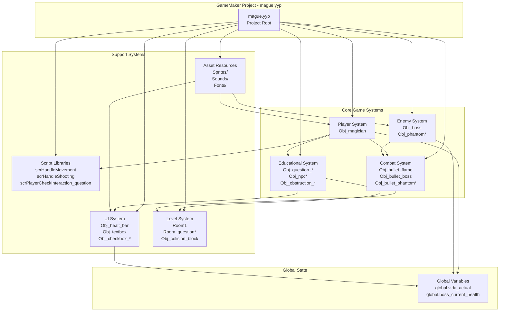
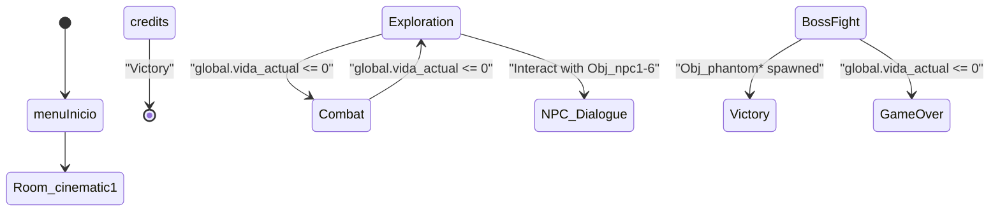
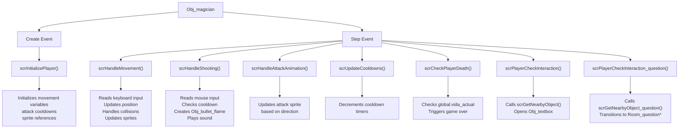
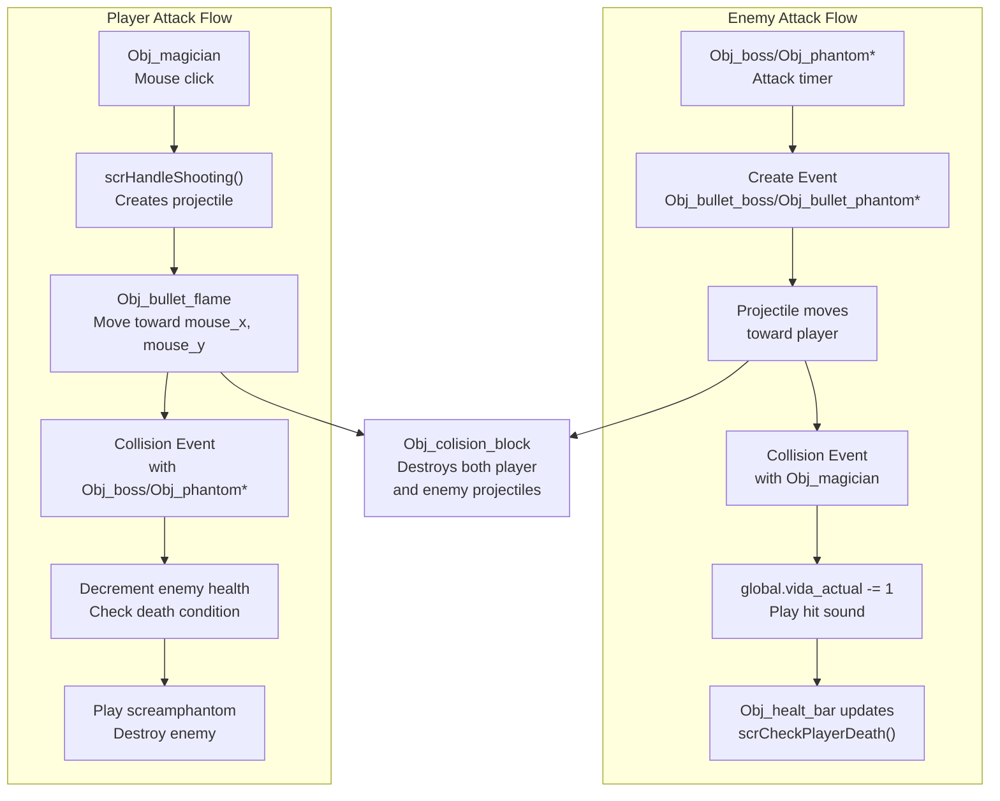
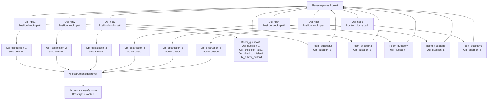

# Architecture Overview

> **Relevant source files**
> * [README.md](https://github.com/axchisan/Haunted_hollow/blob/96079758/README.md)
> * [magician project1/mague.yyp](https://github.com/axchisan/Haunted_hollow/blob/96079758/magician project1/mague.yyp)

## Purpose and Scope

This document provides a high-level overview of Haunted Hollow's system architecture, describing how the major game systems interact and how the codebase is organized. It covers the core game systems (player, combat, enemies, education), support systems (UI, levels, assets), and the overall game flow structure.

For detailed information about specific subsystems, see:

* [Game Flow and Progression](/axchisan/Haunted_hollow/3.1-game-flow-and-progression) - Room transitions and progression gating
* [Combat Architecture](/axchisan/Haunted_hollow/3.2-combat-architecture) - Player and enemy combat mechanics
* [Educational System Integration](/axchisan/Haunted_hollow/3.3-educational-system-integration) - Quiz system implementation

**Sources:** [README.md L1-L3](https://github.com/axchisan/Haunted_hollow/blob/96079758/README.md#L1-L3)

 [magician L1-L338](https://github.com/axchisan/Haunted_hollow/blob/96079758/magician project1/mague.yyp#L1-L338)

## System Architecture Overview

Haunted Hollow is built in GameMaker Studio 2 and organized into three primary architectural layers: core gameplay systems, support systems, and the underlying GameMaker resource structure.

**Diagram 1:** High-level system architecture showing major game systems and their dependencies

The architecture follows a modular design where gameplay logic is separated into discrete object types and reusable scripts. The `Obj_magician` player object delegates behavior to specialized scripts (`scrHandleMovement`, `scrHandleShooting`, `scrHandleAttackAnimation`, `scrCheckPlayerDeath`), enabling code reuse and maintainability.

**Sources:** [magician L17-L75](https://github.com/axchisan/Haunted_hollow/blob/96079758/magician project1/mague.yyp#L17-L75)

 [magician L86-L190](https://github.com/axchisan/Haunted_hollow/blob/96079758/magician project1/mague.yyp#L86-L190)

## Core Systems Summary

| System | Primary Objects | Key Scripts | Purpose |
| --- | --- | --- | --- |
| **Player** | `Obj_magician` | `scrInitializePlayer``scrHandleMovement``scrHandleShooting``scrHandleAttackAnimation``scrCheckPlayerDeath``scrUpdateCooldowns` | Manages player character, movement, shooting, and death |
| **Enemy** | `Obj_boss``Obj_phantom``Obj_phantom_green``Obj_phantom_red` | None (object events only) | Controls enemy AI, movement patterns, and spawning |
| **Combat** | `Obj_bullet_flame``Obj_bullet_boss``Obj_bullet_phantom``Obj_bullet_phantom_green``Obj_bullet_phantom_red` | None (collision events) | Handles projectile creation, movement, and damage application |
| **Education** | `Obj_question_1` through `Obj_question_6``Obj_npc0` through `Obj_npc6``Obj_obstruction_1` through `Obj_obstruction_6``Obj_checkbox_true*``Obj_checkbox_false*``Obj_submit_button*` | `scrPlayerCheckInteraction_question``scrGetNearbyObject_question``scrOpenTexbox``scrSplitText``scrSplitTextintoPages` | Implements English comprehension quiz system that gates progression |
| **UI** | `Obj_healt_bar``Obj_textbox``Obj_button_play``Obj_credits` | `scrFinishCharacterReading``scrFaceTo` | Displays health, dialogue, menus, and credits |
| **Level** | `Obj_colision_block``Obj_colision_block_1``Obj_collision_water``Obj_decorativo_parent``Obj_barrel_*``Obj_pillar_*``Obj_chest` | `scrGetNearbyObject``scrPlayerCheckInteraction``scrPlayerCheckReading` | Defines level geometry, collision, and interactive objects |

**Sources:** [magician L86-L160](https://github.com/axchisan/Haunted_hollow/blob/96079758/magician project1/mague.yyp#L86-L160)

 [magician L173-L190](https://github.com/axchisan/Haunted_hollow/blob/96079758/magician project1/mague.yyp#L173-L190)

## Game Flow Architecture

Haunted Hollow implements a hub-and-spoke progression model where `Room1` serves as the central hub connecting to six educational question rooms, with progression gated by NPC-triggered quizzes.

**Diagram 2:** Game flow state machine showing room transitions and progression conditions

**Sources:** [magician L320-L333](https://github.com/axchisan/Haunted_hollow/blob/96079758/magician project1/mague.yyp#L320-L333)

## Room Organization

The game's structure is defined by the room order in the GameMaker project:

| Room Name | Purpose | Key Objects |
| --- | --- | --- |
| `menuInicio` | Main menu screen | `Obj_button_play` |
| `Room_cinematic1` | Opening cinematic | `Obj_cinematic1` |
| `Room1` | Main gameplay hub | `Obj_magician`, `Obj_npc0-6`, `Obj_obstruction_1-6`, `Obj_phantom*` |
| `Room_question1` through `Room_question6` | Educational quiz rooms | `Obj_question_*`, `Obj_checkbox_true*`, `Obj_checkbox_false*`, `Obj_submit_button*` |
| `cinejefe` | Boss introduction cinematic | `Obj_cinejefe` |
| `jefe` | Boss battle arena | `Obj_boss`, `Obj_magician` |
| `credits` | End credits screen | `Obj_credits` |

**Sources:** [magician L161-L172](https://github.com/axchisan/Haunted_hollow/blob/96079758/magician project1/mague.yyp#L161-L172)

 [magician L320-L333](https://github.com/axchisan/Haunted_hollow/blob/96079758/magician project1/mague.yyp#L320-L333)

## System Organization in GameMaker Project

The `mague.yyp` project file defines a hierarchical folder structure for organizing assets:

```mermaid
flowchart TD

ROOT["mague.yyp"]
OBJECTS["Objects/"]
SCRIPTS["Scripts/"]
ROOMS["Rooms/"]
SPRITES["Sprites/"]
SOUNDS["sounds/"]
FONTS["Fonts/"]
OBJ_PLAYER["Player/<br>Obj_magician"]
OBJ_BOSS["Boss/<br>Obj_boss"]
OBJ_ENEMYS["enemys/<br>gray/, green/, red/"]
OBJ_HUD["Hud/<br>Obj_healt_bar, Obj_textbox"]
OBJ_LEVEL["Level/<br>questions/, npc/"]
OBJ_OBSTRUCT["obstrucciones/<br>Obj_obstruction_*"]
SCR_PLAYER["player/<br>scrHandleMovement<br>scrHandleShooting<br>scrCheckPlayerDeath"]
SCR_TEXTBOX["textbox/<br>scrOpenTexbox<br>scrSplitText"]
SCR_SYSTEM["system/<br>scrGamereset"]
ROOM_MAIN["Room1"]
ROOM_QUEST["Room_question1-6"]
ROOM_BOSS["jefe, cinejefe"]
SPR_PLAYER["Player/<br>down/, up/, left/, right/"]
SPR_ENEMY["enemys/<br>phantom/"]
SPR_LEVEL["Level/<br>questions/"]
SND_COMBAT["hit, fire, screamphantom"]
SND_MUSIC["music1, jefemusic"]
SND_FEEDBACK["correctanswer, Teleport"]
FNT_MED["fnt_medieval"]

ROOT --> OBJECTS
ROOT --> SCRIPTS
ROOT --> ROOMS
ROOT --> SPRITES
ROOT --> SOUNDS
ROOT --> FONTS
OBJECTS --> OBJ_PLAYER
OBJECTS --> OBJ_BOSS
OBJECTS --> OBJ_ENEMYS
OBJECTS --> OBJ_HUD
OBJECTS --> OBJ_LEVEL
OBJECTS --> OBJ_OBSTRUCT
SCRIPTS --> SCR_PLAYER
SCRIPTS --> SCR_TEXTBOX
SCRIPTS --> SCR_SYSTEM
ROOMS --> ROOM_MAIN
ROOMS --> ROOM_QUEST
ROOMS --> ROOM_BOSS
SPRITES --> SPR_PLAYER
SPRITES --> SPR_ENEMY
SPRITES --> SPR_LEVEL
SOUNDS --> SND_COMBAT
SOUNDS --> SND_MUSIC
SOUNDS --> SND_FEEDBACK
FONTS --> FNT_MED
```

**Diagram 3:** GameMaker project folder structure mapping concepts to code organization

**Sources:** [magician L12-L75](https://github.com/axchisan/Haunted_hollow/blob/96079758/magician project1/mague.yyp#L12-L75)

## Global State Management

The game uses global variables to share critical state across systems:

| Global Variable | Type | Purpose | Read By | Written By |
| --- | --- | --- | --- | --- |
| `global.vida_actual` | Integer | Player current health | `Obj_healt_bar``Obj_magician` (for death check) | `Obj_magician` (on damage)Enemy bullets (collision events) |
| `global.boss_current_health` | Integer | Boss current health | `Obj_boss` (for death check) | `Obj_boss` (initialization)`Obj_bullet_flame` (collision events) |

This global state pattern enables loose coupling between systems while maintaining a single source of truth for health values. However, it creates implicit dependencies that must be carefully managed.

**Sources:** Referenced in diagrams from high-level architecture overview

## Script-Based Behavior Decomposition

Player behavior is decomposed into specialized scripts that are called from `Obj_magician` events:

**Diagram 4:** Player script decomposition showing function call hierarchy from object events

This modular script architecture enables code reuse and simplifies testing. Each script has a single responsibility and can be modified independently.

**Sources:** [magician L173-L190](https://github.com/axchisan/Haunted_hollow/blob/96079758/magician project1/mague.yyp#L173-L190)

## Combat System Data Flow

Combat follows a symmetrical pattern where both player and enemies use projectile objects with collision-based damage:

**Diagram 5:** Combat data flow showing symmetrical attack patterns and collision handling

**Sources:** [magician L90-L95](https://github.com/axchisan/Haunted_hollow/blob/96079758/magician project1/mague.yyp#L90-L95)

## Educational Integration Architecture

The educational system is implemented through a gating mechanism where NPCs block progression until quizzes are completed:

**Diagram 6:** Educational system architecture showing NPC-obstruction-quiz relationships

Each quiz room contains an `Obj_question_*` object that displays the English comprehension challenge, `Obj_checkbox_true*` and `Obj_checkbox_false*` objects for answer selection, and an `Obj_submit_button*` that validates the answer. Correct answers trigger destruction of the corresponding `Obj_obstruction_*` instance in `Room1`, allowing progression.

**Sources:** [magician L97-L108](https://github.com/axchisan/Haunted_hollow/blob/96079758/magician project1/mague.yyp#L97-L108)

 [magician L121-L133](https://github.com/axchisan/Haunted_hollow/blob/96079758/magician project1/mague.yyp#L121-L133)

 [magician L146-L157](https://github.com/axchisan/Haunted_hollow/blob/96079758/magician project1/mague.yyp#L146-L157)

 [magician L166-L172](https://github.com/axchisan/Haunted_hollow/blob/96079758/magician project1/mague.yyp#L166-L172)

## Asset Pipeline

GameMaker organizes assets into typed folders that feed into the runtime engine:

| Asset Type | Folder | Examples | Consumed By |
| --- | --- | --- | --- |
| **Sprites** | `Sprites/` | `Spr_magician_walk_down``Spr_boss_left``Spr_bullet_flame` | Object sprite propertiesRendering engine |
| **Sounds** | `sounds/` | `music1`, `fire`, `hit``screamphantom``correctanswer` | `audio_play_sound()` callsAudio engine |
| **Fonts** | `Fonts/` | `fnt_medieval` (Bradley Hand ITC) | `draw_set_font()` callsText rendering |
| **Included Files** | `datafiles/` | `gothic-pixel-font.ttf` | GameMaker font system |
| **Scripts** | `Scripts/` | All `.gml` script files | Object event codeFunction calls |
| **Objects** | `Objects/` | All object definitions | Room instance creationGameplay logic |
| **Rooms** | `Rooms/` | All room definitions | Game flow transitions`room_goto()` calls |

**Sources:** [magician L77-L79](https://github.com/axchisan/Haunted_hollow/blob/96079758/magician project1/mague.yyp#L77-L79)

 [magician L191-L204](https://github.com/axchisan/Haunted_hollow/blob/96079758/magician project1/mague.yyp#L191-L204)

 [magician L205-L310](https://github.com/axchisan/Haunted_hollow/blob/96079758/magician project1/mague.yyp#L205-L310)

## Architectural Patterns

### Modular Script Decomposition

Player behavior is split into focused scripts (`scrHandleMovement`, `scrHandleShooting`) rather than monolithic object code, improving maintainability and testability.

### Symmetrical Combat Design

Both player and enemies follow identical projectile-collision-damage patterns, reducing code complexity and creating predictable gameplay.

### Hub-and-Spoke Level Design

`Room1` acts as a central hub with six spokes (question rooms), creating structured progression rather than linear or open-world exploration.

### Instance-Based Progression Gating

`Obj_obstruction_*` instances act as physical barriers that are destroyed when conditions are met, providing visual feedback for progression.

### Global State for Critical Values

Health values use global variables (`global.vida_actual`, `global.boss_current_health`) for cross-system access, though this creates implicit coupling.

**Sources:** [README.md L1-L3](https://github.com/axchisan/Haunted_hollow/blob/96079758/README.md#L1-L3)

 [magician L1-L338](https://github.com/axchisan/Haunted_hollow/blob/96079758/magician project1/mague.yyp#L1-L338)