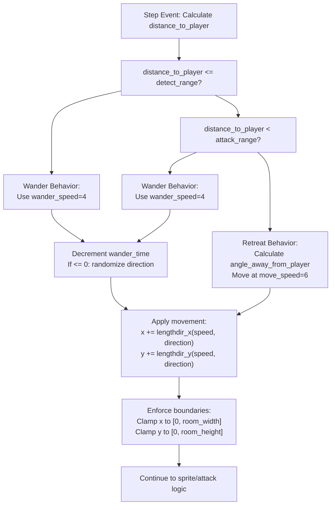
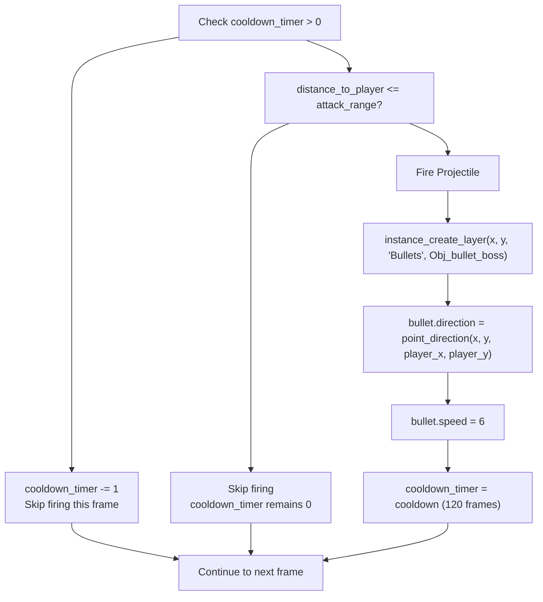
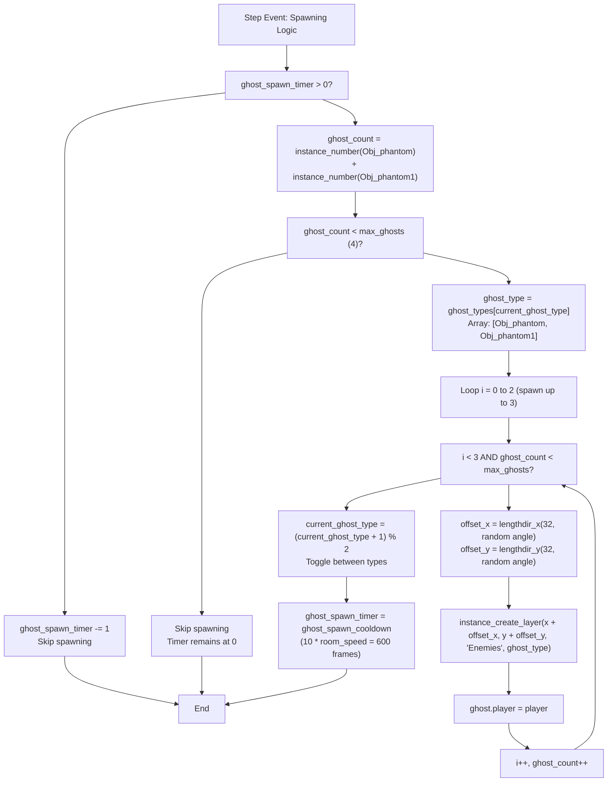

# Boss AI and Behavior

> **Relevant source files**
> * [magician project1/objects/Obj_boss/Create_0.gml](https://github.com/axchisan/Haunted_hollow/blob/96079758/magician project1/objects/Obj_boss/Create_0.gml)
> * [magician project1/objects/Obj_boss/Step_0.gml](https://github.com/axchisan/Haunted_hollow/blob/96079758/magician project1/objects/Obj_boss/Step_0.gml)

## Purpose and Scope

This document details the AI logic and behavioral patterns of the boss enemy (`Obj_boss`) in Haunted Hollow. The boss implements a distance-based state machine that governs movement, attack patterns, and minion spawning. This page covers the frame-by-frame decision-making process executed in the Step event, including player detection, retreat mechanics, wandering behavior, projectile firing, and periodic phantom spawning.

For information about the boss's initialization and properties, see [Boss Initialization](/axchisan/Haunted_hollow/4.2-boss-initialization). For details on the boss's projectile system, see [Boss Projectile System](/axchisan/Haunted_hollow/4.4-boss-projectile-system). For collision handling when the boss takes damage, see [Boss Collision Handling](/axchisan/Haunted_hollow/5.3-boss-collision-handling).

---

## AI State Overview

The boss AI operates as a distance-based state machine, making decisions each frame based on the player's proximity. The behavior is determined by comparing the distance to the player against two key thresholds: `detect_range` and `attack_range`.

### AI State Diagram

```

```

**Sources:**

* [magician L8-L38](https://github.com/axchisan/Haunted_hollow/blob/96079758/magician project1/objects/Obj_boss/Step_0.gml#L8-L38)

---

## Detection and Range Configuration

The boss uses three distance thresholds to determine its behavior state. These ranges are initialized during boss creation and remain constant throughout the encounter.

### Range Parameters

| Parameter | Value | Pixel Distance | Purpose |
| --- | --- | --- | --- |
| `detect_range` | `12 * 64` | 768 pixels | Maximum distance at which boss detects player |
| `attack_range` | `4 * 64` | 256 pixels | Distance within which boss enters combat mode |
| `move_speed` | `6` | 6 pixels/frame | Movement speed when retreating from player |
| `wander_speed` | `4` | 4 pixels/frame | Movement speed during wander behavior |

**Distance Calculation:**

The boss calculates its distance to the player every frame using the player's current position:

```
distance_to_player = point_distance(x, y, player_x, player_y)
```

This value is then compared against the range thresholds to determine the current AI state.

**Sources:**

* [magician L6-L9](https://github.com/axchisan/Haunted_hollow/blob/96079758/magician project1/objects/Obj_boss/Create_0.gml#L6-L9)
* [magician L4-L8](https://github.com/axchisan/Haunted_hollow/blob/96079758/magician project1/objects/Obj_boss/Step_0.gml#L4-L8)

---

## Movement Behavior System

The boss implements three distinct movement patterns based on player proximity, along with boundary enforcement to keep the boss within the room.

### Movement Decision Flowchart



**Sources:**

* [magician L11-L44](https://github.com/axchisan/Haunted_hollow/blob/96079758/magician project1/objects/Obj_boss/Step_0.gml#L11-L44)

### Retreat Behavior (Within Attack Range)

When the player enters the `attack_range` (256 pixels), the boss enters retreat mode to maintain distance. This creates a "kiting" pattern where the boss keeps the player at range while firing projectiles.

**Retreat Logic:**

1. Calculate angle pointing away from player: `angle_away_from_player = point_direction(player_x, player_y, x, y)`
2. Move at `move_speed` (6 pixels/frame) in that direction
3. Continue retreating until distance exceeds `attack_range`

**Sources:**

* [magician L12-L16](https://github.com/axchisan/Haunted_hollow/blob/96079758/magician project1/objects/Obj_boss/Step_0.gml#L12-L16)

### Wander Behavior

When the boss is either outside `detect_range` or within `detect_range` but outside `attack_range`, it enters wander mode. This creates unpredictable movement patterns.

**Wander Logic:**

1. Initialize with random direction: `wander_direction = irandom_range(0, 359)` degrees
2. Decrement `wander_time` each frame
3. When `wander_time <= 0`, randomize a new direction and reset timer to `irandom_range(30, 90)` frames
4. Move at `wander_speed` (4 pixels/frame) in current `wander_direction`

This results in the boss moving in straight lines for 0.5 to 1.5 seconds (at 60 FPS) before picking a new random direction.

**Sources:**

* [magician L9-L26](https://github.com/axchisan/Haunted_hollow/blob/96079758/magician project1/objects/Obj_boss/Create_0.gml#L9-L26)
* [magician L19-L37](https://github.com/axchisan/Haunted_hollow/blob/96079758/magician project1/objects/Obj_boss/Step_0.gml#L19-L37)

### Boundary Enforcement

After all movement calculations, the boss position is clamped to the room boundaries to prevent the boss from moving off-screen:

```
if (x < 0) x = 0;
if (x > room_width) x = room_width;
if (y < 0) y = 0;
if (y > room_height) y = room_height;
```

This ensures the boss remains within valid gameplay space regardless of movement direction.

**Sources:**

* [magician L41-L44](https://github.com/axchisan/Haunted_hollow/blob/96079758/magician project1/objects/Obj_boss/Step_0.gml#L41-L44)

---

## Attack Pattern and Projectile Firing

The boss fires projectiles at the player when within `attack_range`, using a cooldown-based firing system to control attack frequency.

### Attack System Components



**Sources:**

* [magician L64-L71](https://github.com/axchisan/Haunted_hollow/blob/96079758/magician project1/objects/Obj_boss/Step_0.gml#L64-L71)

### Attack Timing Parameters

| Parameter | Value | Duration (60 FPS) | Purpose |
| --- | --- | --- | --- |
| `cooldown` | `120` | 2 seconds | Time between consecutive shots |
| `cooldown_timer` | Decrements from 120 to 0 | Variable | Current cooldown state |
| `bullet.speed` | `6` | 6 pixels/frame | Projectile velocity |

**Firing Sequence:**

1. **Cooldown Check:** Each frame, if `cooldown_timer > 0`, decrement it and skip firing
2. **Range Check:** Only fire if `distance_to_player <= attack_range` (256 pixels) and cooldown is zero
3. **Bullet Creation:** Create `Obj_bullet_boss` at boss position on the "Bullets" layer
4. **Targeting:** Calculate direction from boss to player's current position
5. **Launch:** Set bullet direction and speed (6 pixels/frame toward player)
6. **Cooldown Reset:** Set `cooldown_timer = 120` to enforce 2-second delay before next shot

This creates a predictable firing pattern where the boss shoots every 2 seconds when the player is within attack range, giving players windows to dodge.

**Sources:**

* [magician L15-L16](https://github.com/axchisan/Haunted_hollow/blob/96079758/magician project1/objects/Obj_boss/Create_0.gml#L15-L16)
* [magician L64-L71](https://github.com/axchisan/Haunted_hollow/blob/96079758/magician project1/objects/Obj_boss/Step_0.gml#L64-L71)

---

## Minion Spawning System

The boss periodically spawns phantom minions to assist in combat. This system alternates between two phantom types and enforces a maximum minion count to prevent overwhelming the player.

### Spawning Mechanics Diagram



**Sources:**

* [magician L74-L92](https://github.com/axchisan/Haunted_hollow/blob/96079758/magician project1/objects/Obj_boss/Step_0.gml#L74-L92)

### Spawning Parameters

| Parameter | Value | Meaning |
| --- | --- | --- |
| `ghost_spawn_cooldown` | `10 * room_speed` | 600 frames (10 seconds at 60 FPS) |
| `ghost_spawn_timer` | Decrements from 600 to 0 | Current spawn cooldown |
| `max_ghosts` | `4` | Maximum concurrent minions |
| `ghost_types` | `[Obj_phantom, Obj_phantom1]` | Array of phantom types to spawn |
| `current_ghost_type` | `0` or `1` | Index into ghost_types array |
| Spawn count per cycle | Up to `3` | Number of ghosts spawned when timer expires |
| Spawn offset | `32` pixels | Distance from boss center |

**Sources:**

* [magician L19-L33](https://github.com/axchisan/Haunted_hollow/blob/96079758/magician project1/objects/Obj_boss/Create_0.gml#L19-L33)
* [magician L74-L92](https://github.com/axchisan/Haunted_hollow/blob/96079758/magician project1/objects/Obj_boss/Step_0.gml#L74-L92)

### Spawning Process

**1. Timer Management:**

* Every frame, decrement `ghost_spawn_timer` if it's greater than 0
* When timer reaches 0, proceed to spawn check

**2. Population Check:**

* Count existing minions: `ghost_count = instance_number(Obj_phantom) + instance_number(Obj_phantom1)`
* Only spawn if `ghost_count < max_ghosts` (4)

**3. Batch Spawning:**

* Select current ghost type from array: `ghost_types[current_ghost_type]`
* Attempt to spawn up to 3 ghosts in a single cycle
* For each spawn: * Generate random angle: `irandom_range(0, 359)` degrees * Calculate offset position 32 pixels from boss center * Create ghost at offset position on "Enemies" layer * Assign player reference to ghost: `ghost.player = player` * Check if max_ghosts limit reached, break loop if so

**4. Type Rotation:**

* After spawning cycle, toggle ghost type: `current_ghost_type = (current_ghost_type + 1) % 2`
* This alternates between `Obj_phantom` (index 0) and `Obj_phantom1` (index 1)
* Reset `ghost_spawn_timer = ghost_spawn_cooldown` (600 frames)

This creates a pattern where every 10 seconds, the boss spawns 3 minions (or fewer if approaching the 4-minion limit), alternating between two phantom types.

**Sources:**

* [magician L74-L92](https://github.com/axchisan/Haunted_hollow/blob/96079758/magician project1/objects/Obj_boss/Step_0.gml#L74-L92)

---

## Sprite Direction Management

The boss sprite updates each frame to face the player, providing visual feedback about the boss's awareness and orientation.

### Direction Logic

The sprite selection uses a priority system based on the relative position between boss and player:

**Algorithm:**

1. Calculate horizontal and vertical distances: `abs(player_x - x)` and `abs(player_y - y)`
2. If horizontal distance > vertical distance, use horizontal sprites: * If `player_x > x`: Use `Spr_boss_right` * Else: Use `Spr_boss_left`
3. Else, use vertical sprites: * If `player_y > y`: Use `Spr_boss_down` * Else: Use `Spr_boss_up`

This ensures the boss always displays the sprite corresponding to the dominant axis of separation from the player.

### Sprite Assignment Table

| Condition | Sprite | Visual Result |
| --- | --- | --- |
| Player is primarily to the right | `Spr_boss_right` | Boss faces right |
| Player is primarily to the left | `Spr_boss_left` | Boss faces left |
| Player is primarily below | `Spr_boss_down` | Boss faces down |
| Player is primarily above | `Spr_boss_up` | Boss faces up |

**Sources:**

* [magician L47-L61](https://github.com/axchisan/Haunted_hollow/blob/96079758/magician project1/objects/Obj_boss/Step_0.gml#L47-L61)

---

## Health Synchronization

At the start of each Step event, the boss synchronizes its local health (`healtha`) to the global health variable:

```
global.boss_current_health = healtha;
```

This allows other systems (such as the health bar UI and player projectile collision handlers) to read and update the boss's health through the global variable. The boss's health is decremented when player projectiles collide with it (handled in player projectile collision events, documented in [Boss Collision Handling](/axchisan/Haunted_hollow/5.3-boss-collision-handling)).

**Sources:**

* [magician L2](https://github.com/axchisan/Haunted_hollow/blob/96079758/magician project1/objects/Obj_boss/Step_0.gml#L2-L2)
* [magician L2-L13](https://github.com/axchisan/Haunted_hollow/blob/96079758/magician project1/objects/Obj_boss/Create_0.gml#L2-L13)

---

## Summary of AI Behavior

The boss AI executes the following sequence each frame:

1. **Health Sync:** Update `global.boss_current_health` from local `healtha`
2. **Distance Check:** Calculate distance to player
3. **Movement:** Execute retreat or wander behavior based on distance thresholds
4. **Boundary Enforcement:** Clamp position to room bounds
5. **Sprite Update:** Set appropriate directional sprite based on player position
6. **Attack Check:** Fire projectile if within attack range and cooldown expired
7. **Spawn Check:** Spawn up to 3 phantom minions every 10 seconds if under max count

This creates a boss encounter where the player must manage multiple threats: dodging boss projectiles, dealing with spawned phantoms, and maintaining pursuit as the boss retreats while staying within attack range.

**Sources:**

* [magician L1-L93](https://github.com/axchisan/Haunted_hollow/blob/96079758/magician project1/objects/Obj_boss/Step_0.gml#L1-L93)