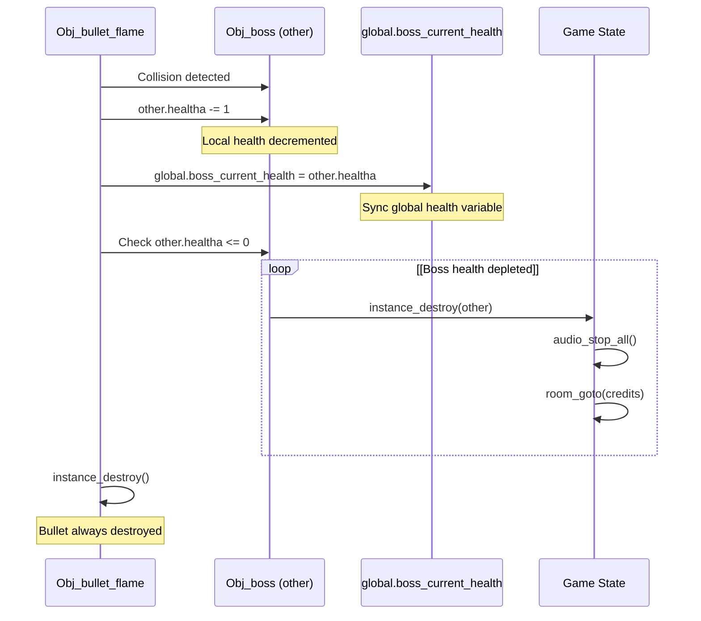
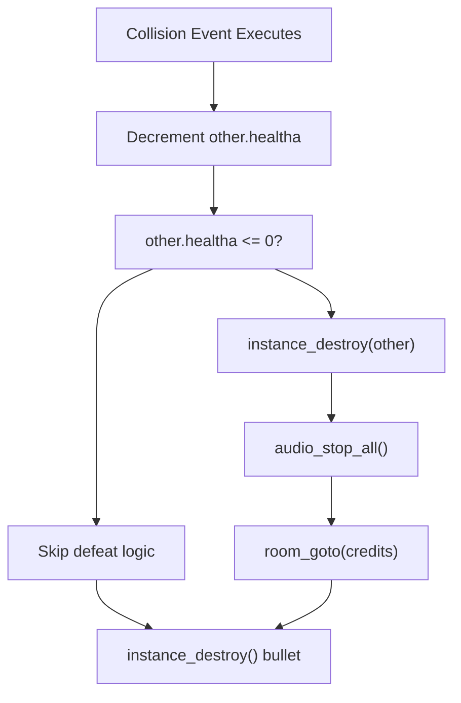
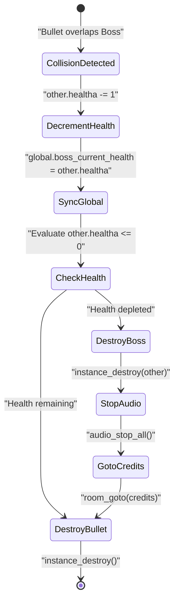

# Boss Collision Handling

> **Relevant source files**
> * [magician project1/objects/Obj_bullet_flame/Collision_Obj_boss.gml](https://github.com/axchisan/Haunted_hollow/blob/96079758/magician project1/objects/Obj_bullet_flame/Collision_Obj_boss.gml)
> * [magician project1/objects/Obj_bullet_flame/Step_0.gml](https://github.com/axchisan/Haunted_hollow/blob/96079758/magician project1/objects/Obj_bullet_flame/Step_0.gml)

## Purpose and Scope

This document details the collision detection and damage application logic between player projectiles (`Obj_bullet_flame`) and the boss enemy (`Obj_boss`). It covers the damage calculation, health tracking, boss defeat sequence, and post-collision cleanup. For information about player projectile creation and movement, see [Projectile Initialization and Movement](/axchisan/Haunted_hollow/5.2-projectile-initialization-and-movement). For boss health initialization and properties, see [Boss Initialization](/axchisan/Haunted_hollow/4.2-boss-initialization). For collision handling with other enemy types, see [Phantom Enemy Collisions](/axchisan/Haunted_hollow/5.4-phantom-enemy-collisions).

## Collision Event Structure

GameMaker Studio 2 implements collision handling through dedicated collision events attached to objects. The `Obj_bullet_flame` object contains a collision event specifically for detecting impacts with `Obj_boss`. When a bullet instance enters the same position as a boss instance, GameMaker automatically triggers this event.

The collision event is defined in [magician L1-L13](https://github.com/axchisan/Haunted_hollow/blob/96079758/magician project1/objects/Obj_bullet_flame/Collision_Obj_boss.gml#L1-L13)

**Collision Event Registration**

```

```

**Sources:** [magician L1-L13](https://github.com/axchisan/Haunted_hollow/blob/96079758/magician project1/objects/Obj_bullet_flame/Collision_Obj_boss.gml#L1-L13)

## Damage Application Mechanics

When collision is detected, the system applies damage to the boss and updates global health tracking. The damage model is straightforward: each bullet impact reduces boss health by exactly 1 point.

### Damage Calculation Flow



**Sources:** [magician L2-L12](https://github.com/axchisan/Haunted_hollow/blob/96079758/magician project1/objects/Obj_bullet_flame/Collision_Obj_boss.gml#L2-L12)

### Health Variable Management

The collision handler maintains two health values that must remain synchronized:

| Variable | Scope | Location | Purpose |
| --- | --- | --- | --- |
| `other.healtha` | Instance | Boss object | Local health counter for the specific boss instance |
| `global.boss_current_health` | Global | Game-wide | Accessible health value for UI and other systems |

The synchronization occurs at [magician L3](https://github.com/axchisan/Haunted_hollow/blob/96079758/magician project1/objects/Obj_bullet_flame/Collision_Obj_boss.gml#L3-L3)

 ensuring that UI elements (such as boss health bars) can access current health status without directly querying the boss instance.

**Sources:** [magician L2-L3](https://github.com/axchisan/Haunted_hollow/blob/96079758/magician project1/objects/Obj_bullet_flame/Collision_Obj_boss.gml#L2-L3)

## Boss Defeat Sequence

When the boss's health is reduced to zero or below, the collision handler triggers a three-step victory sequence that transitions the player from combat to the game's ending.

### Defeat Detection and Response



**Sources:** [magician L5-L10](https://github.com/axchisan/Haunted_hollow/blob/96079758/magician project1/objects/Obj_bullet_flame/Collision_Obj_boss.gml#L5-L10)

### Defeat Sequence Steps

The defeat logic executes three operations in sequence:

1. **Boss Destruction** - [magician L7](https://github.com/axchisan/Haunted_hollow/blob/96079758/magician project1/objects/Obj_bullet_flame/Collision_Obj_boss.gml#L7-L7) * Calls `instance_destroy(other)` where `other` references the `Obj_boss` instance * Removes the boss from the game world immediately * Prevents further boss AI execution and rendering
2. **Audio Cleanup** - [magician L8](https://github.com/axchisan/Haunted_hollow/blob/96079758/magician project1/objects/Obj_bullet_flame/Collision_Obj_boss.gml#L8-L8) * Calls `audio_stop_all()` to silence all playing audio * Stops background music, combat sound effects, and any looping audio * Prepares audio context for credits room music
3. **Room Transition** - [magician L9](https://github.com/axchisan/Haunted_hollow/blob/96079758/magician project1/objects/Obj_bullet_flame/Collision_Obj_boss.gml#L9-L9) * Calls `room_goto(credits)` to transition to the credits room * Ends the boss fight sequence * Begins end-game content display

**Sources:** [magician L5-L10](https://github.com/axchisan/Haunted_hollow/blob/96079758/magician project1/objects/Obj_bullet_flame/Collision_Obj_boss.gml#L5-L10)

## Bullet Lifecycle on Collision

Regardless of whether the boss is defeated, the colliding bullet instance is always destroyed after executing the collision logic. This prevents bullets from persisting after impact and applying damage multiple times.

### Destruction Guarantee

The bullet destruction occurs at [magician L12](https://github.com/axchisan/Haunted_hollow/blob/96079758/magician project1/objects/Obj_bullet_flame/Collision_Obj_boss.gml#L12-L12)

 through `instance_destroy()`. This call:

* Removes the bullet instance from the game world
* Prevents further collision checks involving this bullet
* Frees memory associated with the bullet object
* Occurs after all damage and defeat logic completes

### Collision vs. Environment Destruction

The bullet destruction mechanism differs from environment collision handling:

| Collision Type | Code Location | Timing | Additional Effects |
| --- | --- | --- | --- |
| Boss Collision | Collision_Obj_boss.gml:12 | After damage application | May trigger boss defeat sequence |
| Block Collision | Step_0.gml:11 | During movement check | None - immediate destruction |
| Room Boundary | Step_0.gml:15-16 | When outside room bounds | None - boundary cleanup |

**Sources:** [magician L12](https://github.com/axchisan/Haunted_hollow/blob/96079758/magician project1/objects/Obj_bullet_flame/Collision_Obj_boss.gml#L12-L12)

 [magician L10-L16](https://github.com/axchisan/Haunted_hollow/blob/96079758/magician project1/objects/Obj_bullet_flame/Step_0.gml#L10-L16)

## Complete Collision Logic

The full collision event combines all components into a single atomic operation:



**Sources:** [magician L1-L13](https://github.com/axchisan/Haunted_hollow/blob/96079758/magician project1/objects/Obj_bullet_flame/Collision_Obj_boss.gml#L1-L13)

## Implementation Details

### Code Entity Mapping

| Natural Language Concept | Code Entity | Location |
| --- | --- | --- |
| Player bullet | `Obj_bullet_flame` | Object definition |
| Boss enemy | `Obj_boss` | Referenced as `other` in collision |
| Boss local health | `other.healtha` | Boss instance variable |
| Boss global health | `global.boss_current_health` | Global variable |
| Boss destroyed | `instance_destroy(other)` | GameMaker function |
| Audio stopped | `audio_stop_all()` | GameMaker function |
| Victory transition | `room_goto(credits)` | Room transition function |
| Bullet destroyed | `instance_destroy()` | GameMaker function |

### Execution Context

Within the collision event, GameMaker provides two implicit references:

* `self` or implicit reference: The `Obj_bullet_flame` instance that collided
* `other`: The `Obj_boss` instance that was hit

This allows direct access to boss properties through `other.healtha` without requiring manual instance lookups.

**Sources:** [magician L1-L13](https://github.com/axchisan/Haunted_hollow/blob/96079758/magician project1/objects/Obj_bullet_flame/Collision_Obj_boss.gml#L1-L13)