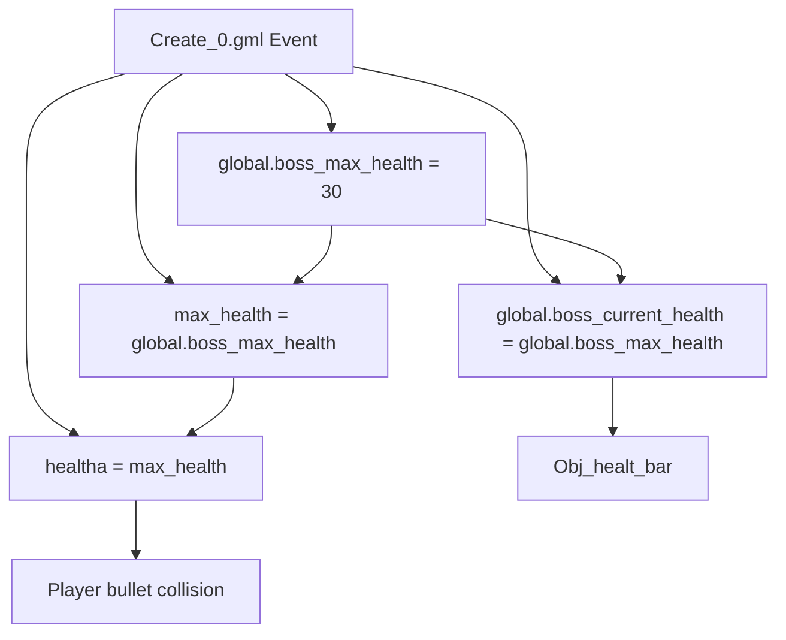
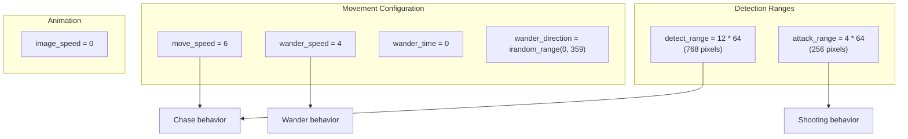
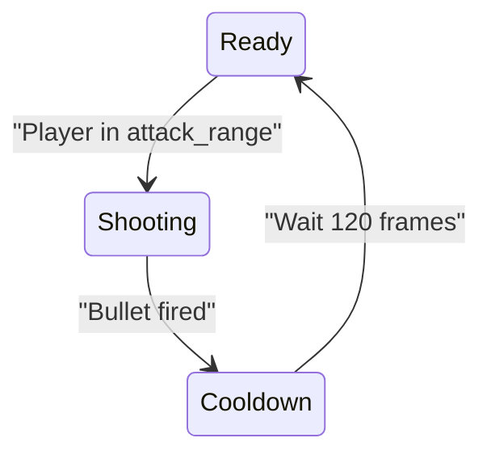
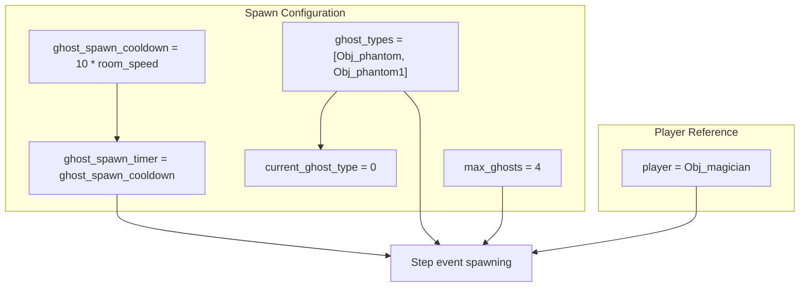
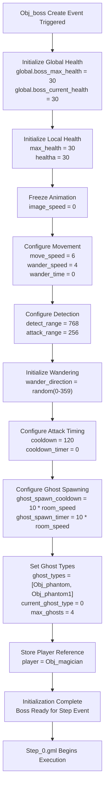
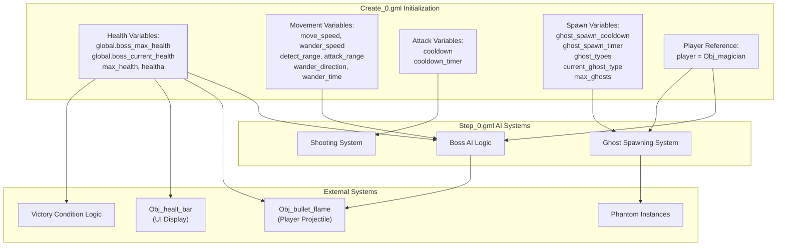

# Boss Initialization

> **Relevant source files**
> * [magician project1/objects/Obj_boss/Create_0.gml](https://github.com/axchisan/Haunted_hollow/blob/96079758/magician project1/objects/Obj_boss/Create_0.gml)
> * [magician project1/objects/Obj_boss/Obj_boss.yy](https://github.com/axchisan/Haunted_hollow/blob/96079758/magician project1/objects/Obj_boss/Obj_boss.yy)

## Purpose and Scope

This document describes the initialization logic executed when `Obj_boss` is created during the boss fight sequence. It covers the setup of health systems, movement parameters, attack timing, and minion spawning configuration that occurs in the Create event. For information about the boss's runtime behavior and AI logic, see [Boss AI and Behavior](/axchisan/Haunted_hollow/4.3-boss-ai-and-behavior). For the boss object structure and event definitions, see [Boss Object Definition](/axchisan/Haunted_hollow/4.1-boss-object-definition).

**Sources**: [magician L1-L34](https://github.com/axchisan/Haunted_hollow/blob/96079758/magician project1/objects/Obj_boss/Create_0.gml#L1-L34)

---

## Initialization Overview

The boss initialization occurs in the Create event (`Create_0.gml`) when the `Obj_boss` instance is spawned in the boss room. This single-pass setup establishes all state variables required for the boss's AI systems, including health tracking, movement behavior, attack patterns, and phantom minion spawning mechanics. The initialization does not execute any game logic—it only configures initial values.

**Sources**: [magician L1-L34](https://github.com/axchisan/Haunted_hollow/blob/96079758/magician project1/objects/Obj_boss/Create_0.gml#L1-L34)

---

## Health System Configuration

The boss uses a dual health tracking system: global variables accessible by other game systems (UI, victory conditions) and local instance variables for damage calculation.

**Health Variables**

| Variable | Initial Value | Scope | Purpose |
| --- | --- | --- | --- |
| `global.boss_max_health` | `30` | Global | Maximum health value accessible by UI systems |
| `global.boss_current_health` | `30` | Global | Current health accessible by victory condition checks |
| `max_health` | `30` | Instance | Local maximum health reference |
| `healtha` | `30` | Instance | Actual current health used for damage calculations |

The boss starts at full health (30 hit points). Global variables enable the health bar UI and room transition logic to access boss health state without direct instance references.

**Sources**: [magician L2-L3](https://github.com/axchisan/Haunted_hollow/blob/96079758/magician project1/objects/Obj_boss/Create_0.gml#L2-L3)

 [magician L12-L13](https://github.com/axchisan/Haunted_hollow/blob/96079758/magician project1/objects/Obj_boss/Create_0.gml#L12-L13)

---

## Movement and Detection Parameters

The boss requires several spatial parameters to control its AI behavior, including detection ranges, movement speeds, and wandering patterns.

**Movement Variable Table**

| Variable | Value | Unit | Purpose |
| --- | --- | --- | --- |
| `move_speed` | `6` | pixels/frame | Speed when chasing player |
| `wander_speed` | `4` | pixels/frame | Speed during idle wandering |
| `detect_range` | `768` | pixels (12 * 64) | Distance at which boss detects player |
| `attack_range` | `256` | pixels (4 * 64) | Distance at which boss starts shooting |
| `wander_time` | `0` | frames | Counter for wander state duration |
| `wander_direction` | `0-359` | degrees | Random initial direction for wandering |
| `image_speed` | `0` | — | Freezes sprite animation |

The `detect_range` of 768 pixels (12 tiles) determines when the boss transitions from wandering to chasing. The smaller `attack_range` of 256 pixels (4 tiles) defines when shooting begins. The boss moves faster when chasing (`move_speed = 6`) than wandering (`wander_speed = 4`), creating aggressive pursuit behavior.

**Sources**: [magician L5-L10](https://github.com/axchisan/Haunted_hollow/blob/96079758/magician project1/objects/Obj_boss/Create_0.gml#L5-L10)

 [magician L26](https://github.com/axchisan/Haunted_hollow/blob/96079758/magician project1/objects/Obj_boss/Create_0.gml#L26-L26)

---

## Attack Configuration

The boss uses a cooldown-based attack system to regulate projectile firing frequency.

**Attack Timing Variables**

| Variable | Initial Value | Unit | Purpose |
| --- | --- | --- | --- |
| `cooldown` | `120` | frames | Time between attacks (2 seconds at 60 FPS) |
| `cooldown_timer` | `0` | frames | Current cooldown counter |

The `cooldown` value of 120 frames creates a 2-second interval between projectiles (assuming 60 FPS). The `cooldown_timer` starts at 0 and must reach `cooldown` before the boss can fire. This prevents continuous bullet spam and creates tactical windows for player counterattacks.

**Sources**: [magician L15-L16](https://github.com/axchisan/Haunted_hollow/blob/96079758/magician project1/objects/Obj_boss/Create_0.gml#L15-L16)

---

## Ghost Spawning Configuration

The boss periodically spawns phantom minions during combat. The initialization sets up spawn timing, minion types, and population limits.

**Ghost Spawning Variables**

| Variable | Initial Value | Type | Purpose |
| --- | --- | --- | --- |
| `ghost_spawn_cooldown` | `10 * room_speed` | frames | Time between spawn attempts |
| `ghost_spawn_timer` | `10 * room_speed` | frames | Current spawn timer (starts ready) |
| `ghost_types` | `[Obj_phantom, Obj_phantom1]` | array | Phantom types to spawn |
| `current_ghost_type` | `0` | index | Tracks which type to spawn next |
| `max_ghosts` | `4` | count | Maximum simultaneous phantoms |
| `player` | `Obj_magician` | object reference | Target for phantom AI |

The `ghost_spawn_cooldown` of `10 * room_speed` creates a 10-second interval (at 60 FPS, this equals 600 frames). The `ghost_spawn_timer` initializes to this value, meaning the boss is ready to spawn immediately. The `ghost_types` array contains two phantom variants (`Obj_phantom` and `Obj_phantom1`), selected alternately via `current_ghost_type`. The `max_ghosts` limit prevents overwhelming the player with minions.

**Sources**: [magician L19-L20](https://github.com/axchisan/Haunted_hollow/blob/96079758/magician project1/objects/Obj_boss/Create_0.gml#L19-L20)

 [magician L23](https://github.com/axchisan/Haunted_hollow/blob/96079758/magician project1/objects/Obj_boss/Create_0.gml#L23-L23)

 [magician L28-L29](https://github.com/axchisan/Haunted_hollow/blob/96079758/magician project1/objects/Obj_boss/Create_0.gml#L28-L29)

 [magician L33](https://github.com/axchisan/Haunted_hollow/blob/96079758/magician project1/objects/Obj_boss/Create_0.gml#L33-L33)

---

## Complete Variable Reference

The following table documents all variables initialized in `Create_0.gml`:

| Category | Variable Name | Initial Value | Data Type | Usage Context |
| --- | --- | --- | --- | --- |
| **Health** | `global.boss_max_health` | `30` | integer | UI, victory conditions |
| **Health** | `global.boss_current_health` | `30` | integer | UI, victory conditions |
| **Health** | `max_health` | `30` | integer | Local health reference |
| **Health** | `healtha` | `30` | integer | Collision damage calculations |
| **Animation** | `image_speed` | `0` | real | Sprite animation control |
| **Movement** | `move_speed` | `6` | integer | Chase state speed |
| **Movement** | `wander_speed` | `4` | integer | Idle state speed |
| **Movement** | `wander_time` | `0` | integer | Wander duration counter |
| **Movement** | `wander_direction` | `0-359` (random) | integer | Initial wander angle |
| **Detection** | `detect_range` | `768` (12 * 64) | integer | Player detection radius |
| **Detection** | `attack_range` | `256` (4 * 64) | integer | Attack initiation radius |
| **Attack** | `cooldown` | `120` | integer | Frames between projectiles |
| **Attack** | `cooldown_timer` | `0` | integer | Current cooldown state |
| **Spawning** | `ghost_spawn_cooldown` | `10 * room_speed` | integer | Frames between spawns |
| **Spawning** | `ghost_spawn_timer` | `10 * room_speed` | integer | Current spawn timer |
| **Spawning** | `ghost_types` | `[Obj_phantom, Obj_phantom1]` | array | Phantom object types |
| **Spawning** | `current_ghost_type` | `0` | integer | Array index tracker |
| **Spawning** | `max_ghosts` | `4` | integer | Population limit |
| **Reference** | `player` | `Obj_magician` | object | Player instance reference |

**Sources**: [magician L1-L34](https://github.com/axchisan/Haunted_hollow/blob/96079758/magician project1/objects/Obj_boss/Create_0.gml#L1-L34)

---

## Initialization Flow Diagram

**Execution Order**: The Create event executes once when the boss instance spawns. Variables initialize in sequential order from line 2 to line 33. No conditional logic exists—all variables always initialize with these exact values. After completion, the Step event (`Step_0.gml`) begins executing every frame, using these initialized values to drive boss behavior.

**Sources**: [magician L1-L34](https://github.com/axchisan/Haunted_hollow/blob/96079758/magician project1/objects/Obj_boss/Create_0.gml#L1-L34)

---

## Variable Dependencies and System Integration

**System Integration Points**:

* **Health System**: `global.boss_current_health` is read by `Obj_healt_bar` for UI display and by room transition logic to detect boss defeat
* **Movement System**: `detect_range` and `attack_range` are used in `Step_0.gml` to calculate distance to player and determine AI state
* **Attack System**: `cooldown_timer` decrements in `Step_0.gml` and triggers `Obj_bullet_boss` creation when reaching zero
* **Spawn System**: `ghost_spawn_timer` decrements in `Step_0.gml` and creates phantom instances when depleted
* **Player Reference**: The `player` variable is used for distance calculations, targeting, and passing to spawned phantoms

**Sources**: [magician L1-L34](https://github.com/axchisan/Haunted_hollow/blob/96079758/magician project1/objects/Obj_boss/Create_0.gml#L1-L34)

 [magician L1-L39](https://github.com/axchisan/Haunted_hollow/blob/96079758/magician project1/objects/Obj_boss/Obj_boss.yy#L1-L39)

---

## Related Systems

For information about how these initialized variables are used during gameplay, see [Boss AI and Behavior](/axchisan/Haunted_hollow/4.3-boss-ai-and-behavior). For details on the boss's projectile attacks, see [Boss Projectile System](/axchisan/Haunted_hollow/4.4-boss-projectile-system). For collision handling with player bullets that modifies `healtha` and `global.boss_current_health`, see [Boss Collision Handling](/axchisan/Haunted_hollow/5.3-boss-collision-handling).