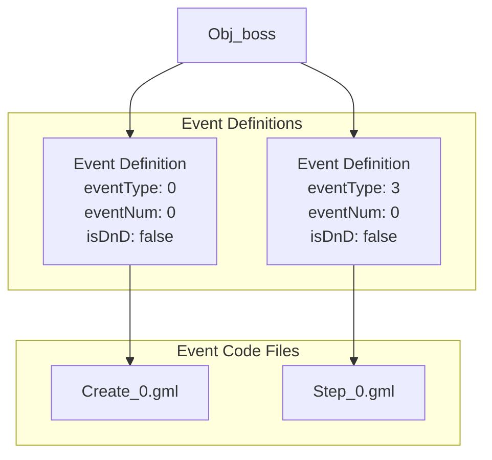
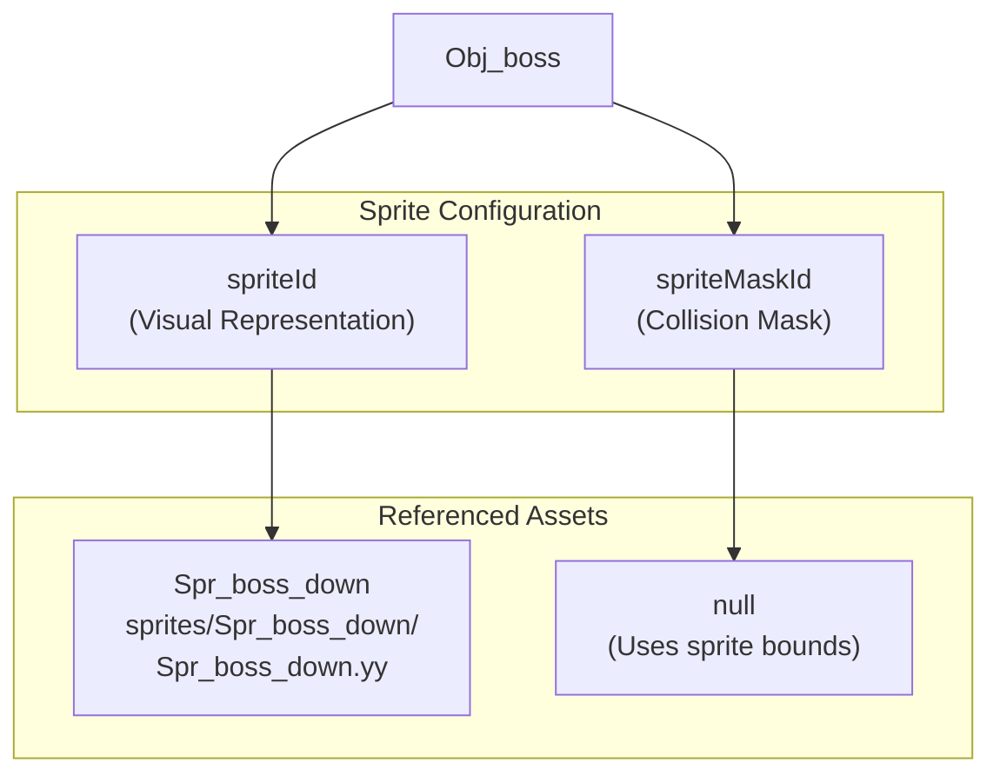
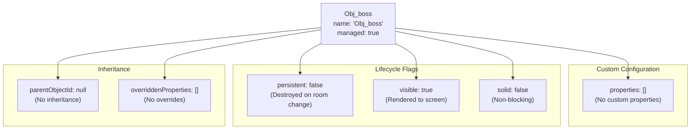
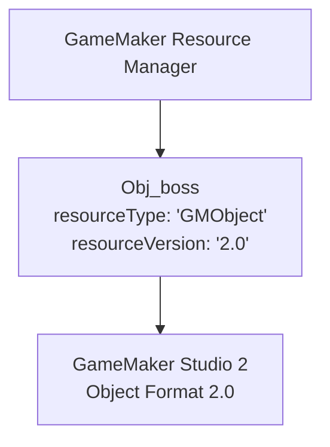

# Boss Object Definition

> **Relevant source files**
> * [magician project1/objects/Obj_boss/Obj_boss.yy](https://github.com/axchisan/Haunted_hollow/blob/96079758/magician project1/objects/Obj_boss/Obj_boss.yy)

## Purpose and Scope

This document describes the structural definition of the `Obj_boss` object, including its event configuration, sprite associations, physics properties, and metadata. This page focuses on the static object definition as specified in the GameMaker object file.

For information about the boss's initialization logic, see [Boss Initialization](/axchisan/Haunted_hollow/4.2-boss-initialization). For behavior and AI patterns, see [Boss AI and Behavior](/axchisan/Haunted_hollow/4.3-boss-ai-and-behavior). For the boss's projectile system, see [Boss Projectile System](/axchisan/Haunted_hollow/4.4-boss-projectile-system).

---

## Object Structure Overview

The `Obj_boss` object is defined in the GameMaker object file format (.yy), which uses JSON-like syntax to specify all object properties. The boss serves as the final encounter enemy in the game, positioned in the dedicated boss room after all six quiz obstructions are cleared.

### File Location and Resource Type

```

```

**Sources:** [magician L1-L39](https://github.com/axchisan/Haunted_hollow/blob/96079758/magician project1/objects/Obj_boss/Obj_boss.yy#L1-L39)

The boss object is organized under the "Boss" folder category in the project hierarchy [magician L11-L14](https://github.com/axchisan/Haunted_hollow/blob/96079758/magician project1/objects/Obj_boss/Obj_boss.yy#L11-L14)

 separating it from other enemy types like phantoms and the player object.

---

## Event Configuration

The `Obj_boss` object defines two event handlers that control its lifecycle and behavior:

### Event Registration Table

| Event Type | Event Number | Description | Code Location |
| --- | --- | --- | --- |
| Create (eventType: 0) | 0 | Initialization logic executed once when boss spawns | `Create_0.gml` |
| Step (eventType: 3) | 0 | Frame-by-frame AI logic executed every game step | `Step_0.gml` |

### Event Mapping Diagram



**Sources:** [magician L4-L7](https://github.com/axchisan/Haunted_hollow/blob/96079758/magician project1/objects/Obj_boss/Obj_boss.yy#L4-L7)

Both events are configured with `isDnD: false` [magician L5-L6](https://github.com/axchisan/Haunted_hollow/blob/96079758/magician project1/objects/Obj_boss/Obj_boss.yy#L5-L6)

 indicating they use GameMaker Language (GML) code rather than Drag-and-Drop visual scripting.

---

## Sprite Associations

The boss object is visually represented using the `Spr_boss_down` sprite asset, which defines its appearance and animation frames.

### Sprite Configuration



**Sources:** [magician L33-L37](https://github.com/axchisan/Haunted_hollow/blob/96079758/magician project1/objects/Obj_boss/Obj_boss.yy#L33-L37)

The `spriteId` property references `Spr_boss_down` [magician L33-L36](https://github.com/axchisan/Haunted_hollow/blob/96079758/magician project1/objects/Obj_boss/Obj_boss.yy#L33-L36)

 which is used for both visual rendering and collision detection. The `spriteMaskId` is set to `null` [magician L37](https://github.com/axchisan/Haunted_hollow/blob/96079758/magician project1/objects/Obj_boss/Obj_boss.yy#L37-L37)

 meaning collision detection uses the sprite's bounding box rather than a separate collision mask.

---

## Physics Properties

The boss object has physics simulation capabilities defined but disabled, as it uses custom movement logic rather than GameMaker's built-in physics engine.

### Physics Configuration Table

| Property | Value | Description |
| --- | --- | --- |
| `physicsObject` | `false` | Physics simulation disabled; uses custom movement |
| `physicsAngularDamping` | `0.1` | Rotational velocity decay rate (unused) |
| `physicsDensity` | `0.5` | Mass per unit area (unused) |
| `physicsFriction` | `0.2` | Surface friction coefficient (unused) |
| `physicsGroup` | `1` | Physics collision group identifier |
| `physicsKinematic` | `false` | Not a kinematic body (unused) |
| `physicsLinearDamping` | `0.1` | Linear velocity decay rate (unused) |
| `physicsRestitution` | `0.1` | Bounciness coefficient (unused) |
| `physicsSensor` | `false` | Not a sensor (detects but doesn't collide) |
| `physicsShape` | `1` | Box collision shape |
| `physicsShapePoints` | `[]` | Empty; shape derived from sprite bounds |
| `physicsStartAwake` | `true` | Would start simulation active (unused) |

**Sources:** [magician L17-L28](https://github.com/axchisan/Haunted_hollow/blob/96079758/magician project1/objects/Obj_boss/Obj_boss.yy#L17-L28)

### Physics State Diagram

```mermaid
flowchart TD

PhysicsConfig["Physics Configuration"]
Disabled["physicsObject: false"]
Group["physicsGroup: 1"]
AngDamp["physicsAngularDamping: 0.1"]
Density["physicsDensity: 0.5"]
Friction["physicsFriction: 0.2"]
Kinematic["physicsKinematic: false"]
LinDamp["physicsLinearDamping: 0.1"]
Restitution["physicsRestitution: 0.1"]
Sensor["physicsSensor: false"]
Shape["physicsShape: 1"]
ShapePoints["physicsShapePoints: []"]
StartAwake["physicsStartAwake: true"]

PhysicsConfig --> Disabled
PhysicsConfig --> Group
PhysicsConfig --> AngDamp
PhysicsConfig --> Density
PhysicsConfig --> Friction
PhysicsConfig --> Kinematic
PhysicsConfig --> LinDamp
PhysicsConfig --> Restitution
PhysicsConfig --> Sensor
PhysicsConfig --> Shape
PhysicsConfig --> ShapePoints
PhysicsConfig --> StartAwake

subgraph subGraph1 ["Inactive Properties"]
    AngDamp
    Density
    Friction
    Kinematic
    LinDamp
    Restitution
    Sensor
    Shape
    ShapePoints
    StartAwake
end

subgraph subGraph0 ["Active Properties"]
    Disabled
    Group
end
```



**Sources:** [magician L17-L28](https://github.com/axchisan/Haunted_hollow/blob/96079758/magician project1/objects/Obj_boss/Obj_boss.yy#L17-L28)

The `physicsObject` property is explicitly set to `false` [magician L23](https://github.com/axchisan/Haunted_hollow/blob/96079758/magician project1/objects/Obj_boss/Obj_boss.yy#L23-L23)

 which disables GameMaker's physics engine for this object. This is intentional design, as the boss uses custom AI-driven movement logic implemented in its Step event rather than physics-based motion.

---

## Object Metadata and Flags

The boss object has several metadata properties that control its behavior and lifecycle:

### Metadata Properties Table

| Property | Value | Purpose |
| --- | --- | --- |
| `name` | `"Obj_boss"` | Object identifier used in code and editor |
| `resourceType` | `"GMObject"` | GameMaker object resource type |
| `resourceVersion` | `"2.0"` | GameMaker object format version |
| `managed` | `true` | Managed by GameMaker's resource system |
| `persistent` | `false` | Does not persist across room transitions |
| `solid` | `false` | Does not block other objects (non-solid) |
| `visible` | `true` | Rendered to screen |
| `parentObjectId` | `null` | No parent object; does not inherit |
| `overriddenProperties` | `[]` | No property overrides |
| `properties` | `[]` | No custom properties defined |

**Sources:** [magician L1-L39](https://github.com/axchisan/Haunted_hollow/blob/96079758/magician project1/objects/Obj_boss/Obj_boss.yy#L1-L39)

### Inheritance and Lifecycle Structure



**Sources:** [magician L8-L39](https://github.com/axchisan/Haunted_hollow/blob/96079758/magician project1/objects/Obj_boss/Obj_boss.yy#L8-L39)

#### Key Metadata Implications

1. **Persistence**: The `persistent: false` flag [magician L16](https://github.com/axchisan/Haunted_hollow/blob/96079758/magician project1/objects/Obj_boss/Obj_boss.yy#L16-L16)  means the boss instance is destroyed when transitioning to another room. This is appropriate since the boss only exists in its dedicated room and should not carry over to other areas.
2. **Solidity**: The `solid: false` flag [magician L32](https://github.com/axchisan/Haunted_hollow/blob/96079758/magician project1/objects/Obj_boss/Obj_boss.yy#L32-L32)  indicates the boss does not participate in GameMaker's built-in solid collision system. Collisions with player projectiles are handled explicitly through collision events rather than automatic solid blocking.
3. **Visibility**: The `visible: true` flag [magician L38](https://github.com/axchisan/Haunted_hollow/blob/96079758/magician project1/objects/Obj_boss/Obj_boss.yy#L38-L38)  ensures the boss sprite is rendered. This could be dynamically changed during gameplay (e.g., for invisibility mechanics), though the default state is visible.
4. **No Inheritance**: The `parentObjectId: null` value [magician L15](https://github.com/axchisan/Haunted_hollow/blob/96079758/magician project1/objects/Obj_boss/Obj_boss.yy#L15-L15)  indicates `Obj_boss` does not inherit from another object. This is different from the phantom enemies, which may share common behavior through parent objects. The boss implements all its logic directly without relying on parent object events.

---

## Resource Management

The boss object is managed by GameMaker's resource system, as indicated by the `managed: true` flag [magician L8](https://github.com/axchisan/Haunted_hollow/blob/96079758/magician project1/objects/Obj_boss/Obj_boss.yy#L8-L8)

 This means GameMaker automatically handles resource loading, unloading, and memory management for the object.

### Resource Type and Version



**Sources:** [magician L30-L31](https://github.com/axchisan/Haunted_hollow/blob/96079758/magician project1/objects/Obj_boss/Obj_boss.yy#L30-L31)

The `resourceType: "GMObject"` [magician L30](https://github.com/axchisan/Haunted_hollow/blob/96079758/magician project1/objects/Obj_boss/Obj_boss.yy#L30-L30)

 identifies this as a GameMaker object resource. The `resourceVersion: "2.0"` [magician L31](https://github.com/axchisan/Haunted_hollow/blob/96079758/magician project1/objects/Obj_boss/Obj_boss.yy#L31-L31)

 indicates this object uses the GameMaker Studio 2 object format, ensuring compatibility with the project's development environment.

---

## Summary

The `Obj_boss` object is structurally defined with:

* **Two events**: Create (initialization) and Step (AI behavior)
* **Visual representation**: `Spr_boss_down` sprite with no separate collision mask
* **Physics**: Disabled physics engine; uses custom movement logic
* **Lifecycle**: Non-persistent, visible, non-solid object
* **No inheritance**: Implements all logic directly without parent object
* **Resource management**: Managed by GameMaker's resource system in Object Format 2.0

The actual initialization logic and behavior are implemented in the event code files, which are documented in subsequent pages of this section.

**Sources:** [magician L1-L39](https://github.com/axchisan/Haunted_hollow/blob/96079758/magician project1/objects/Obj_boss/Obj_boss.yy#L1-L39)