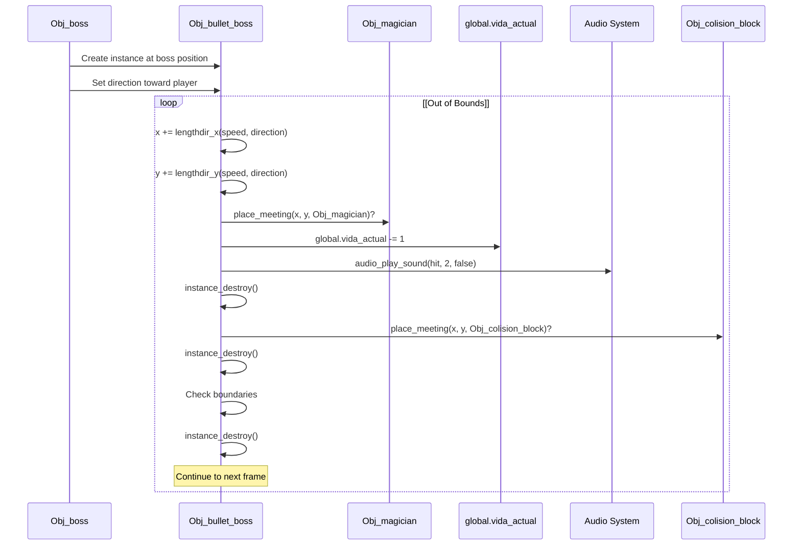
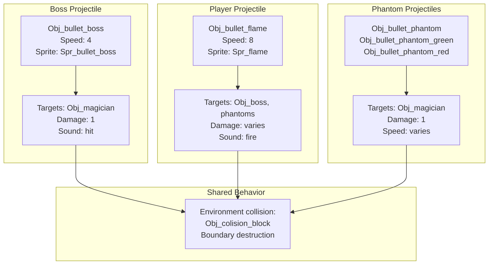

# Boss Projectile System

> **Relevant source files**
> * [magician project1/objects/Obj_bullet_boss/Create_0.gml](https://github.com/axchisan/Haunted_hollow/blob/96079758/magician project1/objects/Obj_bullet_boss/Create_0.gml)
> * [magician project1/objects/Obj_bullet_boss/Obj_bullet_boss.yy](https://github.com/axchisan/Haunted_hollow/blob/96079758/magician project1/objects/Obj_bullet_boss/Obj_bullet_boss.yy)
> * [magician project1/objects/Obj_bullet_boss/Step_0.gml](https://github.com/axchisan/Haunted_hollow/blob/96079758/magician project1/objects/Obj_bullet_boss/Step_0.gml)

This page documents the `Obj_bullet_boss` object, which represents projectiles fired by the boss enemy during combat. The system covers projectile initialization, movement physics, collision detection with the player and environment, and destruction conditions.

For information about how the boss spawns these projectiles, see [Boss AI and Behavior](/axchisan/Haunted_hollow/4.3-boss-ai-and-behavior). For player projectile mechanics, see [Player Projectile Definition](/axchisan/Haunted_hollow/5.1-player-projectile-definition).

---

## Object Definition and Structure

The boss projectile is defined as `Obj_bullet_boss`, organized under the `Boss` folder in the GameMaker project hierarchy. The object implements two core events:

| Event Type | Event Number | Purpose |
| --- | --- | --- |
| Create Event | 0 | Initialize speed and direction |
| Step Event | 0 | Handle movement and collision detection |

The object uses the sprite `Spr_bullet_boss` for visual representation and is configured with the following properties:

* **Persistent**: `false` - does not carry across rooms
* **Solid**: `false` - does not use built-in collision
* **Visible**: `true` - renders in the game view
* **Physics Object**: `false` - uses manual movement instead of physics simulation

**Sources:**

* [magician L1-L39](https://github.com/axchisan/Haunted_hollow/blob/96079758/magician project1/objects/Obj_bullet_boss/Obj_bullet_boss.yy#L1-L39)

---

## Projectile Initialization

When an `Obj_bullet_boss` instance is created, the Create Event initializes two critical movement properties:

```
speed = 4;
direction = 0;
```

The `speed` value of `4` determines how many pixels the projectile travels per frame, making boss projectiles slower than player projectiles (which move at speed `8`). The `direction` is initialized to `0` degrees (pointing right), but is typically overridden by the boss's AI when spawning the projectile to aim toward the player.

**Sources:**

* [magician L1-L2](https://github.com/axchisan/Haunted_hollow/blob/96079758/magician project1/objects/Obj_bullet_boss/Create_0.gml#L1-L2)

---

## Movement Behavior

### Title: Boss Projectile Movement System

```

```

**Sources:**

* [magician L1-L27](https://github.com/axchisan/Haunted_hollow/blob/96079758/magician project1/objects/Obj_bullet_boss/Step_0.gml#L1-L27)

The projectile uses GameMaker's built-in directional movement functions to calculate position updates each frame. The `lengthdir_x()` and `lengthdir_y()` functions decompose the movement vector into horizontal and vertical components based on the `speed` and `direction` variables.

**Sources:**

* [magician L4-L5](https://github.com/axchisan/Haunted_hollow/blob/96079758/magician project1/objects/Obj_bullet_boss/Step_0.gml#L4-L5)

---

## Collision Detection System

The Step Event implements three distinct collision checks executed sequentially each frame:

### Player Collision

When a boss projectile collides with `Obj_magician`, it triggers a damage sequence:

1. Decrements `global.vida_actual` by 1
2. Plays the `hit` audio sound at priority level 2
3. Destroys the projectile instance

The collision uses a `with` statement to execute code in the context of the player object, allowing direct manipulation of player health:

```

```

**Sources:**

* [magician L8-L16](https://github.com/axchisan/Haunted_hollow/blob/96079758/magician project1/objects/Obj_bullet_boss/Step_0.gml#L8-L16)

### Environment Collision

Boss projectiles are destroyed upon collision with `Obj_colision_block` objects, preventing them from passing through walls or level geometry:

```

```

This ensures boss attacks respect level layout and cannot reach the player through obstacles.

**Sources:**

* [magician L18-L21](https://github.com/axchisan/Haunted_hollow/blob/96079758/magician project1/objects/Obj_bullet_boss/Step_0.gml#L18-L21)

### Boundary Detection

Projectiles are automatically destroyed if they exit the room boundaries:

```

```

This prevents projectiles from existing indefinitely outside the playable area, optimizing performance by removing off-screen instances.

**Sources:**

* [magician L23-L26](https://github.com/axchisan/Haunted_hollow/blob/96079758/magician project1/objects/Obj_bullet_boss/Step_0.gml#L23-L26)

---

## Collision Handling Flow

### Title: Boss Projectile Collision Resolution Sequence



**Sources:**

* [magician L1-L27](https://github.com/axchisan/Haunted_hollow/blob/96079758/magician project1/objects/Obj_bullet_boss/Step_0.gml#L1-L27)

---

## Technical Implementation Details

### Movement Physics

The projectile system uses a velocity-based movement model rather than position interpolation. The movement equations are:

| Component | Formula | Variables |
| --- | --- | --- |
| Horizontal | `x += lengthdir_x(speed, direction)` | `speed = 4`, `direction` in degrees |
| Vertical | `y += lengthdir_y(speed, direction)` | `speed = 4`, `direction` in degrees |

The `lengthdir_x()` function computes: `speed * cos(direction * π / 180)`  

The `lengthdir_y()` function computes: `speed * -sin(direction * π / 180)`

This produces consistent movement speed regardless of direction, with the projectile traveling exactly 4 pixels per frame.

**Sources:**

* [magician L4-L5](https://github.com/axchisan/Haunted_hollow/blob/96079758/magician project1/objects/Obj_bullet_boss/Step_0.gml#L4-L5)

### Collision Priority

Collisions are checked in a specific order within the Step Event:

1. **Player collision** - highest priority, checked first
2. **Environment collision** - second priority
3. **Boundary check** - lowest priority, checked last

This ordering ensures that if a projectile simultaneously hits the player and a wall (edge case at corners), the player damage is processed before destruction.

**Sources:**

* [magician L8-L26](https://github.com/axchisan/Haunted_hollow/blob/96079758/magician project1/objects/Obj_bullet_boss/Step_0.gml#L8-L26)

---

## Integration with Boss AI

The boss spawns `Obj_bullet_boss` instances through its AI logic documented in [Boss AI and Behavior](/axchisan/Haunted_hollow/4.3-boss-ai-and-behavior). The spawn process:

1. Boss creates `Obj_bullet_boss` at its position
2. Boss calculates angle to player using `point_direction()`
3. Boss overrides the projectile's `direction` variable
4. Projectile begins autonomous movement and collision detection

The projectile operates independently after creation, requiring no further communication with the boss object.

**Sources:**

* [magician L1-L2](https://github.com/axchisan/Haunted_hollow/blob/96079758/magician project1/objects/Obj_bullet_boss/Create_0.gml#L1-L2)
* [magician L1-L27](https://github.com/axchisan/Haunted_hollow/blob/96079758/magician project1/objects/Obj_bullet_boss/Step_0.gml#L1-L27)

---

## Comparison with Other Projectile Systems

### Title: Projectile System Comparison



**Sources:**

* [magician L1-L2](https://github.com/axchisan/Haunted_hollow/blob/96079758/magician project1/objects/Obj_bullet_boss/Create_0.gml#L1-L2)
* [magician L1-L27](https://github.com/axchisan/Haunted_hollow/blob/96079758/magician project1/objects/Obj_bullet_boss/Step_0.gml#L1-L27)

| Projectile Type | Speed | Target | Damage | Audio Feedback |
| --- | --- | --- | --- | --- |
| `Obj_bullet_boss` | 4 | `Obj_magician` | 1 | `hit` |
| `Obj_bullet_flame` | 8 | Multiple enemies | Variable | `fire` |
| `Obj_bullet_phantom` | Varies | `Obj_magician` | 1 | `hit` |

Boss projectiles move at half the speed of player projectiles (4 vs 8), creating a difficulty balance where player attacks are faster but boss attacks are more numerous due to minion spawning.