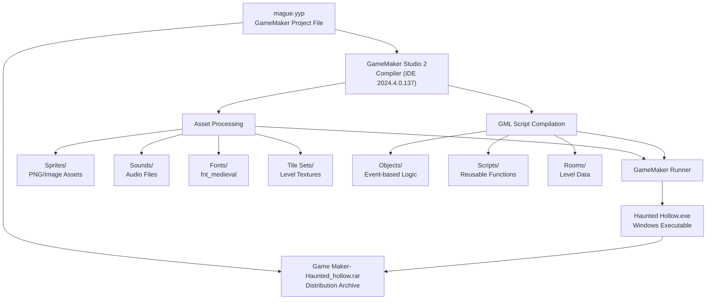
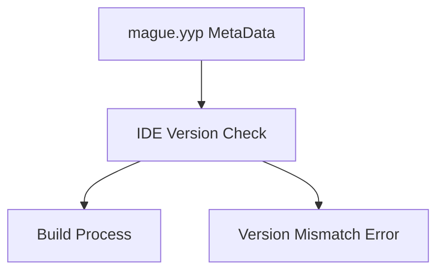
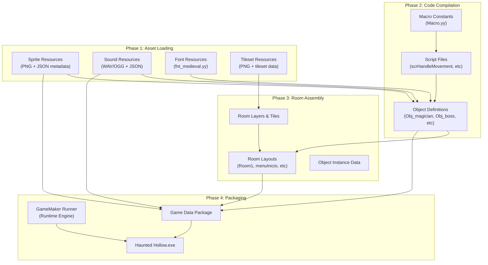
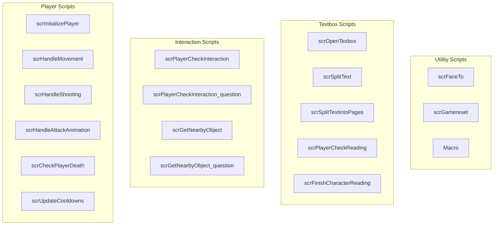
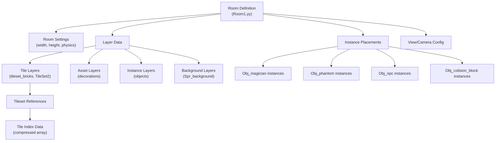
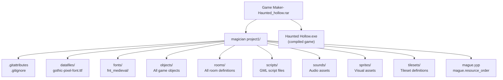

# Building and Distribution

> **Relevant source files**
> * [Game Maker- Haunted_hollow.rar](https://github.com/axchisan/Haunted_hollow/blob/96079758/Game Maker- Haunted_hollow.rar)
> * [Haunted Hollow.exe](https://github.com/axchisan/Haunted_hollow/blob/96079758/Haunted Hollow.exe)
> * [magician project1/mague.yyp](https://github.com/axchisan/Haunted_hollow/blob/96079758/magician project1/mague.yyp)

This document explains the compilation process for Haunted Hollow, from the GameMaker Studio 2 project source to the final executable, and how the game is packaged for distribution. It covers the build workflow, asset compilation, and archive structure.

For information about the GameMaker project file structure and resource organization, see [GameMaker Project Structure](/axchisan/Haunted_hollow/8.1-gamemaker-project-structure). For version control setup during development, see [Version Control Configuration](/axchisan/Haunted_hollow/8.2-version-control-configuration).

---

## Purpose and Scope

This page documents:

* The compilation pipeline from `mague.yyp` to `Haunted Hollow.exe`
* How GameMaker Studio 2 processes assets and code
* The distribution archive structure (`Game Maker- Haunted_hollow.rar`)
* Build configuration and IDE requirements
* Target platform specifications

---

## Build Pipeline Overview

Haunted Hollow uses GameMaker Studio 2's build system to compile all game assets, scripts, objects, and rooms into a single executable. The build process transforms declarative JSON configurations and GML scripts into a runnable Windows application.



**Sources:**

* [mague.yyp L1-L338](https://github.com/axchisan/Haunted_hollow/blob/96079758/mague.yyp#L1-L338)
* [Game L1-L4](https://github.com/axchisan/Haunted_hollow/blob/96079758/Game Maker- Haunted_hollow.rar#L1-L4)

---

## GameMaker Studio 2 Compilation Process

### IDE Configuration

The project requires **GameMaker Studio 2 IDE version 2024.4.0.137** as specified in the project metadata. This version ensures compatibility with the project's asset formats and GML language features.



**Key Configuration:**

| Property | Value | Purpose |
| --- | --- | --- |
| `IDEVersion` | `2024.4.0.137` | Required IDE version |
| `defaultScriptType` | `1` | GML language version |
| `isEcma` | `false` | Disables ECMAScript mode |
| `templateType` | `game` | Project is a game (not extension) |

**Sources:**

* [mague.yyp L82-L84](https://github.com/axchisan/Haunted_hollow/blob/96079758/mague.yyp#L82-L84)
* [mague.yyp L11](https://github.com/axchisan/Haunted_hollow/blob/96079758/mague.yyp#L11-L11)
* [mague.yyp L80](https://github.com/axchisan/Haunted_hollow/blob/96079758/mague.yyp#L80-L80)
* [mague.yyp L334](https://github.com/axchisan/Haunted_hollow/blob/96079758/mague.yyp#L334-L334)

---

## Resource Compilation Workflow

GameMaker Studio 2 processes resources in a specific order to resolve dependencies between assets. The compilation transforms JSON resource definitions into runtime data structures.



**Sources:**

* [mague.yyp L12-L76](https://github.com/axchisan/Haunted_hollow/blob/96079758/mague.yyp#L12-L76)  (Folder structure)
* [mague.yyp L86-L317](https://github.com/axchisan/Haunted_hollow/blob/96079758/mague.yyp#L86-L317)  (Resource list)

---

## Asset Processing Details

### Sprite Compilation

Sprite assets are converted from PNG images with associated JSON metadata into GameMaker's internal texture format. Each sprite's `.yy` file defines animation frames, collision masks, and texture group assignment.

**Example Sprite Resource Structure:**

* `Spr_magician_walk_down/Spr_magician_walk_down.yy` - Sprite metadata
* `Spr_magician_walk_down/*.png` - Frame images
* `Spr_magician_walk_down/layers/` - Layer data for each frame

The compiler packs sprites into texture pages according to the `Default` texture group configuration:

| Texture Group Property | Value | Effect |
| --- | --- | --- |
| `autocrop` | `true` | Removes transparent edges |
| `border` | `2` | 2px padding between sprites |
| `compressFormat` | `bz2` | Uses BZ2 compression |
| `isScaled` | `true` | Enables texture scaling |

**Sources:**

* [mague.yyp L335-L337](https://github.com/axchisan/Haunted_hollow/blob/96079758/mague.yyp#L335-L337)  (TextureGroups configuration)
* [mague.yyp L206-L310](https://github.com/axchisan/Haunted_hollow/blob/96079758/mague.yyp#L206-L310)  (Sprite resource IDs)

### Audio Asset Processing

Sound files are referenced by the project but remain as separate files during compilation. The GameMaker compiler creates an audio manifest that maps audio resource IDs to file paths.

**Audio Resources in Project:**

* `music1` - Background music
* `jefemusic` - Boss fight music
* `fire` - Shooting sound effect
* `hit` - Damage sound effect
* `screamphantom` - Enemy death sound
* `correctanswer` - Quiz feedback
* `Teleport` - Room transition sound

Audio files use the `audiogroup_default` configuration, which determines streaming vs. preload behavior.

**Sources:**

* [mague.yyp L4-L6](https://github.com/axchisan/Haunted_hollow/blob/96079758/mague.yyp#L4-L6)  (Audio group configuration)
* [mague.yyp L191-L204](https://github.com/axchisan/Haunted_hollow/blob/96079758/mague.yyp#L191-L204)  (Sound resource IDs)

### Font Asset Compilation

Custom fonts are processed into bitmap font atlases. The `fnt_medieval` font uses the Bradley Hand ITC typeface and is compiled from:

* `fonts/fnt_medieval/fnt_medieval.yy` - Font configuration
* `fonts/fnt_medieval/fnt_medieval.png` - Glyph atlas texture
* `datafiles/gothic-pixel-font.ttf` - TrueType font file (included asset)

The font system generates kerning data and character mapping during compilation.

**Sources:**

* [mague.yyp L87](https://github.com/axchisan/Haunted_hollow/blob/96079758/mague.yyp#L87-L87)  (Font resource ID)
* [mague.yyp L78](https://github.com/axchisan/Haunted_hollow/blob/96079758/mague.yyp#L78-L78)  (Included font file)

---

## GML Script and Object Compilation

### Script Compilation

GameMaker compiles all `.gml` files into an intermediate bytecode format. Scripts are organized into functional groups:



All scripts are referenced in `mague.yyp` and compiled in dependency order. Scripts that reference other scripts are compiled after their dependencies.

**Sources:**

* [mague.yyp L173-L190](https://github.com/axchisan/Haunted_hollow/blob/96079758/mague.yyp#L173-L190)  (Script resource IDs)

### Object Event Compilation

Object definitions contain event-driven GML code. Each object's `.yy` file lists which events have associated code files. The compiler processes:

**Object Structure:**

* `objects/Obj_magician/Obj_magician.yy` - Object definition (sprite, events, physics)
* `objects/Obj_magician/Create_0.gml` - Create event code
* `objects/Obj_magician/Step_0.gml` - Step event code
* `objects/Obj_magician/Draw_0.gml` - Draw event code

**Example: Player Object (Obj_magician)**

The player object has multiple event handlers compiled into the executable:

* Create event: Initialize player state
* Step event: Handle input and movement per frame
* Draw event: Render player sprite
* Collision events: Handle damage from enemy projectiles

**Sources:**

* [mague.yyp L120](https://github.com/axchisan/Haunted_hollow/blob/96079758/mague.yyp#L120-L120)  (Obj_magician resource ID)
* [mague.yyp L88-L160](https://github.com/axchisan/Haunted_hollow/blob/96079758/mague.yyp#L88-L160)  (Object resource definitions)

---

## Room Compilation and Scene Data

Rooms are compiled from JSON definitions that specify layer data, instance placements, and tile arrangements. Each room's `.yy` file contains:



**Room Compilation Order (as defined in RoomOrderNodes):**

1. `menuInicio` - Main menu
2. `Room_cinematic1` - Opening cinematic
3. `Room1` - Main game hub
4. `Room_question1` through `Room_question6` - Quiz rooms
5. `cinejefe` - Boss cinematic
6. `jefe` - Boss fight
7. `credits` - End credits

**Sources:**

* [mague.yyp L320-L333](https://github.com/axchisan/Haunted_hollow/blob/96079758/mague.yyp#L320-L333)  (Room order definition)
* [mague.yyp L161-L172](https://github.com/axchisan/Haunted_hollow/blob/96079758/mague.yyp#L161-L172)  (Room resource IDs)

---

## Build Configuration and Output

### Project Configuration

The project uses a single default build configuration with no custom config variations:

```
"configs": {
  "children": [],
  "name": "Default"
}
```

This means the game compiles with GameMaker's standard release settings. No debug symbols or development features are included in the final executable.

**Sources:**

* [mague.yyp L7-L10](https://github.com/axchisan/Haunted_hollow/blob/96079758/mague.yyp#L7-L10)

### Executable Output

The compilation process produces `Haunted Hollow.exe`, a standalone Windows executable that bundles:

* GameMaker Runtime (proprietary engine)
* Compiled game data package
* All sprites, sounds, and fonts
* Room data and object instances
* GML bytecode

The executable size is determined by:

1. GameMaker Runtime overhead (~2-5 MB)
2. Texture page data (sprites)
3. Audio file data
4. Font atlas data
5. Compiled code and room data

**Sources:**

* High-level architecture diagram analysis
* [Game L1-L4](https://github.com/axchisan/Haunted_hollow/blob/96079758/Game Maker- Haunted_hollow.rar#L1-L4)  (Archive structure)

---

## Distribution Archive Structure

The game is distributed as `Game Maker- Haunted_hollow.rar`, a compressed RAR archive containing the complete project source and compiled executable.



**Archive Contents:**

| Path | Content Type | Purpose |
| --- | --- | --- |
| `magician project1/` | Source project | Full GameMaker project for development |
| `magician project1/mague.yyp` | Project file | Main project definition |
| `magician project1/.gitattributes` | Git config | Version control file handling |
| `magician project1/.gitignore` | Git config | Excluded files list |
| `magician project1/datafiles/` | Data files | Included font assets |
| `magician project1/fonts/` | Font assets | Compiled font data |
| `magician project1/objects/` | Object definitions | Game object `.yy` files and GML |
| `magician project1/rooms/` | Room definitions | Level layouts and data |
| `magician project1/scripts/` | Script files | Reusable GML functions |
| `magician project1/sounds/` | Audio assets | Sound `.yy` files and audio data |
| `magician project1/sprites/` | Sprite assets | Sprite `.yy` files and PNG images |
| `magician project1/tilesets/` | Tileset assets | Tileset definitions |
| `Haunted Hollow.exe` | Executable | Playable game (optional) |

**Sources:**

* [Game L1-L4](https://github.com/axchisan/Haunted_hollow/blob/96079758/Game Maker- Haunted_hollow.rar#L1-L4)  (Archive header)
* File listing analysis

---

## Build Requirements and Dependencies

### Development Requirements

To build the project from source:

**Required Software:**

* GameMaker Studio 2 (IDE version 2024.4.0.137 or compatible)
* Windows OS (for Windows target compilation)

**Project Dependencies:**

* No external libraries or extensions
* All assets included in project directory
* Font file: `gothic-pixel-font.ttf` (included in datafiles)

### Target Platform Specifications

**Compilation Target:**

* Platform: Windows (PC)
* Architecture: x86/x64 (determined by IDE settings)
* Runtime: GameMaker Windows target

The project does not include configurations for other platforms (HTML5, macOS, Linux, mobile), indicating Windows-only distribution.

**Sources:**

* [mague.yyp L82-L84](https://github.com/axchisan/Haunted_hollow/blob/96079758/mague.yyp#L82-L84)  (IDE version requirement)
* [mague.yyp L78](https://github.com/axchisan/Haunted_hollow/blob/96079758/mague.yyp#L78-L78)  (Included font file)
* Project analysis (no multi-platform configs)

---

## Compilation Commands and Workflow

### Building from GameMaker Studio 2

**Step-by-step compilation:**

1. **Open Project:** * Launch GameMaker Studio 2 IDE version 2024.4.0.137 * Open `magician project1/mague.yyp`
2. **Resource Verification:** * IDE loads all resources from `mague.yyp` * Verifies asset files exist at specified paths * Checks for syntax errors in GML scripts
3. **Build Execution:** * Select "Build" → "Create Executable" * Choose target platform: Windows * Select output directory for `Haunted Hollow.exe`
4. **Compilation Process:** * Asset processing (sprites, sounds, fonts) * GML script compilation to bytecode * Object and room data serialization * Runner embedding and data packaging
5. **Output:** * Generates `Haunted Hollow.exe` in specified directory * Includes all game data in single executable

**No command-line build tools** are referenced in the project structure, indicating compilation is IDE-driven.

**Sources:**

* GameMaker Studio 2 standard workflow
* [mague.yyp L1-L338](https://github.com/axchisan/Haunted_hollow/blob/96079758/mague.yyp#L1-L338)  (Project structure)

---

## Resource Packaging and Data Compression

GameMaker Studio 2 uses internal packaging to embed game assets into the executable. The compilation process applies:

**Texture Compression:**

* Format: BZ2 compression (as specified in TextureGroups)
* Sprites packed into texture pages
* Automatic cropping of transparent borders
* 2-pixel border between sprites to prevent bleeding

**Audio Packaging:**

* Audio files embedded or referenced based on audio group settings
* `audiogroup_default` determines memory vs. streaming strategy
* Format preservation (WAV/OGG formats maintained)

**Data Serialization:**

* Room data serialized to binary format
* Object instance data compressed
* Tile layer data uses run-length encoding for efficiency

**Sources:**

* [mague.yyp L335-L337](https://github.com/axchisan/Haunted_hollow/blob/96079758/mague.yyp#L335-L337)  (Texture group settings)
* [mague.yyp L4-L6](https://github.com/axchisan/Haunted_hollow/blob/96079758/mague.yyp#L4-L6)  (Audio group configuration)

---

## Distribution Best Practices

### Archive Creation

The RAR archive provides:

1. **Source Availability:** Complete project for modification
2. **Immediate Playability:** Compiled executable (if included)
3. **Version Control:** Git configuration files preserved

**Recommended distribution includes:**

* Complete `magician project1/` directory
* Compiled `Haunted Hollow.exe`
* README documentation
* Version information

### Build Verification

Before distribution, verify:

1. Executable runs on target systems
2. All audio assets play correctly
3. All sprites render properly
4. No missing asset errors in console
5. Game progression functions as expected

**Sources:**

* [Game L1-L4](https://github.com/axchisan/Haunted_hollow/blob/96079758/Game Maker- Haunted_hollow.rar#L1-L4)  (Distribution archive)
* [mague.yyp L1-L338](https://github.com/axchisan/Haunted_hollow/blob/96079758/mague.yyp#L1-L338)  (Complete project structure)

---

## Summary

Haunted Hollow's build and distribution process follows GameMaker Studio 2's standard workflow:

1. **Source:** `mague.yyp` project file references all game resources
2. **Compilation:** IDE version 2024.4.0.137 processes assets and GML code
3. **Packaging:** GameMaker Runtime bundles data into `Haunted Hollow.exe`
4. **Distribution:** RAR archive contains both source and executable

The project uses a simple, single-configuration build with no custom compiler settings or multi-platform targets, making it straightforward to compile and distribute for Windows platforms.