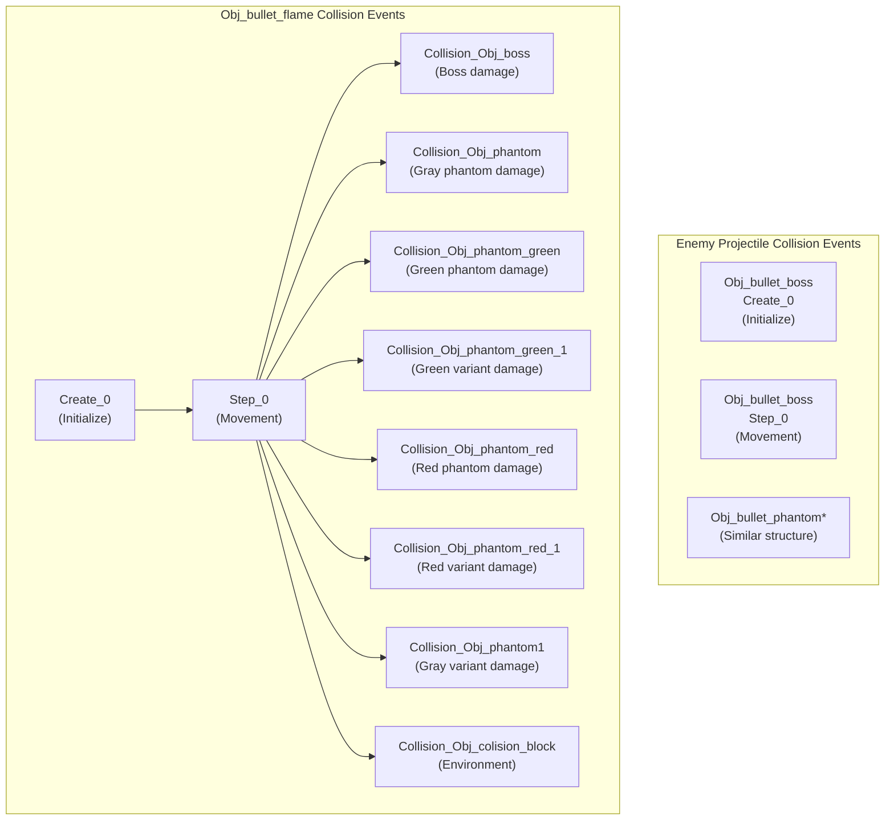
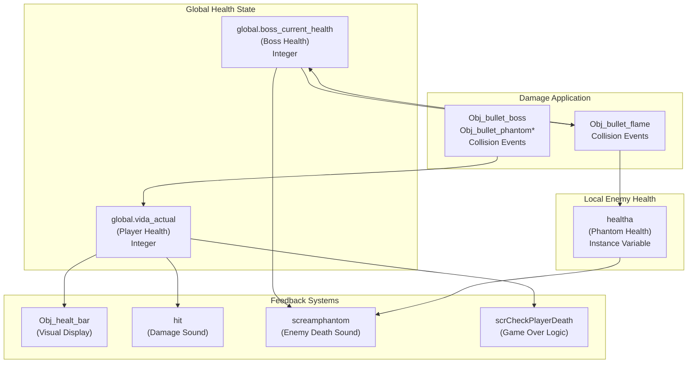
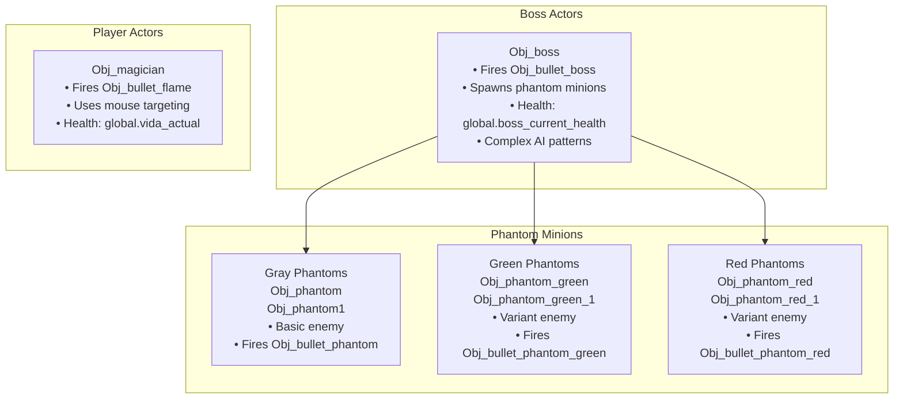

# Combat Architecture

> **Relevant source files**
> * [magician project1/mague.yyp](https://github.com/axchisan/Haunted_hollow/blob/96079758/magician project1/mague.yyp)
> * [magician project1/objects/Obj_bullet_boss/Obj_bullet_boss.yy](https://github.com/axchisan/Haunted_hollow/blob/96079758/magician project1/objects/Obj_bullet_boss/Obj_bullet_boss.yy)
> * [magician project1/objects/Obj_bullet_flame/Obj_bullet_flame.yy](https://github.com/axchisan/Haunted_hollow/blob/96079758/magician project1/objects/Obj_bullet_flame/Obj_bullet_flame.yy)

## Purpose and Scope

This document describes the architectural design of Haunted Hollow's combat system, including the symmetrical projectile-based combat model shared between player and enemies, collision detection mechanisms, and health management. This page provides a high-level overview of combat components and their interactions.

For detailed information on specific subsystems:

* Boss enemy implementation details: see [Boss Enemy System](/axchisan/Haunted_hollow/4-boss-enemy-system)
* Player projectile collision handling: see [Player Combat System](/axchisan/Haunted_hollow/5-player-combat-system)
* Game progression through combat: see [Game Flow and Progression](/axchisan/Haunted_hollow/3.1-game-flow-and-progression)

---

## Combat System Overview

Haunted Hollow implements a **symmetrical bullet-hell combat architecture** where both player and enemies use projectile-based attacks with identical collision detection patterns. The system is organized around three core subsystems: **Combat Actors** (entities that participate in combat), **Projectile Systems** (attack mechanisms), and **Damage Management** (health tracking and feedback).

### Core Combat Architecture

```

```

**Sources**: [magician L86-L318](https://github.com/axchisan/Haunted_hollow/blob/96079758/magician project1/mague.yyp#L86-L318)

 [magician L1-L47](https://github.com/axchisan/Haunted_hollow/blob/96079758/magician project1/objects/Obj_bullet_flame/Obj_bullet_flame.yy#L1-L47)

 [magician L1-L39](https://github.com/axchisan/Haunted_hollow/blob/96079758/magician project1/objects/Obj_bullet_boss/Obj_bullet_boss.yy#L1-L39)

---

## Symmetrical Design Pattern

The combat system employs a **symmetrical architecture** where player and enemy combat mechanics follow identical patterns. This design reduces code complexity and creates predictable gameplay feedback loops.

### Combat Symmetry Table

| Component | Player Side | Enemy Side |
| --- | --- | --- |
| **Combat Actor** | `Obj_magician` | `Obj_boss`, `Obj_phantom`, `Obj_phantom_green`, `Obj_phantom_red` |
| **Projectile Object** | `Obj_bullet_flame` | `Obj_bullet_boss`, `Obj_bullet_phantom`, `Obj_bullet_phantom_green`, `Obj_bullet_phantom_red` |
| **Health Variable** | `global.vida_actual` | `global.boss_current_health`, `healtha` (phantoms) |
| **Damage Audio** | `hit` (when taking damage) | `screamphantom` (when dying) |
| **Collision Detection** | Checks collision with enemy bullets | Checks collision with `Obj_bullet_flame` |
| **Environment Collision** | Player bullets destroyed by `Obj_colision_block` | Enemy bullets destroyed by `Obj_colision_block` |
| **Death Handling** | `scrCheckPlayerDeath` triggers game over | Enemy instance destroyed when health ≤ 0 |

**Key Symmetry Properties**:

* Both sides use **projectile-based attacks** with direction and speed properties
* Both sides use **collision events** to detect hits and apply damage
* Both sides respect **environmental boundaries** (collision blocks destroy all projectiles)
* Both sides provide **audio feedback** on damage/death events

**Sources**: [magician L90-L95](https://github.com/axchisan/Haunted_hollow/blob/96079758/magician project1/mague.yyp#L90-L95)

 [magician L4-L15](https://github.com/axchisan/Haunted_hollow/blob/96079758/magician project1/objects/Obj_bullet_flame/Obj_bullet_flame.yy#L4-L15)

---

## Projectile Architecture

All combat in Haunted Hollow is mediated through projectile objects. Projectiles are temporary instances created by combat actors that move through the level until they either collide with a target or hit level geometry.

### Projectile System Flow

```

```

### Projectile Object Types

| Object Name | Source Actor | Sprite | Collision Targets |
| --- | --- | --- | --- |
| `Obj_bullet_flame` | `Obj_magician` | `Spr_bullet_flame` | `Obj_boss`, `Obj_phantom`, `Obj_phantom_green`, `Obj_phantom_green_1`, `Obj_phantom_red`, `Obj_phantom_red_1`, `Obj_phantom1`, `Obj_colision_block` |
| `Obj_bullet_boss` | `Obj_boss` | `Spr_bullet_boss` | (Targets player, collision handling in boss bullet object) |
| `Obj_bullet_phantom` | `Obj_phantom`, `Obj_phantom1` | `Spr_bullet_phantom` | (Targets player) |
| `Obj_bullet_phantom_green` | `Obj_phantom_green`, `Obj_phantom_green_1` | `Spr_bullet_phantom_green` | (Targets player) |
| `Obj_bullet_phantom_red` | `Obj_phantom_red`, `Obj_phantom_red_1` | `Spr_bullet_phantom_red` | (Targets player) |

**Projectile Lifecycle**:

1. **Creation**: Combat actor spawns projectile at its position
2. **Initialization**: Projectile sets direction (toward target) and speed in Create event
3. **Movement**: Projectile moves each frame in Step event
4. **Collision**: Projectile checks for collisions with targets and environment
5. **Destruction**: Projectile destroys itself after any collision

**Sources**: [magician L91-L95](https://github.com/axchisan/Haunted_hollow/blob/96079758/magician project1/mague.yyp#L91-L95)

 [magician L1-L47](https://github.com/axchisan/Haunted_hollow/blob/96079758/magician project1/objects/Obj_bullet_flame/Obj_bullet_flame.yy#L1-L47)

 [magician L1-L39](https://github.com/axchisan/Haunted_hollow/blob/96079758/magician project1/objects/Obj_bullet_boss/Obj_bullet_boss.yy#L1-L39)

---

## Collision Detection System

The collision detection system uses GameMaker's built-in collision events to handle interactions between projectiles and their targets. All collision handling is **event-driven** and occurs within projectile objects.

### Collision Event Structure



**Collision Detection Properties**:

* **Event-Driven**: Collisions are handled via GameMaker collision events (eventType 4)
* **Projectile-Centric**: Collision logic resides in projectile objects, not in combat actors
* **Multiple Handlers**: `Obj_bullet_flame` defines separate collision events for each enemy type
* **Symmetric Destruction**: All projectiles destroy themselves after collision with any target

### Environment Collision

All projectile objects include a collision event with `Obj_colision_block` that destroys the projectile. This prevents bullets from passing through walls and creates natural boundaries for combat arenas.

**Collision Block Objects**:

* `Obj_colision_block`: Primary level geometry collision object
* `Obj_colision_block_1`: Variant collision block
* `Obj_collision_water`: Water barrier collision (prevents player movement)

**Sources**: [magician L4-L15](https://github.com/axchisan/Haunted_hollow/blob/96079758/magician project1/objects/Obj_bullet_flame/Obj_bullet_flame.yy#L4-L15)

 [magician L112-L114](https://github.com/axchisan/Haunted_hollow/blob/96079758/magician project1/mague.yyp#L112-L114)

---

## Health and Damage Management

Health tracking uses a **global variable system** for persistent state across room transitions and to allow any game system to query or modify health values.

### Health System Architecture



### Health Management Table

| Entity | Health Storage | Initial Value | Damage Source | Death Condition | Death Handler |
| --- | --- | --- | --- | --- | --- |
| **Player** | `global.vida_actual` | Set in player initialization | Enemy bullets (-1 per hit) | `<= 0` | `scrCheckPlayerDeath` |
| **Boss** | `global.boss_current_health` | Set in boss Create event | `Obj_bullet_flame` (-1 per hit) | `<= 0` | Boss instance destroyed, room transition |
| **Phantoms** | `healtha` (instance variable) | Set in phantom Create event | `Obj_bullet_flame` (-1 per hit) | `<= 0` | Instance destroyed, `screamphantom` plays |

**Damage Application Pattern**:

1. Projectile collision event triggers
2. Target's health variable decremented by damage amount (typically -1)
3. Audio feedback played (`hit` for player, `screamphantom` for enemies)
4. If health ≤ 0, death handler executes
5. Projectile instance destroyed

**Global vs. Local Health**:

* **Global Variables** (`global.vida_actual`, `global.boss_current_health`): Used for unique actors (player, boss) that need state persistence across rooms
* **Instance Variables** (`healtha`): Used for multiple phantom enemies; each instance maintains its own health

**Sources**: [magician L117](https://github.com/axchisan/Haunted_hollow/blob/96079758/magician project1/mague.yyp#L117-L117)

 [magician L1-L47](https://github.com/axchisan/Haunted_hollow/blob/96079758/magician project1/objects/Obj_bullet_flame/Obj_bullet_flame.yy#L1-L47)

---

## Combat Actor Types

The combat system distinguishes between different actor types based on their combat capabilities and role in gameplay.

### Actor Classification



### Combat Actor Properties

| Actor Type | Objects | Projectile | Attack Pattern | Health System | AI Complexity |
| --- | --- | --- | --- | --- | --- |
| **Player** | `Obj_magician` | `Obj_bullet_flame` | Mouse-directed shooting | Global: `global.vida_actual` | Player-controlled |
| **Boss** | `Obj_boss` | `Obj_bullet_boss` | Timer-based attacks, minion spawning | Global: `global.boss_current_health` | Complex (see [Boss AI](/axchisan/Haunted_hollow/4.3-boss-ai-and-behavior)) |
| **Gray Phantom** | `Obj_phantom`, `Obj_phantom1` | `Obj_bullet_phantom` | Periodic firing toward player | Instance: `healtha` | Basic enemy AI |
| **Green Phantom** | `Obj_phantom_green`, `Obj_phantom_green_1` | `Obj_bullet_phantom_green` | Variant attack patterns | Instance: `healtha` | Basic enemy AI |
| **Red Phantom** | `Obj_phantom_red`, `Obj_phantom_red_1` | `Obj_bullet_phantom_red` | Variant attack patterns | Instance: `healtha` | Basic enemy AI |

**Actor Variants**: Some actor types have numbered variants (e.g., `Obj_phantom` and `Obj_phantom1`). These variants likely represent the same enemy type with slight behavioral differences or are used for organizational purposes in different rooms.

**Sources**: [magician L90-L140](https://github.com/axchisan/Haunted_hollow/blob/96079758/magician project1/mague.yyp#L90-L140)

---

## Combat Script Integration

The combat system integrates with player control scripts to manage shooting mechanics, cooldowns, and death conditions.

### Combat-Related Scripts

| Script Name | Purpose | Used By | Combat Role |
| --- | --- | --- | --- |
| `scrHandleShooting` | Manages player shooting cooldown and bullet creation | `Obj_magician` | Creates `Obj_bullet_flame` on mouse click |
| `scrHandleAttackAnimation` | Handles attack animation states | `Obj_magician` | Visual feedback for combat actions |
| `scrCheckPlayerDeath` | Checks if player health ≤ 0 and triggers game over | `Obj_magician` | Death condition enforcement |
| `scrUpdateCooldowns` | Updates cooldown timers for abilities | `Obj_magician` | Prevents rapid-fire exploits |

**Combat Control Flow**:

1. Player input detected (mouse click)
2. `scrHandleShooting` checks cooldown timer
3. If cooldown allows, create `Obj_bullet_flame` instance
4. `scrHandleAttackAnimation` updates player sprite
5. Each frame, `scrCheckPlayerDeath` monitors `global.vida_actual`
6. If health ≤ 0, trigger game over sequence

**Sources**: [magician L174-L190](https://github.com/axchisan/Haunted_hollow/blob/96079758/magician project1/mague.yyp#L174-L190)

---

## Summary

The Combat Architecture in Haunted Hollow is characterized by:

1. **Symmetrical Design**: Player and enemies use identical projectile-based combat patterns with collision detection
2. **Event-Driven Collisions**: All damage application occurs through GameMaker collision events in projectile objects
3. **Global Health Management**: Critical health values stored in global variables for cross-room persistence
4. **Environmental Boundaries**: All projectiles destroyed by `Obj_colision_block`, creating natural combat arenas
5. **Audio Feedback**: Consistent audio cues for damage and death events across all actor types
6. **Modular Actor Types**: Distinct enemy types (boss, gray/green/red phantoms) with shared combat mechanics but varied attack patterns

This architecture creates a maintainable combat system where adding new enemy types requires minimal code duplication, and combat behaviors remain consistent and predictable for players.