# Configuración y desarrollo de proyectos

> **Archivos fuente relevantes**
> * [Proyecto mago1/.gitattributes](https://github.com/axchisan/Haunted_hollow/blob/96079758/magician project1/.gitattributes)
> * [proyecto mago1/.gitignore](https://github.com/axchisan/Haunted_hollow/blob/96079758/magician project1/.gitignore)
> * [proyecto mago1/mague.yyp](https://github.com/axchisan/Haunted_hollow/blob/96079758/magician project1/mague.yyp)

Este documento proporciona orientación técnica para los desarrolladores que trabajan con el proyecto Haunted Hollow. Abarca la configuración del proyecto GameMaker Studio 2, la configuración del control de versiones, la organización de carpetas y el proceso de compilación/distribución. Esta página se centra en la infraestructura y las herramientas de desarrollo, más que en los sistemas de juego.

Para obtener información sobre la arquitectura y los sistemas principales del juego, consulta [la Descripción general de la arquitectura](/axchisan/Haunted_hollow/3-architecture-overview) . Para subsistemas específicos, como el combate entre jugadores o el contenido educativo, consulta sus páginas dedicadas.

---

## Descripción general

Haunted Hollow se creó con **GameMaker Studio 2** (IDE versión 2024.4.0.137). El proyecto utiliza `.yyp`el formato nativo de GameMaker y sigue las convenciones estándar de carpetas de GameMaker para organizar los recursos. El control de versiones se configura mediante Git con reglas específicas para gestionar los archivos de metadatos de GameMaker.

### Flujo de trabajo de desarrollo

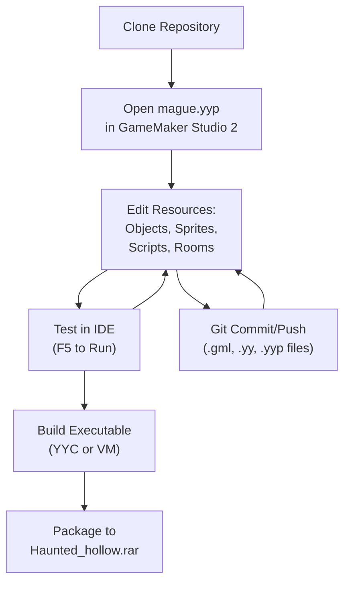

**Fuentes:**

* [mague.yyp L1-L338](https://github.com/axchisan/Haunted_hollow/blob/96079758/magician project1/mague.yyp#L1-L338)
* [.gitattributes L1-L8](https://github.com/axchisan/Haunted_hollow/blob/96079758/magician project1/.gitattributes#L1-L8)
* [.gitignore L1-L59](https://github.com/axchisan/Haunted_hollow/blob/96079758/magician project1/.gitignore#L1-L59)

---

## Estructura de archivos del proyecto GameMaker

El proyecto se define en `mague.yyp`, un archivo de configuración basado en JSON que enumera todos los recursos del juego y su organización. GameMaker Studio 2 utiliza este archivo como punto de entrada para cargar el proyecto.

### Metadatos del proyecto

El archivo del proyecto define la configuración principal:

| Propiedad | Valor | Descripción |
| --- | --- | --- |
| `name` | `"mague"` | Identificador de proyecto utilizado en todo el código base |
| `$GMProject` | `""` | Marcador de tipo de proyecto de GameMaker |
| `defaultScriptType` | `1` | Formato de script GML (1 = GML2) |
| `isEcma` | `false` | Compatibilidad con ECMAScript deshabilitada |
| `templateType` | `"game"` | Clasificación de plantillas de proyecto |
| `IDEVersion` | `"2024.4.0.137"` | Versión de GameMaker Studio 2 |

**Fuentes:**

* [mague.yyp L1-L11](https://github.com/axchisan/Haunted_hollow/blob/96079758/magician project1/mague.yyp#L1-L11)
* [mague.yyp L80-L84](https://github.com/axchisan/Haunted_hollow/blob/96079758/magician project1/mague.yyp#L80-L84)
* [mague.yyp L334](https://github.com/axchisan/Haunted_hollow/blob/96079758/magician project1/mague.yyp#L334-L334)

### Jerarquía de carpetas

El proyecto organiza los recursos en una estructura jerárquica de carpetas definida en la `Folders`matriz. Cada entrada de carpeta contiene un `folderPath`atributo que se asigna a la estructura de carpetas virtuales visible en el IDE de GameMaker.

```mermaid
flowchart TD

ROOT["mague.yyp<br>(Project Root)"]
SPRITES["Sprites/<br>Visual Assets"]
OBJECTS["Objects/<br>Game Entities"]
ROOMS["Rooms/<br>Levels"]
SCRIPTS["Scripts/<br>GML Functions"]
SOUNDS["Sounds/<br>Audio Files"]
FONTS["Fonts/<br>Typography"]
TILESETS["Tile Sets/<br>Level Textures"]
DATAFILES["datafiles/<br>gothic-pixel-font.ttf"]
OBJ_PLAYER["Player/<br>Obj_magician"]
OBJ_BOSS["Boss/<br>Obj_boss"]
OBJ_ENEMIES["enemys/<br>gray, green, red"]
OBJ_LEVEL["Level/<br>questions, npc,<br>obstrucciones"]
OBJ_HUD["Hud/<br>Obj_healt_bar"]
SCR_PLAYER["player/<br>scrHandleMovement<br>scrHandleShooting"]
SCR_TEXTBOX["textbox/<br>scrOpenTexbox<br>scrSplitText"]
SCR_SYSTEM["system/<br>scrCheckPlayerDeath<br>scrGamereset"]
SPR_PLAYER["Player/<br>down, up, left, right,<br>baston, hands, weapons"]
SPR_ENEMIES["enemys/<br>phantom/gray/green/red"]
SPR_LEVEL["Level/<br>questions, Shaders"]

ROOT --> SPRITES
ROOT --> OBJECTS
ROOT --> ROOMS
ROOT --> SCRIPTS
ROOT --> SOUNDS
ROOT --> FONTS
ROOT --> TILESETS
ROOT --> DATAFILES
OBJECTS --> OBJ_PLAYER
OBJECTS --> OBJ_BOSS
OBJECTS --> OBJ_ENEMIES
OBJECTS --> OBJ_LEVEL
OBJECTS --> OBJ_HUD
SCRIPTS --> SCR_PLAYER
SCRIPTS --> SCR_TEXTBOX
SCRIPTS --> SCR_SYSTEM
SPRITES --> SPR_PLAYER
SPRITES --> SPR_ENEMIES
SPRITES --> SPR_LEVEL
```

**Categorías de carpetas clave:**

| Carpeta | Objetivo | Recursos de ejemplo |
| --- | --- | --- |
| `Objects/` | Entidades de juego con lógica de comportamiento | `Obj_magician`, `Obj_boss`,`Obj_phantom` |
| `Sprites/` | Gráficos visuales y animaciones | `Spr_magician_walk_down`,`Spr_boss_left` |
| `Scripts/` | Funciones GML reutilizables | `scrHandleMovement`,`scrHandleShooting` |
| `Rooms/` | Definiciones y diseños de niveles | `Room1`, `Room_question1-6`,`jefe` |
| `Sounds/` | Recursos de audio | `music1`, `fire`, `hit`,`screamphantom` |
| `Fonts/` | Recursos tipográficos | `fnt_medieval` |
| `datafiles/` | Archivos externos incluidos con el juego | `gothic-pixel-font.ttf` |

**Fuentes:**

* [mague.yyp L12-L75](https://github.com/axchisan/Haunted_hollow/blob/96079758/magician project1/mague.yyp#L12-L75)
* [mague.yyp L77-L79](https://github.com/axchisan/Haunted_hollow/blob/96079758/magician project1/mague.yyp#L77-L79)

### Registro de recursos

All game resources must be registered in the `resources` array. Each entry links a resource name to its `.yy` definition file:

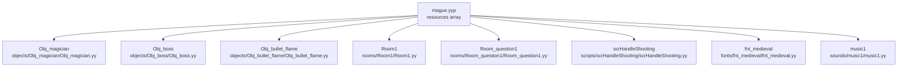

The resources array spans [lines 86-317](https://github.com/axchisan/Haunted_hollow/blob/96079758/lines 86-317)

 and includes:

* **Objects**: 69 registered objects (player, enemies, NPCs, UI elements, questions)
* **Rooms**: 12 rooms (menu, cinematics, main hub, 6 question rooms, boss room, credits)
* **Scripts**: 19 script files
* **Sounds**: 14 audio assets
* **Sprites**: 160+ sprite definitions
* **Fonts**: 1 custom font (`fnt_medieval`)
* **Tilesets**: 6 tileset definitions

**Sources:**

* [magician L86-L317](https://github.com/axchisan/Haunted_hollow/blob/96079758/magician project1/mague.yyp#L86-L317)

### Room Order Configuration

The `RoomOrderNodes` array defines the sequence in which rooms appear in the IDE's room list. This does **not** control gameplay progression (which is handled by `room_goto()` calls in code), but helps organize the development workspace:

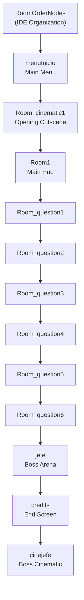

**Sources:**

* [magician L320-L333](https://github.com/axchisan/Haunted_hollow/blob/96079758/magician project1/mague.yyp#L320-L333)

---

## Version Control Configuration

The project uses Git for version control with custom configurations to handle GameMaker's metadata files correctly.

### Git Attributes (.gitattributes)

The `.gitattributes` file configures how Git handles GameMaker-specific files:

| Line | Configuration | Purpose |
| --- | --- | --- |
| `2` | `*.yy linguist-generated=true` | Marks `.yy` metadata files as generated code for GitHub language statistics, preventing them from being counted as primary codebase language |
| `5` | `*.gml text eol=lf` | Forces LF (Unix-style) line endings for GML script files to ensure consistent merges across Windows/Mac/Linux |
| `6` | `*.yy text eol=lf` | Forces LF line endings for GameMaker resource definition files |
| `7` | `*.yyp text eol=lf` | Forces LF line endings for project files |
| `8` | `*.json text eol=lf` | Forces LF line endings for JSON files |

**Rationale:** GameMaker generates `.yy` files automatically when resources are modified. By standardizing line endings to LF, merge conflicts are reduced when multiple developers collaborate. The `linguist-generated` attribute ensures GitHub doesn't misrepresent the project as primarily JSON-based.

**Sources:**

* [magician L1-L8](https://github.com/axchisan/Haunted_hollow/blob/96079758/magician project1/.gitattributes#L1-L8)

### Git Ignore Patterns (.gitignore)

The `.gitignore` file excludes temporary files and OS-specific artifacts from version control:

#### Operating System Exclusions

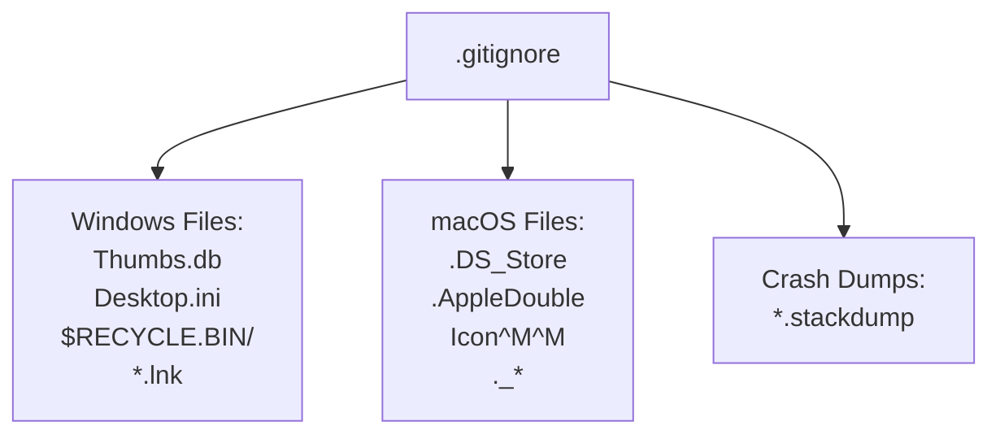

**Windows patterns** (lines 3-26):

* `Thumbs.db` - Thumbnail cache files
* `Desktop.ini` - Folder configuration
* `$RECYCLE.BIN/` - Recycle bin directory
* `*.cab`, `*.msi`, `*.msix`, `*.msm`, `*.msp` - Windows installer files
* `*.lnk` - Windows shortcuts

**macOS patterns** (lines 28-55):

* `.DS_Store` - Finder metadata
* `.AppleDouble`, `.LSOverride` - Resource fork files
* `._*` - AppleDouble files
* `.Spotlight-V100`, `.fseventsd` - System directories

**Sources:**

* [magician L1-L55](https://github.com/axchisan/Haunted_hollow/blob/96079758/magician project1/.gitignore#L1-L55)

#### GameMaker-Specific Exclusions

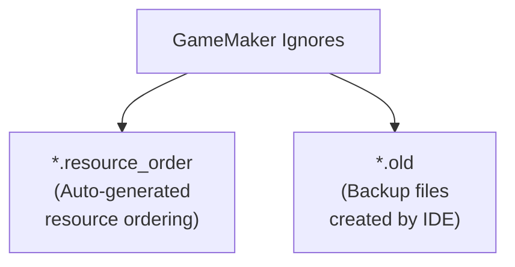

**GameMaker patterns** (lines 57-59):

* `*.resource_order` - Auto-generated files tracking resource list order in IDE
* `*.old` - Backup files created when GameMaker modifies resources

These files are regenerated by the IDE and should not be committed to avoid merge conflicts.

**Sources:**

* [magician L57-L59](https://github.com/axchisan/Haunted_hollow/blob/96079758/magician project1/.gitignore#L57-L59)

---

## Development Environment Setup

### Prerequisites

1. **GameMaker Studio 2**: Version 2024.4.0.137 or compatible
2. **Operating System**: Windows 10/11 (primary), macOS, or Linux (with Wine)
3. **Git**: For version control

### Opening the Project

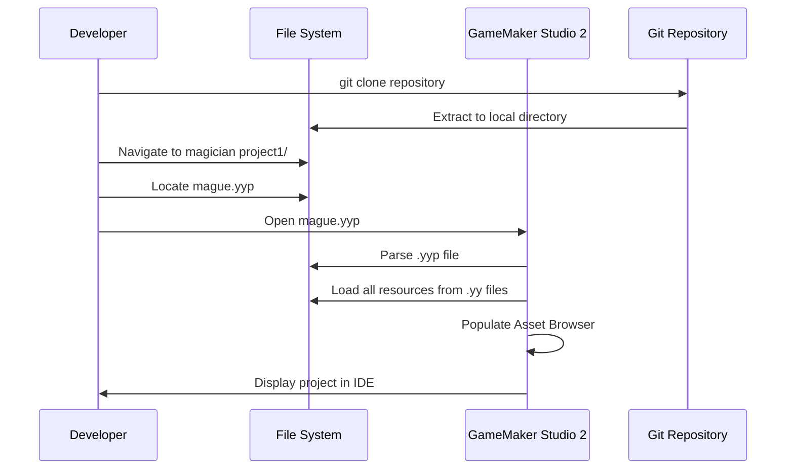

**Steps:**

1. Clone the repository containing the `magician project1/` directory
2. Launch GameMaker Studio 2
3. Select **File → Open Project**
4. Navigate to `magician project1/mague.yyp`
5. GameMaker will parse the project file and load all resources

**Sources:**

* [magician L1-L338](https://github.com/axchisan/Haunted_hollow/blob/96079758/magician project1/mague.yyp#L1-L338)

### Project Configuration Details

#### Audio Groups

The project uses a single audio group for all sounds:

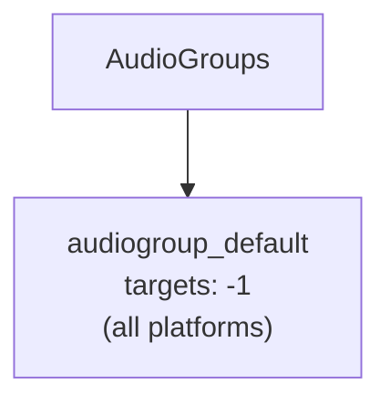

* **Name**: `audiogroup_default`
* **Targets**: `-1` (all platforms)
* **Purpose**: Groups all audio assets for efficient loading and memory management

**Sources:**

* [magician L4-L6](https://github.com/axchisan/Haunted_hollow/blob/96079758/magician project1/mague.yyp#L4-L6)

#### Texture Groups

The project uses a single texture group with default settings:

| Property | Value | Description |
| --- | --- | --- |
| `name` | `"Default"` | Texture group identifier |
| `autocrop` | `true` | Automatically removes transparent edges from sprites |
| `border` | `2` | Adds 2-pixel border around sprites to prevent texture bleeding |
| `compressFormat` | `"bz2"` | Uses BZ2 compression for texture pages |
| `loadType` | `"default"` | Standard texture loading behavior |
| `isScaled` | `true` | Allows texture scaling based on platform |
| `targets` | `-1` | Available on all platforms |

**Sources:**

* [magician L335-L337](https://github.com/axchisan/Haunted_hollow/blob/96079758/magician project1/mague.yyp#L335-L337)

#### Build Configurations

The project uses the default configuration with no custom build configs:

```
"configs": {
  "children": [],
  "name": "Default"
}
```

**Sources:**

* [magician L7-L10](https://github.com/axchisan/Haunted_hollow/blob/96079758/magician project1/mague.yyp#L7-L10)

---

## Build and Distribution Process

### Compilation Workflow

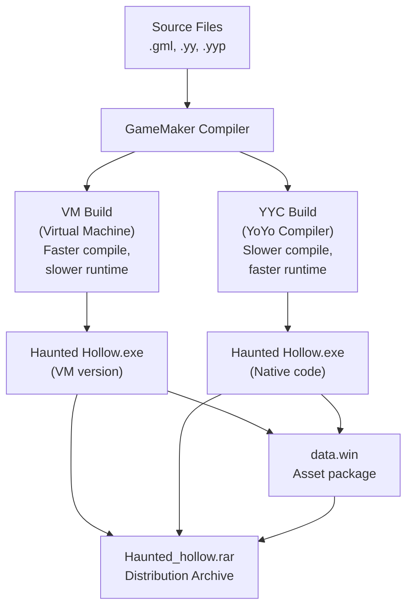

### Build Methods

#### VM (Virtual Machine) Build

* **Speed**: Fast compilation (seconds)
* **Performance**: Interpreted at runtime, slower execution
* **Use Case**: Development and testing
* **Command**: Press `F5` in GameMaker IDE or select **Build → Run**

#### YYC (YoYo Compiler) Build

* **Speed**: Slow compilation (minutes)
* **Performance**: Compiled to native code, faster execution
* **Use Case**: Final release builds
* **Command**: Select **Build → Create Executable** with YYC target

**Sources:**

* Context from GameMaker Studio 2 documentation and project structure

### Distribution Package Structure

The final distribution is packaged as `Haunted_hollow.rar`, which contains:

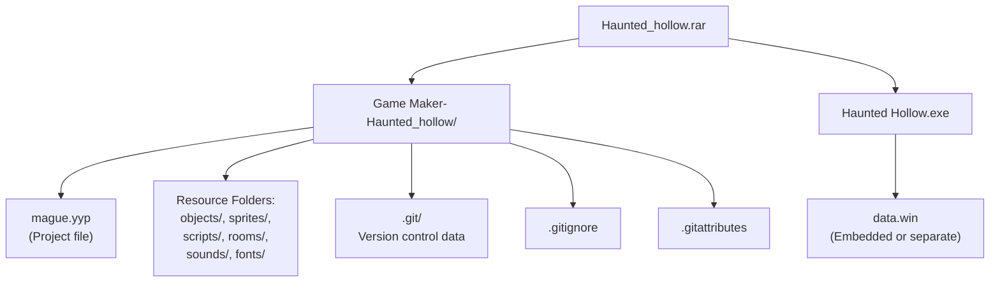

**Package Contents:**

1. **Source Project**: Complete GameMaker project for modification
2. **Compiled Executable**: Standalone game for end users
3. **Version Control**: Git repository data for tracking changes

**Sources:**

* Referenced in overview diagrams and project context

---

## Resource Management

### Adding New Resources

When adding new resources to the project:

1. **Create Resource in IDE**: Use GameMaker's asset browser to create the resource
2. **Automatic Registration**: GameMaker automatically adds the resource to `mague.yyp`
3. **Folder Assignment**: Place the resource in an appropriate folder via the IDE
4. **File Generation**: GameMaker creates the `.yy` definition file
5. **Commit Changes**: Add both the `.yy` file and updated `mague.yyp` to Git

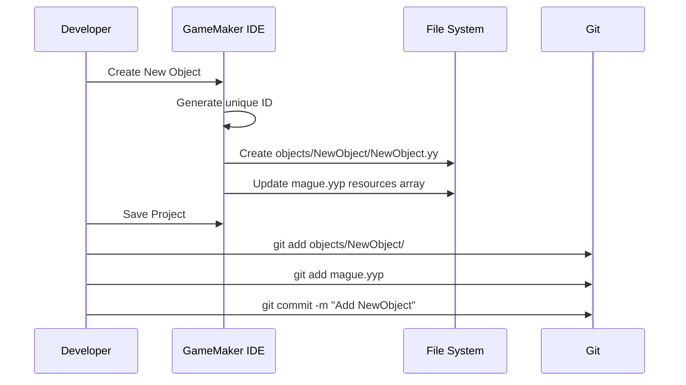

**Sources:**

* [magician L86-L317](https://github.com/axchisan/Haunted_hollow/blob/96079758/magician project1/mague.yyp#L86-L317)
* [magician L5-L7](https://github.com/axchisan/Haunted_hollow/blob/96079758/magician project1/.gitattributes#L5-L7)

### Formato de archivo de recursos

Cada recurso tiene un `.yy`archivo correspondiente con estructura JSON. Ejemplo de estructura para un objeto:

```sql
objects/
  Obj_example/
    Obj_example.yy          # Resource definition (JSON)
    Create_0.gml            # Create event code
    Step_0.gml              # Step event code
    Collision_<object>.gml  # Collision event code
```

El `.yy`archivo hace referencia a los scripts de eventos por nombre y GameMaker los carga en tiempo de ejecución.

**Fuentes:**

* Contexto de las convenciones de estructura de archivos de GameMaker Studio 2

---

## Mejores prácticas de desarrollo

### Organización del guión

Los scripts están organizados en categorías funcionales:

| Categoría | Carpeta | Objetivo | Ejemplos |
| --- | --- | --- | --- |
| Lógica del jugador | `Scripts/player/` | Movimiento del jugador, combate, gestión del estado. | `scrHandleMovement`, `scrHandleShooting`,`scrInitializePlayer` |
| Sistema de cuadro de texto | `Scripts/textbox/` | Diálogo y representación de texto | `scrOpenTexbox`, `scrSplitText`,`scrSplitTextintoPages` |
| Funciones del sistema | `Scripts/system/` | Utilidades para todo el juego | `scrCheckPlayerDeath`,`scrGamereset` |
| Comportamiento del personaje | `Scripts/characters/` | Lógica de los NPC y los enemigos | `scrFaceTo`,`scrFinishCharacterReading` |
| Interacción | `Scripts/`(raíz) | Interacción jugador-objeto | `scrPlayerCheckInteraction`,`scrGetNearbyObject` |

**Fuentes:**

* [mague.yyp L40-L45](https://github.com/axchisan/Haunted_hollow/blob/96079758/magician project1/mague.yyp#L40-L45)
* [mague.yyp L173-L190](https://github.com/axchisan/Haunted_hollow/blob/96079758/magician project1/mague.yyp#L173-L190)

### Convenciones de nomenclatura

El código base sigue estos patrones de nombres:

| Tipo | Patrón | Ejemplo |
| --- | --- | --- |
| Objetos | `Obj_<name>` | `Obj_magician`, `Obj_boss`,`Obj_phantom` |
| Sprites | `Spr_<name>` | `Spr_magician_walk_down`,`Spr_boss_left` |
| Guiones | `scr<Action>` | `scrHandleMovement`,`scrOpenTexbox` |
| Sonidos | Descriptivo en minúsculas | `music1`, `fire`,`screamphantom` |
| Alojamiento | `Room_<name>`o descriptivo | `Room1`, `Room_question1`, `menuInicio`,`jefe` |
| Fuentes | `fnt_<name>` | `fnt_medieval` |

**Fuentes:**

* [mague.yyp L86-L317](https://github.com/axchisan/Haunted_hollow/blob/96079758/magician project1/mague.yyp#L86-L317) (análisis de nombres de recursos)

### Flujo de trabajo de control de versiones

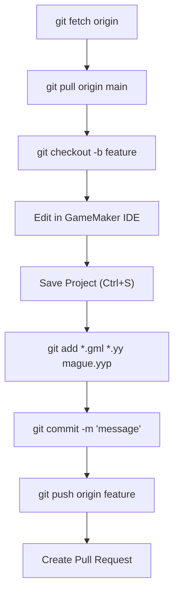

**Flujo de trabajo recomendado:**

1. Siempre extraiga los últimos cambios antes de comenzar a trabajar
2. Crear ramas de características para nuevos trabajos
3. Comprométete frecuentemente con mensajes descriptivos
4. Etapa `.gml`, `.yy`, y `.yyp`archivos juntos
5. Evite comprometer `*.resource_order`archivos`*.old`

**Fuentes:**

* [.gitignore L57-L59](https://github.com/axchisan/Haunted_hollow/blob/96079758/magician project1/.gitignore#L57-L59)
* [.gitattributes L1-L8](https://github.com/axchisan/Haunted_hollow/blob/96079758/magician project1/.gitattributes#L1-L8)