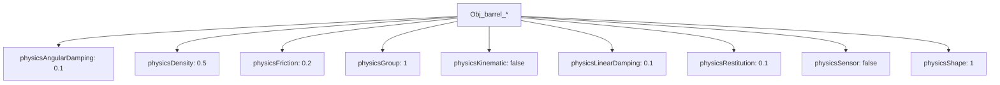
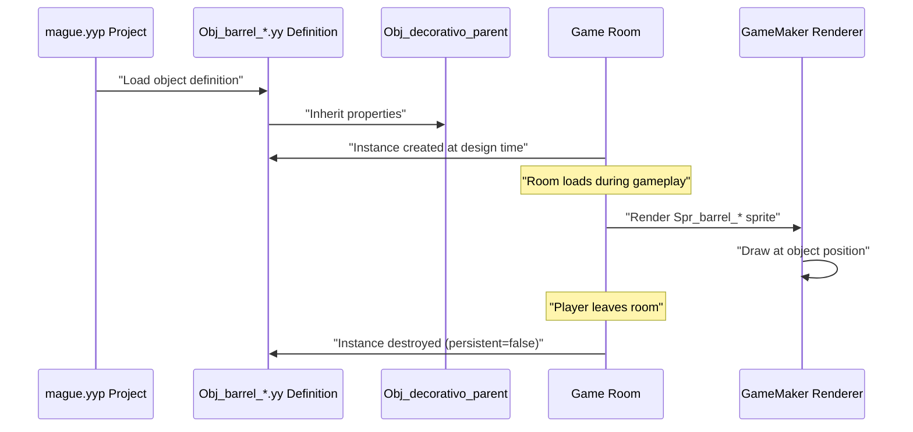
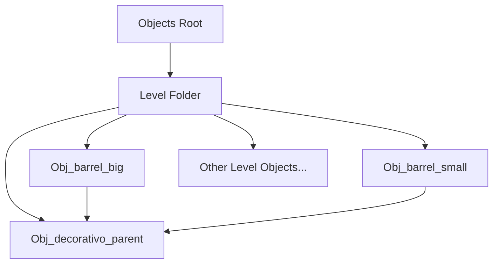

# Decorative Objects

> **Relevant source files**
> * [magician project1/objects/Obj_barrel_big/Obj_barrel_big.yy](https://github.com/axchisan/Haunted_hollow/blob/96079758/magician project1/objects/Obj_barrel_big/Obj_barrel_big.yy)
> * [magician project1/objects/Obj_barrel_small/Obj_barrel_small.yy](https://github.com/axchisan/Haunted_hollow/blob/96079758/magician project1/objects/Obj_barrel_small/Obj_barrel_small.yy)

## Purpose and Scope

This document covers the decorative environmental objects in Haunted Hollow, specifically the barrel objects used to enhance visual atmosphere in game levels. These objects serve purely aesthetic purposes and do not affect gameplay mechanics. For collision-based environmental objects that block player movement, see page [6](/axchisan/Haunted_hollow/6-level-design-and-environment) Level Design and Environment.

## Inheritance Structure

Decorative objects in Haunted Hollow follow an object-oriented inheritance pattern. All decorative elements inherit from a common parent object `Obj_decorativo_parent`, which establishes shared baseline properties. This architecture allows for consistent behavior across all decorative objects while enabling individual variants.

```

```

**Sources:**

* [magician L12-L15](https://github.com/axchisan/Haunted_hollow/blob/96079758/magician project1/objects/Obj_barrel_big/Obj_barrel_big.yy#L12-L15)
* [magician L12-L15](https://github.com/axchisan/Haunted_hollow/blob/96079758/magician project1/objects/Obj_barrel_small/Obj_barrel_small.yy#L12-L15)

## Object Configuration

Both barrel objects share identical configuration properties inherited from their parent. The following table summarizes their common characteristics:

| Property | Value | Description |
| --- | --- | --- |
| `solid` | `false` | Objects do not block player or enemy movement |
| `visible` | `true` | Objects are rendered in the game scene |
| `persistent` | `false` | Objects are destroyed when leaving the room |
| `physicsObject` | `false` | Objects do not participate in physics simulation |
| `eventList` | `[]` | No custom event handlers defined |

**Sources:**

* [magician L4-L38](https://github.com/axchisan/Haunted_hollow/blob/96079758/magician project1/objects/Obj_barrel_big/Obj_barrel_big.yy#L4-L38)
* [magician L4-L38](https://github.com/axchisan/Haunted_hollow/blob/96079758/magician project1/objects/Obj_barrel_small/Obj_barrel_small.yy#L4-L38)

## Physics Properties

Despite having `physicsObject` set to `false`, both barrel objects retain GameMaker's default physics property definitions for potential future use:



These properties are inactive since `physicsObject` is disabled, meaning barrels function as simple visual decorations without collision or physics interactions.

**Sources:**

* [magician L17-L28](https://github.com/axchisan/Haunted_hollow/blob/96079758/magician project1/objects/Obj_barrel_big/Obj_barrel_big.yy#L17-L28)
* [magician L17-L28](https://github.com/axchisan/Haunted_hollow/blob/96079758/magician project1/objects/Obj_barrel_small/Obj_barrel_small.yy#L17-L28)

## Barrel Variants

The game includes two barrel variants differentiated solely by their visual representation:

### Obj_barrel_big

The large barrel variant uses the `Spr_barrel_big` sprite for rendering. This object is defined at [magician project1/objects/Obj_barrel_big/Obj_barrel_big.yy](https://github.com/axchisan/Haunted_hollow/blob/96079758/magician project1/objects/Obj_barrel_big/Obj_barrel_big.yy)

**Key Properties:**

* **Sprite:** `Spr_barrel_big` [magician L33-L36](https://github.com/axchisan/Haunted_hollow/blob/96079758/magician project1/objects/Obj_barrel_big/Obj_barrel_big.yy#L33-L36)
* **Parent Folder:** `Level` [magician L8-L11](https://github.com/axchisan/Haunted_hollow/blob/96079758/magician project1/objects/Obj_barrel_big/Obj_barrel_big.yy#L8-L11)
* **Parent Object:** `Obj_decorativo_parent` [magician L12-L15](https://github.com/axchisan/Haunted_hollow/blob/96079758/magician project1/objects/Obj_barrel_big/Obj_barrel_big.yy#L12-L15)

### Obj_barrel_small

The small barrel variant uses the `Spr_barrel_small` sprite for rendering. This object is defined at [magician project1/objects/Obj_barrel_small/Obj_barrel_small.yy](https://github.com/axchisan/Haunted_hollow/blob/96079758/magician project1/objects/Obj_barrel_small/Obj_barrel_small.yy)

**Key Properties:**

* **Sprite:** `Spr_barrel_small` [magician L33-L36](https://github.com/axchisan/Haunted_hollow/blob/96079758/magician project1/objects/Obj_barrel_small/Obj_barrel_small.yy#L33-L36)
* **Parent Folder:** `Level` [magician L8-L11](https://github.com/axchisan/Haunted_hollow/blob/96079758/magician project1/objects/Obj_barrel_small/Obj_barrel_small.yy#L8-L11)
* **Parent Object:** `Obj_decorativo_parent` [magician L12-L15](https://github.com/axchisan/Haunted_hollow/blob/96079758/magician project1/objects/Obj_barrel_small/Obj_barrel_small.yy#L12-L15)

## Object Lifecycle

The following diagram illustrates the lifecycle of decorative barrel objects from project definition to runtime rendering:



Since `persistent` is `false`, barrel instances are destroyed when the player transitions between rooms and must be recreated when returning.

**Sources:**

* [magician L16](https://github.com/axchisan/Haunted_hollow/blob/96079758/magician project1/objects/Obj_barrel_big/Obj_barrel_big.yy#L16-L16)
* [magician L16](https://github.com/axchisan/Haunted_hollow/blob/96079758/magician project1/objects/Obj_barrel_small/Obj_barrel_small.yy#L16-L16)

## Integration with Level System

Decorative objects are organized within the project's folder hierarchy under the `Level` category. This categorization groups all level-related assets, including collision blocks, obstructions, and decorative elements:



This organizational structure allows level designers to easily identify and place decorative objects when designing game rooms.

**Sources:**

* [magician L8-L11](https://github.com/axchisan/Haunted_hollow/blob/96079758/magician project1/objects/Obj_barrel_big/Obj_barrel_big.yy#L8-L11)
* [magician L8-L11](https://github.com/axchisan/Haunted_hollow/blob/96079758/magician project1/objects/Obj_barrel_small/Obj_barrel_small.yy#L8-L11)

## Technical Specifications

Both barrel objects share the following GameMaker resource metadata:

| Field | Value | Purpose |
| --- | --- | --- |
| `$GMObject` | `""` | GameMaker object type identifier |
| `resourceType` | `"GMObject"` | Resource classification |
| `resourceVersion` | `"2.0"` | GameMaker resource format version |
| `managed` | `true` | Object is managed by GameMaker runtime |
| `overriddenProperties` | `[]` | No parent properties are overridden |
| `properties` | `[]` | No custom properties defined |
| `spriteMaskId` | `null` | No collision mask sprite |

The absence of `overriddenProperties` and custom `properties` indicates that these objects rely entirely on inherited behavior from `Obj_decorativo_parent` with only sprite differentiation.

**Sources:**

* [magician L1-L37](https://github.com/axchisan/Haunted_hollow/blob/96079758/magician project1/objects/Obj_barrel_big/Obj_barrel_big.yy#L1-L37)
* [magician L1-L37](https://github.com/axchisan/Haunted_hollow/blob/96079758/magician project1/objects/Obj_barrel_small/Obj_barrel_small.yy#L1-L37)