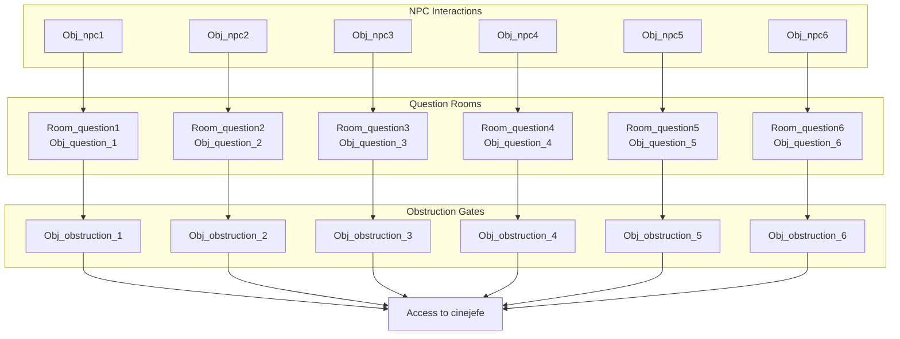
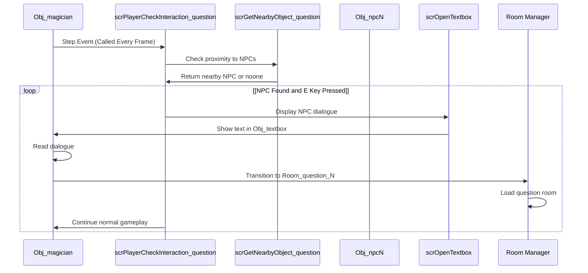
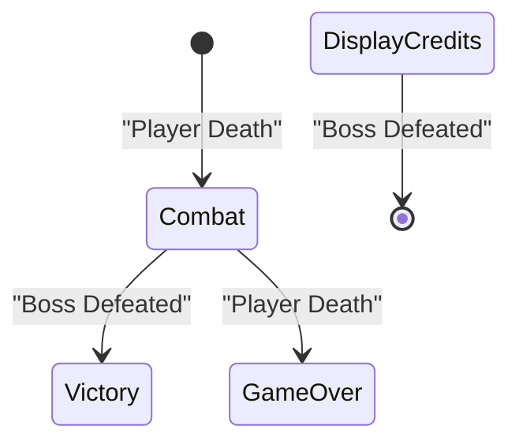

# Game Flow and Progression

> **Relevant source files**
> * [README.md](https://github.com/axchisan/Haunted_hollow/blob/96079758/README.md)
> * [magician project1/mague.yyp](https://github.com/axchisan/Haunted_hollow/blob/96079758/magician project1/mague.yyp)

## Purpose and Scope

This document describes the room-based progression system and gating mechanisms in Haunted Hollow. It covers how players advance through the game's rooms, how the obstruction system enforces educational checkpoints, and the overall flow from menu to credits. For details on the educational question system itself, see [Educational System Integration](/axchisan/Haunted_hollow/3.3-educational-system-integration). For combat mechanics within rooms, see [Combat Architecture](/axchisan/Haunted_hollow/3.2-combat-architecture).

---

## Room Progression Overview

Haunted Hollow uses a linear room progression model with a central hub. The game defines 12 rooms in a specific order that determines the player's journey.

### Complete Room Flow

```

```

**Sources:** [magician L320-L332](https://github.com/axchisan/Haunted_hollow/blob/96079758/magician project1/mague.yyp#L320-L332)

---

## Room Order Definition

The `RoomOrderNodes` array in the project file defines the exact sequence of room transitions:

| Order Index | Room Name | Purpose |
| --- | --- | --- |
| 0 | `menuInicio` | Main menu screen |
| 1 | `Room_cinematic1` | Opening story sequence |
| 2 | `Room1` | Central hub for exploration and combat |
| 3-8 | `Room_question1` through `Room_question6` | Educational quiz rooms |
| 9 | `jefe` | Boss fight arena |
| 10 | `credits` | End credits |
| 11 | `cinejefe` | Boss introduction cinematic |

**Sources:** [magician L320-L332](https://github.com/axchisan/Haunted_hollow/blob/96079758/magician project1/mague.yyp#L320-L332)

---

## Hub-and-Spoke Model

`Room1` serves as the central hub where all gameplay occurs outside of cinematics and question rooms. Players spawn in this room after the opening cinematic and return here after each question room.

### Hub Activities

```

```

**Sources:** [magician L121-L127](https://github.com/axchisan/Haunted_hollow/blob/96079758/magician project1/mague.yyp#L121-L127)

 [magician L128-L133](https://github.com/axchisan/Haunted_hollow/blob/96079758/magician project1/mague.yyp#L128-L133)

 [magician L139-L140](https://github.com/axchisan/Haunted_hollow/blob/96079758/magician project1/mague.yyp#L139-L140)

 [magician L135-L138](https://github.com/axchisan/Haunted_hollow/blob/96079758/magician project1/mague.yyp#L135-L138)

---

## Obstruction Gating System

Six obstruction objects block paths within `Room1`. Each obstruction is tied to a specific NPC and question room. Players cannot progress to the boss until all obstructions are removed.

### NPC-Obstruction-Question Mapping



**Sources:** [magician L121-L127](https://github.com/axchisan/Haunted_hollow/blob/96079758/magician project1/mague.yyp#L121-L127)

 [magician L128-L133](https://github.com/axchisan/Haunted_hollow/blob/96079758/magician project1/mague.yyp#L128-L133)

 [magician L146-L151](https://github.com/axchisan/Haunted_hollow/blob/96079758/magician project1/mague.yyp#L146-L151)

 [magician L166-L171](https://github.com/axchisan/Haunted_hollow/blob/96079758/magician project1/mague.yyp#L166-L171)

### Obstruction Removal Mechanism

Each question room contains:

* An `Obj_question_N` instance that displays the English comprehension challenge
* Two `Obj_checkbox_true_N` and `Obj_checkbox_false_N` objects for answer selection
* An `Obj_submit_button_N` object that validates the answer

When the player selects the correct answer and clicks submit:

1. The submit button checks which checkbox is selected
2. If correct, the corresponding `Obj_obstruction_N` instance is destroyed in `Room1`
3. The room transitions back to `Room1` using `room_goto(Room1)`
4. The player can now access previously blocked areas

**Sources:** [magician L97-L108](https://github.com/axchisan/Haunted_hollow/blob/96079758/magician project1/mague.yyp#L97-L108)

 [magician L103-L108](https://github.com/axchisan/Haunted_hollow/blob/96079758/magician project1/mague.yyp#L103-L108)

 [magician L152-L157](https://github.com/axchisan/Haunted_hollow/blob/96079758/magician project1/mague.yyp#L152-L157)

---

## Question Room Structure

Each of the six question rooms follows an identical structure with numbered variants of the same object types.

### Question Room Object Composition

```

```

**Sources:** [magician L166-L171](https://github.com/axchisan/Haunted_hollow/blob/96079758/magician project1/mague.yyp#L166-L171)

 [magician L146-L151](https://github.com/axchisan/Haunted_hollow/blob/96079758/magician project1/mague.yyp#L146-L151)

 [magician L97-L108](https://github.com/axchisan/Haunted_hollow/blob/96079758/magician project1/mague.yyp#L97-L108)

 [magician L103-L108](https://github.com/axchisan/Haunted_hollow/blob/96079758/magician project1/mague.yyp#L103-L108)

 [magician L152-L157](https://github.com/axchisan/Haunted_hollow/blob/96079758/magician project1/mague.yyp#L152-L157)

### Question Room Instances

| Room Name | Question Object | True Checkbox | False Checkbox | Submit Button | Destroys |
| --- | --- | --- | --- | --- | --- |
| `Room_question1` | `Obj_question_1` | `Obj_checkbox_true1` | `Obj_checkbox_false1` | `Obj_submit_button1` | `Obj_obstruction_1` |
| `Room_question2` | `Obj_question_2` | `Obj_checkbox_true2` | `Obj_checkbox_false2` | `Obj_submit_button2` | `Obj_obstruction_2` |
| `Room_question3` | `Obj_question_3` | `Obj_checkbox_true3` | `Obj_checkbox_false3` | `Obj_submit_button3` | `Obj_obstruction_3` |
| `Room_question4` | `Obj_question_4` | `Obj_checkbox_true4` | `Obj_checkbox_false4` | `Obj_submit_button4` | `Obj_obstruction_4` |
| `Room_question5` | `Obj_question_5` | `Obj_checkbox_true5` | `Obj_checkbox_false5` | `Obj_submit_button5` | `Obj_obstruction_5` |
| `Room_question6` | `Obj_question_6` | `Obj_checkbox_true6` | `Obj_checkbox_false6` | `Obj_submit_button6` | `Obj_obstruction_6` |

**Sources:** [magician L146-L157](https://github.com/axchisan/Haunted_hollow/blob/96079758/magician project1/mague.yyp#L146-L157)

 [magician L97-L108](https://github.com/axchisan/Haunted_hollow/blob/96079758/magician project1/mague.yyp#L97-L108)

---

## NPC Interaction and Room Transitions

NPCs use a specialized interaction system that differs from standard object interactions. The `scrPlayerCheckInteraction_question` script detects when the player is near an NPC and presses the interaction key.

### NPC Interaction Flow



**Sources:** [magician L185](https://github.com/axchisan/Haunted_hollow/blob/96079758/magician project1/mague.yyp#L185-L185)

 [magician L178](https://github.com/axchisan/Haunted_hollow/blob/96079758/magician project1/mague.yyp#L178-L178)

 [magician L184](https://github.com/axchisan/Haunted_hollow/blob/96079758/magician project1/mague.yyp#L184-L184)

### NPC Object Definitions

Each NPC is a separate object instance with a unique sprite:

* `Obj_npc0` - Uses `Spr_npc0_down`
* `Obj_npc1` through `Obj_npc6` - Use `Spr_npc1_down` through `Spr_npc6_down`

**Sources:** [magician L121-L127](https://github.com/axchisan/Haunted_hollow/blob/96079758/magician project1/mague.yyp#L121-L127)

 [magician L267-L273](https://github.com/axchisan/Haunted_hollow/blob/96079758/magician project1/mague.yyp#L267-L273)

---

## Victory and Defeat Conditions

The game has two terminal states: victory and defeat. Both trigger from events in the `jefe` room.

### Victory Condition

Victory occurs when `Obj_boss` health reaches zero. The boss object tracks its health in `global.boss_current_health`. When this value depletes:

1. The boss object is destroyed
2. Audio feedback plays (boss death sound)
3. The game transitions to the `credits` room using `room_goto(credits)`

### Defeat Condition

Defeat occurs when `Obj_magician` health reaches zero. Player health is tracked in `global.vida_actual`. The `scrCheckPlayerDeath` script monitors this value:

1. When `global.vida_actual <= 0`:
2. Death animation plays
3. Game over sound plays
4. The game transitions back to `menuInicio` using `room_goto(menuInicio)`

**Sources:** [magician L90](https://github.com/axchisan/Haunted_hollow/blob/96079758/magician project1/mague.yyp#L90-L90)

 [magician L120](https://github.com/axchisan/Haunted_hollow/blob/96079758/magician project1/mague.yyp#L120-L120)

 [magician L174](https://github.com/axchisan/Haunted_hollow/blob/96079758/magician project1/mague.yyp#L174-L174)

### Terminal State Transitions



**Sources:** [magician L162-L163](https://github.com/axchisan/Haunted_hollow/blob/96079758/magician project1/mague.yyp#L162-L163)

 [magician L164](https://github.com/axchisan/Haunted_hollow/blob/96079758/magician project1/mague.yyp#L164-L164)

---

## Progression Persistence

Haunted Hollow does not implement save states or checkpoints. Progression state exists only during the current play session:

* Destroyed `Obj_obstruction_N` instances remain destroyed within the session
* Returning to `menuInicio` (via game over) resets all progression
* All six questions must be answered correctly in a single playthrough

This design ensures players experience the complete educational content without skipping sections.

**Sources:** [magician L128-L133](https://github.com/axchisan/Haunted_hollow/blob/96079758/magician project1/mague.yyp#L128-L133)

---

## Room Transition Scripts

While individual objects handle specific transitions (e.g., submit buttons calling `room_goto(Room1)`), the game does not use a centralized room transition manager. Each transition point hard-codes its destination room:

* `Obj_button_play` in `menuInicio` → `Room_cinematic1`
* `Obj_cinematic1` auto-advances → `Room1`
* `Obj_submit_buttonN` → `Room1`
* Hub progression logic → `cinejefe` (when all obstructions cleared)
* `Obj_cinejefe` auto-advances → `jefe`
* Boss defeat → `credits`
* Player death → `menuInicio`

**Sources:** [magician L96](https://github.com/axchisan/Haunted_hollow/blob/96079758/magician project1/mague.yyp#L96-L96)

 [magician L111](https://github.com/axchisan/Haunted_hollow/blob/96079758/magician project1/mague.yyp#L111-L111)

 [magician L152-L157](https://github.com/axchisan/Haunted_hollow/blob/96079758/magician project1/mague.yyp#L152-L157)

 [magician L110](https://github.com/axchisan/Haunted_hollow/blob/96079758/magician project1/mague.yyp#L110-L110)