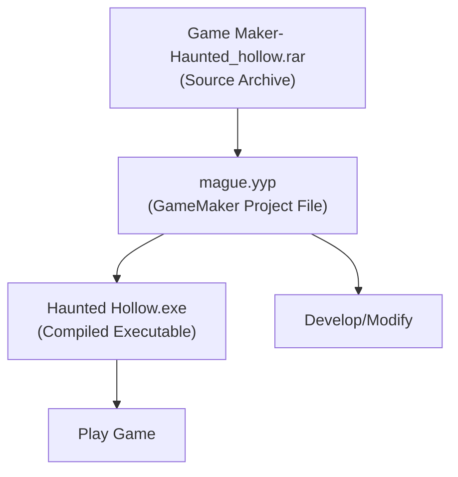
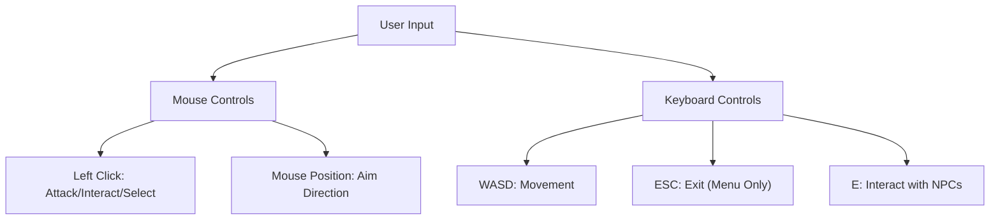
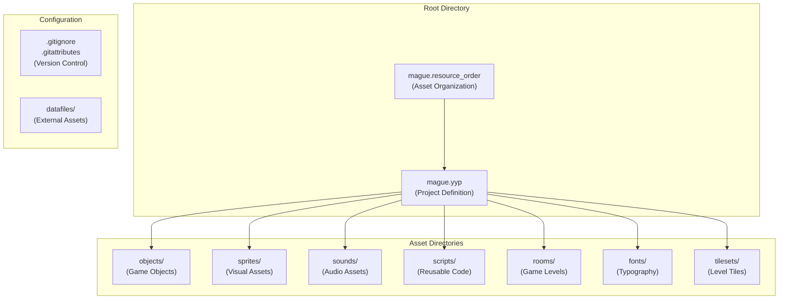
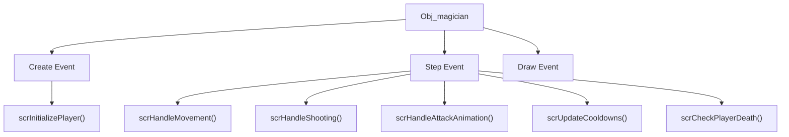
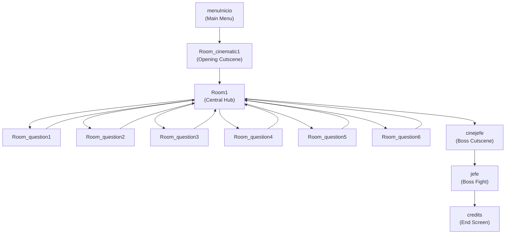

# Getting Started

> **Relevant source files**
> * [Game Maker- Haunted_hollow.rar](https://github.com/axchisan/Haunted_hollow/blob/96079758/Game Maker- Haunted_hollow.rar)
> * [Haunted Hollow.exe](https://github.com/axchisan/Haunted_hollow/blob/96079758/Haunted Hollow.exe)
> * [magician project1/mague.yyp](https://github.com/axchisan/Haunted_hollow/blob/96079758/magician project1/mague.yyp)

This page provides instructions for running the Haunted Hollow game and opening the project in GameMaker Studio 2 for development. It covers distribution file organization, prerequisites, and basic project navigation.

For information about the game's architecture and core systems, see [Architecture Overview](/axchisan/Haunted_hollow/3-architecture-overview).

---

## Distribution Files

The Haunted Hollow project is distributed in three primary forms, each serving different use cases:

### File Organization

| File | Purpose | Use Case |
| --- | --- | --- |
| `Game Maker- Haunted_hollow.rar` | Compressed project archive | Distribution and version control |
| `mague.yyp` | GameMaker Studio 2 project file | Development and modification |
| `Haunted Hollow.exe` | Compiled Windows executable | Playing the game |

**Sources:**

* [Game L1-L2](https://github.com/axchisan/Haunted_hollow/blob/96079758/Game Maker- Haunted_hollow.rar#L1-L2)
* High-level system diagrams (Diagram 1)

---

## Running the Compiled Game

### Prerequisites

* Windows operating system (Windows 7 or later recommended)
* No additional runtime dependencies required

### Execution Steps

1. Locate `Haunted Hollow.exe` in the distribution directory
2. Double-click the executable to launch
3. The game will start with the main menu (`menuInicio` room)

### Game Controls

The compiled game responds to the following inputs:

**Sources:**

* [magician project1/objects/Obj_magician/Create_0.gml](https://github.com/axchisan/Haunted_hollow/blob/96079758/magician project1/objects/Obj_magician/Create_0.gml)  (player initialization)
* [magician project1/objects/Obj_button_play/KeyPress_27.gml](https://github.com/axchisan/Haunted_hollow/blob/96079758/magician project1/objects/Obj_button_play/KeyPress_27.gml)  (ESC key handling)

---

## Opening the Project in GameMaker Studio 2

### Prerequisites

| Requirement | Version | Notes |
| --- | --- | --- |
| GameMaker Studio 2 | 2024.4.0.137 or compatible | IDE version specified in project metadata |
| Operating System | Windows | Primary development platform |

### Opening the Project

1. **Extract the Archive** * Extract `Game Maker- Haunted_hollow.rar` to a local directory * Preserve the folder structure during extraction
2. **Launch GameMaker Studio 2** * Open GameMaker Studio 2 IDE * Select "Open" from the File menu
3. **Locate Project File** * Navigate to the extracted directory * Open `magician project1/mague.yyp`
4. **Project Loading** * GameMaker will parse the project structure * All assets, objects, and rooms will be loaded into the IDE

### Project File Structure

**Sources:**

* [magician L1-L338](https://github.com/axchisan/Haunted_hollow/blob/96079758/magician project1/mague.yyp#L1-L338)
* [magician project1/mague.resource_order](https://github.com/axchisan/Haunted_hollow/blob/96079758/magician project1/mague.resource_order)

---

## Project Structure in GameMaker IDE

Once the project is loaded, the GameMaker IDE organizes assets into the following hierarchy:

### Asset Browser Organization

The left-hand asset browser displays folders as defined in `mague.yyp`:

| Folder | Contents | Key Objects |
| --- | --- | --- |
| **Objects/Player** | Player character logic | `Obj_magician` |
| **Objects/Boss** | Boss enemy system | `Obj_boss` |
| **Objects/enemys** | Phantom enemies (gray, green, red) | `Obj_phantom`, `Obj_phantom_green`, `Obj_phantom_red` |
| **Objects/Level** | Level infrastructure | `Obj_colision_block`, `Obj_obstruction_X` |
| **Objects/Level/questions** | Educational quiz system | `Obj_question_1` through `Obj_question_6` |
| **Objects/npc** | Non-player characters | `Obj_npc0` through `Obj_npc6` |
| **Scripts/player** | Player behavior functions | `scrHandleMovement`, `scrHandleShooting` |
| **Scripts/textbox** | Dialogue system | `scrOpenTexbox`, `scrSplitText` |
| **Rooms** | Game levels and menus | `menuInicio`, `Room1`, `jefe`, `Room_question1-6` |

**Sources:**

* [magician L12-L76](https://github.com/axchisan/Haunted_hollow/blob/96079758/magician project1/mague.yyp#L12-L76)  (folder definitions)
* [magician L86-L317](https://github.com/axchisan/Haunted_hollow/blob/96079758/magician project1/mague.yyp#L86-L317)  (resource listings)

---

## Key Entry Points for Development

### Main Game Object

The player object (`Obj_magician`) is the primary entity to examine when understanding game mechanics. Its events call modular scripts that handle specific behaviors.

**Sources:**

* [magician project1/objects/Obj_magician/Obj_magician.yy](https://github.com/axchisan/Haunted_hollow/blob/96079758/magician project1/objects/Obj_magician/Obj_magician.yy)
* [magician project1/scripts/scrInitializePlayer/scrInitializePlayer.yy](https://github.com/axchisan/Haunted_hollow/blob/96079758/magician project1/scripts/scrInitializePlayer/scrInitializePlayer.yy)

### Room Progression Flow

Rooms are accessed via `room_goto(room_name)` function calls. The hub room `Room1` serves as the central location where all six question rooms branch from.

**Sources:**

* [magician L320-L333](https://github.com/axchisan/Haunted_hollow/blob/96079758/magician project1/mague.yyp#L320-L333)  (room order definitions)
* [magician project1/objects/Obj_button_play/Mouse_4.gml](https://github.com/axchisan/Haunted_hollow/blob/96079758/magician project1/objects/Obj_button_play/Mouse_4.gml)  (menu to cinematic transition)

---

## Testing and Running from IDE

### Quick Testing

1. **Press F5** or click the "Run" button in GameMaker Studio 2
2. The game compiles and launches in a new window
3. Testing starts from the current room open in the editor

### Debug Mode

GameMaker Studio 2 provides debug features:

* **F6**: Run in debug mode with breakpoints and variable inspection
* **Watch variables**: Monitor `global.vida_actual` (player health) and `global.boss_current_health` (boss health)
* **Room switching**: Use the debugger to jump between rooms for testing specific areas

### Global Variables to Monitor

| Variable | Type | Purpose | Location |
| --- | --- | --- | --- |
| `global.vida_actual` | Integer | Player current health | Updated in damage collision events |
| `global.boss_current_health` | Integer | Boss current health | [objects/Obj_boss/Create_0.gml](https://github.com/axchisan/Haunted_hollow/blob/96079758/objects/Obj_boss/Create_0.gml) |
| `global.respuesta1` through `global.respuesta6` | Boolean | Question answers (true/false) | Set by checkbox objects |

**Sources:**

* [magician project1/objects/Obj_boss/Create_0.gml](https://github.com/axchisan/Haunted_hollow/blob/96079758/magician project1/objects/Obj_boss/Create_0.gml)  (boss health initialization)
* Collision event files in `Obj_bullet_flame` and enemy objects (damage application)

---

## Common Modifications

For developers looking to modify the game, here are typical starting points:

### Adjusting Player Stats

Edit [magician project1/objects/Obj_magician/Create_0.gml](https://github.com/axchisan/Haunted_hollow/blob/96079758/magician project1/objects/Obj_magician/Create_0.gml)

 to modify:

* Movement speed
* Health points
* Attack cooldown timers

### Adding New Question Rooms

1. Duplicate an existing question room (e.g., `Room_question1`)
2. Create corresponding objects: `Obj_question_X`, `Obj_checkbox_true/false_X`, `Obj_submit_button_X`
3. Add a new `Obj_npc_X` in `Room1` to trigger the question
4. Create `Obj_obstruction_X` that gets removed on correct answer

### Modifying Combat Balance

Enemy damage and health values are defined in their respective Create events:

* [objects/Obj_boss/Create_0.gml](https://github.com/axchisan/Haunted_hollow/blob/96079758/objects/Obj_boss/Create_0.gml)  for boss parameters
* [objects/Obj_phantom/Create_0.gml](https://github.com/axchisan/Haunted_hollow/blob/96079758/objects/Obj_phantom/Create_0.gml)  and variants for phantom enemies
* Bullet collision events for damage amounts

**Sources:**

* [magician project1/objects/Obj_magician/Create_0.gml](https://github.com/axchisan/Haunted_hollow/blob/96079758/magician project1/objects/Obj_magician/Create_0.gml)
* [magician project1/objects/Obj_boss/Create_0.gml](https://github.com/axchisan/Haunted_hollow/blob/96079758/magician project1/objects/Obj_boss/Create_0.gml)
* Question object and checkbox object event files

---

## Version Control Configuration

The project includes Git configuration files for development teams:

### .gitignore Configuration

The [.gitignore](https://github.com/axchisan/Haunted_hollow/blob/96079758/.gitignore)

 file excludes:

* Temporary build files
* IDE cache directories
* Compiled output (except intentional distributions)

### .gitattributes Configuration

The [.gitattributes](https://github.com/axchisan/Haunted_hollow/blob/96079758/.gitattributes)

 file specifies:

* Text file line ending handling
* Binary file identification for GameMaker assets

These configurations ensure consistent collaboration across development environments.

**Sources:**

* [magician project1/.gitignore](https://github.com/axchisan/Haunted_hollow/blob/96079758/magician project1/.gitignore)
* [magician project1/.gitattributes](https://github.com/axchisan/Haunted_hollow/blob/96079758/magician project1/.gitattributes)

---

## Next Steps

After successfully opening the project:

1. **Explore the main hub** - Run the game and navigate `Room1` to understand the level layout
2. **Review core scripts** - Examine scripts in the `Scripts/player` folder to understand player mechanics
3. **Study the boss system** - See [Boss Enemy System](/axchisan/Haunted_hollow/4-boss-enemy-system) for detailed documentation on boss behavior
4. **Understand educational integration** - See [Educational System Integration](/axchisan/Haunted_hollow/3.3-educational-system-integration) for quiz mechanics

For a comprehensive overview of how all systems interact, proceed to [Architecture Overview](/axchisan/Haunted_hollow/3-architecture-overview).